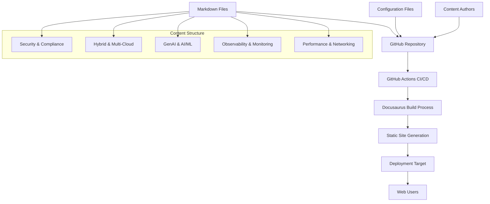

# Design Document

## Overview

EKS engineering-playbook은 Docusaurus 기반의 정적 웹사이트로 구축되며, GitHub 저장소에서 마크다운 문서를 관리하고 자동 배포하는 시스템입니다. 12개의 핵심 EKS 문서를 5개 기술 도메인으로 분류하여 체계적으로 제공합니다.

## Architecture

### High-Level Architecture



### System Components

1. **Content Management Layer**
   - GitHub 저장소를 통한 버전 관리
   - 마크다운 기반 문서 작성
   - 메타데이터 및 태그 시스템

2. **Build & Deployment Layer**
   - GitHub Actions 워크플로우
   - Docusaurus 빌드 프로세스
   - 자동 배포 파이프라인

3. **Presentation Layer**
   - Docusaurus 웹사이트
   - 반응형 UI/UX
   - 검색 및 네비게이션 기능

## Components and Interfaces

### 1. Repository Structure

```
engineering-playbook/
├── docs/                          # 주요 문서들
│   ├── performance-networking/     # Performance & Networking 도메인
│   ├── observability-monitoring/   # Observability & Monitoring 도메인
│   ├── genai-aiml/                # GenAI & AI/ML 도메인
│   ├── hybrid-multicloud/         # Hybrid & Multi-Cloud 도메인
│   └── security-compliance/       # Security & Compliance 도메인
├── blog/                          # 블로그 포스트 (시간순 정렬)
├── static/                        # 정적 자산 (이미지, 다이어그램)
├── docusaurus.config.js           # Docusaurus 설정
├── sidebars.js                    # 사이드바 구성
└── package.json                   # 의존성 관리
```

### 2. Content Management Interface

**Document Template Structure:**
```markdown
---
title: "Document Title"
description: "Brief description"
tags: [eks, performance, networking]
category: "performance-networking"
date: 2025-01-15
authors: [author-name]
---

# Document Content
[실제 기술 문서 내용]
```

**Metadata Schema:**
- `title`: 문서 제목
- `description`: 문서 요약
- `tags`: 검색 및 분류용 태그
- `category`: 5개 기술 도메인 중 하나
- `date`: 작성/수정 날짜
- `authors`: 작성자 정보

### 3. Build System Interface

**GitHub Actions Workflow:**
```yaml
name: Deploy Docusaurus
on:
  push:
    branches: [main]
  pull_request:
    branches: [main]

jobs:
  deploy:
    runs-on: ubuntu-latest
    steps:
      - uses: actions/checkout@v3
      - uses: actions/setup-node@v3
      - run: npm ci
      - run: npm run build
      - name: Deploy to GitHub Pages
        uses: peaceiris/actions-gh-pages@v3
```

### 4. Search and Navigation Interface

**Docusaurus Configuration:**
```javascript
module.exports = {
  title: 'EKS Engineering Playbook',
  tagline: 'Comprehensive EKS Architecture Deep Dive',
  
  themeConfig: {
    navbar: {
      items: [
        {to: '/docs/performance-networking', label: 'Performance & Networking'},
        {to: '/docs/observability-monitoring', label: 'Observability'},
        {to: '/docs/genai-aiml', label: 'GenAI & AI/ML'},
        {to: '/docs/hybrid-multicloud', label: 'Hybrid & Multi-Cloud'},
        {to: '/docs/security-compliance', label: 'Security'},
        {to: '/blog', label: 'Blog'}
      ]
    },
    
    algolia: {
      appId: 'APP_ID',
      apiKey: 'API_KEY',
      indexName: 'eks-playbook'
    }
  }
}
```

## Data Models

### 1. Document Model

```typescript
interface Document {
  id: string;
  title: string;
  description: string;
  content: string;
  tags: string[];
  category: TechnicalDomain;
  dateCreated: Date;
  dateModified: Date;
  authors: Author[];
  relatedDocuments: string[];
}

enum TechnicalDomain {
  PERFORMANCE_NETWORKING = 'performance-networking',
  OBSERVABILITY_MONITORING = 'observability-monitoring',
  GENAI_AIML = 'genai-aiml',
  HYBRID_MULTICLOUD = 'hybrid-multicloud',
  SECURITY_COMPLIANCE = 'security-compliance'
}
```

### 2. Category Model

```typescript
interface Category {
  id: TechnicalDomain;
  name: string;
  description: string;
  documents: Document[];
  icon: string;
  color: string;
}
```

### 3. Navigation Model

```typescript
interface NavigationItem {
  label: string;
  to: string;
  items?: NavigationItem[];
  category?: TechnicalDomain;
}
```

## Error Handling

### 1. Build Failures

**Markdown Parsing Errors:**
- 잘못된 frontmatter 형식 검증
- 깨진 링크 자동 감지
- 이미지 파일 누락 체크

**Build Process Errors:**
- Node.js 의존성 문제 해결
- Docusaurus 설정 오류 처리
- 배포 실패 시 롤백 메커니즘

### 2. Content Validation

**Document Structure Validation:**
```javascript
function validateDocument(doc) {
  const requiredFields = ['title', 'description', 'category', 'tags'];
  const missingFields = requiredFields.filter(field => !doc[field]);
  
  if (missingFields.length > 0) {
    throw new Error(`Missing required fields: ${missingFields.join(', ')}`);
  }
  
  if (!Object.values(TechnicalDomain).includes(doc.category)) {
    throw new Error(`Invalid category: ${doc.category}`);
  }
}
```

### 3. Deployment Error Handling

**GitHub Actions Error Recovery:**
- 빌드 실패 시 이전 버전 유지
- 배포 실패 알림 시스템
- 자동 재시도 메커니즘

## Testing Strategy

### 1. Content Testing

**Markdown Validation:**
- Frontmatter 스키마 검증
- 링크 유효성 검사
- 이미지 참조 확인

**Content Quality Checks:**
- 맞춤법 검사
- 코드 블록 문법 검증
- 메타데이터 일관성 확인

### 2. Build Testing

**Local Development:**
```bash
npm run start    # 개발 서버 실행
npm run build    # 프로덕션 빌드 테스트
npm run serve    # 빌드된 사이트 로컬 서빙
```

**Automated Testing:**
- GitHub Actions에서 빌드 테스트
- 링크 체커 자동 실행
- 성능 테스트 (Lighthouse CI)

### 3. User Experience Testing

**Responsive Design Testing:**
- 모바일 기기 호환성
- 다양한 화면 크기 대응
- 터치 인터페이스 최적화

**Search Functionality Testing:**
- Algolia 검색 인덱스 검증
- 태그 기반 필터링 테스트
- 카테고리 네비게이션 확인

### 4. Performance Testing

**Site Performance:**
- 페이지 로딩 속도 측정
- 이미지 최적화 확인
- CDN 캐싱 효율성 검증

**SEO Testing:**
- 메타 태그 최적화
- 구조화된 데이터 검증
- 사이트맵 생성 확인