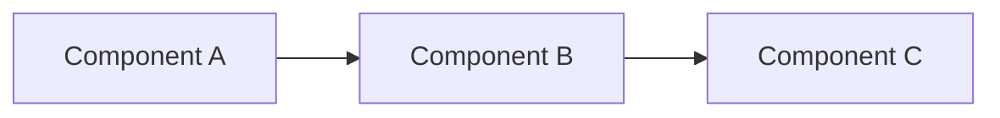

<!-- Generated: 2026-02-09 | Updated: 2026-02-09 -->

# engineering-playbook

## Purpose

**engineering-playbook** is a comprehensive Docusaurus 3.9.2 documentation site for Cloud Native Architecture and Best Practices. Hosted at https://devfloor9.github.io/engineering-playbook/, it serves as a central knowledge repository for infrastructure optimization, operations, observability, agentic AI platforms, hybrid infrastructure, security governance, and Red Hat OpenShift on AWS (ROSA) deployments.

The site supports dual-language documentation (Korean primary, English secondary) with advanced features including local search, Mermaid diagram rendering, progressive web app (PWA) functionality, and automated content validation scripts.

## Key Files

| File | Purpose | Notes |
|------|---------|-------|
| `package.json` | Node.js dependencies and npm scripts | Node.js >= 20 required |
| `docusaurus.config.js` | Site configuration (ESM format) | Title, logo, navbar, footer, plugins, themes |
| `sidebars.js` | Documentation sidebar structure (CJS format) | 6 main categories, 35+ articles, collapsible structure |
| `babel.config.js` | Babel transpiler configuration | Standard React/JSX transpilation |
| `algolia-config.json` | Algolia search indexing configuration | Currently commented out in docusaurus.config.js |
| `README.md` | Project overview | High-level documentation |
| `.gitignore` | Git ignore rules | Excludes build, node_modules, lock files |

## Subdirectories

| Directory | Purpose | Key Contents |
|-----------|---------|-------------|
| `docs/` | Main documentation content | 6 sections (see `docs/AGENTS.md`): intro.md + 6 category folders with 30+ articles |
| `src/` | React components and styling (see `src/AGENTS.md`) | /components, /pages, /css for custom UI |
| `scripts/` | Build and content automation (see `scripts/AGENTS.md`) | 9 utility scripts for validation, generation, indexing |
| `i18n/` | Internationalization files (see `i18n/AGENTS.md`) | Korean (ko) primary, English (en) secondary locales |
| `static/` | Static assets (see `static/AGENTS.md`) | Images, favicon, manifest.json for PWA |
| `.github/` | GitHub Actions CI/CD (see `.github/AGENTS.md`) | deploy.yml, link-check.yml workflows |
| `.claude/` | Claude Code configuration (see `.claude/AGENTS.md`) | Local Claude settings for this workspace |
| `.kiro/` | Kiro specs and templates | Project-specific specs and template hooks |
| `.omc/` | oh-my-claudecode state and logging | Multi-agent orchestration state files |
| `.docusaurus/` | Docusaurus build cache | Auto-generated, safe to delete |
| `build/` | Production build output | Generated by `npm run build`, deployed to GitHub Pages |
| `node_modules/` | NPM dependencies | 1000+ packages, auto-generated |

## For AI Agents

### Working In This Directory

**Core Responsibilities:**
- Maintain documentation across 6 technical domains (infrastructure, operations, AI, hybrid, security, ROSA)
- Ensure metadata validity (sidebar_position, tags, frontmatter) on all .md files in `docs/`
- Validate cross-references and internal links after structural changes
- Update `SUMMARY.md` when documentation structure changes (`npm run generate-summary`)
- Respect dual-language structure: Korean files are primary, English translations in `i18n/en/`

**File Modification Rules:**
- Documentation files (.md) live in `docs/{category}/` — use these for content work
- React components in `src/` — modify for UI/styling changes
- Build scripts in `scripts/` — modify for automation improvements
- `docusaurus.config.js` uses ESM (import/export) — respect this module format
- `sidebars.js` uses CJS (module.exports) — do not convert to ESM

**Documentation Standards:**
- All .md files must include frontmatter: `sidebar_position`, `title`, `description`, `tags`, `last_update`
- Category folders must have `index.md` serving as the landing page
- Use Mermaid for architecture/flow diagrams (syntax: ` ```mermaid ... ``` `)
- Code blocks support: bash, yaml, json, docker, hcl, python (defined in docusaurus.config.js)
- All links use relative paths: `/docs/section/article` (not absolute URLs)
- Korean is the primary language; English translations use `i18n/en/` directory structure

**Directory Structure Example:**
```
docs/
├── intro.md
├── infrastructure-optimization/
│   ├── index.md                              # Category landing page
│   ├── cilium-eni-gateway-api.md
│   ├── nginx-to-gateway-api-migration.md
│   └── ... (5 more articles)
├── operations-observability/
│   ├── index.md
│   ├── gitops-cluster-operation.md
│   └── ... (1 more article)
└── ... (4 more categories)
```

### Testing Requirements

**Pre-Deployment Checklist:**
1. **Build Success** (`npm run build`): Must complete without errors or warnings
2. **Metadata Validation** (`npm run validate-metadata`): All .md files must have valid frontmatter
3. **Link Validation** (`npm run validate-links`): No broken internal or external links
4. **Local Testing** (`npm start`): Dev server works, sidebar renders, search indexes content
5. **GitHub Actions** (auto-run on push):
   - `deploy.yml` — Builds and deploys to GitHub Pages (gh-pages branch)
   - `link-check.yml` — Validates all links in PRs

**Common Issues & Solutions:**
| Issue | Cause | Solution |
|-------|-------|----------|
| Build fails with "sidebar not found" | Missing article in sidebars.js | Add article reference to sidebars.js, run `npm run generate-summary` |
| Metadata validation fails | Missing frontmatter fields | Add: sidebar_position, title, description, tags, last_update |
| Links are broken | Incorrect relative path | Use format: `/docs/section/article-slug` (no .md extension) |
| Search doesn't find articles | Articles not indexed | Rebuild (`npm run build`), ensure frontmatter is complete |
| Dual-language sync fails | Missing English translation | Create equivalent file in `i18n/en/docusaurus-plugin-content-docs/current/` |

### Common Patterns

**1. Creating a New Article:**
```bash
npm run new-post -- --title "Article Title" --category infrastructure-optimization
# OR manually create: docs/category/slug-name.md with proper frontmatter
```

**2. Frontmatter Template:**
```yaml
---
sidebar_position: 5
title: "Article Title in English"
description: "One-line summary of what this article covers"
tags: [kubernetes, networking, performance]
last_update:
  date: 2026-02-09
  author: contributor-name
---
```

**3. Adding a Mermaid Diagram:**
````markdown

````

**4. Code Block with Language Highlighting:**
````markdown
```bash
kubectl apply -f deployment.yaml
```

```yaml
apiVersion: v1
kind: Pod
metadata:
  name: example
```
````

**5. Cross-References (Internal Links):**
```markdown
- [Infrastructure Optimization](/docs/infrastructure-optimization)
- [Cilium ENI Gateway](/docs/infrastructure-optimization/cilium-eni-gateway-api)
- [Specific section in article](#section-heading)
```

**6. Running Content Scripts:**
```bash
npm run validate-metadata          # Validate all frontmatter
npm run validate-links             # Check for broken links
npm run generate-summary           # Update SUMMARY.md
npm run generate-tags              # Create /docs/tags/ pages
npm run auto-categorize            # Auto-assign categories based on content
npm run algolia-index              # Index for Algolia search (if enabled)
```

**7. Sidebar Modification:**
Edit `sidebars.js` to add/remove articles or categories:
```javascript
{
  type: 'category',
  label: 'New Section',
  collapsed: true,
  link: { type: 'doc', id: 'new-section/index' },
  items: [
    'new-section/article-1',
    'new-section/article-2',
  ],
}
```

**8. Internationalization (i18n):**
- Korean articles go in `docs/category/`
- English translations go in `i18n/en/docusaurus-plugin-content-docs/current/category/`
- Both must be referenced in sidebars.js for proper rendering
- Navbar language selector automatically loads both versions

## Dependencies

### External

| Package | Version | Purpose |
|---------|---------|---------|
| @docusaurus/core | ^3.9.2 | Static site generator core |
| @docusaurus/preset-classic | ^3.9.2 | Classic preset (docs, pages, blog theme) |
| @docusaurus/plugin-ideal-image | ^3.9.2 | Image optimization (quality: 70, max: 1030px) |
| @docusaurus/plugin-pwa | ^3.9.2 | Progressive Web App support |
| @docusaurus/theme-mermaid | ^3.9.2 | Mermaid diagram rendering |
| @docusaurus/theme-search-algolia | ^3.9.2 | Algolia search integration (currently unused) |
| @easyops-cn/docusaurus-search-local | ^0.52.3 | Local search (default, supports ko/en) |
| @mdx-js/react | ^3.0.0 | MDX React component support |
| react | ^18.0.0 | UI framework |
| react-dom | ^18.0.0 | React DOM renderer |
| prism-react-renderer | ^2.4.1 | Syntax highlighting |
| prismjs | ^1.30.0 | Prism syntax highlighting library |
| clsx | ^2.0.0 | Utility for className management |

### Dev Dependencies

| Package | Version | Purpose |
|---------|---------|---------|
| @docusaurus/module-type-aliases | ^3.9.2 | TypeScript type aliases |
| @docusaurus/types | ^3.9.2 | TypeScript type definitions |
| gray-matter | ^4.0.3 | YAML frontmatter parsing |
| js-yaml | ^4.1.0 | YAML parser for scripts |

### Engine Requirements

- **Node.js**: >= 20.0.0
- **npm**: 7.0+ (included with Node.js 20+)

### Optional: GitHub Pages Deployment

- GitHub Actions (free for public repos)
- SSH keys for deployment (configured via GitHub Secrets)
- Branch protection rules on `main` (recommended)

## Deployment

**GitHub Pages (Automatic via CI/CD):**
1. Push to `main` branch triggers `.github/workflows/deploy.yml`
2. Workflow runs `npm run build`
3. Output deployed to `gh-pages` branch
4. Site live at: https://devfloor9.github.io/engineering-playbook/

**Manual Deployment:**
```bash
npm run build              # Generate build/ directory
npm run deploy             # Deploy to GitHub Pages (requires SSH keys)
```

**Local Testing Before Deployment:**
```bash
npm start                  # Start dev server (http://localhost:3000)
npm run build              # Build for production
npm run serve              # Serve production build locally
```

---

<!-- MANUAL: Any manually added notes below this line are preserved on regeneration -->

## Notes for Contributors

### Architecture Decision Record
- **Docusaurus 3.9.2** chosen for static site generation with React ecosystem integration
- **Dual-language support**: Korean primary (fast iteration), English secondary (community reach)
- **Local search** (@easyops-cn) preferred over Algolia for privacy and cost (Algolia config ready if needed)
- **Mermaid diagrams** embedded in Markdown for easy diagram updates alongside content
- **GitHub Pages** for cost-free hosting with automatic CI/CD

### Known Limitations
- Algolia search integration is configured but commented out (toggle in docusaurus.config.js if needed)
- Blog functionality disabled (`blog: false` in config) — use docs only
- Breadcrumbs enabled for better navigation but may conflict with some themes

### Performance Optimization
- Image optimization via `@docusaurus/plugin-ideal-image` (70% quality, max 1030px)
- PWA support for offline browsing and app-like experience
- Hashed local search for better caching
- Sidebar auto-collapse for large documentation trees

