# Inference & 모델 성능 최적화를 위한 EKS 아키텍처

> 📅 **작성일**: 2026-04-03 | ⏱️ **읽는 시간**: 약 20분

## 개요

프로덕션 LLM 서비스에서 **Inference 비용은 전체 AI 운영 비용의 80-90%** 를 차지합니다 ([a16z "The Economics of AI"](https://a16z.com/navigating-the-high-cost-of-ai-compute/), [NVIDIA GTC 2024](https://www.nvidia.com/en-us/on-demand/), [SemiAnalysis](https://semianalysis.com/)). 학습은 1회성이지만 추론은 서비스가 살아있는 한 24/7 지속되기 때문입니다. GPU 시간이 곧 비용이며, p5.48xlarge(H100×8) 한 대의 On-Demand 가격은 시간당 $98입니다. 월 2대 운영 시 약 $141,580에 달합니다.

이 문서는 통신사 Agentic AI 플랫폼 구축 경험과 GLM-5(744B), Kimi K2.5(1T) 등 대형 MoE 모델 배포 실전 경험을 기반으로, EKS 위에서 LLM Inference 성능을 극대화하는 아키텍처 패턴과 교훈을 정리합니다.

### 다루는 내용

1. **EKS GPU 인프라 전략** — Auto Mode vs Karpenter vs MNG 선택 기준
2. **모델 서빙 엔진** — vLLM 핵심 기술과 GPU 메모리 설계
3. **KV Cache-Aware Routing** — llm-d와 NVIDIA Dynamo 비교
4. **Disaggregated Serving** — Prefill/Decode 분리 아키텍처
5. **LWS 멀티노드 서빙** — LeaderWorkerSet 기반 700B+ 모델 배포
6. **GPU 리소스 관리** — 2-Tier 오토스케일링과 DRA
7. **Observability & Fallback** — GPU 모니터링, Bifrost→Bedrock 폴백
8. **Hybrid Node** — 온프레미스 GPU 팜과 EKS 통합
9. **실전 교훈** — 이미지 다운로드 실패 대응, 대형 MoE 배포 함정

### 핵심 성능 지표

| 지표 | 설명 | 최적화 목표 |
|------|------|-----------|
| **TTFT** (Time to First Token) | 첫 토큰 생성까지의 시간 | < 2초 (대화형), < 5초 (배치) |
| **TPS** (Tokens per Second) | 초당 토큰 생성 속도 | 모델별 상이 |
| **GPU Utilization** | GPU 연산 활용률 | > 70% |
| **KV Cache Hit Rate** | KV 캐시 재사용 비율 | > 60% (공유 프롬프트) |
| **P99 Latency** | 99 퍼센타일 응답 시간 | SLO 기준 준수 |

---

## 1. EKS GPU 인프라 전략

### 3가지 배포 모델 비교

EKS에서 GPU 워크로드를 운영할 때, 노드 관리 방식에 따라 기능과 운영 복잡도가 크게 달라집니다.

| 기준 | EKS Auto Mode | Karpenter + GPU Operator | MNG + Cluster Autoscaler |
|------|:---:|:---:|:---:|
| **GPU 드라이버 관리** | AWS 자동 관리 | AMI 사전 설치 | AMI 사전 설치 |
| **MIG / Time-Slicing** | ❌ 불가 | ✅ 가능 | ✅ 가능 |
| **DRA 호환** | ❌ 미지원 | ❌ 미지원 | ✅ 유일한 선택지 |
| **DCGM 모니터링** | GPU Operator 설치 시 가능 | 완전 지원 | 완전 지원 |
| **운영 복잡도** | 낮음 | 중간 | 중간 |
| **적합 모델 크기** | 70B+ (GPU 전체 활용) | 7B~700B+ (MIG 분할 가능) | DRA 필요 워크로드 |

:::tip 선택 가이드
- **빠른 시작 / PoC**: Auto Mode — GPU 드라이버, Device Plugin 자동 관리
- **프로덕션 (GPU 세밀 제어)**: Karpenter + GPU Operator — MIG, Custom AMI 지원
- **DRA 필요 시**: MNG + Cluster Autoscaler — Karpenter/Auto Mode에서 DRA Pod를 skip하는 아키텍처적 한계
:::

### GPU 인스턴스 선택 매트릭스

| 인스턴스 | GPU | GPU 메모리 (총합) | 적합 모델 크기 | 시간당 비용 (On-Demand) |
|---------|-----|----------------|-------------|---------------------|
| g5.xlarge~48xlarge | A10G | 24~192GB | 7B 이하 | $1.01~$16.29 |
| g6e.xlarge~48xlarge | L40S | 48~384GB | 13B~70B | 비용 효율적 |
| p4d.24xlarge | A100 40GB × 8 | 320GB | 13B~70B | $32.77 |
| p5.48xlarge | H100 80GB × 8 | 640GB | 70B~700B+ | $98.32 |
| p5e.48xlarge | H200 141GB × 8 | 1,128GB | 100B+ | 최대 메모리 |

### Auto Mode GPU Operator 하이브리드 구성

Auto Mode에서도 GPU Operator를 설치할 수 있습니다. Device Plugin만 노드 레이블로 비활성화하고, DCGM Exporter, NFD, GFD는 정상 동작합니다.

```yaml
# GPU Operator 설치 (Auto Mode 호환)
helm install gpu-operator nvidia/gpu-operator \
  --namespace gpu-operator --create-namespace \
  --set driver.enabled=false \
  --set toolkit.enabled=false

# NodePool에 Device Plugin 비활성화 레이블 추가
# nvidia.com/gpu.deploy.device-plugin: "false"
```

이를 통해 Auto Mode의 편의성을 유지하면서 DCGM 세밀 메트릭(SM 활용률, NVLink 대역폭)을 수집할 수 있습니다. KAI Scheduler 등 ClusterPolicy 의존 프로젝트도 사용 가능합니다.

:::warning GPU Operator + Auto Mode 주의사항
`devicePlugin.enabled=true`로 설치하면 Auto Mode 내장 Device Plugin과 충돌하여 `allocatable=0`이 됩니다. **반드시 `devicePlugin.enabled=false`** 또는 노드 레이블로 비활성화해야 합니다.
:::

---

## 2. 모델 서빙 엔진: vLLM Deep Dive

### 핵심 기술 스택

vLLM(v0.6.3+ / v0.7.x)은 현재 가장 널리 사용되는 LLM 추론 엔진입니다. 핵심 기술과 성능 영향은 다음과 같습니다.

| 기술 | 성능 영향 | 설명 |
|------|---------|------|
| **PagedAttention** | KV Cache 메모리 60-80% 절감 | OS 가상 메모리 기법으로 KV 캐시를 비연속 블록 저장 |
| **Continuous Batching** | 처리량 2-24x 향상 | 반복(iteration) 수준에서 요청을 동적 추가/제거 |
| **FP8 KV Cache** | 메모리 2배 절감 | KV 캐시를 FP8 정밀도로 저장 (v0.6+) |
| **Prefix Caching** | 반복 프롬프트 400%+ 향상 | 공통 시스템 프롬프트의 KV 캐시 재사용 |
| **Speculative Decoding** | 속도 2-3x 향상 | 소형 드래프트 모델이 토큰 예측, 메인 모델이 검증 |
| **Chunked Prefill** | TTFT/처리량 균형 개선 | Prefill과 Decode를 동일 배치에서 혼합 처리 |

### GPU 메모리 계산

모델 배포 전 GPU 메모리를 정확히 계산해야 합니다:

```
필요 GPU 메모리 = 모델 가중치 + 비torch 메모리 + PyTorch 활성화 + (KV 캐시 × 배치 크기)
```

**정밀도별 메모리 요구사항:**

| 정밀도 | 파라미터당 바이트 | 70B 모델 | 32B 모델 |
|--------|---------------|---------|---------|
| FP32 | 4 | 280GB | 128GB |
| BF16/FP16 | 2 | 140GB | 64GB |
| INT8 | 1 | 70GB | 32GB |
| INT4 | 0.5 | 35GB | 16GB |

### 병렬화 전략 선택 기준

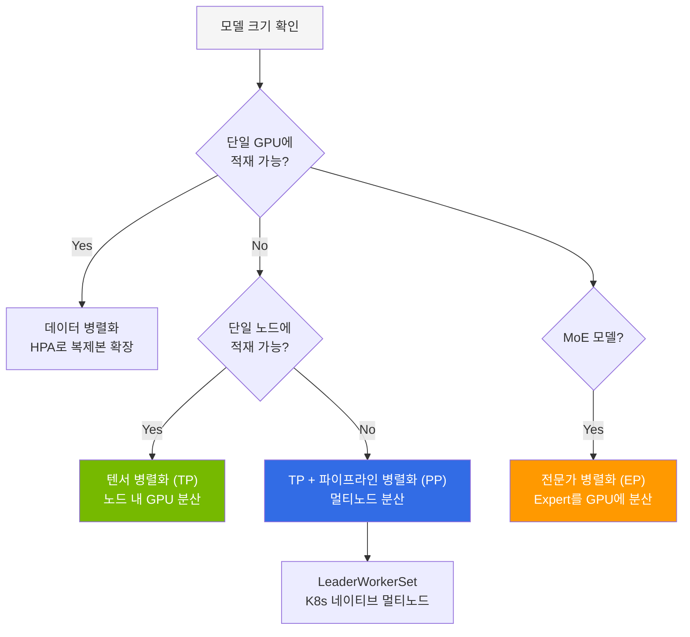

**모델 크기별 권장 구성:**

| 모델 예시 | 파라미터 | 정밀도 | GPU 구성 | 병렬화 |
|-----------|---------|--------|---------|--------|
| Qwen3-32B | 32B | FP8 | 1× H100 80GB | 없음 |
| Llama-3.3-70B | 70B | BF16 | 4× H100 (TP=4) | 텐서 병렬 |
| Kimi K2.5 | 1T MoE (32B active) | INT4 | 8× H100 (TP=8) | 텐서 + 전문가 병렬 |
| GLM-5 | 744B MoE (40B active) | FP8 | 16× H100 (PP=2, TP=8) | 파이프라인 + 텐서 병렬 |

### 핵심 성능 파라미터

```bash
vllm serve Qwen/Qwen3-32B-FP8 \
  --gpu-memory-utilization=0.95 \   # KV 캐시에 사전 할당할 VRAM 비율 (기본 0.9)
  --max-model-len=32768 \           # 최대 시퀀스 길이 (KV 캐시 크기에 직접 영향)
  --enable-prefix-caching \         # 공통 프리픽스 KV 캐시 재사용
  --kv-cache-dtype=fp8 \            # FP8 KV 캐시로 메모리 2배 절감
  --enable-auto-tool-choice \       # Tool calling 자동 지원
  --tool-call-parser=hermes         # Tool call 파서 선택
```

### 양자화 전략 비교

| 양자화 | 메모리 절감 | 품질 손실 | 추론 속도 | 권장 시나리오 |
|--------|----------|---------|---------|------------|
| **FP8** | 50% | 최소 | 빠름 | 프로덕션 기본 (품질 우선) |
| **AWQ** | 75% | 낮음 | 매우 빠름 | 비용 최적화 |
| **GPTQ** | 75% | 낮음 | 빠름 | 오프라인 양자화 |
| **GGUF** | 50-75% | 낮음~중간 | 빠름 | 다양한 정밀도 선택 |

---

## 3. KV Cache-Aware Routing

### 기존 문제: Round-Robin의 한계

기존 vLLM 배포는 단순 Round-Robin 로드 밸런싱에 의존합니다. 동일한 시스템 프롬프트를 사용하는 요청이 매번 다른 Pod로 분산되면, 각 Pod에서 동일한 프리필 연산을 반복 수행합니다. 이는 GPU 연산 낭비이자 TTFT 증가의 원인입니다.

### 해결: KV Cache 상태 인식 라우팅

llm-d와 NVIDIA Dynamo는 각 vLLM Pod의 KV Cache 상태를 인식하여, 동일한 prefix를 가진 요청을 이미 해당 KV Cache를 보유한 Pod로 라우팅합니다.

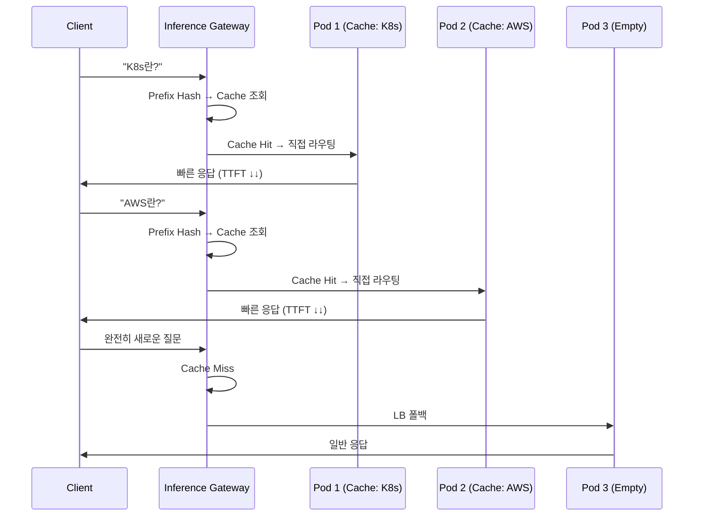

**KV Cache-Aware Routing의 효과:**

| 시나리오 | TTFT 개선 | GPU 연산 절감 | 처리량 향상 |
|---------|----------|-------------|-----------|
| 동일 시스템 프롬프트 | 50-80% 감소 | 프리필 스킵 | 400%+ |
| RAG 반복 컨텍스트 | 30-60% 감소 | 부분 재사용 | 200%+ |
| 완전 랜덤 요청 | 변화 없음 | 없음 | LB 폴백 |

### llm-d vs NVIDIA Dynamo 비교

두 프로젝트 모두 KV Cache-aware 라우팅을 제공하지만 접근 방식이 다릅니다.

| 항목 | llm-d v0.5+ | NVIDIA Dynamo v1.0 |
|------|------------|-------------------|
| **주도** | Red Hat (Apache 2.0) | NVIDIA (Apache 2.0) |
| **KV Cache 인덱싱** | Prefix-aware 라우팅 | Flash Indexer (radix tree) |
| **KV Cache 전송** | NIXL (네트워크) | NIXL (NVLink/RDMA 초고속) |
| **라우팅** | Gateway API + Envoy EPP | Dynamo Router + 자체 EPP |
| **Pod 스케줄링** | K8s 기본 스케줄러 | KAI Scheduler (GPU-aware) |
| **오토스케일링** | HPA/KEDA 연동 | Planner (SLO 기반 profiling) |
| **KV Cache 계층화** | 메모리만 | 3-tier: GPU→CPU→SSD |
| **복잡도** | 낮음 | 높음 |
| **벤치마크 성능** | 경량, K8s 네이티브 | 7x (Flash Indexer + Planner) |

:::tip 선택 기준
- **소규모~중규모 (GPU ≤16)**: llm-d — 빠른 도입, K8s Gateway API 네이티브
- **대규모 (GPU 16+), 최대 처리량**: Dynamo — Flash Indexer, SLO 기반 오토스케일링
- **긴 컨텍스트 (128K+)**: Dynamo — 3-tier KV Cache (GPU→CPU→SSD)
- **점진적 전환**: llm-d로 시작 → 규모 확장 시 Dynamo로 전환 (둘 다 NIXL 사용)
:::

### Gateway 아키텍처: llm-d 배포 구성

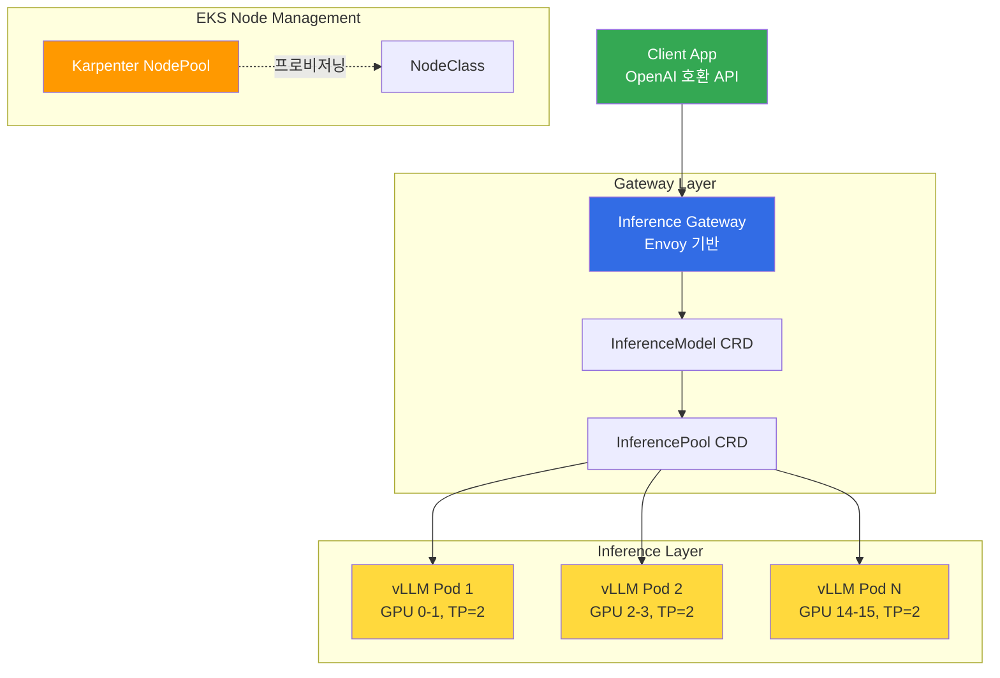

---

## 4. Disaggregated Serving

### Prefill/Decode 분리의 필요성

LLM 추론은 두 가지 근본적으로 다른 연산 단계로 구성됩니다:

| 단계 | 특성 | 병목 | GPU 요구 |
|------|------|------|---------|
| **Prefill** | 입력 프롬프트 전체 처리 | Compute-bound | 높은 연산 능력 (TP=4) |
| **Decode** | 토큰 하나씩 순차 생성 | Memory-bound | 높은 메모리 대역폭 (TP=2) |

이 두 단계를 동일 Pod에서 처리하면, Prefill의 compute 부하가 Decode의 latency를 악화시킵니다. 분리하면 각 단계를 독립적으로 스케일링할 수 있어 GPU 활용률이 극대화됩니다.

### 분리 아키텍처

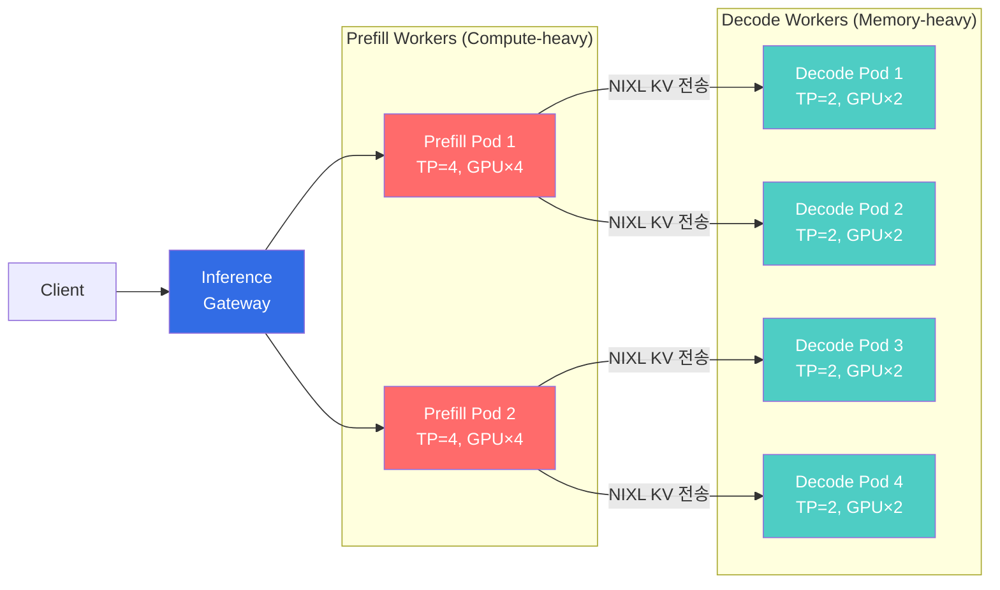

### NIXL: 공통 KV Cache 전송 엔진

NIXL(NVIDIA Inference Xfer Library)은 llm-d, Dynamo, production-stack, aibrix 등 대부분의 프로젝트가 사용하는 공통 KV 전송 엔진입니다. NVLink/RDMA를 활용한 초고속 GPU 간 KV Cache 전송을 제공합니다.

### EKS Auto Mode에서의 Disaggregated Serving

Auto Mode에서는 MIG 파티셔닝이 불가능하므로, **인스턴스(노드) 단위로 역할을 분리**합니다:

```yaml
# Prefill 전용 NodePool
apiVersion: karpenter.sh/v1
kind: NodePool
metadata:
  name: gpu-prefill
spec:
  template:
    metadata:
      labels:
        llm-d-role: prefill
    spec:
      requirements:
        - key: eks.amazonaws.com/instance-family
          operator: In
          values: ["p5"]
      nodeClassRef:
        group: eks.amazonaws.com
        kind: NodeClass
        name: default
      taints:
        - key: llm-d-role
          value: prefill
          effect: NoSchedule
---
# Decode 전용 NodePool
apiVersion: karpenter.sh/v1
kind: NodePool
metadata:
  name: gpu-decode
spec:
  template:
    metadata:
      labels:
        llm-d-role: decode
    spec:
      requirements:
        - key: eks.amazonaws.com/instance-family
          operator: In
          values: ["p5"]
      nodeClassRef:
        group: eks.amazonaws.com
        kind: NodeClass
        name: default
      taints:
        - key: llm-d-role
          value: decode
          effect: NoSchedule
```

**GPU 배치 전략:**
- Prefill: p5.48xlarge 1대에 Prefill Pod 2개 (각 TP=4, GPU 4개)
- Decode: p5.48xlarge 1대에 Decode Pod 4개 (각 TP=2, GPU 2개)
- 이를 통해 GPU 유휴를 최소화

---

## 5. LWS 기반 멀티노드 대형 모델 서빙

### LeaderWorkerSet 개요

700B+ 대형 MoE 모델은 단일 노드(8× GPU)에 적재할 수 없어 멀티노드 파이프라인 병렬화가 필수입니다. [LeaderWorkerSet(LWS)](https://github.com/kubernetes-sigs/lws)는 Kubernetes 네이티브 멀티노드 워크로드 패턴으로, **Ray 없이도 멀티노드 Pipeline Parallelism**을 구현할 수 있습니다.

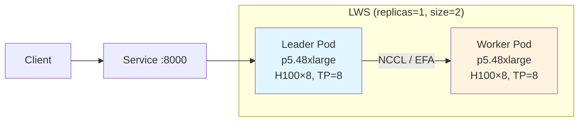

### LWS vs Ray 비교

| 항목 | LWS + vLLM | Ray + vLLM |
|------|-----------|-----------|
| **의존성** | LWS CRD만 설치 | Ray Cluster (head + worker) |
| **복잡도** | 낮음 | 높음 |
| **Pod 관리** | K8s StatefulSet 기반 | Ray 자체 스케줄러 |
| **장애 복구** | RecreateGroupOnPodRestart | Ray 재연결 |
| **EKS Auto Mode** | ✅ 호환 | ✅ 호환 |

### 배포 예제: GLM-5 744B (PP=2, TP=8)

```yaml
apiVersion: leaderworkerset.x-k8s.io/v1
kind: LeaderWorkerSet
metadata:
  name: vllm-glm5-fp8
  namespace: agentic-serving
spec:
  replicas: 1
  leaderWorkerTemplate:
    size: 2  # leader + worker = 2 pods (16 GPUs)
    restartPolicy: RecreateGroupOnPodRestart
    leaderTemplate:
      spec:
        tolerations:
          - key: nvidia.com/gpu
            operator: Exists
            effect: NoSchedule
        containers:
          - name: vllm
            image: vllm/vllm-openai:v0.18.1
            command: ["vllm", "serve"]
            args:
              - "zai-org/GLM-5-FP8"
              - "--tensor-parallel-size=8"
              - "--pipeline-parallel-size=2"
              - "--gpu-memory-utilization=0.92"
              - "--enable-prefix-caching"
            env:
              - name: VLLM_USE_DEEP_GEMM
                value: "1"
              - name: NCCL_DEBUG
                value: "INFO"
            resources:
              requests:
                nvidia.com/gpu: "8"
            volumeMounts:
              - name: model-cache
                mountPath: /models
              - name: dshm
                mountPath: /dev/shm
        volumes:
          - name: model-cache
            emptyDir:
              sizeLimit: 1Ti
          - name: dshm
            emptyDir:
              medium: Memory
              sizeLimit: 32Gi
    workerTemplate:
      spec:
        # leader와 동일한 container spec (args에서 node-rank만 다름)
        tolerations:
          - key: nvidia.com/gpu
            operator: Exists
            effect: NoSchedule
        containers:
          - name: vllm
            image: vllm/vllm-openai:v0.18.1
            command: ["vllm", "serve"]
            args:
              - "zai-org/GLM-5-FP8"
              - "--tensor-parallel-size=8"
              - "--pipeline-parallel-size=2"
              - "--gpu-memory-utilization=0.92"
              - "--enable-prefix-caching"
            env:
              - name: VLLM_USE_DEEP_GEMM
                value: "1"
            resources:
              requests:
                nvidia.com/gpu: "8"
            volumeMounts:
              - name: model-cache
                mountPath: /models
              - name: dshm
                mountPath: /dev/shm
        volumes:
          - name: model-cache
            emptyDir:
              sizeLimit: 1Ti
          - name: dshm
            emptyDir:
              medium: Memory
              sizeLimit: 32Gi
```

### NCCL / EFA 네트워크 최적화

멀티노드 파이프라인 병렬화에서 노드 간 통신 성능이 핵심입니다. p5.48xlarge는 3,200 Gbps EFA(Elastic Fabric Adapter)를 제공합니다.

```yaml
# NCCL 환경 변수 최적화 (LWS Pod에 추가)
env:
  - name: NCCL_DEBUG
    value: "INFO"
  - name: FI_PROVIDER
    value: "efa"
  - name: FI_EFA_USE_DEVICE_RDMA
    value: "1"
  - name: NCCL_ALGO
    value: "Ring"           # Ring이 멀티노드 PP에 적합
  - name: NCCL_PROTO
    value: "Simple"         # EFA에서 안정적
  - name: NCCL_MIN_NCHANNELS
    value: "4"
```

:::tip LWS 장애 복구
`restartPolicy: RecreateGroupOnPodRestart`로 설정하면, Leader 또는 Worker Pod 중 하나가 실패할 때 전체 그룹을 재생성합니다. 멀티노드 NCCL 통신은 모든 노드가 동기화되어야 하므로, 부분 재시작보다 전체 재시작이 안정적입니다.
:::

---

## 6. GPU 리소스 관리 & 오토스케일링

### 2-Tier 스케일링 아키텍처

LLM 서빙에서는 Pod 스케일링과 노드 스케일링을 2단계로 구성합니다:

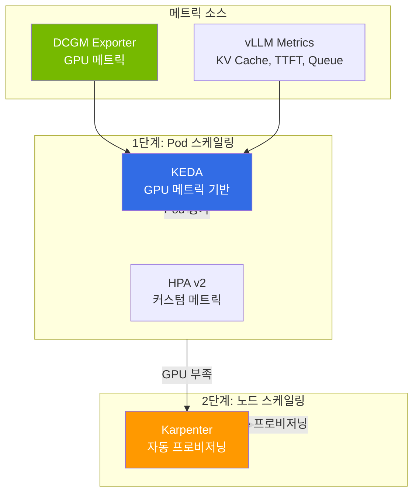

### KEDA 스케일링 구성

LLM 서빙의 핵심 스케일링 시그널 3가지:

```yaml
apiVersion: keda.sh/v1alpha1
kind: ScaledObject
metadata:
  name: llm-inference-scaler
spec:
  scaleTargetRef:
    name: vllm-deployment
  minReplicaCount: 2
  maxReplicaCount: 8
  triggers:
    # 1. KV Cache 포화 — 가장 민감한 시그널
    - type: prometheus
      metadata:
        query: avg(vllm_gpu_cache_usage_perc)
        threshold: "80"
    # 2. 대기 중인 요청 수
    - type: prometheus
      metadata:
        query: sum(vllm_num_requests_waiting)
        threshold: "10"
    # 3. TTFT SLO 위반 근접
    - type: prometheus
      metadata:
        query: |
          histogram_quantile(0.95,
            rate(vllm_time_to_first_token_seconds_bucket[5m]))
        threshold: "2"
```

### Disaggregated Serving 스케일링 기준

Prefill과 Decode의 병목 시그널이 다릅니다:

| | Prefill | Decode |
|---|---|---|
| **병목 시그널** | TTFT 증가, 입력 큐 적체 | TPS 감소, KV Cache 포화 |
| **스케일 기준** | 입력 토큰 처리 대기시간 | 동시 생성 세션 수 |
| **GPU 특성** | Compute 집약 (연산 병목) | Memory 집약 (대역폭 병목) |

### DRA(Dynamic Resource Allocation) 현실

DRA는 K8s 1.32+에서 v1beta1, 1.34+에서 GA로 GPU 파티셔닝/토폴로지 인식 스케줄링을 제공합니다. 그러나 **Karpenter/Auto Mode와 호환되지 않는** 아키텍처적 한계가 있습니다:

- Karpenter는 **노드 생성 전** GPU 리소스를 시뮬레이션해야 하는데, DRA의 ResourceSlice는 **노드 생성 후** DRA Driver가 발행
- 이 "닭과 달걀" 문제로 인해 DRA Pod는 Karpenter에서 skip됨
- **DRA 사용 시**: MNG + Cluster Autoscaler 필수

:::info DRA 사용 판단
**DRA가 필요한 경우:** MIG 파티셔닝, CEL 기반 속성 GPU 선택, P6e-GB200 환경

**Device Plugin이 충분한 경우:** 전체 GPU 단위 할당, Karpenter/Auto Mode 사용
:::

### 비용 최적화 스택

4가지 전략을 조합하여 **총 ~85% 비용 절감**이 가능합니다:

| 전략 | 절감 효과 | 적용 방법 |
|------|---------|---------|
| **Spot 인스턴스** | 60-90% | Karpenter `capacity-type: spot`, p5 Spot $13-15/hr (us-east-2) |
| **Consolidation** | 20-30% | `consolidationPolicy: WhenEmptyOrUnderutilized`, 30초 대기 |
| **Right-sizing** | 15-25% | 모델 크기별 인스턴스 타입 자동 선택 (NodePool weight) |
| **시간대별 스케줄링** | 30-40% | disruption budget으로 비업무 시간 50%+ 축소 |

```yaml
# Karpenter 시간대별 disruption budget 예시
disruption:
  consolidationPolicy: WhenEmptyOrUnderutilized
  consolidateAfter: 30s
  budgets:
    # 업무 시간: 안정성 우선
    - nodes: "10%"
      schedule: "0 9 * * 1-5"
      duration: 9h
    # 비업무 시간: 비용 우선
    - nodes: "50%"
      schedule: "0 18 * * 1-5"
      duration: 15h
```

---

## 7. Observability & Fallback 전략

### GPU 모니터링 스택

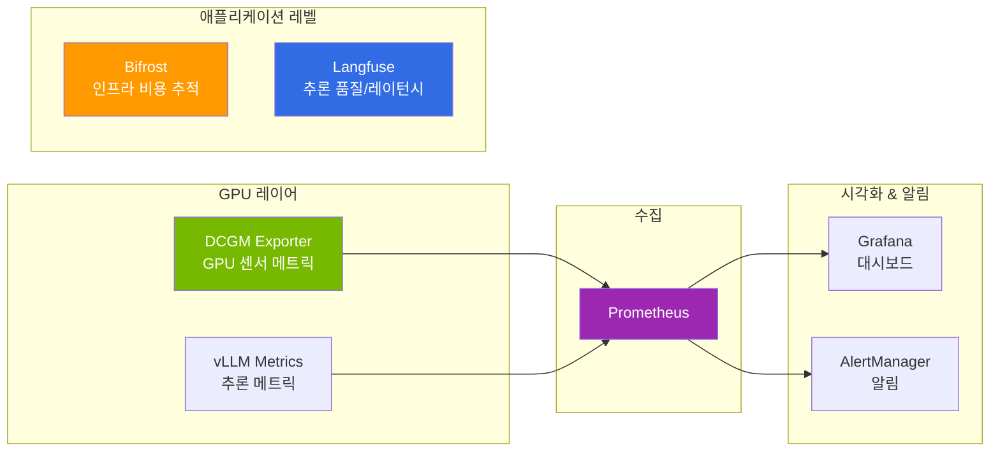

### 핵심 모니터링 메트릭

**GPU 인프라 메트릭 (DCGM):**

| 메트릭 | 설명 | 임계값 |
|--------|------|-------|
| `DCGM_FI_DEV_GPU_UTIL` | GPU SM 활용률 | > 90%: 경고, > 95%: 위험 |
| `DCGM_FI_DEV_MEM_COPY_UTIL` | 메모리 복사 활용률 | > 80%: 주의 |
| `DCGM_FI_DEV_FB_USED` | 프레임버퍼 사용량 | 가용 메모리 < 10%: 위험 |
| `DCGM_FI_DEV_POWER_USAGE` | GPU 전력 소비 | TDP 근접 시 주의 |

**vLLM 추론 메트릭:**

| 메트릭 | 설명 | 임계값 |
|--------|------|-------|
| `vllm:gpu_cache_usage_perc` | KV Cache 사용률 | > 80%: 스케일 아웃 |
| `vllm:num_requests_waiting` | 대기 중인 요청 | > 10: 스케일 아웃 |
| `vllm:time_to_first_token_seconds` | TTFT | P95 > 2초: 조치 필요 |
| `vllm:num_preemptions_total` | 선점 횟수 | 높으면 메모리 부족 |
| `vllm:avg_generation_throughput_toks_per_s` | 생성 처리량 | 기준선 대비 모니터링 |

### 2-Tier 비용 추적

완전한 비용 가시성을 위해 인프라와 애플리케이션 레벨을 모두 추적합니다:

- **Bifrost (인프라 레벨)**: 모델별 토큰 단가, 팀/프로젝트별 예산 관리, 월간 비용 리포트
- **Langfuse (애플리케이션 레벨)**: Agent 워크플로우 각 단계별 토큰 소비, 체인 end-to-end latency, Trace 기반 성능 병목 분석

이 2-Tier 전략으로 "어떤 모델이 얼마나 사용되었는가"(인프라)와 "어떤 기능이 비용을 유발하는가"(애플리케이션)를 동시에 파악할 수 있습니다.

### Bifrost → Bedrock Cascade Fallback

Self-hosted 모델(vLLM/llm-d)이 과부하이거나 장애일 때, Amazon Bedrock의 관리형 모델로 자동 폴백하는 Cascade Routing을 구성할 수 있습니다. Bifrost(또는 LiteLLM)가 Gateway 역할을 하며, 응답 실패/타임아웃 시 Bedrock으로 요청을 전환합니다.

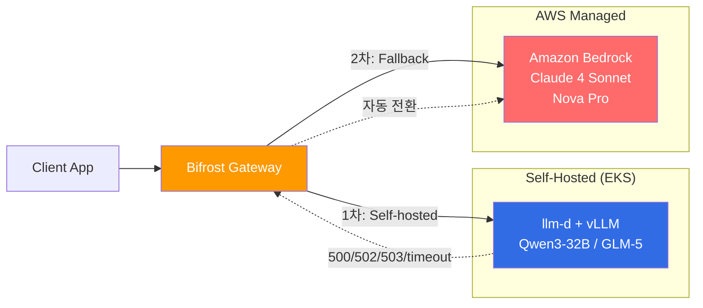

**Bifrost Cascade Routing 설정:**

```yaml
# bifrost-config.yaml
routing:
  defaultModel: self-hosted-qwen3
  strategy: cascade
  cascadeOrder:
    - self-hosted-qwen3      # 1차: EKS Self-hosted (비용 최적)
    - self-hosted-glm5        # 2차: EKS Self-hosted 대안
    - bedrock-claude-sonnet   # 3차: Bedrock 관리형 (폴백)
  fallbackConditions:
    - statusCode: [500, 502, 503, 504]
    - latencyMs: "> 30000"    # 30초 초과 시 폴백
    - errorRate: "> 0.1"      # 에러율 10% 초과 시 폴백

models:
  - name: self-hosted-qwen3
    provider: openai-compatible
    baseUrl: http://inference-gateway.llm-d:8080/v1
    model: Qwen/Qwen3-32B
    priority: 1
    costPer1kTokens: 0.001    # Self-hosted 추정 비용

  - name: self-hosted-glm5
    provider: openai-compatible
    baseUrl: http://glm5-service.agentic-serving:8000/v1
    model: zai-org/GLM-5-FP8
    priority: 2
    costPer1kTokens: 0.003

  - name: bedrock-claude-sonnet
    provider: bedrock
    model: anthropic.claude-sonnet-4-20250514
    region: us-east-1
    priority: 3
    costPer1kTokens: 0.003    # Bedrock 공식 단가
    maxTokens: 4096
```

**Cascade Routing의 장점:**

| 관점 | Self-hosted 단독 | Cascade (Self-hosted + Bedrock) |
|------|----------------|-------------------------------|
| **가용성** | GPU 장애 시 서비스 중단 | Bedrock 폴백으로 무중단 |
| **비용** | GPU 고정 비용 | 평시 Self-hosted(저비용) + 피크 Bedrock(종량제) |
| **용량 계획** | 피크 트래픽 기준 GPU 확보 | 기본 트래픽만 GPU, 초과분 Bedrock |
| **Cold Start** | Spot 중단 시 수 분 지연 | Bedrock 즉시 응답 |

:::tip 비용 최적화 패턴
평시 트래픽의 80%를 Self-hosted로 처리하고, 피크 시 20%를 Bedrock으로 오프로드하면 **GPU를 피크 기준으로 프로비저닝할 필요가 없어** 인프라 비용을 30-40% 추가 절감할 수 있습니다. Spot 인스턴스 중단 시에도 Bedrock이 즉시 백업 역할을 합니다.
:::

---

## 8. Hybrid Node: 온프레미스 GPU 팜 통합

### 개요

EKS Hybrid Node는 **온프레미스 GPU 서버를 EKS 클러스터에 등록**하는 기능입니다 (2024년 11월 GA). 이미 보유한 DGX, GPU 서버를 클라우드 EKS와 통합하여 하이브리드 Inference 아키텍처를 구성할 수 있습니다.

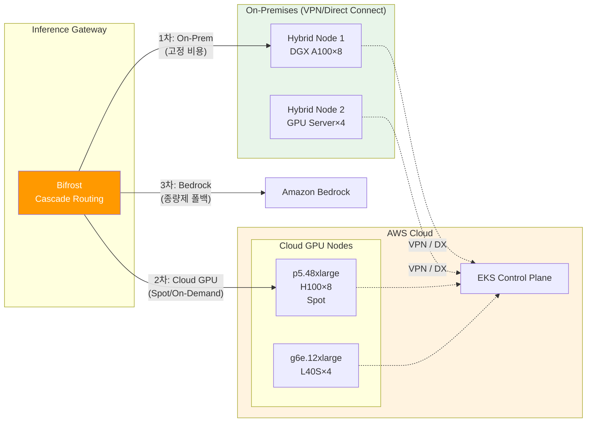

### Hybrid Node 등록

```bash
# 1. Hybrid Node IAM Role 생성
aws iam create-role \
  --role-name EKSHybridNodeRole \
  --assume-role-policy-document file://hybrid-node-trust-policy.json

aws iam attach-role-policy \
  --role-name EKSHybridNodeRole \
  --policy-arn arn:aws:iam::aws:policy/AmazonEKSWorkerNodePolicy

# 2. 온프레미스 서버에서 Hybrid Node 등록
curl -o hybrid-node-installer.sh https://hybrid.eks.amazonaws.com/installer
chmod +x hybrid-node-installer.sh

sudo ./hybrid-node-installer.sh \
  --cluster-name genai-platform \
  --region us-west-2 \
  --role-arn arn:aws:iam::123456789012:role/EKSHybridNodeRole \
  --credential-provider ssm

# 3. 노드 확인
kubectl get nodes -l node.kubernetes.io/instance-type=hybrid
```

### Hybrid Node GPU Operator 설치

온프레미스 노드에는 AWS 관리 GPU 스택이 없으므로 **GPU Operator 필수**입니다.

```yaml
# GPU Operator Helm Values (Hybrid Node 전용)
driver:
  enabled: true               # 온프레미스: 드라이버 설치 필요
  version: "580.126.18"
  nodeSelector:
    node.kubernetes.io/instance-type: hybrid

toolkit:
  enabled: true
  nodeSelector:
    node.kubernetes.io/instance-type: hybrid

devicePlugin:
  enabled: true               # 온프레미스: Device Plugin도 설치 필요
  nodeSelector:
    node.kubernetes.io/instance-type: hybrid

dcgmExporter:
  enabled: true
  serviceMonitor:
    enabled: true
    additionalLabels:
      location: on-premises   # 온프레미스/클라우드 메트릭 분리
  nodeSelector:
    node.kubernetes.io/instance-type: hybrid
```

### 3-Tier Cascade: On-Prem → Cloud → Bedrock

Hybrid Node와 Bifrost Cascade를 결합하면 **비용 효율성과 가용성을 동시에 극대화**하는 3-Tier 아키텍처를 구성할 수 있습니다:

| Tier | 인프라 | 비용 구조 | 역할 |
|------|--------|---------|------|
| **Tier 1** | On-Prem Hybrid Node (DGX) | 고정 비용 (이미 보유) | 기본 트래픽 처리 (항상 활성) |
| **Tier 2** | Cloud GPU (EKS Spot/OD) | 변동 비용 (시간당) | 피크 트래픽 버스트 |
| **Tier 3** | Amazon Bedrock | 종량제 (토큰당) | 장애/과부하 폴백 |

```yaml
# Bifrost 3-Tier Cascade 설정
routing:
  strategy: cascade
  cascadeOrder:
    - onprem-dgx-llm          # 1차: On-Prem (고정 비용, 항상 활성)
    - cloud-eks-llm            # 2차: Cloud GPU (Spot, 탄력적)
    - bedrock-fallback         # 3차: Bedrock (종량제, 무제한 용량)

models:
  - name: onprem-dgx-llm
    provider: openai-compatible
    baseUrl: http://hybrid-node-vllm.inference:8000/v1
    model: Qwen/Qwen3-32B
    priority: 1
    healthCheck:
      endpoint: /health
      intervalMs: 10000

  - name: cloud-eks-llm
    provider: openai-compatible
    baseUrl: http://inference-gateway.llm-d:8080/v1
    model: Qwen/Qwen3-32B
    priority: 2

  - name: bedrock-fallback
    provider: bedrock
    model: anthropic.claude-sonnet-4-20250514
    region: us-east-1
    priority: 3
```

### Pod 배치 전략: nodeSelector로 워크로드 분리

```yaml
# On-Prem Hybrid Node에 배치 (기본 추론)
apiVersion: apps/v1
kind: Deployment
metadata:
  name: vllm-onprem
spec:
  template:
    spec:
      nodeSelector:
        node.kubernetes.io/instance-type: hybrid
      tolerations:
        - key: nvidia.com/gpu
          operator: Exists
          effect: NoSchedule
      containers:
        - name: vllm
          image: vllm/vllm-openai:v0.6.3
          args: ["Qwen/Qwen3-32B-FP8", "--gpu-memory-utilization=0.95"]
          resources:
            limits:
              nvidia.com/gpu: 1
---
# Cloud GPU Node에 배치 (버스트 트래픽)
apiVersion: apps/v1
kind: Deployment
metadata:
  name: vllm-cloud-burst
spec:
  template:
    spec:
      nodeSelector:
        karpenter.sh/nodepool: gpu-inference  # Cloud Karpenter NodePool
      tolerations:
        - key: nvidia.com/gpu
          operator: Exists
          effect: NoSchedule
      containers:
        - name: vllm
          image: vllm/vllm-openai:v0.6.3
          args: ["Qwen/Qwen3-32B-FP8", "--gpu-memory-utilization=0.95"]
          resources:
            limits:
              nvidia.com/gpu: 1
```

:::warning Hybrid Node 네트워크 고려사항
- **레이턴시**: VPN/Direct Connect 경유로 클라우드 노드 대비 10-50ms 추가 지연
- **대역폭**: 멀티노드 NCCL 통신은 고대역폭 필요 → On-Prem 내 PP는 가능하나, On-Prem↔Cloud 간 PP는 비권장
- **권장**: On-Prem 노드는 독립적인 모델을 서빙하고, Cloud 노드와는 Gateway 레벨에서 Cascade Routing으로 연결
:::

---

## 9. 실전 교훈: 대형 MoE 모델 배포

### 이미지/모델 다운로드 실패 대응

대형 모델(744GB+)의 가중치 다운로드는 LLM 서빙에서 가장 흔한 Cold Start 병목입니다. HuggingFace Hub에서 수백 GB를 다운로드할 때 네트워크 불안정, 타임아웃, 디스크 부족 등으로 자주 실패합니다.

#### 문제 유형과 대응

| 문제 | 증상 | 대응 |
|------|------|------|
| **HF Hub 다운로드 타임아웃** | Pod CrashLoopBackOff, `ConnectionError` | 재시도 + resume 지원 (`HF_HUB_ENABLE_HF_TRANSFER=1`) |
| **대형 파일 부분 다운로드** | 모델 로딩 시 corruption 에러 | 체크섬 검증 + 재다운로드 |
| **컨테이너 이미지 Pull 느림** | `ImagePullBackOff`, 수 분 대기 | 이미지 사전 캐싱 (Bottlerocket 데이터 볼륨, SOCI) |
| **멀티노드 동시 다운로드** | 네트워크 대역폭 경합 | S3 캐싱 + init container 순차 로딩 |
| **EFS 느린 다운로드** | 로딩 시간 30분+ | NVMe emptyDir로 전환 |

#### 전략 1: HuggingFace Transfer 가속

`hf_transfer`는 Rust 기반 고속 다운로드 라이브러리로, 기본 다운로드 대비 **3-5배 빠릅니다**.

```yaml
env:
  - name: HF_HUB_ENABLE_HF_TRANSFER
    value: "1"
  - name: HF_TOKEN
    valueFrom:
      secretKeyRef:
        name: hf-token
        key: token
  # 다운로드 재시도 설정
  - name: HF_HUB_DOWNLOAD_TIMEOUT
    value: "600"            # 10분 타임아웃
```

#### 전략 2: S3 사전 캐싱 + Init Container

가장 안정적인 방법입니다. 모델 가중치를 S3에 미리 업로드하고, init container에서 로컬 NVMe로 복사합니다.

```yaml
apiVersion: apps/v1
kind: Deployment
metadata:
  name: vllm-with-s3-cache
spec:
  template:
    spec:
      initContainers:
        # 1단계: S3에서 NVMe로 모델 다운로드
        - name: model-downloader
          image: amazon/aws-cli:latest
          command: ["/bin/sh", "-c"]
          args:
            - |
              echo "Checking local cache..."
              if [ -f /models/config.json ]; then
                echo "Model already cached, skipping download"
                exit 0
              fi
              echo "Downloading model from S3..."
              aws s3 sync s3://model-cache/qwen3-32b-fp8/ /models/ \
                --no-progress \
                --expected-size 65000000000
              echo "Download complete, verifying..."
              # 체크섬 검증
              if [ -f /models/model.safetensors.index.json ]; then
                echo "Model verified successfully"
              else
                echo "ERROR: Model incomplete, retrying..."
                rm -rf /models/*
                aws s3 sync s3://model-cache/qwen3-32b-fp8/ /models/
              fi
          volumeMounts:
            - name: model-cache
              mountPath: /models
          resources:
            requests:
              cpu: 2
              memory: 4Gi
      containers:
        - name: vllm
          image: vllm/vllm-openai:v0.6.3
          args:
            - /models
            - "--gpu-memory-utilization=0.95"
          volumeMounts:
            - name: model-cache
              mountPath: /models
      volumes:
        - name: model-cache
          emptyDir:
            sizeLimit: 200Gi  # NVMe emptyDir
```

#### 전략 3: 컨테이너 이미지 사전 캐싱

vLLM/SGLang 이미지(10-20GB)의 Pull 시간을 줄이는 방법입니다.

```yaml
# Karpenter NodePool에서 이미지 사전 Pull 활성화
apiVersion: karpenter.sh/v1
kind: NodePool
metadata:
  name: gpu-inference
spec:
  template:
    spec:
      kubelet:
        # 이미지 GC 임계값을 높여 캐시 유지
        imageGCHighThresholdPercent: 90
        imageGCLowThresholdPercent: 85
```

**SOCI (Seekable OCI) 인덱스 활용:**

ECR에 SOCI 인덱스를 생성하면 이미지를 lazy-loading으로 Pull하여 **컨테이너 시작 시간을 70-80% 단축**합니다.

```bash
# SOCI 인덱스 생성 (ECR)
aws soci create \
  --image-uri 123456789012.dkr.ecr.us-east-2.amazonaws.com/vllm:v0.6.3

# EKS Auto Mode는 SOCI를 자동 지원
# Karpenter: Bottlerocket AMI 사용 시 SOCI 네이티브 지원
```

#### 전략 4: 멀티노드 LWS의 모델 다운로드 조율

LWS로 멀티노드 배포 시, Leader와 Worker가 동시에 같은 모델을 다운로드하면 네트워크 경합이 발생합니다.

```yaml
# Leader Pod: S3에서 다운로드 후 NVMe 캐시
initContainers:
  - name: model-downloader
    command: ["/bin/sh", "-c"]
    args:
      - |
        # Leader만 S3에서 다운로드
        aws s3 sync s3://model-cache/glm5-fp8/ /models/
        echo "READY" > /models/.download-complete

# Worker Pod: Leader 완료 대기 후 독립 다운로드
initContainers:
  - name: model-downloader
    command: ["/bin/sh", "-c"]
    args:
      - |
        # Worker는 독립적으로 S3에서 다운로드
        # (NVMe emptyDir는 노드별 독립이므로 공유 불가)
        aws s3 sync s3://model-cache/glm5-fp8/ /models/
```

:::tip 다운로드 성능 비교
| 방법 | 744GB 모델 소요 시간 | 안정성 | 비용 |
|------|-------------------|--------|------|
| HF Hub 직접 | 20-40분 | ⚠️ 타임아웃 빈번 | 무료 |
| HF Hub + hf_transfer | 10-15분 | ✅ 양호 | 무료 |
| **S3 사전 캐싱** | **5-10분** | **✅ 매우 안정** | **S3 저장 비용** |
| FSx for Lustre | 5-8분 | ✅ 안정 | 높음 |
| NVMe 로컬 캐시 (재기동) | < 1분 | ✅ 최고 | 무료 |
:::

### EKS Auto Mode GPU 제약 사항

GLM-5(744B MoE)와 Kimi K2.5(1T MoE) 배포 과정에서 발견한 핵심 제약사항입니다.

#### p6-b200 미지원

2026년 4월 기준, EKS Auto Mode의 managed Karpenter는 **p6-b200.48xlarge를 프로비저닝할 수 없습니다**. NodePool validation은 통과하지만, 실제 NodeClaim 생성 시 `NoCompatibleInstanceTypes` 오류가 발생합니다.

#### GPU 인스턴스 용량 확보

서울/도쿄 리전에서 p5.48xlarge는 InsufficientCapacity가 빈번합니다. **us-east-2 (Ohio) Spot에서 $13-15/hr로 확보에 성공**했습니다 (On-Demand $98/hr 대비 85% 절감).

| 리전 | p5.48xlarge On-Demand | p5.48xlarge Spot | Spot 가격 |
|------|---------------------|-----------------|----------|
| ap-northeast-2 (서울) | ❌ InsufficientCapacity | 미확인 | — |
| ap-northeast-1 (도쿄) | ❌ InsufficientCapacity | 미확인 | — |
| **us-east-2 (Ohio)** | ⚠️ 가용성 변동 | **✅ 확보 성공** | **$13~15/hr** |

#### GPU Operator 충돌

`devicePlugin.enabled=true`로 GPU Operator를 설치하면 Auto Mode 내장 Device Plugin과 충돌하여 `allocatable=0`이 됩니다. **반드시 `devicePlugin.enabled=false`로 설치**해야 합니다.

#### EC2 인스턴스 직접 종료 불가

Auto Mode 관리 노드는 resource-based policy로 `ec2:TerminateInstances`가 차단됩니다. 노드 정리는 Karpenter NodePool 삭제 또는 Pod 제거를 통해 간접적으로 수행해야 합니다.

### 서빙 프레임워크 호환성

| 모델 | vLLM 지원 | SGLang 지원 | 비고 |
|------|---------|-----------|------|
| Qwen3-32B | ✅ | ✅ | llm-d 기본 모델, Apache 2.0 |
| Kimi K2.5 (1T MoE) | ✅ | ✅ | INT4 W4A16 Marlin MoE, `gpu_memory_utilization=0.85` |
| GLM-5 (744B MoE) | ❌ | ✅ | `glm_moe_dsa` 아키텍처 → transformers v5.2+ 필요, vLLM은 v4.x 사용 |
| DeepSeek V3.2 | ✅ | ✅ | MoE, 671B/37B active |

:::warning GLM-5 배포 시 주의
GLM-5는 vLLM에서 지원되지 않습니다. SGLang 전용 이미지(`lmsysorg/sglang:glm5-hopper`)를 사용해야 하며, 멀티노드 배포 시 `--pp-size 2 --nnodes 2 --dist-init-addr <leader>:5000`을 설정합니다.
:::

### 스토리지 전략

대형 모델(744GB+)의 가중치 로딩은 스토리지 성능이 핵심입니다:

| 스토리지 | 순차 읽기 | 멀티노드 공유 | 권장 시나리오 |
|---------|---------|------------|------------|
| **NVMe emptyDir** | ~3,500 MB/s | ❌ 노드별 개별 | p5 내장 NVMe, 최고 성능 |
| EFS | ~100-300 MB/s | ✅ ReadWriteMany | 소형 모델, 공유 필요 시 |
| S3 + init container | ~1,000 MB/s | ✅ S3 공유 | 중간 성능, 비용 효율 |
| FSx for Lustre | ~1,000+ MB/s | ✅ ReadWriteMany | 학습 워크로드 |

:::tip 대형 모델 권장
GLM-5(744GB), Kimi K2.5(630GB) 같은 대형 모델은 **로컬 NVMe(emptyDir)**를 권장합니다. p5.48xlarge에 8×3.84TB NVMe SSD가 내장되어 추가 비용 없이 최고 성능을 제공합니다. HuggingFace Hub 직접 다운로드 시 첫 기동 10-20분 소요되지만, 이후 로딩은 빠릅니다.
:::

### GPU 쿼터 함정

EC2 vCPU 쿼터가 인스턴스 버킷별로 분리되어 있어 주의가 필요합니다:

| 쿼타 | 적용 인스턴스 | 기본값 | 주의사항 |
|------|------------|--------|---------|
| Running On-Demand P instances | p4d, p5, p5en | 384 | p5.48xlarge(192 vCPU) 2대 가능 |
| Running On-Demand G and VT instances | g5, g6, g6e | **64** | g6e.48xlarge 1대도 불가 → 쿼터 증가 필요 |

GPU NodePool에 `instance-category: [g, p]`를 함께 설정하면, Karpenter가 G 타입을 먼저 시도하여 G 쿼터(64 vCPU)에 걸릴 수 있습니다. P 타입만 필요하면 명시적으로 지정하세요.

---

## 모델 규모별 권장 아키텍처

### 의사결정 플로우

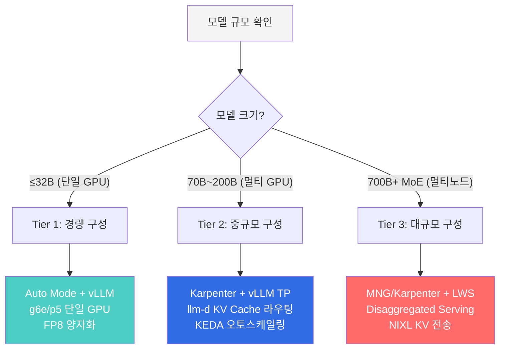

### 3-Tier 권장 구성

| Tier | 모델 규모 | 인프라 | 서빙 엔진 | 라우팅 | 예시 |
|------|---------|--------|---------|--------|------|
| **Tier 1** | ≤32B | Auto Mode, g6e/p5 | vLLM (단일 GPU) | Round-Robin | Qwen3-32B FP8 |
| **Tier 2** | 70B~200B | Karpenter + GPU Operator | vLLM TP=4~8 | llm-d KV Cache-aware | Llama-3.3-70B |
| **Tier 3** | 700B+ MoE | MNG 또는 Karpenter + LWS | vLLM/SGLang PP+TP | Disaggregated + NIXL | GLM-5, Kimi K2.5 |

**모든 Tier 공통**: Bifrost Cascade Routing으로 Bedrock 폴백 구성 권장 (GPU 장애/Spot 중단 시 무중단 서비스)

### 하이브리드 아키텍처: 전체 그림

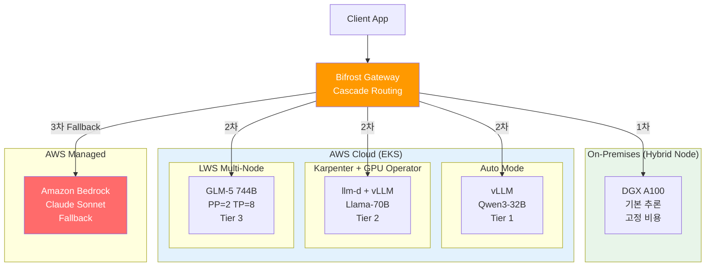

### 마이그레이션 경로

단계별 전환으로 운영 리스크를 최소화하면서 점진적으로 성능을 향상시킬 수 있습니다:

**Phase 1**: Auto Mode + vLLM + Bifrost→Bedrock 폴백 → PoC, 개발 환경

**Phase 1.5**: Auto Mode + GPU Operator + llm-d → 모니터링 강화, KV Cache 라우팅

**Phase 2**: Karpenter + llm-d Disaggregated + LWS 멀티노드 → MIG, Prefill/Decode 분리

**Phase 3**: Karpenter + Dynamo + Hybrid Node → 온프레미스 통합, 3-Tier Cascade

**Phase 4**: 전체 통합 → On-Prem→Cloud→Bedrock Cascade, SLO 기반 오토스케일링

---

## 참고 자료

### 내부 문서
- [EKS GPU 노드 전략](./model-serving/eks-gpu-node-strategy.md) — Auto Mode, Karpenter, Hybrid Node 비교
- [vLLM 기반 FM 배포 및 성능 최적화](./model-serving/vllm-model-serving.md) — vLLM 상세 가이드
- [llm-d 기반 EKS 분산 추론](./model-serving/llm-d-eks-automode.md) — llm-d 배포 가이드
- [MoE 모델 서빙 가이드](./model-serving/moe-model-serving.md) — MoE 모델 배포
- [GPU 리소스 관리](./model-serving/gpu-resource-management.md) — GPU 스케일링, DRA, 비용 최적화
- [NVIDIA GPU 소프트웨어 스택](./model-serving/nvidia-gpu-stack.md) — GPU Operator, DCGM, MIG, Dynamo

### 외부 참고
- [GenAI on EKS Starter Kit](https://github.com/aws-samples/sample-genai-on-eks-starter-kit) — Bifrost, vLLM, Langfuse 배포 자동화
- [Scalable Model Inference on Amazon EKS](https://github.com/aws-solutions-library-samples/guidance-for-scalable-model-inference-and-agentic-ai-on-amazon-eks) — llm-d, Karpenter, RAG 종합 아키텍처
- [vLLM 공식 문서](https://docs.vllm.ai) — 최적화 및 튜닝 가이드
- [llm-d GitHub](https://github.com/llm-d/llm-d) — K8s 네이티브 분산 추론
- [NVIDIA Dynamo](https://developer.nvidia.com/dynamo) — 분산 추론 프레임워크
- [LeaderWorkerSet](https://github.com/kubernetes-sigs/lws) — K8s 네이티브 멀티노드 워크로드
- [EKS Hybrid Nodes](https://docs.aws.amazon.com/eks/latest/userguide/hybrid-nodes.html) — 온프레미스 GPU 서버 EKS 통합
- [Amazon Bedrock](https://docs.aws.amazon.com/bedrock/) — 관리형 FM 서비스 (Cascade Fallback 대상)
- [SOCI (Seekable OCI)](https://docs.aws.amazon.com/AmazonECR/latest/userguide/container-images-soci.html) — 컨테이너 이미지 lazy-loading
