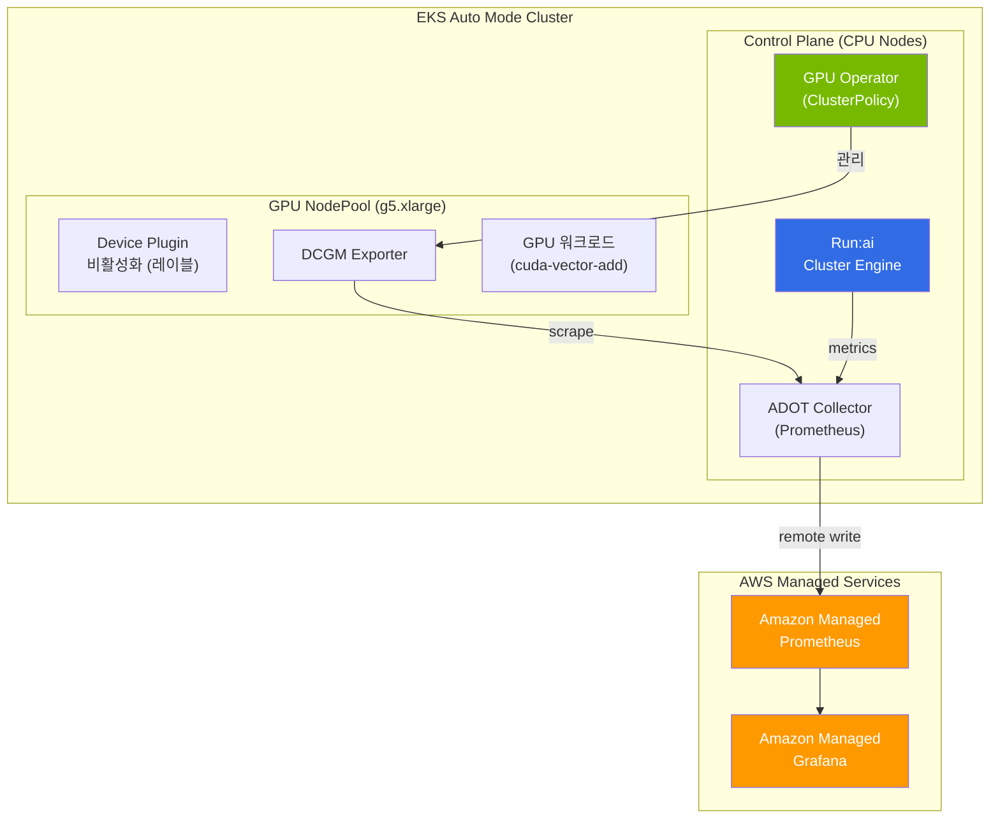

import Tabs from '@theme/Tabs';
import TabItem from '@theme/TabItem';

# Run:ai + EKS Auto Mode + AMP/AMG 테스트 가이드

> **목적**: EKS Auto Mode 환경에서 Run:ai가 정상 설치되고, 단순 GPU 워크로드를 올린 후 AMP/AMG로 모니터링되는지를 검증하는 hands-on 테스트 가이드

> **예상 소요 시간**: 약 2-3시간 | **비용**: g5.xlarge 기준 약 $5-10 (테스트 후 즉시 삭제)

## 테스트 목표

| # | 검증 항목 | 성공 기준 |
|---|----------|----------|
| 1 | EKS Auto Mode 클러스터 생성 | GPU NodePool 프로비저닝 정상 |
| 2 | GPU Operator 설치 (Device Plugin 비활성화 패턴) | ClusterPolicy CRD 생성, DCGM Exporter Running |
| 3 | Run:ai 클러스터 엔진 설치 | Run:ai Scheduler + Operator Pod Running |
| 4 | GPU 워크로드 배포 | `nvidia-smi` 정상 출력, Run:ai 대시보드에서 워크로드 확인 |
| 5 | AMP 메트릭 수집 | DCGM + Run:ai 메트릭이 AMP 워크스페이스에 도착 |
| 6 | AMG 대시보드 시각화 | GPU Utilization, Memory, Run:ai Queue 메트릭 확인 |

---

## 아키텍처



---

## 사전 준비

```bash
# 필수 CLI 도구
aws --version          # AWS CLI v2.x
eksctl version         # eksctl v0.200+
kubectl version        # v1.32+
helm version           # v3.16+

# Run:ai CLI (NVIDIA 계정 필요)
# https://run-ai-docs.nvidia.com 에서 다운로드

# AWS 계정 설정
export AWS_REGION=ap-northeast-2
export CLUSTER_NAME=runai-automode-test
export ACCOUNT_ID=$(aws sts get-caller-identity --query Account --output text)
```

---

## Step 1: EKS Auto Mode 클러스터 생성

### 1.1 클러스터 설정 파일

```yaml
# cluster-config.yaml
apiVersion: eksctl.io/v1alpha5
kind: ClusterConfig

metadata:
  name: runai-automode-test
  region: ap-northeast-2
  version: "1.32"

autoModeConfig:
  enabled: true

iam:
  withOIDC: true
```

```bash
# 클러스터 생성 (약 15-20분)
eksctl create cluster -f cluster-config.yaml
```

### 1.2 GPU NodePool 생성

Auto Mode에서는 NodePool CRD로 GPU 노드를 정의합니다. **Device Plugin 비활성화 레이블**이 핵심입니다.

```yaml
# gpu-nodepool.yaml
apiVersion: karpenter.sh/v1
kind: NodePool
metadata:
  name: gpu-test-pool
spec:
  template:
    metadata:
      labels:
        nvidia.com/gpu.deploy.device-plugin: "false"   # GPU Operator Device Plugin 비활성화
        workload-type: gpu-test
    spec:
      requirements:
        - key: eks.amazonaws.com/instance-family
          operator: In
          values: ["g5"]                                # 테스트용 g5 (A10G GPU)
        - key: eks.amazonaws.com/instance-size
          operator: In
          values: ["xlarge", "2xlarge"]                 # 비용 절약: 소형 인스턴스
        - key: kubernetes.io/arch
          operator: In
          values: ["amd64"]
        - key: karpenter.sh/capacity-type
          operator: In
          values: ["on-demand"]                         # 테스트는 on-demand 권장
      nodeClassRef:
        group: eks.amazonaws.com
        kind: NodeClass
        name: default
  limits:
    nvidia.com/gpu: "4"                                 # 테스트용 GPU 수 제한
  disruption:
    consolidationPolicy: WhenEmpty
    consolidateAfter: 60s
```

```bash
kubectl apply -f gpu-nodepool.yaml

# GPU 노드 프로비저닝 확인 (워크로드 배포 시 자동 생성)
kubectl get nodepools
```

### 1.3 검증

```bash
# Auto Mode 상태 확인
kubectl get nodepools
kubectl get nodeclasses

# Expected:
# NAME            READY
# default         True
# gpu-test-pool   True
```

---

## Step 2: GPU Operator 설치 (Auto Mode 패턴)

Auto Mode에서는 GPU 드라이버와 Container Toolkit이 AMI에 사전 설치되어 있으므로 비활성화하고, DCGM Exporter와 GFD만 활성화합니다.

### 2.1 Helm 설치

```bash
# NVIDIA Helm repo 추가
helm repo add nvidia https://helm.ngc.nvidia.com/nvidia
helm repo update

# GPU Operator 설치 (Auto Mode 전용 값)
helm install gpu-operator nvidia/gpu-operator \
  --namespace gpu-operator --create-namespace \
  --version v25.3.0 \
  --set driver.enabled=false \
  --set toolkit.enabled=false \
  --set devicePlugin.enabled=true \
  --set dcgmExporter.enabled=true \
  --set dcgmExporter.serviceMonitor.enabled=true \
  --set migManager.enabled=false \
  --set nfd.enabled=true \
  --set gfd.enabled=true \
  --set nodeStatusExporter.enabled=false \
  --set sandboxDevicePlugin.enabled=false
```

:::caution Auto Mode 핵심 포인트
- `driver.enabled=false`, `toolkit.enabled=false`: AWS AMI에 사전 설치
- `devicePlugin.enabled=true`: 전역 활성화하되, NodePool 레이블 `nvidia.com/gpu.deploy.device-plugin: "false"`로 Auto Mode 노드에서만 비활성화
- `dcgmExporter.serviceMonitor.enabled=true`: Prometheus 스크래핑 설정 자동 생성
:::

### 2.2 검증

```bash
# GPU Operator Pod 상태 확인
kubectl get pods -n gpu-operator

# Expected (GPU 노드 프로비저닝 전에는 dcgm-exporter가 Pending):
# NAME                                       READY   STATUS
# gpu-operator-xxx                           1/1     Running
# gpu-operator-node-feature-discovery-xxx    1/1     Running

# ClusterPolicy 확인 (Run:ai의 필수 의존성)
kubectl get clusterpolicy
# NAME              STATUS   AGE
# cluster-policy    ready    2m
```

---

## Step 3: Run:ai 설치

### 3.1 사전 요구사항

Run:ai 설치에는 **NVIDIA Run:ai 라이선스**가 필요합니다. [Run:ai 공식 사이트](https://www.run.ai/)에서 Trial 계정을 생성하세요.

```bash
# Run:ai Control Plane URL과 클러스터 UUID 확인 (Run:ai 콘솔에서 발급)
export RUNAI_CTRL_URL="https://<your-tenant>.run.ai"
export RUNAI_CLUSTER_UUID="<cluster-uuid-from-console>"
```

### 3.2 Run:ai Helm 설치

```bash
# Run:ai Helm repo 추가
helm repo add runai https://runai.jfrog.io/artifactory/cp-charts-prod
helm repo update

# Run:ai 네임스페이스 생성
kubectl create namespace runai

# Run:ai 클러스터 엔진 설치
helm install runai-cluster runai/runai-cluster \
  --namespace runai \
  --set controlPlane.url=$RUNAI_CTRL_URL \
  --set controlPlane.clientSecret=$RUNAI_CLIENT_SECRET \
  --set cluster.uid=$RUNAI_CLUSTER_UUID \
  --set gpu-operator.enabled=false \
  --set global.prometheusOperator.enabled=false
```

:::info Run:ai + GPU Operator 통합
`gpu-operator.enabled=false`로 설정하는 이유는 Step 2에서 이미 독립적으로 GPU Operator를 설치했기 때문입니다. Run:ai는 기존 ClusterPolicy CRD를 감지하여 자동으로 연동합니다.
:::

### 3.3 검증

```bash
# Run:ai Pod 상태 확인
kubectl get pods -n runai

# Expected:
# NAME                                          READY   STATUS
# runai-agent-xxx                               1/1     Running
# runai-cluster-operator-xxx                    1/1     Running
# runai-scheduler-xxx                           1/1     Running
# runai-nvidia-device-plugin-xxx                1/1     Running (Run:ai의 자체 device plugin)
# runai-mps-server-xxx                          0/1     Pending  (GPU 노드 대기)

# Run:ai 프로젝트 생성
runai config cluster $CLUSTER_NAME
runai create project test-project --gpu 2
```

---

## Step 4: GPU 워크로드 배포

### 4.1 단순 GPU 테스트 (nvidia-smi)

이 워크로드를 배포하면 Auto Mode가 자동으로 g5 GPU 노드를 프로비저닝합니다.

<Tabs>
  <TabItem value="runai-cli" label="Run:ai CLI" default>

```bash
# Run:ai CLI로 GPU 워크로드 제출
runai submit gpu-test-job \
  --project test-project \
  --gpu 1 \
  --image nvidia/cuda:12.6.3-runtime-ubuntu22.04 \
  --command "nvidia-smi && sleep 600"

# 상태 확인
runai list jobs -p test-project
```

  </TabItem>
  <TabItem value="kubectl" label="kubectl (직접 배포)">

```yaml
# gpu-test-workload.yaml
apiVersion: v1
kind: Pod
metadata:
  name: gpu-test-workload
  namespace: runai-test-project    # Run:ai 프로젝트 네임스페이스
  labels:
    run.ai/project: test-project
spec:
  schedulerName: runai-scheduler   # Run:ai 스케줄러 사용
  restartPolicy: Never
  containers:
    - name: cuda-test
      image: nvidia/cuda:12.6.3-runtime-ubuntu22.04
      command: ["/bin/bash", "-c"]
      args:
        - |
          echo "=== GPU Test Start ==="
          nvidia-smi
          echo "=== Running GPU stress test ==="
          # 간단한 GPU 부하 생성 (메트릭 확인용)
          python3 -c "
          import subprocess
          import time
          # cuda-samples vector add 대신 간단한 GPU 점유
          while True:
              subprocess.run(['nvidia-smi', '-q'], capture_output=True)
              time.sleep(10)
          " 2>/dev/null || sleep 3600
      resources:
        limits:
          nvidia.com/gpu: 1
        requests:
          nvidia.com/gpu: 1
          memory: "4Gi"
          cpu: "2"
  nodeSelector:
    workload-type: gpu-test
  tolerations:
    - key: nvidia.com/gpu
      operator: Exists
      effect: NoSchedule
```

```bash
kubectl apply -f gpu-test-workload.yaml
```

  </TabItem>
</Tabs>

### 4.2 GPU 부하 생성 워크로드 (메트릭 검증용)

DCGM 메트릭이 실제로 변화하는지 확인하려면 GPU 부하가 필요합니다.

```yaml
# gpu-stress-workload.yaml
apiVersion: v1
kind: Pod
metadata:
  name: gpu-stress-test
  namespace: runai-test-project
  labels:
    run.ai/project: test-project
spec:
  schedulerName: runai-scheduler
  restartPolicy: Never
  containers:
    - name: gpu-burn
      image: nvcr.io/nvidia/k8s/cuda-sample:vectorAdd-cuda12.6.3
      command: ["/bin/bash", "-c"]
      args:
        - |
          echo "=== CUDA Vector Add Test ==="
          /cuda-samples/vectorAdd
          echo "=== Test Complete ==="
          # 메트릭 수집 시간 확보를 위해 대기
          echo "Keeping pod alive for monitoring..."
          sleep 1800
      resources:
        limits:
          nvidia.com/gpu: 1
        requests:
          nvidia.com/gpu: 1
          memory: "2Gi"
          cpu: "1"
  tolerations:
    - key: nvidia.com/gpu
      operator: Exists
      effect: NoSchedule
```

```bash
kubectl apply -f gpu-stress-workload.yaml
```

### 4.3 검증

```bash
# GPU 노드 자동 프로비저닝 확인
kubectl get nodes -l nvidia.com/gpu.present=true
# NAME                           STATUS   ROLES    AGE   VERSION
# ip-xxx.ap-northeast-2.compute  Ready    <none>   3m    v1.32.x

# Pod 상태 확인
kubectl get pods -n runai-test-project
# NAME                 READY   STATUS    RESTARTS   AGE
# gpu-test-workload    1/1     Running   0          2m
# gpu-stress-test      1/1     Running   0          1m

# nvidia-smi 출력 확인
kubectl logs gpu-test-workload -n runai-test-project | head -20

# Run:ai 대시보드에서 확인
runai list jobs -p test-project
# NAME              STATUS    GPUs   NODE
# gpu-test-workload Running   1      ip-xxx
# gpu-stress-test   Running   1      ip-xxx

# DCGM 메트릭 직접 확인
kubectl port-forward -n gpu-operator daemonset/nvidia-dcgm-exporter 9400:9400 &
curl -s localhost:9400/metrics | grep DCGM_FI_DEV_GPU_UTIL
# DCGM_FI_DEV_GPU_UTIL{gpu="0",UUID="GPU-xxx",...} 45.0
```

---

## Step 5: AMP (Amazon Managed Prometheus) 설정

### 5.1 AMP 워크스페이스 생성

```bash
# AMP 워크스페이스 생성
aws amp create-workspace \
  --alias runai-test-workspace \
  --region $AWS_REGION

export AMP_WORKSPACE_ID=$(aws amp list-workspaces \
  --alias runai-test-workspace \
  --query 'workspaces[0].workspaceId' --output text)

export AMP_ENDPOINT="https://aps-workspaces.${AWS_REGION}.amazonaws.com/workspaces/${AMP_WORKSPACE_ID}/api/v1/remote_write"
export AMP_QUERY_ENDPOINT="https://aps-workspaces.${AWS_REGION}.amazonaws.com/workspaces/${AMP_WORKSPACE_ID}/"
```

### 5.2 IRSA 설정 (ADOT Collector 권한)

```bash
# AMP 원격 쓰기 권한용 IAM 정책
cat > amp-ingest-policy.json << 'EOF'
{
  "Version": "2012-10-17",
  "Statement": [
    {
      "Effect": "Allow",
      "Action": [
        "aps:RemoteWrite",
        "aps:GetSeries",
        "aps:GetLabels",
        "aps:GetMetricMetadata"
      ],
      "Resource": "*"
    }
  ]
}
EOF

aws iam create-policy \
  --policy-name AMPIngestPolicy \
  --policy-document file://amp-ingest-policy.json

# IRSA (IAM Roles for Service Accounts)
eksctl create iamserviceaccount \
  --name adot-collector \
  --namespace monitoring \
  --cluster $CLUSTER_NAME \
  --attach-policy-arn arn:aws:iam::${ACCOUNT_ID}:policy/AMPIngestPolicy \
  --approve
```

### 5.3 ADOT Collector 배포 (Prometheus → AMP)

ADOT (AWS Distro for OpenTelemetry) Collector가 DCGM Exporter와 Run:ai 메트릭을 스크래핑하여 AMP로 전송합니다.

```yaml
# adot-collector.yaml
apiVersion: v1
kind: ConfigMap
metadata:
  name: adot-collector-config
  namespace: monitoring
data:
  config.yaml: |
    receivers:
      prometheus:
        config:
          scrape_configs:
            # DCGM Exporter 메트릭
            - job_name: 'dcgm-exporter'
              scrape_interval: 15s
              kubernetes_sd_configs:
                - role: pod
                  namespaces:
                    names: ['gpu-operator']
              relabel_configs:
                - source_labels: [__meta_kubernetes_pod_label_app]
                  regex: nvidia-dcgm-exporter
                  action: keep
                - source_labels: [__meta_kubernetes_pod_ip]
                  target_label: __address__
                  replacement: '${1}:9400'

            # Run:ai 메트릭
            - job_name: 'runai-metrics'
              scrape_interval: 30s
              kubernetes_sd_configs:
                - role: service
                  namespaces:
                    names: ['runai']
              relabel_configs:
                - source_labels: [__meta_kubernetes_service_label_app]
                  regex: runai.*
                  action: keep

            # kube-state-metrics (GPU Pod 상태 추적)
            - job_name: 'kube-state-metrics'
              scrape_interval: 30s
              kubernetes_sd_configs:
                - role: service
              relabel_configs:
                - source_labels: [__meta_kubernetes_service_label_app_kubernetes_io_name]
                  regex: kube-state-metrics
                  action: keep

    exporters:
      prometheusremotewrite:
        endpoint: "${AMP_ENDPOINT}"
        auth:
          authenticator: sigv4auth
        resource_to_telemetry_conversion:
          enabled: true

    extensions:
      sigv4auth:
        region: "${AWS_REGION}"
        service: "aps"

    service:
      extensions: [sigv4auth]
      pipelines:
        metrics:
          receivers: [prometheus]
          exporters: [prometheusremotewrite]

---
apiVersion: apps/v1
kind: Deployment
metadata:
  name: adot-collector
  namespace: monitoring
spec:
  replicas: 1
  selector:
    matchLabels:
      app: adot-collector
  template:
    metadata:
      labels:
        app: adot-collector
    spec:
      serviceAccountName: adot-collector
      containers:
        - name: adot
          image: public.ecr.aws/aws-observability/aws-otel-collector:v0.43.1
          command: ["--config=/conf/config.yaml"]
          volumeMounts:
            - name: config
              mountPath: /conf
          env:
            - name: AMP_ENDPOINT
              value: "${AMP_ENDPOINT}"
            - name: AWS_REGION
              value: "${AWS_REGION}"
          resources:
            requests:
              cpu: "250m"
              memory: "512Mi"
            limits:
              cpu: "500m"
              memory: "1Gi"
      volumes:
        - name: config
          configMap:
            name: adot-collector-config
```

```bash
kubectl create namespace monitoring
kubectl apply -f adot-collector.yaml

# ADOT Collector 상태 확인
kubectl get pods -n monitoring
# NAME                              READY   STATUS
# adot-collector-xxx                1/1     Running
```

### 5.4 AMP 메트릭 수집 검증

```bash
# awscurl로 AMP 쿼리 (DCGM 메트릭 확인)
pip install awscurl

# GPU 사용률 메트릭 조회
awscurl --service aps --region $AWS_REGION \
  "${AMP_QUERY_ENDPOINT}api/v1/query?query=DCGM_FI_DEV_GPU_UTIL"

# Run:ai 메트릭 조회
awscurl --service aps --region $AWS_REGION \
  "${AMP_QUERY_ENDPOINT}api/v1/query?query=runai_cluster_gpu_utilization"

# 수집 중인 메트릭 목록 확인
awscurl --service aps --region $AWS_REGION \
  "${AMP_QUERY_ENDPOINT}api/v1/label/__name__/values" | python3 -m json.tool | grep -E "DCGM|runai"
```

---

## Step 6: AMG (Amazon Managed Grafana) 설정

### 6.1 AMG 워크스페이스 생성

```bash
# AMG 워크스페이스 생성 (콘솔에서 수행 권장 — SSO 설정 필요)
aws grafana create-workspace \
  --workspace-name runai-test-grafana \
  --account-access-type CURRENT_ACCOUNT \
  --authentication-providers AWS_SSO \
  --permission-type SERVICE_MANAGED \
  --workspace-data-sources PROMETHEUS

# AMG 워크스페이스 URL 확인
aws grafana list-workspaces \
  --query 'workspaces[?name==`runai-test-grafana`].endpoint' --output text
```

### 6.2 AMP 데이터 소스 연결

AMG 콘솔에서:
1. **Configuration** → **Data Sources** → **Add data source**
2. **Amazon Managed Service for Prometheus** 선택
3. **HTTP URL**: `https://aps-workspaces.{region}.amazonaws.com/workspaces/{workspace-id}/`
4. **SigV4 Auth** 활성화
5. **Save & Test**

### 6.3 GPU 모니터링 대시보드 생성

AMG에서 Import할 대시보드 JSON입니다.

```json
{
  "dashboard": {
    "title": "Run:ai + EKS Auto Mode GPU Monitoring",
    "panels": [
      {
        "title": "GPU Utilization (%)",
        "type": "timeseries",
        "targets": [{
          "expr": "DCGM_FI_DEV_GPU_UTIL",
          "legendFormat": "{{gpu}} - {{Hostname}}"
        }],
        "gridPos": {"h": 8, "w": 12, "x": 0, "y": 0}
      },
      {
        "title": "GPU Memory Used (MB)",
        "type": "timeseries",
        "targets": [{
          "expr": "DCGM_FI_DEV_FB_USED",
          "legendFormat": "{{gpu}} - {{Hostname}}"
        }],
        "gridPos": {"h": 8, "w": 12, "x": 12, "y": 0}
      },
      {
        "title": "GPU Temperature (C)",
        "type": "gauge",
        "targets": [{
          "expr": "DCGM_FI_DEV_GPU_TEMP",
          "legendFormat": "{{gpu}}"
        }],
        "gridPos": {"h": 8, "w": 6, "x": 0, "y": 8}
      },
      {
        "title": "GPU Power Usage (W)",
        "type": "timeseries",
        "targets": [{
          "expr": "DCGM_FI_DEV_POWER_USAGE",
          "legendFormat": "{{gpu}}"
        }],
        "gridPos": {"h": 8, "w": 6, "x": 6, "y": 8}
      },
      {
        "title": "Run:ai - Cluster GPU Utilization",
        "type": "stat",
        "targets": [{
          "expr": "runai_cluster_gpu_utilization"
        }],
        "gridPos": {"h": 8, "w": 6, "x": 12, "y": 8}
      },
      {
        "title": "Run:ai - Allocated GPUs",
        "type": "stat",
        "targets": [{
          "expr": "runai_allocated_gpu"
        }],
        "gridPos": {"h": 8, "w": 6, "x": 18, "y": 8}
      }
    ]
  }
}
```

### 6.4 핵심 PromQL 쿼리

| 용도 | PromQL |
|------|--------|
| GPU 사용률 | `DCGM_FI_DEV_GPU_UTIL` |
| GPU 메모리 사용량 | `DCGM_FI_DEV_FB_USED` |
| GPU 메모리 여유량 | `DCGM_FI_DEV_FB_FREE` |
| GPU 온도 | `DCGM_FI_DEV_GPU_TEMP` |
| GPU 전력 | `DCGM_FI_DEV_POWER_USAGE` |
| SM 클럭 | `DCGM_FI_DEV_SM_CLOCK` |
| Run:ai 클러스터 GPU 사용률 | `runai_cluster_gpu_utilization` |
| Run:ai 할당된 GPU 수 | `runai_allocated_gpu` |
| Run:ai 워크로드 대기 시간 | `runai_avg_workload_wait_time` |
| Run:ai 프로젝트별 GPU | `runai_project_gpu_allocation{project="test-project"}` |

---

## 검증 체크리스트

```bash
#!/bin/bash
# verify-all.sh — 전체 테스트 검증 스크립트

echo "=== 1. EKS Auto Mode 클러스터 ==="
kubectl get nodes -o wide
echo ""

echo "=== 2. GPU NodePool ==="
kubectl get nodepools gpu-test-pool -o yaml | grep -A5 "status:"
echo ""

echo "=== 3. GPU Operator ==="
kubectl get pods -n gpu-operator --no-headers | awk '{print $1, $3}'
kubectl get clusterpolicy -o jsonpath='{.items[0].status.state}'
echo ""

echo "=== 4. Run:ai ==="
kubectl get pods -n runai --no-headers | awk '{print $1, $3}'
echo ""

echo "=== 5. GPU 워크로드 ==="
kubectl get pods -n runai-test-project --no-headers | awk '{print $1, $3}'
echo ""

echo "=== 6. DCGM 메트릭 ==="
# DCGM Exporter에서 직접 메트릭 확인
DCGM_POD=$(kubectl get pods -n gpu-operator -l app=nvidia-dcgm-exporter -o jsonpath='{.items[0].metadata.name}')
kubectl exec -n gpu-operator $DCGM_POD -- wget -qO- localhost:9400/metrics 2>/dev/null | grep DCGM_FI_DEV_GPU_UTIL | head -3
echo ""

echo "=== 7. ADOT Collector ==="
kubectl get pods -n monitoring --no-headers | awk '{print $1, $3}'
echo ""

echo "=== 8. AMP 메트릭 도착 확인 ==="
echo "Run: awscurl --service aps --region $AWS_REGION '${AMP_QUERY_ENDPOINT}api/v1/query?query=DCGM_FI_DEV_GPU_UTIL'"
```

---

## 트러블슈팅

### GPU 노드가 프로비저닝되지 않음

```bash
# NodePool 이벤트 확인
kubectl describe nodepool gpu-test-pool

# Karpenter 로그 확인
kubectl logs -n kube-system -l app.kubernetes.io/name=karpenter --tail=50

# 일반적 원인:
# - 리전에 g5 인스턴스 용량 부족 → g6e 또는 다른 리전 사용
# - Service Quota 한도 → Running On-Demand G and VT instances 한도 증가 요청
```

### GPU Operator Pod이 CrashLoopBackOff

```bash
# ClusterPolicy 상태 확인
kubectl describe clusterpolicy cluster-policy

# DCGM Exporter 로그
kubectl logs -n gpu-operator -l app=nvidia-dcgm-exporter

# 일반적 원인:
# - Device Plugin 레이블 미설정 → NodePool에 nvidia.com/gpu.deploy.device-plugin: "false" 확인
# - Auto Mode read-only filesystem → GPU Operator v25.3+ 사용 (AL2023 호환)
```

### Run:ai Scheduler Pod이 Pending

```bash
# Run:ai 이벤트 확인
kubectl describe pod -n runai -l app=runai-scheduler

# 일반적 원인:
# - ClusterPolicy CRD 미생성 → GPU Operator 설치 확인
# - 리소스 부족 → CPU 노드 확인 (Run:ai 컨트롤 플레인은 CPU에서 실행)
```

### AMP에 메트릭이 도착하지 않음

```bash
# ADOT Collector 로그 확인
kubectl logs -n monitoring -l app=adot-collector

# 일반적 원인:
# - IRSA 권한 누락 → aps:RemoteWrite 정책 확인
# - 엔드포인트 URL 오류 → AMP 워크스페이스 ID 확인
# - SigV4 인증 실패 → ServiceAccount 어노테이션 확인
kubectl get sa adot-collector -n monitoring -o yaml | grep eks.amazonaws.com
```

---

## 리소스 정리

테스트 완료 후 반드시 리소스를 정리하세요.

```bash
# 1. 워크로드 삭제
kubectl delete pods --all -n runai-test-project

# 2. Run:ai 삭제
helm uninstall runai-cluster -n runai
kubectl delete namespace runai

# 3. GPU Operator 삭제
helm uninstall gpu-operator -n gpu-operator
kubectl delete namespace gpu-operator

# 4. ADOT Collector 삭제
kubectl delete -f adot-collector.yaml
kubectl delete namespace monitoring

# 5. NodePool 삭제 (GPU 노드 자동 종료)
kubectl delete nodepool gpu-test-pool

# 6. AMG 워크스페이스 삭제
aws grafana delete-workspace --workspace-id <workspace-id>

# 7. AMP 워크스페이스 삭제
aws amp delete-workspace --workspace-id $AMP_WORKSPACE_ID

# 8. EKS 클러스터 삭제 (약 10분)
eksctl delete cluster --name $CLUSTER_NAME --region $AWS_REGION
```

---

## 알려진 제약사항

| 항목 | Auto Mode 제약 | 대안 |
|------|---------------|------|
| **MIG 파티셔닝** | NodeClass read-only로 불가 | Karpenter + GPU Operator로 전환 |
| **Custom AMI** | 불가 | Karpenter Self-Managed 노드 사용 |
| **SSH/SSM 접근** | 불가 | Pod exec로 디버깅 |
| **Privileged DaemonSet** | 제한적 | PSS 예외 네임스페이스 설정 |
| **AL2023 GPU Operator** | v25.3+ 필요 | 최신 버전 사용 확인 |

:::tip 프로덕션 전환 시
이 테스트는 Auto Mode의 Run:ai 호환성을 검증하는 것입니다. 프로덕션 환경에서는:
- **GPU 노드**: Karpenter Self-Managed (MIG, Gang Scheduling 필요 시)
- **CPU 노드**: Auto Mode (관리 편의성)
- **하이브리드 구성**: 하나의 클러스터에서 Auto Mode + Karpenter 동시 운영

상세 내용은 [EKS GPU 노드 전략](./eks-gpu-node-strategy.md)을 참조하세요.
:::

---

## 참고 자료

- [Run:ai Self-Hosted Installation](https://run-ai-docs.nvidia.com/self-hosted/2.22/getting-started/installation/)
- [Run:ai + Karpenter Interworking](https://run-ai-docs.nvidia.com/self-hosted/infrastructure-setup/advanced-setup/integrations/karpenter)
- [GPU Operator on Amazon EKS](https://docs.nvidia.com/datacenter/cloud-native/gpu-operator/latest/amazon-eks.html)
- [EKS Auto Mode Documentation](https://docs.aws.amazon.com/eks/latest/userguide/auto-mode.html)
- [Amazon Managed Prometheus — Getting Started](https://docs.aws.amazon.com/prometheus/latest/userguide/what-is-Amazon-Managed-Service-Prometheus.html)
- [ADOT Collector for Prometheus](https://aws-otel.github.io/docs/components/prometheus-pipeline)
- [DCGM Exporter Metrics](https://docs.nvidia.com/datacenter/dcgm/latest/user-guide/feature-overview.html)
- [Maximizing GPU Utilization using NVIDIA Run:ai in Amazon EKS](https://aws.amazon.com/blogs/containers/maximizing-gpu-utilization-using-nvidia-runai-in-amazon-eks/)
