import Tabs from '@theme/Tabs';
import TabItem from '@theme/TabItem';

> 📅 **작성일**: 2025-02-05 | **수정일**: 2026-02-04 | ⏱️ **읽는 시간**: 약 25분

Agentic AI 플랫폼을 구축하고 운영하는 과정에서 플랫폼 엔지니어와 아키텍트는 다양한 기술적 도전과제에 직면합니다. 이 문서에서는 4가지 핵심 도전과제를 분석하고, **클라우드 인프라 자동화와 AI 플랫폼의 유기적 통합**이 왜 핵심 해결책인지 설명합니다.

## Agentic AI 플랫폼의 4가지 핵심 도전과제

Frontier Model(최신 대규모 언어 모델)을 활용한 Agentic AI 시스템은 기존 웹 애플리케이션과는 **근본적으로 다른 인프라 요구사항**을 가집니다.

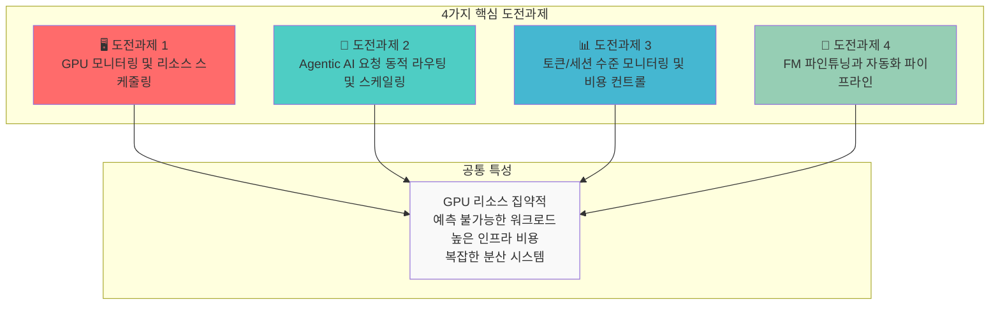

### 도전과제 요약

| 도전과제 | 핵심 문제 | 기존 인프라의 한계 |
| --- | --- | --- |
| **GPU 모니터링 및 스케줄링** | 멀티 클러스터 GPU 가시성 부재, 세대별 워크로드 매칭 | 수동 모니터링, 정적 할당 |
| **동적 라우팅 및 스케일링** | 예측 불가능한 트래픽, 멀티 모델 서빙 복잡성 | 느린 프로비저닝, 고정 용량 |
| **비용 컨트롤** | GPU 유휴 비용, 토큰 레벨 추적 어려움 | 비용 가시성 부재, 최적화 불가 |
| **FM 파인튜닝** | 분산 학습 인프라 복잡성, 리소스 프로비저닝 지연 | 수동 클러스터 관리, 낮은 활용률 |

:::warning 기존 인프라 접근 방식의 한계
전통적인 VM 기반 인프라나 수동 관리 방식으로는 Agentic AI의 **동적이고 예측 불가능한 워크로드 패턴**에 효과적으로 대응할 수 없습니다. GPU 리소스의 높은 비용과 복잡한 분산 시스템 요구사항은 **자동화된 인프라 관리**를 필수로 만듭니다.
:::

---

## 해결의 핵심: 클라우드 인프라 자동화와 AI 플랫폼의 통합

Agentic AI 플랫폼의 도전과제를 해결하는 핵심은 **클라우드 인프라 자동화와 AI 워크로드의 유기적 통합**입니다. 이 통합이 중요한 이유는 다음과 같습니다:

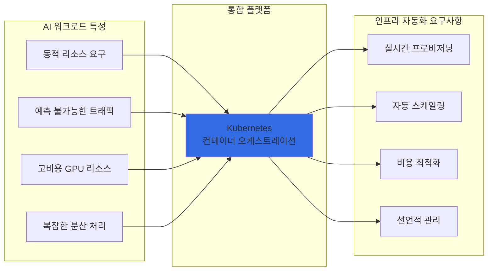

### 왜 Kubernetes인가?

Kubernetes는 Agentic AI 플랫폼의 모든 도전과제를 해결할 수 있는 **이상적인 기반 플랫폼**입니다:

| Kubernetes 핵심 기능 | AI 플랫폼 적용 | 해결되는 도전과제 |
| --- | --- | --- |
| **선언적 리소스 관리** | GPU 리소스를 코드로 정의하고 버전 관리 | 도전과제 1, 4 |
| **자동 스케일링 (HPA/VPA)** | 트래픽 패턴에 따른 Pod 자동 확장/축소 | 도전과제 2 |
| **네임스페이스 기반 격리** | 팀/프로젝트별 리소스 할당량 관리 | 도전과제 3 |
| **Operator 패턴** | 복잡한 분산 학습 워크플로우 자동화 | 도전과제 4 |
| **서비스 메시 통합** | 멀티 모델 라우팅 및 트래픽 관리 | 도전과제 2 |
| **메트릭 기반 오케스트레이션** | GPU 사용률 기반 스케줄링 결정 | 도전과제 1, 3 |

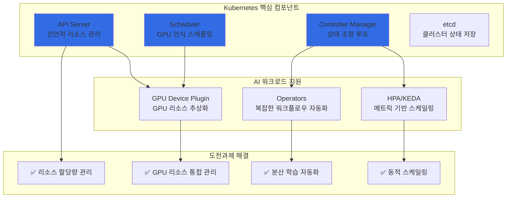

:::info Kubernetes의 AI 워크로드 지원
Kubernetes는 NVIDIA GPU Operator, Kubeflow, KEDA 등 AI/ML 생태계와의 풍부한 통합을 제공합니다. 이를 통해 GPU 리소스 관리, 분산 학습, 모델 서빙을 **단일 플랫폼에서 통합 관리**할 수 있습니다.
:::

---

이제 Kubernetes가 AI 워크로드에 적합한 이유를 이해했습니다. 다음으로, **각 도전과제를 해결하는 구체적인 오픈소스 솔루션들**을 살펴보겠습니다.

## Kubernetes 생태계의 Agentic AI 솔루션 버드뷰

Kubernetes 생태계에는 Agentic AI 플랫폼의 각 도전과제를 해결하기 위한 **전문화된 오픈소스 솔루션**들이 존재합니다. 이 솔루션들은 Kubernetes 네이티브로 설계되어 **선언적 관리, 자동 스케일링, 고가용성**의 이점을 그대로 활용할 수 있습니다.

### 솔루션 매핑 개요

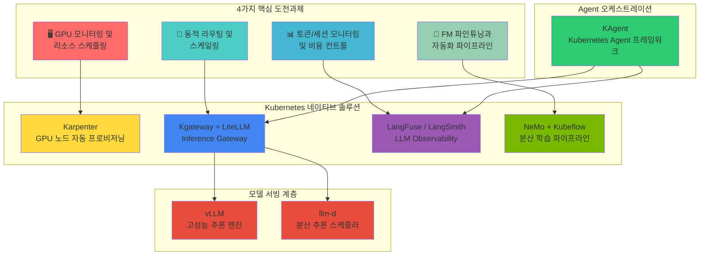

### 도전과제별 솔루션 상세 매핑

| 도전과제 | 핵심 솔루션 | 보조 솔루션 | 해결하는 문제 |
| --- | --- | --- | --- |
| **GPU 모니터링 및 스케줄링** | Karpenter | DCGM Exporter, NVIDIA GPU Operator | GPU 노드 자동 프로비저닝, 세대별 워크로드 매칭 |
| **동적 라우팅 및 스케일링** | Kgateway, LiteLLM | KEDA, vLLM, llm-d | 멀티 모델 라우팅, 트래픽 기반 자동 스케일링 |
| **토큰/비용 모니터링** | LangFuse, LangSmith | OpenTelemetry, Prometheus | 토큰 레벨 추적, 비용 가시성, 품질 평가 |
| **FM 파인튜닝** | NeMo, Kubeflow | MLflow, Ray | 분산 학습 오케스트레이션, 파이프라인 자동화 |

### 핵심 솔루션 소개

#### 1. 모델 서빙: vLLM + llm-d

**vLLM**은 LLM 추론을 위한 고성능 서빙 엔진으로, PagedAttention을 통해 **메모리 효율성을 극대화**합니다.

**llm-d**는 Kubernetes 환경에서 LLM 추론 요청을 **지능적으로 분산**하는 스케줄러입니다.

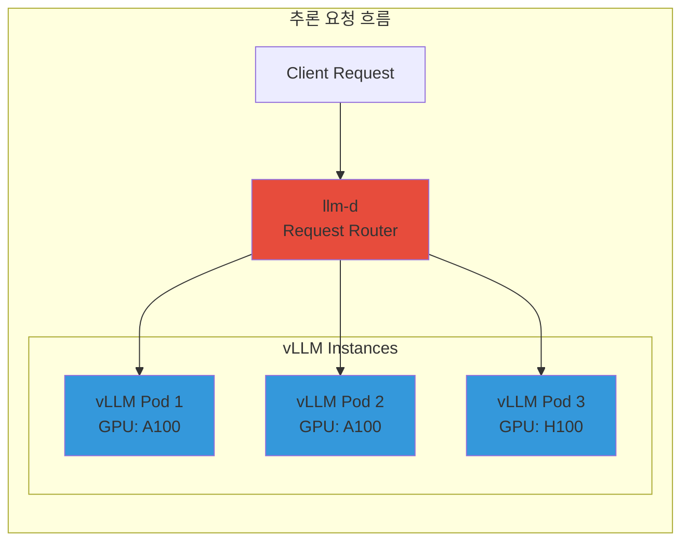

| 솔루션 | 역할 | 핵심 기능 |
| --- | --- | --- |
| **vLLM** | 추론 엔진 | PagedAttention, Continuous Batching, Speculative Decoding |
| **llm-d** | 분산 스케줄러 | 로드 밸런싱, Prefix Caching 인식 라우팅, 장애 복구 |

#### 2. Inference Gateway: Kgateway + LiteLLM

**Kgateway**는 Kubernetes Gateway API 기반의 AI 추론 게이트웨이로, **멀티 모델 라우팅과 트래픽 관리**를 제공합니다.

**LiteLLM**은 다양한 LLM 프로바이더를 **통합 API로 추상화**하여 모델 전환을 용이하게 합니다.

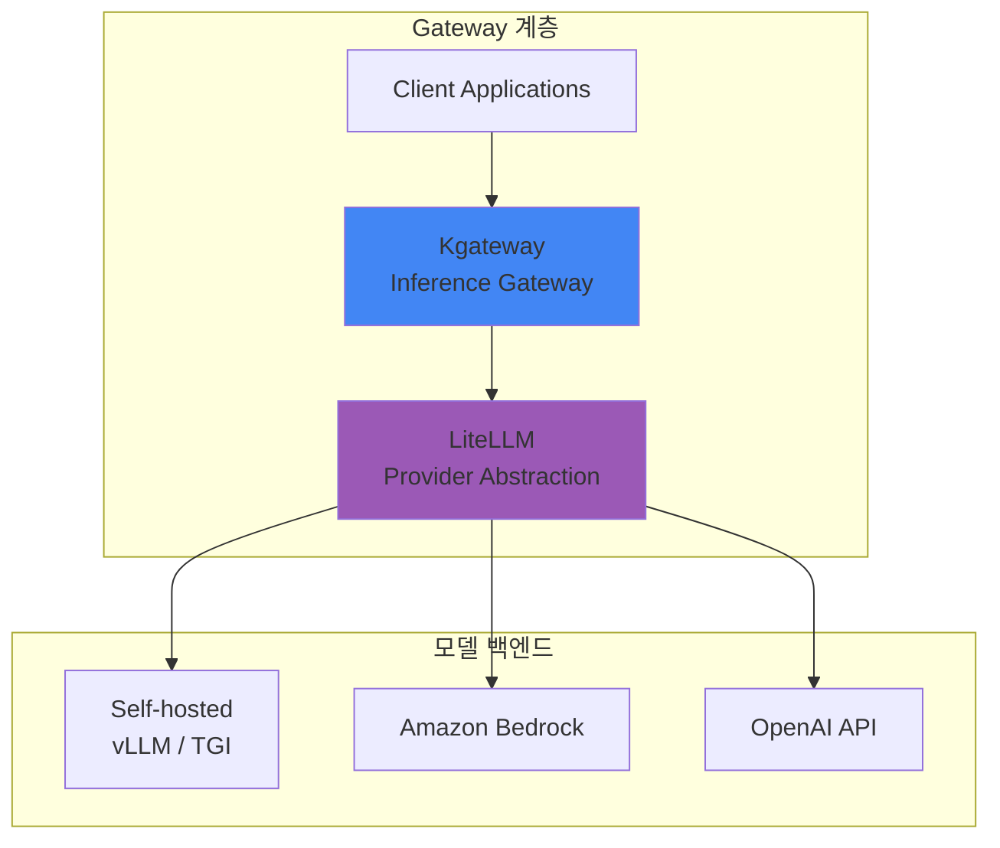

| 솔루션 | 역할 | 핵심 기능 |
| --- | --- | --- |
| **Kgateway** | 트래픽 관리 | 헤더 기반 라우팅, 가중치 분배, Rate Limiting, Canary 배포 |
| **LiteLLM** | API 추상화 | 100+ LLM 프로바이더 지원, 통합 API, 폴백 설정, 비용 추적 |

#### 3. LLM Observability: LangFuse + LangSmith

**LangFuse**와 **LangSmith**는 LLM 애플리케이션의 **전체 라이프사이클을 추적**하는 관측성 플랫폼입니다.

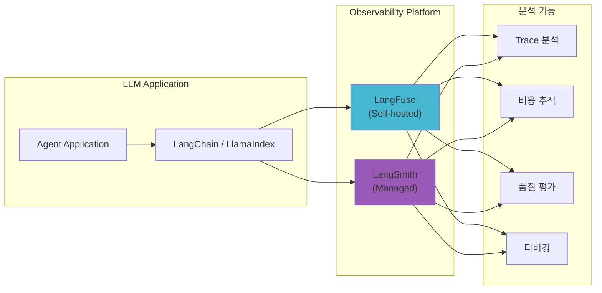

| 솔루션 | 배포 방식 | 핵심 기능 |
| --- | --- | --- |
| **LangFuse** | Self-hosted (K8s) | 토큰 추적, 비용 분석, 프롬프트 관리, A/B 테스트 |
| **LangSmith** | Managed SaaS | 트레이싱, 평가, 데이터셋 관리, 협업 기능 |

#### 4. Agent 오케스트레이션: KAgent

**KAgent**는 Kubernetes 네이티브 AI Agent 프레임워크로, **Agent 워크플로우를 CRD로 정의**하고 관리합니다.

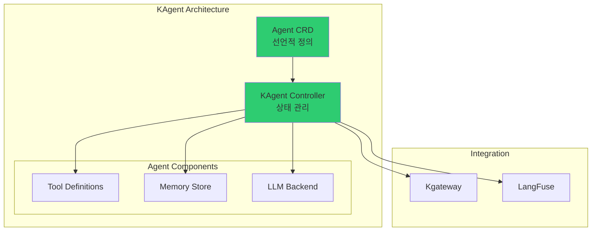

| 기능 | 설명 |
| --- | --- |
| **선언적 Agent 정의** | YAML로 Agent 구성, 도구, 메모리 정의 |
| **자동 스케일링** | 요청량에 따른 Agent 인스턴스 자동 확장 |
| **통합 관측성** | LangFuse/LangSmith와 자동 연동 |
| **도구 관리** | MCP(Model Context Protocol) 기반 도구 통합 |

### 솔루션 스택 통합 아키텍처

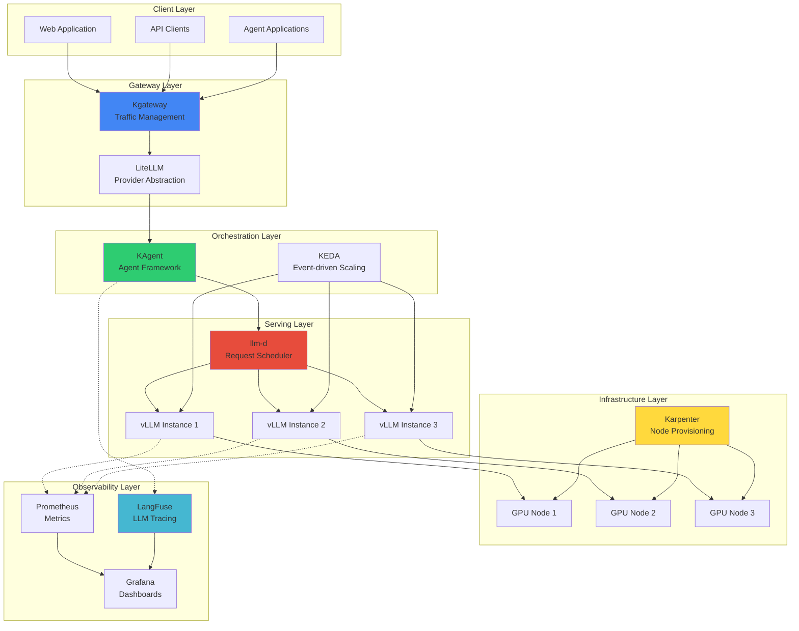

---

지금까지 Kubernetes 생태계의 다양한 솔루션들을 살펴보았습니다. 이제 이 솔루션들이 **실제로 어떻게 통합되어 작동하는지** 오픈소스 아키텍처 관점에서 자세히 알아보겠습니다.

## 오픈소스 생태계와 Kubernetes 통합 아키텍처

Agentic AI 플랫폼은 다양한 오픈소스 프로젝트들이 Kubernetes를 중심으로 유기적으로 통합되어 구성됩니다. 이 섹션에서는 **LLM Observability, 모델 서빙, 벡터 데이터베이스, GPU 인프라** 영역의 핵심 오픈소스들이 어떻게 협력하여 완전한 Agentic AI 플랫폼을 형성하는지 설명합니다.

### 오픈소스 통합 전체 아키텍처

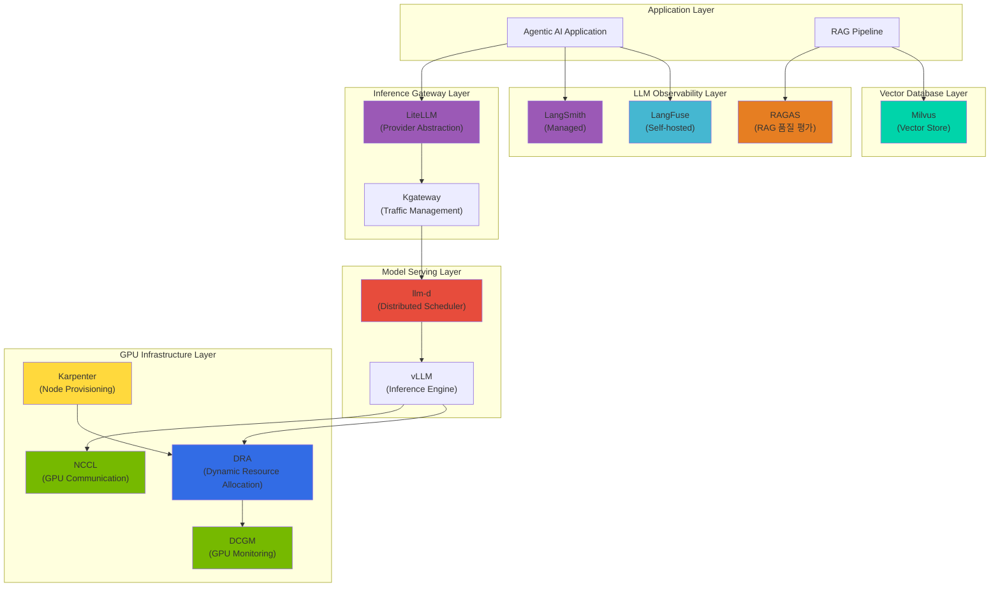

### 계층별 오픈소스 역할과 통합

#### 1. LLM Observability 계층: LangFuse, LangSmith, RAGAS

LLM 애플리케이션의 **전체 라이프사이클을 추적하고 품질을 평가**하는 핵심 도구들입니다.

| 솔루션 | 역할 | Kubernetes 통합 방식 | 핵심 기능 |
| --- | --- | --- | --- |
| **LangFuse** | LLM 트레이싱 (Self-hosted) | Helm Chart, StatefulSet | 토큰 추적, 비용 분석, 프롬프트 버전 관리 |
| **LangSmith** | LLM 트레이싱 (Managed) | SDK 연동 | 트레이싱, 평가, 데이터셋 관리, 협업 |
| **RAGAS** | RAG 품질 평가 | Job/CronJob | Faithfulness, Relevancy, Context Precision 평가 |

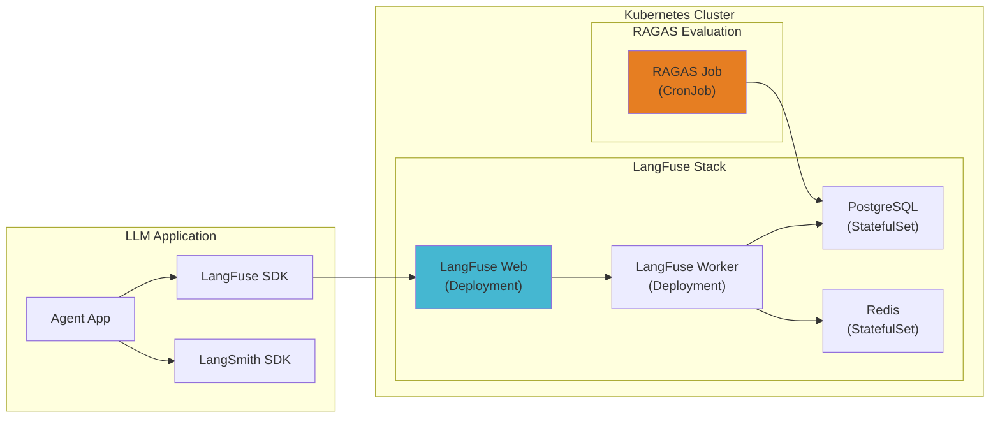

**LangFuse Kubernetes 배포 예시:**

```yaml
apiVersion: apps/v1
kind: Deployment
metadata:
  name: langfuse-web
  namespace: observability
spec:
  replicas: 2
  selector:
    matchLabels:
      app: langfuse-web
  template:
    spec:
      containers:
        - name: langfuse
          image: langfuse/langfuse:latest
          env:
            - name: DATABASE_URL
              valueFrom:
                secretKeyRef:
                  name: langfuse-secrets
                  key: database-url
            - name: NEXTAUTH_SECRET
              valueFrom:
                secretKeyRef:
                  name: langfuse-secrets
                  key: nextauth-secret
          resources:
            requests:
              memory: "512Mi"
              cpu: "250m"
---
apiVersion: batch/v1
kind: CronJob
metadata:
  name: ragas-evaluation
  namespace: observability
spec:
  schedule: "0 */6 * * *"  # 6시간마다 실행
  jobTemplate:
    spec:
      template:
        spec:
          containers:
            - name: ragas
              image: ragas/ragas:latest
              command: ["python", "-m", "ragas.evaluate"]
              env:
                - name: LANGFUSE_HOST
                  value: "http://langfuse-web:3000"
          restartPolicy: OnFailure
```

#### 2. Inference Gateway 계층: LiteLLM

**LiteLLM**은 100개 이상의 LLM 프로바이더를 **통합 OpenAI 호환 API로 추상화**합니다.

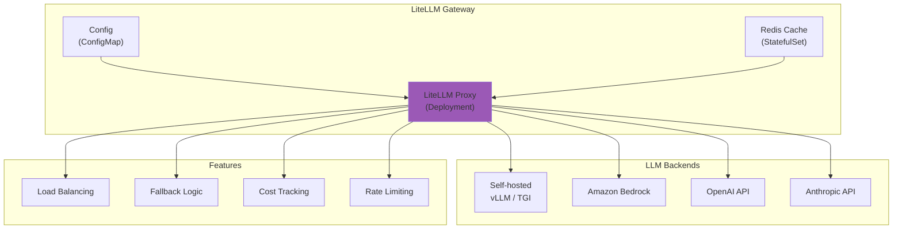

**LiteLLM Kubernetes 배포 예시:**

```yaml
apiVersion: apps/v1
kind: Deployment
metadata:
  name: litellm-proxy
  namespace: ai-gateway
spec:
  replicas: 3
  selector:
    matchLabels:
      app: litellm
  template:
    spec:
      containers:
        - name: litellm
          image: ghcr.io/berriai/litellm:main-latest
          ports:
            - containerPort: 4000
          env:
            - name: LITELLM_MASTER_KEY
              valueFrom:
                secretKeyRef:
                  name: litellm-secrets
                  key: master-key
            - name: REDIS_HOST
              value: "redis-cache"
          volumeMounts:
            - name: config
              mountPath: /app/config.yaml
              subPath: config.yaml
      volumes:
        - name: config
          configMap:
            name: litellm-config
---
apiVersion: v1
kind: ConfigMap
metadata:
  name: litellm-config
  namespace: ai-gateway
data:
  config.yaml: |
    model_list:
      - model_name: gpt-4
        litellm_params:
          model: openai/gpt-4
          api_key: os.environ/OPENAI_API_KEY
      - model_name: claude-3
        litellm_params:
          model: anthropic/claude-3-opus
          api_key: os.environ/ANTHROPIC_API_KEY
      - model_name: llama-70b
        litellm_params:
          model: openai/llama-70b
          api_base: http://vllm-llama:8000/v1

    router_settings:
      routing_strategy: least-busy
      enable_fallbacks: true

    general_settings:
      master_key: os.environ/LITELLM_MASTER_KEY
```

#### 3. 분산 추론 계층: llm-d

**llm-d**는 Kubernetes 환경에서 LLM 추론 요청을 **지능적으로 분산**하는 스케줄러입니다.

| 기능 | 설명 | Kubernetes 통합 |
| --- | --- | --- |
| **Prefix Caching 인식** | 동일 프롬프트 프리픽스를 가진 요청을 같은 인스턴스로 라우팅 | Service Discovery 활용 |
| **로드 밸런싱** | GPU 사용률 기반 지능형 분배 | Prometheus 메트릭 연동 |
| **장애 복구** | 인스턴스 장애 시 자동 재라우팅 | Health Check + Endpoint Slice |
| **동적 스케일링** | 요청량에 따른 백엔드 확장 | KEDA 연동 |

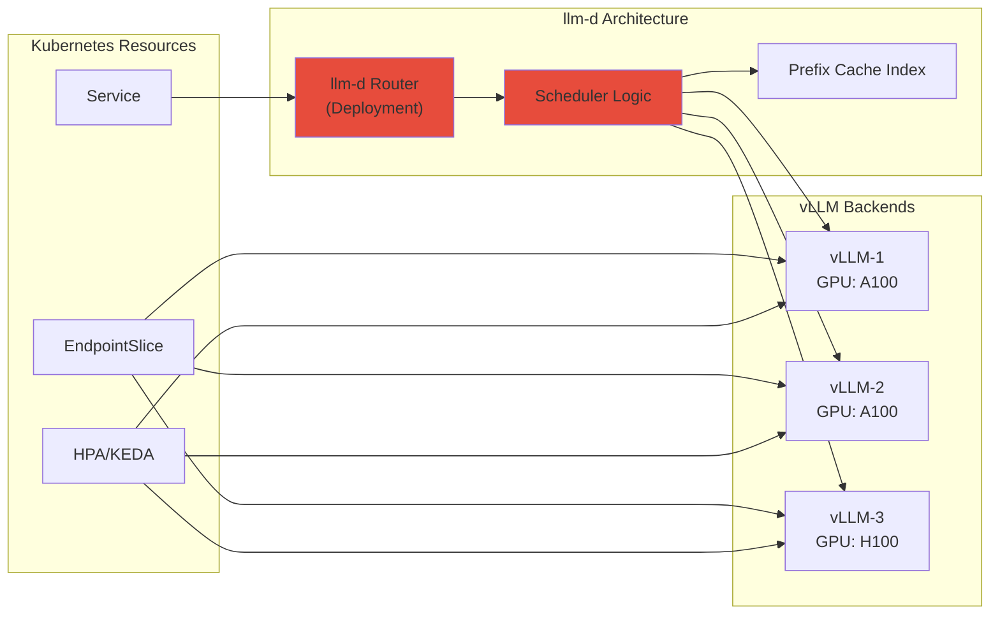

**llm-d Kubernetes 배포 예시:**

```yaml
apiVersion: apps/v1
kind: Deployment
metadata:
  name: llm-d-router
  namespace: ai-inference
spec:
  replicas: 2
  selector:
    matchLabels:
      app: llm-d
  template:
    spec:
      containers:
        - name: llm-d
          image: ghcr.io/llm-d/llm-d:latest
          ports:
            - containerPort: 8080
          env:
            - name: BACKENDS
              value: "vllm-0.vllm:8000,vllm-1.vllm:8000,vllm-2.vllm:8000"
            - name: ROUTING_STRATEGY
              value: "prefix-aware"
            - name: PROMETHEUS_ENDPOINT
              value: "http://prometheus:9090"
          resources:
            requests:
              memory: "256Mi"
              cpu: "500m"
---
apiVersion: v1
kind: Service
metadata:
  name: llm-d
  namespace: ai-inference
spec:
  selector:
    app: llm-d
  ports:
    - port: 8080
      targetPort: 8080
```

#### 4. 벡터 데이터베이스 계층: Milvus

**Milvus**는 대규모 벡터 검색을 위한 **클라우드 네이티브 벡터 데이터베이스**입니다. RAG 파이프라인의 핵심 컴포넌트로, Kubernetes에서 **분산 아키텍처로 운영**됩니다.

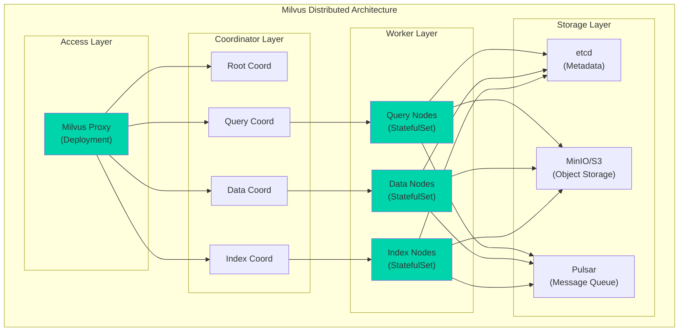

| 컴포넌트 | Kubernetes 리소스 | 역할 |
| --- | --- | --- |
| **Proxy** | Deployment | 클라이언트 요청 처리, 라우팅 |
| **Coordinators** | Deployment | 메타데이터 관리, 작업 조정 |
| **Query Nodes** | StatefulSet | 벡터 검색 실행 |
| **Data Nodes** | StatefulSet | 데이터 삽입/삭제 처리 |
| **Index Nodes** | StatefulSet | 인덱스 빌드 |

**Milvus Helm 배포:**

```bash
# Milvus Operator 설치
helm repo add milvus https://milvus-io.github.io/milvus-helm/
helm install milvus-operator milvus/milvus-operator -n milvus-operator --create-namespace

# Milvus 클러스터 배포
kubectl apply -f - <<EOF
apiVersion: milvus.io/v1beta1
kind: Milvus
metadata:
  name: milvus-cluster
  namespace: ai-vectordb
spec:
  mode: cluster
  dependencies:
    etcd:
      inCluster:
        values:
          replicaCount: 3
    storage:
      inCluster:
        values:
          mode: distributed
    pulsar:
      inCluster:
        values:
          components:
            autorecovery: false
  components:
    proxy:
      replicas: 2
      resources:
        requests:
          cpu: "1"
          memory: "2Gi"
    queryNode:
      replicas: 3
      resources:
        requests:
          cpu: "2"
          memory: "8Gi"
    dataNode:
      replicas: 2
    indexNode:
      replicas: 2
      resources:
        requests:
          nvidia.com/gpu: 1  # GPU 가속 인덱싱
EOF
```

#### 5. GPU 인프라 계층: DRA, DCGM, NCCL

GPU 리소스의 **동적 할당, 모니터링, 고속 통신**을 담당하는 핵심 인프라 컴포넌트들입니다.

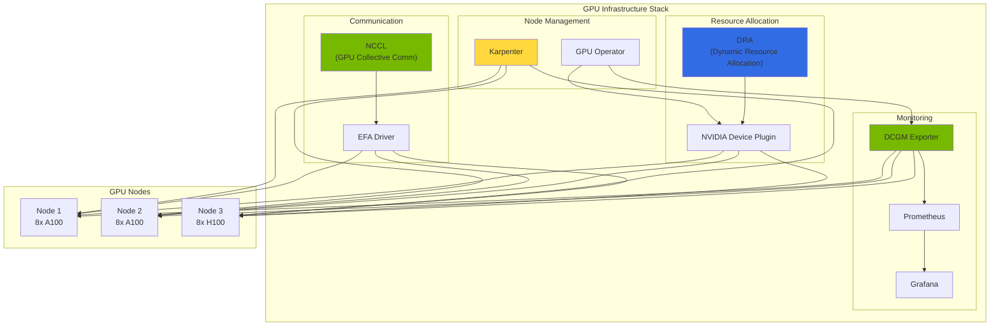

| 컴포넌트 | 역할 | Kubernetes 통합 |
| --- | --- | --- |
| **DRA (Dynamic Resource Allocation)** | GPU 리소스 동적 할당 | ResourceClaim, ResourceClass CRD |
| **DCGM (Data Center GPU Manager)** | GPU 메트릭 수집 | DaemonSet, ServiceMonitor |
| **NCCL (NVIDIA Collective Communication Library)** | 멀티 GPU 통신 최적화 | Pod 환경변수, EFA 연동 |

**DRA 기반 GPU 할당 예시:**

```yaml
# ResourceClass 정의
apiVersion: resource.k8s.io/v1alpha2
kind: ResourceClass
metadata:
  name: gpu.nvidia.com
driverName: gpu.nvidia.com
---
# ResourceClaimTemplate 정의
apiVersion: resource.k8s.io/v1alpha2
kind: ResourceClaimTemplate
metadata:
  name: gpu-claim-template
  namespace: ai-inference
spec:
  spec:
    resourceClassName: gpu.nvidia.com
    parametersRef:
      apiGroup: gpu.nvidia.com
      kind: GpuClaimParameters
      name: a100-params
---
# GPU 파라미터 정의
apiVersion: gpu.nvidia.com/v1alpha1
kind: GpuClaimParameters
metadata:
  name: a100-params
  namespace: ai-inference
spec:
  count: 1
  selector:
    gpu.nvidia.com/product: "NVIDIA-A100-SXM4-80GB"
---
# Pod에서 DRA 사용
apiVersion: v1
kind: Pod
metadata:
  name: vllm-inference
  namespace: ai-inference
spec:
  containers:
    - name: vllm
      image: vllm/vllm-openai:latest
      resources:
        claims:
          - name: gpu
  resourceClaims:
    - name: gpu
      source:
        resourceClaimTemplateName: gpu-claim-template
```

**DCGM Exporter 배포:**

```yaml
apiVersion: apps/v1
kind: DaemonSet
metadata:
  name: dcgm-exporter
  namespace: gpu-monitoring
spec:
  selector:
    matchLabels:
      app: dcgm-exporter
  template:
    metadata:
      labels:
        app: dcgm-exporter
    spec:
      nodeSelector:
        nvidia.com/gpu.present: "true"
      containers:
        - name: dcgm-exporter
          image: nvcr.io/nvidia/k8s/dcgm-exporter:3.3.0-3.2.0-ubuntu22.04
          ports:
            - containerPort: 9400
              name: metrics
          env:
            - name: DCGM_EXPORTER_LISTEN
              value: ":9400"
            - name: DCGM_EXPORTER_KUBERNETES
              value: "true"
          securityContext:
            privileged: true
          volumeMounts:
            - name: pod-resources
              mountPath: /var/lib/kubelet/pod-resources
      volumes:
        - name: pod-resources
          hostPath:
            path: /var/lib/kubelet/pod-resources
---
apiVersion: monitoring.coreos.com/v1
kind: ServiceMonitor
metadata:
  name: dcgm-exporter
  namespace: gpu-monitoring
spec:
  selector:
    matchLabels:
      app: dcgm-exporter
  endpoints:
    - port: metrics
      interval: 15s
```

**NCCL 최적화 설정:**

```yaml
apiVersion: v1
kind: ConfigMap
metadata:
  name: nccl-config
  namespace: ai-training
data:
  nccl-env.sh: |
    # NCCL 환경 변수 설정
    export NCCL_DEBUG=INFO
    export NCCL_SOCKET_IFNAME=eth0
    export NCCL_IB_DISABLE=0

    # EFA 사용 시 설정
    export FI_PROVIDER=efa
    export FI_EFA_USE_DEVICE_RDMA=1
    export FI_EFA_FORK_SAFE=1

    # 성능 최적화
    export NCCL_ALGO=Ring
    export NCCL_PROTO=Simple
    export NCCL_MIN_NCHANNELS=4
    export NCCL_MAX_NCHANNELS=8
```

### DRA 심층 분석: Dynamic Resource Allocation

#### DRA의 등장 배경과 필요성

Kubernetes 초기 단계에서 GPU 리소스 할당은 **Device Plugin** 모델을 사용했습니다. 이 모델은 다음과 같은 근본적인 한계를 가집니다:

| 한계점 | 설명 | 영향 |
| --- | --- | --- |
| **정적 할당** | 노드 시작 시 리소스 수량 고정 | GPU 부분 할당 불가능, 낮은 활용률 |
| **세분화 불가** | GPU 전체를 Pod에만 할당 가능 | GPU 파티셔닝 미지원 (MIG 사용 불가) |
| **우선순위 미지원** | 선착순 할당만 가능 | QoS 클래스 미적용, 공정한 리소스 배분 어려움 |
| **다이나믹 요구사항 미대응** | 런타임 리소스 변경 불가 | 초기 요청 값 고정, 스케일링 어려움 |
| **멀티 리소스 조정 불가** | 여러 리소스 타입 조율 불가 | Pod이 GPU 1개만 받았는데 메모리 부족 상황 |

**DRA (Dynamic Resource Allocation)**는 Kubernetes 1.26+부터 도입되어 이러한 한계를 극복합니다.

#### DRA의 핵심 개념

DRA는 **선언적 리소스 요청과 즉시 할당**을 분리하는 새로운 패러다임입니다:

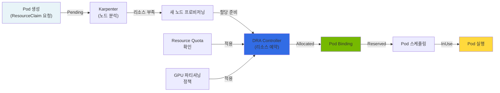

#### ResourceClaim 라이프사이클

DRA의 핵심은 **ResourceClaim**이라는 새로운 Kubernetes 리소스입니다:

```yaml
# 1. 라이프사이클 상태 설명

# PENDING 상태: 리소스 할당 대기 중
apiVersion: resource.k8s.io/v1alpha2
kind: ResourceClaim
metadata:
  name: gpu-claim-vllm
  namespace: ai-inference
spec:
  resourceClassName: gpu.nvidia.com
  parametersRef:
    apiGroup: gpu.nvidia.com
    kind: GpuClaimParameters
    name: h100-params
status:
  phase: Pending  # 아직 할당되지 않음

---

# ALLOCATED 상태: DRA 컨트롤러가 리소스 예약 완료
status:
  phase: Allocated
  allocation:
    resourceHandle: "gpu-handle-12345"
    shareable: false

---

# RESERVED 상태: Pod이 바인딩될 준비 완료
status:
  phase: Reserved
  allocation:
    resourceHandle: "gpu-handle-12345"
    nodeName: "gpu-node-01"

---

# INUSE 상태: Pod이 활성 실행 중
status:
  phase: InUse
  allocation:
    resourceHandle: "gpu-handle-12345"
    nodeName: "gpu-node-01"
  reservedFor:
    - kind: Pod
      name: vllm-inference
      namespace: ai-inference
      uid: "abc123"
```

각 상태에서 다음 상태로 전환되려면 특정 조건을 만족해야 합니다:

- **Pending → Allocated**: DRA 드라이버가 사용 가능한 리소스 확인 및 예약
- **Allocated → Reserved**: Pod이 ResourceClaim을 지정하고 스케줄러가 노드 결정
- **Reserved → InUse**: Pod이 실제로 노드에서 실행 시작

#### DRA vs Device Plugin 상세 비교

| 항목 | Device Plugin | DRA |
| --- | --- | --- |
| **리소스 할당 시점** | 노드 시작 시 (정적) | Pod 스케줄링 시 (동적) |
| **할당 단위** | 전체 GPU만 가능 | GPU 분할 가능 (MIG, time-slicing) |
| **우선순위 지원** | 없음 (선착순) | ResourceClaim의 우선순위 지원 |
| **멀티 리소스 조율** | 불가능 | Pod 수준에서 여러 리소스 조율 |
| **성능 제약 정책** | 없음 | ResourceClass로 성능 정책 정의 가능 |
| **할당 복원력** | 노드 장애 시 수동 정리 | 자동 복구 메커니즘 |
| **Kubernetes 버전** | 1.8+ | 1.26+ (Alpha), 1.29+ (Beta) |
| **성숙도** | 프로덕션 | 점진적 적용 권장 |

:::tip DRA 선택 가이드
**DRA를 사용해야 할 때:**
- GPU 파티셔닝이 필요한 경우 (MIG, time-slicing)
- 멀티 테넌트 환경에서 공정한 리소스 배분 필요
- 리소스 우선순위를 적용해야 하는 경우
- 동적 스케일링이 중요한 경우

**Device Plugin이 충분한 경우:**
- 단순히 GPU를 전체 단위로만 할당
- 레거시 시스템과의 호환성 중요
- Kubernetes 버전이 1.25 이하
:::

#### 고급 GPU 파티셔닝 전략

##### 1. MIG (Multi-Instance GPU) 기반 파티셔닝

MIG는 H100, A100 같은 최신 GPU를 최대 7개의 독립적인 GPU로 분할합니다:

```yaml
# MIG 프로필 정의
apiVersion: gpu.nvidia.com/v1alpha1
kind: GpuClaimParameters
metadata:
  name: a100-mig-1g.5gb
  namespace: ai-inference
spec:
  # MIG 프로필 선택: 1g.5gb, 2g.10gb, 3g.20gb, 7g.40gb
  mig:
    profile: "1g.5gb"  # 5GB 메모리를 가진 MIG 인스턴스
    count: 1

---

# MIG 기반 ResourceClass
apiVersion: resource.k8s.io/v1alpha2
kind: ResourceClass
metadata:
  name: gpu.nvidia.com/mig
driverName: nvidia.com/gpu
structuredParameters: true
parametersSchema:
  openAPIV3Schema:
    type: object
    properties:
      gpuProfile:
        type: string
        enum: ["1g.5gb", "2g.10gb", "3g.20gb", "7g.40gb"]
        default: "1g.5gb"

---

# MIG ResourceClaim 사용 예시
apiVersion: resource.k8s.io/v1alpha2
kind: ResourceClaim
metadata:
  name: inference-gpu-mig
  namespace: ai-inference
spec:
  resourceClassName: gpu.nvidia.com/mig
  parametersRef:
    apiGroup: gpu.nvidia.com
    kind: GpuClaimParameters
    name: a100-mig-1g.5gb

---

# Pod에서 MIG ResourceClaim 사용
apiVersion: v1
kind: Pod
metadata:
  name: vllm-mig-inference
  namespace: ai-inference
spec:
  containers:
    - name: vllm
      image: vllm/vllm-openai:latest
      command: ["python", "-m", "vllm.entrypoints.openai.api_server"]
      args:
        - "--model"
        - "meta-llama/Llama-2-7b-hf"
        - "--gpu-memory-utilization"
        - "0.9"
      resources:
        requests:
          memory: "4Gi"
          cpu: "4"
        claims:
          - name: mig-gpu
  resourceClaims:
    - name: mig-gpu
      source:
        resourceClaimTemplateName: mig-template
```

**MIG 프로필 성능 지표:**

| 프로필 | 메모리 | SM 수 | 용도 | 예상 처리량 |
| --- | --- | --- | --- | --- |
| 1g.5gb | 5GB | 14 | 소형 모델 (3B-7B) | ~20 tok/s |
| 2g.10gb | 10GB | 28 | 중형 모델 (7B-13B) | ~50 tok/s |
| 3g.20gb | 20GB | 42 | 대형 모델 (13B-70B) | ~100 tok/s |
| 7g.40gb | 40GB | 84 | 초대형 모델 (70B+) | ~200 tok/s |

##### 2. Time-Slicing 기반 파티셔닝

Time-Slicing은 시간 기반으로 GPU 시간을 분할하여 여러 Pod이 동일 GPU를 공유합니다:

```yaml
# Time-Slicing ResourceSlice 정의
apiVersion: gpu.nvidia.com/v1alpha1
kind: ResourceSlice
metadata:
  name: gpu-node-timeslice
  namespace: ai-inference
spec:
  nodeName: gpu-node-01
  devices:
    - id: 0  # GPU 0
      vendor: nvidia
      model: "A100-SXM4-80GB"
      # Time-slicing 설정: 최대 4개 Pod이 동일 GPU 사용 가능
      timeSlicing:
        replicas: 4
        # GPU 스케줄링 정책: "aggressive", "default", "conservative"
        schedulingPolicy: "default"
        # 컨텍스트 스위칭 오버헤드 설정 (ms)
        contextSwitchInterval: 100

---

# Time-Slicing ResourceClass
apiVersion: resource.k8s.io/v1alpha2
kind: ResourceClass
metadata:
  name: gpu.nvidia.com/timeslice
driverName: nvidia.com/gpu
structuredParameters: true

---

# Time-Slicing ResourceClaim 사용
apiVersion: resource.k8s.io/v1alpha2
kind: ResourceClaim
metadata:
  name: inference-gpu-slice
  namespace: ai-inference
spec:
  resourceClassName: gpu.nvidia.com/timeslice

---

# 여러 Pod이 동일 GPU를 time-slice로 공유
apiVersion: apps/v1
kind: Deployment
metadata:
  name: vllm-timeslice-replicas
  namespace: ai-inference
spec:
  replicas: 3  # 3개 Pod이 동일 GPU 공유
  selector:
    matchLabels:
      app: vllm-slice
  template:
    metadata:
      labels:
        app: vllm-slice
    spec:
      containers:
        - name: vllm
          image: vllm/vllm-openai:latest
          resources:
            requests:
              memory: "8Gi"
              cpu: "2"
            claims:
              - name: gpu-slice
      resourceClaims:
        - name: gpu-slice
          source:
            resourceClaimTemplateName: timeslice-template
```

**Time-Slicing 성능 고려사항:**

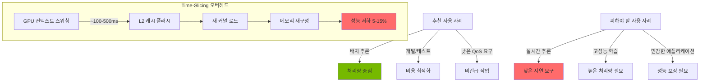

### NCCL 심층 분석: Collective Communication 최적화

#### NCCL의 역할과 중요성

NCCL (**NVIDIA Collective Communication Library**)는 분산 GPU 학습에서 **multi-GPU 간 고속 통신**을 담당하는 핵심 라이브러리입니다. 딥러닝 모델의 성능은 NCCL의 최적화 정도에 직접적으로 영향을 미칩니다.

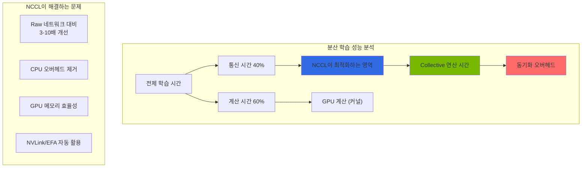

**분산 학습에서 NCCL이 중요한 이유:**

| 항목 | 영향도 | NCCL의 최적화 |
| --- | --- | --- |
| **모델 병렬화 (Model Parallelism)** | 높음 | 각 GPU 간 활성화/그래디언트 전송 최적화 |
| **데이터 병렬화 (Data Parallelism)** | 매우 높음 | AllReduce로 그래디언트 동기화 빠름 |
| **파이프라인 병렬화 (Pipeline Parallelism)** | 높음 | 스테이지 간 활성화 전송 최적화 |
| **혼합 정밀도 학습 (Mixed Precision)** | 중간 | 압축된 그래디언트 통신 최적화 |

#### 핵심 집합 연산 (Collective Operations)

##### 1. AllReduce - 가장 중요한 연산

AllReduce는 모든 GPU의 데이터를 합산하고 결과를 모든 GPU에 배분합니다:

```
초기 상태:
GPU 0: [1, 2, 3]
GPU 1: [4, 5, 6]
GPU 2: [7, 8, 9]
GPU 3: [10, 11, 12]

AllReduce 후:
GPU 0: [22, 26, 30]  # 1+4+7+10, 2+5+8+11, 3+6+9+12
GPU 1: [22, 26, 30]
GPU 2: [22, 26, 30]
GPU 3: [22, 26, 30]
```

**AllReduce 사용 예시 (분산 학습에서):**

```python
import torch
import torch.distributed as dist

# 분산 학습 초기화
dist.init_process_group("nccl")
rank = dist.get_rank()
world_size = dist.get_world_size()

# 각 GPU의 그래디언트 (서로 다름)
gradients = torch.randn(1024, device=f"cuda:{rank}")

# AllReduce: 모든 GPU의 그래디언트 합산 및 평균화
dist.all_reduce(gradients, op=dist.ReduceOp.SUM)
gradients /= world_size

# 이제 모든 GPU가 동일한 그래디언트를 가짐
# 모델 가중치 업데이트 시 동기화됨
```

##### 2. AllGather - 모든 데이터 수집

AllGather는 모든 GPU의 데이터를 수집하여 각 GPU에 전체 데이터를 배분합니다:

```
초기 상태:
GPU 0: [1, 2]
GPU 1: [3, 4]
GPU 2: [5, 6]
GPU 3: [7, 8]

AllGather 후:
GPU 0: [1, 2, 3, 4, 5, 6, 7, 8]
GPU 1: [1, 2, 3, 4, 5, 6, 7, 8]
GPU 2: [1, 2, 3, 4, 5, 6, 7, 8]
GPU 3: [1, 2, 3, 4, 5, 6, 7, 8]
```

**AllGather 사용 사례:**

```python
# 예시: 배치 정규화에서 모든 GPU의 통계 수집
local_batch_stats = compute_batch_stats(local_batch)

# AllGather로 모든 GPU의 통계 수집
all_batch_stats = [torch.empty_like(local_batch_stats) for _ in range(world_size)]
dist.all_gather(all_batch_stats, local_batch_stats)

# 전역 통계 계산
global_mean = torch.stack(all_batch_stats).mean(dim=0)
global_std = torch.stack(all_batch_stats).std(dim=0)
```

##### 3. ReduceScatter - AllGather의 역연산

ReduceScatter는 데이터를 먼저 합산한 후 각 GPU에 분할하여 배분합니다:

```
초기 상태:
GPU 0: [1, 2, 3, 4, 5, 6, 7, 8]
GPU 1: [9, 10, 11, 12, 13, 14, 15, 16]
GPU 2: [17, 18, 19, 20, 21, 22, 23, 24]
GPU 3: [25, 26, 27, 28, 29, 30, 31, 32]

ReduceScatter 합산 후 분할:
GPU 0: [52, 56]      # (1+9+17+25), (2+10+18+26)
GPU 1: [60, 64]      # (3+11+19+27), (4+12+20+28)
GPU 2: [68, 72]      # (5+13+21+29), (6+14+22+30)
GPU 3: [76, 80]      # (7+15+23+31), (8+16+24+32)
```

**ReduceScatter 사용 사례 (Model Parallelism):**

```python
# 모델 병렬화에서 계산 결과를 합산하고 분할
local_output = model_fragment(input_data)

# ReduceScatter: 모든 프래그먼트 합산 후 각 GPU에 분할
reduced_output = torch.empty(output_size // world_size, device=local_output.device)
dist.reduce_scatter(reduced_output, [local_output] * world_size)
```

##### 4. Broadcast - 데이터 배포

Broadcast는 한 GPU의 데이터를 모든 GPU에 복사합니다:

```
초기 상태:
GPU 0: [1, 2, 3, 4]
GPU 1: [0, 0, 0, 0]
GPU 2: [0, 0, 0, 0]
GPU 3: [0, 0, 0, 0]

Broadcast 후:
GPU 0: [1, 2, 3, 4]
GPU 1: [1, 2, 3, 4]
GPU 2: [1, 2, 3, 4]
GPU 3: [1, 2, 3, 4]
```

**Broadcast 사용 사례:**

```python
# 마스터 GPU에서 모델 체크포인트 브로드캐스트
model_state = load_checkpoint() if rank == 0 else None

# Broadcast: 마스터 GPU의 모델 상태를 모든 GPU에 배포
dist.broadcast_object_list([model_state], src=0)
model.load_state_dict(model_state)
```

#### 네트워크 토폴로지 인식

NCCL은 GPU 간 물리적 연결 토폴로지를 자동으로 감지하고 최적의 경로를 선택합니다:

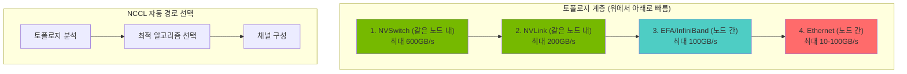

#### NCCL 성능 튜닝 파라미터

```yaml
# NCCL 환경 변수 완벽 가이드

# 1. 알고리즘 선택
export NCCL_ALGO=Ring           # Ring (기본), Tree, CollNet
export NCCL_ALGO_ALL=Ring       # AllReduce 알고리즘 지정
export NCCL_ALGO_TREE=Tree      # Tree 알고리즘 강제

# 2. 프로토콜 선택
export NCCL_PROTO=Simple        # Simple (기본) 또는 LL (Low Latency)

# 3. 채널 설정 (매우 중요)
export NCCL_MIN_NCHANNELS=4     # 최소 채널 수 (기본 4)
export NCCL_MAX_NCHANNELS=8     # 최대 채널 수 (기본 32)

# 4. 버퍼 크기
export NCCL_BUFFSIZE=2097152    # 기본 2MB, 1MB-4MB 권장

# 5. 디버그 설정
export NCCL_DEBUG=INFO          # TRACE, DEBUG, INFO, WARN
export NCCL_DEBUG_FILE=/var/log/nccl-debug.txt
export NCCL_DEBUG_SUBSYS=ALL    # 모든 서브시스템 추적

# 6. 네트워크 인터페이스
export NCCL_SOCKET_IFNAME=eth0  # 사용할 네트워크 인터페이스
export NCCL_IB_DISABLE=0        # InfiniBand 사용

# 7. EFA 설정 (AWS)
export FI_PROVIDER=efa
export FI_EFA_USE_DEVICE_RDMA=1
export FI_EFA_FORK_SAFE=1

# 8. 커널 최적화
export NCCL_CHECKS_DISABLE=0    # 안전 검사 활성화 (프로덕션)
export NCCL_COMM_BLOCKING_WAIT=0
export NCCL_ASYNC_ERROR_HANDLING=1

# 9. P2P 설정
export NCCL_P2P_DISABLE=0       # GPU P2P 통신 활성화
export NCCL_P2P_LEVEL=SYS       # P2P 레벨: LOC (로컬), SYS (시스템)

# 10. 타임아웃 설정
export NCCL_COMM_WAIT_TIMEOUT=0 # 0 = 무한 대기
```

---

## 다음 단계

이 문서에서는 Agentic AI 워크로드의 4가지 핵심 도전과제와 Kubernetes 기반 오픈소스 생태계를 살펴보았습니다.

:::info 다음 단계: EKS 기반 해결방안
이 문서에서 소개한 도전과제들을 **Amazon EKS와 AWS 서비스**를 활용하여 해결하는 구체적인 방법은 [EKS 기반 Agentic AI 해결방안](./agentic-ai-solutions-eks.md)을 참조하세요.

다음 문서에서 다룰 내용:
- EKS Auto Mode로 완전 자동화된 클러스터 구축
- Karpenter를 통한 GPU 노드 자동 프로비저닝
- AWS 서비스와의 통합 (Bedrock, S3, CloudWatch)
- 프로덕션 환경을 위한 보안 및 운영 전략
- 실전 배포 가이드 및 트러블슈팅
:::

---

## 참고 자료

### Kubernetes 및 인프라
- [Kubernetes 공식 문서](https://kubernetes.io/docs/)
- [Karpenter 공식 문서](https://karpenter.sh/docs/)
- [Amazon EKS Best Practices Guide](https://aws.github.io/aws-eks-best-practices/)
- [NVIDIA GPU Operator Documentation](https://docs.nvidia.com/datacenter/cloud-native/gpu-operator/overview.html)
- [KEDA - Kubernetes Event-driven Autoscaling](https://keda.sh/)

### 모델 서빙 및 추론
- [vLLM Documentation](https://docs.vllm.ai/)
- [llm-d Project](https://github.com/llm-d/llm-d)
- [Kgateway Documentation](https://kgateway.io/docs/)
- [LiteLLM Documentation](https://docs.litellm.ai/)

### LLM Observability
- [LangFuse Documentation](https://langfuse.com/docs)
- [LangSmith Documentation](https://docs.smith.langchain.com/)
- [RAGAS Documentation](https://docs.ragas.io/)

### 벡터 데이터베이스
- [Milvus Documentation](https://milvus.io/docs)
- [Milvus Operator](https://github.com/milvus-io/milvus-operator)

### GPU 인프라
- [NVIDIA DRA Documentation](https://docs.nvidia.com/datacenter/cloud-native/kubernetes/latest/dra.html)
- [DCGM Exporter](https://github.com/NVIDIA/dcgm-exporter)
- [NCCL Documentation](https://docs.nvidia.com/deeplearning/nccl/user-guide/docs/index.html)
- [AWS EFA Documentation](https://docs.aws.amazon.com/AWSEC2/latest/UserGuide/efa.html)

### Agent 프레임워크 및 학습
- [KAgent - Kubernetes Agent Framework](https://github.com/kagent-dev/kagent)
- [NVIDIA NeMo Framework](https://docs.nvidia.com/nemo-framework/user-guide/latest/overview.html)
- [Kubeflow Documentation](https://www.kubeflow.org/docs/)
