import Tabs from '@theme/Tabs';
import TabItem from '@theme/TabItem';

> 📅 **작성일**: 2025-02-05 | **수정일**: 2026-02-04 | ⏱️ **읽는 시간**: 약 25분

## 소개

Agentic AI 플랫폼을 구축하고 운영할 때, 플랫폼 엔지니어와 아키텍트는 기존 웹 애플리케이션과는 근본적으로 다른 기술적 도전에 직면합니다. 이 문서에서는 **4가지 핵심 도전과제**를 분석하고, 이를 해결하기 위한 **Kubernetes 기반 오픈소스 생태계**를 탐구합니다.

## Agentic AI 플랫폼의 4가지 핵심 도전과제

Frontier Model(최신 대규모 언어 모델)을 활용한 Agentic AI 시스템은 기존 웹 애플리케이션과는 **근본적으로 다른 인프라 요구사항**을 가집니다.

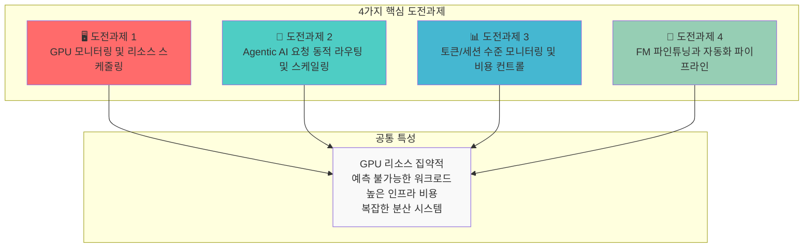

### 도전과제 요약

| 도전과제 | 핵심 문제 | 기존 인프라의 한계 |
| --- | --- | --- |
| **GPU 모니터링 및 스케줄링** | 멀티 클러스터 GPU 가시성 부재, 세대별 워크로드 매칭 | 수동 모니터링, 정적 할당 |
| **동적 라우팅 및 스케일링** | 예측 불가능한 트래픽, 멀티 모델 서빙 복잡성 | 느린 프로비저닝, 고정 용량 |
| **비용 컨트롤** | GPU 유휴 비용, 토큰 레벨 추적 어려움 | 비용 가시성 부재, 최적화 불가 |
| **FM 파인튜닝** | 분산 학습 인프라 복잡성, 리소스 프로비저닝 지연 | 수동 클러스터 관리, 낮은 활용률 |

:::warning 기존 인프라 접근 방식의 한계
전통적인 VM 기반 인프라나 수동 관리 방식으로는 Agentic AI의 **동적이고 예측 불가능한 워크로드 패턴**에 효과적으로 대응할 수 없습니다. GPU 리소스의 높은 비용과 복잡한 분산 시스템 요구사항은 **자동화된 인프라 관리**를 필수로 만듭니다.
:::

---

## 해결의 핵심: 클라우드 인프라 자동화와 AI 플랫폼의 통합

Agentic AI 플랫폼의 도전과제를 해결하는 핵심은 **클라우드 인프라 자동화와 AI 워크로드의 유기적 통합**입니다. 이 통합이 중요한 이유는 다음과 같습니다:

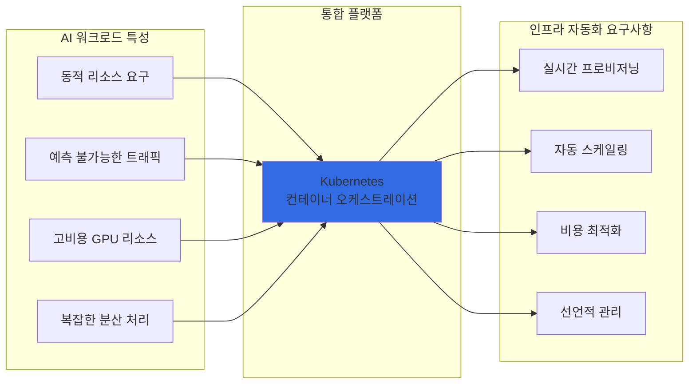

## 왜 Kubernetes인가?

Kubernetes는 Agentic AI 플랫폼의 모든 도전과제를 해결할 수 있는 **이상적인 기반 플랫폼**입니다:

| Kubernetes 핵심 기능 | AI 플랫폼 적용 | 해결되는 도전과제 |
| --- | --- | --- |
| **선언적 리소스 관리** | GPU 리소스를 코드로 정의하고 버전 관리 | 도전과제 1, 4 |
| **자동 스케일링 (HPA/VPA)** | 트래픽 패턴에 따른 Pod 자동 확장/축소 | 도전과제 2 |
| **네임스페이스 기반 격리** | 팀/프로젝트별 리소스 할당량 관리 | 도전과제 3 |
| **Operator 패턴** | 복잡한 분산 학습 워크플로우 자동화 | 도전과제 4 |
| **서비스 메시 통합** | 멀티 모델 라우팅 및 트래픽 관리 | 도전과제 2 |
| **메트릭 기반 오케스트레이션** | GPU 사용률 기반 스케줄링 결정 | 도전과제 1, 3 |

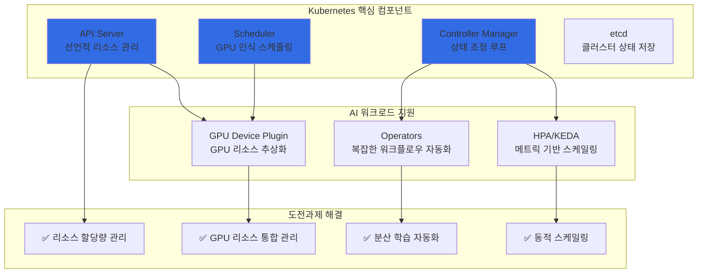

:::info Kubernetes의 AI 워크로드 지원
Kubernetes는 NVIDIA GPU Operator, Kubeflow, KEDA 등 AI/ML 생태계와의 풍부한 통합을 제공합니다. 이를 통해 GPU 리소스 관리, 분산 학습, 모델 서빙을 **단일 플랫폼에서 통합 관리**할 수 있습니다.
:::

---

이제 Kubernetes가 AI 워크로드에 적합한 이유를 이해했습니다. 다음으로, **각 도전과제를 해결하는 구체적인 오픈소스 솔루션들**을 살펴보겠습니다.

## Kubernetes 생태계의 Agentic AI 솔루션 버드뷰

Kubernetes 생태계에는 Agentic AI 플랫폼의 각 도전과제를 해결하기 위한 **전문화된 오픈소스 솔루션**들이 존재합니다. 이 솔루션들은 Kubernetes 네이티브로 설계되어 **선언적 관리, 자동 스케일링, 고가용성**의 이점을 그대로 활용할 수 있습니다.

### 솔루션 매핑 개요

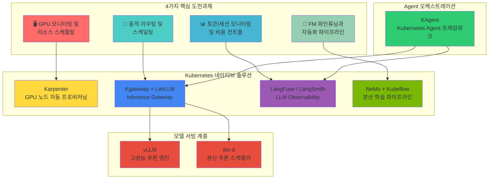

### 도전과제별 솔루션 상세 매핑

| 도전과제 | 핵심 솔루션 | 보조 솔루션 | 해결하는 문제 |
| --- | --- | --- | --- |
| **GPU 모니터링 및 스케줄링** | Karpenter | DCGM Exporter, NVIDIA GPU Operator | GPU 노드 자동 프로비저닝, 세대별 워크로드 매칭 |
| **동적 라우팅 및 스케일링** | Kgateway, LiteLLM | KEDA, vLLM, llm-d | 멀티 모델 라우팅, 트래픽 기반 자동 스케일링 |
| **토큰/비용 모니터링** | LangFuse, LangSmith | OpenTelemetry, Prometheus | 토큰 레벨 추적, 비용 가시성, 품질 평가 |
| **FM 파인튜닝** | NeMo, Kubeflow | MLflow, Ray | 분산 학습 오케스트레이션, 파이프라인 자동화 |

---

지금까지 Kubernetes 생태계의 다양한 솔루션들을 살펴보았습니다. 이제 이 솔루션들이 **실제로 어떻게 통합되어 작동하는지** 오픈소스 아키텍처 관점에서 자세히 알아보겠습니다.

## 오픈소스 생태계와 Kubernetes 통합 아키텍처

Agentic AI 플랫폼은 다양한 오픈소스 프로젝트들이 Kubernetes를 중심으로 유기적으로 통합되어 구성됩니다. 이 섹션에서는 **LLM Observability, 모델 서빙, 벡터 데이터베이스, GPU 인프라** 영역의 핵심 오픈소스들이 어떻게 협력하여 완전한 Agentic AI 플랫폼을 형성하는지 설명합니다.

### 1. 모델 서빙: vLLM + llm-d

**vLLM**은 LLM 추론을 위한 고성능 서빙 엔진으로, PagedAttention을 통해 **메모리 효율성을 극대화**합니다.

**llm-d**는 Kubernetes 환경에서 LLM 추론 요청을 **지능적으로 분산**하는 스케줄러입니다.

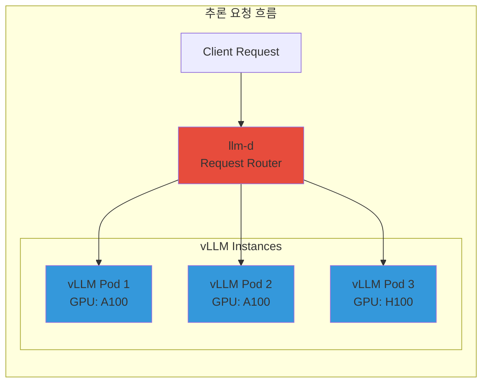

| 솔루션 | 역할 | 핵심 기능 |
| --- | --- | --- |
| **vLLM** | 추론 엔진 | PagedAttention, Continuous Batching, Speculative Decoding |
| **llm-d** | 분산 스케줄러 | 로드 밸런싱, Prefix Caching 인식 라우팅, 장애 복구 |

**Kubernetes 통합:**
- Kubernetes Deployment로 배포
- Service를 통해 노출
- 큐 깊이 메트릭 기반 HPA로 스케일링
- resource requests/limits를 통한 GPU 할당

### 2. 추론 게이트웨이: Kgateway + LiteLLM

**Kgateway**는 Kubernetes Gateway API 기반의 AI 추론 게이트웨이로, **멀티 모델 라우팅과 트래픽 관리**를 제공합니다.

**LiteLLM**은 다양한 LLM 프로바이더를 **통합 API로 추상화**하여 모델 전환을 용이하게 합니다.

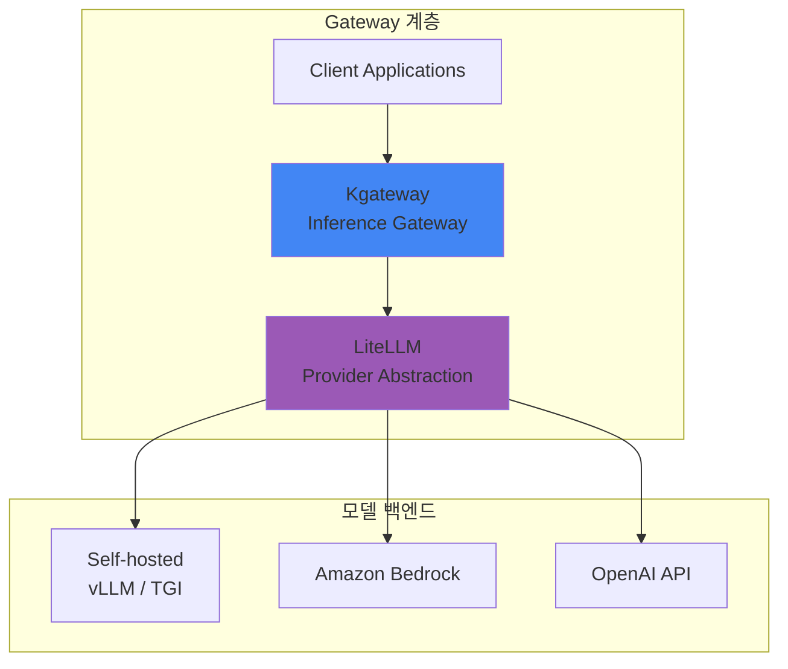

| 솔루션 | 역할 | 핵심 기능 |
| --- | --- | --- |
| **Kgateway** | 트래픽 관리 | 헤더 기반 라우팅, 가중치 분배, Rate Limiting, Canary 배포 |
| **LiteLLM** | API 추상화 | 100+ LLM 프로바이더 지원, 통합 API, 폴백 설정, 비용 추적 |

**Kubernetes 통합:**
- Kubernetes Gateway API 표준 구현
- HTTPRoute 리소스를 통한 선언적 라우팅
- Kubernetes Service와 네이티브 통합
- 크로스 네임스페이스 라우팅 지원

### 3. LLM Observability: LangFuse + LangSmith

**LangFuse**와 **LangSmith**는 LLM 애플리케이션의 **전체 라이프사이클을 추적**하는 관측성 플랫폼입니다.

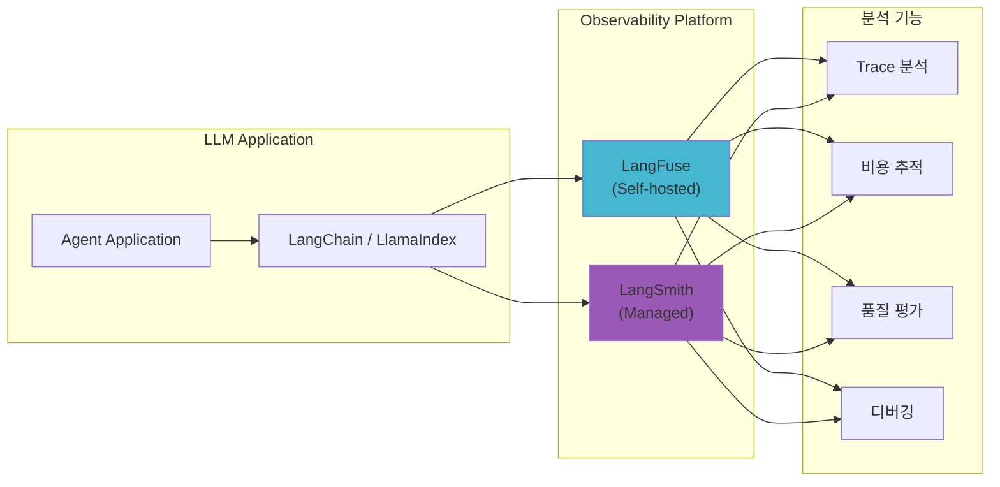

| 솔루션 | 배포 방식 | 핵심 기능 |
| --- | --- | --- |
| **LangFuse** | Self-hosted (K8s) | 토큰 추적, 비용 분석, 프롬프트 관리, A/B 테스트 |
| **LangSmith** | Managed SaaS | 트레이싱, 평가, 데이터셋 관리, 협업 기능 |

**Kubernetes 통합 (LangFuse):**
- StatefulSet 또는 Deployment로 배포
- PostgreSQL 백엔드 필요 (관리형 RDS 또는 클러스터 내 구성 가능)
- Prometheus 형식의 메트릭 노출
- Pod 환경 변수를 통한 SDK 연동

### 4. Agent 오케스트레이션: KAgent

**KAgent**는 Kubernetes 네이티브 AI Agent 프레임워크로, **Agent 워크플로우를 CRD로 정의**하고 관리합니다.

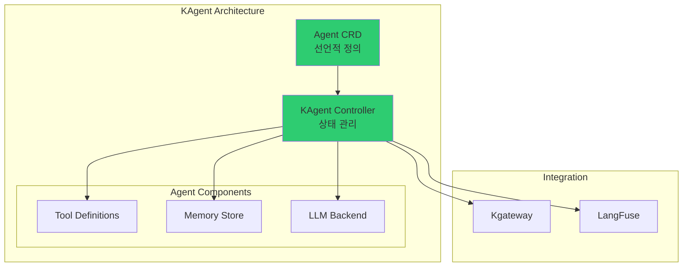

| 기능 | 설명 |
| --- | --- |
| **선언적 Agent 정의** | YAML로 Agent 구성, 도구, 메모리 정의 |
| **자동 스케일링** | 요청량에 따른 Agent 인스턴스 자동 확장 |
| **통합 관측성** | LangFuse/LangSmith와 자동 연동 |
| **도구 관리** | MCP(Model Context Protocol) 기반 도구 통합 |

**Kubernetes 통합:**
- Custom Resource Definitions (CRD)로 Kubernetes 확장
- Controller 패턴을 통한 상태 조정
- Kubernetes RBAC와 네이티브 통합
- Kubernetes Secrets를 활용한 API 키 관리

### 솔루션 스택 통합 아키텍처

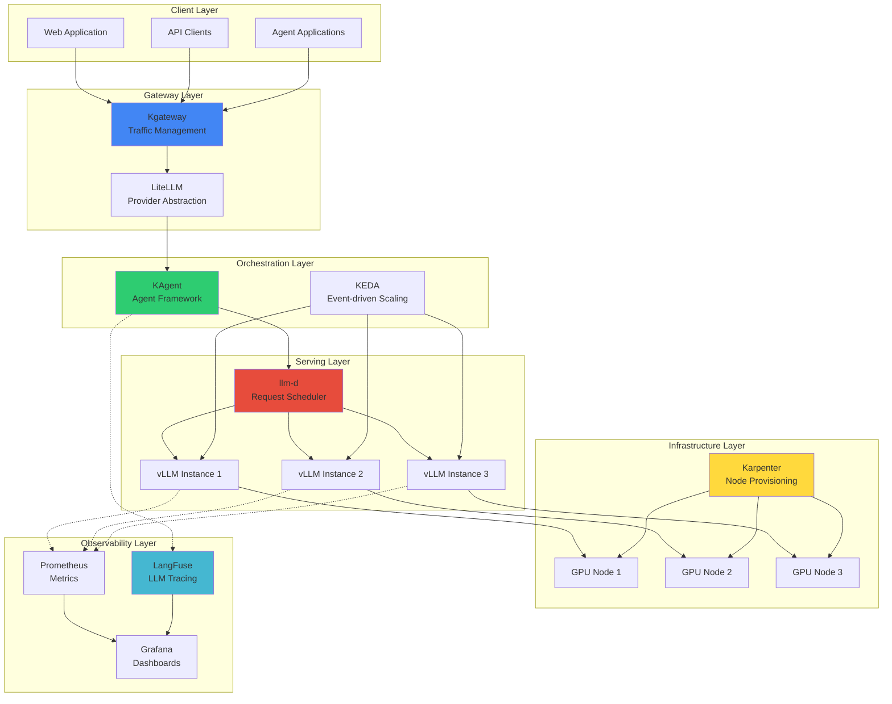

---

### 오픈소스 통합 전체 아키텍처

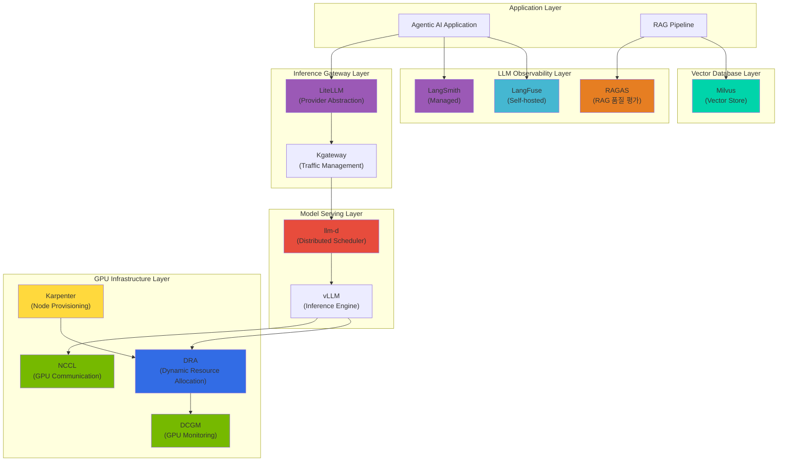

### 계층별 오픈소스 역할과 통합

#### LLM Observability 계층: LangFuse, LangSmith, RAGAS

LLM 애플리케이션의 **전체 라이프사이클을 추적하고 품질을 평가**하는 핵심 도구들입니다.

| 솔루션 | 역할 | Kubernetes 통합 방식 | 핵심 기능 |
| --- | --- | --- | --- |
| **LangFuse** | LLM 트레이싱 (Self-hosted) | Helm Chart, StatefulSet | 토큰 추적, 비용 분석, 프롬프트 버전 관리 |
| **LangSmith** | LLM 트레이싱 (Managed) | SDK 연동 | 트레이싱, 평가, 데이터셋 관리, 협업 |
| **RAGAS** | RAG 품질 평가 | Job/CronJob | Faithfulness, Relevancy, Context Precision 평가 |

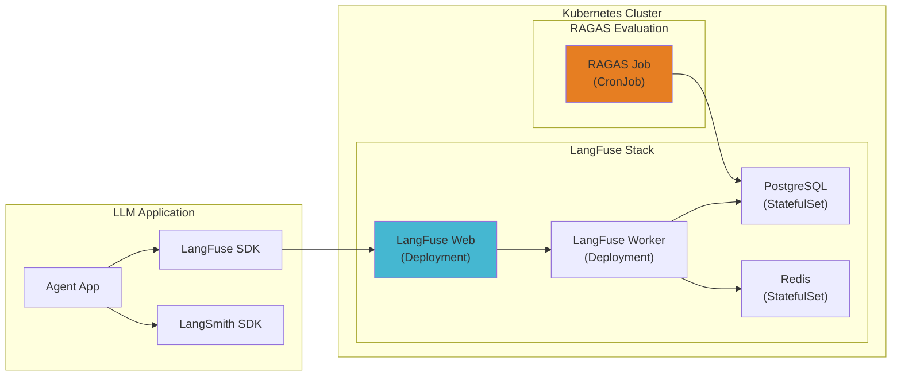

**LangFuse Kubernetes 배포 예시:**

```yaml
apiVersion: apps/v1
kind: Deployment
metadata:
  name: langfuse-web
  namespace: observability
spec:
  replicas: 2
  selector:
    matchLabels:
      app: langfuse-web
  template:
    spec:
      containers:
        - name: langfuse
          image: langfuse/langfuse:latest
          env:
            - name: DATABASE_URL
              valueFrom:
                secretKeyRef:
                  name: langfuse-secrets
                  key: database-url
            - name: NEXTAUTH_SECRET
              valueFrom:
                secretKeyRef:
                  name: langfuse-secrets
                  key: nextauth-secret
          resources:
            requests:
              memory: "512Mi"
              cpu: "250m"
---
apiVersion: batch/v1
kind: CronJob
metadata:
  name: ragas-evaluation
  namespace: observability
spec:
  schedule: "0 */6 * * *"  # 6시간마다 실행
  jobTemplate:
    spec:
      template:
        spec:
          containers:
            - name: ragas
              image: ragas/ragas:latest
              command: ["python", "-m", "ragas.evaluate"]
              env:
                - name: LANGFUSE_HOST
                  value: "http://langfuse-web:3000"
          restartPolicy: OnFailure
```

#### Inference Gateway 계층: LiteLLM

**LiteLLM**은 100개 이상의 LLM 프로바이더를 **통합 OpenAI 호환 API로 추상화**합니다.

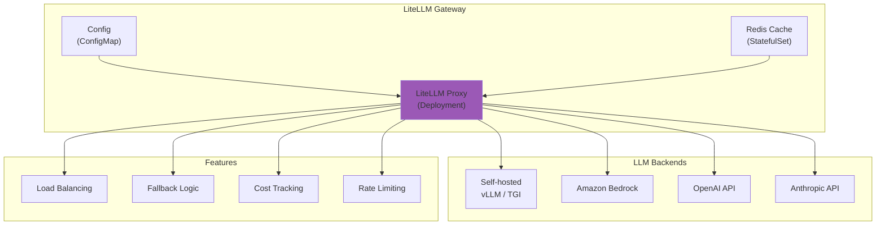

**LiteLLM Kubernetes 배포 예시:**

```yaml
apiVersion: apps/v1
kind: Deployment
metadata:
  name: litellm-proxy
  namespace: ai-gateway
spec:
  replicas: 3
  selector:
    matchLabels:
      app: litellm
  template:
    spec:
      containers:
        - name: litellm
          image: ghcr.io/berriai/litellm:main-latest
          ports:
            - containerPort: 4000
          env:
            - name: LITELLM_MASTER_KEY
              valueFrom:
                secretKeyRef:
                  name: litellm-secrets
                  key: master-key
            - name: REDIS_HOST
              value: "redis-cache"
          volumeMounts:
            - name: config
              mountPath: /app/config.yaml
              subPath: config.yaml
      volumes:
        - name: config
          configMap:
            name: litellm-config
---
apiVersion: v1
kind: ConfigMap
metadata:
  name: litellm-config
  namespace: ai-gateway
data:
  config.yaml: |
    model_list:
      - model_name: gpt-4
        litellm_params:
          model: openai/gpt-4
          api_key: os.environ/OPENAI_API_KEY
      - model_name: claude-3
        litellm_params:
          model: anthropic/claude-3-opus
          api_key: os.environ/ANTHROPIC_API_KEY
      - model_name: llama-70b
        litellm_params:
          model: openai/llama-70b
          api_base: http://vllm-llama:8000/v1

    router_settings:
      routing_strategy: least-busy
      enable_fallbacks: true

    general_settings:
      master_key: os.environ/LITELLM_MASTER_KEY
```

#### 분산 추론 계층: llm-d

**llm-d**는 Kubernetes 환경에서 LLM 추론 요청을 **지능적으로 분산**하는 스케줄러입니다.

| 기능 | 설명 | Kubernetes 통합 |
| --- | --- | --- |
| **Prefix Caching 인식** | 동일 프롬프트 프리픽스를 가진 요청을 같은 인스턴스로 라우팅 | Service Discovery 활용 |
| **로드 밸런싱** | GPU 사용률 기반 지능형 분배 | Prometheus 메트릭 연동 |
| **장애 복구** | 인스턴스 장애 시 자동 재라우팅 | Health Check + Endpoint Slice |
| **동적 스케일링** | 요청량에 따른 백엔드 확장 | KEDA 연동 |

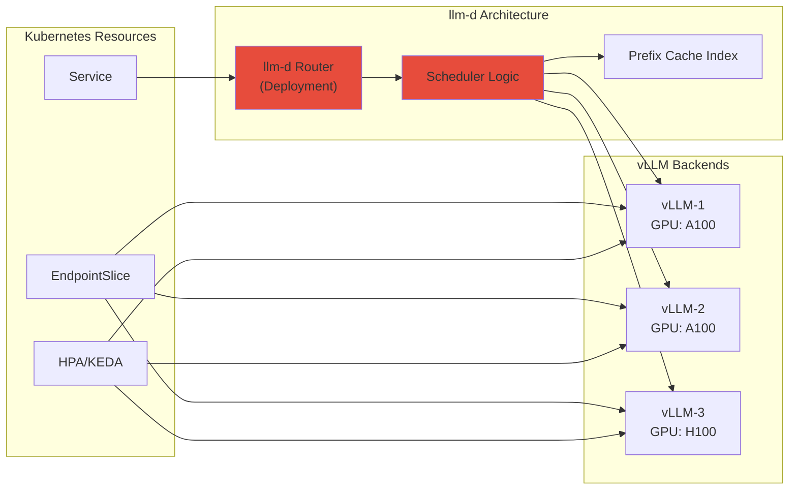

**llm-d Kubernetes 배포 예시:**

```yaml
apiVersion: apps/v1
kind: Deployment
metadata:
  name: llm-d-router
  namespace: ai-inference
spec:
  replicas: 2
  selector:
    matchLabels:
      app: llm-d
  template:
    spec:
      containers:
        - name: llm-d
          image: ghcr.io/llm-d/llm-d:latest
          ports:
            - containerPort: 8080
          env:
            - name: BACKENDS
              value: "vllm-0.vllm:8000,vllm-1.vllm:8000,vllm-2.vllm:8000"
            - name: ROUTING_STRATEGY
              value: "prefix-aware"
            - name: PROMETHEUS_ENDPOINT
              value: "http://prometheus:9090"
          resources:
            requests:
              memory: "256Mi"
              cpu: "500m"
---
apiVersion: v1
kind: Service
metadata:
  name: llm-d
  namespace: ai-inference
spec:
  selector:
    app: llm-d
  ports:
    - port: 8080
      targetPort: 8080
```

### 5. 벡터 데이터베이스 계층: Milvus

RAG 파이프라인의 핵심 컴포넌트인 Milvus는 Kubernetes에서 분산 아키텍처로 운영됩니다.

자세한 내용은 **[Milvus 벡터 데이터베이스](./milvus-vector-database.md)** 문서를 참조하세요.

**Milvus의 주요 특징:**
- **분산 아키텍처**: Query/Data/Index Nodes를 독립적으로 스케일링
- **Kubernetes Operator**: CRD 기반 선언적 관리
- **GPU 가속**: Index Node에서 GPU를 활용한 빠른 인덱스 빌드
- **S3 통합**: Amazon S3를 영구 스토리지로 사용 가능

### 6. 분산 학습: NeMo + Kubeflow

**NVIDIA NeMo**와 **Kubeflow**는 대규모 모델의 **분산 학습 파이프라인 자동화**를 제공합니다.

| 솔루션 | 역할 | 핵심 기능 |
| --- | --- | --- |
| **NeMo** | 학습 프레임워크 | LLM/멀티모달 학습, 모델 병렬화, 최적화 기법 |
| **Kubeflow** | ML 오케스트레이션 | 파이프라인 관리, 실험 추적, 하이퍼파라미터 튜닝 |

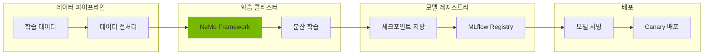

**Kubernetes 통합:**
- Kubeflow Training Operators (PyTorchJob, MPIJob 등)
- 분산 워크로드를 위한 Gang 스케줄링
- 토폴로지 인식 스케줄링 (노드 어피니티, 안티 어피니티)
- 공유 스토리지를 위한 CSI 드라이버 연동 (FSx for Lustre)

---

## GPU 인프라 및 리소스 관리

GPU 리소스 관리는 Agentic AI 플랫폼의 핵심입니다. 자세한 내용은 다음 문서를 참조하세요:

- **[GPU 리소스 관리](./gpu-resource-management.md)**: Device Plugin, DRA(Dynamic Resource Allocation), GPU 토폴로지 인식 스케줄링
- **[NeMo 프레임워크](./nemo-framework.md)**: 분산 학습과 NCCL 최적화

:::tip GPU 관리의 핵심 개념
- **Device Plugin**: Kubernetes의 기본 GPU 할당 메커니즘
- **DRA (Dynamic Resource Allocation)**: Kubernetes 1.26+의 유연한 리소스 관리
- **NCCL**: 분산 GPU 학습을 위한 고성능 통신 라이브러리
:::

### GPU 인프라 스택 개요

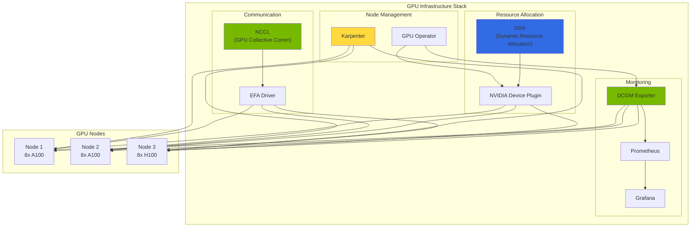

| 컴포넌트 | 역할 | 상세 문서 |
| --- | --- | --- |
| **DRA (Dynamic Resource Allocation)** | GPU 리소스 동적 할당 | [GPU 리소스 관리](./gpu-resource-management.md) |
| **DCGM (Data Center GPU Manager)** | GPU 메트릭 수집 | [GPU 리소스 관리](./gpu-resource-management.md) |
| **NCCL (NVIDIA Collective Communication Library)** | 멀티 GPU 통신 최적화 | [NeMo 프레임워크](./nemo-framework.md) |

---

## 결론: 왜 Agentic AI에 Kubernetes인가?

Kubernetes는 현대 Agentic AI 플랫폼을 가능하게 하는 **기본 인프라 계층**을 제공합니다:

### 핵심 장점

1. **통합 플랫폼**: 추론, 학습, 오케스트레이션을 위한 단일 플랫폼
2. **선언적 관리**: 버전 관리가 가능한 Infrastructure as Code
3. **풍부한 생태계**: AI 워크로드를 위한 광범위한 오픈소스 솔루션
4. **클라우드 이식성**: 어디서나 실행 가능 (온프레미스, AWS, GCP, Azure)
5. **성숙한 도구**: kubectl, Helm, operators, 모니터링 스택
6. **활발한 커뮤니티**: Kubernetes AI/ML SIG가 혁신을 주도

### 앞으로의 방향

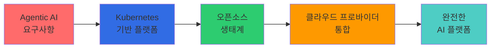

Agentic AI 플랫폼을 구축하는 조직을 위한 권장 사항:

1. **Kubernetes로 시작**: 팀 내 Kubernetes 전문성 확보
2. **오픈소스 활용**: 검증된 솔루션 도입 (vLLM, LangFuse 등)
3. **클라우드 통합**: 오픈소스와 관리형 서비스 결합
4. **인프라 자동화**: 자동 스케일링 및 프로비저닝 구현
5. **전면적 관측성**: 첫날부터 포괄적인 관측성 확보

:::info 다음 단계: EKS 기반 솔루션
이러한 도전과제를 해결하기 위한 **Amazon EKS와 AWS 서비스** 활용 방법은 [EKS 기반 Agentic AI 솔루션](./agentic-ai-solutions-eks.md)을 참조하세요.
:::

---

## 다음 단계

이 문서에서는 Agentic AI 워크로드의 4가지 핵심 도전과제와 Kubernetes 기반 오픈소스 생태계를 살펴보았습니다.

:::info 다음 단계: EKS 기반 해결방안
이 문서에서 소개한 도전과제들을 **Amazon EKS와 AWS 서비스**를 활용하여 해결하는 구체적인 방법은 [EKS 기반 Agentic AI 해결방안](./agentic-ai-solutions-eks.md)을 참조하세요.

다음 문서에서 다룰 내용:
- EKS Auto Mode로 완전 자동화된 클러스터 구축
- Karpenter를 통한 GPU 노드 자동 프로비저닝
- AWS 서비스와의 통합 (Bedrock, S3, CloudWatch)
- 프로덕션 환경을 위한 보안 및 운영 전략
- 실전 배포 가이드 및 트러블슈팅
:::

---

## 참고 자료

### Kubernetes 및 인프라
- [Kubernetes 공식 문서](https://kubernetes.io/docs/)
- [Karpenter 공식 문서](https://karpenter.sh/docs/)
- [Amazon EKS Best Practices Guide](https://aws.github.io/aws-eks-best-practices/)
- [NVIDIA GPU Operator Documentation](https://docs.nvidia.com/datacenter/cloud-native/gpu-operator/overview.html)
- [KEDA - Kubernetes Event-driven Autoscaling](https://keda.sh/)

### 모델 서빙 및 추론
- [vLLM Documentation](https://docs.vllm.ai/)
- [llm-d Project](https://github.com/llm-d/llm-d)
- [Kgateway Documentation](https://kgateway.io/docs/)
- [LiteLLM Documentation](https://docs.litellm.ai/)

### LLM Observability
- [LangFuse Documentation](https://langfuse.com/docs)
- [LangSmith Documentation](https://docs.smith.langchain.com/)
- [RAGAS Documentation](https://docs.ragas.io/)

### 벡터 데이터베이스
- [Milvus Documentation](https://milvus.io/docs)
- [Milvus Operator](https://github.com/milvus-io/milvus-operator)

### GPU 인프라
- [NVIDIA DRA Documentation](https://docs.nvidia.com/datacenter/cloud-native/kubernetes/latest/dra.html)
- [DCGM Exporter](https://github.com/NVIDIA/dcgm-exporter)
- [NCCL Documentation](https://docs.nvidia.com/deeplearning/nccl/user-guide/docs/index.html)
- [AWS EFA Documentation](https://docs.aws.amazon.com/AWSEC2/latest/UserGuide/efa.html)

### Agent 프레임워크 및 학습
- [KAgent - Kubernetes Agent Framework](https://github.com/kagent-dev/kagent)
- [NVIDIA NeMo Framework](https://docs.nvidia.com/nemo-framework/user-guide/latest/overview.html)
- [Kubeflow Documentation](https://www.kubeflow.org/docs/)
