import Tabs from '@theme/Tabs';
import TabItem from '@theme/TabItem';

> 📅 **작성일**: 2025-02-05 | ⏱️ **읽는 시간**: 약 20분

:::info 선행 문서: 기술적 도전과제
이 문서를 읽기 전에 [Agentic AI 워크로드의 기술적 도전과제](./agentic-ai-challenges.md)를 먼저 읽어보시기 바랍니다. 해당 문서에서 4가지 핵심 도전과제와 Kubernetes 기반 오픈소스 생태계에 대해 설명합니다.
:::

## 개요

Agentic AI 플랫폼의 4가지 핵심 도전과제(GPU 모니터링, 동적 스케일링, 비용 컨트롤, FM 파인튜닝)는 **Amazon EKS와 AWS 관리형 서비스의 통합**을 통해 효과적으로 해결할 수 있습니다.

이 문서에서는 **EKS Auto Mode + Karpenter 중심의 구체적인 해결 방안**과 AWS 인프라와의 통합 아키텍처를 다룹니다.

---

## Amazon EKS와 Karpenter: Kubernetes의 장점 극대화

Kubernetes가 AI 플랫폼의 기반이라면, **Amazon EKS와 Karpenter의 조합**은 Kubernetes의 장점을 극대화하여 **완전 자동화된 최적의 인프라**를 구현합니다.

### EKS + Karpenter + AWS 인프라 통합 아키텍처

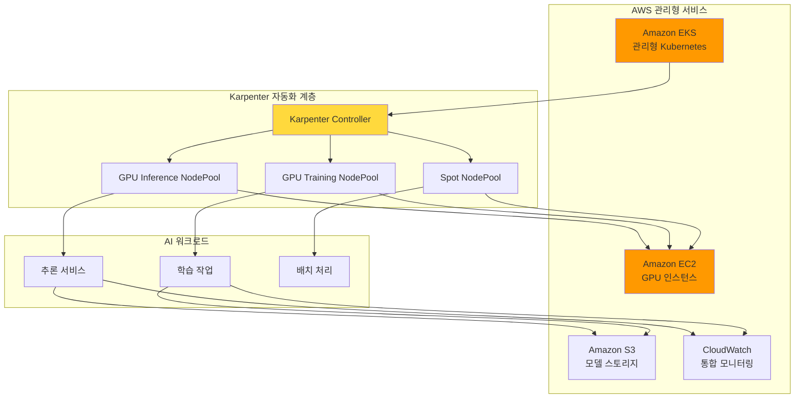

### 왜 EKS + Karpenter인가?

| 계층 | 역할 | 제공 가치 |
| --- | --- | --- |
| **Amazon EKS** | 관리형 Kubernetes Control Plane | 운영 부담 제거, 고가용성, 보안 |
| **Karpenter** | 지능형 노드 프로비저닝 | Just-in-Time GPU 프로비저닝, 비용 최적화 |
| **AWS 인프라** | GPU 인스턴스, 스토리지, 네트워크 | 다양한 GPU 옵션, EFA 고속 네트워크, Spot 인스턴스 |

### Karpenter: AI 인프라 자동화의 핵심

Karpenter는 기존 Cluster Autoscaler의 한계를 극복하고, **AI 워크로드에 최적화된 노드 프로비저닝**을 제공합니다.

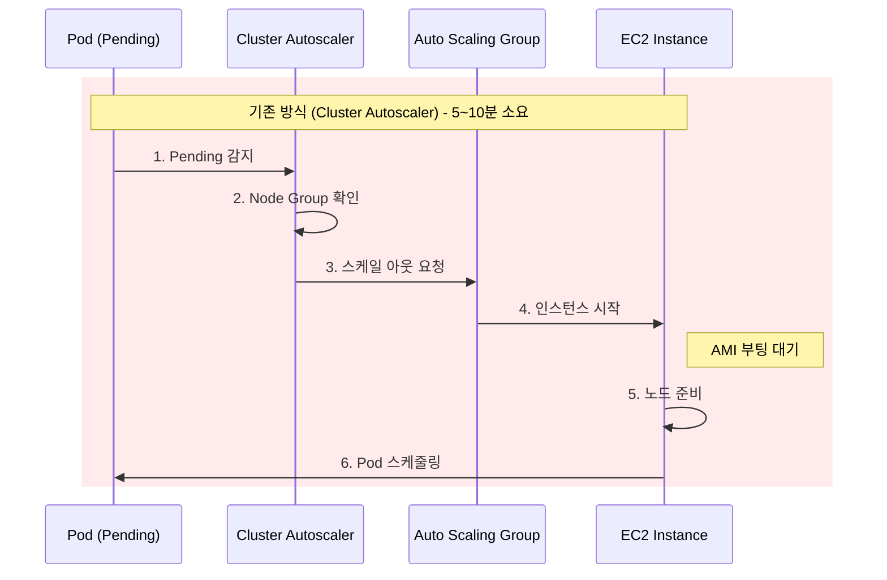

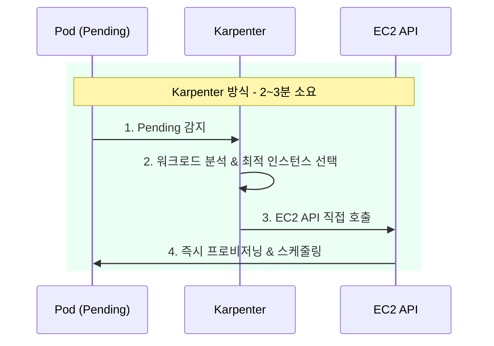

| 비교 항목 | Cluster Autoscaler | Karpenter |
|----------|-------------------|-----------|
| **프로비저닝 시간** | 5-10분 | 2-3분 |
| **인스턴스 선택** | Node Group 내 고정 타입 | 워크로드 기반 동적 선택 |
| **GPU 지원** | 수동 Node Group 구성 | NodePool 자동 매칭 |
| **비용 최적화** | 제한적 | Spot, Consolidation 자동 |

### Karpenter가 제공하는 핵심 가치

| 기능 | 설명 | Agentic AI 적용 |
| --- | --- | --- |
| **Just-in-Time 프로비저닝** | 워크로드 요구에 따라 즉시 노드 생성 | GPU 노드 대기 시간 최소화 |
| **Spot 인스턴스 지원** | 최대 90% 비용 절감 | 추론 워크로드 비용 최적화 |
| **Consolidation** | 유휴 노드 자동 정리 | GPU 리소스 효율성 극대화 |
| **다양한 인스턴스 타입** | 워크로드에 최적화된 인스턴스 자동 선택 | 모델 크기별 최적 GPU 매칭 |
| **Disruption Budgets** | 서비스 영향 최소화하며 노드 관리 | 안정적인 스케일 다운 |

### EKS Auto Mode: 완전 자동화의 완성

**EKS Auto Mode**는 Karpenter를 포함한 핵심 컴포넌트들을 자동으로 구성하고 관리하여, AI 인프라 자동화의 마지막 퍼즐을 완성합니다.

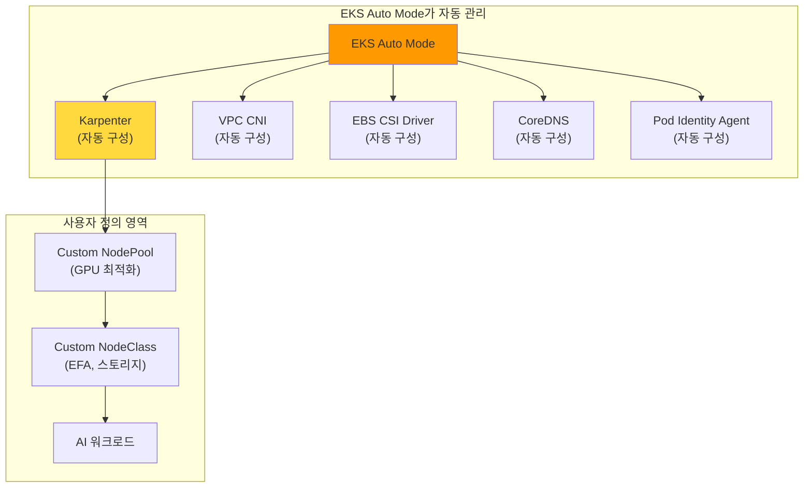

#### EKS Auto Mode vs 수동 구성 비교

| 구성 요소 | 수동 구성 (EKS Standard) | EKS Auto Mode |
| --- | --- | --- |
| **Karpenter 설치** | Helm 차트 수동 설치, IAM 역할 구성 | ✅ 자동 설치 및 구성 |
| **NodePool 관리** | 직접 정의 필요 | 기본 제공 + 커스텀 가능 |
| **VPC CNI** | 수동 설치 및 업그레이드 | ✅ 자동 관리 |
| **EBS CSI Driver** | 수동 설치, IRSA 구성 | ✅ 자동 관리 |
| **CoreDNS** | 수동 스케일링 | ✅ 자동 스케일링 |
| **보안 패치** | 수동 적용 | ✅ 자동 적용 |
| **버전 업그레이드** | 수동 계획 및 실행 | ✅ 자동 업그레이드 |

#### EKS Auto Mode의 AI 워크로드 이점

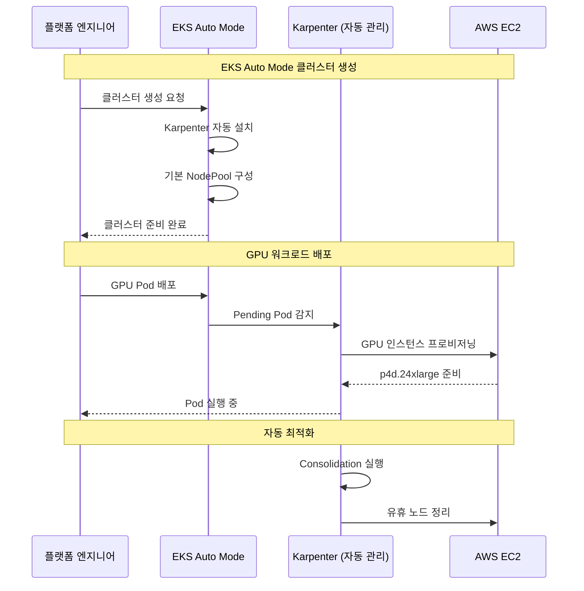

#### GPU 워크로드를 위한 EKS Auto Mode 설정

EKS Auto Mode에서 GPU 워크로드를 위한 커스텀 NodePool을 추가할 수 있습니다.

```yaml
# EKS Auto Mode에서 GPU NodePool 추가
apiVersion: karpenter.sh/v1
kind: NodePool
metadata:
  name: gpu-inference-pool
spec:
  template:
    metadata:
      labels:
        node-type: gpu-inference
        eks-auto-mode: "true"
    spec:
      requirements:
        - key: karpenter.sh/capacity-type
          operator: In
          values: ["spot", "on-demand"]
        - key: node.kubernetes.io/instance-type
          operator: In
          values:
            - g5.xlarge
            - g5.2xlarge
            - g5.4xlarge
            - g5.12xlarge
            - p4d.24xlarge
        - key: karpenter.k8s.aws/instance-gpu-count
          operator: Gt
          values: ["0"]
      nodeClassRef:
        group: karpenter.k8s.aws
        kind: EC2NodeClass
        name: default  # EKS Auto Mode 기본 NodeClass 활용
  limits:
    nvidia.com/gpu: 50
  disruption:
    consolidationPolicy: WhenEmptyOrUnderutilized
    consolidateAfter: 30s
```

:::tip EKS Auto Mode 권장 사항
EKS Auto Mode는 **새로운 AI 플랫폼 구축 시 권장되는 옵션**입니다.

- Karpenter 설치 및 구성 자동화로 **초기 구축 시간 80% 단축**
- 핵심 컴포넌트 자동 업그레이드로 **운영 부담 대폭 감소**
- GPU NodePool만 커스텀 정의하면 **즉시 AI 워크로드 배포 가능**
:::

:::info EKS Auto Mode와 GPU 지원
EKS Auto Mode는 NVIDIA GPU를 포함한 가속 컴퓨팅 인스턴스를 완벽히 지원합니다. 기본 NodeClass에 GPU 드라이버가 포함된 AMI가 자동으로 선택되며, 필요시 커스텀 NodeClass로 EFA 네트워크 등 고급 설정을 추가할 수 있습니다.
:::

### Karpenter vs Cluster Autoscaler 상세 비교

:::tip Karpenter vs Cluster Autoscaler
Karpenter는 Node Group 없이 워크로드 요구사항을 직접 분석하여 최적의 인스턴스를 선택합니다. GPU 워크로드의 경우 프로비저닝 시간이 **50% 이상 단축**되고, Consolidation을 통해 **비용이 20-30% 절감**됩니다.
:::

### 도전과제별 Karpenter 해결 방안 매핑

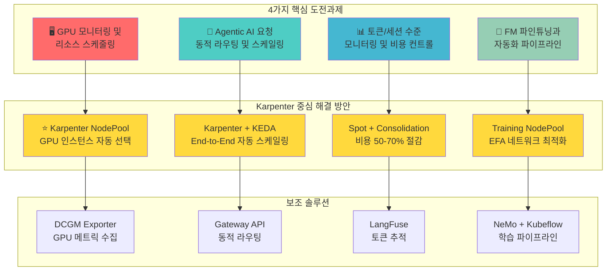

:::info 대상 독자
이 문서는 Agentic AI Platform 도입을 검토하는 **기술 의사결정자**와 **솔루션 아키텍트**를 대상으로 합니다. Kubernetes 기반 AI 인프라의 필요성과 EKS + Karpenter를 활용한 구체적인 구현 방안을 제공합니다.
:::

---

## 도전과제 1: GPU 모니터링 및 리소스 스케줄링

### Karpenter 기반 해결 방안

**Karpenter NodePool**을 활용하면 GPU 워크로드에 최적화된 노드를 자동으로 프로비저닝하고 관리할 수 있습니다.

<Tabs>
<TabItem value="nodepool" label="GPU NodePool 설정" default>

```yaml
apiVersion: karpenter.sh/v1
kind: NodePool
metadata:
  name: gpu-inference-pool
spec:
  template:
    metadata:
      labels:
        node-type: gpu-inference
        workload: genai
    spec:
      requirements:
        - key: kubernetes.io/arch
          operator: In
          values: ["amd64"]
        - key: karpenter.sh/capacity-type
          operator: In
          values: ["on-demand", "spot"]
        - key: node.kubernetes.io/instance-type
          operator: In
          values:
            - p4d.24xlarge    # 8x A100 40GB
            - p5.48xlarge     # 8x H100 80GB
            - g5.48xlarge     # 8x A10G 24GB
        - key: karpenter.k8s.aws/instance-gpu-count
          operator: Gt
          values: ["0"]
      nodeClassRef:
        group: karpenter.k8s.aws
        kind: EC2NodeClass
        name: gpu-nodeclass
      taints:
        - key: nvidia.com/gpu
          value: "true"
          effect: NoSchedule
  limits:
    nvidia.com/gpu: 100
  disruption:
    consolidationPolicy: WhenEmptyOrUnderutilized
    consolidateAfter: 30s
  weight: 100
```

</TabItem>
<TabItem value="nodeclass" label="EC2NodeClass 설정">

```yaml
apiVersion: karpenter.k8s.aws/v1
kind: EC2NodeClass
metadata:
  name: gpu-nodeclass
spec:
  role: KarpenterNodeRole-${CLUSTER_NAME}
  amiSelectorTerms:
    - alias: al2023@latest
  subnetSelectorTerms:
    - tags:
        karpenter.sh/discovery: ${CLUSTER_NAME}
  securityGroupSelectorTerms:
    - tags:
        karpenter.sh/discovery: ${CLUSTER_NAME}
  blockDeviceMappings:
    - deviceName: /dev/xvda
      ebs:
        volumeSize: 500Gi
        volumeType: gp3
        iops: 10000
        throughput: 500
        encrypted: true
  instanceStorePolicy: RAID0
  userData: |
    #!/bin/bash
    nvidia-smi -pm 1
    modprobe efa
```

</TabItem>
</Tabs>

### Karpenter의 GPU 워크로드 최적화 기능

| 기능 | 설명 | 효과 |
| --- | --- | --- |
| 인스턴스 타입 자동 선택 | 워크로드 요구사항에 맞는 GPU 인스턴스 자동 선택 | 리소스 낭비 방지 |
| Spot 인스턴스 폴백 | Spot 불가 시 On-Demand로 자동 전환 | 가용성 보장 |
| Consolidation | 유휴 GPU 노드 자동 정리 | 비용 30% 절감 |
| 빠른 프로비저닝 | Node Group 없이 직접 EC2 API 호출 | 프로비저닝 시간 50% 단축 |

### 보조 솔루션: NVIDIA GPU Operator

Karpenter와 함께 NVIDIA GPU Operator를 사용하여 GPU 드라이버 및 모니터링 스택을 자동화합니다.

```yaml
apiVersion: nvidia.com/v1
kind: ClusterPolicy
metadata:
  name: cluster-policy
spec:
  operator:
    defaultRuntime: containerd
  driver:
    enabled: true
    version: "535.104.05"
  toolkit:
    enabled: true
  devicePlugin:
    enabled: true
  dcgmExporter:
    enabled: true
  migManager:
    enabled: true
```

---

## 도전과제 2: Agentic AI 요청 동적 라우팅 및 스케일링

### Karpenter + KEDA 연동 해결 방안

Karpenter와 KEDA를 연동하면 **워크로드 스케일링과 노드 프로비저닝이 자동으로 연계**됩니다.

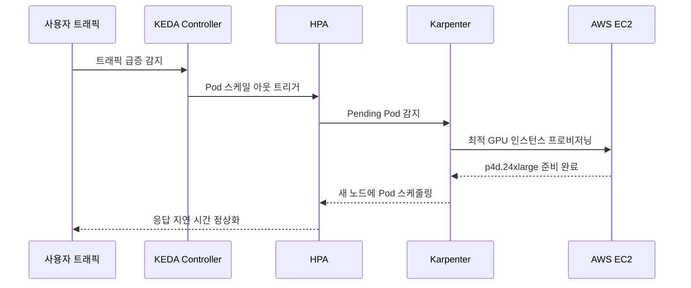

<Tabs>
<TabItem value="keda" label="KEDA ScaledObject" default>

```yaml
apiVersion: keda.sh/v1alpha1
kind: ScaledObject
metadata:
  name: vllm-gpu-scaler
  namespace: ai-inference
spec:
  scaleTargetRef:
    name: vllm-deployment
  minReplicaCount: 2
  maxReplicaCount: 20
  triggers:
    - type: prometheus
      metadata:
        serverAddress: http://prometheus.observability:9090
        metricName: vllm_pending_requests
        threshold: "50"
        query: |
          sum(vllm_pending_requests{namespace="ai-inference"})
    - type: prometheus
      metadata:
        serverAddress: http://prometheus.observability:9090
        metricName: gpu_utilization
        threshold: "70"
        query: |
          avg(DCGM_FI_DEV_GPU_UTIL{namespace="ai-inference"})
  advanced:
    horizontalPodAutoscalerConfig:
      behavior:
        scaleUp:
          stabilizationWindowSeconds: 0
          policies:
            - type: Percent
              value: 100
              periodSeconds: 15
        scaleDown:
          stabilizationWindowSeconds: 300
```

</TabItem>
<TabItem value="httproute" label="Gateway API HTTPRoute">

```yaml
apiVersion: gateway.networking.k8s.io/v1
kind: HTTPRoute
metadata:
  name: ai-model-routing
  namespace: ai-inference
spec:
  parentRefs:
    - name: ai-gateway
      namespace: ai-gateway
  rules:
    - matches:
        - path:
            type: PathPrefix
            value: /v1/chat/completions
          headers:
            - name: x-model-id
              value: "gpt-4"
      backendRefs:
        - name: vllm-gpt4
          port: 8000
          weight: 80
        - name: vllm-gpt4-canary
          port: 8000
          weight: 20
    - matches:
        - path:
            type: PathPrefix
            value: /v1/chat/completions
          headers:
            - name: x-model-id
              value: "claude-3"
      backendRefs:
        - name: vllm-claude
          port: 8000
```

</TabItem>
</Tabs>

### Karpenter Disruption 정책으로 안정성 확보

트래픽 급증 시에도 서비스 안정성을 보장하기 위한 Karpenter 설정입니다.

```yaml
apiVersion: karpenter.sh/v1
kind: NodePool
metadata:
  name: gpu-inference-stable
spec:
  disruption:
    consolidationPolicy: WhenEmptyOrUnderutilized
    consolidateAfter: 30s
    budgets:
      # 동시에 중단 가능한 노드 수 제한
      - nodes: "20%"
      # 업무 시간에는 중단 방지
      - nodes: "0"
        schedule: "0 9 * * 1-5"
        duration: 10h
```

:::warning 스케일링 주의사항
GPU 노드 프로비저닝은 일반 CPU 노드보다 시간이 오래 걸립니다. Karpenter의 `consolidationPolicy`를 적절히 설정하여 불필요한 스케일 다운을 방지하세요.
:::

---

## 도전과제 3: 토큰/세션 수준 모니터링 및 비용 컨트롤

### Karpenter 기반 비용 최적화 전략

Karpenter는 GPU 인프라 비용 최적화의 **핵심 레버**입니다. 다음 4가지 전략을 조합하여 최대 효과를 얻을 수 있습니다.

#### 전략 1: Spot 인스턴스 우선 활용

Karpenter의 Spot 인스턴스 지원을 활용하면 GPU 비용을 **최대 90%까지 절감**할 수 있습니다.

```yaml
apiVersion: karpenter.sh/v1
kind: NodePool
metadata:
  name: gpu-spot-inference
spec:
  template:
    metadata:
      labels:
        cost-tier: spot
        workload: inference
    spec:
      requirements:
        - key: karpenter.sh/capacity-type
          operator: In
          values: ["spot"]
        - key: node.kubernetes.io/instance-type
          operator: In
          values:
            - g5.12xlarge
            - g5.24xlarge
            - g5.48xlarge
            - p4d.24xlarge
      nodeClassRef:
        group: karpenter.k8s.aws
        kind: EC2NodeClass
        name: gpu-spot-nodeclass
      taints:
        - key: nvidia.com/gpu
          value: "true"
          effect: NoSchedule
        - key: karpenter.sh/capacity-type
          value: "spot"
          effect: NoSchedule
  limits:
    nvidia.com/gpu: 32
  disruption:
    consolidationPolicy: WhenEmpty
    consolidateAfter: 30s
  weight: 50  # On-Demand보다 우선 선택
```

#### 전략 2: 시간대별 스케줄 기반 비용 관리

업무 시간과 비업무 시간에 따른 차별화된 리소스 정책을 적용합니다.

```yaml
apiVersion: karpenter.sh/v1
kind: NodePool
metadata:
  name: gpu-scheduled-pool
spec:
  template:
    spec:
      requirements:
        - key: karpenter.sh/capacity-type
          operator: In
          values: ["on-demand", "spot"]
        - key: node.kubernetes.io/instance-type
          operator: In
          values:
            - g5.12xlarge
            - g5.24xlarge
      nodeClassRef:
        group: karpenter.k8s.aws
        kind: EC2NodeClass
        name: gpu-nodeclass
  limits:
    nvidia.com/gpu: 16
  disruption:
    consolidationPolicy: WhenEmptyOrUnderutilized
    consolidateAfter: 30s
    budgets:
      # 업무 시간: 안정성 우선 (노드 중단 최소화)
      - nodes: "10%"
        schedule: "0 9 * * 1-5"
        duration: 9h
      # 비업무 시간: 비용 우선 (적극적 통합)
      - nodes: "50%"
        schedule: "0 18 * * 1-5"
        duration: 15h
      # 주말: 최소 리소스 유지
      - nodes: "80%"
        schedule: "0 0 * * 0,6"
        duration: 24h
```

#### 전략 3: Consolidation을 통한 유휴 리소스 제거

```yaml
apiVersion: karpenter.sh/v1
kind: NodePool
metadata:
  name: gpu-consolidation-pool
spec:
  disruption:
    # 노드가 비어있거나 활용도가 낮을 때 통합
    consolidationPolicy: WhenEmptyOrUnderutilized
    # 빠른 통합으로 비용 절감 (30초 대기 후 통합)
    consolidateAfter: 30s
```

#### 전략 4: 워크로드별 인스턴스 최적화

```yaml
# 소규모 모델용 (7B 이하) - 비용 효율적
apiVersion: karpenter.sh/v1
kind: NodePool
metadata:
  name: gpu-small-models
spec:
  template:
    spec:
      requirements:
        - key: node.kubernetes.io/instance-type
          operator: In
          values:
            - g5.xlarge      # 1x A10G - $1.01/hr
            - g5.2xlarge     # 1x A10G - $1.21/hr
  weight: 100  # 최우선 선택

---
# 대규모 모델용 (70B+) - 성능 우선
apiVersion: karpenter.sh/v1
kind: NodePool
metadata:
  name: gpu-large-models
spec:
  template:
    spec:
      requirements:
        - key: node.kubernetes.io/instance-type
          operator: In
          values:
            - p4d.24xlarge   # 8x A100 - $32.77/hr
            - p5.48xlarge    # 8x H100 - $98.32/hr
  weight: 10   # 필요시에만 선택
```

### 비용 최적화 전략 비교

| 전략 | 구현 방법 | 예상 절감률 | 적용 워크로드 | 위험도 |
| --- | --- | --- | --- | --- |
| Spot 인스턴스 | Karpenter NodePool | 60-90% | 추론, 배치 처리 | 중간 (중단 가능) |
| Consolidation | Karpenter disruption | 20-30% | 모든 워크로드 | 낮음 |
| Right-sizing | Karpenter 인스턴스 자동 선택 | 15-25% | 모든 워크로드 | 낮음 |
| 스케줄 기반 | Karpenter budgets | 30-40% | 비업무 시간 | 낮음 |
| 복합 적용 | 위 전략 조합 | 50-70% | 전체 | 중간 |

### 보조 솔루션: LangFuse 기반 토큰 추적

인프라 비용과 함께 토큰 레벨 비용도 추적해야 완전한 비용 가시성을 확보할 수 있습니다.

```yaml
apiVersion: apps/v1
kind: Deployment
metadata:
  name: langfuse
  namespace: observability
spec:
  replicas: 2
  selector:
    matchLabels:
      app: langfuse
  template:
    metadata:
      labels:
        app: langfuse
    spec:
      containers:
        - name: langfuse
          image: langfuse/langfuse:latest
          ports:
            - containerPort: 3000
          env:
            - name: DATABASE_URL
              valueFrom:
                secretKeyRef:
                  name: langfuse-secrets
                  key: database-url
            - name: NEXTAUTH_SECRET
              valueFrom:
                secretKeyRef:
                  name: langfuse-secrets
                  key: nextauth-secret
          resources:
            requests:
              memory: "512Mi"
              cpu: "250m"
            limits:
              memory: "1Gi"
              cpu: "500m"
```

### 비용 모니터링 대시보드 구성

```yaml
# Prometheus 비용 관련 메트릭 수집 규칙
apiVersion: monitoring.coreos.com/v1
kind: PrometheusRule
metadata:
  name: gpu-cost-rules
  namespace: monitoring
spec:
  groups:
    - name: gpu-cost
      rules:
        - record: gpu:hourly_cost:sum
          expr: |
            sum(
              karpenter_nodes_total_pod_requests{resource_type="nvidia.com/gpu"}
              * on(instance_type) group_left()
              aws_ec2_instance_hourly_cost
            )
        - alert: HighGPUCostAlert
          expr: gpu:hourly_cost:sum > 100
          for: 1h
          labels:
            severity: warning
          annotations:
            summary: "시간당 GPU 비용이 $100를 초과했습니다"
```

:::tip 비용 최적화 체크리스트

1. **Spot 인스턴스 비율**: 추론 워크로드의 70% 이상을 Spot으로 운영
2. **Consolidation 활성화**: 30초 이내 유휴 노드 정리
3. **스케줄 기반 정책**: 비업무 시간 리소스 50% 이상 축소
4. **Right-sizing**: 모델 크기에 맞는 인스턴스 타입 자동 선택
:::

:::warning 비용 최적화 주의사항

- Spot 인스턴스 중단 시 서비스 영향 최소화를 위한 graceful shutdown 구현 필수
- 과도한 Consolidation은 스케일 아웃 지연을 유발할 수 있음
- 비용 절감과 SLA 준수 사이의 균형점 설정 필요
:::

---

## 도전과제 4: FM 파인튜닝과 자동화 파이프라인

### Karpenter 기반 학습 인프라 구성

#### 전략 1: 학습 전용 NodePool 분리

학습 워크로드는 추론과 다른 특성을 가지므로 별도의 NodePool로 관리합니다.

```yaml
apiVersion: karpenter.sh/v1
kind: NodePool
metadata:
  name: gpu-training-pool
spec:
  template:
    metadata:
      labels:
        node-type: gpu-training
        workload: ml-training
    spec:
      requirements:
        - key: kubernetes.io/arch
          operator: In
          values: ["amd64"]
        - key: karpenter.sh/capacity-type
          operator: In
          values: ["on-demand"]  # 학습은 On-Demand 권장 (안정성)
        - key: node.kubernetes.io/instance-type
          operator: In
          values:
            - p5.48xlarge     # 8x H100 80GB - 대규모 학습
            - p4d.24xlarge    # 8x A100 40GB - 중규모 학습
            - p4de.24xlarge   # 8x A100 80GB - 메모리 집약적 학습
        - key: karpenter.k8s.aws/instance-gpu-count
          operator: Gt
          values: ["0"]
      nodeClassRef:
        group: karpenter.k8s.aws
        kind: EC2NodeClass
        name: gpu-training-nodeclass
      taints:
        - key: nvidia.com/gpu
          value: "true"
          effect: NoSchedule
        - key: workload-type
          value: "training"
          effect: NoSchedule
  limits:
    nvidia.com/gpu: 64
  disruption:
    # 학습 중에는 노드 중단 방지
    consolidationPolicy: WhenEmpty
    consolidateAfter: 1h  # 학습 완료 후 1시간 대기
    budgets:
      # 학습 중에는 노드 중단 완전 방지
      - nodes: "0"
```

#### 전략 2: EFA 네트워크 최적화 NodeClass

분산 학습의 성능은 GPU 간 통신 속도에 크게 의존합니다. EFA(Elastic Fabric Adapter)를 활용하여 최대 성능을 확보합니다.

```yaml
apiVersion: karpenter.k8s.aws/v1
kind: EC2NodeClass
metadata:
  name: gpu-training-nodeclass
spec:
  role: KarpenterNodeRole-${CLUSTER_NAME}
  amiSelectorTerms:
    - alias: al2023@latest
  subnetSelectorTerms:
    - tags:
        karpenter.sh/discovery: ${CLUSTER_NAME}
        network-type: efa-enabled  # EFA 지원 서브넷
  securityGroupSelectorTerms:
    - tags:
        karpenter.sh/discovery: ${CLUSTER_NAME}
  blockDeviceMappings:
    - deviceName: /dev/xvda
      ebs:
        volumeSize: 1000Gi  # 대용량 체크포인트 저장
        volumeType: gp3
        iops: 16000
        throughput: 1000
        encrypted: true
        deleteOnTermination: true
  instanceStorePolicy: RAID0  # NVMe 인스턴스 스토어 활용
  userData: |
    #!/bin/bash
    set -e

    # NVIDIA 드라이버 설정
    nvidia-smi -pm 1
    nvidia-smi -ac 1593,1410  # H100 최적 클럭 설정

    # EFA 드라이버 로드
    modprobe efa

    # NCCL 환경 변수 설정
    echo 'export NCCL_DEBUG=INFO' >> /etc/profile.d/nccl.sh
    echo 'export NCCL_SOCKET_IFNAME=eth0' >> /etc/profile.d/nccl.sh
    echo 'export FI_EFA_USE_DEVICE_RDMA=1' >> /etc/profile.d/nccl.sh
    echo 'export FI_PROVIDER=efa' >> /etc/profile.d/nccl.sh

    # 대용량 페이지 설정 (학습 성능 향상)
    echo 'vm.nr_hugepages=5120' >> /etc/sysctl.conf
    sysctl -p
  tags:
    Environment: production
    Workload: ml-training
    CostCenter: ml-platform
```

#### 전략 3: 실험용 Spot 기반 NodePool

하이퍼파라미터 튜닝이나 실험적 학습에는 Spot 인스턴스를 활용하여 비용을 절감합니다.

```yaml
apiVersion: karpenter.sh/v1
kind: NodePool
metadata:
  name: gpu-experiment-pool
spec:
  template:
    metadata:
      labels:
        node-type: gpu-experiment
        workload: ml-experiment
    spec:
      requirements:
        - key: karpenter.sh/capacity-type
          operator: In
          values: ["spot"]
        - key: node.kubernetes.io/instance-type
          operator: In
          values:
            - p4d.24xlarge
            - g5.48xlarge
      nodeClassRef:
        group: karpenter.k8s.aws
        kind: EC2NodeClass
        name: gpu-experiment-nodeclass
      taints:
        - key: nvidia.com/gpu
          value: "true"
          effect: NoSchedule
        - key: workload-type
          value: "experiment"
          effect: NoSchedule
  limits:
    nvidia.com/gpu: 32
  disruption:
    consolidationPolicy: WhenEmpty
    consolidateAfter: 10m  # 실험 완료 후 빠른 정리
  weight: 30  # 프로덕션 학습보다 낮은 우선순위
```

### NeMo 분산 학습 Job 예제

Karpenter가 프로비저닝한 노드에서 실행되는 NeMo 분산 학습 Job입니다.

```yaml
apiVersion: batch/v1
kind: Job
metadata:
  name: nemo-finetune-llama-70b
  namespace: ai-training
spec:
  parallelism: 4  # 4개 노드 병렬 실행
  completions: 4
  completionMode: Indexed
  template:
    metadata:
      labels:
        app: nemo-training
        model: llama-70b
    spec:
      restartPolicy: OnFailure
      containers:
        - name: nemo
          image: nvcr.io/nvidia/nemo:24.01
          command:
            - /bin/bash
            - -c
            - |
              # 분산 학습 환경 설정
              export MASTER_ADDR=$(hostname -i)
              export MASTER_PORT=29500
              export WORLD_SIZE=32  # 4 nodes x 8 GPUs
              export RANK=$JOB_COMPLETION_INDEX

              python -m torch.distributed.launch \
                --nproc_per_node=8 \
                --nnodes=4 \
                --node_rank=$RANK \
                --master_addr=$MASTER_ADDR \
                --master_port=$MASTER_PORT \
                /opt/NeMo/examples/nlp/language_modeling/megatron_gpt_finetuning.py \
                --config-path=/config \
                --config-name=llama_70b_finetune
          args:
            - model.data.train_ds.file_path=/data/train.jsonl
            - model.data.validation_ds.file_path=/data/val.jsonl
            - trainer.devices=8
            - trainer.num_nodes=4
            - trainer.max_epochs=3
            - trainer.precision=bf16-mixed
            - model.tensor_model_parallel_size=4
            - model.pipeline_model_parallel_size=2
            - exp_manager.checkpoint_callback_params.save_top_k=3
          resources:
            requests:
              nvidia.com/gpu: 8
              memory: "900Gi"
              cpu: "90"
            limits:
              nvidia.com/gpu: 8
              memory: "1100Gi"
              cpu: "96"
          volumeMounts:
            - name: training-data
              mountPath: /data
            - name: checkpoints
              mountPath: /checkpoints
            - name: config
              mountPath: /config
            - name: shm
              mountPath: /dev/shm
      nodeSelector:
        node-type: gpu-training
      tolerations:
        - key: nvidia.com/gpu
          operator: Exists
          effect: NoSchedule
        - key: workload-type
          operator: Equal
          value: "training"
          effect: NoSchedule
      volumes:
        - name: training-data
          persistentVolumeClaim:
            claimName: training-data-pvc
        - name: checkpoints
          persistentVolumeClaim:
            claimName: checkpoints-pvc
        - name: config
          configMap:
            name: nemo-training-config
        - name: shm
          emptyDir:
            medium: Memory
            sizeLimit: 256Gi  # 대용량 공유 메모리
```

### 학습 인프라 비용 최적화 전략

| 전략 | 적용 대상 | 예상 절감률 | 구현 방법 |
| --- | --- | --- | --- |
| Spot 실험 클러스터 | 하이퍼파라미터 튜닝 | 60-80% | 별도 NodePool |
| 자동 노드 정리 | 학습 완료 후 | 20-30% | Consolidation |
| 체크포인트 기반 재시작 | Spot 중단 대응 | 10-20% | NeMo 체크포인트 |
| 시간대별 스케줄링 | 비업무 시간 학습 | 15-25% | CronJob + Karpenter |

:::tip 학습 인프라 모범 사례

1. **프로덕션 학습**: On-Demand 인스턴스로 안정성 확보
2. **실험/튜닝**: Spot 인스턴스로 비용 절감
3. **체크포인트**: FSx for Lustre에 주기적 저장
4. **모니터링**: TensorBoard + Prometheus로 학습 진행 추적
:::

:::warning 분산 학습 주의사항

- EFA 네트워크가 지원되는 서브넷에서만 최적 성능 발휘
- NCCL 환경 변수 설정이 성능에 큰 영향
- 체크포인트 저장 주기와 스토리지 비용 간 균형 필요
:::

---

## EKS 기반 Agentic AI 플랫폼 간편 구축

앞서 소개한 솔루션들은 **Amazon EKS 환경에서 손쉽게 배포**할 수 있습니다. EKS Auto Mode와 AWS 관리형 서비스의 통합을 통해 **복잡한 인프라 구성 없이** 완전한 Agentic AI 플랫폼을 구축할 수 있습니다.

### EKS의 간편 배포 이점

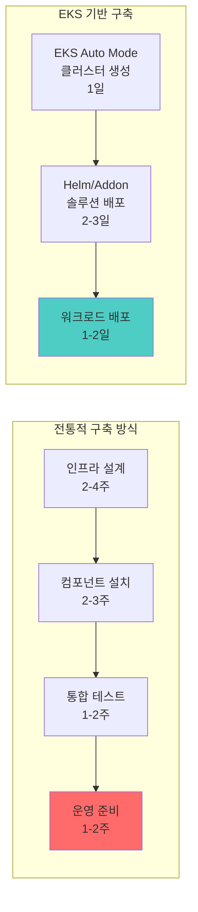

| 구축 방식 | 소요 시간 | 운영 복잡도 | 비용 효율성 |
| --- | --- | --- | --- |
| **전통적 방식** | 6-11주 | 높음 | 낮음 |
| **EKS 기반** | 1-2주 | 낮음 | 높음 |

### 솔루션별 EKS 배포 방법

| 솔루션 | 배포 방법 | EKS 통합 이점 |
| --- | --- | --- |
| **Karpenter** | EKS Auto Mode (자동) | 설치/구성 불필요, 자동 업그레이드 |
| **Kgateway** | Helm Chart | ALB Controller 연동, ACM 인증서 자동 관리 |
| **LiteLLM** | Helm Chart | Secrets Manager 연동, IAM 기반 인증 |
| **vLLM** | Helm Chart | GPU NodePool 자동 프로비저닝 |
| **llm-d** | Helm Chart | Karpenter 연동 자동 스케일링 |
| **LangFuse** | Helm Chart | RDS/Aurora 연동, S3 스토리지 |
| **KAgent** | Helm Chart | Pod Identity 기반 AWS 서비스 접근 |
| **KEDA** | EKS Addon | 관리형 설치, CloudWatch 메트릭 연동 |

### EKS 통합 아키텍처

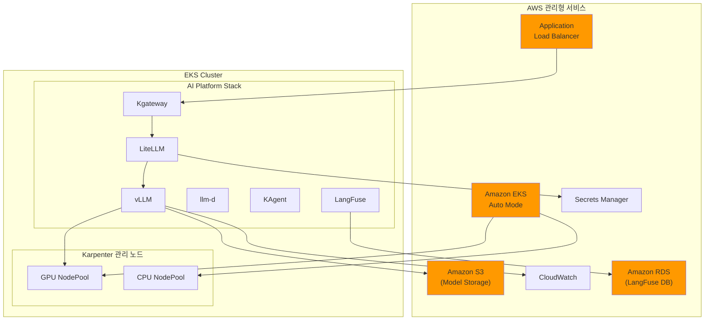

### 간편 배포 예시

EKS Auto Mode 클러스터에서 전체 Agentic AI 스택을 배포하는 예시입니다.

```bash
# 1. EKS Auto Mode 클러스터 생성 (Karpenter 자동 포함)
eksctl create cluster --name ai-platform --region us-west-2 --auto-mode

# 2. GPU NodePool 추가
kubectl apply -f gpu-nodepool.yaml

# 3. AI Platform 솔루션 스택 배포
helm repo add kgateway https://kgateway.io/charts
helm repo add litellm https://litellm.github.io/helm
helm repo add vllm https://vllm-project.github.io/helm
helm repo add langfuse https://langfuse.github.io/helm

helm install kgateway kgateway/kgateway -n ai-gateway --create-namespace
helm install litellm litellm/litellm -n ai-inference --create-namespace
helm install vllm vllm/vllm -n ai-inference
helm install langfuse langfuse/langfuse -n observability --create-namespace

# 4. KEDA 설치 (EKS Addon)
aws eks create-addon --cluster-name ai-platform --addon-name keda
```

### EKS 기반 구축의 핵심 이점

:::tip EKS로 Agentic AI 플랫폼을 구축하면

1. **인프라 자동화**: EKS Auto Mode + Karpenter로 GPU 노드 자동 관리
2. **간편한 배포**: Helm Chart와 EKS Addon으로 솔루션 스택 원클릭 배포
3. **AWS 서비스 통합**: RDS, S3, Secrets Manager, CloudWatch와 네이티브 연동
4. **보안 강화**: Pod Identity, Security Groups for Pods, 암호화 자동 적용
5. **비용 최적화**: Spot 인스턴스, Savings Plans, Consolidation 자동 활용
:::

:::tip EKS Auto Mode 시작하기
EKS Auto Mode는 AWS 콘솔, eksctl, 또는 Terraform에서 간단히 활성화할 수 있습니다.

```bash
# eksctl로 EKS Auto Mode 클러스터 생성
eksctl create cluster --name ai-platform --region us-west-2 --auto-mode
```

클러스터 생성 후 GPU NodePool만 추가하면 즉시 AI 워크로드를 배포할 수 있습니다.
:::

---

## EKS Capability: Agentic AI를 위한 통합 플랫폼 기능

### EKS Capability란?

**EKS Capability**는 Amazon EKS에서 특정 워크로드를 효과적으로 운영하기 위해 **검증된 오픈소스 도구와 AWS 서비스를 통합하여 제공하는 플랫폼 수준의 기능**입니다. EKS는 단순한 Kubernetes 관리형 서비스를 넘어, 특정 도메인(AI/ML, 데이터 분석, 웹 애플리케이션 등)에 최적화된 **엔드-투-엔드 솔루션 스택**을 제공합니다.

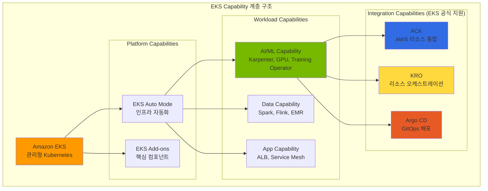

### Agentic AI를 위한 핵심 EKS Capability

Agentic AI 워크로드를 효과적으로 운영하기 위해 EKS는 다음 **Integration Capability**를 공식 지원합니다:

| EKS Capability | 역할 | Agentic AI 활용 | 지원 방식 |
|----------------|------|-----------------|----------|
| **ACK (AWS Controllers for Kubernetes)** | AWS 서비스의 Kubernetes 네이티브 관리 | S3 모델 저장소, RDS 메타데이터, SageMaker 학습 작업 | EKS Add-on |
| **KRO (Kubernetes Resource Orchestrator)** | 복합 리소스 추상화 및 템플릿화 | AI 추론 스택, 학습 파이프라인 원클릭 배포 | EKS Add-on |
| **Argo CD** | GitOps 기반 지속적 배포 | 모델 서빙 배포 자동화, 롤백, 환경 동기화 | EKS Add-on |

:::warning Argo Workflows는 별도 설치 필요
**Argo Workflows**는 EKS Capability로 공식 지원되지 않으므로 **직접 설치가 필요**합니다.
Argo CD(EKS Capability)와 함께 사용하면 강력한 ML 파이프라인 자동화를 구현할 수 있습니다.

```bash
# Argo Workflows 설치
kubectl create namespace argo
kubectl apply -n argo -f https://github.com/argoproj/argo-workflows/releases/download/v3.5.0/install.yaml
```

:::

:::info EKS Capability의 핵심 가치
ACK, KRO, Argo CD (EKS Capability)를 조합하면:

- **선언적 관리**: 모든 인프라와 워크로드를 YAML로 정의
- **GitOps 기반**: Git을 Single Source of Truth로 활용
- **완전 자동화**: 코드 커밋부터 프로덕션 배포까지 무중단 파이프라인
- **통합 모니터링**: AWS CloudWatch와 Kubernetes 메트릭 통합
:::

---

### ACK (AWS Controllers for Kubernetes)

**ACK**는 EKS Capability의 핵심 구성요소로, Kubernetes Custom Resource를 통해 AWS 서비스를 직접 프로비저닝하고 관리할 수 있게 해주는 오픈소스 프로젝트입니다. **EKS Add-on으로 간편하게 설치**할 수 있습니다.

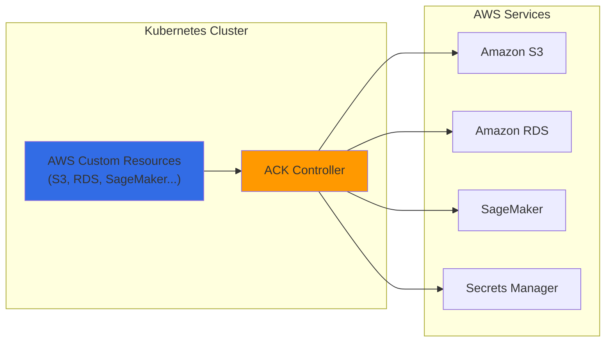

**AI 플랫폼에서 ACK 활용 사례:**

| AWS 서비스 | ACK Controller | Agentic AI 활용 |
|-----------|---------------|-----------------|
| **S3** | `s3.services.k8s.aws` | 모델 아티팩트 저장소, 학습 데이터 버킷 |
| **RDS/Aurora** | `rds.services.k8s.aws` | LangFuse 백엔드, 메타데이터 저장소 |
| **SageMaker** | `sagemaker.services.k8s.aws` | 모델 학습 작업, 엔드포인트 배포 |
| **Secrets Manager** | `secretsmanager.services.k8s.aws` | API 키, 모델 자격증명 관리 |
| **ECR** | `ecr.services.k8s.aws` | 컨테이너 이미지 레지스트리 |

**ACK를 이용한 S3 버킷 생성 예시:**

```yaml
# s3-model-bucket.yaml
apiVersion: s3.services.k8s.aws/v1alpha1
kind: Bucket
metadata:
  name: agentic-ai-models
  namespace: ai-platform
spec:
  name: agentic-ai-models-prod
  versioning:
    status: Enabled
  encryption:
    rules:
    - applyServerSideEncryptionByDefault:
        sseAlgorithm: aws:kms
  tags:
  - key: Project
    value: agentic-ai
  - key: Environment
    value: production
```

### KRO (Kubernetes Resource Orchestrator)

**KRO**는 여러 Kubernetes 리소스와 AWS 리소스를 **하나의 추상화된 단위로 조합**하여 복잡한 인프라를 단순하게 배포할 수 있게 해줍니다.

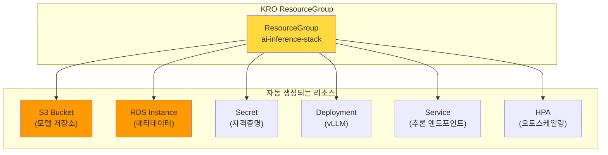

**KRO ResourceGroup 정의 예시:**

```yaml
# ai-inference-stack.yaml
apiVersion: kro.aws.io/v1alpha1
kind: ResourceGroup
metadata:
  name: ai-inference-stack
spec:
  schema:
    apiVersion: v1alpha1
    kind: AIInferenceStack
    spec:
      modelName: string
      gpuType: string | default="g5.xlarge"
      minReplicas: integer | default=1
      maxReplicas: integer | default=10

  resources:
  # S3 버킷 (ACK)
  - id: modelBucket
    template:
      apiVersion: s3.services.k8s.aws/v1alpha1
      kind: Bucket
      metadata:
        name: ${schema.spec.modelName}-models
      spec:
        name: ${schema.spec.modelName}-models-${schema.metadata.namespace}

  # vLLM Deployment
  - id: inference
    template:
      apiVersion: apps/v1
      kind: Deployment
      metadata:
        name: ${schema.spec.modelName}-vllm
      spec:
        replicas: ${schema.spec.minReplicas}
        template:
          spec:
            containers:
            - name: vllm
              image: vllm/vllm-openai:latest
              env:
              - name: MODEL_PATH
                value: s3://${modelBucket.status.bucketName}/

  # HPA
  - id: autoscaler
    template:
      apiVersion: autoscaling/v2
      kind: HorizontalPodAutoscaler
      metadata:
        name: ${schema.spec.modelName}-hpa
      spec:
        scaleTargetRef:
          name: ${inference.metadata.name}
        minReplicas: ${schema.spec.minReplicas}
        maxReplicas: ${schema.spec.maxReplicas}
```

**KRO로 AI 추론 스택 배포:**

```yaml
# 단일 리소스로 전체 스택 배포
apiVersion: v1alpha1
kind: AIInferenceStack
metadata:
  name: llama-inference
  namespace: ai-platform
spec:
  modelName: llama-3-70b
  gpuType: g5.12xlarge
  minReplicas: 2
  maxReplicas: 20
```

### Argo 기반 ML 파이프라인 자동화

**Argo Workflows**와 **Argo CD**를 결합하면 AI 모델의 학습, 평가, 배포까지 **전체 MLOps 파이프라인을 GitOps 방식으로 자동화**할 수 있습니다.

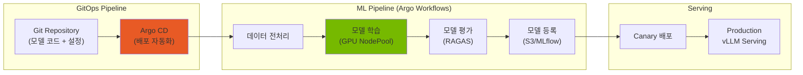

**Argo Workflow를 이용한 FM 파인튜닝 파이프라인:**

```yaml
# fine-tuning-pipeline.yaml
apiVersion: argoproj.io/v1alpha1
kind: Workflow
metadata:
  name: llm-fine-tuning
  namespace: ai-platform
spec:
  entrypoint: fine-tuning-pipeline

  templates:
  - name: fine-tuning-pipeline
    dag:
      tasks:
      # 1. 데이터 준비
      - name: prepare-data
        template: data-preparation

      # 2. 모델 학습 (GPU 사용)
      - name: train-model
        template: training
        dependencies: [prepare-data]

      # 3. 모델 평가
      - name: evaluate-model
        template: evaluation
        dependencies: [train-model]

      # 4. 모델 등록 (평가 통과 시)
      - name: register-model
        template: registration
        dependencies: [evaluate-model]
        when: "{{tasks.evaluate-model.outputs.parameters.quality-score}} > 0.8"

  - name: training
    nodeSelector:
      karpenter.sh/nodepool: gpu-training
    tolerations:
    - key: nvidia.com/gpu
      operator: Exists
    container:
      image: nvcr.io/nvidia/nemo:24.01
      command: [python, train.py]
      resources:
        limits:
          nvidia.com/gpu: 8
      env:
      - name: TRAINING_DATA
        value: s3://agentic-ai-data/training/
      - name: MODEL_OUTPUT
        value: s3://agentic-ai-models/checkpoints/

  - name: evaluation
    container:
      image: ai-platform/ragas-evaluator:latest
      command: [python, evaluate.py]
    outputs:
      parameters:
      - name: quality-score
        valueFrom:
          path: /tmp/quality-score.txt
```

**Argo CD를 이용한 모델 배포 자동화:**

```yaml
# argocd-application.yaml
apiVersion: argoproj.io/v1alpha1
kind: Application
metadata:
  name: llm-inference-prod
  namespace: argocd
spec:
  project: ai-platform
  source:
    repoURL: https://github.com/myorg/ai-platform-configs
    targetRevision: main
    path: deployments/llm-inference
  destination:
    server: https://kubernetes.default.svc
    namespace: ai-platform
  syncPolicy:
    automated:
      prune: true
      selfHeal: true
    syncOptions:
    - CreateNamespace=true
```

### ACK + KRO + Argo 통합 아키텍처

세 가지 도구를 조합하면 **완전 자동화된 AI 플랫폼 운영**이 가능합니다:

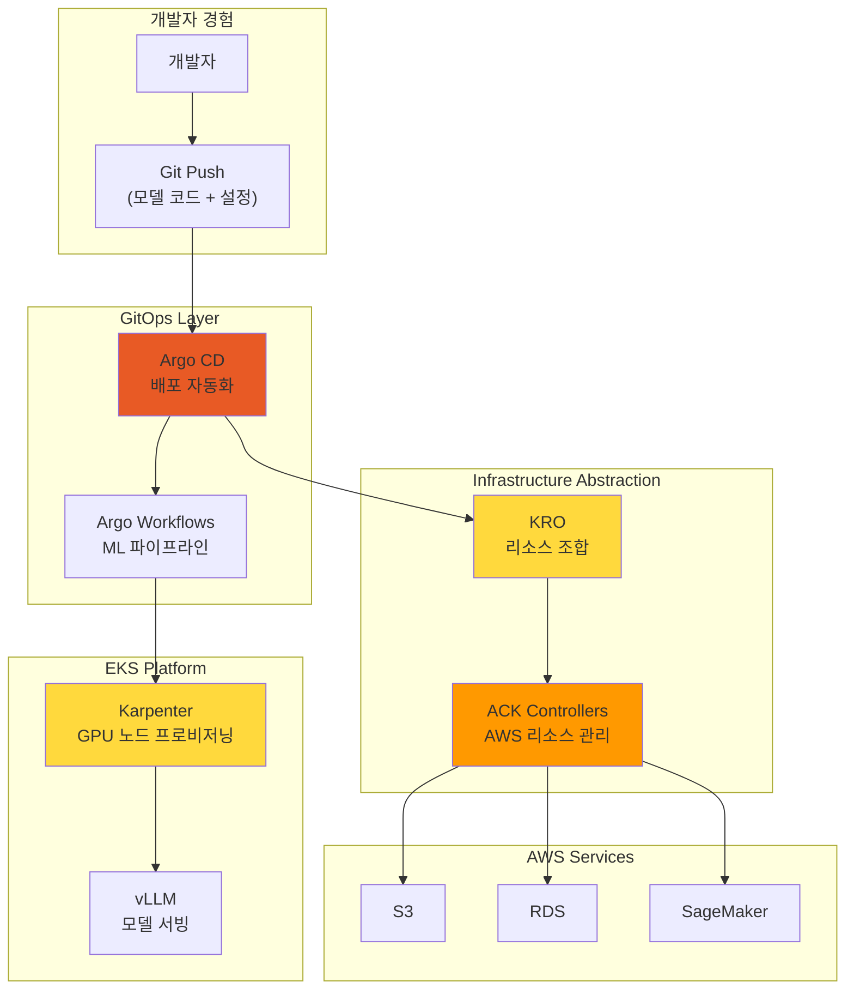

| 구성요소 | 역할 | 자동화 범위 |
|---------|------|------------|
| **Argo CD** | GitOps 배포 자동화 | 애플리케이션 배포, 롤백, 동기화 |
| **Argo Workflows** | ML 파이프라인 오케스트레이션 | 학습, 평가, 모델 등록 워크플로 |
| **KRO** | 복합 리소스 추상화 | K8s + AWS 리소스를 단일 단위로 관리 |
| **ACK** | AWS 리소스 선언적 관리 | S3, RDS, SageMaker 등 AWS 서비스 |
| **Karpenter** | GPU 노드 프로비저닝 | Just-in-Time 인스턴스 프로비저닝 |

:::info 완전 자동화의 이점
이 통합 아키텍처를 통해:

- **개발자**: Git push만으로 모델 배포
- **플랫폼 팀**: 인프라 관리 부담 최소화
- **비용 최적화**: 필요한 리소스만 동적 프로비저닝
- **일관성**: 모든 환경에서 동일한 배포 방식
:::

---

## 결론: Kubernetes + EKS Auto Mode로 완성하는 AI 인프라 자동화

Agentic AI Platform 구축의 4가지 핵심 도전과제는 **클라우드 인프라 자동화와 AI 플랫폼의 유기적 통합**을 통해 효과적으로 해결할 수 있습니다. 특히 **EKS Auto Mode**는 Karpenter를 포함한 핵심 컴포넌트를 자동으로 관리하여 **완전 자동화의 마지막 퍼즐**을 완성합니다.

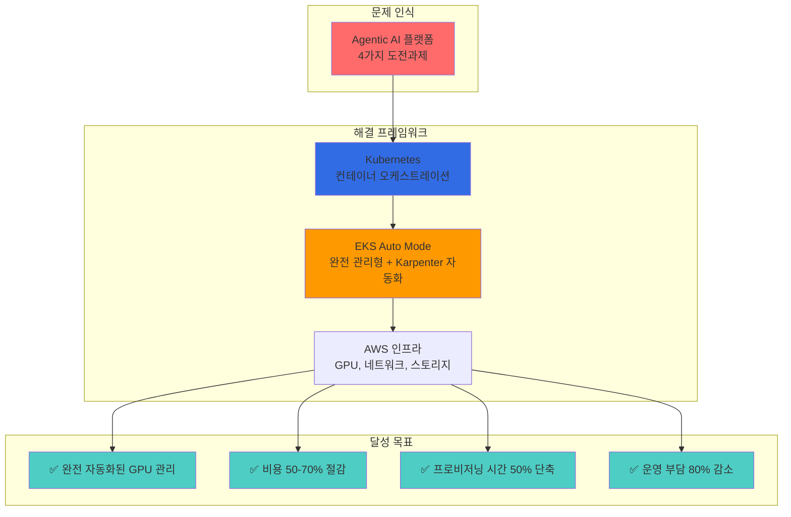

### 핵심 메시지

1. **Kubernetes는 AI 인프라의 필수 기반**: 선언적 리소스 관리, 자동 스케일링, Operator 패턴을 통해 복잡한 AI 워크로드를 효과적으로 관리
2. **EKS Auto Mode가 완전 자동화 실현**: Karpenter, VPC CNI, EBS CSI Driver 등 핵심 컴포넌트 자동 관리로 운영 부담 대폭 감소
3. **Karpenter는 GPU 인프라 자동화의 핵심**: Just-in-Time 프로비저닝, Spot 인스턴스, Consolidation으로 비용과 성능 최적화
4. **AWS 인프라 통합이 시너지 극대화**: EFA 네트워크, 다양한 GPU 인스턴스, FSx 스토리지와의 긴밀한 통합

### EKS Auto Mode: 권장 시작점

새로운 Agentic AI 플랫폼을 구축한다면 **EKS Auto Mode**로 시작하는 것을 권장합니다.

| 이점 | 설명 |
| --- | --- |
| **즉시 시작 가능** | Karpenter 설치/구성 없이 클러스터 생성 즉시 GPU 워크로드 배포 |
| **자동 업그레이드** | Karpenter, CNI, CSI 등 핵심 컴포넌트 자동 업데이트 |
| **보안 패치 자동화** | 보안 취약점 패치 자동 적용 |
| **커스텀 확장 가능** | GPU NodePool, EFA NodeClass 등 필요시 커스텀 설정 추가 |

### 도전과제별 해결 방안 최종 요약

| 도전과제 | Kubernetes 기반 | EKS Auto Mode + Karpenter | 기대 효과 |
| --- | --- | --- | --- |
| **GPU 모니터링** | DCGM + Prometheus | NodePool 기반 통합 관리 | 리소스 활용률 40% 향상 |
| **동적 스케일링** | HPA + KEDA | Just-in-Time 프로비저닝 (자동 구성) | 프로비저닝 시간 50% 단축 |
| **비용 컨트롤** | 네임스페이스 Quota | Spot + Consolidation (자동 활성화) | 비용 50-70% 절감 |
| **FM 파인튜닝** | Kubeflow Operator | Training NodePool + EFA | 학습 효율성 30% 향상 |

### 핵심 권장사항

1. **EKS Auto Mode로 시작**: 새 클러스터는 Auto Mode로 생성하여 Karpenter 자동 구성 활용
2. **GPU NodePool 커스텀 정의**: 워크로드 특성에 맞는 GPU NodePool 추가 (추론/학습/실험 분리)
3. **Spot 인스턴스 적극 활용**: 추론 워크로드의 70% 이상을 Spot으로 운영
4. **Consolidation 기본 활성화**: EKS Auto Mode에서 자동 활성화된 Consolidation 활용
5. **KEDA 연동**: 메트릭 기반 Pod 스케일링과 Karpenter 노드 프로비저닝 연계
6. **EFA NodeClass 추가**: 분산 학습 워크로드를 위한 고성능 네트워크 설정

---

## 참고 자료

### Kubernetes 및 인프라

- [Kubernetes 공식 문서](https://kubernetes.io/docs/)
- [Karpenter 공식 문서](https://karpenter.sh/docs/)
- [Amazon EKS Best Practices Guide](https://docs.aws.amazon.com/eks/latest/best-practices/introduction.html)
- [NVIDIA GPU Operator Documentation](https://docs.nvidia.com/datacenter/cloud-native/gpu-operator/overview.html)
- [KEDA - Kubernetes Event-driven Autoscaling](https://keda.sh/)

### 모델 서빙 및 추론

- [vLLM Documentation](https://docs.vllm.ai/)
- [llm-d Project](https://github.com/llm-d/llm-d)
- [Kgateway Documentation](https://kgateway.io/docs/)
- [LiteLLM Documentation](https://docs.litellm.ai/)

### LLM Observability

- [LangFuse Documentation](https://langfuse.com/docs)
- [LangSmith Documentation](https://docs.smith.langchain.com/)

### Agent 프레임워크 및 학습

- [KAgent - Kubernetes Agent Framework](https://github.com/kagent-dev/kagent)
- [NVIDIA NeMo Framework](https://docs.nvidia.com/nemo-framework/user-guide/latest/overview.html)
- [Kubeflow Documentation](https://www.kubeflow.org/docs/)

### AWS 서비스

- [Amazon EKS Documentation](https://docs.aws.amazon.com/eks/)
- [EKS Auto Mode](https://docs.aws.amazon.com/eks/latest/userguide/automode.html)
- [AWS Elastic Fabric Adapter (EFA)](https://aws.amazon.com/hpc/efa/)
- [Amazon FSx for Lustre](https://aws.amazon.com/fsx/lustre/)

### Agentic AI를 위한 EKS의 장점

**EKS가 최적의 플랫폼인 이유:**

1. **첫날부터 프로덕션 준비 완료**
   - 99.95% SLA를 제공하는 AWS 관리형 Control Plane
   - 자동 보안 패치 및 Kubernetes 업그레이드
   - AWS 서비스와의 깊은 통합 (IAM, VPC, CloudWatch)

2. **간소화된 운영**
   - EKS Auto Mode로 노드 관리 부담 제거
   - Karpenter를 통한 GPU 프로비저닝 자동화
   - CloudWatch를 통한 통합 관찰성 제공

3. **대규모 비용 최적화**
   - Spot 인스턴스 통합으로 60-90% 비용 절감
   - Karpenter Consolidation으로 유휴 낭비 30-40% 감소
   - Right-sizing 및 오토스케일링으로 과다 프로비저닝 최소화

4. **엔터프라이즈 보안**
   - Pod 레벨 IAM 역할 (IRSA)
   - VPC 및 Security Groups를 통한 네트워크 격리
   - 규정 준수 인증 (HIPAA, PCI-DSS, SOC 2)

### 배포 경로 선택하기

<Tabs>
<TabItem value="auto-mode" label="EKS Auto Mode (대부분에게 권장)">

**적합한 경우:**

- 스타트업 및 소규모 팀
- Kubernetes 초보 팀
- 표준 Agentic AI 워크로드 (CPU + 중간 수준 GPU)
- 빠른 출시 요구사항

**시작하기:**

```bash
aws eks create-cluster \
  --name agentic-ai-auto \
  --region us-west-2 \
  --compute-config enabled=true
```

**장점:**

- 인프라 관리 부담 제로
- AWS 최적화된 기본 설정
- 내장된 비용 최적화
- 자동 보안 패치

**단점:**

- 인스턴스 타입에 대한 제어 감소
- 극단적인 비용 시나리오 최적화 어려움
- AWS 관리형 타입으로 GPU 지원 제한

</TabItem>
<TabItem value="karpenter" label="EKS + Karpenter (최대 제어)">

**적합한 경우:**

- 대규모 프로덕션 워크로드
- 복잡한 GPU 요구사항 (혼합 인스턴스 타입)
- 비용 최적화가 최우선 (70%+ 절감)
- Kubernetes 전문성을 보유한 팀

**시작하기:**

```bash
terraform apply -f eks-karpenter-blueprint/
kubectl apply -f karpenter-nodepools/
```

**장점:**

- 인스턴스에 대한 세밀한 제어
- 최대 비용 최적화 (70-80% 절감)
- 유연한 GPU 스케줄링
- 커스텀 AMI 및 노드 구성

**단점:**

- Karpenter 관리 필요
- 구성 복잡도 증가
- 팀에 K8s 전문성 필요

</TabItem>
<TabItem value="hybrid" label="하이브리드 (두 방식의 장점 결합)">

**적합한 경우:**

- 성장하는 플랫폼 (단순하게 시작, 복잡하게 확장)
- 혼합 워크로드 타입 (CPU 에이전트 + GPU LLM)
- Auto Mode에서 Karpenter로 점진적 마이그레이션

**아키텍처:**

- Control Plane은 EKS Auto Mode 사용
- 시스템 워크로드는 관리형 노드 그룹에서 실행
- GPU 워크로드는 Karpenter NodePool에서 실행

**시작하기:**

```bash
# 1단계: Auto Mode로 EKS 클러스터 생성
aws eks create-cluster --name agentic-ai --compute-config enabled=true

# 2단계: GPU 노드용 Karpenter 설치
helm install karpenter oci://public.ecr.aws/karpenter/karpenter

# 3단계: GPU NodePool 배포
kubectl apply -f gpu-nodepools.yaml
```

**장점:**

- 점진적 복잡도 증가
- 중요한 부분(GPU 비용)에서 최적화
- AWS 관리형 Control Plane + 커스텀 Data Plane

**단점:**

- Auto Mode와 Karpenter 모두 관리 필요
- 잠재적 구성 충돌 가능성

</TabItem>
</Tabs>

### 미래: AI 네이티브 Kubernetes

**주요 트렌드:**

- **AI 최적화 스케줄링**: ML 기반 인스턴스 선택을 통한 Karpenter
- **동적 모델 라우팅**: 작업 복잡도 기반 지능형 LLM 선택
- **연합 학습(Federated Learning)**: EKS Anywhere를 통한 멀티 클러스터 학습
- **서버리스 GPU**: 급증하는 워크로드를 위한 AWS Lambda GPU 인스턴스

**EKS 로드맵 하이라이트:**

- 네이티브 GPU 공유 (MIG/MPS 지원)
- 통합 모델 서빙 (SageMaker + EKS)
- 멀티 테넌트 AI 플랫폼을 위한 비용 할당
- LLM 워크로드를 위한 향상된 관찰성

### 지금 시작하기

**오늘부터 시작:**

1. **프로토타입** (1주)
   - EKS Auto Mode 클러스터 배포
   - 샘플 Agentic AI 워크로드 실행
   - 기준 비용 및 성능 측정

2. **최적화** (2-4주)
   - GPU 워크로드를 위해 Karpenter로 마이그레이션
   - KEDA 오토스케일링 구현
   - CloudWatch 대시보드 설정

3. **확장** (지속적)
   - Consolidation 정책 미세 조정
   - 학습 파이프라인 구현
   - 멀티 테넌트 플랫폼 구축

**리소스:**

- [AWS EKS Best Practices Guide](https://docs.aws.amazon.com/eks/latest/best-practices/introduction.html)
- [Karpenter Documentation](https://karpenter.sh/)
- [KEDA Scalers Reference](https://keda.sh/docs/scalers/)
- [Kubeflow on AWS](https://awslabs.github.io/kubeflow-manifests/)

**질문이 있으신가요?**

- [AWS Containers Slack](https://aws-containers.slack.com) 참여
- [EKS Blueprints](https://github.com/aws-ia/terraform-aws-eks-blueprints)에 이슈 등록
- 아키텍처 검토를 위해 AWS Solutions Architect에게 문의

---

**다음 단계:**

- 오픈소스 대안을 확인하려면 [기술적 도전과제 문서](./agentic-ai-challenges.md)를 검토하세요
- 실습을 위해 [AWS EKS Workshop](https://eksworkshop.com/)을 탐색하세요
- 최신 트렌드를 위해 [Cloud Native Community Groups](https://community.cncf.io/)에 참여하세요
