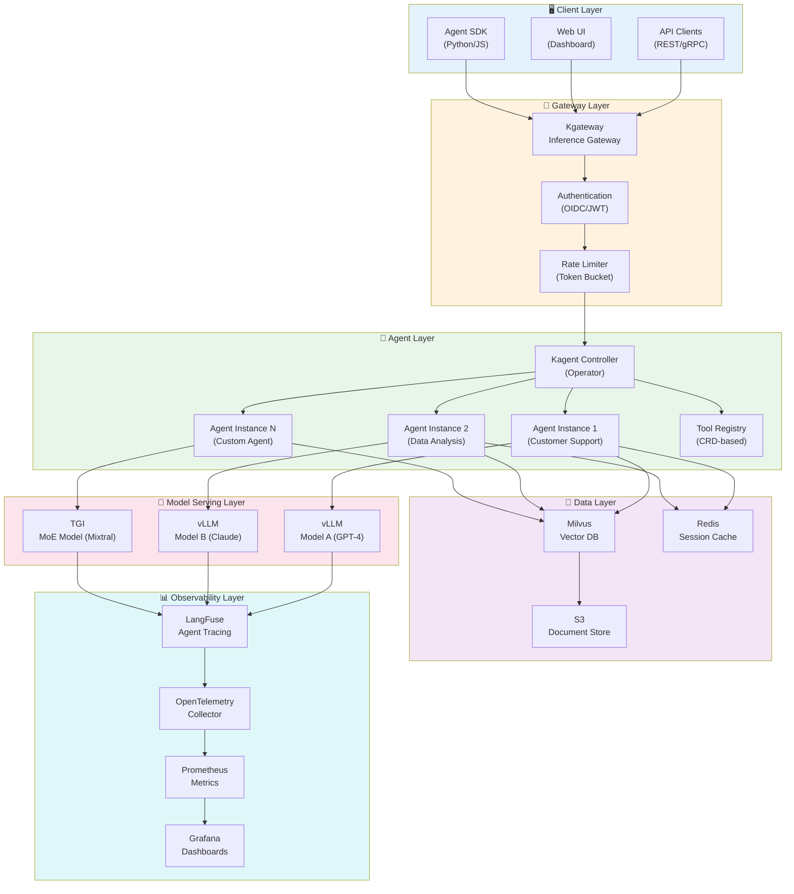
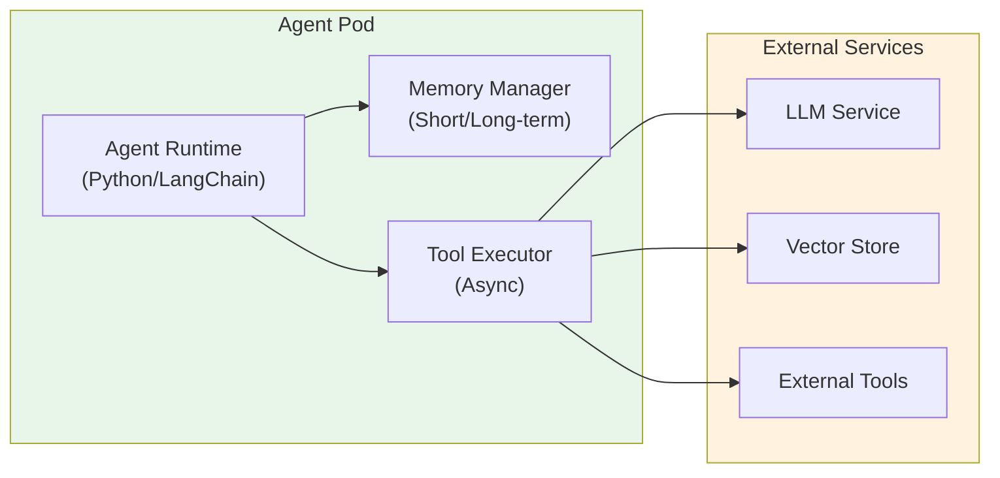
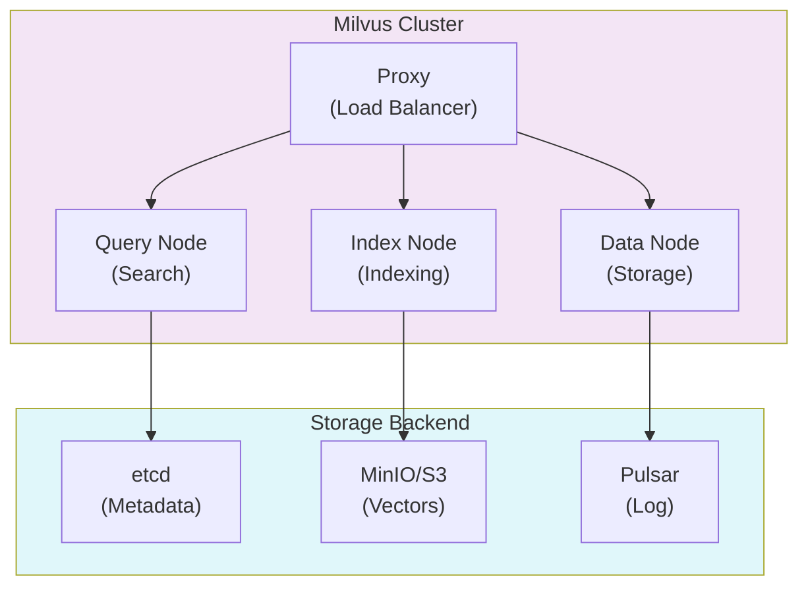
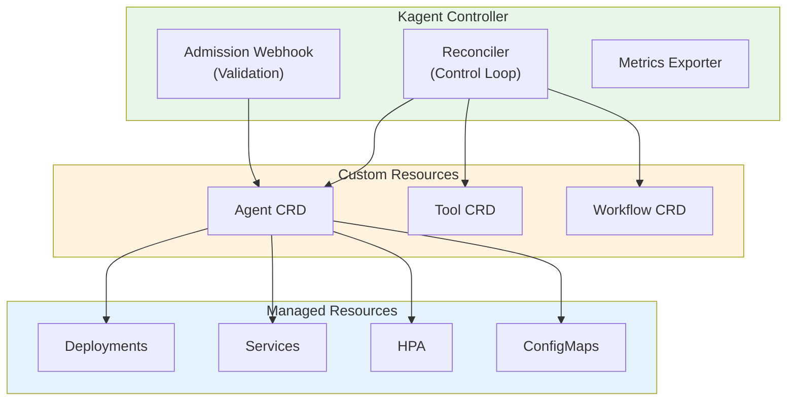
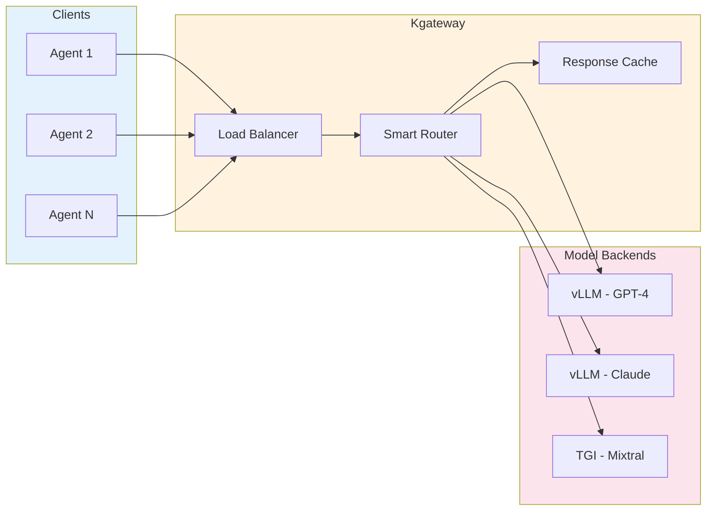
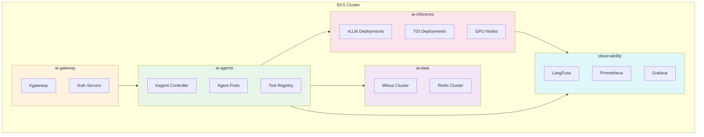
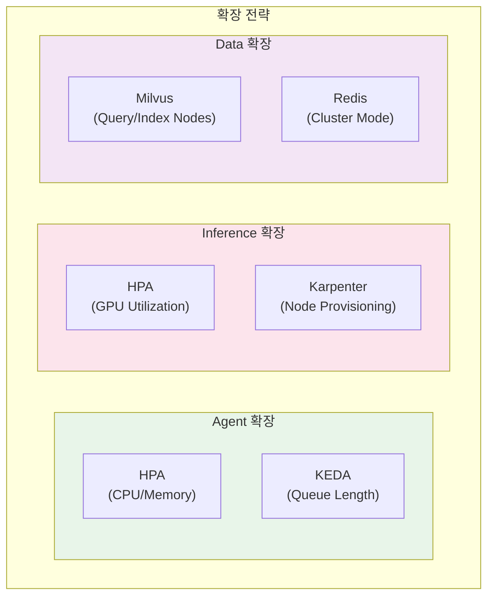
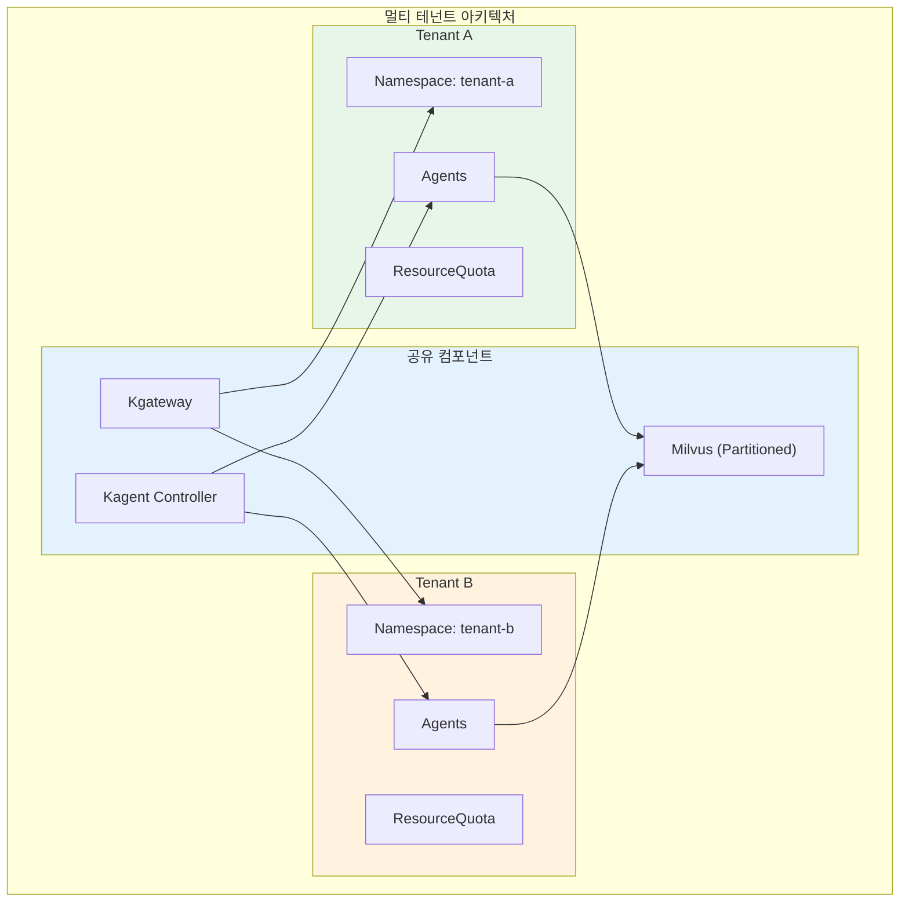
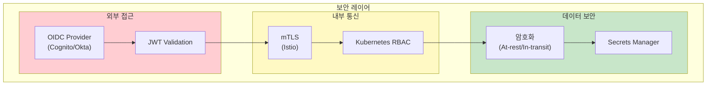
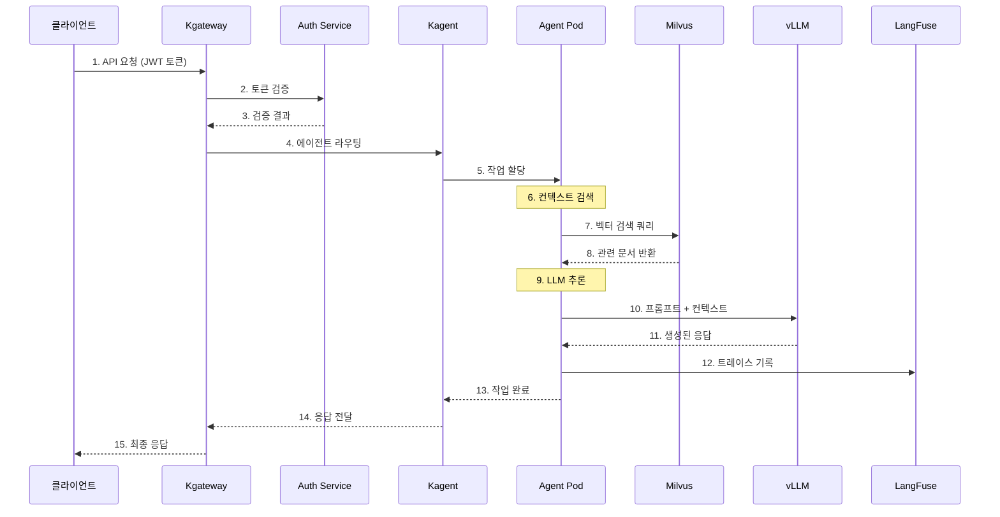

import { CoreCapabilities, LayerRoles, ToolTypes, K8sFeatures, RoutingStrategies, TenantIsolation, RequestProcessing, TechnologyStack } from '@site/src/components/ArchitectureTables';

# Agentic AI Platform 아키텍처

> 📅 **작성일**: 2025-02-05 | **수정일**: 2026-02-13 | ⏱️ **읽는 시간**: 약 15분

이 문서는 Amazon EKS 기반 프로덕션급 Agentic AI Platform의 전체 시스템 아키텍처와 핵심 컴포넌트 설계를 다룹니다. 자율적으로 작업을 수행하는 AI 에이전트를 효율적으로 구축하고 운영하기 위한 플랫폼 아키텍처를 제시합니다.

## 개요

Agentic AI Platform은 자율적인 AI 에이전트가 복잡한 작업을 수행할 수 있도록 지원하는 통합 플랫폼입니다. 최신 AI/ML 기술, 컨테이너 오케스트레이션, 그리고 클라우드 네이티브 아키텍처를 통합하여 안정적이고 확장 가능한 GenAI 서비스를 제공합니다.

### 해결하는 문제

기존 GenAI 서비스 구축 과정에서의 도전 과제:

- **AI 모델 서빙의 복잡성**: 다양한 모델의 배포 및 리소스 관리 어려움
- **통합 부족**: ML 프레임워크와 도구의 통합 부재
- **스케일링 문제**: 성능 최적화 및 자동 확장의 어려움
- **MLOps 자동화**: 배포 파이프라인 및 자동화 부재
- **비용 효율성**: 리소스 활용 최적화 방안 부재

이 가이드는 이러한 문제들을 체계적으로 해결하기 위한 실전 전략을 제시합니다.

### 핵심 기능

<CoreCapabilities />

:::info 대상 독자
이 문서는 솔루션 아키텍트, 플랫폼 엔지니어, DevOps 엔지니어를 대상으로 합니다. Kubernetes와 AI/ML 워크로드에 대한 기본적인 이해가 필요합니다.
:::

## 전체 시스템 아키텍처

Agentic AI Platform은 6개의 주요 레이어로 구성됩니다. 각 레이어는 명확한 책임을 가지며, 느슨한 결합을 통해 독립적인 확장과 운영이 가능합니다.



### 레이어별 역할

<LayerRoles />

## 핵심 컴포넌트

### Agent Runtime Layer

Agent Runtime Layer는 AI 에이전트가 실행되는 환경을 제공합니다. 각 에이전트는 독립적인 Pod로 실행되며, Kagent Controller에 의해 관리됩니다.



#### 주요 기능

- **상태 관리**: 에이전트의 대화 컨텍스트 및 작업 상태 유지
- **도구 실행**: 등록된 도구를 비동기적으로 실행
- **메모리 관리**: 단기/장기 메모리를 통한 컨텍스트 유지
- **오류 복구**: 실패한 작업의 자동 재시도 및 폴백

### Tool Registry

Tool Registry는 에이전트가 사용할 수 있는 도구들을 중앙에서 관리합니다. Kubernetes CRD(Custom Resource Definition)를 통해 도구를 선언적으로 정의합니다.

```yaml
apiVersion: kagent.dev/v1alpha1
kind: Tool
metadata:
  name: web-search
  namespace: ai-agents
spec:
  type: api
  description: "웹 검색을 수행하여 최신 정보를 가져옵니다"
  config:
    endpoint: http://search-service/api/search
    method: POST
    timeout: 30s
  parameters:
    - name: query
      type: string
      required: true
      description: "검색 쿼리"
    - name: max_results
      type: integer
      default: 10
      description: "최대 결과 수"
  authentication:
    type: bearer
    secretRef:
      name: search-api-token
      key: token
```

#### 도구 유형

<ToolTypes />

### Memory Store (Milvus)

Milvus는 RAG 시스템의 핵심인 벡터 저장소 역할을 합니다. 에이전트는 Milvus를 통해 관련 문서를 검색하고 컨텍스트를 보강합니다.



#### 컬렉션 설계 예시

```python
from pymilvus import Collection, FieldSchema, CollectionSchema, DataType

# 컬렉션 스키마 정의
fields = [
    FieldSchema(name="id", dtype=DataType.VARCHAR, max_length=64, is_primary=True),
    FieldSchema(name="content", dtype=DataType.VARCHAR, max_length=65535),
    FieldSchema(name="embedding", dtype=DataType.FLOAT_VECTOR, dim=1536),
    FieldSchema(name="metadata", dtype=DataType.JSON),
    FieldSchema(name="tenant_id", dtype=DataType.VARCHAR, max_length=64),
]

schema = CollectionSchema(fields, description="Knowledge base for agents")
collection = Collection(name="agent_knowledge", schema=schema)

# HNSW 인덱스 생성 (고성능 검색)
index_params = {
    "metric_type": "COSINE",
    "index_type": "HNSW",
    "params": {"M": 16, "efConstruction": 256}
}
collection.create_index(field_name="embedding", index_params=index_params)
```

### Orchestrator (Kagent)

Kagent는 Kubernetes Operator 패턴을 사용하여 AI 에이전트의 전체 라이프사이클을 관리합니다.



#### Agent CRD 예시

```yaml
apiVersion: kagent.dev/v1alpha1
kind: Agent
metadata:
  name: customer-support-agent
  namespace: ai-agents
spec:
  # 모델 설정
  model:
    provider: openai
    name: gpt-4-turbo
    temperature: 0.7
    maxTokens: 4096

  # 시스템 프롬프트
  systemPrompt: |
    당신은 친절하고 전문적인 고객 지원 에이전트입니다.
    항상 정확한 정보를 제공하고, 모르는 것은 솔직히 인정하세요.

  # 사용할 도구
  tools:
    - name: search-knowledge-base
      type: retrieval
      config:
        vectorStore: milvus
        collection: support-docs
        topK: 5
    - name: create-ticket
      type: api
      config:
        endpoint: http://ticketing-service/api/tickets
        method: POST

  # 메모리 설정
  memory:
    type: redis
    config:
      host: redis-master.ai-data.svc.cluster.local
      port: 6379
      ttl: 3600
      maxHistory: 50

  # 스케일링 설정
  scaling:
    minReplicas: 2
    maxReplicas: 10
    targetCPUUtilization: 70
    targetMemoryUtilization: 80

  # 리소스 제한
  resources:
    requests:
      memory: "512Mi"
      cpu: "250m"
    limits:
      memory: "1Gi"
      cpu: "500m"
```

### Inference Gateway (Kgateway)

Kgateway는 Kubernetes Gateway API를 기반으로 AI 모델 추론 요청을 지능적으로 라우팅합니다.



#### HTTPRoute 설정 예시

```yaml
apiVersion: gateway.networking.k8s.io/v1
kind: HTTPRoute
metadata:
  name: inference-routing
  namespace: ai-gateway
spec:
  parentRefs:
    - name: ai-gateway
      namespace: ai-gateway
  rules:
    # GPT-4 모델 라우팅 (가중치 기반)
    - matches:
        - path:
            type: PathPrefix
            value: /v1/chat/completions
          headers:
            - name: x-model-id
              value: "gpt-4"
      backendRefs:
        - name: vllm-gpt4-primary
          port: 8000
          weight: 80
        - name: vllm-gpt4-canary
          port: 8000
          weight: 20

    # Claude 모델 라우팅
    - matches:
        - path:
            type: PathPrefix
            value: /v1/chat/completions
          headers:
            - name: x-model-id
              value: "claude-3"
      backendRefs:
        - name: vllm-claude3
          port: 8000

    # MoE 모델 라우팅 (복잡한 작업용)
    - matches:
        - path:
            type: PathPrefix
            value: /v1/chat/completions
          headers:
            - name: x-model-id
              value: "mixtral-8x7b"
      backendRefs:
        - name: tgi-mixtral
          port: 8080
```

#### 라우팅 전략

<RoutingStrategies />

## Kubernetes 배포 아키텍처

### Kubernetes 1.33/1.34 주요 기능 활용

Agentic AI Platform은 Kubernetes 1.33 및 1.34의 최신 기능을 활용하여 성능과 안정성을 극대화합니다.

<K8sFeatures />

:::tip Topology-Aware Routing 활용
Kubernetes 1.33+의 Topology-Aware Routing을 활용하면 동일 AZ 내 Pod 간 통신을 우선시하여 크로스 AZ 데이터 전송 비용을 최대 50% 절감할 수 있습니다.

```yaml
apiVersion: v1
kind: Service
metadata:
  name: vllm-inference
  namespace: ai-inference
  annotations:
    service.kubernetes.io/topology-mode: "Auto"
spec:
  selector:
    app: vllm
  ports:
    - port: 8000
      targetPort: 8000
  trafficDistribution: PreferClose
```
:::

### 네임스페이스 구성 전략

Agentic AI Platform은 관심사 분리와 보안을 위해 기능별로 네임스페이스를 분리합니다.



#### 네임스페이스 설정

```yaml
# ai-gateway 네임스페이스
apiVersion: v1
kind: Namespace
metadata:
  name: ai-gateway
  labels:
    istio-injection: enabled
    pod-security.kubernetes.io/enforce: restricted
---
# ai-agents 네임스페이스
apiVersion: v1
kind: Namespace
metadata:
  name: ai-agents
  labels:
    istio-injection: enabled
    pod-security.kubernetes.io/enforce: baseline
---
# ai-inference 네임스페이스 (GPU 워크로드)
apiVersion: v1
kind: Namespace
metadata:
  name: ai-inference
  labels:
    pod-security.kubernetes.io/enforce: privileged
---
# ai-data 네임스페이스
apiVersion: v1
kind: Namespace
metadata:
  name: ai-data
  labels:
    pod-security.kubernetes.io/enforce: baseline
---
# observability 네임스페이스
apiVersion: v1
kind: Namespace
metadata:
  name: observability
  labels:
    pod-security.kubernetes.io/enforce: baseline
```

### 리소스 할당 전략

각 네임스페이스에 ResourceQuota를 설정하여 리소스 사용을 제한하고 공정한 분배를 보장합니다.

```yaml
apiVersion: v1
kind: ResourceQuota
metadata:
  name: ai-inference-quota
  namespace: ai-inference
spec:
  hard:
    requests.cpu: "100"
    requests.memory: "500Gi"
    limits.cpu: "200"
    limits.memory: "1Ti"
    requests.nvidia.com/gpu: "32"
    persistentvolumeclaims: "50"
---
apiVersion: v1
kind: ResourceQuota
metadata:
  name: ai-agents-quota
  namespace: ai-agents
spec:
  hard:
    requests.cpu: "50"
    requests.memory: "100Gi"
    limits.cpu: "100"
    limits.memory: "200Gi"
    pods: "200"
```

:::warning 리소스 계획
GPU 리소스는 비용이 높으므로 신중하게 계획해야 합니다. 초기에는 보수적으로 설정하고, 모니터링을 통해 점진적으로 조정하세요.
:::

## 확장성 설계

### 수평적 확장 전략

Agentic AI Platform의 각 컴포넌트는 독립적으로 수평 확장이 가능합니다.



#### Agent 자동 스케일링 (KEDA)

```yaml
apiVersion: keda.sh/v1alpha1
kind: ScaledObject
metadata:
  name: agent-scaler
  namespace: ai-agents
spec:
  scaleTargetRef:
    name: customer-support-agent
  minReplicaCount: 2
  maxReplicaCount: 20
  pollingInterval: 15
  cooldownPeriod: 300
  triggers:
    # Redis 큐 길이 기반 스케일링
    - type: redis
      metadata:
        address: redis-master.ai-data.svc.cluster.local:6379
        listName: agent-task-queue
        listLength: "10"
    # Prometheus 메트릭 기반 스케일링
    - type: prometheus
      metadata:
        serverAddress: http://prometheus.observability.svc:9090
        metricName: agent_active_sessions
        threshold: "50"
        query: |
          sum(agent_active_sessions{agent="customer-support"})
```

#### GPU 노드 자동 프로비저닝 (Karpenter)

```yaml
apiVersion: karpenter.sh/v1
kind: NodePool
metadata:
  name: gpu-inference-pool
spec:
  template:
    spec:
      requirements:
        - key: "node.kubernetes.io/instance-type"
          operator: In
          values:
            - "p4d.24xlarge"   # 8x A100 40GB
            - "p5.48xlarge"   # 8x H100 80GB
            - "g5.48xlarge"   # 8x A10G 24GB
        - key: "karpenter.sh/capacity-type"
          operator: In
          values: ["on-demand", "spot"]
        - key: "kubernetes.io/arch"
          operator: In
          values: ["amd64"]
      nodeClassRef:
        group: karpenter.k8s.aws
        kind: EC2NodeClass
        name: gpu-nodeclass
  limits:
    nvidia.com/gpu: 64
  disruption:
    consolidationPolicy: WhenEmptyOrUnderutilized
    consolidateAfter: 30s
    budgets:
      - nodes: "20%"
---
apiVersion: karpenter.k8s.aws/v1
kind: EC2NodeClass
metadata:
  name: gpu-nodeclass
spec:
  amiSelectorTerms:
    - alias: al2023@latest
  subnetSelectorTerms:
    - tags:
        karpenter.sh/discovery: "ai-cluster"
  securityGroupSelectorTerms:
    - tags:
        karpenter.sh/discovery: "ai-cluster"
  blockDeviceMappings:
    - deviceName: /dev/xvda
      ebs:
        volumeSize: 500Gi
        volumeType: gp3
        iops: 10000
        throughput: 500
  tags:
    Environment: production
    Workload: ai-inference
```

### 멀티 테넌트 지원

Agentic AI Platform은 여러 팀이나 프로젝트가 동일한 플랫폼을 공유할 수 있도록 멀티 테넌트를 지원합니다.



#### 테넌트 격리 전략

<TenantIsolation />

#### 테넌트별 리소스 할당

```yaml
apiVersion: v1
kind: ResourceQuota
metadata:
  name: tenant-a-quota
  namespace: tenant-a
spec:
  hard:
    requests.cpu: "20"
    requests.memory: "40Gi"
    limits.cpu: "40"
    limits.memory: "80Gi"
    requests.nvidia.com/gpu: "4"
    pods: "50"
    services: "10"
---
apiVersion: networking.k8s.io/v1
kind: NetworkPolicy
metadata:
  name: tenant-isolation
  namespace: tenant-a
spec:
  podSelector: {}
  policyTypes:
    - Ingress
    - Egress
  ingress:
    - from:
        - namespaceSelector:
            matchLabels:
              name: tenant-a
        - namespaceSelector:
            matchLabels:
              name: ai-gateway
  egress:
    - to:
        - namespaceSelector:
            matchLabels:
              name: tenant-a
        - namespaceSelector:
            matchLabels:
              name: ai-inference
        - namespaceSelector:
            matchLabels:
              name: ai-data
```

## 보안 아키텍처

### 인증/인가

Agentic AI Platform은 다층 보안 모델을 적용합니다.



#### RBAC 설정 예시

```yaml
# Agent 운영자 역할
apiVersion: rbac.authorization.k8s.io/v1
kind: Role
metadata:
  name: agent-operator
  namespace: ai-agents
rules:
  - apiGroups: ["kagent.dev"]
    resources: ["agents", "tools", "workflows"]
    verbs: ["get", "list", "watch", "create", "update", "patch", "delete"]
  - apiGroups: [""]
    resources: ["pods", "pods/log", "services", "configmaps"]
    verbs: ["get", "list", "watch"]
  - apiGroups: [""]
    resources: ["secrets"]
    verbs: ["get", "list"]
    resourceNames: ["agent-*"]
---
# Agent 뷰어 역할
apiVersion: rbac.authorization.k8s.io/v1
kind: Role
metadata:
  name: agent-viewer
  namespace: ai-agents
rules:
  - apiGroups: ["kagent.dev"]
    resources: ["agents", "tools", "workflows"]
    verbs: ["get", "list", "watch"]
  - apiGroups: [""]
    resources: ["pods", "pods/log"]
    verbs: ["get", "list", "watch"]
```

### 네트워크 정책

```yaml
# ai-inference 네임스페이스 네트워크 정책
apiVersion: networking.k8s.io/v1
kind: NetworkPolicy
metadata:
  name: inference-network-policy
  namespace: ai-inference
spec:
  podSelector: {}
  policyTypes:
    - Ingress
    - Egress
  ingress:
    # ai-agents에서만 접근 허용
    - from:
        - namespaceSelector:
            matchLabels:
              name: ai-agents
        - namespaceSelector:
            matchLabels:
              name: ai-gateway
      ports:
        - protocol: TCP
          port: 8000
        - protocol: TCP
          port: 8080
  egress:
    # 외부 모델 API 접근 (필요시)
    - to:
        - ipBlock:
            cidr: 0.0.0.0/0
            except:
              - 10.0.0.0/8
              - 172.16.0.0/12
              - 192.168.0.0/16
      ports:
        - protocol: TCP
          port: 443
    # observability로 메트릭 전송
    - to:
        - namespaceSelector:
            matchLabels:
              name: observability
      ports:
        - protocol: TCP
          port: 9090
```

:::danger 보안 주의사항

- 프로덕션 환경에서는 반드시 mTLS를 활성화하세요
- API 키와 토큰은 Kubernetes Secrets 또는 AWS Secrets Manager에 저장하세요
- 정기적으로 보안 감사를 수행하고 취약점을 패치하세요

:::

## 데이터 플로우

다음 다이어그램은 사용자 요청이 플랫폼을 통해 처리되는 전체 흐름을 보여줍니다.



### 요청 처리 단계

<RequestProcessing />

## 모니터링 및 관측성

### 핵심 메트릭

```yaml
# Prometheus ServiceMonitor
apiVersion: monitoring.coreos.com/v1
kind: ServiceMonitor
metadata:
  name: agent-metrics
  namespace: observability
spec:
  selector:
    matchLabels:
      app: kagent
  namespaceSelector:
    matchNames:
      - ai-agents
  endpoints:
    - port: metrics
      interval: 15s
      path: /metrics
---
# PrometheusRule for Alerts
apiVersion: monitoring.coreos.com/v1
kind: PrometheusRule
metadata:
  name: agent-alerts
  namespace: observability
spec:
  groups:
    - name: agent-alerts
      rules:
        - alert: AgentHighLatency
          expr: |
            histogram_quantile(0.99,
              rate(agent_request_duration_seconds_bucket[5m])
            ) > 10
          for: 5m
          labels:
            severity: warning
          annotations:
            summary: "Agent 응답 지연 발생"
            description: "P99 지연 시간이 10초를 초과했습니다"

        - alert: AgentHighErrorRate
          expr: |
            rate(agent_request_errors_total[5m]) /
            rate(agent_request_total[5m]) > 0.05
          for: 5m
          labels:
            severity: critical
          annotations:
            summary: "Agent 오류율 증가"
            description: "오류율이 5%를 초과했습니다"
```

### Grafana 대시보드 구성

주요 모니터링 대시보드:

- **Agent Overview**: 에이전트별 요청 수, 지연 시간, 오류율
- **LLM Performance**: 모델별 토큰 처리량, 추론 시간
- **Resource Usage**: CPU, 메모리, GPU 사용률
- **Cost Tracking**: 테넌트별, 모델별 비용 추적

## 기술 스택

<TechnologyStack />

:::info 버전 호환성
- **Kubernetes 1.33+**: Stable sidecar containers, topology-aware routing, in-place resource resizing
- **Kubernetes 1.34+**: Projected service account tokens, improved DRA, enhanced resource quota
- **kubectl 1.33+**: 새로운 K8s 1.33/1.34 기능 활용을 위해 필수
- **Gateway API v1.2.0+**: HTTPRoute 및 GRPCRoute 향상된 기능 지원
- **Karpenter v1.0+**: GA 상태, 프로덕션 환경에서 안정적 사용 가능
- **vLLM v0.6+**: CUDA 12.x 지원, H100/H200 GPU 완벽 지원
- **DCGM Exporter 3.3+**: H100/H200 GPU 메트릭 수집 지원
:::

## 결론

Agentic AI Platform 아키텍처는 다음과 같은 핵심 원칙을 따릅니다:

1. **모듈화**: 각 컴포넌트는 독립적으로 배포, 확장, 업데이트 가능
2. **확장성**: Kubernetes 네이티브 스케일링으로 트래픽 변화에 유연하게 대응
3. **관측성**: 전체 요청 흐름을 추적하고 분석할 수 있는 통합 모니터링
4. **보안**: 다층 보안 모델로 데이터와 서비스 보호
5. **멀티 테넌트**: 리소스 격리와 공정한 분배를 통한 다중 팀 지원

:::tip 다음 단계

- [GPU 리소스 관리](./gpu-resource-management.md) - 동적 리소스 할당 상세 가이드
- [Kagent Agent 관리](./kagent-kubernetes-agents.md) - 에이전트 배포 및 운영
- [Agent 모니터링](./agent-monitoring.md) - LangFuse 통합 가이드

:::

## 참고 자료

- [Kagent GitHub Repository](https://github.com/kagent-dev/kagent)
- [Kgateway Documentation](https://kgateway.io/docs/)
- [Milvus Documentation](https://milvus.io/docs)
- [LangFuse Documentation](https://langfuse.com/docs)
- [Kubernetes Gateway API](https://gateway-api.sigs.k8s.io/)
- [Karpenter Documentation](https://karpenter.sh/docs/)
