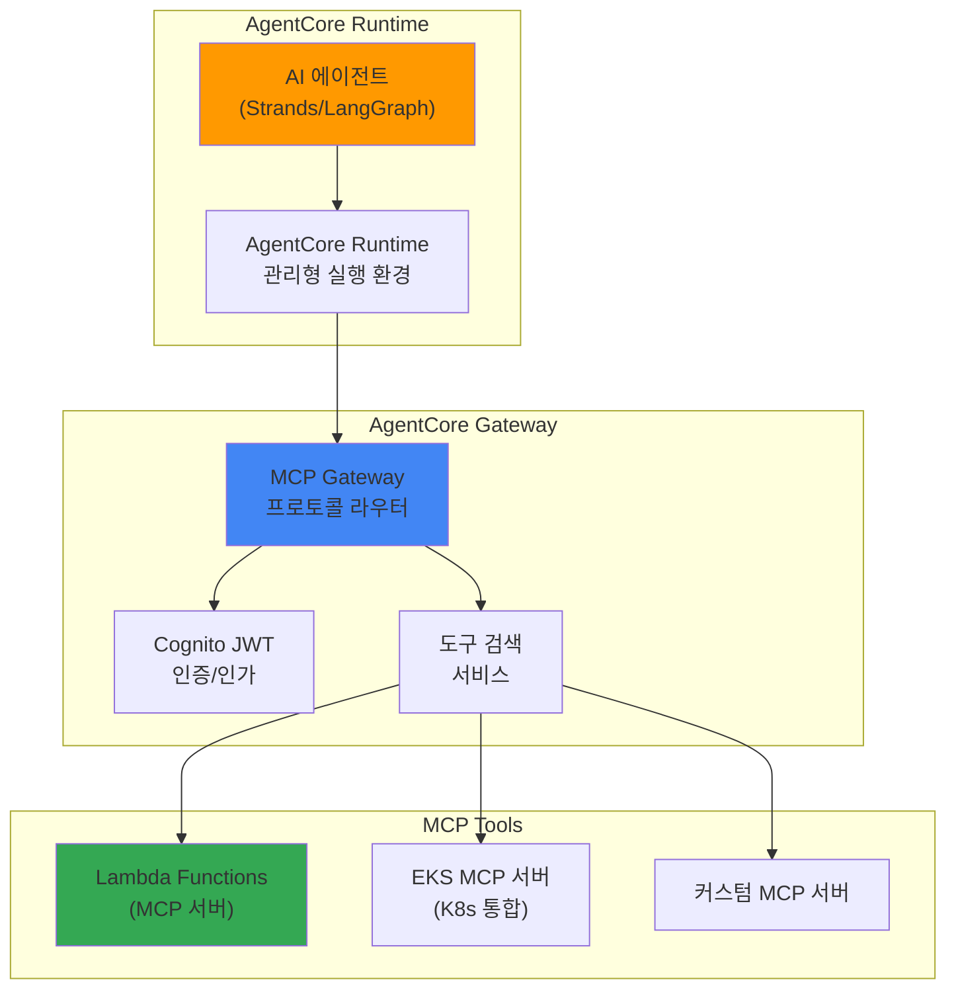
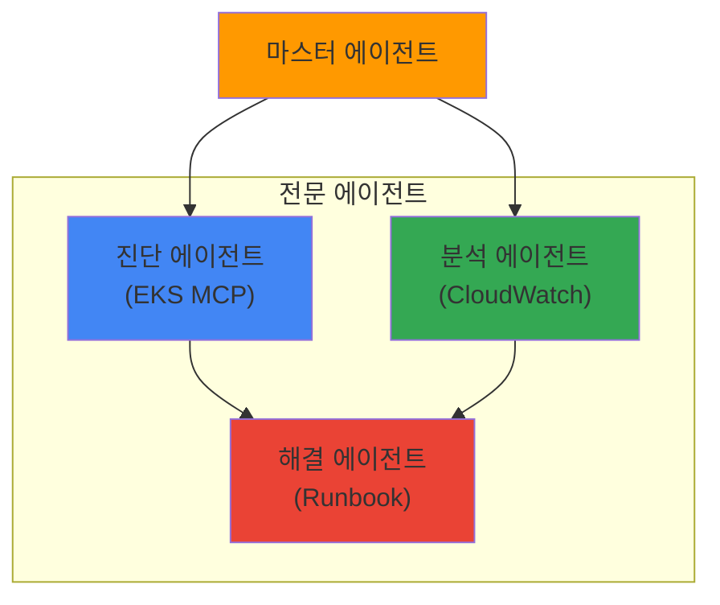

import { EKSMCPFeatures, KagentVsAgentCore, MultiAgentPatterns, MCPServerEcosystem } from '@site/src/components/BedrockMcpTables';

# Bedrock AgentCore와 MCP 통합

> 📅 **작성일**: 2026-02-13 | ⏱️ **읽는 시간**: 약 15분

## 개요

:::caution Bedrock AgentCore 상태
Amazon Bedrock AgentCore는 2025년 AWS re:Invent에서 발표되었으며, 현재 Preview 단계입니다. GA(General Availability) 일정은 AWS 공식 발표를 확인하세요. 프로덕션 환경 적용 전 충분한 테스트가 필요합니다.
:::

Amazon Bedrock AgentCore는 완전 관리형 AI 에이전트 프로덕션 런타임입니다. Model Context Protocol (MCP)을 네이티브 지원하여 에이전트 간 통신, 도구 검색 및 호출을 표준화합니다.

본 문서에서는 EKS 기반 Agentic AI 플랫폼에서 Bedrock AgentCore를 활용하여 프로덕션 수준의 AI 에이전트를 운영하는 방법을 다룹니다.

## 핵심 아키텍처

### AgentCore 3계층 구조



### MCP 프로토콜

MCP (Model Context Protocol)는 AI 에이전트와 도구 간의 표준 통신 프로토콜입니다:

- **도구 검색**: 에이전트가 사용 가능한 도구를 동적으로 검색
- **컨텍스트 전달**: 실행 컨텍스트와 상태를 표준화된 형식으로 전달
- **결과 반환**: 도구 실행 결과를 구조화된 형식으로 반환
- **에이전트 간 통신**: MCP를 통한 멀티 에이전트 협업

## EKS MCP 서버 통합

### EKS MCP 서버 개요

AWS는 EKS 전용 호스팅 MCP 서버를 제공하여 Kubernetes 클러스터와 AI 에이전트 간의 통합을 지원합니다:

<EKSMCPFeatures />

### SRE 에이전트 구축 예시

:::info 참고
아래 `AgentDefinition` CRD는 AgentCore의 선언적 에이전트 정의 개념을 보여주는 예시입니다. 실제 배포 시에는 AWS 콘솔, Bedrock Agent API (boto3), 또는 CloudFormation을 통해 에이전트를 구성합니다.
:::

**실제 배포 방법 (boto3 사용):**

```python
import boto3

bedrock_agent = boto3.client('bedrock-agent')

# 에이전트 생성
response = bedrock_agent.create_agent(
    agentName='sre-agent',
    foundationModel='anthropic.claude-sonnet-4-20250514',
    instruction='You are an SRE agent that helps troubleshoot Kubernetes clusters.',
    agentResourceRoleArn='arn:aws:iam::ACCOUNT:role/BedrockAgentRole',
)

agent_id = response['agent']['agentId']

# MCP 도구 연결 (Action Group)
bedrock_agent.create_agent_action_group(
    agentId=agent_id,
    agentVersion='DRAFT',
    actionGroupName='eks-mcp-tools',
    actionGroupExecutor={
        'customControl': 'RETURN_CONTROL'  # MCP 서버로 라우팅
    },
    apiSchema={
        'payload': json.dumps({
            'openapi': '3.0.0',
            'info': {'title': 'EKS MCP Tools', 'version': '1.0'},
            'paths': {
                '/pod-logs': {'post': {'description': 'Get pod logs'}},
                '/k8s-events': {'post': {'description': 'Get K8s events'}},
            }
        })
    }
)
```

**개념적 CRD 예시 (실제 사용 불가):**

```yaml
# AgentCore를 활용한 SRE 에이전트 정의 (개념 예시)
apiVersion: agentcore.aws/v1
kind: AgentDefinition
metadata:
  name: sre-agent
spec:
  runtime:
    model: anthropic.claude-sonnet-4-20250514
    maxTokens: 4096
  tools:
    - type: mcp
      server: eks-mcp-server
      capabilities:
        - pod-logs
        - k8s-events
        - cloudwatch-metrics
    - type: mcp
      server: custom-runbook-server
      capabilities:
        - execute-runbook
        - create-incident
  policies:
    - name: read-only-production
      effect: allow
      actions: ["read"]
      resources: ["pods", "services", "deployments"]
```

### Kagent과 AgentCore 통합

기존 Kagent 기반 에이전트와 Bedrock AgentCore를 함께 활용할 수 있습니다:

<KagentVsAgentCore />

**하이브리드 접근**: 비용이 중요한 고빈도 호출은 Kagent + vLLM으로, 복잡한 추론이 필요한 저빈도 호출은 Bedrock AgentCore로 라우팅하는 전략이 효과적입니다.

### 멀티 에이전트 오케스트레이션

AgentCore는 MCP를 통한 에이전트 간 협업을 지원합니다:

```python
import boto3

bedrock_runtime = boto3.client('bedrock-agent-runtime')

# 마스터 에이전트 호출
response = bedrock_runtime.invoke_agent(
    agentId='master-agent-id',
    sessionId='session-123',
    inputText='production 클러스터의 비정상 Pod를 진단하고 해결책을 제시해주세요'
)

# 마스터 에이전트는 내부적으로 다음 에이전트들을 호출:
# 1. Diagnostic Agent (EKS MCP 서버 사용)
# 2. Analysis Agent (CloudWatch 메트릭 분석)
# 3. Remediation Agent (Runbook 실행)
```

**멀티 에이전트 패턴:**

<MultiAgentPatterns />



## 보안 및 접근 제어

### Cognito JWT 인증

AgentCore Gateway는 Amazon Cognito를 통한 JWT 기반 인증을 제공합니다:

```yaml
# MCP Gateway 인증 설정
apiVersion: v1
kind: ConfigMap
metadata:
  name: agentcore-auth-config
data:
  auth.yaml: |
    provider: cognito
    userPoolId: ap-northeast-2_xxxxx
    clientId: your-client-id
    scopes:
      - agents/invoke
      - tools/read
      - tools/execute
```

### IAM 정책

```json
{
  "Version": "2012-10-17",
  "Statement": [
    {
      "Effect": "Allow",
      "Action": [
        "bedrock:InvokeAgent",
        "bedrock:GetAgent"
      ],
      "Resource": "arn:aws:bedrock:ap-northeast-2:123456789012:agent/your-agent-id"
    },
    {
      "Effect": "Allow",
      "Action": [
        "bedrock:InvokeModel"
      ],
      "Resource": "arn:aws:bedrock:ap-northeast-2::foundation-model/anthropic.claude-*"
    }
  ]
}
```

## 모니터링 및 관측성

### AgentCore 메트릭

Bedrock AgentCore는 CloudWatch에 에이전트 실행 메트릭을 자동 게시합니다:

- `AgentInvocations`: 에이전트 호출 횟수
- `AgentLatency`: 에이전트 응답 시간
- `ToolInvocations`: 도구 호출 횟수
- `ToolErrors`: 도구 실행 오류
- `TokenUsage`: 토큰 사용량

### LangFuse 통합

기존 LangFuse 모니터링과 AgentCore를 통합하여 통합 관측성을 구현할 수 있습니다:

```python
from langfuse import Langfuse
import boto3

langfuse = Langfuse()
bedrock = boto3.client('bedrock-agent-runtime')

# AgentCore 호출을 LangFuse로 추적
trace = langfuse.trace(name="sre-agent-invocation")
span = trace.span(name="bedrock-agentcore")

response = bedrock.invoke_agent(
    agentId="your-agent-id",
    sessionId="session-123",
    inputText="production 네임스페이스의 비정상 Pod를 진단해주세요"
)

span.end(output=response)
```

### CloudWatch Generative AI Observability 통합

:::tip CloudWatch Gen AI Observability GA
CloudWatch Generative AI Observability는 **2025년 10월 GA**되었습니다. AgentCore와 네이티브로 통합되어 별도 설정 없이 에이전트 호출, 도구 실행, 토큰 사용량이 자동으로 CloudWatch에 기록됩니다.
:::

AgentCore는 **CloudWatch Generative AI Observability**와 네이티브로 통합됩니다:

- **에이전트 실행 추적**: 엔드투엔드 트레이싱으로 전체 추론 흐름 가시화
- **도구 호출 모니터링**: MCP 서버별 호출 횟수, 지연, 오류율 추적
- **토큰 소비 분석**: 모델별 입출력 토큰 사용량 및 비용 추적
- **이상 탐지**: CloudWatch Anomaly Detection과 연동하여 비정상 패턴 자동 감지

**CloudWatch 콘솔에서 확인:**

1. CloudWatch 콘솔 → "AgentCore" 탭
2. 에이전트별 메트릭 대시보드 자동 생성
3. 프롬프트 트레이싱으로 전체 실행 흐름 확인
4. Logs Insights로 상세 로그 분석

LangFuse(Self-hosted 상세 트레이싱)와 CloudWatch Gen AI Observability(AWS 네이티브 통합)를 함께 사용하면 가장 포괄적인 관측성을 확보할 수 있습니다.

## AWS MCP 서버 배포

AWS는 공식 MCP 서버를 오픈소스로 제공합니다 ([github.com/awslabs/mcp](https://github.com/awslabs/mcp)):

### EKS MCP 서버 배포

```bash
# AWS MCP 서버 저장소 클론
git clone https://github.com/awslabs/mcp.git
cd mcp/servers/eks

# Docker 이미지 빌드
docker build -t eks-mcp-server:latest .

# EKS에 배포
kubectl apply -f k8s/deployment.yaml
```

**EKS MCP 서버 Deployment:**

```yaml
apiVersion: apps/v1
kind: Deployment
metadata:
  name: eks-mcp-server
  namespace: mcp-servers
spec:
  replicas: 2
  selector:
    matchLabels:
      app: eks-mcp-server
  template:
    metadata:
      labels:
        app: eks-mcp-server
    spec:
      serviceAccountName: eks-mcp-server
      containers:
      - name: server
        image: eks-mcp-server:latest
        ports:
        - containerPort: 8080
          name: http
        env:
        - name: CLUSTER_NAME
          value: "production-cluster"
        - name: AWS_REGION
          value: "ap-northeast-2"
        resources:
          requests:
            cpu: "500m"
            memory: "512Mi"
          limits:
            cpu: "1"
            memory: "1Gi"
---
apiVersion: v1
kind: Service
metadata:
  name: eks-mcp-server
  namespace: mcp-servers
spec:
  selector:
    app: eks-mcp-server
  ports:
  - port: 80
    targetPort: 8080
  type: ClusterIP
```

**IAM 권한 설정 (IRSA):**

```json
{
  "Version": "2012-10-17",
  "Statement": [
    {
      "Effect": "Allow",
      "Action": [
        "eks:DescribeCluster",
        "eks:ListClusters"
      ],
      "Resource": "arn:aws:eks:ap-northeast-2:*:cluster/*"
    },
    {
      "Effect": "Allow",
      "Action": [
        "logs:GetLogEvents",
        "logs:FilterLogEvents"
      ],
      "Resource": "arn:aws:logs:ap-northeast-2:*:log-group:/aws/eks/*"
    },
    {
      "Effect": "Allow",
      "Action": [
        "cloudwatch:GetMetricData",
        "cloudwatch:GetMetricStatistics"
      ],
      "Resource": "*"
    }
  ]
}
```

## AWS MCP 서버 에코시스템

AWS는 공식 MCP 서버를 오픈소스로 제공합니다 ([github.com/awslabs/mcp](https://github.com/awslabs/mcp)):

<MCPServerEcosystem />

## 관련 문서

- [Agentic AI 플랫폼 아키텍처](./agentic-platform-architecture.md)
- [Kagent Kubernetes 에이전트](./kagent-kubernetes-agents.md)
- [에이전트 모니터링](./agent-monitoring.md)
- [추론 게이트웨이 라우팅](./inference-gateway-routing.md)

## 참고 자료

- [Amazon Bedrock AgentCore 문서](https://docs.aws.amazon.com/bedrock/latest/userguide/agents.html)
- [AWS MCP Servers (GitHub)](https://github.com/awslabs/mcp)
- [Model Context Protocol 사양](https://modelcontextprotocol.io/)
- [CloudWatch Generative AI Observability](https://aws.amazon.com/blogs/mt/launching-amazon-cloudwatch-generative-ai-observability-preview/)
- [CNS421: Streamline EKS Operations with Agentic AI (re:Invent 2025)](https://www.youtube.com/watch?v=4s-a0jY4kSE)
