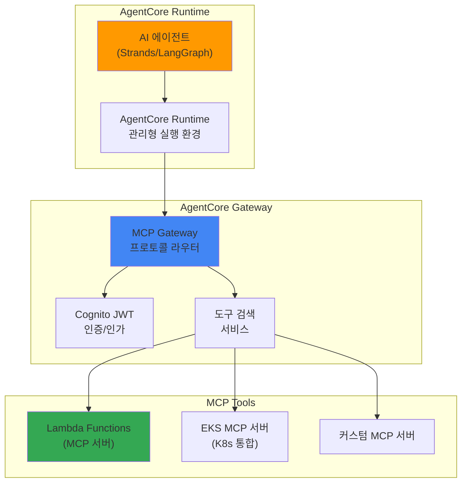

# Bedrock AgentCore와 MCP 통합

> 📅 **작성일**: 2025-02-09 | ⏱️ **읽는 시간**: 약 15분

## 개요

Amazon Bedrock AgentCore는 2025년 AWS re:Invent에서 GA로 발표된 완전 관리형 AI 에이전트 프로덕션 런타임입니다. Model Context Protocol (MCP)을 네이티브 지원하여 에이전트 간 통신, 도구 검색 및 호출을 표준화합니다.

본 문서에서는 EKS 기반 Agentic AI 플랫폼에서 Bedrock AgentCore를 활용하여 프로덕션 수준의 AI 에이전트를 운영하는 방법을 다룹니다.

## 핵심 아키텍처

### AgentCore 3계층 구조



### MCP 프로토콜

MCP (Model Context Protocol)는 AI 에이전트와 도구 간의 표준 통신 프로토콜입니다:

- **도구 검색**: 에이전트가 사용 가능한 도구를 동적으로 검색
- **컨텍스트 전달**: 실행 컨텍스트와 상태를 표준화된 형식으로 전달
- **결과 반환**: 도구 실행 결과를 구조화된 형식으로 반환
- **에이전트 간 통신**: MCP를 통한 멀티 에이전트 협업

## EKS MCP 서버 통합

### EKS MCP 서버 개요

AWS는 EKS 전용 호스팅 MCP 서버를 제공하여 Kubernetes 클러스터와 AI 에이전트 간의 통합을 지원합니다:

| 기능 | 설명 |
|------|------|
| Pod 로그 조회 | 특정 Pod의 로그를 실시간 스트리밍 |
| K8s 이벤트 조회 | 클러스터 이벤트 검색 및 분석 |
| CloudWatch 메트릭 | 클러스터 메트릭 조회 및 분석 |
| 리소스 상태 확인 | Deployment, Service 등 리소스 상태 조회 |
| 트러블슈팅 | 에이전트 기반 자동 진단 |

### SRE 에이전트 구축 예시

```yaml
# AgentCore를 활용한 SRE 에이전트 정의
apiVersion: agentcore.aws/v1
kind: AgentDefinition
metadata:
  name: sre-agent
spec:
  runtime:
    model: anthropic.claude-sonnet-4-20250514
    maxTokens: 4096
  tools:
    - type: mcp
      server: eks-mcp-server
      capabilities:
        - pod-logs
        - k8s-events
        - cloudwatch-metrics
    - type: mcp
      server: custom-runbook-server
      capabilities:
        - execute-runbook
        - create-incident
  policies:
    - name: read-only-production
      effect: allow
      actions: ["read"]
      resources: ["pods", "services", "deployments"]
```

### Kagent과 AgentCore 통합

기존 Kagent 기반 에이전트와 Bedrock AgentCore를 함께 활용할 수 있습니다:

| 비교 항목 | Kagent (Self-managed) | Bedrock AgentCore |
|-----------|----------------------|-------------------|
| 실행 환경 | EKS Pod | AWS 관리형 런타임 |
| 모델 선택 | 자유 (vLLM, 외부 API) | Bedrock 모델 |
| 도구 프로토콜 | 커스텀 CRD | MCP 표준 |
| 스케일링 | Karpenter/HPA | 자동 스케일링 |
| 비용 | GPU 인프라 비용 | API 호출 비용 |
| 적합한 경우 | GPU 보유, 커스텀 모델 | 빠른 프로덕션 배포 |

**하이브리드 접근**: 비용이 중요한 고빈도 호출은 Kagent + vLLM으로, 복잡한 추론이 필요한 저빈도 호출은 Bedrock AgentCore로 라우팅하는 전략이 효과적입니다.

## 보안 및 접근 제어

### Cognito JWT 인증

AgentCore Gateway는 Amazon Cognito를 통한 JWT 기반 인증을 제공합니다:

```yaml
# MCP Gateway 인증 설정
apiVersion: v1
kind: ConfigMap
metadata:
  name: agentcore-auth-config
data:
  auth.yaml: |
    provider: cognito
    userPoolId: ap-northeast-2_xxxxx
    clientId: your-client-id
    scopes:
      - agents/invoke
      - tools/read
      - tools/execute
```

### IAM 정책

```json
{
  "Version": "2012-10-17",
  "Statement": [
    {
      "Effect": "Allow",
      "Action": [
        "bedrock:InvokeAgent",
        "bedrock:ListAgents",
        "bedrock:GetAgent"
      ],
      "Resource": "arn:aws:bedrock:ap-northeast-2:*:agent/*"
    }
  ]
}
```

## 모니터링 및 관측성

### AgentCore 메트릭

Bedrock AgentCore는 CloudWatch에 에이전트 실행 메트릭을 자동 게시합니다:

- `AgentInvocations`: 에이전트 호출 횟수
- `AgentLatency`: 에이전트 응답 시간
- `ToolInvocations`: 도구 호출 횟수
- `ToolErrors`: 도구 실행 오류
- `TokenUsage`: 토큰 사용량

### LangFuse 통합

기존 LangFuse 모니터링과 AgentCore를 통합하여 통합 관측성을 구현할 수 있습니다:

```python
from langfuse import Langfuse
import boto3

langfuse = Langfuse()
bedrock = boto3.client('bedrock-agent-runtime')

# AgentCore 호출을 LangFuse로 추적
trace = langfuse.trace(name="sre-agent-invocation")
span = trace.span(name="bedrock-agentcore")

response = bedrock.invoke_agent(
    agentId="your-agent-id",
    sessionId="session-123",
    inputText="production 네임스페이스의 비정상 Pod를 진단해주세요"
)

span.end(output=response)
```

## AWS MCP 서버 에코시스템

AWS는 공식 MCP 서버를 오픈소스로 제공합니다 ([github.com/awslabs/mcp](https://github.com/awslabs/mcp)):

| MCP 서버 | 용도 |
|----------|------|
| EKS MCP Server | Kubernetes 클러스터 관리 |
| CloudWatch MCP Server | 메트릭 및 로그 조회 |
| IAM Policy Autopilot | 최소 권한 정책 생성 |
| S3 MCP Server | 오브젝트 스토리지 접근 |
| RDS MCP Server | 데이터베이스 관리 |

## 관련 문서

- [Agentic AI 플랫폼 아키텍처](./agentic-platform-architecture.md)
- [Kagent Kubernetes 에이전트](./kagent-kubernetes-agents.md)
- [에이전트 모니터링](./agent-monitoring.md)
- [추론 게이트웨이 라우팅](./inference-gateway-routing.md)
