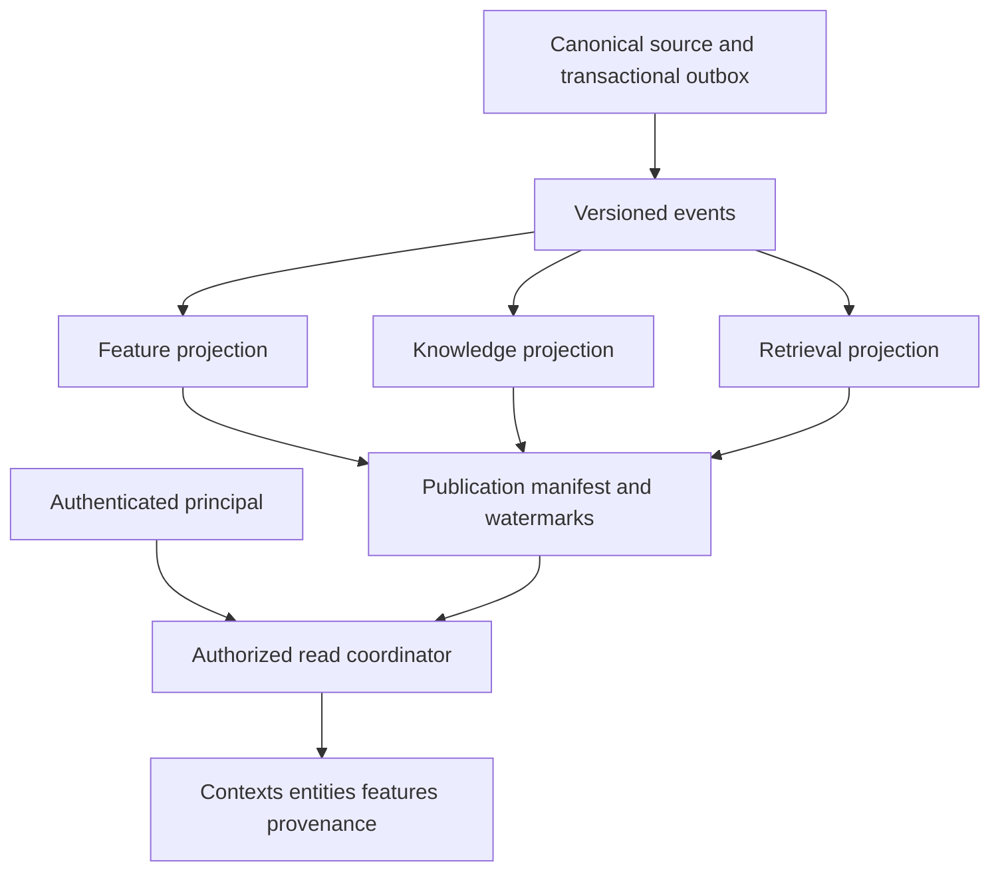
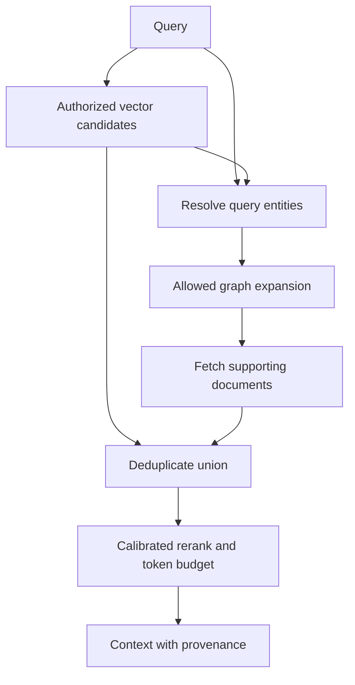
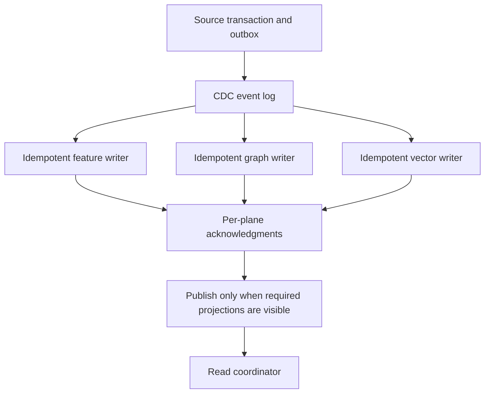

:::caution Forward-looking design / Verification pending
KFS는 이 문서의 합성 아키텍처 제안이며 표준 제품이나 Feast/SageMaker의 상위 호환 API가 아닙니다. 2026-Q2 세션의 완료·승인 증거는 확인되지 않았습니다. 운영자/도메인 소유자의 승인 전까지 개념·스키마·일관성 계약은 제안 상태를 유지합니다. 이 검토에서는 데이터 저장소 변경이나 모델 평가를 수행하지 않았습니다. [Issue #4](https://github.com/devfloor9/engineering-playbook/issues/4)
:::

## 문제 정의: Feature Store만으로 부족한 이유

Feature Store와 Knowledge Graph는 다른 역할을 수행합니다. Feature Store가 provenance·시간 정합성을 전혀 제공하지 않는다는 기존 설명은 부정확합니다. Feast의 historical point-in-time join과 online serving을 구분합니다. KFS는 관계 검색과 feature 조회를 한 애플리케이션 계약으로 조합하는 제안입니다.

### 전통 Feature Store의 한계

Feature Store는 entity key별 feature serving에 초점을 둡니다. 관계 traversal·용어 체계·검색 결과 통합은 별도 설계가 필요할 수 있습니다. 이것이 Feature Store 사용만으로 환각이나 규제 준수 실패가 발생한다는 뜻은 아닙니다.

아래 Customer→Contract→Device→Usage 모델은 **합성 예시**입니다. Premium과 VIP의 의미, 계약 종료 후 관계, device 공유와 temporal 유효성은 도메인 소유자가 결정해야 합니다.

## Knowledge Feature Store 개념 모델

3-plane 모델은 책임 분리입니다. 통합 읽기·인가·write publication은 별도 coordinator와 adapter가 구현해야 하며 backend들의 일관성 보장을 자동으로 합치지 않습니다.

### 3-Plane 아키텍처

아래 구조는 논리적 데이터 흐름입니다. 각 저장소는 독립 commit 경계를 갖습니다.



### 각 Plane의 역할

| Plane | 책임 | 별도 검증 조건 |
|---|---|---|
| Feature | entity key별 feature 값/feature definition | online 최신 값과 offline history·timestamp 의미 |
| Knowledge | 관계·용어·entity resolution | ontology version·RDF/property graph mapping |
| Retrieval | embedding·문서 검색·rerank | model/chunk/index version·검색 visibility |
| Coordinator | 인가·publication·provenance 조합 | cross-plane generation 선택·부분 실패 처리 |

### 통합 읽기 API

`kfs.retrieve`는 구현할 facade 계약의 이름입니다. 설치 가능한 `kfs` SDK 또는 `feast://`, `neptune://` 통합 protocol을 가정하지 않습니다. 인증된 principal을 서버가 전달하고 caller가 임의로 role을 고르지 못하게 합니다.

```text
retrieve(query, authenticated_principal, requested_generation):
  authorize tenant, entity types, attributes, relationships, and purpose
  choose a published generation supported by ALL required stores
  search only authorized, visible documents at that generation
  expand allowed relationships and fetch version-compatible features
  return contexts, entities, features, provenance, generation,
         source_watermarks, freshness, and completeness
  if the contract cannot be met: fail explicitly or apply approved stale policy
```

## 온톨로지 스키마와 엔터티 해석

스키마 의미·entity resolution·저장소 mapping은 서로 다른 계약입니다. 문법적으로 유효한 Turtle만으로 도메인 적합성이 증명되지는 않습니다.

### 도메인 온톨로지 정의

예시는 RDF/OWL class/property와 SKOS concept를 구분합니다. `rdfs`·`xsd` prefix 누락을 수정하고 customerGrade를 문자열이 아닌 concept 관계로 정의합니다. SKOS broader는 OWL subClassOf가 아니며 exactMatch는 고객 동일인 판정이나 VIP/Premium 동등성의 증거가 아닙니다. domain/range는 추론 의미이며 폐쇄형 입력 검증은 별도 SHACL/애플리케이션 규칙이 필요합니다.

```turtle
@prefix kfs: <https://example.org/kfs/> .
@prefix skos: <http://www.w3.org/2004/02/skos/core#> .
@prefix owl: <http://www.w3.org/2002/07/owl#> .
@prefix rdfs: <http://www.w3.org/2000/01/rdf-schema#> .
@prefix xsd: <http://www.w3.org/2001/XMLSchema#> .

kfs:Customer a owl:Class ; rdfs:label "Customer"@en .
kfs:Contract a owl:Class ; rdfs:label "Contract"@en .
kfs:Device a owl:Class ; rdfs:label "Device"@en .
kfs:Usage a owl:Class ; rdfs:label "Usage"@en .

kfs:hasContract a owl:ObjectProperty ;
    rdfs:domain kfs:Customer ; rdfs:range kfs:Contract .
kfs:usesDevice a owl:ObjectProperty ;
    rdfs:domain kfs:Contract ; rdfs:range kfs:Device .
kfs:recordedUsage a owl:ObjectProperty ;
    rdfs:domain kfs:Device ; rdfs:range kfs:Usage .
kfs:customerGrade a owl:ObjectProperty ;
    rdfs:domain kfs:Customer ; rdfs:range skos:Concept .
kfs:churnRisk a owl:DatatypeProperty ;
    rdfs:domain kfs:Customer ; rdfs:range xsd:decimal .

kfs:CustomerGradeScheme a skos:ConceptScheme .
kfs:HighValue a skos:Concept ;
    skos:inScheme kfs:CustomerGradeScheme ; skos:prefLabel "High value"@en .
kfs:Premium a skos:Concept ;
    skos:inScheme kfs:CustomerGradeScheme ; skos:prefLabel "Premium"@en ;
    skos:broader kfs:HighValue .
kfs:VIP a skos:Concept ;
    skos:inScheme kfs:CustomerGradeScheme ; skos:prefLabel "VIP"@en .
# No equivalence is asserted between VIP and Premium.
```

property graph adapter는 HAS_CONTRACT→kfs:hasContract, USES_DEVICE→kfs:usesDevice, RECORDED_USAGE→kfs:recordedUsage 및 grade_id→concept IRI mapping을 버전 관리합니다. entity key는 tenant·source namespace를 포함하고 동명이인·공유 device·계약 갱신·alias 충돌은 별도 resolution 결과와 근거를 남깁니다.

### 관리형 vs 오픈소스 옵션

| 역할 | 옵션 | 구분 |
|---|---|---|
| Transactional graph/RDF | Neptune Database, 적합한 자체 호스팅 저장소 | Neptune Database의 RDF/SPARQL과 property graph API를 구분 |
| Graph analytics | Neptune Analytics | graph memory를 m-NCU로 선택하는 관리형 분석; openCypher 기반 |
| Vector retrieval | Milvus 등 | 자체 consistency/visibility 및 index lifecycle |

Neptune Analytics를 “용량 프로비저닝 없는 RDF store”로 설명하지 않습니다. Neptune Database Serverless와도 구분합니다. 지연과 가격은 데이터·query·용량·리전에 의존하므로 고정 밀리초나 시간당 가격을 이 설계의 성능으로 제시하지 않습니다.

## KG-aware RAG 패턴

그래프 확장으로 recall이 늘 수 있지만 오류 관계·과도한 context가 품질을 낮출 수도 있습니다. 품질 향상은 평가할 가설입니다.

### 벡터 검색 + 그래프 확장

검색·entity resolution·권한 필터·graph expansion·문서 합성·rerank를 모두 적용해야 합니다. 확장한 entity를 최종 context에 넣지 않으면 graph expansion을 수행했다는 것만으로 답변 근거가 늘지 않습니다.



### 구현 예제

다음은 adapter 인터페이스를 정의하는 의사 코드입니다. SDK API나 실행 가능한 평가 script로 제시하지 않습니다. cosine score와 graph distance를 보정 없이 0.7/0.3으로 더하지 않습니다.

```text
query_entities = resolve_entities(query, ontology_version, principal)
vector_docs = vector_search(query, principal, published_generation)
seed_entities = union(query_entities, linked_entities(vector_docs))
expanded = graph_expand(seed_entities, allowed_relations, max_depth,
                        principal, published_generation)
graph_docs = supporting_documents(expanded, principal, published_generation)
candidates = deduplicate_by_document_version(vector_docs + graph_docs)
ranked = calibrated_rerank(query, candidates, principal)
contexts = select_with_token_budget(ranked)
return contexts, source_ids, document_versions, retrieval_generation
```

### 품질 개선 가설과 평가 계약 {#기대-개선치-외부-공개-연구-기반-추정}

이 플랫폼에 대해 승인된 개선 수치는 없습니다. 기존 Faithfulness 0.72→0.89, Recall 0.68→0.85 등은 연결된 실측이 없어 삭제했습니다. GraphRAG 논문과 survey는 이 특정 수치를 검증하지 않습니다. 다른 논문의 다른 dataset·metric 수치를 평균내어 목표 개선율로 쓰지 않습니다.

동일 corpus snapshot·QA split·generator·embedding·token budget·judge/version으로 vector-only와 graph-augmented를 비교합니다. Faithfulness·context recall·answer relevance·인간 판정·지연·비용을 정의하고 표본 수·paired confidence interval·entity-linking 오류·접근 거부 사례를 보고합니다. 평가 실행 전에는 baseline/candidate/result를 pending으로 둡니다.

## Write 경로와 일관성 모델

이 제안은 비동기 projection의 eventual consistency를 기본으로 합니다. 단일 이벤트를 세 저장소에 순차 기록해도 원자적 commit이나 strong consistency가 생기지 않습니다.

### CDC 기반 이벤트 흐름

원천 DB transaction과 outbox를 함께 commit하고 CDC가 versioned event를 전달하도록 설계합니다. source DB의 commit/partition 순서를 기록하고 multi-source 전역 순서를 가정하지 않습니다. 각 writer의 저장 성공과 검색 가능 상태를 분리해 확인합니다.



### Offline Batch vs Online Stream

| 방식 | 장점 | 검증할 위험 |
|---|---|---|
| Batch | snapshot 재처리와 정합성 점검 | snapshot 경계·늦은 데이터·재계산 비용 |
| Stream | 짧은 전파 지연 | 중복·역순·부분 실패·DLQ |
| 결합 | stream+정기 reconciliation | batch가 최신 stream을 덮어쓰지 않도록 version 검사 |

Batch=100%, Stream=99% 정확도라는 고정 보장은 없습니다.

### Eventual Consistency 모델

Feast online store는 entity key별 최신 feature만 보관하며 임의 과거 시점 조회를 제공하지 않습니다. Feast offline point-in-time join과 세 저장소 공통 snapshot은 다릅니다. timestamp 필터만 넣어 cross-plane point-in-time consistency를 보장할 수 없습니다.

일관된 generation을 요구한다면 각 plane에 immutable version/history를 보존하고 query가 그 version을 선택할 수 있어야 합니다. coordinator는 모든 plane의 visibility watermark가 충족된 publication manifest만 노출합니다. 일부 plane이 최신 값만 제공하면 이 모드를 거부하거나 별도 versioned store를 사용합니다. event time과 ingestion time을 분리하고 늦은 이벤트·삭제의 처리 규칙을 정의합니다. strong consistency/read-your-writes는 backend와 coordinator가 증명한 범위만 약속합니다.

### Write 파이프라인 예제

아래 의사 코드는 저장소별 adapter가 구현해야 할 계약입니다. backend transaction 안에서 event version 검사·mutation·deduplication marker를 함께 적용해야 하며 Kafka offset을 commit한 사실만으로 세 저장소의 완료를 보장할 수 없습니다.

```text
event = {tenant, source, entity_id, event_id, source_version,
         schema_version, event_time, ingestion_time, operation, payload}
validate_schema_and_authority(event)
for plane in required_planes(event):
  begin plane transaction or equivalent conditional write
    marker = read marker for (tenant, source, event_id)
    if marker exists:
      verify the stored payload digest matches this event
      version_to_ack = marker.version
    else:
      if source_version is older: reject stale mutation
      apply parameterized upsert or versioned tombstone
      persist event_id/source_version, payload digest and provenance with mutation
      version_to_ack = source_version
  commit plane write
  wait for version_to_ack to be visible to that plane's read path
  upsert durable acknowledgment for this event, plane and version_to_ack
  continue to the next required plane
if every required plane acknowledges this exact generation:
  conditionally publish its manifest without replacing a newer generation
commit/advance source progress only under the durable replay contract
on failure: retry idempotently; quarantine poison events; reconcile gaps
```

graph adapter는 parameter binding과 unique entity/edge key를 사용합니다. vector adapter는 동일 document/version을 중복 insert하지 않도록 upsert/delete를 구현합니다. 중간 실패 후 재처리해도 이미 완료된 plane을 손상시키지 않아야 합니다. 삭제 tombstone은 모든 plane에 전파되고 오래된 retry가 데이터를 되살리지 못해야 합니다. 서로 다른 원천 source의 version은 직접 비교하지 말고 conflict policy를 적용합니다.

이 fixture는 합성 tenant `test-a`, entity `customer-001` 하나로 실행합니다. 각 행은 독립 초기 상태에서 시작합니다. v1은 Premium upsert, v2는 VIP upsert, v3은 delete입니다. 세 plane은 version history를 보존하는 시험 구성을 가정하며 이를 지원하지 않는 adapter는 일관된 generation 모드를 거부해야 합니다. 이는 기대 결과이며 실행 결과는 아닙니다.

| Fixture | 입력·장애 순서 | 기대 결과 |
|---|---|---|
| 중복 | v1, 같은 event_id의 v1 재전달 | entity/edge/document 중복 없음, publication v1 한 개 |
| 역순 | v2 후 v1 | v2 유지, v1로 퇴행하지 않음 |
| 부분 실패 | v1 공개 후 v2의 vector writer 실패 | publication은 v1, v2 혼합 읽기 금지; retry 완료 후 v2 |
| acknowledgment 저장 전 장애 | v2 mutation·marker 저장 후 프로세스 중단 | retry가 marker로 쓰기 중복을 방지하고 visibility·acknowledgment 확인을 재개한 뒤 남은 plane 처리 |
| 검색 지연 | v2 저장 성공, vector visibility 지연 | 검색 가능 확인 전 v2 공개 금지 |
| 삭제 후 replay | v3 공개 후 v2 재전달 | tombstone v3 유지, entity/document 재등장 금지 |
| 늦은 데이터 | v3 이후 도착한 과거 event_time의 v2 | source version으로 stale 판정, 삭제 상태 유지 |
| Poison event | 유효하지 않은 schema의 새 이벤트 | 격리·감사, 공개 generation은 이전 상태 유지 |

각 단계에서 event_id/source_version, plane별 저장·검색 가능 version, manifest generation, read 결과를 기록합니다. retry 후 수렴만 확인하지 말고 실패 중의 읽기 결과도 검사합니다.

## 거버넌스·보안·로드맵

인가·민감 정보·lineage·감사는 read/write 경계 모두에 적용할 구현 요건입니다. 예시 config를 선언하는 것만으로 활성화되지 않습니다.

### Row/Attribute-level 인가

인증된 principal의 tenant·scope·purpose를 서버에서 계산합니다. vector search의 후보, graph traversal의 node/edge, feature field와 최종 context 모두에 정책을 적용합니다. caller가 `role="external_analyst"`를 넘기는 방식으로 권한을 부여하지 않습니다. 계정 간 ID 충돌·unauthorized graph expansion·cache reuse를 검증합니다.

### PII 마스킹 On-Read

표시용 문자열 마스킹은 검색·embedding·로그·그래프 관계의 노출을 제거하지 않습니다. 수집 최소화, 필요 시 tokenization/redaction, 저장소 인가, 출력 검토를 함께 적용합니다. 파생 요약·cache·index의 삭제 전파와 실패 시 deny 정책을 검증합니다.

### Lineage (OpenLineage)

OpenLineage는 job/run/dataset 계보 표준입니다. row-level provenance나 분산 transaction 완료를 자동으로 증명하지 않습니다. 아래 합성 RunEvent는 UUID·producer·schemaURL을 포함합니다. 실제 통합은 고정한 schema 및 dataset/custom facet 정의로 검증하고 COMPLETE는 정의한 job 완료 의미에 맞게 기록합니다.

```json
{
  "eventType": "COMPLETE",
  "eventTime": "2026-09-18T00:00:00Z",
  "run": {"runId": "a9067eb1-12ca-4cfa-a5e1-623b8bbf72ed"},
  "job": {"namespace": "example-kfs", "name": "materialize-projections"},
  "inputs": [{"namespace": "example-source", "name": "synthetic-entities"}],
  "outputs": [{"namespace": "example-kfs", "name": "published-generation"}],
  "producer": "https://example.org/kfs/materializer",
  "schemaURL": "https://openlineage.io/spec/2-0-2/OpenLineage.json#/$defs/RunEvent"
}
```

### Audit Log

request/event ID, principal의 가명 식별자, tenant scope, policy version, 접근한 generation, allow/deny, provenance 참조와 결과를 기록합니다. query 전문·PII·token·secret은 기본 감사 필드로 저장하지 않습니다. 읽기 성공뿐 아니라 접근 거부·부분 실패·삭제·재처리도 coverage에 포함합니다.

### 파일럿 로드맵

2026-Q2 계획의 완료 여부는 증거 대기입니다. 다음 순서로 새 승인 기록을 남깁니다.

1. **개념/도메인 승인**: 3-plane이 기존 FS를 대체하는지 조합하는지, 소유권·API compatibility 범위를 ADR에 명시합니다. 합성 Customer/Contract/Device/Usage와 Premium/VIP·동명이인·공유 device·유효 기간 사례를 domain owner가 판정합니다.
2. **스키마/매핑 승인**: Turtle parse, SHACL/앱 제약, namespace·entity key·RDF/property graph mapping·migration version을 확인합니다.
3. **Write 장애 fixture**: duplicate, out-of-order, late event, 한 plane 실패, visibility 지연, delete 후 stale replay, DLQ 복구를 재현합니다. 각 경우의 event log·plane version·ack·공개 manifest를 대조합니다. unpublished/권한 밖 generation이 조회되지 않아야 합니다.
4. **읽기 정합성 승인**: 최신 읽기 freshness bound와 stale/partial 처리, history 모드 가능 여부, event-time/ingestion-time 경계를 확정합니다. 허용 지연과 최소 표본 수를 사전에 정합니다.
5. **품질/보안 승인**: 동일 QA/corpus 버전에서 baseline/candidate 평가 및 tenant 간 접근 거부·PII·삭제 전파를 검증합니다.
6. **증거 기록**: configuration/source/data hash, UTC 시각, 기대/실제 결과, 담당자·승인자·잔여 항목을 보존합니다. 수치·도메인·일관성 승인 전에는 검증 대기 배너를 유지합니다.

## 결론

KFS는 feature·관계·검색을 결합하는 설계 제안입니다. ontology mapping, 인가, 비동기 write, publication과 평가 계약을 구현해야 합니다. graph 추가만으로 환각 감소·규제 준수·strong consistency를 보장하지 않습니다. 도메인/운영 승인과 실제 측정은 남은 작업입니다.

## 참고 자료

### 공식 문서

- [Feast online store](https://docs.feast.dev/getting-started/components/online-store) — latest-value serving
- [Feast point-in-time joins](https://docs.feast.dev/getting-started/concepts/point-in-time-joins) — historical feature retrieval
- [Neptune Analytics guide](https://docs.aws.amazon.com/neptune-analytics/latest/userguide/what-is-neptune-analytics.html) — graph analytics and capacity
- [SKOS Reference](https://www.w3.org/TR/skos-reference/) — concepts, relations, mapping semantics
- [OWL Web Ontology Language](https://www.w3.org/OWL/) — ontology language
- [SHACL](https://www.w3.org/TR/shacl/) — RDF graph validation
- [OpenLineage object model](https://openlineage.io/docs/spec/object-model/) — run/job/dataset contracts

### 논문 / 기술 블로그

- [From Local to Global: A Graph RAG Approach to Query-Focused Summarization](https://arxiv.org/abs/2404.16130) — task-specific graph retrieval evaluation
- [Graph Retrieval-Augmented Generation: A Survey](https://arxiv.org/abs/2408.08921) — research overview, not platform measurements

### 관련 문서 (내부)

- [Platform architecture](../foundations/agentic-platform-architecture.md) — data layer
- [Milvus vector database](../../operations-mlops/data-infrastructure/milvus-vector-database.md) — vector retrieval
- [Ragas evaluation](../../operations-mlops/governance/ragas-evaluation.md) — RAG quality evaluation
- [Domain customization](../../operations-mlops/governance/domain-customization.md) — domain adaptation
