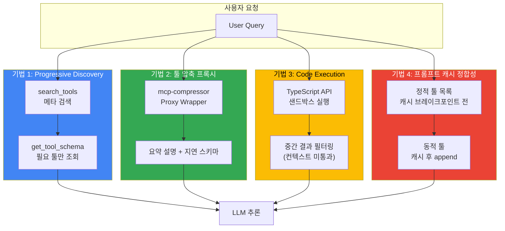

## 개요

Model Context Protocol(MCP) 서버는 연결 시 모든 툴 정의를 업프론트 로딩(upfront loading)합니다. 툴 1개당 JSON Schema가 300~1,000+ 토큰을 소비하며, 10개 서버 × 20개 툴 구성에서는 사용자 입력 전에 **100,000 토큰**이 컨텍스트 윈도우를 점유합니다. 이 문서는 토큰 오버헤드를 정량화하고, Progressive Discovery·툴 압축·Code Execution·프롬프트 캐시 정합성이라는 4가지 최적화 기법을 제시합니다.

:::info 문서 위치
- 본 문서: MCP 토큰 최적화 기법 (설계 관점)
- [Tiered Gateway Architecture](../../model-serving/inference-routing/tiered-gateway-architecture.md): Agent Data Plane 아키텍처 컨텍스트
- [AI Gateway Guardrails](../../operations-mlops/governance/ai-gateway-guardrails.md): MCP 서버 Tool Allow-list·보안 정책
:::

---

## 배경: 문제 정량화

### 업프론트 로딩 비용

MCP 서버는 `list_tools` 호출 시 모든 툴 메타데이터(이름, 설명, JSON Schema)를 반환합니다. 클라이언트는 이를 시스템 프롬프트에 포함하여 LLM에 전달하므로, **툴 개수가 많을수록 컨텍스트 윈도우 초기 점유율이 급증**합니다.

#### 실측 사례 (출처 명시)

- **StackOne 분석**: 10개 MCP 서버 × 20개 툴 × 평균 500토큰 = **100,000 토큰** 사용자 입력 전 선점 ([출처](https://www.stackone.com/blog/mcp-token-optimization/))
- **Atlassian 실측**: GitHub MCP 서버(94-tool) 무압축 시 **17,600 토큰** ([출처](https://www.atlassian.com/blog/developer/mcp-compression-preventing-tool-bloat-in-ai-agents))
- **Anthropic 사례**: 10,000행 스프레드시트를 코드 실행으로 5행만 노출 시 **150,000 → 2,000 토큰 (98.7% 절감)** ([출처](https://www.anthropic.com/engineering/code-execution-with-mcp))

### 복합 비용

토큰 오버헤드는 다음 세 가지 차원에서 비용을 증가시킵니다.

| 차원 | 영향 | 정량 예시 |
|------|------|----------|
| **입력 토큰 비용** | 매 요청마다 툴 정의 전송 | Claude Sonnet 4.5 기준 $3/M 토큰 → 100k 툴 정의 = $0.30/요청 |
| **컨텍스트 윈도우 소진** | 사용자 대화 길이 제약 | 200k 윈도우 중 100k 선점 → 실질 50% 가용 |
| **프롬프트 캐시 히트율 저하** | 툴 목록 변동 시 캐시 무효화 | 동적 툴 추가·제거마다 재전송 |

---

## 아키텍처: 4가지 최적화 기법



---

## 기법 1: Progressive Discovery

### 개념

툴 정의를 **필요 시점에 지연 로딩(lazy loading)** 합니다. 초기 연결 시에는 툴 이름과 한 줄 설명만 전달하고, LLM이 특정 툴을 선택하면 그때 상세 스키마를 조회합니다.

### 3단계 플로우

MCP 공식 client best practices는 다음 단계를 권장합니다.

1. **Catalog (검색)**: `search_tools(query="file operations")` → 툴 이름 목록 반환
2. **Inspect (스키마 조회)**: `get_tool_schema(tool_name="read_file")` → JSON Schema 반환
3. **Execute (호출)**: `invoke_tool(tool_name="read_file", args={...})` → 실제 실행

### 하이브리드 임계값

MCP 공식 문서는 **컨텍스트 윈도우의 1~5% 임계값**을 제시합니다. 툴 정의 토큰이 임계값을 초과하면 Progressive Discovery로 전환하는 하이브리드 접근이 실용적입니다.

```python
# pseudo-code: 임계값 기반 로딩 전략
def load_tools(mcp_servers: list, context_window: int):
    threshold = context_window * 0.05  # 5%
    total_tokens = 0
    loaded_tools = []

    for server in mcp_servers:
        tools = server.list_tools()
        for tool in tools:
            tool_tokens = estimate_tokens(tool.schema)
            if total_tokens + tool_tokens < threshold:
                loaded_tools.append(tool)  # 업프론트 로딩
                total_tokens += tool_tokens
            else:
                loaded_tools.append({
                    "name": tool.name,
                    "description": tool.description,
                    "schema": "lazy"  # 지연 로딩
                })
    return loaded_tools
```

### 트레이드오프

| 장점 | 단점 |
|------|------|
| 초기 컨텍스트에서 상세 스키마 제거 (절감 폭은 툴 세트 구성에 따라 상이) | 툴 호출마다 스키마 조회 왕복이 추가되어 지연 증가 |
| 컨텍스트 윈도우 가용 공간 확보 | LLM이 전체 툴 목록을 한눈에 파악 불가 |
| 프롬프트 캐시 안정성 향상 | 멀티스텝 추론 시 반복 조회 가능 |

---

## 기법 2: 툴 압축 프록시

### Atlassian mcp-compressor

Atlassian Labs는 기존 MCP 서버를 래핑하여 툴 설명을 압축하는 프록시를 오픈소스로 공개했습니다. 3가지 API를 제공합니다.

1. **list_tools**: 압축된 툴 목록 (이름 + 초간단 설명)
2. **get_tool_schema**: 특정 툴 상세 스키마
3. **invoke_tool**: 원본 서버로 호출 위임

### 압축 강도별 성능

Atlassian 실측 기준 GitHub MCP 서버(94-tool):

| 압축 강도 | 토큰 수 | 절감률 | 비고 |
|----------|--------|-------|------|
| 무압축 | 17,600 | 0% | 원본 |
| Low | 3,900 | 78% | 주요 파라미터 유지 |
| Medium | 3,300 | 81% | 선택적 파라미터 제거 |
| High | 2,200 | 87% | 필수 파라미터만 |
| Extreme | 500 | 97% | 이름 + 한 줄 설명 |

프록시 방식이므로 원본 MCP 서버와 에이전트 코드를 변경하지 않고 도입할 수 있으며, 압축 강도는 프록시 설정으로 조절합니다.

### 적합 시나리오

- **대규모 툴 세트**: 50개 이상 툴을 사용하는 에이전트
- **정적 툴 구성**: 툴 목록이 자주 변하지 않는 환경
- **토큰 비용 최적화 우선**: 지연보다 비용이 중요한 경우

---

## 기법 3: Code Execution / Programmatic Tool Calling

### 개념

툴을 JSON Schema가 아닌 **프로그래밍 API**(예: TypeScript 파일 트리)로 노출하고, LLM이 샌드박스에서 코드를 작성·실행하여 툴을 호출합니다. 중간 결과는 실행 환경 내에서 필터링되므로 **모델 컨텍스트를 통과하지 않습니다**.

### Anthropic 사례

Anthropic은 10,000행 스프레드시트 처리 시나리오에서 다음 결과를 공개했습니다.

- **기존 방식**: 전체 데이터를 컨텍스트로 전달 → **150,000 토큰**
- **Code Execution**: Python 코드로 필터링 → 최종 5행만 컨텍스트 전달 → **2,000 토큰 (98.7% 절감)**

([출처](https://www.anthropic.com/engineering/code-execution-with-mcp))

### Cloudflare Code Mode

Cloudflare는 MCP 서버를 Workers 샌드박스에서 실행하는 "Code Mode"를 도입했습니다. 툴 정의 대신 TypeScript API를 제공하고, LLM이 생성한 코드를 격리된 V8 런타임에서 실행합니다.

([출처](https://blog.cloudflare.com/code-mode-mcp/))

### 트레이드오프

| 장점 | 단점 |
|------|------|
| **최대 98.7% 토큰 절감** (Anthropic 실측) | 샌드박스 인프라 필요 (Cloudflare Workers, Lambda 등) |
| 중간 결과 필터링으로 대량 데이터 처리 가능 | 보안·리소스 격리 비용 |
| 툴 정의 토큰 → 코드 실행 토큰으로 전환 | LLM의 코드 생성 능력 의존 |

### 보안 고려사항

Code Execution은 임의 코드 실행을 허용하므로 **샌드박스 격리**가 필수입니다. [AI Gateway Guardrails](../../operations-mlops/governance/ai-gateway-guardrails.md) 문서의 Tool Allow-list·Scoped Token 섹션을 참조하여 실행 가능한 API 범위를 제한해야 합니다.

---

## 기법 4: 프롬프트 캐시 정합성

### 문제

MCP 서버가 동적 툴을 추가·제거하면 `tools` 배열이 변경되어 **프롬프트 캐시가 무효화**됩니다. 매 요청마다 전체 툴 정의를 재전송하게 되어 캐시 혜택을 받지 못합니다.

### 배치 전략

**정적 툴 목록**을 캐시 브레이크포인트 이전에 고정하고, **동적 툴**은 캐시 후 append합니다.

```python
# pseudo-code: 캐시 친화적 툴 배치
system_prompt = f"""
당신은 고객 지원 에이전트입니다.

# 정적 툴 (캐시 가능)
{json.dumps(static_tools)}

<cache_breakpoint />

# 동적 툴 (세션별 변동)
{json.dumps(dynamic_tools)}

사용자 요청: {user_query}
"""
```

### 정적 vs 동적 분류 기준

| 툴 유형 | 예시 | 배치 위치 |
|---------|------|----------|
| **정적** | `search_kb`, `create_ticket`, `get_weather` | 캐시 브레이크포인트 **전** |
| **동적** | 사용자별 커스텀 액션, 세션 임시 툴 | 캐시 브레이크포인트 **후** |

### 효과

Anthropic Prompt Caching은 캐시 히트 시 입력 토큰 비용을 **90% 절감** (일반 $3/M → 캐시 $0.30/M)합니다. 정적 툴 100k 토큰을 캐시하면 요청당 **$0.27 절약**입니다.

---

## Deep Dive: 게이트웨이 레벨 통합

### Agent Data Plane과의 관계

[Tiered Gateway Architecture](../../model-serving/inference-routing/tiered-gateway-architecture.md) 문서는 Agent Data Plane을 **직교하는 축**으로 정의합니다. MCP/A2A 프로토콜과 stateful 세션을 다루는 agentgateway는 Tier 1~2의 HTTP 라우팅과 분리되어 동작합니다.

토큰 최적화는 다음 계층에서 적용됩니다.

| 계층 | 최적화 책임 | 구현 방법 |
|------|------------|----------|
| **Agent Data Plane (agentgateway)** | MCP 서버 검색·스키마 조회 (Progressive Discovery) | `search_tools` / `get_tool_schema` API 제공 |
| **Tier 2 ② LLM API Gateway (Bifrost/LiteLLM)** | 프롬프트 캐시 정합성, 툴 압축 프록시 통합 | 정적/동적 툴 분리 배치, mcp-compressor 래핑 |
| **Client SDK** | Code Execution 샌드박스 호출 | TypeScript/Python API 노출, 실행 결과 필터링 |

### 거버넌스 통합

Tool Allow-list·MCP 서버 Fingerprint·Scoped Token 정책은 [AI Gateway Guardrails](../../operations-mlops/governance/ai-gateway-guardrails.md) 문서의 "§5.2 Tool Allow-list + Scoped Token" 섹션을 참조합니다. 토큰 최적화는 **효율**을 다루고, Guardrails는 **보안**을 다룹니다. 두 관점은 독립적이며 동시에 적용되어야 합니다.

---

## 결론

MCP 기반 에이전트의 토큰 오버헤드는 **4가지 기법으로 70-98% 절감** 가능합니다. Progressive Discovery는 초기 구현 비용이 낮고, 툴 압축 프록시는 기존 MCP 서버를 그대로 활용할 수 있으며, Code Execution은 최대 절감률을 제공하지만 샌드박스 인프라가 필요합니다. 프롬프트 캐시 정합성은 모든 기법과 직교하여 추가 혜택을 제공합니다. 실전 적용 시에는 툴 개수·동적 변경 빈도·비용 민감도에 따라 **기법을 조합**하여 사용합니다.

---

## 참고 자료

### 공식 문서

- [MCP Client Best Practices](https://modelcontextprotocol.io/docs/develop/clients/client-best-practices) — Progressive Discovery, 1-5% 임계값, Catalog→Inspect→Execute 플로우
- [Anthropic Engineering: Code Execution with MCP](https://www.anthropic.com/engineering/code-execution-with-mcp) — 98.7% 토큰 절감 사례, 샌드박스 아키텍처
- [Anthropic Engineering: Advanced Tool Use](https://www.anthropic.com/engineering/advanced-tool-use) — Tool-use 최적화 패턴

### 기술 블로그

- [StackOne: MCP Token Optimization](https://www.stackone.com/blog/mcp-token-optimization/) — 100,000 토큰 업프론트 로딩 문제 분석
- [Atlassian Labs: MCP Compression](https://www.atlassian.com/blog/developer/mcp-compression-preventing-tool-bloat-in-ai-agents) — mcp-compressor, 94-tool 서버 실측(17,600 → 500 토큰)
- [Cloudflare: Code Mode with MCP](https://blog.cloudflare.com/code-mode-mcp/) — Workers 샌드박스 기반 Code Execution

### 관련 문서 (내부)

- [Tiered Gateway Architecture](../../model-serving/inference-routing/tiered-gateway-architecture.md) — Agent Data Plane(agentgateway), MCP/A2A 프로토콜 계층
- [AI Gateway Guardrails](../../operations-mlops/governance/ai-gateway-guardrails.md) — Tool Allow-list, MCP 서버 Fingerprint, Scoped Token
- [AWS Native Agentic Platform](../platform-selection/aws-native-agentic-platform.md) — Bedrock AgentCore·Strands와의 MCP 통합 맥락
