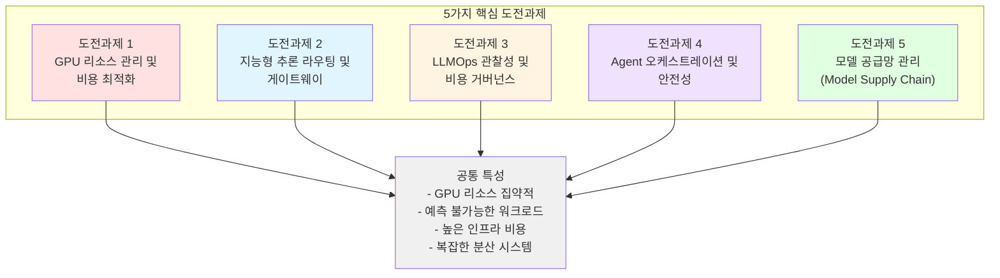
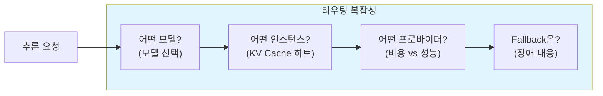
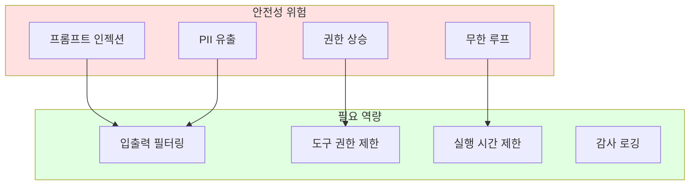
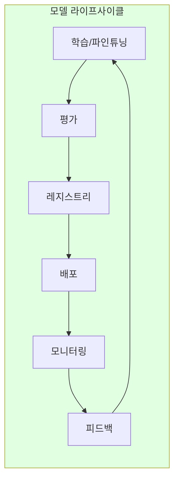

import { ChallengeSummary } from '@site/src/components/AgenticChallengesTables';

> 📅 **작성일**: 2025-02-05 | **수정일**: 2026-03-27 | ⏱️ **읽는 시간**: 약 7분

## 소개

Agentic AI 플랫폼을 구축하고 운영할 때, 플랫폼 엔지니어와 아키텍트는 기존 웹 애플리케이션과는 근본적으로 다른 기술적 도전에 직면합니다. 이 문서에서는 **5가지 핵심 도전과제**를 분석합니다.

:::info 선행 문서
이 문서를 읽기 전에 [플랫폼 아키텍처](./agentic-platform-architecture.md)에서 Agentic AI Platform의 전체 구조를 먼저 확인하세요.
:::

## 배경: 왜 단일 LLM만으로는 부족한가

Agentic AI 시대를 맞아 기업이 가장 먼저 직면하는 질문은 *"가장 크고 비싼 LLM 하나만 쓰면 되지 않나?"*입니다. 실제 기업 환경에서 단일 거대 LLM에 전적으로 의존하면 다음과 같은 실질적인 한계에 부딪힙니다.

### 기업 실무에서 경험하는 단일 LLM의 4가지 한계

| 한계 영역 | 기업이 겪는 문제 | 플랫폼 대응 |
|----------|---------------|-----------|
| **비용** | 70B+ 모델의 토큰 과금은 대량 트래픽 시 월 수천만 원에 달하며, 에이전트 내부의 도구 호출·포맷팅 등 단순 작업에도 동일 비용이 발생합니다. 실제 연구에 따르면 에이전트 LLM 호출의 **40~70%는 SLM으로 대체 가능**합니다. | **Bifrost 2-Tier 라우팅**으로 단순 호출은 자체 호스팅 SLM, 복잡한 추론만 LLM으로 분리 |
| **성능 · 지연** | 거대 모델은 응답 지연(TTFT)이 길어 실시간 상담(AICC)이나 대화형 에이전트에서 사용자 경험을 저하시킵니다. 도메인 특화 SLM은 동일 작업에서 **10배 이상 빠른 응답**이 가능합니다. | **3-Tier Orchestration** — Tier 1(SLM 직접)은 ~50ms, Tier 2(LLM)는 복잡한 추론에만 사용 |
| **정보 정확성** | LLM의 환각(hallucination)은 구조적 특성이며, 요금 계산·약관 검증 등 정확성이 요구되는 업무에서는 치명적입니다. 트랜스포머 아키텍처는 복잡한 산술과 논리 연산에 본질적 한계를 가집니다. | **Tool Delegation** — 산술은 규칙 엔진, 팩트 검증은 Knowledge Graph에 위임. LLM은 자연어 이해에만 집중 |
| **거버넌스 · 보안** | 민감 데이터(PII/PHI)가 외부 LLM API로 유출될 위험, 에이전트의 자율적 행동에 대한 감사 추적, 팀별 접근 제어와 예산 관리가 필요합니다. | **NeMo Guardrails** (입출력 필터링) + **LangGraph HITL** (인간 승인 게이트) + **Langfuse** (감사 추적) |

### 인프라 최적화: 초지능 연구 기업과 K8s 생태계의 방향

이러한 다중 모델 생태계를 효율적으로 운영하려면 **인프라 플랫폼화**가 필수입니다. 이는 단순히 비용 절감의 문제가 아니라, AI를 선도하는 기업들이 공통적으로 핵심 분야로 투자하는 영역입니다.

**Meta**는 초지능(ASI) 연구와 병행하여 자체 AI 인프라 최적화에 막대한 투자를 하고 있습니다. Grand Teton(GPU 서버 아키텍처), MTIA(자체 추론 칩), PyTorch 생태계의 추론 효율화(torch.compile, ExecuTorch)는 모두 **모델 성능만큼 인프라 효율이 중요**하다는 인식에서 비롯됩니다.

**CNCF Kubernetes** 생태계 역시 AI 워크로드를 위한 기능을 빠르게 확장하고 있습니다:

| K8s AI 기능 | 버전 | 역할 | 다중 모델 생태계에서의 의미 |
|------------|------|------|------------------------|
| **DRA** (Dynamic Resource Allocation) | 1.31 Beta | GPU를 MIG 단위로 세밀 분할·할당 | SLM은 MIG 파티션, LLM은 전체 GPU — 하나의 클러스터에서 공존 |
| **Gateway API + Inference Extension** | 2025 | LLM 추론 요청의 표준화된 라우팅 | KV Cache 상태 기반 지능형 라우팅, 모델별 트래픽 분배 |
| **Kueue** | GA | AI 워크로드 큐잉·스케줄링 | 학습/추론 작업의 공정한 GPU 자원 분배, 팀별 쿼터 |
| **LeaderWorkerSet** | 1.31 | 분산 추론·학습 워크로드 패턴 | 70B+ 모델의 Tensor Parallel 분산 추론을 K8s 네이티브로 관리 |
| **KAI Scheduler** | 2025 | GPU-aware Pod 스케줄링 | GPU 토폴로지(NVLink, NVSwitch)를 고려한 최적 배치 |

이처럼 Kubernetes는 단순한 컨테이너 오케스트레이터를 넘어 **AI 워크로드의 기반 인프라**로 진화하고 있으며, 다중 모델 생태계를 운영하기 위한 가장 성숙한 플랫폼입니다.

### 결론: 다중 모델 생태계와 인프라 플랫폼화

기업은 단일 LLM 의존에서 벗어나 **이질적 다중 모델(Heterogeneous Multi-model) 생태계**를 구축하되, 이를 뒷받침하는 **인프라 플랫폼**이 반드시 수반되어야 합니다.

```
전략 기획 · 복잡한 추론         반복 실무 · 도메인 특화
┌──────────────────┐         ┌──────────────────┐
│  LLM Orchestrator │   작업   │   SLM Expert Pool │
│  (Claude, GPT 등)  │──분배──→ │  (7B/14B + LoRA)  │
│  Tier 2 워크플로우  │         │  Tier 1 직접 호출  │
└──────────────────┘         └──────────────────┘
         │                            │
         └── 외부 도구 위임 ─────────────┘
             (산술, 검색, 지식 그래프)
                      │
         ┌────────────┴────────────┐
         │  Kubernetes 인프라 플랫폼  │
         │  DRA · Gateway API · Kueue │
         │  Karpenter · vLLM · Bifrost│
         └─────────────────────────┘
```

이 생태계를 **Kubernetes 네이티브 환경에서 효율적으로 운영**하기 위해 플랫폼이 해결해야 할 5가지 핵심 도전과제를 아래에서 분석합니다.

---

## Agentic AI 플랫폼의 5가지 핵심 도전과제

Frontier Model(최신 대규모 언어 모델)을 활용한 Agentic AI 시스템은 기존 웹 애플리케이션과는 **근본적으로 다른 인프라 요구사항**을 가집니다.



### 도전과제 요약

<ChallengeSummary />

:::warning 기존 인프라 접근 방식의 한계
전통적인 VM 기반 인프라나 수동 관리 방식으로는 Agentic AI의 **동적이고 예측 불가능한 워크로드 패턴**에 효과적으로 대응할 수 없습니다. GPU 리소스의 높은 비용과 복잡한 분산 시스템 요구사항은 **자동화된 인프라 관리**를 필수로 만듭니다.
:::

---

## 도전과제 1: GPU 리소스 관리 및 비용 최적화

GPU는 Agentic AI 플랫폼에서 **가장 비용이 높은 리소스**입니다. 모델 크기와 워크로드 특성에 따라 적절한 GPU 할당 전략이 필요합니다.

**왜 어려운가:**

- **높은 비용**: GPU 인스턴스는 CPU 대비 10~100배 비싼 비용 (H100 8장 기준 시간당 ~$98)
- **다양한 모델 크기**: 3B 파라미터 모델부터 70B+ 모델까지 요구하는 GPU 메모리가 극단적으로 다름
- **동적 워크로드**: 추론 트래픽이 시간대에 따라 10배 이상 변동
- **유휴 낭비**: GPU 프로비저닝 후 활용률이 낮으면 막대한 비용 낭비
- **멀티 테넌트**: 여러 모델과 팀이 제한된 GPU를 공유해야 함

| 모델 크기 | GPU 요구사항 | 비용 압박 |
|-----------|-------------|----------|
| 70B+ 파라미터 | Full GPU (H100/A100) 8장 | 시간당 $30~$98 |
| 7B~30B 파라미터 | GPU 1~2장 또는 MIG 파티션 | 시간당 $1~$10 |
| 3B 이하 파라미터 | Time-Slicing 또는 공유 GPU | 시간당 $0.5~$2 |

---

## 도전과제 2: 지능형 추론 라우팅 및 게이트웨이

Agentic AI 워크로드는 **다양한 모델과 프로바이더**를 동시에 활용합니다. 단순한 로드밸런싱이 아닌, 모델 특성을 이해하는 지능형 라우팅이 필요합니다.

**왜 어려운가:**

- **멀티 모델 운영**: 하나의 플랫폼에서 Llama, Qwen, Claude, GPT 등 다양한 모델을 동시 운영
- **KV Cache 효율성**: LLM의 KV Cache 상태를 고려하지 않은 라우팅은 성능을 크게 저하시킴
- **비용-성능 트레이드오프**: 작업 복잡도에 따라 저비용 모델과 고성능 모델을 동적으로 선택해야 함
- **프로바이더 다변화**: Self-hosted 모델과 외부 API (Bedrock, OpenAI) 를 통합 관리해야 함
- **Canary/A-B 배포**: 새 모델 버전을 안전하게 트래픽 전환해야 함



---

## 도전과제 3: LLMOps 관찰성 및 비용 거버넌스

LLM 기반 시스템은 기존 애플리케이션과 **근본적으로 다른 관찰성 요구사항**을 가집니다. 토큰 단위 비용 추적, Agent 워크플로우 디버깅, 프롬프트 품질 모니터링이 필요합니다.

**왜 어려운가:**

- **비결정적 출력**: 동일 입력에도 다른 출력이 나오므로 전통적 테스트/모니터링이 불충분
- **토큰 비용 추적**: 인프라 비용(GPU)과 애플리케이션 비용(토큰)을 이중으로 추적해야 함
- **멀티스텝 디버깅**: Agent가 여러 도구를 호출하는 복잡한 체인에서 병목 지점 파악이 어려움
- **프롬프트 품질**: 프로덕션에서 프롬프트 성능이 저하되는 것을 실시간으로 감지해야 함
- **팀별 예산**: 여러 팀이 공유하는 AI 인프라에서 팀별 비용 할당과 한도 관리가 필요

| 관찰성 영역 | 기존 애플리케이션 | LLM 애플리케이션 |
|------------|----------------|----------------|
| 비용 추적 | 인프라 비용만 | 인프라 + 토큰 비용 이중 추적 |
| 디버깅 | 요청-응답 로그 | 멀티스텝 Agent Trace |
| 품질 모니터링 | 에러율, 지연 시간 | Faithfulness, Relevance, Hallucination |
| 예산 관리 | 리소스 기반 | 모델별/팀별 토큰 예산 |

---

## 도전과제 4: Agent 오케스트레이션 및 안전성

Agentic AI 시스템에서 Agent는 **자율적으로 도구를 호출하고 외부 시스템과 상호작용**합니다. 이러한 자율성은 안전성과 통제 가능성 측면에서 새로운 도전과제를 만듭니다.

**왜 어려운가:**

- **자율적 행동**: Agent가 스스로 판단하여 도구를 호출하므로 예상치 못한 행동 가능
- **프롬프트 인젝션**: 악의적 입력으로 Agent가 의도하지 않은 작업을 수행할 위험
- **도구 연결 표준화**: 다양한 외부 시스템(DB, API, 파일)을 Agent에 안전하게 연결하는 표준 필요
- **멀티 Agent 통신**: 여러 Agent가 협업할 때 안전하고 효율적인 통신 프로토콜 필요
- **상태 관리**: 장기 실행 Agent의 상태 저장, 복구, 체크포인팅이 필요
- **스케일링**: Agent 워크로드는 CPU 기반이지만 트래픽 패턴이 불규칙하여 효율적 스케일링이 어려움



---

## 도전과제 5: 모델 공급망 관리 (Model Supply Chain)

단순히 모델을 배포하는 것이 아니라, **전체 모델 라이프사이클**(학습 → 평가 → 레지스트리 → 배포 → 피드백)을 체계적으로 관리해야 합니다.

**왜 어려운가:**

- **모델 버전 관리**: 파운데이션 모델, 파인튜닝 모델, 어댑터(LoRA) 등 다양한 아티팩트 관리
- **분산 학습 인프라**: 대규모 모델 파인튜닝에는 멀티 노드 GPU 클러스터와 고속 네트워크(EFA) 필요
- **평가 파이프라인**: 모델 품질을 자동으로 평가하고 배포 게이트를 설정해야 함
- **안전한 배포**: Canary/Blue-Green 배포로 모델 업데이트 시 서비스 영향 최소화
- **하이브리드 환경**: 온프레미스 GPU와 클라우드 GPU 간 모델 전송 및 동기화
- **RAG 데이터 파이프라인**: 문서 처리, 임베딩 생성, 벡터 저장의 지속적 업데이트 파이프라인 필요
- **피드백 루프**: 프로덕션 추적 데이터를 재학습에 반영하는 지속적 개선 체계



---

## 다음 단계: 도전과제 해결 접근

이 5가지 도전과제를 해결하기 위한 두 가지 접근 방식을 제시합니다:

1. **[AWS Native 플랫폼](./aws-native-agentic-platform.md)**: AWS 매니지드 서비스(Bedrock, AgentCore)를 활용하여 인프라 운영 부담을 최소화하고 Agent 개발에 집중하는 접근
2. **[EKS 기반 오픈 아키텍처](./agentic-ai-solutions-eks.md)**: Amazon EKS와 오픈소스 생태계를 활용하여 세밀한 제어와 비용 최적화를 달성하는 접근

두 접근은 **상호 보완적**이며, 워크로드 특성에 따라 조합하여 사용할 수 있습니다.

| 기준 | AWS Native | EKS 기반 오픈 아키텍처 |
|------|-----------|----------------------|
| GPU 관리 | 불필요 (서버리스) | Karpenter 자동 프로비저닝 |
| 모델 선택 | Bedrock 지원 모델 | 모든 Open Weight 모델 |
| 운영 부담 | 최소 | 중간 (Auto Mode로 절감) |
| 비용 최적화 | 사용량 기반 과금 | Spot, Consolidation 등 세밀 제어 |
| 커스터마이징 | 제한적 | 완전한 유연성 |

:::tip 어떤 접근을 선택할까?
- **빠르게 시작하고 Agent 로직에 집중**: AWS Native 플랫폼
- **Open Weight 모델 + 하이브리드 + 비용 최적화**: EKS 기반 오픈 아키텍처
- **현실적 최적해**: 두 접근의 조합 (AWS Native로 시작, 필요 시 EKS로 확장)
:::
