import Tabs from '@theme/Tabs';
import TabItem from '@theme/TabItem';
import {
  EksKarpenterLayers,
  ClusterAutoscalerVsKarpenter,
  KarpenterKeyFeatures,
  EksAutoModeVsStandard,
  KarpenterGpuOptimization,
  SpotInstancePricingInference,
  SavingsPlansPricingTraining,
  SmallScaleCostCalculation,
  MediumScaleCostCalculation,
  LargeScaleCostCalculation,
  CostOptimizationStrategies,
  TroubleshootingGuide,
  SecurityLayers,
  CostOptimizationDetails,
  TrainingCostOptimization,
  DeploymentTimeComparison,
  EksIntegrationBenefits,
  EksCapabilities,
  AckControllers,
  AutomationComponents,
  EksAutoModeBenefits,
  ChallengeSolutionsSummary,
  EksClusterConfiguration
} from '@site/src/components/AgenticSolutionsTables';

> 📅 **작성일**: 2025-02-05 | **수정일**: 2026-03-18 | ⏱️ **읽는 시간**: 약 21분

:::info 선행 문서
이 문서를 읽기 전에 다음 문서를 먼저 참조하세요:
- [기술적 도전과제](./agentic-ai-challenges.md) — 5가지 핵심 도전과제와 Kubernetes 기반 오픈소스 생태계
- [AWS Native 플랫폼](./aws-native-agentic-platform.md) — 매니지드 서비스 기반 대안 접근 (비교 참고)
:::

## 개요

Agentic AI 플랫폼의 5가지 핵심 도전과제(GPU 리소스 관리, 추론 라우팅, LLMOps 관찰성, Agent 오케스트레이션, 모델 공급망)는 **Amazon EKS와 AWS 관리형 서비스의 통합**을 통해 효과적으로 해결할 수 있습니다.

이 문서에서는 **EKS Auto Mode + Karpenter 중심의 구체적인 해결 방안**과 AWS 인프라와의 통합 아키텍처를 다룹니다.

---

## EKS 클러스터 구성 옵션: 컨트롤 플레인과 데이터 플레인

EKS 클러스터 구성은 **두 개의 독립된 레이어**로 나뉩니다. 각 레이어에서 워크로드 규모와 운영 요구사항에 맞는 옵션을 선택하고, 이를 조합하여 최적의 클러스터를 구성합니다.

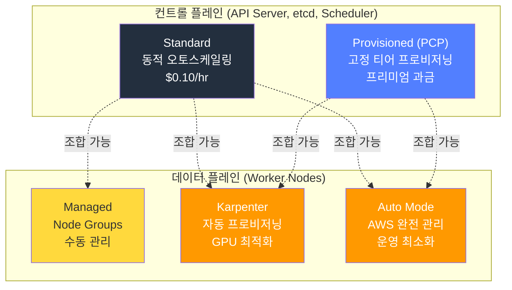

### Provisioned Control Plane (PCP)

2025년 11월에 발표된 **Provisioned Control Plane (PCP)**은 컨트롤 플레인 용량을 사전에 고정 티어로 프로비저닝하여, API 서버 성능의 일관성을 보장하는 프리미엄 옵션입니다.

**전제 조건:**
- AWS CLI v2, EKS IAM Role + Service-linked Role + CloudFormation 권한
- VPC: 최소 2개 AZ에 걸친 서브넷
- Kubernetes: EKS 지원 버전 (1.29~1.33)
- 리전: 모든 EKS 상용 리전에서 사용 가능

```yaml
# PCP 클러스터 생성 예시
apiVersion: eks.amazonaws.com/v1
kind: Cluster
spec:
  controlPlaneScalingConfig:
    tier: tier-xl  # tier-xl / tier-2xl / tier-4xl / tier-8xl / tier-ultra
```

:::info PCP vs Auto Mode — 서로 다른 레이어
**PCP**는 컨트롤 플레인 용량 옵션이고, **Auto Mode**는 데이터 플레인 관리 옵션입니다. 두 기능은 서로 다른 레이어에서 독립적으로 작동하며, **조합하여 사용할 수 있습니다**. 예를 들어, 대규모 AI 플랫폼에서는 PCP로 API 서버 성능을 보장하면서 Auto Mode로 노드 운영을 자동화하는 구성이 가능합니다.
:::

### 컨트롤 플레인 × 데이터 플레인 비교 및 조합

<EksClusterConfiguration />

:::tip AI 플랫폼 규모별 권장 구성
- **소규모 (PoC/데모)**: Standard + Auto Mode — 최소 운영 부담
- **중규모 (프로덕션 추론)**: Standard + Karpenter — GPU 비용 최적화
- **대규모 (엔터프라이즈 AI)**: PCP (tier-xl) + Auto Mode — 성능 보장 + 자동화
- **초대규모 (학습 클러스터)**: PCP (tier-4xl+) + Karpenter — API 성능 + GPU 세밀 제어
:::

---

## Amazon EKS와 Karpenter: Kubernetes의 장점 극대화

Kubernetes가 AI 플랫폼의 기반이라면, **Amazon EKS와 Karpenter의 조합**은 Kubernetes의 장점을 극대화하여 **완전 자동화된 최적의 인프라**를 구현합니다.

### EKS + Karpenter + AWS 인프라 통합 아키텍처

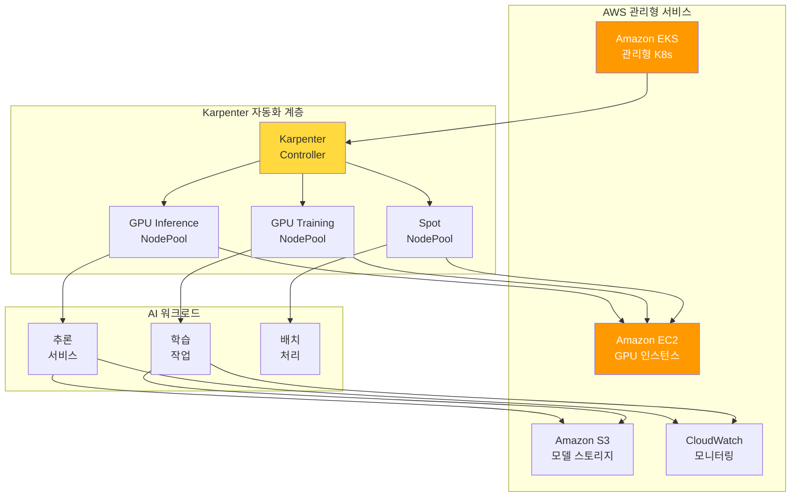

### 왜 EKS + Karpenter인가?

<EksKarpenterLayers />
### Karpenter: AI 인프라 자동화의 핵심

Karpenter는 기존 Cluster Autoscaler의 한계를 극복하고, **AI 워크로드에 최적화된 노드 프로비저닝**을 제공합니다.

:::info Karpenter v1.0+ GA
Karpenter는 **v1.0 이상에서 GA(Generally Available) 상태**로, 프로덕션 환경에서 안정적으로 사용할 수 있습니다. v1 API는 이전 버전과 호환되지 않으므로, 새로운 배포 시 **v1 API를 사용**하는 것을 권장합니다.

**주요 변경사항:**
- API 버전: `karpenter.sh/v1beta1` → `karpenter.sh/v1`
- NodePool과 EC2NodeClass가 안정화된 API로 제공
- 향후 버전 간 호환성 보장
:::

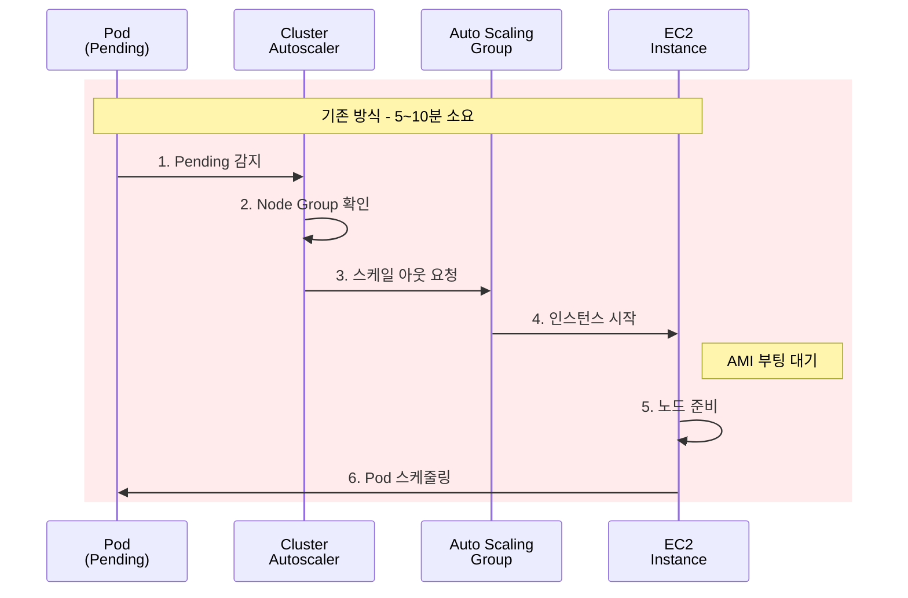

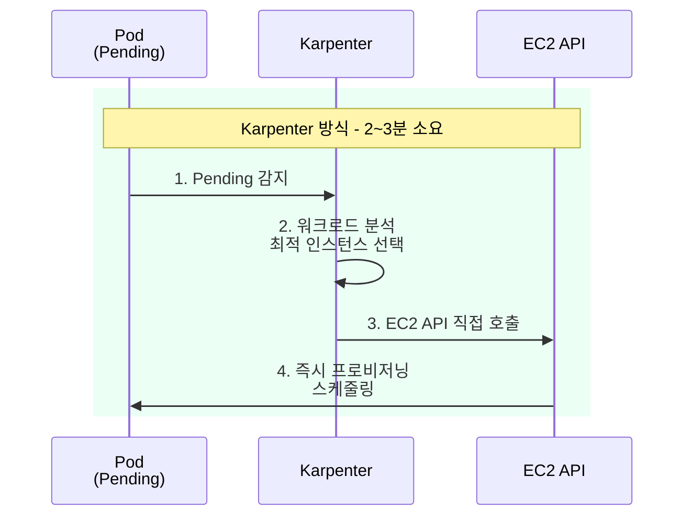

<ClusterAutoscalerVsKarpenter />
### Karpenter가 제공하는 핵심 가치

<KarpenterKeyFeatures />
### EKS Auto Mode: 완전 자동화의 완성

**EKS Auto Mode**는 Karpenter를 포함한 핵심 컴포넌트들을 자동으로 구성하고 관리하여, AI 인프라 자동화의 마지막 퍼즐을 완성합니다.

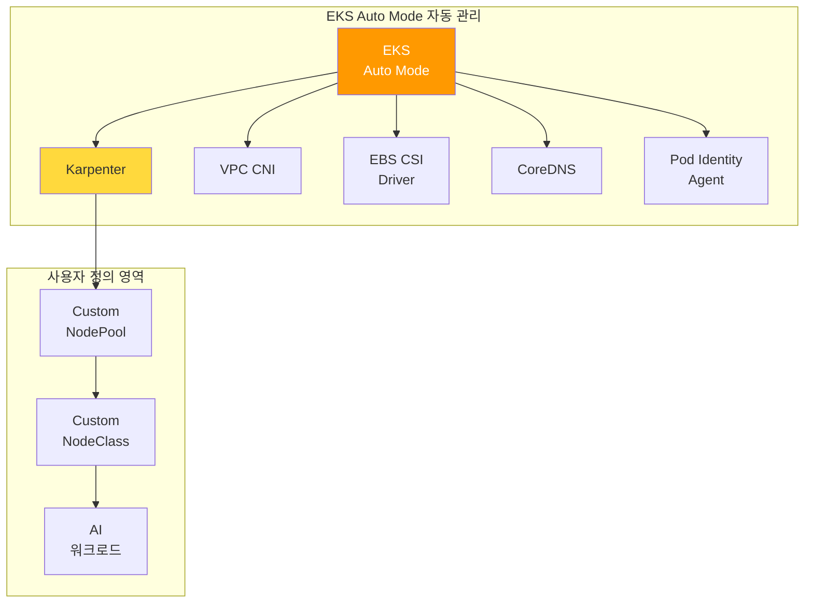

#### EKS Auto Mode vs 수동 구성 비교

<EksAutoModeVsStandard />
#### EKS Auto Mode의 AI 워크로드 이점

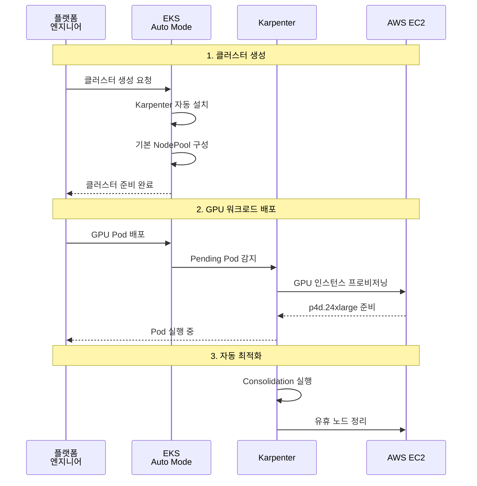

#### GPU 워크로드를 위한 EKS Auto Mode 설정

EKS Auto Mode에서 GPU 워크로드를 위한 커스텀 NodePool을 추가할 수 있습니다.

```yaml
# EKS Auto Mode에서 GPU NodePool 추가
apiVersion: karpenter.sh/v1
kind: NodePool
metadata:
  name: gpu-inference-pool
spec:
  template:
    metadata:
      labels:
        node-type: gpu-inference
        eks-auto-mode: "true"
    spec:
      requirements:
        - key: karpenter.sh/capacity-type
          operator: In
          values: ["spot", "on-demand"]
        - key: node.kubernetes.io/instance-type
          operator: In
          values:
            - g5.xlarge
            - g5.2xlarge
            - g5.4xlarge
            - g5.12xlarge
            - p4d.24xlarge
        - key: karpenter.k8s.aws/instance-gpu-count
          operator: Gt
          values: ["0"]
      nodeClassRef:
        group: karpenter.k8s.aws
        kind: EC2NodeClass
        name: default  # EKS Auto Mode 기본 NodeClass 활용
  limits:
    nvidia.com/gpu: 50
  disruption:
    consolidationPolicy: WhenEmptyOrUnderutilized
    consolidateAfter: 30s
```

:::tip EKS Auto Mode 권장 사항
EKS Auto Mode는 **새로운 AI 플랫폼 구축 시 권장되는 옵션**입니다.

- Karpenter 설치 및 구성 자동화로 **초기 구축 시간 80% 단축**
- 핵심 컴포넌트 자동 업그레이드로 **운영 부담 대폭 감소**
- GPU NodePool만 커스텀 정의하면 **즉시 AI 워크로드 배포 가능**
:::

:::info EKS Auto Mode와 GPU 지원
EKS Auto Mode는 NVIDIA GPU를 포함한 가속 컴퓨팅 인스턴스를 완벽히 지원합니다. 기본 NodeClass에 GPU 드라이버가 포함된 AMI가 자동으로 선택되며, 필요시 커스텀 NodeClass로 EFA 네트워크 등 고급 설정을 추가할 수 있습니다.

**re:Invent 2024/2025 신규 기능:**
- **EKS Hybrid Nodes (GA)**: 온프레미스 GPU 인프라를 EKS 클러스터에 통합하여 하이브리드 AI 워크로드 지원
- **Enhanced Pod Identity v2**: 크로스 계정 IAM 역할 지원으로 멀티 계정 환경에서 안전한 AWS 서비스 접근, 세션 태그 및 조건부 정책 지원 강화
- **Native Inferentia/Trainium Support**: EKS Auto Mode에서 AWS Inferentia2 및 Trainium 칩 네이티브 지원, Neuron SDK 자동 구성
- **CloudWatch GPU Metrics**: GPU 사용률, 메모리, 온도 등 GPU 메트릭 자동 수집 및 CloudWatch 통합, DCGM 메트릭 네이티브 지원
- **Provisioned Control Plane**: 대규모 AI 학습 워크로드를 위한 사전 프로비저닝된 컨트롤 플레인 용량 (XL, 2XL, 4XL 티어)
- **Container Network Observability**: Pod 간 통신 패턴 및 네트워크 성능 모니터링, VPC Flow Logs 통합
- **CloudWatch Control Plane Metrics**: 컨트롤 플레인 헬스 선제적 모니터링, API 서버 응답 시간 및 etcd 성능 메트릭
:::

:::warning EKS Auto Mode GPU 제한사항
EKS Auto Mode는 기본 GPU 지원을 제공하지만, 다음 구성은 **수동 설정이 필요**합니다:

**자동 구성되지 않는 항목:**
- **NVIDIA Device Plugin**: GPU 리소스 스케줄링을 위한 디바이스 플러그인 수동 설치 필요
- **DCGM Exporter**: GPU 메트릭 수집을 위한 DCGM Exporter 별도 배포 필요
- **GPU 최적화 AMI**: 특정 GPU 드라이버 버전이나 CUDA 버전이 필요한 경우 커스텀 AMI 구성 필요
- **MIG (Multi-Instance GPU)**: GPU 파티셔닝을 위한 MIG 모드 수동 활성화 필요
- **EFA (Elastic Fabric Adapter)**: 분산 학습을 위한 고속 네트워크 인터페이스 수동 구성 필요

**권장 접근 방식:**
1. EKS Auto Mode로 클러스터 생성
2. NVIDIA GPU Operator를 통해 GPU 스택 자동 설치
3. 커스텀 NodeClass로 고급 GPU 설정 추가

```yaml
# NVIDIA GPU Operator 설치로 GPU 스택 자동화
helm install gpu-operator nvidia/gpu-operator \
  --namespace gpu-operator \
  --create-namespace \
  --set driver.enabled=true \
  --set toolkit.enabled=true \
  --set devicePlugin.enabled=true \
  --set dcgmExporter.enabled=true \
  --set migManager.enabled=true
```
:::

### Karpenter vs Cluster Autoscaler 상세 비교

:::tip Karpenter vs Cluster Autoscaler
Karpenter는 Node Group 없이 워크로드 요구사항을 직접 분석하여 최적의 인스턴스를 선택합니다. GPU 워크로드의 경우 프로비저닝 시간이 **50% 이상 단축**되고, Consolidation을 통해 **비용이 20-30% 절감**됩니다.
:::

### 도전과제별 Karpenter 해결 방안 매핑

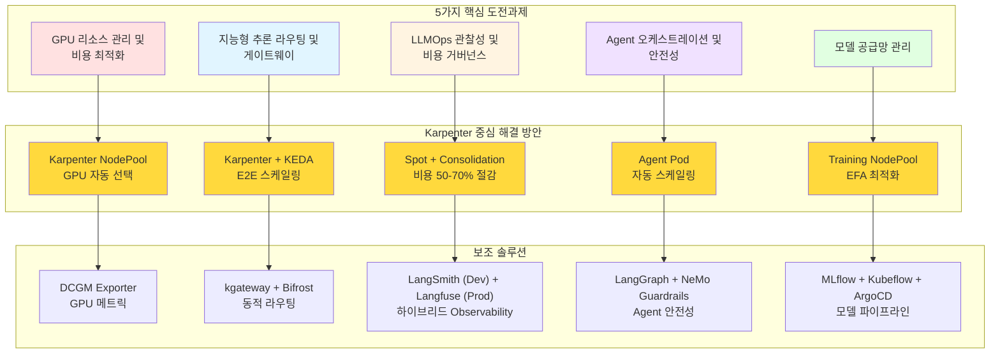

:::info 대상 독자
이 문서는 Agentic AI Platform 도입을 검토하는 **기술 의사결정자**와 **솔루션 아키텍트**를 대상으로 합니다. Kubernetes 기반 AI 인프라의 필요성과 EKS + Karpenter를 활용한 구체적인 구현 방안을 제공합니다.
:::

---

## 도전과제 1: GPU 리소스 관리 및 비용 최적화

### Karpenter 기반 해결 방안

**Karpenter NodePool**을 활용하면 GPU 워크로드에 최적화된 노드를 자동으로 프로비저닝하고 관리할 수 있습니다.

<Tabs>
<TabItem value="nodepool" label="GPU NodePool 설정" default>

```yaml
apiVersion: karpenter.sh/v1
kind: NodePool
metadata:
  name: gpu-inference-pool
spec:
  template:
    metadata:
      labels:
        node-type: gpu-inference
        workload: genai
    spec:
      requirements:
        - key: kubernetes.io/arch
          operator: In
          values: ["amd64"]
        - key: karpenter.sh/capacity-type
          operator: In
          values: ["on-demand", "spot"]
        - key: node.kubernetes.io/instance-type
          operator: In
          values:
            - p4d.24xlarge    # 8x A100 40GB
            - p5.48xlarge     # 8x H100 80GB
            - g5.48xlarge     # 8x A10G 24GB
        - key: karpenter.k8s.aws/instance-gpu-count
          operator: Gt
          values: ["0"]
      nodeClassRef:
        group: karpenter.k8s.aws
        kind: EC2NodeClass
        name: gpu-nodeclass
      taints:
        - key: nvidia.com/gpu
          value: "true"
          effect: NoSchedule
  limits:
    nvidia.com/gpu: 100
  disruption:
    consolidationPolicy: WhenEmptyOrUnderutilized
    consolidateAfter: 30s
  weight: 100
```

</TabItem>
<TabItem value="nodeclass" label="EC2NodeClass 설정">

```yaml
apiVersion: karpenter.k8s.aws/v1
kind: EC2NodeClass
metadata:
  name: gpu-nodeclass
spec:
  role: KarpenterNodeRole-${CLUSTER_NAME}
  amiSelectorTerms:
    - alias: al2023@latest
  subnetSelectorTerms:
    - tags:
        karpenter.sh/discovery: ${CLUSTER_NAME}
  securityGroupSelectorTerms:
    - tags:
        karpenter.sh/discovery: ${CLUSTER_NAME}
  blockDeviceMappings:
    - deviceName: /dev/xvda
      ebs:
        volumeSize: 500Gi
        volumeType: gp3
        iops: 10000
        throughput: 500
        encrypted: true
  instanceStorePolicy: RAID0
  userData: |
    #!/bin/bash
    nvidia-smi -pm 1
    modprobe efa
```

</TabItem>
</Tabs>

### Karpenter의 GPU 워크로드 최적화 기능

<KarpenterGpuOptimization />
### 보조 솔루션: NVIDIA GPU Operator

Karpenter와 함께 NVIDIA GPU Operator를 사용하여 GPU 드라이버 및 모니터링 스택을 자동화합니다.

```yaml
apiVersion: nvidia.com/v1
kind: ClusterPolicy
metadata:
  name: cluster-policy
spec:
  operator:
    defaultRuntime: containerd
  driver:
    enabled: true
    version: "550.127.05"  # Latest stable for H100/H200 (driver 550.90.07+ required for H100/H200)
  toolkit:
    enabled: true
  devicePlugin:
    enabled: true
  dcgmExporter:
    enabled: true
  migManager:
    enabled: true
```

---

## 도전과제 2: 지능형 추론 라우팅 및 게이트웨이

### Karpenter + KEDA 연동 해결 방안

Karpenter와 KEDA를 연동하면 **워크로드 스케일링과 노드 프로비저닝이 자동으로 연계**됩니다.

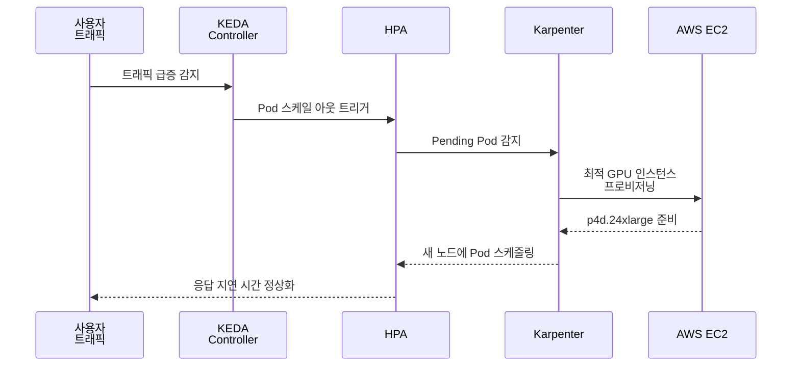

<Tabs>
<TabItem value="keda" label="KEDA ScaledObject" default>

```yaml
apiVersion: keda.sh/v1alpha1
kind: ScaledObject
metadata:
  name: vllm-gpu-scaler
  namespace: ai-inference
spec:
  scaleTargetRef:
    name: vllm-deployment
  minReplicaCount: 2
  maxReplicaCount: 20
  triggers:
    - type: prometheus
      metadata:
        serverAddress: http://prometheus.observability.svc:9090
        metricName: vllm_pending_requests
        threshold: "50"
        query: |
          sum(vllm_pending_requests{namespace="ai-inference"})
    - type: prometheus
      metadata:
        serverAddress: http://prometheus.observability.svc:9090
        metricName: gpu_utilization
        threshold: "70"
        query: |
          avg(DCGM_FI_DEV_GPU_UTIL{namespace="ai-inference"})
  advanced:
    horizontalPodAutoscalerConfig:
      behavior:
        scaleUp:
          stabilizationWindowSeconds: 0
          policies:
            - type: Percent
              value: 100
              periodSeconds: 15
        scaleDown:
          stabilizationWindowSeconds: 300
```

</TabItem>
<TabItem value="httproute" label="Gateway API HTTPRoute">

```yaml
apiVersion: gateway.networking.k8s.io/v1
kind: HTTPRoute
metadata:
  name: ai-model-routing
  namespace: ai-inference
spec:
  parentRefs:
    - name: ai-gateway
      namespace: ai-gateway
  rules:
    - matches:
        - path:
            type: PathPrefix
            value: /v1/chat/completions
          headers:
            - name: x-model-id
              value: "gpt-4"
      backendRefs:
        - name: vllm-gpt4
          port: 8000
          weight: 80
        - name: vllm-gpt4-canary
          port: 8000
          weight: 20
    - matches:
        - path:
            type: PathPrefix
            value: /v1/chat/completions
          headers:
            - name: x-model-id
              value: "claude-3"
      backendRefs:
        - name: vllm-claude
          port: 8000
```

</TabItem>
</Tabs>

:::info 모델 서빙 스택 구성
**vLLM vs Triton 역할 분리:**

- **vLLM**: LLM 추론 전용 (GPT, Claude, Llama 등)
  - PagedAttention 기반 KV Cache 최적화
  - llm-d가 KV Cache 상태를 고려한 지능형 라우팅 제공
- **Triton Inference Server**: 비-LLM 추론 담당
  - 임베딩 모델 (BGE-M3)
  - 리랭킹 모델
  - Whisper STT (음성-텍스트 변환)

이 구성으로 각 서빙 엔진이 최적화된 워크로드에만 집중하여 전체 플랫폼 효율성을 극대화합니다.
:::

### Karpenter Disruption 정책으로 안정성 확보

트래픽 급증 시에도 서비스 안정성을 보장하기 위한 Karpenter 설정입니다.

```yaml
apiVersion: karpenter.sh/v1
kind: NodePool
metadata:
  name: gpu-inference-stable
spec:
  disruption:
    consolidationPolicy: WhenEmptyOrUnderutilized
    consolidateAfter: 30s
    budgets:
      # 동시에 중단 가능한 노드 수 제한
      - nodes: "20%"
      # 업무 시간에는 중단 방지
      - nodes: "0"
        schedule: "0 9 * * 1-5"
        duration: 10h
```

:::warning 스케일링 주의사항
GPU 노드 프로비저닝은 일반 CPU 노드보다 시간이 오래 걸립니다. Karpenter의 `consolidationPolicy`를 적절히 설정하여 불필요한 스케일 다운을 방지하세요.
:::

---

## GPU 워크로드 비용 비교

실제 AWS 가격 기준으로 다양한 GPU 인스턴스 타입의 비용 효율성을 비교합니다.

### 추론 워크로드 비용 비교 (시간당)

<SpotInstancePricingInference />
### 학습 워크로드 비용 비교 (시간당)

<SavingsPlansPricingTraining />
### 월간 비용 시나리오 (24/7 운영 기준)

**시나리오 1: 소규모 추론 서비스 (g5.2xlarge x 2)**

<SmallScaleCostCalculation />
**시나리오 2: 중규모 추론 서비스 (g5.12xlarge x 4)**

<MediumScaleCostCalculation />
**시나리오 3: 대규모 학습 클러스터 (p4d.24xlarge x 8)**

<LargeScaleCostCalculation />
### 비용 최적화 전략별 효과

<CostOptimizationStrategies />
:::tip 비용 최적화 실전 팁

**추론 워크로드:**
1. Spot 인스턴스를 기본으로 사용 (70% 절감)
2. Karpenter Consolidation으로 유휴 노드 제거 (추가 20% 절감)
3. 시간대별 스케줄링으로 비업무 시간 리소스 축소 (추가 30% 절감)
4. **총 절감 효과: 약 85%**

**학습 워크로드:**
1. Savings Plans 1년 약정 (35% 절감)
2. 실험용 학습은 Spot 인스턴스 사용 (추가 40% 절감)
3. 체크포인트 기반 재시작으로 Spot 중단 대응
4. **총 절감 효과: 약 60%**
:::

---

## GPU 워크로드 트러블슈팅

GPU 워크로드 운영 시 자주 발생하는 문제와 해결 방법을 정리합니다.

### 문제 1: GPU가 Pod에 할당되지 않음

**증상:**
```bash
kubectl describe pod vllm-pod
# Events:
# Warning  FailedScheduling  pod has unbound immediate PersistentVolumeClaims
# Warning  FailedScheduling  0/5 nodes are available: 5 Insufficient nvidia.com/gpu
```

**원인:**
- NVIDIA Device Plugin이 설치되지 않음
- GPU 노드에 taint가 설정되어 있으나 Pod에 toleration이 없음
- GPU 리소스가 이미 모두 할당됨

**해결 방법:**

```bash
# 1. NVIDIA Device Plugin 확인
kubectl get daemonset -n kube-system nvidia-device-plugin-daemonset

# 2. GPU 노드 확인
kubectl get nodes -l node.kubernetes.io/instance-type=g5.xlarge
kubectl describe node <node-name> | grep nvidia.com/gpu

# 3. GPU Operator 설치 (없는 경우)
helm install gpu-operator nvidia/gpu-operator \
  --namespace gpu-operator \
  --create-namespace

# 4. Pod에 toleration 추가
tolerations:
  - key: nvidia.com/gpu
    operator: Exists
    effect: NoSchedule
```

### 문제 2: GPU 메모리 부족 (OOM)

**증상:**
```bash
# Pod 로그에서 확인
CUDA out of memory. Tried to allocate 2.00 GiB
```

**원인:**
- 모델 크기가 GPU 메모리보다 큼
- 배치 크기가 너무 큼
- 여러 프로세스가 동일 GPU 사용

**해결 방법:**

```yaml
# 1. 더 큰 GPU 인스턴스 사용
nodeSelector:
  node.kubernetes.io/instance-type: g5.12xlarge  # 4x A10G 96GB

# 2. vLLM 설정 최적화
env:
  - name: VLLM_GPU_MEMORY_UTILIZATION
    value: "0.9"  # GPU 메모리 90%만 사용
  - name: VLLM_MAX_NUM_SEQS
    value: "256"  # 동시 시퀀스 수 제한

# 3. MIG로 GPU 분할 사용
resources:
  limits:
    nvidia.com/mig-3g.40gb: 1  # A100 80GB를 3g.40gb 인스턴스로 분할
```

### 문제 3: Karpenter가 GPU 노드를 프로비저닝하지 않음

**증상:**
```bash
# Pod가 Pending 상태로 유지
kubectl get pods
# NAME        READY   STATUS    RESTARTS   AGE
# vllm-pod    0/1     Pending   0          5m
```

**원인:**
- NodePool에 GPU 인스턴스 타입이 정의되지 않음
- NodePool의 GPU 리소스 limit 초과
- IAM 권한 부족

**해결 방법:**

```bash
# 1. NodePool 확인
kubectl get nodepool gpu-inference-pool -o yaml

# 2. GPU 인스턴스 타입 추가
spec:
  template:
    spec:
      requirements:
        - key: karpenter.k8s.aws/instance-gpu-count
          operator: Gt
          values: ["0"]
        - key: node.kubernetes.io/instance-type
          operator: In
          values:
            - g5.xlarge
            - g5.2xlarge
            - g5.12xlarge

# 3. GPU limit 확인 및 증가
spec:
  limits:
    nvidia.com/gpu: 100  # 충분한 GPU 리소스 할당

# 4. Karpenter IAM 권한 확인
aws iam get-role --role-name KarpenterNodeRole-${CLUSTER_NAME}
```

### 문제 4: GPU 드라이버 버전 불일치

**증상:**
```bash
# Pod 로그에서 확인
Failed to initialize NVML: Driver/library version mismatch
```

**원인:**
- 노드의 NVIDIA 드라이버와 컨테이너의 CUDA 버전 불일치
- GPU Operator 업데이트 후 노드 재시작 필요

**해결 방법:**

```bash
# 1. 노드의 드라이버 버전 확인
kubectl debug node/<node-name> -it --image=ubuntu
nvidia-smi

# 2. GPU Operator 버전 확인
helm list -n gpu-operator

# 3. GPU Operator 업그레이드
helm upgrade gpu-operator nvidia/gpu-operator \
  --namespace gpu-operator \
  --set driver.version="550.127.05"

# 4. 노드 재시작 (드레인 후)
kubectl drain <node-name> --ignore-daemonsets --delete-emptydir-data
kubectl delete node <node-name>
# Karpenter가 자동으로 새 노드 프로비저닝
```

### 문제 5: EFA 네트워크가 활성화되지 않음

**증상:**
```bash
# 분산 학습 시 네트워크 성능 저하
# NCCL 로그에서 확인
NCCL WARN NET/Socket : No EFA device found
```

**원인:**
- EFA 드라이버가 로드되지 않음
- Security Group에서 EFA 트래픽 차단
- EFA 지원 인스턴스 타입이 아님

**해결 방법:**

```yaml
# 1. EFA 지원 인스턴스 사용
spec:
  requirements:
    - key: node.kubernetes.io/instance-type
      operator: In
      values:
        - p4d.24xlarge
        - p5.48xlarge

# 2. NodeClass에서 EFA 활성화
apiVersion: karpenter.k8s.aws/v1
kind: EC2NodeClass
metadata:
  name: gpu-training-nodeclass
spec:
  userData: |
    #!/bin/bash
    modprobe efa
    echo 'export FI_PROVIDER=efa' >> /etc/profile.d/efa.sh
    echo 'export FI_EFA_USE_DEVICE_RDMA=1' >> /etc/profile.d/efa.sh

# 3. Security Group 규칙 추가
securityGroupSelectorTerms:
  - tags:
      karpenter.sh/discovery: ${CLUSTER_NAME}
      efa-enabled: "true"
```

### 문제 6: Spot 인스턴스 중단으로 추론 서비스 중단

**증상:**
```bash
# Spot 중단 알림
Spot instance termination notice received
```

**원인:**
- Spot 인스턴스 용량 부족
- 단일 Spot 풀에만 의존

**해결 방법:**

```yaml
# 1. 다양한 인스턴스 타입 허용
spec:
  template:
    spec:
      requirements:
        - key: node.kubernetes.io/instance-type
          operator: In
          values:
            - g5.xlarge
            - g5.2xlarge
            - g5.4xlarge
            - g5.8xlarge  # 여러 타입으로 분산

# 2. Spot과 On-Demand 혼합
        - key: karpenter.sh/capacity-type
          operator: In
          values: ["spot", "on-demand"]

# 3. PodDisruptionBudget 설정
apiVersion: policy/v1
kind: PodDisruptionBudget
metadata:
  name: vllm-pdb
spec:
  minAvailable: 2
  selector:
    matchLabels:
      app: vllm

# 4. Graceful shutdown 구현
lifecycle:
  preStop:
    exec:
      command: ["/bin/sh", "-c", "sleep 120"]  # 2분 대기
```

### 트러블슈팅 체크리스트

<TroubleshootingGuide />
:::warning 프로덕션 운영 권장사항

1. **모니터링 필수**: Prometheus + Grafana로 GPU 메트릭 실시간 추적
2. **알림 설정**: GPU 사용률, 메모리, 온도 임계값 알림 구성
3. **로그 수집**: CloudWatch Logs로 모든 GPU Pod 로그 중앙 집중화
4. **정기 점검**: 주간 GPU 노드 헬스 체크 및 드라이버 업데이트 확인
5. **재해 복구**: 체크포인트 기반 학습 재시작 메커니즘 구현
:::

---

## GPU 워크로드 보안 강화

GPU 리소스는 고가이며 민감한 AI 모델을 처리하므로, 강력한 보안 정책이 필수적입니다.

### Pod Security Standards for GPU Pods

GPU Pod에 대한 보안 정책을 적용하여 권한 상승 및 호스트 접근을 제한합니다.

```yaml
# gpu-pod-security-policy.yaml
apiVersion: v1
kind: Namespace
metadata:
  name: ai-inference
  labels:
    pod-security.kubernetes.io/enforce: restricted
    pod-security.kubernetes.io/audit: restricted
    pod-security.kubernetes.io/warn: restricted

---
apiVersion: policy/v1
kind: PodDisruptionBudget
metadata:
  name: vllm-pdb
  namespace: ai-inference
spec:
  minAvailable: 1
  selector:
    matchLabels:
      app: vllm

---
apiVersion: v1
kind: ResourceQuota
metadata:
  name: gpu-quota
  namespace: ai-inference
spec:
  hard:
    requests.nvidia.com/gpu: "16"
    limits.nvidia.com/gpu: "16"
    requests.memory: "512Gi"
    requests.cpu: "128"
```

### Network Policies for Model Serving

모델 서빙 Pod 간 네트워크 트래픽을 제한하여 측면 이동(lateral movement)을 방지합니다.

```yaml
# network-policy-gpu-inference.yaml
apiVersion: networking.k8s.io/v1
kind: NetworkPolicy
metadata:
  name: vllm-network-policy
  namespace: ai-inference
spec:
  podSelector:
    matchLabels:
      app: vllm
  policyTypes:
    - Ingress
    - Egress
  ingress:
    # Gateway에서만 트래픽 허용
    - from:
        - namespaceSelector:
            matchLabels:
              name: ai-gateway
        - podSelector:
            matchLabels:
              app: kgateway
      ports:
        - protocol: TCP
          port: 8000
  egress:
    # S3 모델 다운로드 허용
    - to:
        - namespaceSelector: {}
      ports:
        - protocol: TCP
          port: 443
    # DNS 허용
    - to:
        - namespaceSelector:
            matchLabels:
              name: kube-system
        - podSelector:
            matchLabels:
              k8s-app: kube-dns
      ports:
        - protocol: UDP
          port: 53
```

### S3 Bucket Policies for Model Storage

모델 아티팩트 저장소에 대한 최소 권한 원칙을 적용합니다.

```json
{
  "Version": "2012-10-17",
  "Statement": [
    {
      "Sid": "AllowVLLMReadModels",
      "Effect": "Allow",
      "Principal": {
        "AWS": "arn:aws:iam::123456789012:role/vllm-pod-role"
      },
      "Action": [
        "s3:GetObject",
        "s3:ListBucket"
      ],
      "Resource": [
        "arn:aws:s3:::agentic-ai-models/*",
        "arn:aws:s3:::agentic-ai-models"
      ],
      "Condition": {
        "StringEquals": {
          "s3:ExistingObjectTag/Environment": "production"
        }
      }
    },
    {
      "Sid": "DenyUnencryptedObjectUploads",
      "Effect": "Deny",
      "Principal": "*",
      "Action": "s3:PutObject",
      "Resource": "arn:aws:s3:::agentic-ai-models/*",
      "Condition": {
        "StringNotEquals": {
          "s3:x-amz-server-side-encryption": "aws:kms"
        }
      }
    }
  ]
}
```

### IAM Roles for GPU Workloads (Pod Identity)

EKS Pod Identity를 사용하여 GPU Pod에 최소 권한 IAM 역할을 할당합니다.

```yaml
# vllm-pod-identity.yaml
apiVersion: v1
kind: ServiceAccount
metadata:
  name: vllm-sa
  namespace: ai-inference
  annotations:
    eks.amazonaws.com/role-arn: arn:aws:iam::123456789012:role/vllm-pod-role

---
apiVersion: apps/v1
kind: Deployment
metadata:
  name: vllm-deployment
  namespace: ai-inference
spec:
  template:
    spec:
      serviceAccountName: vllm-sa
      containers:
        - name: vllm
          image: vllm/vllm-openai:latest
          env:
            - name: AWS_REGION
              value: us-west-2
            - name: MODEL_PATH
              value: s3://agentic-ai-models/llama-3-70b/
```

**IAM Policy for vLLM Pod:**

```json
{
  "Version": "2012-10-17",
  "Statement": [
    {
      "Effect": "Allow",
      "Action": [
        "s3:GetObject",
        "s3:ListBucket"
      ],
      "Resource": [
        "arn:aws:s3:::agentic-ai-models/*",
        "arn:aws:s3:::agentic-ai-models"
      ]
    },
    {
      "Effect": "Allow",
      "Action": [
        "kms:Decrypt",
        "kms:DescribeKey"
      ],
      "Resource": "arn:aws:kms:us-west-2:123456789012:key/model-encryption-key"
    },
    {
      "Effect": "Allow",
      "Action": [
        "secretsmanager:GetSecretValue"
      ],
      "Resource": "arn:aws:secretsmanager:us-west-2:123456789012:secret:vllm-api-keys-*"
    }
  ]
}
```

### MIG for Multi-Tenant GPU Isolation

Multi-Instance GPU (MIG)를 사용하여 단일 GPU를 여러 테넌트 간 완전히 격리합니다.

```yaml
# mig-enabled-nodepool.yaml
apiVersion: karpenter.sh/v1
kind: NodePool
metadata:
  name: gpu-mig-pool
spec:
  template:
    metadata:
      labels:
        node-type: gpu-mig
        mig-enabled: "true"
    spec:
      requirements:
        - key: node.kubernetes.io/instance-type
          operator: In
          values:
            - p4d.24xlarge  # A100 80GB with MIG support
        - key: karpenter.k8s.aws/instance-gpu-count
          operator: Gt
          values: ["0"]
      nodeClassRef:
        group: karpenter.k8s.aws
        kind: EC2NodeClass
        name: gpu-mig-nodeclass
      taints:
        - key: nvidia.com/gpu
          value: "true"
          effect: NoSchedule

---
apiVersion: karpenter.k8s.aws/v1
kind: EC2NodeClass
metadata:
  name: gpu-mig-nodeclass
spec:
  role: KarpenterNodeRole-${CLUSTER_NAME}
  amiSelectorTerms:
    - alias: al2023@latest
  userData: |
    #!/bin/bash
    # MIG 모드 활성화
    nvidia-smi -mig 1
    
    # MIG 프로파일 생성 (3g.40gb 인스턴스 2개)
    nvidia-smi mig -cgi 9,9 -C
    
    # Device Plugin 재시작
    systemctl restart nvidia-device-plugin
```

**MIG 리소스를 사용하는 Pod:**

```yaml
apiVersion: v1
kind: Pod
metadata:
  name: tenant-a-inference
  namespace: tenant-a
spec:
  containers:
    - name: vllm
      image: vllm/vllm-openai:latest
      resources:
        limits:
          nvidia.com/mig-3g.40gb: 1  # MIG 인스턴스 요청
```

### Security Best Practices Summary

<SecurityLayers />
:::tip GPU 보안 체크리스트

1. **Pod Security Standards 적용**: 모든 GPU 네임스페이스에 `restricted` 정책 적용
2. **NetworkPolicy 구성**: GPU Pod 간 불필요한 통신 차단
3. **S3 암호화 강제**: 모델 저장 시 KMS 암호화 필수
4. **Pod Identity 사용**: IRSA 대신 EKS Pod Identity로 IAM 역할 할당
5. **MIG 활성화**: 멀티 테넌트 환경에서 GPU 완전 격리
6. **감사 로깅**: CloudTrail + GuardDuty로 GPU 리소스 접근 모니터링
:::

---

## 도전과제 3: LLMOps 관찰성 및 비용 거버넌스

### Karpenter 기반 비용 최적화 전략

Karpenter는 GPU 인프라 비용 최적화의 **핵심 레버**입니다. 다음 4가지 전략을 조합하여 최대 효과를 얻을 수 있습니다.

#### 전략 1: Spot 인스턴스 우선 활용

Karpenter의 Spot 인스턴스 지원을 활용하면 GPU 비용을 **최대 90%까지 절감**할 수 있습니다.

```yaml
apiVersion: karpenter.sh/v1
kind: NodePool
metadata:
  name: gpu-spot-inference
spec:
  template:
    metadata:
      labels:
        cost-tier: spot
        workload: inference
    spec:
      requirements:
        - key: karpenter.sh/capacity-type
          operator: In
          values: ["spot"]
        - key: node.kubernetes.io/instance-type
          operator: In
          values:
            - g5.12xlarge
            - g5.24xlarge
            - g5.48xlarge
            - p4d.24xlarge
      nodeClassRef:
        group: karpenter.k8s.aws
        kind: EC2NodeClass
        name: gpu-spot-nodeclass
      taints:
        - key: nvidia.com/gpu
          value: "true"
          effect: NoSchedule
        - key: karpenter.sh/capacity-type
          value: "spot"
          effect: NoSchedule
  limits:
    nvidia.com/gpu: 32
  disruption:
    consolidationPolicy: WhenEmpty
    consolidateAfter: 30s
  weight: 50  # On-Demand보다 우선 선택
```

#### 전략 2: 시간대별 스케줄 기반 비용 관리

업무 시간과 비업무 시간에 따른 차별화된 리소스 정책을 적용합니다.

```yaml
apiVersion: karpenter.sh/v1
kind: NodePool
metadata:
  name: gpu-scheduled-pool
spec:
  template:
    spec:
      requirements:
        - key: karpenter.sh/capacity-type
          operator: In
          values: ["on-demand", "spot"]
        - key: node.kubernetes.io/instance-type
          operator: In
          values:
            - g5.12xlarge
            - g5.24xlarge
      nodeClassRef:
        group: karpenter.k8s.aws
        kind: EC2NodeClass
        name: gpu-nodeclass
  limits:
    nvidia.com/gpu: 16
  disruption:
    consolidationPolicy: WhenEmptyOrUnderutilized
    consolidateAfter: 30s
    budgets:
      # 업무 시간: 안정성 우선 (노드 중단 최소화)
      - nodes: "10%"
        schedule: "0 9 * * 1-5"
        duration: 9h
      # 비업무 시간: 비용 우선 (적극적 통합)
      - nodes: "50%"
        schedule: "0 18 * * 1-5"
        duration: 15h
      # 주말: 최소 리소스 유지
      - nodes: "80%"
        schedule: "0 0 * * 0,6"
        duration: 24h
```

#### 전략 3: Consolidation을 통한 유휴 리소스 제거

```yaml
apiVersion: karpenter.sh/v1
kind: NodePool
metadata:
  name: gpu-consolidation-pool
spec:
  disruption:
    # 노드가 비어있거나 활용도가 낮을 때 통합
    consolidationPolicy: WhenEmptyOrUnderutilized
    # 빠른 통합으로 비용 절감 (30초 대기 후 통합)
    consolidateAfter: 30s
```

#### 전략 4: 워크로드별 인스턴스 최적화

```yaml
# 소규모 모델용 (7B 이하) - 비용 효율적
apiVersion: karpenter.sh/v1
kind: NodePool
metadata:
  name: gpu-small-models
spec:
  template:
    spec:
      requirements:
        - key: node.kubernetes.io/instance-type
          operator: In
          values:
            - g5.xlarge      # 1x A10G - $1.01/hr
            - g5.2xlarge     # 1x A10G - $1.21/hr
  weight: 100  # 최우선 선택

---
# 대규모 모델용 (70B+) - 성능 우선
apiVersion: karpenter.sh/v1
kind: NodePool
metadata:
  name: gpu-large-models
spec:
  template:
    spec:
      requirements:
        - key: node.kubernetes.io/instance-type
          operator: In
          values:
            - p4d.24xlarge   # 8x A100 - $32.77/hr
            - p5.48xlarge    # 8x H100 - $98.32/hr
  weight: 10   # 필요시에만 선택
```

### 비용 최적화 전략 비교

<CostOptimizationDetails />
### 보조 솔루션: LangSmith + Langfuse 하이브리드 토큰 추적

인프라 비용과 함께 토큰 레벨 비용도 추적해야 완전한 비용 가시성을 확보할 수 있습니다. **개발/스테이징 환경에서는 LangSmith**를, **프로덕션 환경에서는 Langfuse**를 사용하는 하이브리드 전략을 권장합니다.

```yaml
apiVersion: apps/v1
kind: Deployment
metadata:
  name: langfuse
  namespace: observability
spec:
  replicas: 2
  selector:
    matchLabels:
      app: langfuse
  template:
    metadata:
      labels:
        app: langfuse
    spec:
      containers:
        - name: langfuse
          image: langfuse/langfuse:latest
          ports:
            - containerPort: 3000
          env:
            - name: DATABASE_URL
              valueFrom:
                secretKeyRef:
                  name: langfuse-secrets
                  key: database-url
            - name: NEXTAUTH_SECRET
              valueFrom:
                secretKeyRef:
                  name: langfuse-secrets
                  key: nextauth-secret
          resources:
            requests:
              memory: "512Mi"
              cpu: "250m"
            limits:
              memory: "1Gi"
              cpu: "500m"
```

#### 2-Tier 비용 추적 전략

완전한 비용 가시성을 위해서는 **인프라 레벨**과 **애플리케이션 레벨** 비용을 모두 추적해야 합니다.

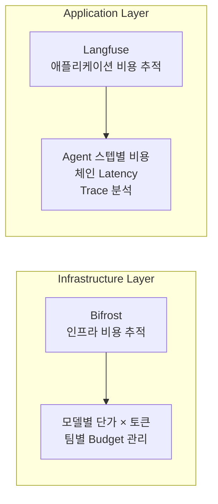

**Bifrost (인프라 레벨):**
- 모델별 토큰 단가 설정 (GPT-4: $0.03/1K, Claude: $0.015/1K)
- 팀/프로젝트별 예산 할당 및 실시간 모니터링
- 월간 비용 리포트 및 알림

**Langfuse (애플리케이션 레벨):**
- Agent 워크플로우 각 단계별 토큰 소비 추적
- 체인 전체의 end-to-end latency 및 비용
- Trace 기반 성능 병목 분석

이 2-Tier 전략으로 "어떤 모델이 얼마나 사용되었는가"(인프라)와 "어떤 기능이 비용을 유발하는가"(애플리케이션)를 동시에 파악할 수 있습니다.

### 비용 모니터링 대시보드 구성

```yaml
# Prometheus 비용 관련 메트릭 수집 규칙
apiVersion: monitoring.coreos.com/v1
kind: PrometheusRule
metadata:
  name: gpu-cost-rules
  namespace: monitoring
spec:
  groups:
    - name: gpu-cost
      rules:
        - record: gpu:hourly_cost:sum
          expr: |
            sum(
              karpenter_nodes_total_pod_requests{resource_type="nvidia.com/gpu"}
              * on(instance_type) group_left()
              aws_ec2_instance_hourly_cost
            )
        - alert: HighGPUCostAlert
          expr: gpu:hourly_cost:sum > 100
          for: 1h
          labels:
            severity: warning
          annotations:
            summary: "시간당 GPU 비용이 $100를 초과했습니다"
```

:::tip 비용 최적화 체크리스트

1. **Spot 인스턴스 비율**: 추론 워크로드의 70% 이상을 Spot으로 운영
2. **Consolidation 활성화**: 30초 이내 유휴 노드 정리
3. **스케줄 기반 정책**: 비업무 시간 리소스 50% 이상 축소
4. **Right-sizing**: 모델 크기에 맞는 인스턴스 타입 자동 선택
:::

:::warning 비용 최적화 주의사항

- Spot 인스턴스 중단 시 서비스 영향 최소화를 위한 graceful shutdown 구현 필수
- 과도한 Consolidation은 스케일 아웃 지연을 유발할 수 있음
- 비용 절감과 SLA 준수 사이의 균형점 설정 필요
:::

---

## 도전과제 4: Agent 오케스트레이션 및 안전성

### EKS 기반 Agent 오케스트레이션 아키텍처

Agentic AI 플랫폼에서 Agent 워크플로우는 **LangGraph 기반 오케스트레이션**, **NeMo Guardrails 안전성 레이어**, **MCP/A2A 표준 통신**으로 구성됩니다.

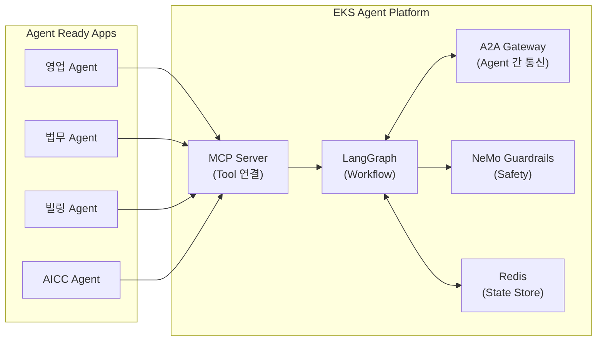

### 핵심 구성 요소

#### 1. LangGraph - Agent 워크플로우 오케스트레이션

LangGraph는 Agent 워크플로우를 상태 그래프로 정의하고 실행합니다.

```yaml
apiVersion: apps/v1
kind: Deployment
metadata:
  name: langgraph-agent
  namespace: ai-agents
spec:
  replicas: 3
  template:
    spec:
      containers:
        - name: agent
          image: langchain/langgraph:latest
          env:
            - name: REDIS_URL
              value: "redis://elasticache.ai-agents.svc:6379"
            - name: LANGCHAIN_TRACING_V2
              value: "true"
            - name: LANGCHAIN_API_KEY
              valueFrom:
                secretKeyRef:
                  name: langchain-secrets
                  key: api-key
          resources:
            requests:
              cpu: "500m"
              memory: "1Gi"
```

#### 2. NeMo Guardrails - 안전성 레이어

NeMo Guardrails는 Agent 입출력을 필터링하여 안전성을 보장합니다.

```yaml
# ConfigMap for NeMo Guardrails
apiVersion: v1
kind: ConfigMap
metadata:
  name: guardrails-config
  namespace: ai-agents
data:
  config.yml: |
    rails:
      input:
        flows:
          - check prompt injection
          - check jailbreak attempts
      output:
        flows:
          - check PII leakage
          - check toxic content
```

#### 3. MCP (Model Context Protocol) - 표준화된 Tool 연결

MCP는 Agent Ready 애플리케이션(영업/법무/빌링/AICC)이 표준화된 방식으로 Tool을 제공합니다.

```yaml
apiVersion: v1
kind: Service
metadata:
  name: mcp-server
  namespace: ai-agents
spec:
  selector:
    app: mcp-server
  ports:
    - port: 8080
      targetPort: 8080
---
apiVersion: apps/v1
kind: Deployment
metadata:
  name: mcp-server
  namespace: ai-agents
spec:
  replicas: 2
  template:
    spec:
      containers:
        - name: mcp-server
          image: mcp/server:latest
          env:
            - name: MCP_TOOLS_DIR
              value: "/tools"
          volumeMounts:
            - name: tools-config
              mountPath: /tools
      volumes:
        - name: tools-config
          configMap:
            name: mcp-tools-config
```

#### 4. A2A (Agent-to-Agent) - 멀티 Agent 통신

A2A는 Agent 간 안전하고 효율적인 통신을 제공합니다.

```yaml
apiVersion: gateway.networking.k8s.io/v1
kind: HTTPRoute
metadata:
  name: a2a-routing
  namespace: ai-agents
spec:
  parentRefs:
    - name: ai-gateway
  rules:
    - matches:
        - path:
            type: PathPrefix
            value: /a2a/
      backendRefs:
        - name: a2a-gateway
          port: 8080
```

### Kubernetes 통합: KEDA 기반 Agent 자동 스케일링

Agent Pod는 Redis 큐 길이를 기반으로 자동 스케일링됩니다.

```yaml
apiVersion: keda.sh/v1alpha1
kind: ScaledObject
metadata:
  name: agent-scaler
  namespace: ai-agents
spec:
  scaleTargetRef:
    name: langgraph-agent
  minReplicaCount: 2
  maxReplicaCount: 20
  triggers:
    - type: redis
      metadata:
        address: elasticache.ai-agents.svc:6379
        listName: agent_tasks
        listLength: "5"
```

### 상세 문서

Agent 오케스트레이션 및 안전성에 대한 상세 내용은 다음 문서를 참조하세요:

- [Kagent - Kubernetes 기반 Agent 관리](../gateway-agents/kagent-kubernetes-agents.md) — CRD 기반 에이전트 라이프사이클 관리
- [Bedrock AgentCore & MCP](../gateway-agents/bedrock-agentcore-mcp.md) — AWS Bedrock 에이전트 통합 및 MCP/A2A 표준
- [기술적 도전과제 - Agent 오케스트레이션](./agentic-ai-challenges.md#4-agent-오케스트레이션-및-안전성) — LangGraph, NeMo Guardrails, MCP/A2A 상세

:::tip EKS에서의 Agent 안전성
EKS 환경에서 Agent Pod는 Kubernetes RBAC, Network Policy, Pod Security Standards를 통해 격리됩니다. NeMo Guardrails는 FastAPI 미들웨어로 통합되어 입출력 필터링을 수행하며, LangGraph의 상태 관리는 Redis (ElastiCache)를 checkpointer로 활용합니다.
:::

---

## 도전과제 5: 모델 공급망 관리 (FM 파인튜닝과 자동화 파이프라인)

### Karpenter 기반 학습 인프라 구성

#### 전략 1: 학습 전용 NodePool 분리

학습 워크로드는 추론과 다른 특성을 가지므로 별도의 NodePool로 관리합니다.

```yaml
apiVersion: karpenter.sh/v1
kind: NodePool
metadata:
  name: gpu-training-pool
spec:
  template:
    metadata:
      labels:
        node-type: gpu-training
        workload: ml-training
    spec:
      requirements:
        - key: kubernetes.io/arch
          operator: In
          values: ["amd64"]
        - key: karpenter.sh/capacity-type
          operator: In
          values: ["on-demand"]  # 학습은 On-Demand 권장 (안정성)
        - key: node.kubernetes.io/instance-type
          operator: In
          values:
            - p5.48xlarge     # 8x H100 80GB - 대규모 학습
            - p4d.24xlarge    # 8x A100 40GB - 중규모 학습
            - p4de.24xlarge   # 8x A100 80GB - 메모리 집약적 학습
        - key: karpenter.k8s.aws/instance-gpu-count
          operator: Gt
          values: ["0"]
      nodeClassRef:
        group: karpenter.k8s.aws
        kind: EC2NodeClass
        name: gpu-training-nodeclass
      taints:
        - key: nvidia.com/gpu
          value: "true"
          effect: NoSchedule
        - key: workload-type
          value: "training"
          effect: NoSchedule
  limits:
    nvidia.com/gpu: 64
  disruption:
    # 학습 중에는 노드 중단 방지
    consolidationPolicy: WhenEmpty
    consolidateAfter: 1h  # 학습 완료 후 1시간 대기
    budgets:
      # 학습 중에는 노드 중단 완전 방지
      - nodes: "0"
```

#### 전략 2: EFA 네트워크 최적화 NodeClass

분산 학습의 성능은 GPU 간 통신 속도에 크게 의존합니다. EFA(Elastic Fabric Adapter)를 활용하여 최대 성능을 확보합니다.

```yaml
apiVersion: karpenter.k8s.aws/v1
kind: EC2NodeClass
metadata:
  name: gpu-training-nodeclass
spec:
  role: KarpenterNodeRole-${CLUSTER_NAME}
  amiSelectorTerms:
    - alias: al2023@latest
  subnetSelectorTerms:
    - tags:
        karpenter.sh/discovery: ${CLUSTER_NAME}
        network-type: efa-enabled  # EFA 지원 서브넷
  securityGroupSelectorTerms:
    - tags:
        karpenter.sh/discovery: ${CLUSTER_NAME}
  blockDeviceMappings:
    - deviceName: /dev/xvda
      ebs:
        volumeSize: 1000Gi  # 대용량 체크포인트 저장
        volumeType: gp3
        iops: 16000
        throughput: 1000
        encrypted: true
        deleteOnTermination: true
  instanceStorePolicy: RAID0  # NVMe 인스턴스 스토어 활용
  userData: |
    #!/bin/bash
    set -e

    # NVIDIA 드라이버 설정
    nvidia-smi -pm 1
    nvidia-smi -ac 1593,1410  # H100 최적 클럭 설정

    # EFA 드라이버 로드
    modprobe efa

    # NCCL 환경 변수 설정
    echo 'export NCCL_DEBUG=INFO' >> /etc/profile.d/nccl.sh
    echo 'export NCCL_SOCKET_IFNAME=eth0' >> /etc/profile.d/nccl.sh
    echo 'export FI_EFA_USE_DEVICE_RDMA=1' >> /etc/profile.d/nccl.sh
    echo 'export FI_PROVIDER=efa' >> /etc/profile.d/nccl.sh

    # 대용량 페이지 설정 (학습 성능 향상)
    echo 'vm.nr_hugepages=5120' >> /etc/sysctl.conf
    sysctl -p
  tags:
    Environment: production
    Workload: ml-training
    CostCenter: ml-platform
```

#### 전략 3: 실험용 Spot 기반 NodePool

하이퍼파라미터 튜닝이나 실험적 학습에는 Spot 인스턴스를 활용하여 비용을 절감합니다.

```yaml
apiVersion: karpenter.sh/v1
kind: NodePool
metadata:
  name: gpu-experiment-pool
spec:
  template:
    metadata:
      labels:
        node-type: gpu-experiment
        workload: ml-experiment
    spec:
      requirements:
        - key: karpenter.sh/capacity-type
          operator: In
          values: ["spot"]
        - key: node.kubernetes.io/instance-type
          operator: In
          values:
            - p4d.24xlarge
            - g5.48xlarge
      nodeClassRef:
        group: karpenter.k8s.aws
        kind: EC2NodeClass
        name: gpu-experiment-nodeclass
      taints:
        - key: nvidia.com/gpu
          value: "true"
          effect: NoSchedule
        - key: workload-type
          value: "experiment"
          effect: NoSchedule
  limits:
    nvidia.com/gpu: 32
  disruption:
    consolidationPolicy: WhenEmpty
    consolidateAfter: 10m  # 실험 완료 후 빠른 정리
  weight: 30  # 프로덕션 학습보다 낮은 우선순위
```

### NeMo 분산 학습 Job 예제

Karpenter가 프로비저닝한 노드에서 실행되는 NeMo 분산 학습 Job입니다.

```yaml
apiVersion: batch/v1
kind: Job
metadata:
  name: nemo-finetune-llama-70b
  namespace: ai-training
spec:
  parallelism: 4  # 4개 노드 병렬 실행
  completions: 4
  completionMode: Indexed
  template:
    metadata:
      labels:
        app: nemo-training
        model: llama-70b
    spec:
      restartPolicy: OnFailure
      containers:
        - name: nemo
          image: nvcr.io/nvidia/nemo:25.02
          command:
            - /bin/bash
            - -c
            - |
              # 분산 학습 환경 설정
              export MASTER_ADDR=$(hostname -i)
              export MASTER_PORT=29500
              export WORLD_SIZE=32  # 4 nodes x 8 GPUs
              export RANK=$JOB_COMPLETION_INDEX

              python -m torch.distributed.launch \
                --nproc_per_node=8 \
                --nnodes=4 \
                --node_rank=$RANK \
                --master_addr=$MASTER_ADDR \
                --master_port=$MASTER_PORT \
                /opt/NeMo/examples/nlp/language_modeling/megatron_gpt_finetuning.py \
                --config-path=/config \
                --config-name=llama_70b_finetune
          args:
            - model.data.train_ds.file_path=/data/train.jsonl
            - model.data.validation_ds.file_path=/data/val.jsonl
            - trainer.devices=8
            - trainer.num_nodes=4
            - trainer.max_epochs=3
            - trainer.precision=bf16-mixed
            - model.tensor_model_parallel_size=4
            - model.pipeline_model_parallel_size=2
            - exp_manager.checkpoint_callback_params.save_top_k=3
          resources:
            requests:
              nvidia.com/gpu: 8
              memory: "900Gi"
              cpu: "90"
            limits:
              nvidia.com/gpu: 8
              memory: "1100Gi"
              cpu: "96"
          volumeMounts:
            - name: training-data
              mountPath: /data
            - name: checkpoints
              mountPath: /checkpoints
            - name: config
              mountPath: /config
            - name: shm
              mountPath: /dev/shm
      nodeSelector:
        node-type: gpu-training
      tolerations:
        - key: nvidia.com/gpu
          operator: Exists
          effect: NoSchedule
        - key: workload-type
          operator: Equal
          value: "training"
          effect: NoSchedule
      volumes:
        - name: training-data
          persistentVolumeClaim:
            claimName: training-data-pvc
        - name: checkpoints
          persistentVolumeClaim:
            claimName: checkpoints-pvc
        - name: config
          configMap:
            name: nemo-training-config
        - name: shm
          emptyDir:
            medium: Memory
            sizeLimit: 256Gi  # 대용량 공유 메모리
```

### 학습 인프라 비용 최적화 전략

<TrainingCostOptimization />
:::tip 학습 인프라 모범 사례

1. **프로덕션 학습**: On-Demand 인스턴스로 안정성 확보
2. **실험/튜닝**: Spot 인스턴스로 비용 절감
3. **체크포인트**: FSx for Lustre에 주기적 저장
4. **모니터링**: TensorBoard + Prometheus로 학습 진행 추적
:::

:::warning 분산 학습 주의사항

- EFA 네트워크가 지원되는 서브넷에서만 최적 성능 발휘
- NCCL 환경 변수 설정이 성능에 큰 영향
- 체크포인트 저장 주기와 스토리지 비용 간 균형 필요
:::

---

## EKS 기반 Agentic AI 플랫폼 간편 구축

앞서 소개한 솔루션들은 **Amazon EKS 환경에서 손쉽게 배포**할 수 있습니다. EKS Auto Mode와 AWS 관리형 서비스의 통합을 통해 **복잡한 인프라 구성 없이** 완전한 Agentic AI 플랫폼을 구축할 수 있습니다.

### EKS의 간편 배포 이점

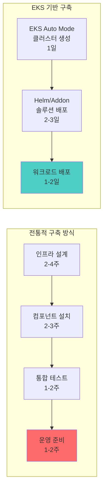

<DeploymentTimeComparison />
### 솔루션별 EKS 배포 방법

<EksIntegrationBenefits />
### EKS 통합 아키텍처

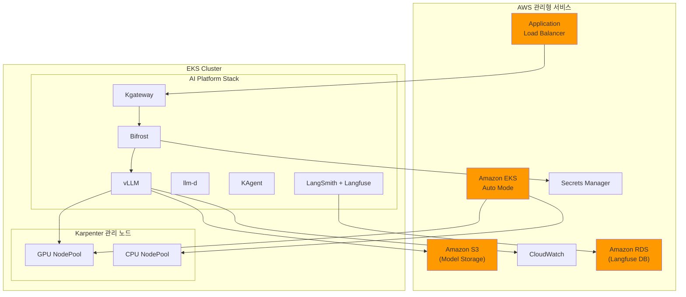

### 간편 배포 예시

EKS Auto Mode 클러스터에서 전체 Agentic AI 스택을 배포하는 예시입니다.

```bash
# 1. EKS Auto Mode 클러스터 생성 (Karpenter 자동 포함)
eksctl create cluster --name ai-platform --region us-west-2 --auto-mode

# 2. GPU NodePool 추가
kubectl apply -f gpu-nodepool.yaml

# 3. AI Platform 솔루션 스택 배포
helm repo add kgateway https://kgateway.io/charts
helm repo add bifrost https://bifrost.dev/charts
helm repo add vllm https://vllm-project.github.io/helm
helm repo add langfuse https://langfuse.github.io/helm
helm repo update

# 4. Kgateway 설치
helm install kgateway kgateway/kgateway \
  -n ai-gateway \
  --create-namespace \
  --set gateway.replicas=2 \
  --set gateway.resources.requests.cpu=500m \
  --set gateway.resources.requests.memory=512Mi

# 5. Bifrost 설치
helm install bifrost bifrost/bifrost \
  -n ai-inference \
  --create-namespace \
  --set replicaCount=3 \
  --set resources.requests.cpu=500m \
  --set resources.requests.memory=512Mi \
  --set env.BIFROST_MASTER_KEY="sk-1234" \
  --set config.observability.langfuse.enabled=true

# 6. vLLM 설치
helm install vllm vllm/vllm \
  -n ai-inference \
  --set image.tag=latest \
  --set resources.limits."nvidia\.com/gpu"=1 \
  --set model.name="meta-llama/Llama-3-8B-Instruct" \
  --set model.downloadFrom="s3://my-models/llama-3-8b/" \
  --set nodeSelector."node-type"="gpu-inference"

# 7. Langfuse 설치 (프로덕션용 - 개발/스테이징은 LangSmith 사용 권장)
helm install langfuse langfuse/langfuse \
  -n observability \
  --create-namespace \
  --set postgresql.enabled=true \
  --set postgresql.auth.password="changeme" \
  --set ingress.enabled=true \
  --set ingress.hosts[0].host="langfuse.example.com"

# 8. KEDA 설치 (EKS Addon)
aws eks create-addon \
  --cluster-name ai-platform \
  --addon-name keda \
  --addon-version v1.0.0-eksbuild.1
```

### EKS 기반 구축의 핵심 이점

:::tip EKS로 Agentic AI 플랫폼을 구축하면

1. **인프라 자동화**: EKS Auto Mode + Karpenter로 GPU 노드 자동 관리
2. **간편한 배포**: Helm Chart와 EKS Addon으로 솔루션 스택 원클릭 배포
3. **AWS 서비스 통합**: RDS, S3, Secrets Manager, CloudWatch와 네이티브 연동
4. **보안 강화**: Pod Identity, Security Groups for Pods, 암호화 자동 적용
5. **비용 최적화**: Spot 인스턴스, Savings Plans, Consolidation 자동 활용
:::

:::tip EKS Auto Mode 시작하기
EKS Auto Mode는 AWS 콘솔, eksctl, 또는 Terraform에서 간단히 활성화할 수 있습니다.

```bash
# eksctl로 EKS Auto Mode 클러스터 생성
eksctl create cluster --name ai-platform --region us-west-2 --auto-mode
```

클러스터 생성 후 GPU NodePool만 추가하면 즉시 AI 워크로드를 배포할 수 있습니다.
:::

---

## EKS Capability: Agentic AI를 위한 통합 플랫폼 기능

### EKS Capability란?

**EKS Capability**는 Amazon EKS에서 특정 워크로드를 효과적으로 운영하기 위해 **검증된 오픈소스 도구와 AWS 서비스를 통합하여 제공하는 플랫폼 수준의 기능**입니다. EKS는 단순한 Kubernetes 관리형 서비스를 넘어, 특정 도메인(AI/ML, 데이터 분석, 웹 애플리케이션 등)에 최적화된 **엔드-투-엔드 솔루션 스택**을 제공합니다.

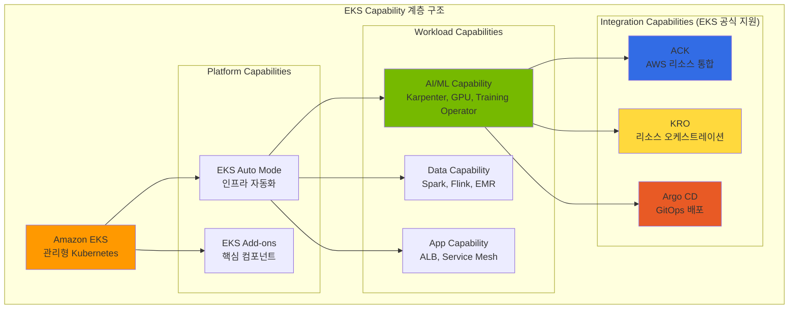

### Agentic AI를 위한 핵심 EKS Capability

Agentic AI 워크로드를 효과적으로 운영하기 위해 EKS는 다음 **Integration Capability**를 공식 지원합니다:

<EksCapabilities />
:::warning Argo Workflows는 별도 설치 필요
**Argo Workflows**는 EKS Capability로 공식 지원되지 않으므로 **직접 설치가 필요**합니다.
Argo CD(EKS Capability)와 함께 사용하면 강력한 ML 파이프라인 자동화를 구현할 수 있습니다.

```bash
# Argo Workflows 설치
kubectl create namespace argo
kubectl apply -n argo -f https://github.com/argoproj/argo-workflows/releases/download/v3.6.4/install.yaml
```

:::

:::info EKS Capability의 핵심 가치
ACK, KRO, Argo CD (EKS Capability)를 조합하면:

- **선언적 관리**: 모든 인프라와 워크로드를 YAML로 정의
- **GitOps 기반**: Git을 Single Source of Truth로 활용
- **완전 자동화**: 코드 커밋부터 프로덕션 배포까지 무중단 파이프라인
- **통합 모니터링**: AWS CloudWatch와 Kubernetes 메트릭 통합
:::

---

### ACK (AWS Controllers for Kubernetes)

**ACK**는 EKS Capability의 핵심 구성요소로, Kubernetes Custom Resource를 통해 AWS 서비스를 직접 프로비저닝하고 관리할 수 있게 해주는 오픈소스 프로젝트입니다. **EKS Add-on으로 간편하게 설치**할 수 있습니다.

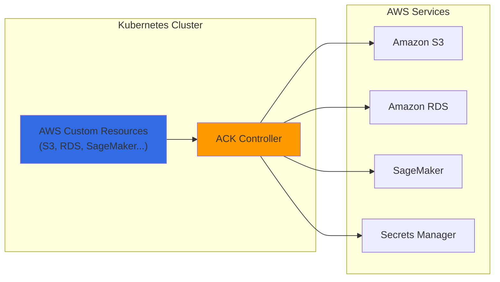

**AI 플랫폼에서 ACK 활용 사례:**

<AckControllers />
**ACK를 이용한 S3 버킷 생성 예시:**

```yaml
# s3-model-bucket.yaml
apiVersion: s3.services.k8s.aws/v1alpha1
kind: Bucket
metadata:
  name: agentic-ai-models
  namespace: ai-platform
spec:
  name: agentic-ai-models-prod
  versioning:
    status: Enabled
  encryption:
    rules:
    - applyServerSideEncryptionByDefault:
        sseAlgorithm: aws:kms
  tags:
  - key: Project
    value: agentic-ai
  - key: Environment
    value: production
```

### KRO (Kubernetes Resource Orchestrator)

**KRO**는 여러 Kubernetes 리소스와 AWS 리소스를 **하나의 추상화된 단위로 조합**하여 복잡한 인프라를 단순하게 배포할 수 있게 해줍니다.

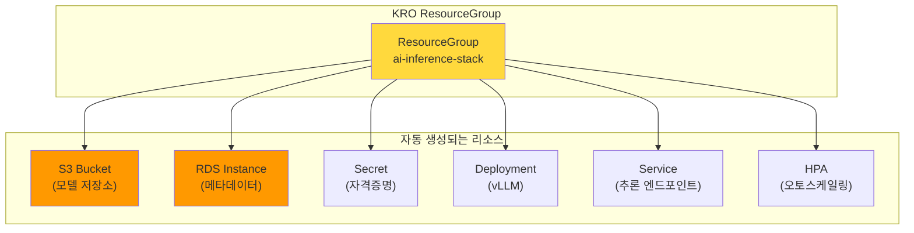

**KRO ResourceGroup 정의 예시:**

```yaml
# ai-inference-stack.yaml
apiVersion: kro.aws.io/v1alpha1
kind: ResourceGroup
metadata:
  name: ai-inference-stack
spec:
  schema:
    apiVersion: v1alpha1
    kind: AIInferenceStack
    spec:
      modelName: string
      gpuType: string | default="g5.xlarge"
      minReplicas: integer | default=1
      maxReplicas: integer | default=10

  resources:
  # S3 버킷 (ACK)
  - id: modelBucket
    template:
      apiVersion: s3.services.k8s.aws/v1alpha1
      kind: Bucket
      metadata:
        name: ${schema.spec.modelName}-models
      spec:
        name: ${schema.spec.modelName}-models-${schema.metadata.namespace}

  # vLLM Deployment
  - id: inference
    template:
      apiVersion: apps/v1
      kind: Deployment
      metadata:
        name: ${schema.spec.modelName}-vllm
      spec:
        replicas: ${schema.spec.minReplicas}
        template:
          spec:
            containers:
            - name: vllm
              image: vllm/vllm-openai:latest
              env:
              - name: MODEL_PATH
                value: s3://${modelBucket.status.bucketName}/

  # HPA
  - id: autoscaler
    template:
      apiVersion: autoscaling/v2
      kind: HorizontalPodAutoscaler
      metadata:
        name: ${schema.spec.modelName}-hpa
      spec:
        scaleTargetRef:
          name: ${inference.metadata.name}
        minReplicas: ${schema.spec.minReplicas}
        maxReplicas: ${schema.spec.maxReplicas}
```

**KRO로 AI 추론 스택 배포:**

```yaml
# 단일 리소스로 전체 스택 배포
apiVersion: v1alpha1
kind: AIInferenceStack
metadata:
  name: llama-inference
  namespace: ai-platform
spec:
  modelName: llama-3-70b
  gpuType: g5.12xlarge
  minReplicas: 2
  maxReplicas: 20
```

### Argo 기반 ML 파이프라인 자동화

**Argo Workflows**와 **Argo CD**를 결합하면 AI 모델의 학습, 평가, 배포까지 **전체 MLOps 파이프라인을 GitOps 방식으로 자동화**할 수 있습니다.

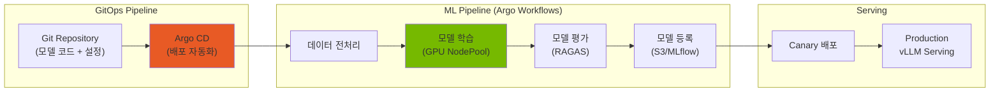

**Argo Workflow를 이용한 FM 파인튜닝 파이프라인:**

```yaml
# fine-tuning-pipeline.yaml
apiVersion: argoproj.io/v1alpha1
kind: Workflow
metadata:
  name: llm-fine-tuning
  namespace: ai-platform
spec:
  entrypoint: fine-tuning-pipeline

  templates:
  - name: fine-tuning-pipeline
    dag:
      tasks:
      # 1. 데이터 준비
      - name: prepare-data
        template: data-preparation

      # 2. 모델 학습 (GPU 사용)
      - name: train-model
        template: training
        dependencies: [prepare-data]

      # 3. 모델 평가
      - name: evaluate-model
        template: evaluation
        dependencies: [train-model]

      # 4. 모델 등록 (평가 통과 시)
      - name: register-model
        template: registration
        dependencies: [evaluate-model]
        when: "{{tasks.evaluate-model.outputs.parameters.quality-score}} > 0.8"

  - name: training
    nodeSelector:
      karpenter.sh/nodepool: gpu-training
    tolerations:
    - key: nvidia.com/gpu
      operator: Exists
    container:
      image: nvcr.io/nvidia/nemo:25.02
      command: [python, train.py]
      resources:
        limits:
          nvidia.com/gpu: 8
      env:
      - name: TRAINING_DATA
        value: s3://agentic-ai-data/training/
      - name: MODEL_OUTPUT
        value: s3://agentic-ai-models/checkpoints/

  - name: evaluation
    container:
      image: ai-platform/ragas-evaluator:latest
      command: [python, evaluate.py]
    outputs:
      parameters:
      - name: quality-score
        valueFrom:
          path: /tmp/quality-score.txt
```

**Argo CD를 이용한 모델 배포 자동화:**

```yaml
# argocd-application.yaml
apiVersion: argoproj.io/v1alpha1
kind: Application
metadata:
  name: llm-inference-prod
  namespace: argocd
spec:
  project: ai-platform
  source:
    repoURL: https://github.com/myorg/ai-platform-configs
    targetRevision: main
    path: deployments/llm-inference
  destination:
    server: https://kubernetes.default.svc
    namespace: ai-platform
  syncPolicy:
    automated:
      prune: true
      selfHeal: true
    syncOptions:
    - CreateNamespace=true
```

### ACK + KRO + Argo 통합 아키텍처

세 가지 도구를 조합하면 **완전 자동화된 AI 플랫폼 운영**이 가능합니다:

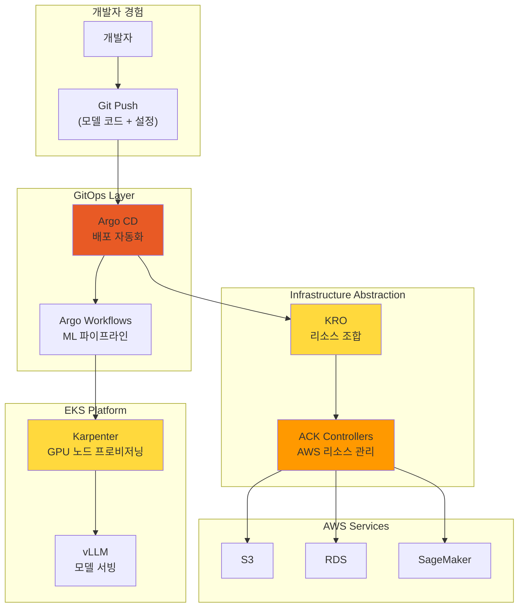

<AutomationComponents />
:::info 완전 자동화의 이점
이 통합 아키텍처를 통해:

- **개발자**: Git push만으로 모델 배포
- **플랫폼 팀**: 인프라 관리 부담 최소화
- **비용 최적화**: 필요한 리소스만 동적 프로비저닝
- **일관성**: 모든 환경에서 동일한 배포 방식
:::

---

## 결론: Kubernetes + EKS Auto Mode로 완성하는 AI 인프라 자동화

Agentic AI Platform 구축의 5가지 핵심 도전과제는 **클라우드 인프라 자동화와 AI 플랫폼의 유기적 통합**을 통해 효과적으로 해결할 수 있습니다. 특히 **EKS Auto Mode**는 Karpenter를 포함한 핵심 컴포넌트를 자동으로 관리하여 **완전 자동화의 마지막 퍼즐**을 완성합니다.

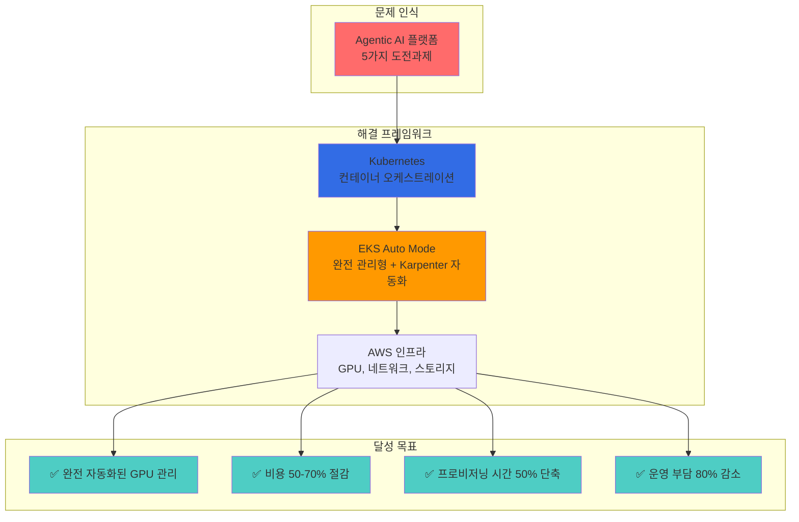

### 핵심 메시지

1. **Kubernetes는 AI 인프라의 필수 기반**: 선언적 리소스 관리, 자동 스케일링, Operator 패턴을 통해 복잡한 AI 워크로드를 효과적으로 관리
2. **EKS Auto Mode가 완전 자동화 실현**: Karpenter, VPC CNI, EBS CSI Driver 등 핵심 컴포넌트 자동 관리로 운영 부담 대폭 감소
3. **Karpenter는 GPU 인프라 자동화의 핵심**: Just-in-Time 프로비저닝, Spot 인스턴스, Consolidation으로 비용과 성능 최적화
4. **AWS 인프라 통합이 시너지 극대화**: EFA 네트워크, 다양한 GPU 인스턴스, FSx 스토리지와의 긴밀한 통합

### EKS Auto Mode: 권장 시작점

새로운 Agentic AI 플랫폼을 구축한다면 **EKS Auto Mode**로 시작하는 것을 권장합니다.

<EksAutoModeBenefits />
### 도전과제별 해결 방안 최종 요약

<ChallengeSolutionsSummary />
### EKS Auto Mode GPU 제약사항과 하이브리드 전략

EKS Auto Mode는 일반 워크로드와 기본 GPU 추론에 최적이지만, GPU 고급 기능에는 제약이 있습니다.

**Auto Mode 워크로드 적합성:**

| 워크로드 유형 | Auto Mode 적합성 | 이유 |
|---|---|---|
| API Gateway, Agent Framework | 적합 | Non-GPU, 자동 스케일링 충분 |
| Observability Stack | 적합 | Non-GPU, 관리 부담 최소화 |
| 기본 GPU 추론 (전체 GPU) | 적합 | AWS 관리 GPU 스택으로 충분 |
| MIG 파티셔닝 필요 | **부적합** | GPU Operator 설치 불가 |
| Run:ai GPU 스케줄링 | **부적합** | GPU Operator 의존성 |

**Auto Mode에 GPU Operator를 설치할 수 없는 핵심 이유:**

1. **Read-Only Root Filesystem**: Driver DaemonSet이 호스트에 커널 모듈을 로드 불가
2. **AWS 관리 GPU 스택 충돌**: 사전 설치 드라이버와 버전 충돌
3. **Privileged DaemonSet 제한**: MIG Manager 등 호스트 접근 필요 컴포넌트 실행 불가
4. **노드 교체 시 초기화**: 커스텀 설정 유실

**권장 하이브리드 구성**: Auto Mode(일반 워크로드) + Karpenter(GPU 고급 기능)를 하나의 클러스터에서 운영합니다. Karpenter는 Auto Mode의 자동 스케일링 장점을 유지하면서 GPU Operator를 자유롭게 설치할 수 있는 최적의 조합입니다. 상세 구성은 [EKS GPU 노드 전략](../model-serving/eks-gpu-node-strategy.md)을 참조하세요.

### Gateway API 제약 및 우회

EKS Auto Mode의 빌트인 로드밸런서는 Kubernetes Gateway API를 직접 지원하지 않습니다. kgateway를 사용하려면 별도의 Service (type: LoadBalancer)로 NLB를 프로비저닝하고, kgateway 프록시를 그 뒤에 배치합니다.

```yaml
# kgateway 프록시를 위한 NLB Service
apiVersion: v1
kind: Service
metadata:
  name: kgateway-proxy
  namespace: kgateway-system
  annotations:
    service.beta.kubernetes.io/aws-load-balancer-type: "external"
    service.beta.kubernetes.io/aws-load-balancer-nlb-target-type: "ip"
    service.beta.kubernetes.io/aws-load-balancer-scheme: "internet-facing"
spec:
  type: LoadBalancer
  selector:
    app: kgateway-proxy
  ports:
    - name: https
      port: 443
      targetPort: 8443
```

2-Tier Gateway 아키텍처의 전체 설계는 [LLM Gateway 2-Tier 아키텍처](../gateway-agents/llm-gateway-architecture.md)를 참조하세요.

### 핵심 권장사항

1. **EKS Auto Mode로 시작**: 새 클러스터는 Auto Mode로 생성하여 Karpenter 자동 구성 활용
2. **GPU 고급 기능은 Karpenter 노드**: MIG, Run:ai 등 GPU Operator 필요 시 Karpenter NodePool 추가
3. **GPU NodePool 커스텀 정의**: 워크로드 특성에 맞는 GPU NodePool 추가 (추론/학습/실험 분리)
4. **Spot 인스턴스 적극 활용**: 추론 워크로드의 70% 이상을 Spot으로 운영
5. **Consolidation 기본 활성화**: EKS Auto Mode에서 자동 활성화된 Consolidation 활용
6. **KEDA 연동**: 메트릭 기반 Pod 스케일링과 Karpenter 노드 프로비저닝 연계
7. **EFA NodeClass 추가**: 분산 학습 워크로드를 위한 고성능 네트워크 설정

---

## 참고 자료

### Kubernetes 및 인프라

- [Kubernetes 공식 문서](https://kubernetes.io/docs/)
- [Karpenter 공식 문서](https://karpenter.sh/docs/)
- [Amazon EKS Best Practices Guide](https://docs.aws.amazon.com/eks/latest/best-practices/introduction.html)
- [NVIDIA GPU Operator Documentation](https://docs.nvidia.com/datacenter/cloud-native/gpu-operator/overview.html)
- [KEDA - Kubernetes Event-driven Autoscaling](https://keda.sh/)

### 모델 서빙 및 추론

- [vLLM Documentation](https://docs.vllm.ai/)
- [llm-d Project](https://github.com/llm-d/llm-d)
- [Kgateway Documentation](https://kgateway.io/docs/)
- [Bifrost Documentation](https://bifrost.dev/docs) - 고성능 LLM Gateway (기본 권장)
- [LiteLLM Documentation](https://docs.litellm.ai/) - Python 생태계 대안

### LLM Observability

- [Langfuse Documentation](https://langfuse.com/docs)
- [LangSmith Documentation](https://docs.smith.langchain.com/)

### Agent 프레임워크 및 학습

- [KAgent - Kubernetes Agent Framework](https://github.com/kagent-dev/kagent)
- [NVIDIA NeMo Framework](https://docs.nvidia.com/nemo-framework/user-guide/latest/overview.html)
- [Kubeflow Documentation](https://www.kubeflow.org/docs/)

### AWS 서비스

- [Amazon EKS Documentation](https://docs.aws.amazon.com/eks/)
- [EKS Auto Mode](https://docs.aws.amazon.com/eks/latest/userguide/automode.html)
- [AWS Elastic Fabric Adapter (EFA)](https://aws.amazon.com/hpc/efa/)
- [Amazon FSx for Lustre](https://aws.amazon.com/fsx/lustre/)

### Agentic AI를 위한 EKS의 장점

**EKS가 최적의 플랫폼인 이유:**

1. **첫날부터 프로덕션 준비 완료**
   - 99.95% SLA를 제공하는 AWS 관리형 Control Plane
   - 자동 보안 패치 및 Kubernetes 업그레이드
   - AWS 서비스와의 깊은 통합 (IAM, VPC, CloudWatch)

2. **간소화된 운영**
   - EKS Auto Mode로 노드 관리 부담 제거
   - Karpenter를 통한 GPU 프로비저닝 자동화
   - CloudWatch를 통한 통합 관찰성 제공

3. **대규모 비용 최적화**
   - Spot 인스턴스 통합으로 60-90% 비용 절감
   - Karpenter Consolidation으로 유휴 낭비 30-40% 감소
   - Right-sizing 및 오토스케일링으로 과다 프로비저닝 최소화

4. **엔터프라이즈 보안**
   - Pod 레벨 IAM 역할 (Pod Identity / IRSA)
   - VPC 및 Security Groups를 통한 네트워크 격리
   - 규정 준수 인증 (HIPAA, PCI-DSS, SOC 2)

### 배포 경로 선택하기

<Tabs>
<TabItem value="auto-mode" label="EKS Auto Mode (대부분에게 권장)">

**적합한 경우:**

- 스타트업 및 소규모 팀
- Kubernetes 초보 팀
- 표준 Agentic AI 워크로드 (CPU + 중간 수준 GPU)
- 빠른 출시 요구사항

**시작하기:**

```bash
aws eks create-cluster \
  --name agentic-ai-auto \
  --region us-west-2 \
  --compute-config enabled=true
```

**장점:**

- 인프라 관리 부담 제로
- AWS 최적화된 기본 설정
- 내장된 비용 최적화
- 자동 보안 패치

**단점:**

- 인스턴스 타입에 대한 제어 감소
- 극단적인 비용 시나리오 최적화 어려움
- AWS 관리형 타입으로 GPU 지원 제한

</TabItem>
<TabItem value="karpenter" label="EKS + Karpenter (최대 제어)">

**적합한 경우:**

- 대규모 프로덕션 워크로드
- 복잡한 GPU 요구사항 (혼합 인스턴스 타입)
- 비용 최적화가 최우선 (70%+ 절감)
- Kubernetes 전문성을 보유한 팀

**시작하기:**

```bash
terraform apply -f eks-karpenter-blueprint/
kubectl apply -f karpenter-nodepools/
```

**장점:**

- 인스턴스에 대한 세밀한 제어
- 최대 비용 최적화 (70-80% 절감)
- 유연한 GPU 스케줄링
- 커스텀 AMI 및 노드 구성

**단점:**

- Karpenter 관리 필요
- 구성 복잡도 증가
- 팀에 K8s 전문성 필요

</TabItem>
<TabItem value="hybrid" label="하이브리드 (두 방식의 장점 결합)">

**적합한 경우:**

- 성장하는 플랫폼 (단순하게 시작, 복잡하게 확장)
- 혼합 워크로드 타입 (CPU 에이전트 + GPU LLM)
- Auto Mode에서 Karpenter로 점진적 마이그레이션

**아키텍처:**

- Control Plane은 EKS Auto Mode 사용
- 시스템 워크로드는 Auto Mode 기본 NodePool에서 실행
- GPU 워크로드는 커스텀 GPU NodePool에서 실행

**시작하기:**

```bash
# 1단계: Auto Mode로 EKS 클러스터 생성
aws eks create-cluster --name agentic-ai --compute-config enabled=true

# 2단계: GPU 워크로드용 커스텀 NodePool 배포 (Karpenter는 Auto Mode에 내장)
kubectl apply -f gpu-nodepools.yaml
```

**장점:**

- 점진적 복잡도 증가
- 중요한 부분(GPU 비용)에서 최적화
- AWS 관리형 Control Plane + 커스텀 GPU NodePool

**단점:**

- 커스텀 NodePool 관리 필요
- Auto Mode 기본 설정과 커스텀 설정 간 이해 필요

</TabItem>
</Tabs>

### 미래: AI 네이티브 Kubernetes

**주요 트렌드:**

- **AI 최적화 스케줄링**: ML 기반 인스턴스 선택을 통한 Karpenter
- **동적 모델 라우팅**: 작업 복잡도 기반 지능형 LLM 선택
- **연합 학습(Federated Learning)**: EKS Anywhere를 통한 멀티 클러스터 학습
- **서버리스 GPU**: 급증하는 워크로드를 위한 AWS Lambda GPU 인스턴스

**EKS 로드맵 하이라이트:**

- 네이티브 GPU 공유 (MIG/MPS 지원)
- 통합 모델 서빙 (SageMaker + EKS)
- 멀티 테넌트 AI 플랫폼을 위한 비용 할당
- LLM 워크로드를 위한 향상된 관찰성

### 지금 시작하기

**오늘부터 시작:**

1. **프로토타입** (1주)
   - EKS Auto Mode 클러스터 배포
   - 샘플 Agentic AI 워크로드 실행
   - 기준 비용 및 성능 측정

2. **최적화** (2-4주)
   - GPU 워크로드를 위해 Karpenter로 마이그레이션
   - KEDA 오토스케일링 구현
   - CloudWatch 대시보드 설정

3. **확장** (지속적)
   - Consolidation 정책 미세 조정
   - 학습 파이프라인 구현
   - 멀티 테넌트 플랫폼 구축

**리소스:**

- [AWS EKS Best Practices Guide](https://docs.aws.amazon.com/eks/latest/best-practices/introduction.html)
- [Karpenter Documentation](https://karpenter.sh/)
- [KEDA Scalers Reference](https://keda.sh/docs/scalers/)
- [Kubeflow on AWS](https://awslabs.github.io/kubeflow-manifests/)

**질문이 있으신가요?**

- [AWS Containers Slack](https://aws-containers.slack.com) 참여
- [EKS Blueprints](https://github.com/aws-ia/terraform-aws-eks-blueprints)에 이슈 등록
- 아키텍처 검토를 위해 AWS Solutions Architect에게 문의

---

**다음 단계:**

- 오픈소스 대안을 확인하려면 [기술적 도전과제 문서](./agentic-ai-challenges.md)를 검토하세요
- 실습을 위해 [AWS EKS Workshop](https://eksworkshop.com/)을 탐색하세요
- 최신 트렌드를 위해 [Cloud Native Community Groups](https://community.cncf.io/)에 참여하세요
