import Tabs from '@theme/Tabs';
import TabItem from '@theme/TabItem';
import {
  EksKarpenterLayers,
  ClusterAutoscalerVsKarpenter,
  KarpenterKeyFeatures,
  EksAutoModeVsStandard,
  DeploymentTimeComparison,
  EksIntegrationBenefits,
  EksCapabilities,
  AckControllers,
  AutomationComponents,
  EksAutoModeBenefits,
  ChallengeSolutionsSummary,
  EksClusterConfiguration
} from '@site/src/components/AgenticSolutionsTables';

> 📅 **작성일**: 2025-02-05 | **수정일**: 2026-03-20 | ⏱️ **읽는 시간**: 약 12분

:::info 선행 문서
이 문서를 읽기 전에 다음 문서를 먼저 참조하세요:
- [플랫폼 아키텍처](./agentic-platform-architecture.md) — Agentic AI Platform의 구조와 핵심 레이어
- [기술적 도전과제](./agentic-ai-challenges.md) — 5가지 핵심 도전과제
- [AWS Native 플랫폼](./aws-native-agentic-platform.md) — 매니지드 서비스 기반 대안 접근 (비교 참고)
:::

---

## Part 1: 왜 EKS 기반 오픈 아키텍처인가?

[AWS Native 플랫폼](./aws-native-agentic-platform.md)은 빠르게 시작할 수 있는 강력한 접근입니다. 하지만 다음과 같은 요구사항이 생기면 **EKS 기반 오픈 아키텍처**가 필요합니다:

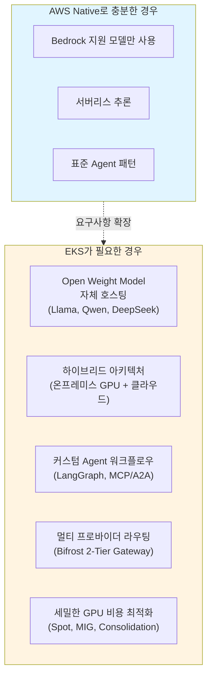

**핵심 메시지: AWS Native → EKS는 보완 관계입니다.**

| 기준 | AWS Native | EKS 기반 오픈 아키텍처 |
|------|-----------|----------------------|
| 모델 선택 | Bedrock 지원 모델 | 모든 Open Weight 모델 |
| GPU 관리 | 불필요 (서버리스) | Karpenter 자동 프로비저닝 |
| 비용 최적화 | 사용량 기반 과금 | Spot, MIG, Consolidation |
| 운영 부담 | 최소 | 중간 (Auto Mode로 절감) |
| 하이브리드 | 제한적 | EKS Hybrid Nodes |
| 커스터마이징 | 제한적 | 완전한 유연성 |

현실적인 접근은 **AWS Native로 시작하고, 필요에 따라 EKS로 확장**하는 것입니다. 두 접근은 동일한 VPC 내에서 공존할 수 있습니다.

---

## Part 2: EKS Auto Mode로 빠르게 시작

### EKS 클러스터 구성 옵션: 컨트롤 플레인과 데이터 플레인

EKS 클러스터 구성은 **두 개의 독립된 레이어**로 나뉩니다.

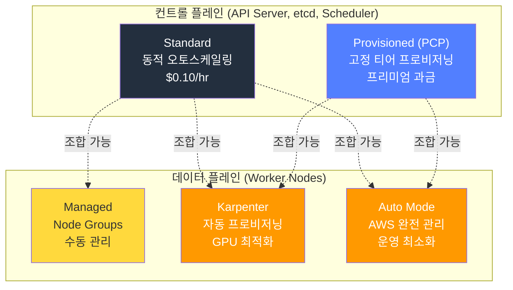

### Provisioned Control Plane (PCP)

**PCP**는 컨트롤 플레인 용량을 사전에 고정 티어로 프로비저닝하여, API 서버 성능의 일관성을 보장하는 프리미엄 옵션입니다.

```yaml
# PCP 클러스터 생성 예시
apiVersion: eks.amazonaws.com/v1
kind: Cluster
spec:
  controlPlaneScalingConfig:
    tier: tier-xl  # tier-xl / tier-2xl / tier-4xl / tier-8xl
```

#### PCP 티어 스펙

| Tier | API 동시성 (seats) | Pod 스케줄링 | etcd DB | SLA | 비용 |
|------|:-----------------:|:----------:|:------:|:---:|-----:|
| **Standard** | 동적 (AWS 자동 조정) | 동적 | 8GB | 99.95% | $0.10/hr |
| **XL** | 1,700 | 167/sec | 16GB | 99.99% | - |
| **2XL** | 3,400 | 283/sec | 16GB | 99.99% | - |
| **4XL** | 6,800 | 400/sec | 16GB | 99.99% | - |
| **8XL** | 13,600 | 400/sec | 16GB | 99.99% | - |

> 출처: [AWS EKS Provisioned Control Plane 공식 문서](https://docs.aws.amazon.com/eks/latest/userguide/eks-provisioned-control-plane.html) (K8s 1.30+ 기준). PCP 티어별 가격은 AWS 공식 가격 페이지를 참조하세요.

#### 티어 선택 기준: 메트릭 기반 판단

:::warning 워커 노드 수는 PCP 티어 선택 기준이 아닙니다
PCP 티어는 **Kubernetes 컨트롤 플레인 메트릭**을 기반으로 선택해야 합니다.
:::

**핵심 모니터링 메트릭:**

| 메트릭 | Prometheus 쿼리 | 판단 기준 |
|--------|----------------|----------|
| **API Inflight Seats** (가장 중요) | `apiserver_flowcontrol_current_executing_seats_total` | 1,200 seats 지속 초과 → XL 이상 |
| **Pod Scheduling Rate** | `scheduler_schedule_attempts_SCHEDULED` | 100/sec 이상 → XL, 200/sec 이상 → 2XL |
| **etcd DB Size** | `apiserver_storage_size_bytes` | 10GB 초과 → XL 이상 필요 |

:::info PCP vs Auto Mode — 서로 다른 레이어
**PCP**는 컨트롤 플레인 용량 옵션이고, **Auto Mode**는 데이터 플레인 관리 옵션입니다. 두 기능은 **조합하여 사용할 수 있습니다**.
:::

### 컨트롤 플레인 × 데이터 플레인 비교 및 조합

<EksClusterConfiguration />

:::tip AI 플랫폼 규모별 권장 구성
- **소규모 (PoC/데모)**: Standard + Auto Mode — 최소 운영 부담, 99.95% SLA
- **중규모 (프로덕션 추론)**: Standard + Karpenter — GPU 비용 최적화, 99.95% SLA
- **대규모 (엔터프라이즈 AI)**: PCP XL + Auto Mode — API seats ≤ 1,700, 99.99% SLA
- **초대규모 (학습 클러스터)**: PCP 4XL+ + Karpenter — API seats ≤ 6,800+, GPU 세밀 제어
:::

---

### Amazon EKS와 Karpenter: Kubernetes의 장점 극대화

**Amazon EKS와 Karpenter의 조합**은 Kubernetes의 장점을 극대화하여 완전 자동화된 최적의 인프라를 구현합니다.

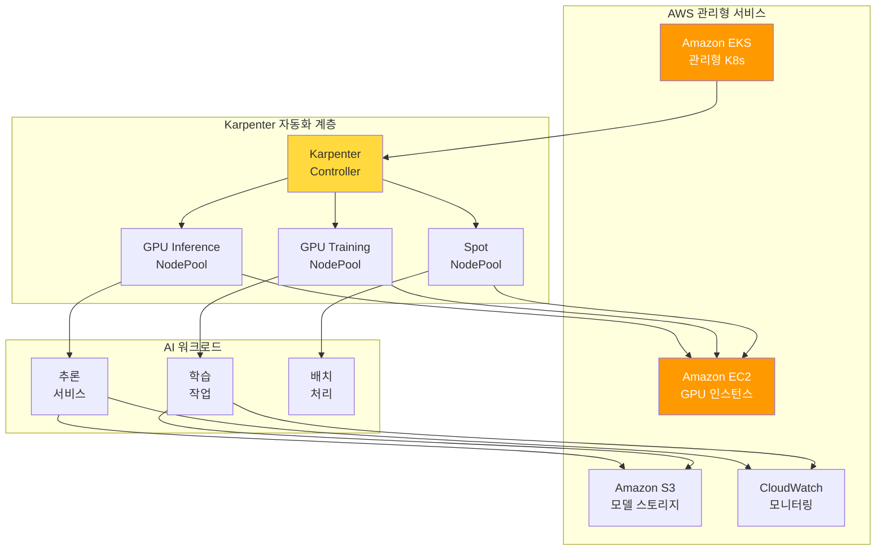

#### 왜 EKS + Karpenter인가?

<EksKarpenterLayers />

#### Karpenter: AI 인프라 자동화의 핵심

Karpenter는 기존 Cluster Autoscaler의 한계를 극복하고, **AI 워크로드에 최적화된 노드 프로비저닝**을 제공합니다.

:::info Karpenter v1.0+ GA
Karpenter는 **v1.0 이상에서 GA 상태**입니다. v1 API (`karpenter.sh/v1`)를 사용하세요.
:::

<ClusterAutoscalerVsKarpenter />

<KarpenterKeyFeatures />

### EKS Auto Mode: 완전 자동화의 완성

**EKS Auto Mode**는 Karpenter를 포함한 핵심 컴포넌트들을 자동으로 구성하고 관리합니다.

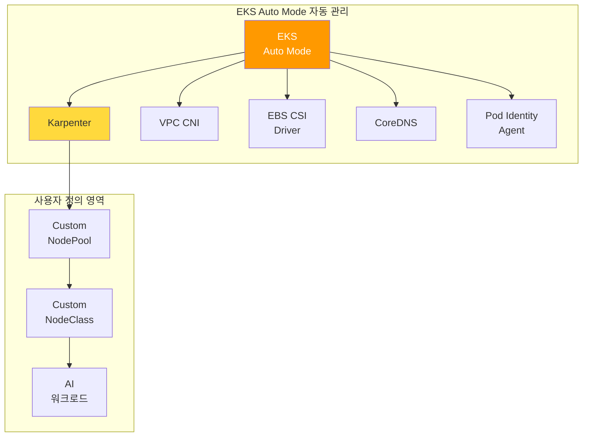

#### EKS Auto Mode vs 수동 구성 비교

<EksAutoModeVsStandard />

#### GPU 워크로드를 위한 EKS Auto Mode 설정

```yaml
# EKS Auto Mode에서 GPU NodePool 추가
apiVersion: karpenter.sh/v1
kind: NodePool
metadata:
  name: gpu-inference-pool
spec:
  template:
    metadata:
      labels:
        node-type: gpu-inference
        eks-auto-mode: "true"
    spec:
      requirements:
        - key: karpenter.sh/capacity-type
          operator: In
          values: ["spot", "on-demand"]
        - key: node.kubernetes.io/instance-type
          operator: In
          values:
            - g5.xlarge
            - g5.2xlarge
            - g5.4xlarge
            - g5.12xlarge
            - p4d.24xlarge
        - key: karpenter.k8s.aws/instance-gpu-count
          operator: Gt
          values: ["0"]
      nodeClassRef:
        group: karpenter.k8s.aws
        kind: EC2NodeClass
        name: default  # EKS Auto Mode 기본 NodeClass 활용
  limits:
    nvidia.com/gpu: 50
  disruption:
    consolidationPolicy: WhenEmptyOrUnderutilized
    consolidateAfter: 30s
```

:::tip EKS Auto Mode 권장 사항
EKS Auto Mode는 **새로운 AI 플랫폼 구축 시 권장되는 옵션**입니다.
- Karpenter 설치 및 구성 자동화로 **초기 구축 시간 80% 단축**
- 핵심 컴포넌트 자동 업그레이드로 **운영 부담 대폭 감소**
- GPU NodePool만 커스텀 정의하면 **즉시 AI 워크로드 배포 가능**
:::

:::info EKS Auto Mode와 GPU 지원
EKS Auto Mode는 NVIDIA GPU를 포함한 가속 컴퓨팅 인스턴스를 완벽히 지원합니다.

**re:Invent 2024/2025 신규 기능:**
- **EKS Hybrid Nodes (GA)**: 온프레미스 GPU 인프라를 EKS 클러스터에 통합
- **Enhanced Pod Identity v2**: 크로스 계정 IAM 역할 지원
- **Native Inferentia/Trainium Support**: Neuron SDK 자동 구성
- **Provisioned Control Plane**: 대규모 AI 학습 워크로드를 위한 사전 프로비저닝
:::

---

### Auto Mode에서 배포 가능한 Agentic AI 컴포넌트

EKS Auto Mode 위에서 Agentic AI 플랫폼의 모든 핵심 컴포넌트를 배포할 수 있습니다.

#### 추론: vLLM + llm-d

**vLLM**은 LLM 추론 전용 엔진이며, **llm-d**는 KV Cache 상태를 고려한 지능형 라우팅을 제공합니다.

:::info 모델 서빙 스택 구성
- **vLLM**: LLM 추론 전용 (GPT, Claude, Llama 등) — PagedAttention 기반 KV Cache 최적화
- **Triton Inference Server**: 비-LLM 추론 담당 (임베딩, 리랭킹, Whisper STT)
- **llm-d**: KV Cache-aware 라우팅으로 Prefix cache 히트율 극대화

상세 설정은 [vLLM 모델 서빙](../model-serving/vllm-model-serving.md) 및 [llm-d 분산 추론](../model-serving/llm-d-eks-automode.md)을 참조하세요.
:::

#### 게이트웨이: kgateway + Bifrost (2-Tier Gateway)

2-Tier Gateway 아키텍처로 트래픽 관리와 모델 라우팅을 분리합니다:
- **Tier 1 (kgateway)**: Gateway API 기반 인증, Rate Limiting, 트래픽 관리
- **Tier 2 (Bifrost)**: 모델 추상화, Fallback, 비용 추적, Cascade Routing

> 상세 아키텍처는 [Inference Gateway 라우팅](./inference-gateway-routing.md)을 참조하세요.

#### Agent: LangGraph + NeMo Guardrails + MCP/A2A

EKS에서 Agent 워크플로우는 다음으로 구성됩니다:

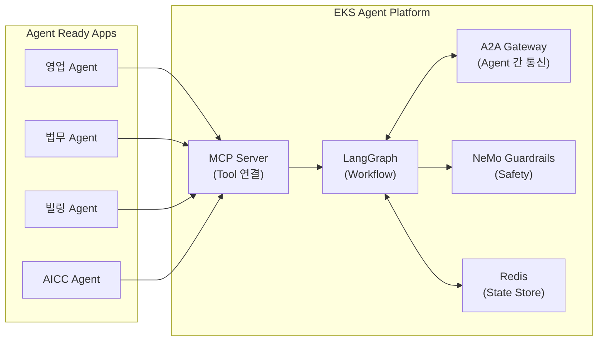

- **LangGraph**: 멀티스텝 Agent 워크플로우 정의, 조건부 분기, 병렬 실행
- **NeMo Guardrails**: 프롬프트 인젝션 방어, PII 유출 방지, 출력 검증
- **MCP**: Agent Ready 앱이 표준화된 방식으로 Tool 제공
- **A2A**: Agent 간 안전하고 효율적인 통신
- **Redis (ElastiCache)**: LangGraph checkpointer로 상태 관리

Agent Pod는 KEDA를 통해 Redis 큐 길이 기반으로 자동 스케일링됩니다.

> 상세 내용은 [Kagent Agent 관리](../operations-mlops/kagent-kubernetes-agents.md) 및 [AWS Native 플랫폼 — AgentCore & MCP](./aws-native-agentic-platform.md#mcp-프로토콜과-eks-통합)를 참조하세요.

#### RAG + 옵저버빌리티

- **Milvus**: 벡터 DB — RAG 시스템 핵심 ([상세](../operations-mlops/milvus-vector-database.md))
- **Langfuse**: 프로덕션 LLM 트레이싱, 토큰 비용 추적 (Self-hosted, MIT 라이선스)
- **Prometheus + Grafana**: 인프라 메트릭 모니터링

---

### EKS 기반 간편 배포

<DeploymentTimeComparison />

#### 솔루션별 EKS 배포 방법

<EksIntegrationBenefits />

#### 간편 배포 예시

```bash
# 1. EKS Auto Mode 클러스터 생성 (Karpenter 자동 포함)
eksctl create cluster --name ai-platform --region us-west-2 --auto-mode

# 2. GPU NodePool 추가
kubectl apply -f gpu-nodepool.yaml

# 3. AI Platform 솔루션 스택 배포
helm repo add kgateway https://kgateway.io/charts
helm repo add bifrost https://bifrost.dev/charts
helm repo add vllm https://vllm-project.github.io/helm
helm repo add langfuse https://langfuse.github.io/helm
helm repo update

# 4. Kgateway 설치
helm install kgateway kgateway/kgateway \
  -n ai-gateway --create-namespace

# 5. Bifrost 설치
helm install bifrost bifrost/bifrost \
  -n ai-inference --create-namespace

# 6. vLLM 설치
helm install vllm vllm/vllm \
  -n ai-inference \
  --set resources.limits."nvidia\.com/gpu"=1 \
  --set model.name="meta-llama/Llama-3-8B-Instruct"

# 7. Langfuse 설치
helm install langfuse langfuse/langfuse \
  -n observability --create-namespace

# 8. KEDA 설치 (EKS Addon)
aws eks create-addon \
  --cluster-name ai-platform \
  --addon-name keda
```

:::info GPU 비용 최적화 상세
Spot 인스턴스 활용, Consolidation, 시간대별 스케줄 기반 비용 관리 등 GPU 비용 최적화 전략은 [GPU 리소스 관리](../model-serving/gpu-resource-management.md) 문서를 참조하세요.
:::

:::info GPU 보안 및 트러블슈팅
GPU Pod 보안 정책, Network Policy, IAM, MIG 격리 및 GPU 트러블슈팅 가이드는 [EKS GPU 노드 전략](../model-serving/eks-gpu-node-strategy.md) 문서를 참조하세요.
:::

---

## Part 3: EKS Capability로 인프라 운영 부담 최소화

### EKS Capability란?

**EKS Capability**는 Amazon EKS에서 특정 워크로드를 효과적으로 운영하기 위해 **검증된 오픈소스 도구와 AWS 서비스를 통합하여 제공하는 플랫폼 수준의 기능**입니다.

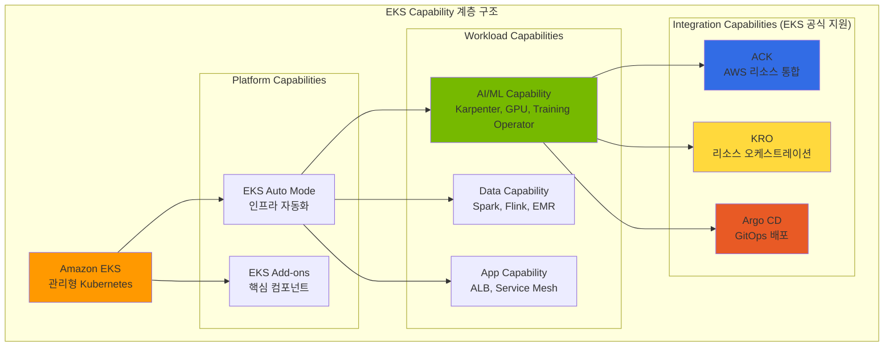

### Agentic AI를 위한 핵심 EKS Capability

<EksCapabilities />

:::warning Argo Workflows는 별도 설치 필요
**Argo Workflows**는 EKS Capability로 공식 지원되지 않으므로 **직접 설치가 필요**합니다.

```bash
kubectl create namespace argo
kubectl apply -n argo -f https://github.com/argoproj/argo-workflows/releases/download/v3.6.4/install.yaml
```
:::

---

### ACK (AWS Controllers for Kubernetes)

**ACK**는 Kubernetes Custom Resource를 통해 AWS 서비스를 직접 프로비저닝하고 관리합니다. **EKS Add-on으로 간편하게 설치**할 수 있습니다.

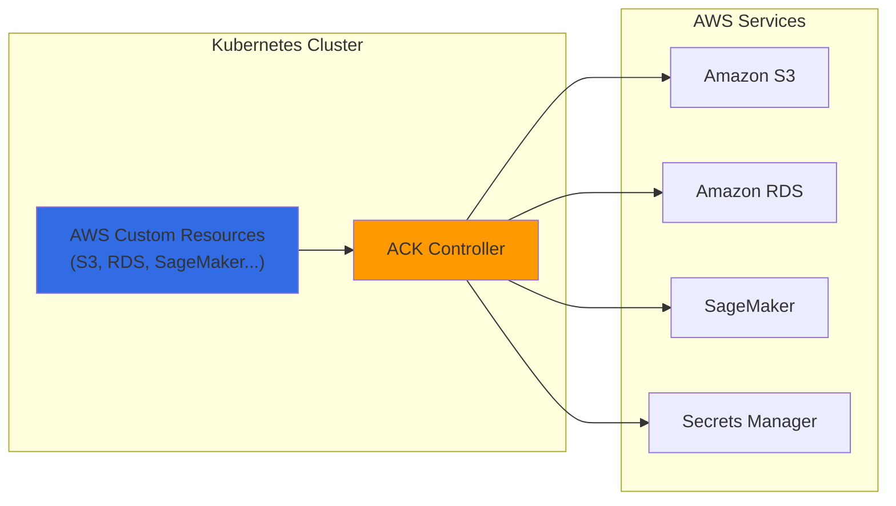

**AI 플랫폼에서 ACK 활용 사례:**

<AckControllers />

**ACK를 이용한 S3 버킷 생성 예시:**

```yaml
apiVersion: s3.services.k8s.aws/v1alpha1
kind: Bucket
metadata:
  name: agentic-ai-models
  namespace: ai-platform
spec:
  name: agentic-ai-models-prod
  versioning:
    status: Enabled
  encryption:
    rules:
    - applyServerSideEncryptionByDefault:
        sseAlgorithm: aws:kms
  tags:
  - key: Project
    value: agentic-ai
```

### KRO (Kubernetes Resource Orchestrator)

**KRO**는 여러 Kubernetes 리소스와 AWS 리소스를 **하나의 추상화된 단위로 조합**하여 복잡한 인프라를 단순하게 배포합니다.

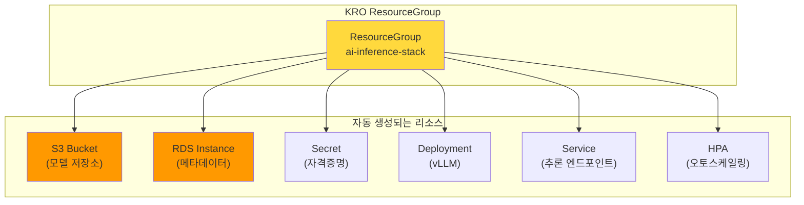

**KRO로 AI 추론 스택을 단일 리소스로 배포:**

```yaml
# 단일 리소스로 전체 스택 배포
apiVersion: v1alpha1
kind: AIInferenceStack
metadata:
  name: llama-inference
  namespace: ai-platform
spec:
  modelName: llama-3-70b
  gpuType: g5.12xlarge
  minReplicas: 2
  maxReplicas: 20
```

### Argo 기반 ML 파이프라인 자동화

**Argo Workflows**와 **Argo CD**를 결합하면 AI 모델의 학습, 평가, 배포까지 **전체 MLOps 파이프라인을 GitOps 방식으로 자동화**할 수 있습니다.

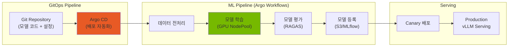

### ACK + KRO + ArgoCD 통합 아키텍처

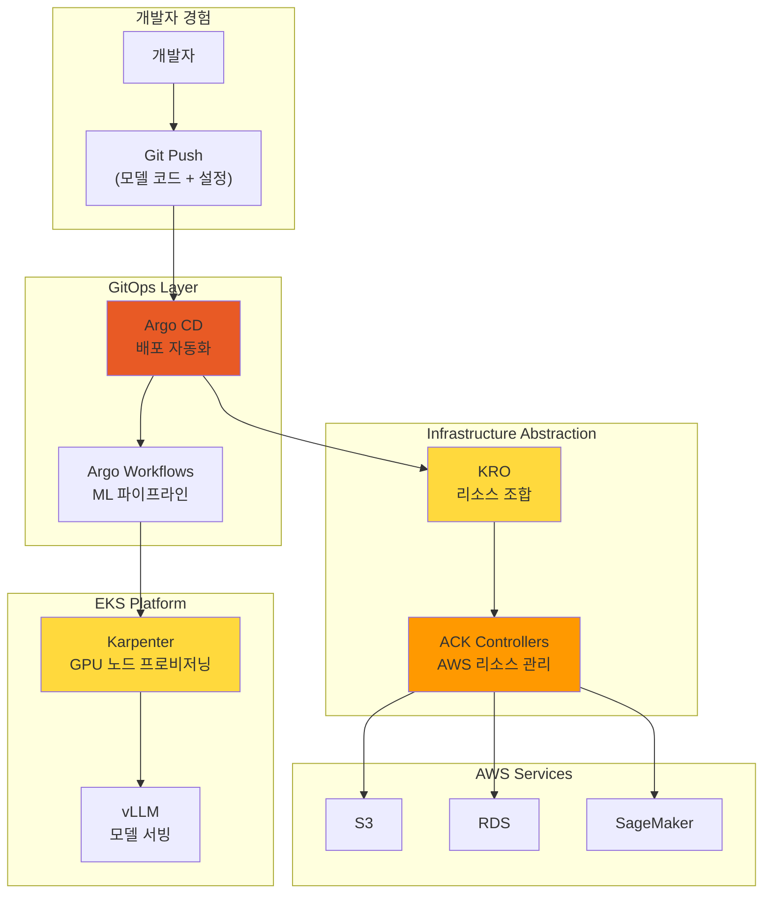

<AutomationComponents />

:::info 완전 자동화의 이점 — 인프라 운영을 EKS에 위임하고 Agent 개발에 집중
- **개발자**: Git push만으로 모델 배포
- **플랫폼 팀**: 인프라 관리 부담 최소화
- **비용 최적화**: 필요한 리소스만 동적 프로비저닝
- **일관성**: 모든 환경에서 동일한 배포 방식
:::

---

## Part 4: 결론 + 다음 단계

### 점진적 여정: AWS Native → Auto Mode → EKS Capability

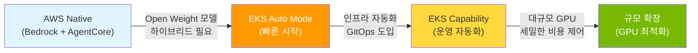

### EKS Auto Mode: 권장 시작점

<EksAutoModeBenefits />

### 도전과제별 해결 방안 요약

<ChallengeSolutionsSummary />

### EKS Auto Mode GPU 제약사항과 하이브리드 전략

EKS Auto Mode는 일반 워크로드와 기본 GPU 추론에 최적이지만, GPU 고급 기능에는 제약이 있습니다.

| 워크로드 유형 | Auto Mode 적합성 | 이유 |
|---|---|---|
| API Gateway, Agent Framework | 적합 | Non-GPU, 자동 스케일링 충분 |
| Observability Stack | 적합 | Non-GPU, 관리 부담 최소화 |
| 기본 GPU 추론 (전체 GPU) | 적합 | AWS 관리 GPU 스택으로 충분 |
| MIG 파티셔닝 필요 | **부적합** | NodeClass read-only로 MIG 분할 불가 (GPU Operator 자체는 설치 가능) |
| Run:ai GPU 스케줄링 | **가능** | GPU Operator 설치 후 Device Plugin 레이블 비활성화 |

**권장 하이브리드 구성**: Auto Mode(일반 워크로드) + Karpenter(GPU 고급 기능)를 하나의 클러스터에서 운영합니다. 상세 구성은 [EKS GPU 노드 전략](../model-serving/eks-gpu-node-strategy.md)을 참조하세요.

### Gateway API 제약 및 우회

EKS Auto Mode의 빌트인 로드밸런서는 Kubernetes Gateway API를 직접 지원하지 않습니다. kgateway를 사용하려면 별도의 Service (type: LoadBalancer)로 NLB를 프로비저닝합니다.

```yaml
apiVersion: v1
kind: Service
metadata:
  name: kgateway-proxy
  namespace: kgateway-system
  annotations:
    service.beta.kubernetes.io/aws-load-balancer-type: "external"
    service.beta.kubernetes.io/aws-load-balancer-nlb-target-type: "ip"
    service.beta.kubernetes.io/aws-load-balancer-scheme: "internet-facing"
spec:
  type: LoadBalancer
  selector:
    app: kgateway-proxy
  ports:
    - name: https
      port: 443
      targetPort: 8443
```

> 2-Tier Gateway 아키텍처의 전체 설계는 [LLM Gateway 2-Tier 아키텍처](./inference-gateway-routing.md)를 참조하세요.

### 핵심 권장사항

1. **EKS Auto Mode로 시작**: 새 클러스터는 Auto Mode로 생성하여 Karpenter 자동 구성 활용
2. **GPU 고급 기능은 Karpenter 노드**: MIG, Run:ai 등 GPU Operator 필요 시 Karpenter NodePool 추가
3. **GPU NodePool 커스텀 정의**: 워크로드 특성에 맞는 GPU NodePool 추가 (추론/학습/실험 분리)
4. **Spot 인스턴스 적극 활용**: 추론 워크로드의 70% 이상을 Spot으로 운영
5. **Consolidation 기본 활성화**: EKS Auto Mode에서 자동 활성화된 Consolidation 활용
6. **KEDA 연동**: 메트릭 기반 Pod 스케일링과 Karpenter 노드 프로비저닝 연계

### 배포 경로 선택하기

<Tabs>
<TabItem value="auto-mode" label="EKS Auto Mode (대부분에게 권장)">

**적합한 경우:**
- 스타트업 및 소규모 팀
- Kubernetes 초보 팀
- 표준 Agentic AI 워크로드

**시작하기:**

```bash
aws eks create-cluster \
  --name agentic-ai-auto \
  --region us-west-2 \
  --compute-config enabled=true
```

**장점:** 인프라 관리 부담 제로, AWS 최적화 기본 설정, 자동 보안 패치

</TabItem>
<TabItem value="karpenter" label="EKS + Karpenter (최대 제어)">

**적합한 경우:**
- 대규모 프로덕션 워크로드
- 복잡한 GPU 요구사항 (혼합 인스턴스 타입)
- 비용 최적화가 최우선

**시작하기:**

```bash
terraform apply -f eks-karpenter-blueprint/
kubectl apply -f karpenter-nodepools/
```

**장점:** 세밀한 인스턴스 제어, 최대 비용 최적화 (70-80% 절감), 커스텀 AMI

</TabItem>
<TabItem value="hybrid" label="하이브리드 (두 방식의 장점 결합)">

**적합한 경우:**
- 성장하는 플랫폼 (단순하게 시작, 복잡하게 확장)
- 혼합 워크로드 타입 (CPU 에이전트 + GPU LLM)

**시작하기:**

```bash
# 1단계: Auto Mode로 EKS 클러스터 생성
aws eks create-cluster --name agentic-ai --compute-config enabled=true

# 2단계: GPU 워크로드용 커스텀 NodePool 배포
kubectl apply -f gpu-nodepools.yaml
```

**장점:** 점진적 복잡도 증가, GPU 비용 최적화, AWS 관리형 + 커스텀 조합

</TabItem>
</Tabs>

### 규모 확장 시 참고 문서

| 영역 | 문서 | 내용 |
|------|------|------|
| GPU 노드 전략 | [EKS GPU 노드 전략](../model-serving/eks-gpu-node-strategy.md) | Auto Mode + Karpenter + Hybrid Node + 보안/트러블슈팅 |
| GPU 리소스 관리 | [GPU 리소스 관리](../model-serving/gpu-resource-management.md) | Karpenter 스케일링, KEDA, DRA, 비용 최적화 |
| NVIDIA GPU 스택 | [NVIDIA GPU 스택](../model-serving/nvidia-gpu-stack.md) | GPU Operator, DCGM, MIG, Time-Slicing |
| 모델 서빙 | [vLLM 모델 서빙](../model-serving/vllm-model-serving.md) | vLLM 설정, 성능 최적화 |
| 분산 추론 | [llm-d 분산 추론](../model-serving/llm-d-eks-automode.md) | KV Cache-aware 라우팅 |
| 학습 인프라 | [NeMo 프레임워크](../model-serving/nemo-framework.md) | 분산 학습, EFA 네트워크 |

---

## 참고 자료

### Kubernetes 및 인프라

- [Amazon EKS Documentation](https://docs.aws.amazon.com/eks/)
- [EKS Auto Mode](https://docs.aws.amazon.com/eks/latest/userguide/automode.html)
- [Karpenter Documentation](https://karpenter.sh/docs/)
- [KEDA - Kubernetes Event-driven Autoscaling](https://keda.sh/)

### 모델 서빙 및 게이트웨이

- [vLLM Documentation](https://docs.vllm.ai/)
- [llm-d Project](https://github.com/llm-d/llm-d)
- [Kgateway Documentation](https://kgateway.io/docs/)
- [Bifrost Documentation](https://bifrost.dev/docs)

### LLM Observability 및 Agent

- [Langfuse Documentation](https://langfuse.com/docs)
- [LangSmith Documentation](https://docs.smith.langchain.com/)
- [KAgent - Kubernetes Agent Framework](https://github.com/kagent-dev/kagent)
- [NVIDIA NeMo Framework](https://docs.nvidia.com/nemo-framework/user-guide/latest/overview.html)
