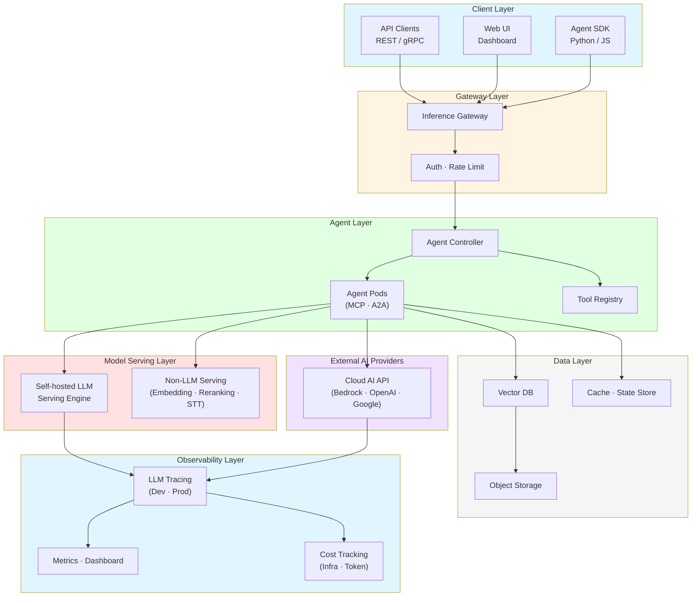
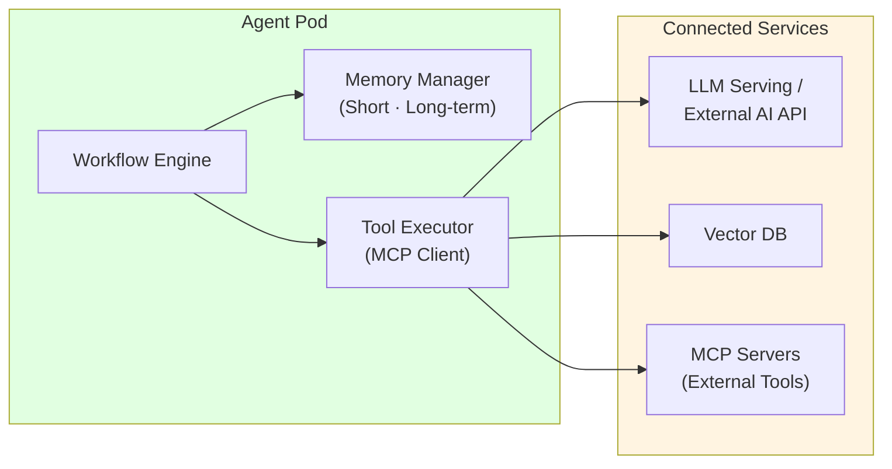
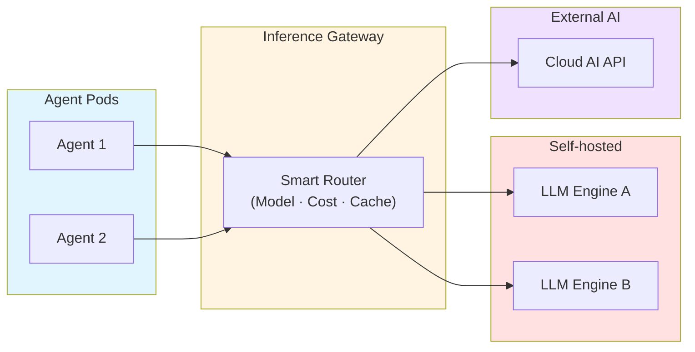
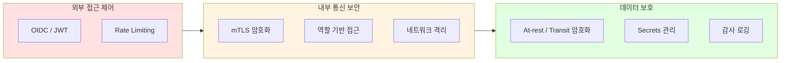
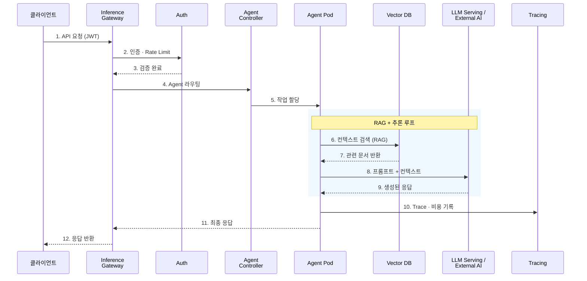

import { LayerRoles, TenantIsolation, RequestProcessing } from '@site/src/components/ArchitectureTables';

# Agentic AI Platform 아키텍처

> 📅 **작성일**: 2025-02-05 | **수정일**: 2026-03-20 | ⏱️ **읽는 시간**: 약 6분

## 개요

Agentic AI Platform은 자율적인 AI 에이전트가 복잡한 작업을 수행할 수 있도록 지원하는 통합 플랫폼입니다. 기존 GenAI 서비스 구축에서 직면하는 모델 서빙의 복잡성, 프레임워크 통합 부재, 자동 확장의 어려움, MLOps 자동화 부재, 비용 최적화 등의 과제를 해결하기 위해 설계되었습니다. 플랫폼은 **에이전트 오케스트레이션**, **지능형 추론 라우팅**, **벡터 검색 기반 RAG**, **LLM 트레이싱과 비용 분석**, **수평적 자동 확장**, **멀티 테넌트 리소스 격리**를 핵심 기능으로 제공하며, 각 도전과제에 대한 상세 분석은 [기술적 도전과제](./agentic-ai-challenges.md) 문서를 참조하세요.

:::info 대상 독자
이 문서는 솔루션 아키텍트, 플랫폼 엔지니어, DevOps 엔지니어를 대상으로 합니다. Kubernetes와 AI/ML 워크로드에 대한 기본적인 이해가 필요합니다.
:::

---

## 전체 시스템 아키텍처

Agentic AI Platform은 6개의 주요 레이어로 구성됩니다. 각 레이어는 명확한 책임을 가지며, 느슨한 결합을 통해 독립적인 확장과 운영이 가능합니다.

**핵심 설계 원칙:**

- **Self-hosted + External AI 하이브리드**: 자체 호스팅 LLM과 외부 AI Provider API를 동일한 게이트웨이에서 통합 관리
- **2-Tier Cost Tracking**: 인프라 레벨(모델 단가 × 토큰)과 애플리케이션 레벨(Agent 스텝별 비용) 이중 추적
- **MCP/A2A 표준 프로토콜**: Agent와 도구 간(MCP), Agent 간(A2A) 통신을 표준화하여 상호운용성 확보

### 레이어별 역할

<LayerRoles />

---

## 핵심 컴포넌트

### Agent Runtime

Agent Runtime은 AI 에이전트가 실행되는 환경입니다. 각 에이전트는 독립적인 컨테이너로 실행되며, Agent Controller에 의해 라이프사이클이 관리됩니다.

| 기능 | 설명 |
|------|------|
| **상태 관리** | 대화 컨텍스트 및 작업 상태 유지, 체크포인팅 |
| **도구 실행** | MCP 프로토콜로 등록된 도구를 비동기 실행 |
| **메모리 관리** | 단기 메모리(세션)와 장기 메모리(벡터 DB) 결합 |
| **Agent 간 통신** | A2A 프로토콜로 멀티 에이전트 협업 |
| **오류 복구** | 실패한 작업의 자동 재시도 및 폴백 |

### Tool Registry

에이전트가 사용할 수 있는 도구를 중앙에서 선언적으로 관리합니다. 각 도구는 MCP 서버로 노출되어 Agent가 표준 프로토콜로 호출합니다.

| 도구 유형 | 용도 | 예시 |
|----------|------|------|
| **API 도구** | 외부 REST/gRPC 서비스 호출 | CRM 조회, 주문 처리 |
| **검색 도구** | 벡터 DB 검색, 문서 검색 | RAG 컨텍스트 보강 |
| **코드 실행** | 샌드박스 환경에서 코드 실행 | 데이터 분석, 계산 |
| **A2A 도구** | 다른 Agent에 작업 위임 | 전문 Agent 협업 |

### Vector DB (RAG 저장소)

벡터 DB는 RAG 시스템의 핵심입니다. 문서를 임베딩 벡터로 변환하여 저장하고, Agent 요청 시 유사도 검색으로 관련 컨텍스트를 제공합니다.

**설계 고려사항:**
- **멀티 테넌트 격리**: Partition Key로 테넌트별 데이터 분리
- **인덱스 전략**: HNSW 인덱스로 고성능 Approximate Nearest Neighbor 검색
- **하이브리드 검색**: Dense Vector + Sparse Vector (BM25) 결합으로 검색 품질 향상

### Inference Gateway

Inference Gateway는 모델 추론 요청을 지능적으로 라우팅하는 핵심 컴포넌트입니다. Self-hosted LLM과 외부 AI Provider를 단일 엔드포인트로 통합합니다.

**라우팅 전략:**

| 전략 | 설명 |
|------|------|
| **모델 기반 라우팅** | 요청 헤더/파라미터에 따라 적절한 모델 백엔드로 분배 |
| **KV Cache-aware 라우팅** | LLM의 Prefix Cache 상태를 고려하여 TTFT 최소화 |
| **Cascade 라우팅** | 저비용 모델 우선 시도 → 실패 시 고성능 모델로 자동 전환 |
| **가중치 기반 라우팅** | Canary/Blue-Green 배포를 위한 트래픽 비율 분할 |
| **Fallback** | Provider 장애 시 대체 Provider로 자동 전환 |

---

## 배포 아키텍처

### 네임스페이스 구성

관심사 분리와 보안을 위해 기능별로 네임스페이스를 분리합니다.

| 네임스페이스 | 컴포넌트 | Pod Security | GPU |
|-------------|---------|-------------|-----|
| **ai-gateway** | Inference Gateway, Auth | restricted | - |
| **ai-agents** | Agent Controller, Agent Pods, Tool Registry | baseline | - |
| **ai-inference** | LLM Serving Engine, GPU Nodes | privileged | 필요 |
| **ai-data** | Vector DB, Cache | baseline | - |
| **observability** | Tracing, Metrics, Dashboard | baseline | - |

---

## 확장성 설계

### 수평적 확장 전략

각 컴포넌트는 독립적으로 수평 확장이 가능합니다.

| 컴포넌트 | 스케일링 트리거 | 방식 |
|---------|---------------|------|
| Agent Pod | 메시지 큐 길이, 활성 세션 수 | Event-driven Autoscaling |
| LLM Serving | GPU 사용률, 대기 큐 길이 | HPA + GPU Node Auto-provisioning |
| Vector DB | 쿼리 지연 시간, 인덱스 크기 | Query/Index Node 독립 확장 |
| Cache | 메모리 사용률 | Cluster 확장 |

### 멀티 테넌트 지원

여러 팀이나 프로젝트가 동일한 플랫폼을 공유할 수 있도록 네임스페이스 격리, 리소스 쿼터, 네트워크 정책을 조합한 멀티 테넌트를 지원합니다.

<TenantIsolation />

---

## 보안 아키텍처

Agentic AI Platform은 외부 접근, 내부 통신, 데이터 보안의 **3중 보안 레이어**를 적용합니다.

**Agent 특화 보안 고려사항:**

- **프롬프트 인젝션 방어**: 입력 검증 레이어(Guardrails)로 악의적 프롬프트 차단
- **도구 실행 권한 제한**: Agent별 호출 가능 도구를 선언적으로 정의, 최소 권한 원칙 적용
- **PII 유출 방지**: 출력 필터링으로 민감 정보 노출 차단
- **실행 시간 제한**: Agent 무한 루프 방지를 위한 타임아웃 및 최대 스텝 수 설정

:::danger 보안 주의사항
- 프로덕션 환경에서는 반드시 mTLS를 활성화하세요
- API 키와 토큰은 Secrets Manager에 저장하세요
- 정기적으로 보안 감사를 수행하고 취약점을 패치하세요
:::

---

## 데이터 플로우

사용자 요청이 플랫폼을 통해 처리되는 전체 흐름입니다.

<RequestProcessing />

---

## 모니터링 및 관측성

### 핵심 모니터링 영역

| 영역 | 대상 메트릭 | 목적 |
|------|-----------|------|
| **Agent Performance** | 요청 수, P50/P99 지연 시간, 오류율, 스텝 수 | 에이전트 성능 추적 |
| **LLM Performance** | 토큰 처리량, TTFT, TPS, 큐 대기 시간 | 모델 서빙 성능 |
| **Resource Usage** | CPU, 메모리, GPU 사용률/온도 | 리소스 효율성 |
| **Cost Tracking** | 테넌트별/모델별 토큰 비용, 인프라 비용 | 비용 거버넌스 |

**알림 규칙 예시:**
- Agent P99 지연 시간 > 10초 → Warning
- Agent 오류율 > 5% → Critical
- GPU 사용률 < 20% (30분 지속) → Cost Warning
- 토큰 비용 일일 예산 80% 도달 → Budget Warning

---

## 플랫폼 요구사항

| 영역 | 필요 역량 | 설명 |
|------|----------|------|
| 컨테이너 오케스트레이션 | 관리형 Kubernetes | GPU 노드 자동 프로비저닝, 선언적 워크로드 관리 |
| 네트워킹 | Gateway API 지원 | 지능형 모델 라우팅, mTLS, Rate Limiting |
| 모델 서빙 | LLM 추론 엔진 | PagedAttention, KV Cache 최적화, 분산 추론 |
| External AI 연동 | API Gateway / Proxy | 외부 AI Provider 통합, Fallback, 비용 추적 |
| Agent 프레임워크 | 워크플로우 엔진 | 멀티스텝 실행, 상태 관리, MCP/A2A 프로토콜 |
| 데이터 레이어 | 벡터 DB + 캐시 | RAG 검색, 세션 상태 저장, 장기 메모리 |
| 관측성 | LLM 트레이싱 + 메트릭 | 토큰 비용 추적, Agent Trace 분석, 품질 평가 |
| 보안 | 다층 보안 모델 | OIDC/JWT, RBAC, NetworkPolicy, Guardrails |

구체적인 기술 스택과 구현 방법은 [AWS Native 플랫폼](./aws-native-agentic-platform.md) 또는 [EKS 기반 오픈 아키텍처](./agentic-ai-solutions-eks.md)를 참조하세요.

---

## 결론

Agentic AI Platform 아키텍처의 핵심 원칙:

1. **모듈화**: 각 컴포넌트는 독립적으로 배포, 확장, 업데이트 가능
2. **하이브리드 AI**: Self-hosted LLM과 External AI Provider를 통합 관리
3. **표준 프로토콜**: MCP/A2A로 도구 연결과 Agent 간 통신을 표준화
4. **관측성**: 전체 요청 흐름의 Trace, 비용, 품질을 통합 모니터링
5. **보안**: 다층 보안 모델 + Agent 특화 보안(Guardrails, 도구 권한 제한)
6. **멀티 테넌트**: 네임스페이스 격리, 리소스 쿼터, 네트워크 정책으로 다중 팀 지원

:::tip 구현 가이드
이 플랫폼 아키텍처를 구현하는 구체적인 방법은 다음 문서에서 다룹니다:

- [기술적 도전과제](./agentic-ai-challenges.md) — 플랫폼 구축 시 직면하는 핵심 과제
- [AWS Native 플랫폼](./aws-native-agentic-platform.md) — 매니지드 서비스 기반 구현
- [EKS 기반 오픈 아키텍처](./agentic-ai-solutions-eks.md) — EKS + 오픈소스 기반 구현
:::

## 참고 자료

- [Kubernetes Gateway API](https://gateway-api.sigs.k8s.io/)
- [MCP (Model Context Protocol)](https://modelcontextprotocol.io/)
- [A2A (Agent-to-Agent Protocol)](https://google.github.io/A2A/)
