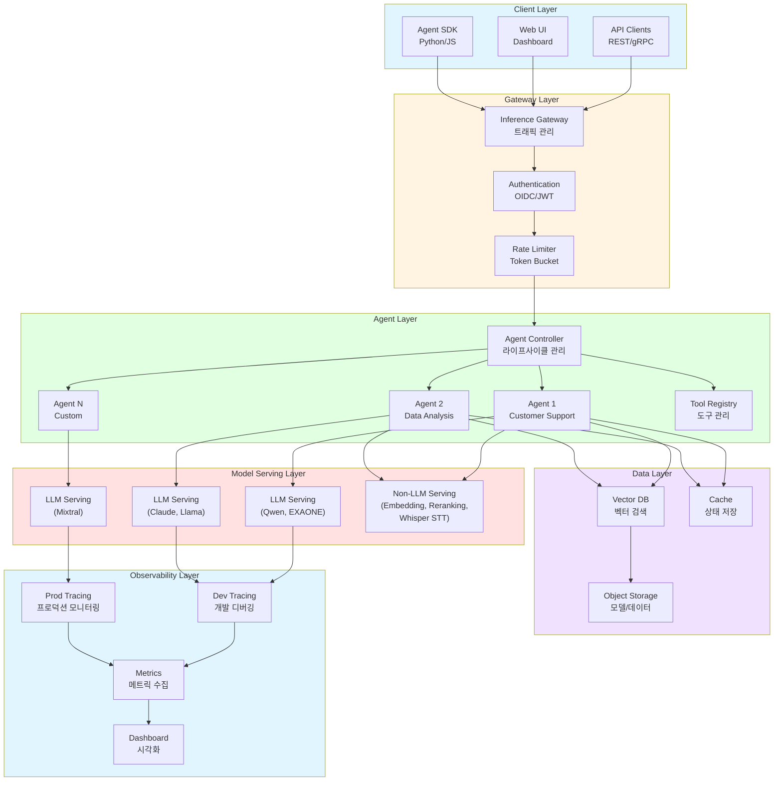
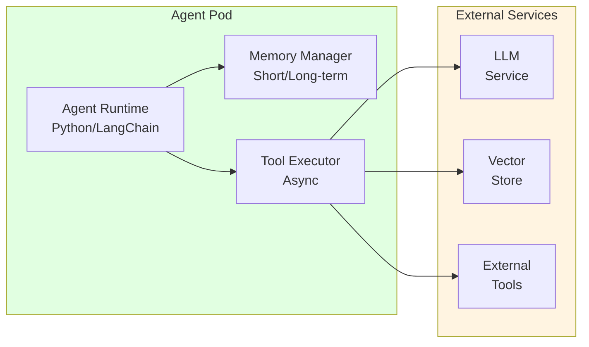
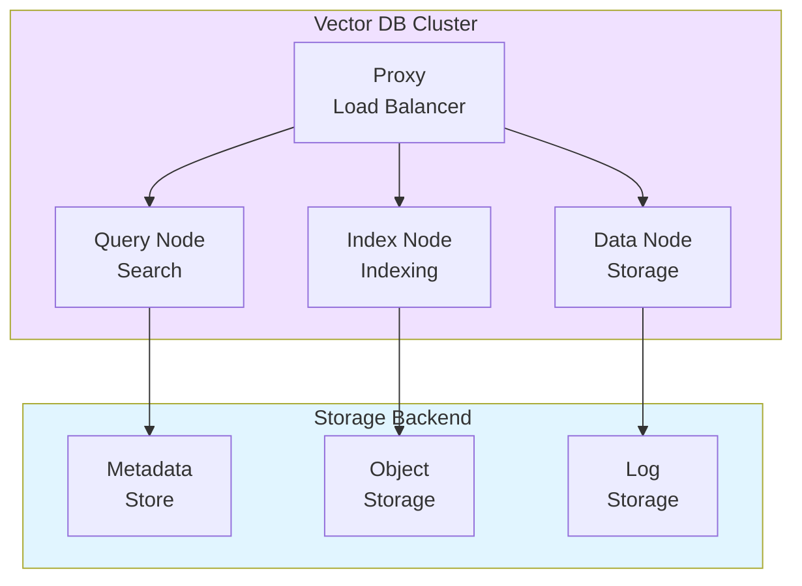
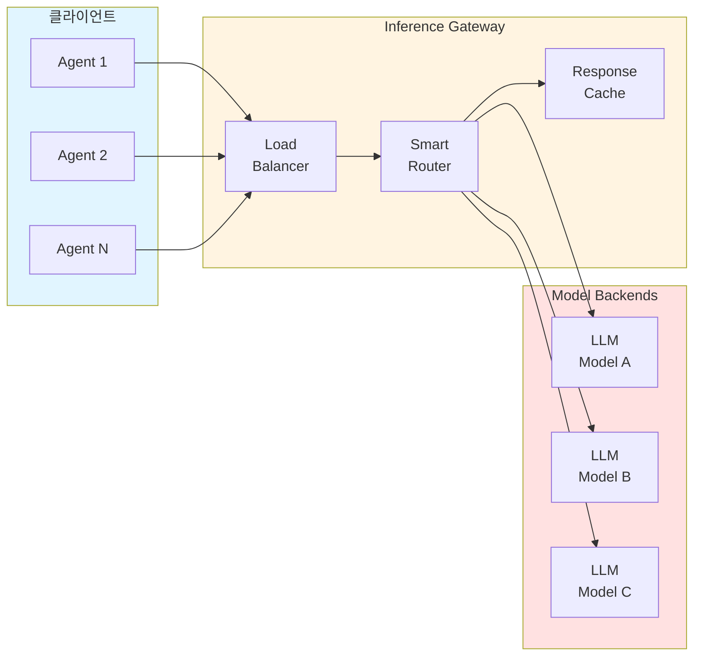
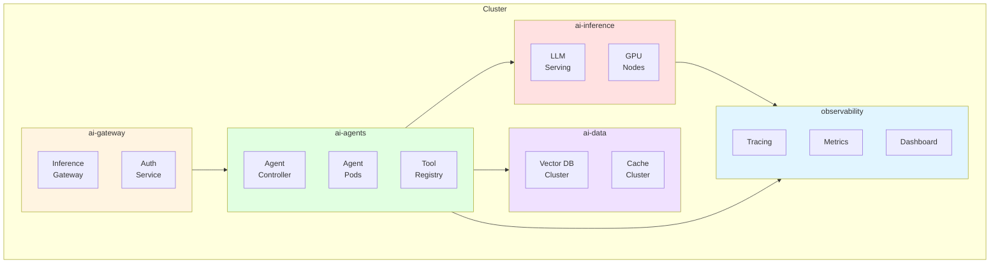
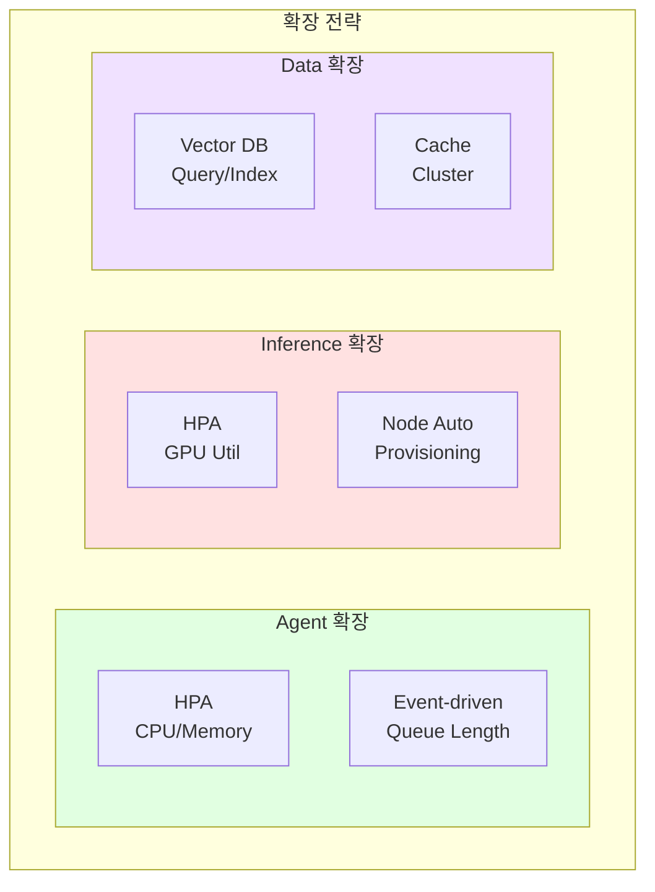
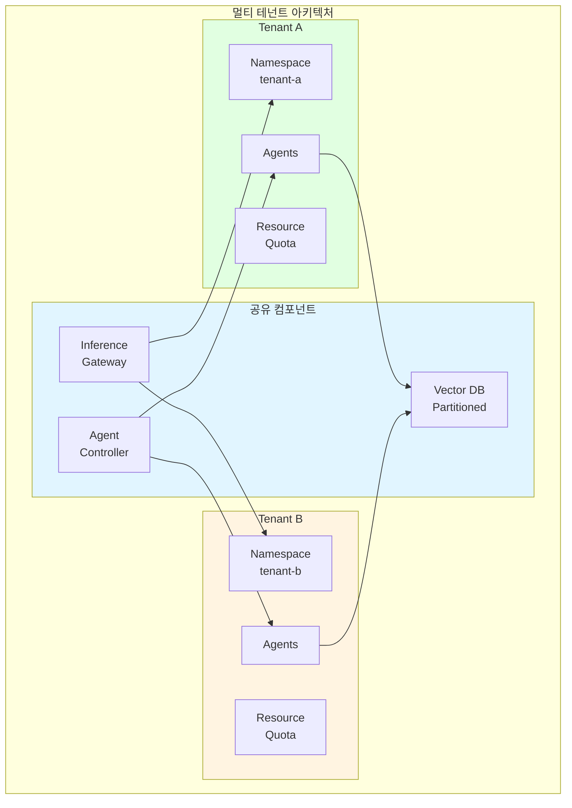
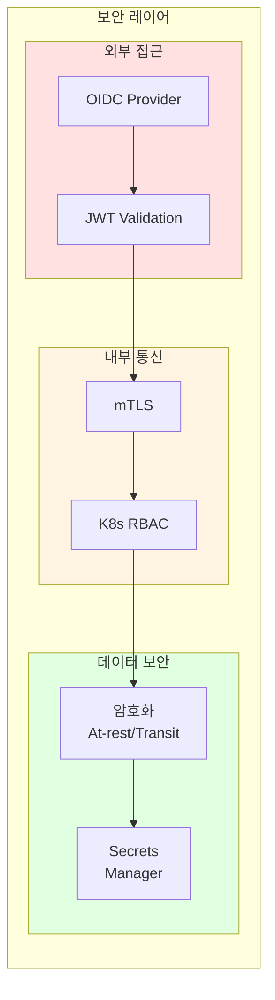
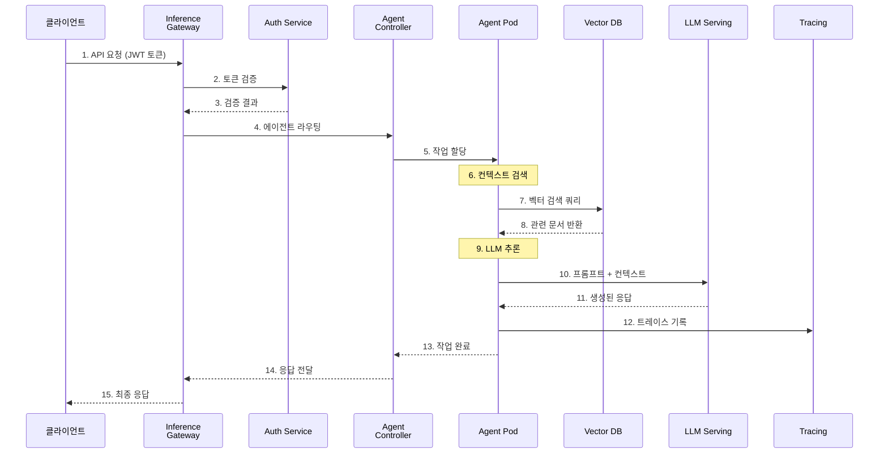

import { CoreCapabilities, LayerRoles, TenantIsolation, RequestProcessing, TechnologyStack } from '@site/src/components/ArchitectureTables';

# Agentic AI Platform 아키텍처

> 📅 **작성일**: 2025-02-05 | **수정일**: 2026-03-20 | ⏱️ **읽는 시간**: 약 6분

이 문서는 프로덕션급 Agentic AI Platform의 전체 시스템 아키텍처와 핵심 레이어를 다룹니다. 자율적으로 작업을 수행하는 AI 에이전트를 효율적으로 구축하고 운영하기 위한 플랫폼 설계를 제시합니다.

## 개요

Agentic AI Platform은 자율적인 AI 에이전트가 복잡한 작업을 수행할 수 있도록 지원하는 통합 플랫폼입니다.

### 해결하는 문제

기존 GenAI 서비스 구축 과정에서의 도전 과제:

- **AI 모델 서빙의 복잡성**: 다양한 모델의 배포 및 리소스 관리 어려움
- **통합 부족**: ML 프레임워크와 도구의 통합 부재
- **스케일링 문제**: 성능 최적화 및 자동 확장의 어려움
- **MLOps 자동화**: 배포 파이프라인 및 자동화 부재
- **비용 효율성**: 리소스 활용 최적화 방안 부재

각 도전과제에 대한 상세 분석은 [기술적 도전과제](./agentic-ai-challenges.md) 문서를 참조하세요.

### 핵심 기능

<CoreCapabilities />

:::info 대상 독자
이 문서는 솔루션 아키텍트, 플랫폼 엔지니어, DevOps 엔지니어를 대상으로 합니다. Kubernetes와 AI/ML 워크로드에 대한 기본적인 이해가 필요합니다.
:::

## 전체 시스템 아키텍처

Agentic AI Platform은 6개의 주요 레이어로 구성됩니다. 각 레이어는 명확한 책임을 가지며, 느슨한 결합을 통해 독립적인 확장과 운영이 가능합니다.

:::info 2-Tier Cost Tracking
플랫폼은 두 가지 수준의 비용 가시성을 제공합니다:

- **인프라 레벨**: 모델 가격 × 토큰 사용량 추적, 팀별 예산 관리
- **애플리케이션 레벨**: 에이전트 단계별 비용, 체인 레이턴시 분석

이 두 레이어의 결합으로 전체 비용 가시성을 확보할 수 있습니다.
:::

### 레이어별 역할

<LayerRoles />

## 핵심 컴포넌트

### Agent Runtime Layer

Agent Runtime Layer는 AI 에이전트가 실행되는 환경을 제공합니다. 각 에이전트는 독립적인 Pod로 실행되며, Agent Controller에 의해 관리됩니다.

**주요 기능:**

- **상태 관리**: 에이전트의 대화 컨텍스트 및 작업 상태 유지
- **도구 실행**: 등록된 도구를 비동기적으로 실행 (MCP/A2A 프로토콜 지원)
- **메모리 관리**: 단기/장기 메모리를 통한 컨텍스트 유지
- **오류 복구**: 실패한 작업의 자동 재시도 및 폴백

:::tip MCP/A2A 프로토콜
Agent Runtime은 MCP (Model Context Protocol)와 A2A (Agent-to-Agent) 프로토콜을 표준으로 지원합니다. MCP는 에이전트와 외부 도구 간의 통합을 단순화하며, A2A는 에이전트 간 협업을 위한 표준 인터페이스를 제공합니다.
:::

### Tool Registry

Tool Registry는 에이전트가 사용할 수 있는 도구들을 중앙에서 관리합니다. 도구는 선언적으로 정의되며, API, 데이터베이스 쿼리, 검색, 코드 실행 등 다양한 유형을 지원합니다.

**도구 정의 패턴:**

- **API 도구**: 외부 REST/gRPC 서비스 호출
- **검색 도구**: 벡터 DB 검색, 문서 검색
- **코드 실행 도구**: 샌드박스 환경에서 코드 실행
- **MCP 서버**: 표준 MCP 프로토콜로 도구 노출

### Memory Store (Vector DB)

벡터 DB는 RAG 시스템의 핵심인 벡터 저장소 역할을 합니다. 에이전트는 벡터 검색을 통해 관련 문서를 검색하고 컨텍스트를 보강합니다.

**설계 고려사항:**
- **멀티 테넌트**: Partition Key로 테넌트별 데이터 격리
- **인덱스 전략**: HNSW 인덱스로 고성능 유사도 검색
- **메트릭 타입**: Cosine Similarity 기반 검색 최적화

### Inference Gateway

Inference Gateway는 AI 모델 추론 요청을 지능적으로 라우팅합니다. Gateway API 표준을 기반으로 모델별, 버전별, 가중치 기반 라우팅을 지원합니다.

**라우팅 전략:**
- **모델 기반 라우팅**: 요청 헤더에 따라 적절한 모델로 분배
- **가중치 기반 라우팅**: Canary/Blue-Green 배포를 위한 트래픽 분할
- **KV Cache-aware 라우팅**: LLM의 캐시 상태를 고려한 지능형 분배
- **Cascade 라우팅**: 저비용 모델 우선 시도 후 고성능 모델로 자동 전환

---

## 배포 아키텍처

### 네임스페이스 구성 전략

Agentic AI Platform은 관심사 분리와 보안을 위해 기능별로 네임스페이스를 분리합니다.

**네임스페이스별 보안 정책:**

| 네임스페이스 | Pod Security Standard | GPU 액세스 | 용도 |
|-------------|----------------------|-----------|------|
| ai-gateway | restricted | 불필요 | 인증, 라우팅 |
| ai-agents | baseline | 불필요 | Agent 실행, 도구 관리 |
| ai-inference | privileged | 필요 | GPU 기반 모델 서빙 |
| ai-data | baseline | 불필요 | 벡터 DB, 캐시 |
| observability | baseline | 불필요 | 모니터링, 트레이싱 |

---

## 확장성 설계

### 수평적 확장 전략

Agentic AI Platform의 각 컴포넌트는 독립적으로 수평 확장이 가능합니다.

**확장 패턴:**

| 컴포넌트 | 스케일링 트리거 | 방식 |
|---------|---------------|------|
| Agent Pod | Redis 큐 길이, 활성 세션 수 | Event-driven (KEDA) |
| LLM Serving | GPU 사용률, 대기 큐 길이 | HPA + Node Auto-provisioning |
| Vector DB | 쿼리 지연 시간, 인덱스 크기 | Query/Index Node 독립 확장 |
| Cache | 메모리 사용률 | Cluster 확장 |

### 멀티 테넌트 지원

Agentic AI Platform은 여러 팀이나 프로젝트가 동일한 플랫폼을 공유할 수 있도록 멀티 테넌트를 지원합니다.

#### 테넌트 격리 전략

<TenantIsolation />

---

## 보안 아키텍처

### 다층 보안 모델

Agentic AI Platform은 외부 접근, 내부 통신, 데이터 보안의 3중 보안 레이어를 적용합니다.

**보안 원칙:**

- **인증**: OIDC/JWT 기반 외부 접근 제어
- **인가**: Kubernetes RBAC로 역할 기반 접근 관리 (Agent 운영자, 뷰어 분리)
- **통신 보안**: mTLS로 서비스 간 통신 암호화
- **네트워크 격리**: NetworkPolicy로 네임스페이스 간 트래픽 제한
- **데이터 보호**: At-rest/In-transit 암호화, Secrets Manager 연동
- **감사**: 모든 API 호출 및 Agent 행동 감사 로깅

:::danger 보안 주의사항

- 프로덕션 환경에서는 반드시 mTLS를 활성화하세요
- API 키와 토큰은 Kubernetes Secrets 또는 Secrets Manager에 저장하세요
- 정기적으로 보안 감사를 수행하고 취약점을 패치하세요

:::

---

## 데이터 플로우

다음 다이어그램은 사용자 요청이 플랫폼을 통해 처리되는 전체 흐름을 보여줍니다.

### 요청 처리 단계

<RequestProcessing />

---

## 모니터링 및 관측성

### 핵심 모니터링 영역

| 영역 | 대상 메트릭 | 목적 |
|------|-----------|------|
| **Agent Performance** | 요청 수, 지연 시간, 오류율 | 에이전트 성능 추적 |
| **LLM Performance** | 토큰 처리량, 추론 시간, TTFT | 모델 서빙 성능 |
| **Resource Usage** | CPU, 메모리, GPU 사용률 | 리소스 효율성 |
| **Cost Tracking** | 테넌트별/모델별 토큰 비용 | 비용 거버넌스 |

**알림 규칙 예시:**
- Agent P99 지연 시간 > 10초 → Warning
- Agent 오류율 > 5% → Critical
- GPU 사용률 < 20% (30분 지속) → Cost Warning

:::tip 매니지드 모니터링
관리 오버헤드를 줄이기 위해 매니지드 모니터링 서비스(Amazon Managed Prometheus + Managed Grafana 등)를 활용하면 자동 스케일링과 고가용성을 확보할 수 있습니다.
:::

---

## 기술 스택

<TechnologyStack />

:::info 버전 호환성
- **Kubernetes 1.33+**: Stable sidecar containers, topology-aware routing, in-place resource resizing
- **Kubernetes 1.34+**: Projected service account tokens, improved DRA, enhanced resource quota
- **Gateway API v1.2.0+**: HTTPRoute 및 GRPCRoute 향상된 기능 지원
:::

## 결론

Agentic AI Platform 아키텍처는 다음과 같은 핵심 원칙을 따릅니다:

1. **모듈화**: 각 컴포넌트는 독립적으로 배포, 확장, 업데이트 가능
2. **확장성**: 네이티브 스케일링으로 트래픽 변화에 유연하게 대응
3. **관측성**: 전체 요청 흐름을 추적하고 분석할 수 있는 통합 모니터링
4. **보안**: 다층 보안 모델로 데이터와 서비스 보호
5. **멀티 테넌트**: 리소스 격리와 공정한 분배를 통한 다중 팀 지원

:::tip 구현 가이드
이 플랫폼 아키텍처를 구현하는 구체적인 방법은 다음 문서에서 다룹니다:

- [기술적 도전과제](./agentic-ai-challenges.md) — 플랫폼 구축 시 직면하는 핵심 과제
- [AWS Native 플랫폼](./aws-native-agentic-platform.md) — 매니지드 서비스 기반 구현
- [EKS 기반 오픈 아키텍처](./agentic-ai-solutions-eks.md) — EKS + 오픈소스 기반 구현
:::

## 참고 자료

- [Kubernetes Gateway API](https://gateway-api.sigs.k8s.io/)
- [MCP (Model Context Protocol)](https://modelcontextprotocol.io/)
- [A2A (Agent-to-Agent Protocol)](https://google.github.io/A2A/)
- [Milvus Documentation](https://milvus.io/docs)
