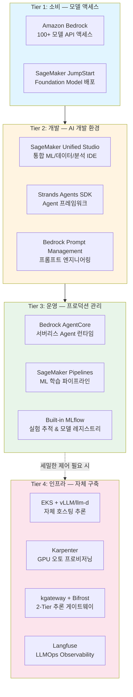
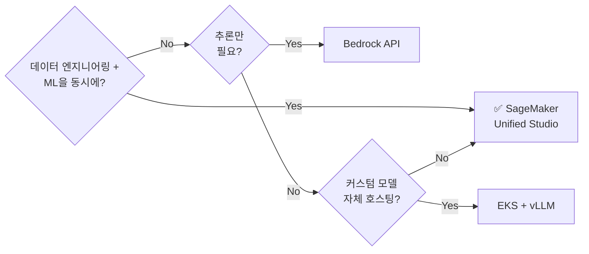
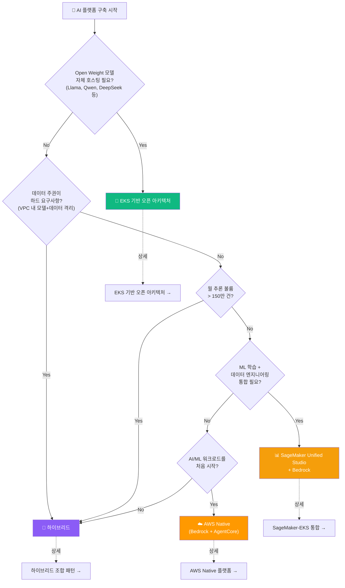
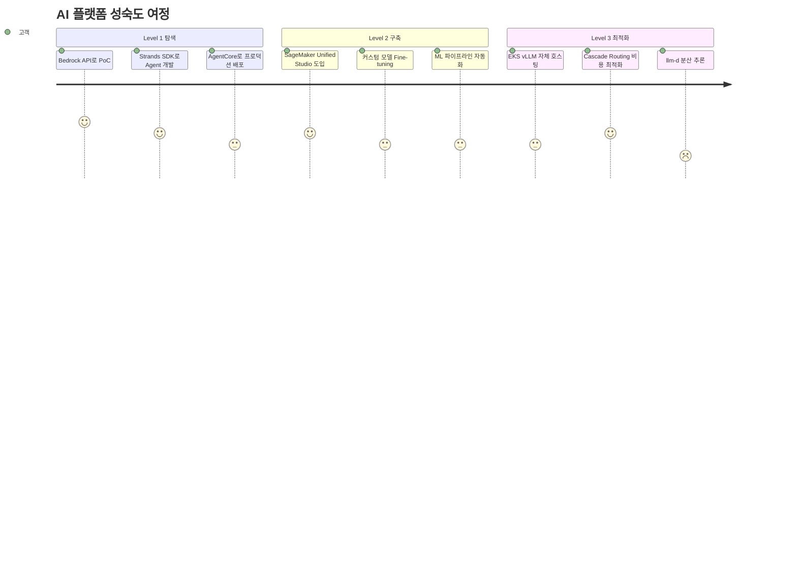
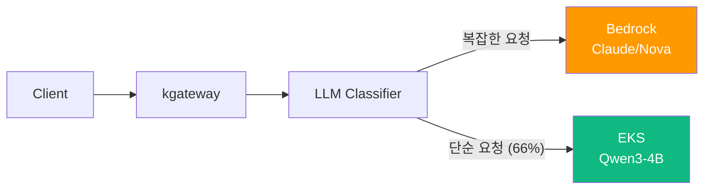
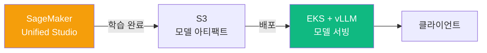
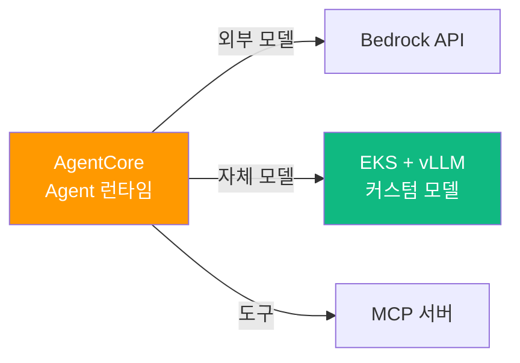

import { PlatformComparisonMatrix, MaturityPathTable, HybridPatternSummary } from '@site/src/components/DecisionFrameworkTables';

# AI 플랫폼 선택 가이드

> 📅 **작성일**: 2026-04-15 | ⏱️ **읽는 시간**: 약 15분

고객이 AI를 직접 개발하려 할 때 가장 먼저 직면하는 질문은 "매니지드 서비스를 쓸 것인가, 오픈소스로 직접 구축할 것인가?"입니다. 이 문서는 **SageMaker Unified Studio**, **Bedrock AgentCore**, **EKS 기반 오픈 아키텍처** 중 고객 상황에 맞는 최적 접근을 선택할 수 있도록 의사결정 프레임워크를 제공합니다.

AI 플랫폼 구축 경로는 크게 3가지로 나뉩니다:

- **(A) AWS 매니지드**: Bedrock + Strands SDK + AgentCore로 인프라 운영 없이 시작
- **(B) EKS + 오픈소스**: vLLM, llm-d, Langfuse 등 자체 호스팅으로 최대 제어권 확보
- **(C) 하이브리드**: Bedrock과 EKS를 조합하여 비용·통제·속도의 균형 달성

:::info 선행 문서
이 문서를 읽기 전에 다음 문서를 먼저 참조하세요:
- [플랫폼 아키텍처](./agentic-platform-architecture.md) — 6개 핵심 레이어 설계 청사진
- [기술적 도전과제](./agentic-ai-challenges.md) — 5가지 핵심 과제 분석
:::

---

## AWS AI 플랫폼 서비스 랜드스케이프

AWS AI 서비스는 4개의 Tier로 계층화됩니다. 고객은 하위 Tier에서 시작하여 필요에 따라 상위 Tier로 이동합니다.

**Tier 구분의 핵심**:
- **Tier 1-3**: AWS 매니지드 서비스로 인프라 운영 없이 시작할 수 있습니다.
- **Tier 4**: 세밀한 제어, 비용 최적화, 데이터 주권이 필요할 때 선택합니다.
- **대부분의 고객은 Tier 1에서 시작하여 점진적으로 확장**하며, 엔터프라이즈는 Tier 3과 Tier 4를 하이브리드로 조합하는 경향이 있습니다.

---

## SageMaker Unified Studio

### 통합 AI 개발 환경

**SageMaker Unified Studio**는 2024년 하반기에 출시된 통합 AI 개발 환경으로, ML/데이터/분석 작업을 하나의 IDE에서 수행할 수 있도록 설계되었습니다. 기존에는 SageMaker Studio Classic, Athena, Glue Studio 등 분산된 도구를 개별적으로 사용해야 했지만, Unified Studio는 이를 하나로 통합합니다.

### 핵심 차별점

| 기능 | 설명 | 기존 대비 개선 |
|------|------|--------------|
| **통합 IDE** | JupyterLab + SQL 편집기 + 노코드 인터페이스 | SageMaker Studio Classic 대비 데이터+ML 통합 |
| **Built-in MLflow** | 실험 추적, 모델 레지스트리, 모델 비교 | 별도 MLflow 서버 운영 불필요 |
| **Lakehouse 통합** | Apache Iceberg 테이블, Glue Catalog 네이티브 연동 | 데이터 엔지니어링 → ML 파이프라인 원스톱 |
| **거버넌스 협업** | Amazon DataZone 기반 IAM 공유, 데이터 계보 추적 | 팀 간 안전한 데이터/모델 공유 |
| **통합 컴퓨팅** | 학습, 노트북, 파이프라인을 단일 환경에서 관리 | 리소스 파편화 방지 |

### 포지셔닝: 언제 선택하는가?

:::tip 핵심 메시지
SageMaker Unified Studio는 **개발 환경(Tier 2)**입니다. Bedrock(추론)이나 EKS(서빙)와 **보완 관계**이며, 특히 데이터 팀과 ML 팀이 하나의 플랫폼에서 협업해야 할 때 가장 큰 가치를 제공합니다.
:::

---

## 플랫폼 비교 매트릭스

고객의 상황에 따라 최적 접근이 다릅니다. 5가지 핵심 평가축으로 각 플랫폼 옵션을 비교합니다.

<PlatformComparisonMatrix />

:::info 비용 상세 분석
자체 호스팅과 Bedrock의 상세 비용 비교(손익분기점, Cascade Routing 절감 효과)는 [코딩 도구 비용 분석](../reference-architecture/coding-tools-cost-analysis.md)을 참고하세요.
:::

---

## 의사결정 플로우차트

고객 미팅에서 활용할 수 있는 의사결정 흐름입니다. 핵심 질문에 답하면서 최적 접근을 찾아갑니다.

:::warning 플로우차트는 출발점입니다
이 플로우차트는 대화의 시작점이지, 최종 결론이 아닙니다. 실제 고객 상황은 복합적이며, 대부분의 엔터프라이즈는 **하이브리드 접근**으로 수렴합니다.
:::

---

## 고객 성숙도별 권장 경로

고객의 현재 AI/ML 성숙도에 따라 시작점과 확장 경로가 달라집니다.

<MaturityPathTable />

**각 레벨별 상세 가이드**:
- **Level 1 (탐색)**: → [AWS Native 플랫폼](./aws-native-agentic-platform.md)
- **Level 2 (구축)**: → [SageMaker-EKS 통합](../reference-architecture/sagemaker-eks-integration.md)
- **Level 3 (최적화)**: → [EKS 기반 오픈 아키텍처](./agentic-ai-solutions-eks.md), [추론 게이트웨이](../reference-architecture/inference-gateway-routing.md)

---

## 하이브리드 조합 패턴

대부분의 엔터프라이즈는 단일 접근이 아닌 하이브리드로 수렴합니다. 검증된 4가지 조합 패턴입니다.

<HybridPatternSummary />

### 패턴 1: Bedrock + EKS SLM (Cascade Routing)

**사용 시점**: 월 추론 볼륨이 50만 건을 초과하며, 요청의 60-70%가 단순 작업(코드 완성, 번역, 요약)인 경우

**핵심 가치**: Bedrock API의 품질을 유지하면서 비용을 40-60% 절감

**참고**: [추론 게이트웨이 & Cascade Routing](../reference-architecture/inference-gateway-routing.md)

---

### 패턴 2: SageMaker 학습 + EKS 서빙

**사용 시점**: 커스텀 모델을 학습하고, 추론 비용을 최소화하려는 경우

**핵심 가치**: SageMaker의 관리형 학습 환경 + EKS의 비용 효율적 서빙

**참고**: [SageMaker-EKS 통합](../reference-architecture/sagemaker-eks-integration.md)

---

### 패턴 3: AgentCore + 자체 모델

**사용 시점**: Agent 런타임은 서버리스로 운영하되, 특정 도메인 모델은 자체 호스팅하려는 경우

**핵심 가치**: AgentCore의 서버리스 운영성 + 커스텀 모델의 도메인 정확도

**참고**: [AWS Native 플랫폼](./aws-native-agentic-platform.md)

---

### 패턴 4: Full Stack (SageMaker + Bedrock + EKS)

가장 복잡하지만 최대 유연성을 제공하는 패턴입니다:
- **데이터 & 학습**: SageMaker Unified Studio + Pipelines
- **프로덕션 추론**: Bedrock API (고신뢰 작업) + EKS vLLM (고볼륨 작업)
- **Agent 런타임**: AgentCore (서버리스) + Kagent (Kubernetes 네이티브)
- **Observability**: CloudWatch (매니지드) + Langfuse (자체 호스팅)

이 패턴은 대규모 엔터프라이즈에서 팀별로 다른 요구사항을 충족하기 위해 선택합니다. 아키텍처 복잡도가 높으므로, 명확한 운영 책임 경계와 서비스 카탈로그가 필수입니다.

**참고**: 하이브리드 아키텍처의 기술적 구현은 [SageMaker-EKS 통합](../reference-architecture/sagemaker-eks-integration.md)을 참고하세요.

---

## 비용 시뮬레이션 요약

월 추론 볼륨에 따른 최적 옵션과 예상 비용입니다.

| 월 추론 볼륨 | 최적 옵션 | 예상 월 비용 | 비고 |
|-------------|----------|------------|------|
| ~10만 건 | Bedrock API | ~$300-500 | GPU 관리 불필요, 가장 빠른 시작 |
| ~50만 건 | Bedrock + Cascade | ~$800-1,200 | SLM으로 단순 요청 분리 시작 |
| ~150만 건 | 하이브리드 전환점 | ~$2,500-3,500 | 자체 호스팅 손익분기 근접 |
| ~500만 건+ | EKS 자체 호스팅 | ~$3,500-5,000 | Spot + Cascade로 60%+ 절감 |

:::info 상세 비용 분석
구체적인 인스턴스 비용, Spot 절감률, Cascade Routing 효과에 대한 상세 분석은 [코딩 도구 비용 분석](../reference-architecture/coding-tools-cost-analysis.md)을 참고하세요.
:::

---

## 고객 Discovery 체크리스트

고객 미팅에서 최적 접근을 파악하기 위한 10가지 핵심 질문입니다.

1. **현재 AI/ML 워크로드를 운영하고 있습니까?** *→ 성숙도 레벨 판단*
2. **월간 추론 요청 규모는 어느 정도입니까?** *→ 비용 최적화 경로*
3. **Open Weight 모델 자체 호스팅이 필요합니까?** *→ EKS 필요성*
4. **데이터 주권 또는 VPC 격리 요구사항이 있습니까?** *→ 자체 호스팅/하이브리드*
5. **팀 내 Kubernetes 운영 경험이 있습니까?** *→ 운영 부담 평가*
6. **ML 학습과 데이터 엔지니어링을 함께 수행합니까?** *→ SageMaker Unified Studio*
7. **월 예산 범위는 어느 정도입니까?** *→ 비용 구조 매칭*
8. **프로덕션 배포 목표 시점은 언제입니까?** *→ Time-to-Value 경로*
9. **멀티클라우드 또는 온프레미스 하이브리드 요구가 있습니까?** *→ EKS Hybrid Nodes*
10. **현재 사용 중인 AWS 서비스는 무엇입니까?** *→ 기존 투자 활용*

---

## 관련 문서

### 설계 & 아키텍처
- [플랫폼 아키텍처](./agentic-platform-architecture.md) — 6개 핵심 레이어 설계 청사진
- [기술적 도전과제](./agentic-ai-challenges.md) — 5가지 핵심 과제 분석
- [AWS Native 플랫폼](./aws-native-agentic-platform.md) — Bedrock + Strands SDK + AgentCore 상세
- [EKS 기반 오픈 아키텍처](./agentic-ai-solutions-eks.md) — EKS Auto Mode + 오픈소스 스택 상세
- [추론 게이트웨이 & Cascade Routing](../reference-architecture/inference-gateway-routing.md) — 2-Tier Gateway 아키텍처

### Reference Architecture
- [SageMaker-EKS 통합](../reference-architecture/sagemaker-eks-integration.md) — 하이브리드 ML 파이프라인 구현
- [코딩 도구 비용 분석](../reference-architecture/coding-tools-cost-analysis.md) — Bedrock vs 자체 호스팅 손익분기 분석
- [커스텀 모델 배포](../reference-architecture/custom-model-deployment.md) — vLLM 배포 실전 가이드
