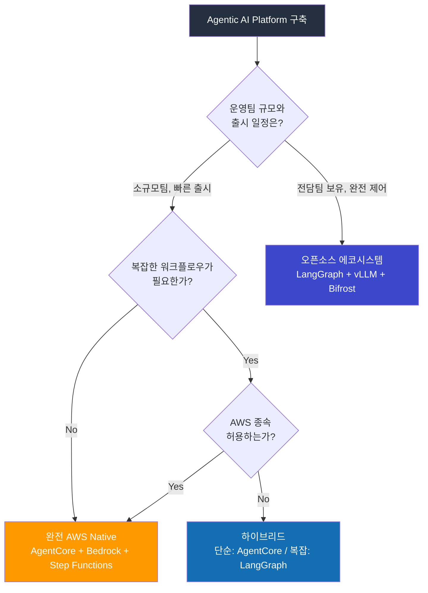

# AWS Native Agentic AI Platform

> **작성일**: 2026-03-18 | **상태**: Draft

## 목적

LangChain/LangGraph 중심의 오픈소스 에코시스템을 AWS Native 서비스로 대체할 수 있는 아키텍처를 제시한다. 운영 부담 감소, 컴포넌트 통합, 매니지드 서비스 활용이 핵심 목표이다.

:::info 기본 전제
AWS Native 전환은 **운영 부담 감소**와 **빠른 출시**가 최우선일 때 적합하다. 멀티클라우드, 벤더 종속 회피, 추론 엔진 세밀 제어가 필요하면 오픈소스 에코시스템을 유지한다.
:::

---

## 컴포넌트 매핑

### 전체 비교표

| 역할 | LangChain 에코시스템 | AWS Native 대체 | 비고 |
|------|---------------------|-----------------|------|
| 에이전트 런타임 | LangChain | **Strands Agents SDK** + AgentCore | Strands는 AWS 오픈소스 에이전트 프레임워크 |
| 워크플로우 오케스트레이션 | LangGraph | **Step Functions** + AgentCore | 시각적 워크플로우, Task Token 기반 Human-in-the-loop |
| RAG 파이프라인 | RAG Chain + Milvus | **Bedrock Knowledge Bases** | 문서 파싱, 청킹, 임베딩, 검색 통합 |
| 벡터 DB | Milvus | **OpenSearch Serverless** / Aurora pgvector | Bedrock Knowledge Bases와 네이티브 통합 |
| LLM 라우팅/폴백 | Bifrost / LiteLLM | **AgentCore 라우팅** + Bedrock Cross-Region Inference | 매니지드 폴백, 프로비저닝 처리량 |
| 가드레일 | NeMo Guardrails | **Bedrock Guardrails** | PII 필터, 프롬프트 인젝션 방어, 커스텀 정책 |
| 프롬프트 관리 | Langfuse | **Bedrock Prompt Management** | 버전 관리, A/B 테스트 |
| 평가 | DeepEval | **Bedrock Model Evaluation** | LLM-as-a-judge, 배치 평가 |
| 옵저버빌리티 (Dev) | LangSmith | **CloudWatch + X-Ray (ADOT)** | 트레이스, 메트릭, 로그 통합 |
| 옵저버빌리티 (Prod) | Langfuse | **CloudWatch + X-Ray** + Bedrock Invocation Logging | |
| MCP 도구 연결 | 직접 구축 | **AgentCore MCP 커넥터** | 네이티브 MCP/A2A 지원 |
| 피드백/라벨링 | Langfuse + Label Studio | **Bedrock Human Evaluation** + SageMaker Ground Truth | |
| 모델 서빙 | vLLM on EKS | **Bedrock** 온디맨드/프로비저닝 + Custom Model Import | |
| 모델 레지스트리 | MLflow | **SageMaker Model Registry** | |

---

## 아키텍처 비교

### AS-IS: LangChain 에코시스템 (EKS 자체 구축)

```
CloudFront → NLB → kgateway → FastAPI
  → LangChain / LangGraph (에이전트 오케스트레이션)
  → Bifrost (LLM 라우팅) → llm-d → vLLM
  → RAG Chain → Milvus (벡터 검색)
  → NeMo Guardrails (안전)
  → Langfuse / LangSmith (옵저버빌리티)
  → DeepEval (평가)

자체 운영 Pod: ~15개+
```

### TO-BE: AWS Native

```
CloudFront → NLB → kgateway → FastAPI
  → Strands Agents SDK (에이전트 런타임, 앱 내장)
  → AgentCore (매니지드 에이전트 + MCP + 라우팅)
  → Bedrock (추론)
  → Bedrock Knowledge Bases (RAG + OpenSearch Serverless)
  → Bedrock Guardrails (안전)
  → Step Functions (복잡한 워크플로우)
  → CloudWatch + X-Ray (옵저버빌리티)
  → Bedrock Evaluation (평가)

자체 운영 Pod: ~3개 (kgateway, FastAPI, Strands)
```

### 제거되는 컴포넌트

| 제거 대상 | AWS Native 대체 | 절감 |
|----------|----------------|------|
| LangChain Pod | Strands SDK (앱 내장) | Pod 1개 |
| LangGraph Pod + Redis | Step Functions (서버리스) | Pod 2개 |
| Bifrost/LiteLLM Pod | AgentCore 라우팅 | Pod 1개 |
| NeMo Guardrails Pod | Bedrock Guardrails (API) | Pod 1개 |
| Langfuse Pod + RDS | CloudWatch + X-Ray | Pod 2개 + DB |
| Milvus 클러스터 | OpenSearch Serverless | Pod 3개+ |
| DeepEval Pod | Bedrock Evaluation (API) | Pod 1개 |
| vLLM + llm-d + GPU 노드 | Bedrock 추론 | Pod 4개+ + GPU |
| **합계** | | **~15+ Pod + GPU 노드 제거** |

---

## 레이어별 상세

### 1. 에이전트 런타임: Strands Agents SDK + AgentCore

**Strands Agents SDK**는 AWS가 오픈소스로 공개한 에이전트 프레임워크로, LangChain의 AWS Native 대안이다.

```python
# LangChain (AS-IS)
from langchain.agents import AgentExecutor
from langchain_openai import ChatOpenAI

agent = AgentExecutor(
    agent=create_react_agent(llm, tools, prompt),
    tools=tools,
)
result = agent.invoke({"input": "서울 날씨 알려줘"})

# Strands Agents SDK (TO-BE)
from strands import Agent
from strands.models import BedrockModel

agent = Agent(
    model=BedrockModel(model_id="anthropic.claude-3-5-sonnet"),
    tools=tools,
)
result = agent("서울 날씨 알려줘")
```

| 항목 | LangChain | Strands SDK |
|------|-----------|-------------|
| 라이선스 | MIT | Apache 2.0 |
| AWS 서비스 통합 | 어댑터 필요 | 네이티브 |
| AgentCore 배포 | 불가 | 네이티브 |
| MCP 지원 | 직접 구축 | 빌트인 |
| 커뮤니티 | 매우 큼 | 성장 중 |

### 2. 워크플로우: Step Functions (LangGraph 대체)

```
LangGraph (AS-IS):
  Python 코드로 그래프 노드/엣지 정의 → 인메모리 실행 → Redis 상태 저장

Step Functions (TO-BE):
  시각적 워크플로우 편집기 또는 ASL JSON으로 정의 → 매니지드 실행 → 자동 상태 관리
```

#### Step Functions 워크플로우 예시

```json
{
  "StartAt": "ClassifyIntent",
  "States": {
    "ClassifyIntent": {
      "Type": "Task",
      "Resource": "arn:aws:lambda:...:classify-agent",
      "Next": "RouteByIntent"
    },
    "RouteByIntent": {
      "Type": "Choice",
      "Choices": [
        {
          "Variable": "$.intent",
          "StringEquals": "RAG",
          "Next": "RAGAgent"
        },
        {
          "Variable": "$.intent",
          "StringEquals": "ToolUse",
          "Next": "ToolAgent"
        }
      ],
      "Default": "SimpleResponse"
    },
    "RAGAgent": {
      "Type": "Task",
      "Resource": "arn:aws:bedrock:...:agent/...",
      "Next": "Validate"
    },
    "ToolAgent": {
      "Type": "Task",
      "Resource": "arn:aws:bedrock:...:agent/...",
      "Next": "HumanApproval"
    },
    "HumanApproval": {
      "Type": "Task",
      "Resource": "arn:aws:states:::sqs:sendMessage.waitForTaskToken",
      "Next": "Validate"
    },
    "Validate": {
      "Type": "Task",
      "Resource": "arn:aws:lambda:...:validate",
      "Retry": [{"ErrorEquals": ["States.ALL"], "MaxAttempts": 3}],
      "Next": "Done"
    },
    "SimpleResponse": {
      "Type": "Task",
      "Resource": "arn:aws:bedrock:...:agent/...",
      "Next": "Done"
    },
    "Done": {
      "Type": "Succeed"
    }
  }
}
```

| 항목 | LangGraph | Step Functions |
|------|:---------:|:--------------:|
| 분기/루프 | Python 코드 | Choice/Map State |
| Human-in-the-loop | interrupt() | Task Token (네이티브) |
| 재시도/에러 | 직접 구현 | Retry/Catch (빌트인) |
| 상태 관리 | Redis/Checkpointer | 매니지드 (자동) |
| 스텝 간 레이턴시 | &lt;1ms (인메모리) | ~50-100ms |
| 시각적 디버깅 | LangSmith 필요 | Step Functions 콘솔 (빌트인) |
| 병렬 실행 | 직접 구현 | Map State (자동) |
| 비용 | EKS Pod | $0.025/1000 상태 전환 |

### 3. RAG: Bedrock Knowledge Bases (Milvus + RAG Chain 대체)

```
AS-IS:
  문서 → Unstructured.io → BGE-M3 (Triton) → Milvus → RAG Chain → LLM

TO-BE:
  문서 → S3 → Bedrock Knowledge Bases (자동 파싱/청킹/임베딩/인덱싱) → Bedrock → LLM
```

| 항목 | 자체 구축 | Bedrock Knowledge Bases |
|------|----------|------------------------|
| 문서 파싱 | Unstructured.io | 빌트인 |
| 임베딩 | Triton (BGE-M3) | Bedrock Embedding 모델 |
| 벡터 저장 | Milvus 클러스터 | OpenSearch Serverless (매니지드) |
| 검색 | 직접 구현 | 빌트인 (하이브리드 검색) |
| 운영 Pod | 5개+ | 0개 |

### 4. 가드레일: Bedrock Guardrails (NeMo 대체)

```
AS-IS: 요청 → NeMo Guardrails Pod → LLM → NeMo Guardrails Pod → 응답
TO-BE: 요청 → Bedrock Guardrails (API) → LLM → Bedrock Guardrails (API) → 응답
```

| 기능 | NeMo Guardrails | Bedrock Guardrails |
|------|:-:|:-:|
| PII 필터링 | 직접 구현 | 빌트인 |
| 프롬프트 인젝션 방어 | 직접 구현 | 빌트인 |
| 토픽 제한 | Colang 스크립트 | 콘솔 설정 |
| 커스텀 정책 | Python 코드 | Regex + LLM 기반 |
| 운영 | Pod 배포/관리 | API 호출 |

### 5. 옵저버빌리티: CloudWatch + X-Ray (Langfuse/LangSmith 대체)

| 기능 | Langfuse/LangSmith | CloudWatch + X-Ray |
|------|:------------------:|:------------------:|
| LLM 호출 트레이싱 | 네이티브 | Bedrock Invocation Logging |
| 비용 추적 | 빌트인 | CloudWatch 메트릭 + Cost Explorer |
| 프롬프트 버전 관리 | 빌트인 | Bedrock Prompt Management |
| 세션 추적 | 빌트인 | X-Ray 트레이스 그룹 |
| 평가/스코어링 | 빌트인 | Bedrock Model Evaluation |
| **LLM 특화 UI** | **우수** | **범용 (LLM 특화 부족)** |
| 커스텀 대시보드 | 빌트인 | CloudWatch Dashboard 직접 구성 |

:::warning 옵저버빌리티 트레이드오프
CloudWatch + X-Ray는 인프라 옵저버빌리티에 강하지만, Langfuse/LangSmith의 **LLM 특화 UI** (프롬프트 비교, 세션 재생, 평가 워크플로우)를 완전히 대체하기 어렵다. 하이브리드 구성에서는 Langfuse를 유지하는 것을 권장한다.
:::

---

## 비용 비교

### 월간 예상 비용 (50 req/s 기준)

| 항목 | LangChain 에코시스템 (EKS) | AWS Native |
|------|-------------------------:|----------:|
| GPU 인스턴스 (g5.2xlarge x4) | ~$4,800 | - |
| EKS 클러스터 | $73 | $73 |
| 오픈소스 Pod (15개+) | ~$500 | - |
| Milvus 스토리지 | ~$200 | - |
| Langfuse RDS | ~$150 | - |
| Bedrock 추론 (50 req/s) | - | ~$3,000-5,000 |
| OpenSearch Serverless | - | ~$700 |
| Step Functions | - | ~$50 |
| Bedrock Knowledge Bases | - | ~$200 |
| CloudWatch/X-Ray | ~$50 | ~$100 |
| **합계** | **~$5,773** | **~$4,123-6,123** |

:::note 비용은 트래픽 패턴에 따라 달라진다
소규모 트래픽에서는 AWS Native가 유리하고, 대규모 트래픽에서는 자체 구축이 유리하다. 정확한 손익분기점은 [추론 플랫폼 벤치마크](../../benchmarks/agentcore-vs-eks-inference.md)에서 검증한다.
:::

---

## 의사결정 플로차트



---

## 하이브리드 구성 (추천)

완전 전환보다는 **에이전트 복잡도에 따라 분리**하는 것이 현실적이다.

```
단순 에이전트 (빌링, FAQ, AICC):
  → AgentCore + Bedrock Knowledge Bases + Bedrock Guardrails
  → 운영 부담 없음, 즉시 배포

복잡 에이전트 (영업, 법무, Agent Builder):
  → LangGraph on EKS + vLLM + llm-d
  → 완전 제어, 커스텀 워크플로우

공통 인프라:
  → kgateway (라우팅 분기: 단순 → AgentCore, 복잡 → LangGraph)
  → Bifrost (LLM 라우팅, 비용 추적) — 복잡 에이전트용
  → CloudWatch + X-Ray (인프라 옵저버빌리티)
  → Langfuse (LLM 특화 옵저버빌리티) — 선택적
```

---

## 마이그레이션 경로

### Phase 1: 신규 단순 에이전트를 AWS Native로

- 신규 빌링/FAQ 에이전트를 AgentCore + Strands SDK로 개발
- 기존 LangChain 에이전트는 그대로 유지
- 리스크 최소, 병행 운영

### Phase 2: RAG 파이프라인 전환

- Milvus → OpenSearch Serverless 마이그레이션
- RAG Chain → Bedrock Knowledge Bases
- 검색 품질 A/B 테스트로 검증

### Phase 3: 옵저버빌리티 통합

- Langfuse/LangSmith → CloudWatch + X-Ray + Bedrock Logging
- LLM 특화 기능 부족 시 Langfuse 유지 (하이브리드)

### Phase 4: 복잡 에이전트 판단

- LangGraph 워크플로우를 Step Functions으로 전환 가능한지 평가
- 레이턴시 요구사항 충족 시 전환, 아니면 유지
