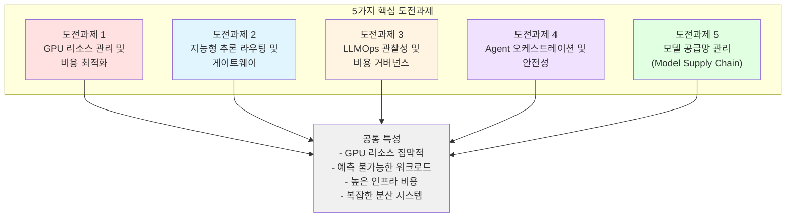
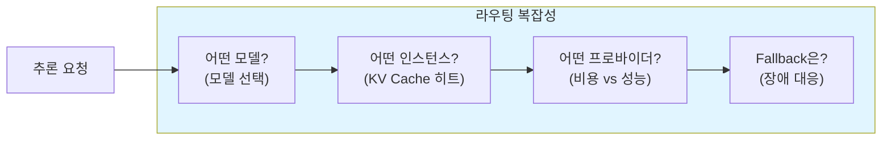
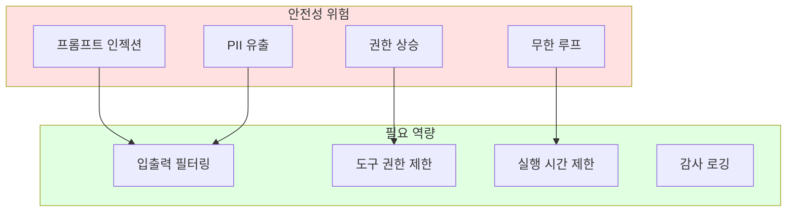
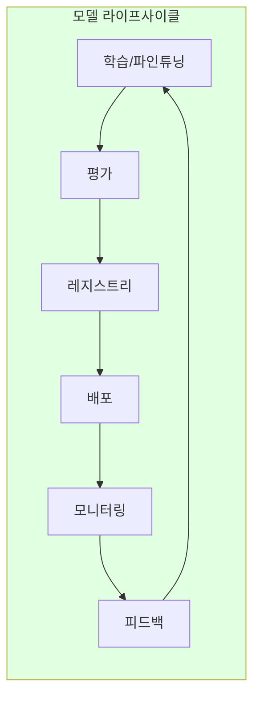

import { ChallengeSummary } from '@site/src/components/AgenticChallengesTables';

## 소개

에이전트는 사용자 요청 하나를 처리하는 동안 모델을 여러 번 호출하고, 검색이나 외부 API 호출을 이어갈 수 있습니다. 따라서 요청의 지연과 비용을 이해하려면 개별 호출뿐 아니라 전체 처리 흐름을 살펴봐야 합니다. 이 문서는 모델을 실행할 자원, 요청 라우팅, 관측과 비용 관리, 도구 실행의 안전성, 모델 업데이트를 차례로 설명합니다.

:::info 선행 문서
이 문서를 읽기 전에 [플랫폼 아키텍처](./agentic-platform-architecture.md)에서 Agentic AI Platform의 전체 구조를 먼저 확인하세요.
:::

## 작업에 맞는 모델을 선택하는 기준 {#왜-단일-llm만으로는-부족한가}

모든 요청에 같은 모델을 사용하면 배포와 운영을 단순하게 유지할 수 있습니다. 그 모델이 목표 품질·지연·비용을 충족하는지 먼저 측정하세요. 짧은 분류 작업과 복잡한 추론 작업의 요구가 다르다면, 작업별로 모델을 나누는 방식을 비교할 수 있습니다. 이때 확인할 기준은 다음과 같습니다.

### 기업 실무에서 경험하는 단일 LLM의 4가지 한계

| 한계 영역 | 기업이 겪는 문제 | 플랫폼 대응 |
|----------|---------------|-----------|
| **비용** | 70B+ 모델의 토큰 과금은 대량 트래픽 시 월 수천만 원에 달하며, 에이전트 내부의 도구 호출·포맷팅 등 단순 작업에도 동일 비용이 발생합니다. 실제 연구에 따르면 에이전트 LLM 호출의 **40~70%는 SLM으로 대체 가능**합니다. | **Bifrost 2-Tier 라우팅**으로 단순 호출은 자체 호스팅 SLM, 복잡한 추론만 LLM으로 분리 |
| **성능 · 지연** | 거대 모델은 응답 지연(TTFT)이 길어 실시간 상담(AICC)이나 대화형 에이전트에서 사용자 경험을 저하시킵니다. 도메인 특화 SLM은 동일 작업에서 **10배 이상 빠른 응답**이 가능합니다. | **3-Tier Orchestration** — Tier 1(SLM 직접)은 ~50ms, Tier 2(LLM)는 복잡한 추론에만 사용 |
| **정보 정확성** | LLM의 환각(hallucination)은 구조적 특성이며, 요금 계산·약관 검증 등 정확성이 요구되는 업무에서는 치명적입니다. 트랜스포머 아키텍처는 복잡한 산술과 논리 연산에 본질적 한계를 가집니다. | **Tool Delegation** — 산술은 규칙 엔진, 팩트 검증은 Knowledge Graph에 위임. LLM은 자연어 이해에만 집중 |
| **거버넌스 · 보안** | 민감 데이터(PII/PHI)가 외부 LLM API로 유출될 위험, 에이전트의 자율적 행동에 대한 감사 추적, 팀별 접근 제어와 예산 관리가 필요합니다. | **NeMo Guardrails** (입출력 필터링) + **LangGraph HITL** (인간 승인 게이트) + **Langfuse** (감사 추적) |

### 여러 모델이 공유할 운영 기능 {#인프라-최적화-초지능-연구-기업과-k8s-생태계의-방향}

모델을 여러 개 운영하면 각 모델에 자원을 할당하고, 요청을 보낼 대상을 선택하고, 팀별 사용량을 집계해야 합니다. 모델마다 이 기능을 따로 구현하면 같은 운영 작업을 반복하게 됩니다. 공통 플랫폼은 자원 할당과 라우팅, 관측 기능을 여러 모델이 함께 쓰도록 구성한 실행 환경입니다.

예를 들어 GPU 메모리가 많이 필요한 모델과 작은 모델을 같은 클러스터에서 운영한다면, 필요한 메모리와 배치 조건에 맞춰 자원을 배정해야 합니다. 요청 처리에 여유가 있는 서버를 고르는 일과 모델을 어느 노드에 배치할지 정하는 일도 구분해야 합니다.

Kubernetes 환경에서 이러한 역할을 맡는 기능과 프로젝트는 다음과 같습니다.

| K8s AI 기능 | 버전 | 역할 | 다중 모델 생태계에서의 의미 |
|------------|------|------|------------------------|
| **DRA** (Dynamic Resource Allocation) | 1.34 GA (1.35+ stable) | GPU를 MIG 단위로 세밀 분할·할당 | SLM은 MIG 파티션, LLM은 전체 GPU — 하나의 클러스터에서 공존 |
| **Gateway API + Inference Extension** | 2025 | LLM 추론 요청의 표준화된 라우팅 | KV Cache 상태 기반 지능형 라우팅, 모델별 트래픽 분배 |
| **Kueue** | v0.18.x (베타 API) | AI 워크로드 큐잉·스케줄링 | 학습/추론 작업의 공정한 GPU 자원 분배, 팀별 쿼터 |
| **LeaderWorkerSet** | v0.9 (kubernetes-sigs 별도 프로젝트) | 분산 추론·학습 워크로드 패턴 | 70B+ 모델의 Tensor Parallel 분산 추론을 K8s 네이티브로 관리 |
| **KAI Scheduler** | 2025 | GPU-aware Pod 스케줄링 | GPU 토폴로지(NVLink, NVSwitch)를 고려한 최적 배치 |

이 기능들은 서로 다른 문제를 다룹니다. 자원 할당, 대기 작업의 순서, 추론 요청 라우팅 중 무엇이 필요한지 구분하고, 클러스터와 서빙 엔진에서 해당 구성을 지원하는지 확인하세요.

### 작업을 나누어 처리하는 구성 예 {#결론-다중-모델-생태계와-인프라-플랫폼화}

다음 그림은 복잡한 추론을 맡는 모델과 반복 작업을 맡는 작은 모델을 함께 사용하는 예입니다. 산술 계산이나 검색은 외부 도구에 맡길 수 있습니다. 이 구성을 선택할지는 같은 요청 집합에서 응답 품질, 전체 지연, 비용을 비교해 결정합니다.

```
전략 기획 · 복잡한 추론         반복 실무 · 도메인 특화
┌──────────────────┐         ┌──────────────────┐
│  LLM Orchestrator │   작업   │   SLM Expert Pool │
│  (Claude, GPT 등)  │──분배──→ │  (7B/14B + LoRA)  │
│  Tier 2 워크플로우  │         │  Tier 1 직접 호출  │
└──────────────────┘         └──────────────────┘
         │                            │
         └── 외부 도구 위임 ─────────────┘
             (산술, 검색, 지식 그래프)
                      │
         ┌────────────┴────────────┐
         │  Kubernetes 인프라 플랫폼  │
         │  DRA · Gateway API · Kueue │
         │  Karpenter · vLLM · Bifrost│
         └─────────────────────────┘
```

모델과 도구의 역할을 정했다면, 이를 실행하고 운영하는 데 필요한 다섯 가지 영역을 확인합니다.

---

## Agentic AI 플랫폼의 5가지 핵심 도전과제

아래 그림은 다섯 영역을 연결합니다. 한 영역의 선택이 다른 영역에 어떤 영향을 주는지도 함께 봐야 합니다. 예를 들어 모델을 바꾸면 필요한 GPU 메모리뿐 아니라 지연, 호출 비용, 평가 기준도 달라질 수 있습니다.



### 도전과제 요약

<ChallengeSummary />

:::warning 자동화할 조건과 한도를 먼저 정하세요
요청량이나 모델 구성이 자주 바뀌면 수동으로 자원을 조정하기 어렵습니다. 자동 확장을 도입할 때는 자원 요청, 최대 용량, 예산, 장애 시 처리 규칙을 함께 정해야 합니다. 자동화 여부만으로 운영 비용이나 안정성이 결정되지는 않습니다.
:::

---

## 도전과제 1: GPU 리소스 관리 및 비용 최적화

GPU는 Agentic AI 플랫폼에서 **가장 비용이 높은 리소스**입니다. 모델 크기와 워크로드 특성에 따라 적절한 GPU 할당 전략이 필요합니다. 이 도전과제는 플랫폼 아키텍처의 **Layer 1: AI Infrastructure**가 책임지는 영역으로, 가속 컴퓨팅·오케스트레이션·모니터링·성능 최적화를 단일 레이어로 통합하여 해결합니다.

**왜 어려운가:**

- **높은 비용**: GPU 인스턴스는 CPU 대비 10~100배 비싼 비용 (H100 8장 p5.48xlarge 기준 us-east-1 시간당 ~$55, 리전별 $55~$92)
- **다양한 모델 크기**: 3B 파라미터 모델부터 70B+ 모델까지 요구하는 GPU 메모리가 극단적으로 다름
- **동적 워크로드**: 추론 트래픽이 시간대에 따라 10배 이상 변동
- **유휴 낭비**: GPU 프로비저닝 후 활용률이 낮으면 막대한 비용 낭비
- **멀티 테넌트**: 여러 모델과 팀이 제한된 GPU를 공유해야 함

| 모델 크기 | GPU 요구사항 | 비용 압박 |
|-----------|-------------|----------|
| 70B+ 파라미터 | Full GPU (H100/A100) 8장 | 시간당 $30~$92 |
| 7B~30B 파라미터 | GPU 1~2장 또는 MIG 파티션 | 시간당 $1~$10 |
| 3B 이하 파라미터 | Time-Slicing 또는 공유 GPU | 시간당 $0.5~$2 |

---

## 도전과제 2: 지능형 추론 라우팅 및 게이트웨이

Agentic AI 워크로드는 **다양한 모델과 프로바이더**를 동시에 활용합니다. 단순한 로드밸런싱이 아닌, 모델 특성을 이해하는 지능형 라우팅이 필요합니다.

**왜 어려운가:**

- **멀티 모델 운영**: 하나의 플랫폼에서 Llama, Qwen, Claude, GPT 등 다양한 모델을 동시 운영
- **KV Cache 효율성**: LLM의 KV Cache 상태를 고려하지 않은 라우팅은 성능을 크게 저하시킴
- **비용-성능 트레이드오프**: 작업 복잡도에 따라 저비용 모델과 고성능 모델을 동적으로 선택해야 함
- **프로바이더 다변화**: Self-hosted 모델과 외부 API (Bedrock, OpenAI) 를 통합 관리해야 함
- **Canary/A-B 배포**: 새 모델 버전을 안전하게 트래픽 전환해야 함



---

## 도전과제 3: LLMOps 관찰성 및 비용 거버넌스

에이전트가 `200 OK`를 반환해도 답변 내용은 틀릴 수 있습니다. 상태 코드·지연·처리량에 더해 답변의 품질을 평가하고, 어떤 모델과 도구를 거쳐 결과를 만들었는지 추적해야 합니다. 호출별 토큰 사용량을 함께 기록하면 지연이나 비용이 늘어난 단계를 찾을 수 있습니다.

**왜 어려운가:**

- **비결정적 출력**: 동일 입력에도 다른 출력이 나오므로 전통적 테스트/모니터링이 불충분하고, 프롬프트의 단어 하나만 바꿔도 연쇄 장애가 발생할 수 있음
- **"성공한 실패" 가시성 부재**: 전통적 o11y는 요청이 성공했는지만 알려줄 뿐, 응답이 정확했는지·사용자당 손실이 발생하는지조차 알 수 없음
- **토큰 비용 추적**: 인프라 비용(GPU)과 애플리케이션 비용(토큰)을 이중으로 추적해야 하며, 모델·기능·도구(tool)별 비용 귀속이 어려움
- **멀티스텝 디버깅**: Agent가 여러 도구를 호출하는 복잡한 체인에서 병목·실패 지점 파악이 어려움
- **프롬프트 품질 드리프트**: 로컬에서는 멀쩡하던 품질이 프로덕션에서 서서히 저하되며, 보통 사용자가 먼저 알아챔
- **팀별 예산**: 여러 팀이 공유하는 AI 인프라에서 팀별 비용 할당과 한도 관리가 필요

### 요청별 토큰 비용을 계산하는 방법 {#토큰-이코노믹스--토큰-숏티지-시대의-비용-거버넌스}

사용자 요청 하나가 여러 모델 호출로 이어지면 각 호출의 비용을 합산해야 합니다. 재시도나 이전 대화의 재전송도 입력 토큰을 늘릴 수 있습니다. 요청 ID로 호출 기록을 연결하고, 입력·출력 토큰 수와 모델별 요금, 캐시 적용 여부를 기록하세요. 자체 호스팅 모델은 토큰 수와 함께 GPU 사용 시간과 처리량을 측정해 비용을 계산합니다.

- **요청별 비용 귀속**: 호출별 입출력 토큰·모델 단가를 추적해, 어떤 프롬프트·도구·사용자 코호트가 비용을 지배하는지 식별
- **모델 라이트사이징**: 추적 데이터로 "이 작업은 SLM으로 충분한가"를 판단 — 단순 호출은 자체 호스팅 SLM, 복잡한 추론만 LLM으로 분리(2-Tier 라우팅)하는 근거 확보
- **품질 대비 비용 최적화**: 더 비싼 모델·더 긴 프롬프트가 실제로 더 나은 결과를 내는지 데이터로 검증(감(gut feel)이 아니라 평가 기반)
- **예산 가드레일**: 모델별·팀별 토큰 예산과 한도를 게이트웨이에서 강제

> 비교 기준은 사용자 요청 하나를 목표 품질로 처리하는 데 든 전체 비용입니다. 호출 기록을 수집할 때는 민감한 입력·응답의 저장 범위와 보존 기간도 정하세요.

### 관찰(Observe) → 평가(Evaluate) → 개선(Improve) 운영 루프

관측한 결과를 다음 변경에 연결합니다. 문제가 발생한 실행 기록으로 평가 사례를 만들고, 프롬프트나 모델을 바꾼 뒤 같은 사례를 다시 실행해 개선 여부를 확인합니다.

- **Observe(관측)**: 호출별 완전한 I/O와 lineage, 스텝별 지연·토큰 비용, 사용자·세션 단위 여정 추적
- **Evaluate(평가)**: 프로덕션 트레이스에서 데이터셋을 만들어 LLM-as-judge·인간 어노테이션으로 채점. **오프라인 평가**(회귀 방지)와 **온라인 평가**(드리프트·품질 저하 감지)를 병행
- **Improve(개선)**: 프롬프트 버전 관리·A/B 실험, Eval harness를 CI/CD에 연결해 **퇴행 배포를 차단**

평가 실행과 실패 사례 수집은 자동화할 수 있습니다. 담당자는 평가 기준을 정하고, 결과를 해석하며, 학습·배포 승인과 예외 처리가 필요한 지점을 지정합니다. 점수가 개선됐다는 이유만으로 운영 환경에 자동 배포하도록 연결하지 않습니다.

| 관찰성 영역 | 기존 애플리케이션 | LLM 애플리케이션 |
|------------|----------------|----------------|
| 측정 대상 | "동작했는가"(상태·지연) | "제대로 수행했는가"(출력 정확성) |
| 비용 추적 | 인프라 비용만 | 인프라 + 토큰 비용 이중 추적, 도구·모델별 귀속 |
| 디버깅 | 요청-응답 로그 | 멀티스텝 Agent Trace + lineage |
| 품질 모니터링 | 에러율, 지연 시간 | Faithfulness, Relevance, Hallucination, drift |
| 예산 관리 | 리소스 기반 | 모델별/팀별 토큰 예산 |
| 개선 방식 | 수동 핫픽스 | Observe→Evaluate→Improve 루프(평가 기반) |

**도구 선택**: Langfuse, LangSmith, Helicone과 기존 APM의 연동을 검토할 때는 필요한 호출 기록, 프롬프트 관리, 평가 기능을 먼저 정합니다. 지원 기능과 수집 비용은 도구와 구성에 따라 비교해야 합니다. 상세 비교와 연결 방식은 [LLMOps 관찰성 도구 비교](../../operations-mlops/observability/llmops-observability.md)를 참조하세요.

---

## 도전과제 4: Agent 오케스트레이션 및 안전성

Agentic AI 시스템에서 Agent는 **자율적으로 도구를 호출하고 외부 시스템과 상호작용**합니다. 이러한 자율성은 안전성과 통제 가능성 측면에서 새로운 도전과제를 만듭니다.

**왜 어려운가:**

- **자율적 행동**: Agent가 스스로 판단하여 도구를 호출하므로 예상치 못한 행동 가능
- **프롬프트 인젝션**: 악의적 입력으로 Agent가 의도하지 않은 작업을 수행할 위험
- **도구 연결 표준화**: 다양한 외부 시스템(DB, API, 파일)을 Agent에 안전하게 연결하는 표준 필요
- **멀티 Agent 통신**: 여러 Agent가 협업할 때 안전하고 효율적인 통신 프로토콜 필요
- **상태 관리**: 장기 실행 Agent의 상태 저장, 복구, 체크포인팅이 필요
- **스케일링**: Agent 워크로드는 CPU 기반이지만 트래픽 패턴이 불규칙하여 효율적 스케일링이 어려움



---

## 도전과제 5: 모델 공급망 관리 (Model Supply Chain)

단순히 모델을 배포하는 것이 아니라, **전체 모델 라이프사이클**(학습 → 평가 → 레지스트리 → 배포 → 피드백)을 체계적으로 관리해야 합니다.

**왜 어려운가:**

- **모델 버전 관리**: 파운데이션 모델, 파인튜닝 모델, 어댑터(LoRA) 등 다양한 아티팩트 관리
- **분산 학습 인프라**: 대규모 모델 파인튜닝에는 멀티 노드 GPU 클러스터와 고속 네트워크(EFA) 필요
- **평가 파이프라인**: 모델 품질을 자동으로 평가하고 배포 게이트를 설정해야 함
- **안전한 배포**: Canary/Blue-Green 배포로 모델 업데이트 시 서비스 영향 최소화
- **하이브리드 환경**: 온프레미스 GPU와 클라우드 GPU 간 모델 전송 및 동기화
- **RAG 데이터 파이프라인**: 문서 처리, 임베딩 생성, 벡터 저장의 지속적 업데이트 파이프라인 필요
- **피드백 루프**: 프로덕션 추적 데이터를 재학습에 반영하는 지속적 개선 체계



---

## 다음 단계: 도전과제 해결 접근

이 5가지 도전과제를 해결하기 위한 두 가지 접근 방식을 제시합니다:

1. **[AWS Native 플랫폼](../platform-selection/aws-native-agentic-platform.md)**: AWS 매니지드 서비스(Bedrock, AgentCore)를 활용하여 인프라 운영 부담을 최소화하고 Agent 개발에 집중하는 접근
2. **[EKS 기반 오픈 아키텍처](../platform-selection/agentic-ai-solutions-eks.md)**: Amazon EKS와 오픈소스 생태계를 활용하여 세밀한 제어와 비용 최적화를 달성하는 접근

두 접근은 **상호 보완적**이며, 워크로드 특성에 따라 조합하여 사용할 수 있습니다.

| 기준 | AWS Native | EKS 기반 오픈 아키텍처 |
|------|-----------|----------------------|
| GPU 관리 | 불필요 (서버리스) | Karpenter 자동 프로비저닝 |
| 모델 선택 | Bedrock 지원 모델 | 모든 Open Weight 모델 |
| 운영 부담 | 최소 | 중간 (Auto Mode로 절감) |
| 비용 최적화 | 사용량 기반 과금 | Spot, Consolidation 등 세밀 제어 |
| 커스터마이징 | 제한적 | 완전한 유연성 |

:::tip 어떤 접근을 선택할까?
- **빠르게 시작하고 Agent 로직에 집중**: AWS Native 플랫폼
- **Open Weight 모델 + 하이브리드 + 비용 최적화**: EKS 기반 오픈 아키텍처
- **혼합 구성 검토**: 관리형 서비스와 EKS를 함께 쓸 때는 두 환경 사이의 인증, 데이터 전달, 장애 대응 책임까지 비교
:::

---

## 참고 자료

### 공식 문서

- [Kubernetes Gateway API](https://gateway-api.sigs.k8s.io/) — K8s 공식 게이트웨이 API 명세
- [CNCF AI/ML Landscape](https://landscape.cncf.io/) — Cloud Native AI/ML 생태계 전체 조감
- [NVIDIA GPU Operator Documentation](https://docs.nvidia.com/datacenter/cloud-native/gpu-operator/) — GPU 오퍼레이터 공식 가이드
- [AWS EKS Best Practices for AI/ML](https://docs.aws.amazon.com/eks/latest/best-practices/) — EKS AI/ML 워크로드 최적화

### 논문 / 기술 블로그

- [vLLM: Easy, Fast, and Cheap LLM Serving](https://blog.vllm.ai/2023/06/20/vllm.html) — PagedAttention 메커니즘 설명
- [Efficient Memory Management for LLM Serving (OSDI 2023)](https://arxiv.org/abs/2309.06180) — KV Cache 최적화 연구
- [Cost-Effective LLM Inference at Scale](https://aws.amazon.com/blogs/machine-learning/) — 프로덕션 비용 최적화 사례
- [NVIDIA Blog: Optimizing AI Workloads](https://developer.nvidia.com/blog/) — GPU 최적화 기술 블로그

### 관련 문서 (내부)

- [플랫폼 아키텍처](./agentic-platform-architecture.md) — 전체 시스템 설계 청사진
- [AWS Native 플랫폼](../platform-selection/aws-native-agentic-platform.md) — 매니지드 서비스 접근
- [EKS 기반 오픈 아키텍처](../platform-selection/agentic-ai-solutions-eks.md) — 자체 호스팅 접근
- [GPU 리소스 관리](../../model-serving/gpu-infrastructure/gpu-resource-management.md) — GPU 비용 최적화 상세
