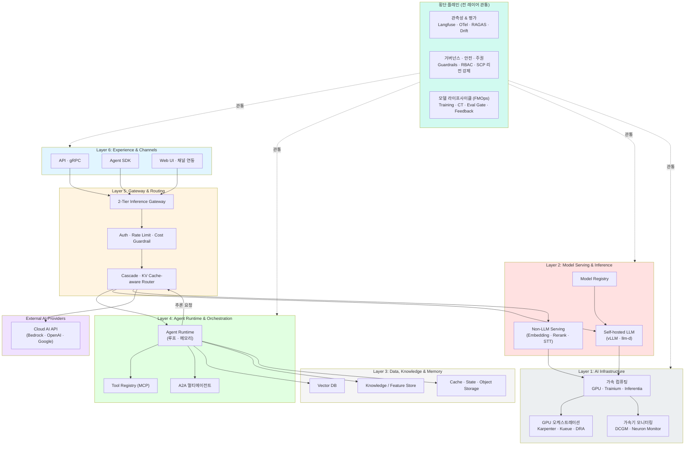
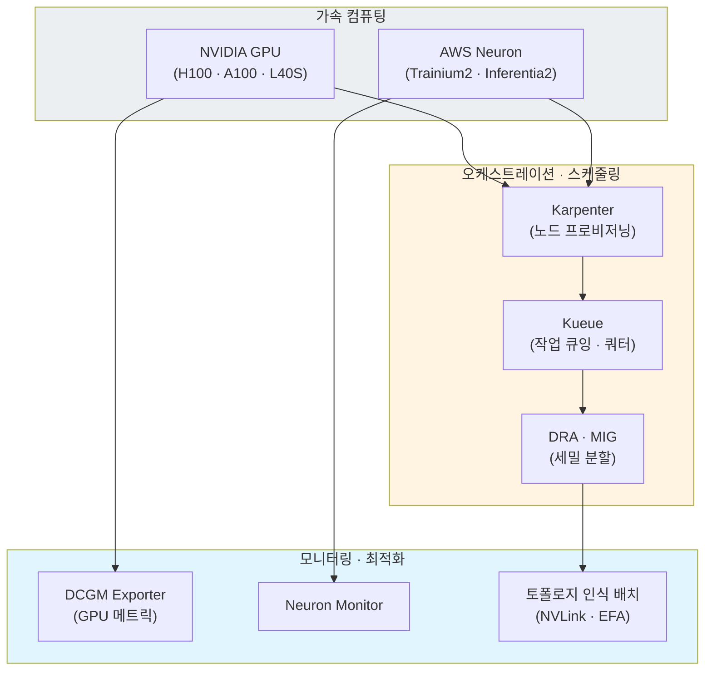
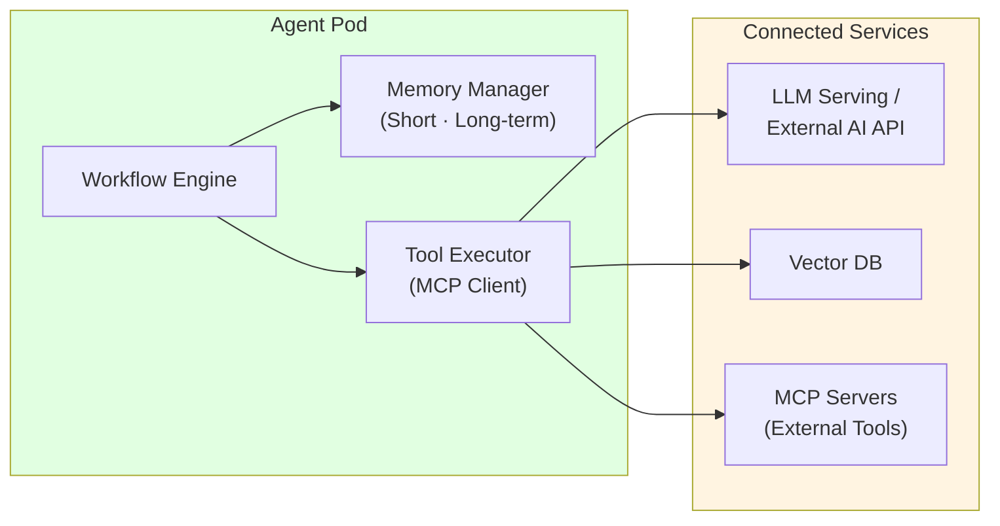
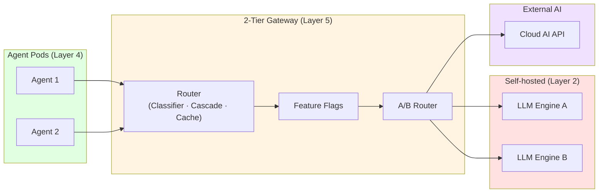
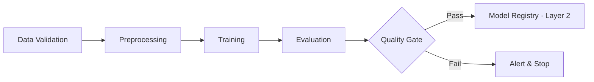
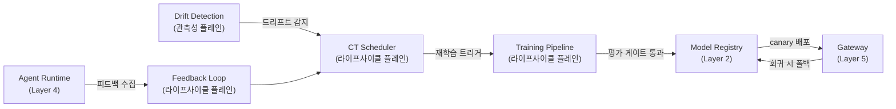
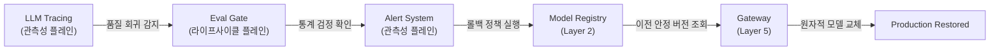
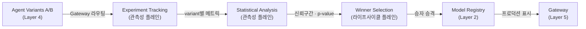
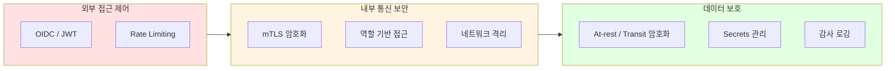
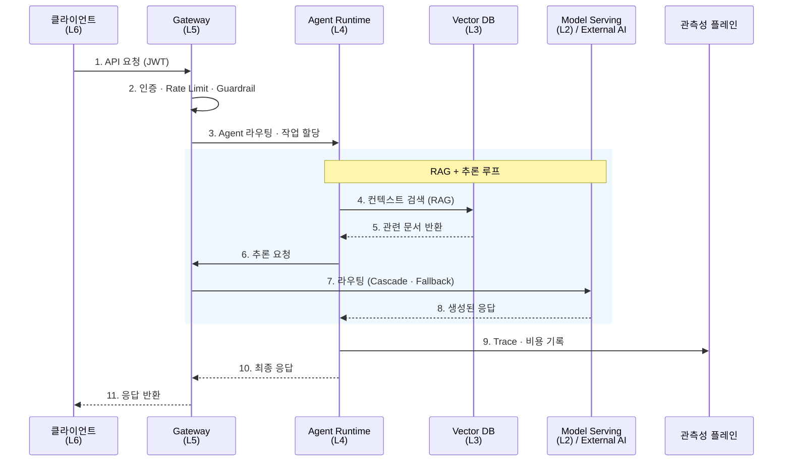

import { LayerRoles, TenantIsolation, RequestProcessing } from '@site/src/components/ArchitectureTables';

## 개요

Agentic AI Platform은 자율적인 AI 에이전트가 복잡한 작업을 수행할 수 있도록 지원하는 통합 플랫폼입니다. 기존 GenAI 서비스 구축에서 직면하는 가속 컴퓨팅 운영, 모델 서빙의 복잡성, 프레임워크 통합 부재, 자동 확장의 어려움, MLOps 자동화 부재, 비용 최적화 등의 과제를 해결하기 위해 설계되었습니다. 플랫폼은 **가속 컴퓨팅 인프라**, **모델 서빙**, **데이터·지식·메모리**, **에이전트 오케스트레이션**, **지능형 추론 라우팅**, **멀티 채널 노출**을 요청 경로를 따라 쌓이는 **6개 런타임 레이어**로 구성하고, **관측성·평가**, **거버넌스·안전·주권**, **모델 라이프사이클(FMOps)**을 전 레이어를 관통하는 **3개 횡단 플레인**으로 분리합니다. 각 도전과제에 대한 상세 분석은 [기술적 도전과제](./agentic-ai-challenges.md) 문서를 참조하세요.

:::info 대상 독자
이 문서는 솔루션 아키텍트, 플랫폼 엔지니어, DevOps 엔지니어를 대상으로 합니다. Kubernetes와 AI/ML 워크로드에 대한 기본적인 이해가 필요합니다.
:::

---

## 레이어와 플레인의 분리

기존 레이어 모델은 평가, 드리프트 감지, 피드백 같은 관심사를 여러 레이어에 중복 배치하여 책임 경계가 모호했습니다. 본 아키텍처는 이를 두 종류의 구성 요소로 명확히 구분합니다.

- **런타임 레이어(Runtime Layer)**: 사용자 요청이 처리되는 경로를 따라 아래에서 위로 쌓이는 6개 계층입니다. 요청은 위(Layer 6)에서 아래(Layer 1)로 흐르고, 플랫폼은 아래(Layer 1)에서 위로 구축됩니다.
- **횡단 플레인(Cross-cutting Plane)**: 특정 레이어에 속하지 않고 **모든 레이어를 수직으로 관통**하는 3개 관심사입니다. 관측성·평가, 거버넌스·안전·주권, 모델 라이프사이클이 여기에 해당합니다.

:::tip 왜 플레인으로 분리하는가
품질 평가(RAGAS), 드리프트 감지, 피드백 수집, Guardrails는 단일 레이어의 기능이 아니라 **전 레이어에 걸쳐 작동하는 관심사**입니다. 이를 별도 레이어로 두면 같은 기능이 여러 레이어에 중복 기술되어 책임이 분산됩니다. 플레인으로 분리하면 "어디서 추론하는가(레이어)"와 "어떻게 관측·통제·개선하는가(플레인)"가 직교(orthogonal)하게 정리됩니다. 이 구분은 Chip Huyen의 *AI Engineering*(2025) 3-tier(Infrastructure / Model / Application) 모델과 FTI(Feature–Training–Inference) 파이프라인 패턴, AWS Well-Architected Generative AI Lens의 전 계층을 관통하는 운영 관점과 동일한 접근입니다.
:::

---

## 전체 시스템 아키텍처

Agentic AI Platform은 **6개 런타임 레이어**와 이를 관통하는 **3개 횡단 플레인**으로 구성됩니다. 각 레이어는 명확한 책임을 가지며, 느슨한 결합을 통해 독립적인 확장과 운영이 가능합니다.



**핵심 설계 원칙:**

- **레이어와 플레인의 직교 분리**: "어디서 추론하는가(6 레이어)"와 "어떻게 관측·통제·개선하는가(3 플레인)"를 분리하여 관심사 중복을 제거
- **AI Infrastructure를 1급 레이어로**: 가속 컴퓨팅(GPU·Trainium·Inferentia)과 그 오케스트레이션·모니터링·성능 최적화를 최하단 독립 레이어(Layer 1)로 명시
- **Self-hosted + External AI 하이브리드**: 자체 호스팅 모델과 외부 AI Provider API를 동일한 게이트웨이(Layer 5)에서 통합 관리
- **2-Tier Cost Tracking**: 인프라 레벨(가속기 시간 · 모델 단가 x 토큰)과 애플리케이션 레벨(Agent 스텝별 비용) 이중 추적
- **MCP/A2A 표준 프로토콜**: Agent와 도구 간(MCP), Agent 간(A2A) 통신을 표준화하여 상호운용성 확보
- **Closed-loop FMOps**: 프로덕션 피드백이 재학습을 트리거하고, 새 모델이 평가 게이트를 통과해야 배포되는 폐쇄 루프 (모델 라이프사이클 플레인)
- **Sovereignty-aware**: 데이터 주권 요구를 SCP 리전 강제, in-country 리전, 하이브리드/온프레미스 자체 호스팅으로 충족 (거버넌스 플레인)

### 레이어 & 플레인 역할

<LayerRoles />

### 기존 8-레이어 모델과의 매핑

이전 버전은 8개 레이어를 사용했으나, 평가·드리프트·피드백·Guardrails가 여러 레이어에 중복되는 문제가 있었습니다. 다음과 같이 6 레이어 + 3 플레인으로 재정렬했습니다.

| 기존 (8-레이어) | 현재 (6 레이어 + 3 플레인) |
|----------------|--------------------------|
| Layer 1: Client & Feedback | Layer 6: Experience & Channels (Feedback → 라이프사이클 플레인) |
| Layer 2: Gateway & Governance | Layer 5: Gateway & Routing (Governance → 거버넌스 플레인) |
| Layer 3: Agent & Orchestration | Layer 4: Agent Runtime & Orchestration |
| Layer 4: Model Serving & Lifecycle | Layer 2: Model Serving (Lifecycle → 라이프사이클 플레인) |
| Layer 5: Data & Feature | Layer 3: Data, Knowledge & Memory |
| Layer 6: Observability & Insights | 관측성 & 평가 플레인 |
| Layer 7: Training & Feedback | 모델 라이프사이클 플레인 |
| Layer 8: Evaluation & Quality | 관측성 & 평가 플레인 + 거버넌스 플레인(Guardrails) |
| *(없음)* | **Layer 1: AI Infrastructure (신규)** |

---

## 핵심 컴포넌트: 런타임 레이어

요청 경로의 역순(최하단 인프라 → 최상단 경험)으로 6개 레이어를 설명합니다. 플랫폼은 Layer 1에서 위로 구축됩니다. 요청 흐름은 Layer 6(진입) → Layer 5(게이트웨이) → Layer 4(Agent)로 내려가고, Agent가 추론이 필요하면 다시 Layer 5 게이트웨이를 거쳐 Layer 2(모델 서빙)를 호출하며, 모델 서빙은 Layer 1의 가속 컴퓨팅 위에서 실행됩니다.

### Layer 1: AI Infrastructure

플랫폼의 최하단에서 **가속 컴퓨팅 자원과 그 운영**을 담당하는 레이어입니다. GPU·Trainium·Inferentia 같은 가속기는 Agentic AI에서 가장 비싼 자원이므로, 단순 프로비저닝을 넘어 오케스트레이션·모니터링·성능 최적화가 하나의 계층으로 통합되어야 합니다. 이 레이어는 다수의 컴포넌트가 조합되어 동작하며, 상위 레이어(Layer 2 모델 서빙)에 안정적인 가속 컴퓨팅 추상화를 제공합니다.



| 기능 영역 | 책임 | 핵심 컴포넌트 |
|----------|------|-------------|
| **가속 컴퓨팅** | LLM·비-LLM 추론/학습용 가속기 제공 | NVIDIA GPU, AWS Trainium2/Inferentia2 |
| **노드 오케스트레이션** | 워크로드 기반 동적 노드 프로비저닝, Spot 활용 | Karpenter, Cluster Autoscaler |
| **작업 스케줄링** | GPU 작업 큐잉, 팀별 쿼터, 공정 분배 | Kueue, KAI Scheduler |
| **GPU 분할** | 단일 GPU를 다중 워크로드로 세밀 분할 | DRA, MIG, Time-Slicing |
| **가속기 모니터링** | 사용률·온도·메모리·전력 실시간 추적 | DCGM Exporter, Neuron Monitor |
| **성능 최적화** | 토폴로지 인식 배치, 고속 네트워크 | NVLink/NVSwitch 인지 스케줄링, EFA |

**왜 별도 레이어인가:**

가속 컴퓨팅의 운영은 모델 서빙(Layer 2)과 책임이 분리됩니다. 모델 서빙은 "어떤 모델을 어떻게 추론하는가"를, AI Infrastructure는 "그 추론을 어떤 가속기 위에서 얼마나 효율적으로 돌리는가"를 책임집니다. GPU 모니터링·스케줄링·파티셔닝은 vLLM·llm-d 같은 서빙 엔진과 독립적으로 진화하며, 학습 워크로드(라이프사이클 플레인)도 동일한 인프라 레이어를 공유합니다.

:::info 상세 가이드
GPU 노드 전략, Karpenter·KEDA·DRA 리소스 관리, NVIDIA GPU 스택(GPU Operator·DCGM·MIG), AWS Neuron 스택은 [모델 서빙 & 추론 인프라](../../model-serving/index.md)의 가속 컴퓨팅 인프라 섹션을 참조하세요.
:::

---

### Layer 2: Model Serving & Inference

자체 호스팅 모델과 비-LLM 모델의 추론을 담당하는 레이어입니다. Layer 1이 제공하는 가속 컴퓨팅 위에서 동작하며, Layer 5 게이트웨이로부터 라우팅된 추론 요청을 처리합니다.

#### Self-hosted LLM Serving

PagedAttention, KV Cache 최적화, 분산 추론을 지원하는 고성능 LLM 서빙 엔진을 운영합니다. vLLM, llm-d 등 오픈소스 추론 엔진을 Kubernetes 위에서 자동 확장합니다.

#### Non-LLM Serving

임베딩, 리랭킹, STT(Whisper) 등 비-LLM 모델은 Triton Inference Server 등으로 별도 서빙합니다. RAG 파이프라인(Layer 3)과 Agent(Layer 4)가 이를 호출합니다.

#### Model Registry

모든 배포된 모델의 버전, 메타데이터, 성능 지표를 중앙 집중 관리합니다. 모델 라이프사이클 플레인의 학습 파이프라인이 신규 모델을 등록하고, 평가 게이트를 통과한 모델만 이 레지스트리를 통해 서빙됩니다.

**저장 구조:**

```
s3://model-registry/
├── llama-3-70b/
│   ├── v1.0.0/
│   │   ├── model.safetensors
│   │   ├── metadata.json
│   │   └── evaluation_metrics.json
│   ├── v1.1.0/
│   └── v1.2.0/ (current production)
└── mistral-7b/
```

:::info 상세 가이드
vLLM 모델 서빙, llm-d 분산 추론(KV Cache-aware 라우팅), MoE 서빙, NeMo 학습 프레임워크는 [모델 서빙 & 추론 인프라](../../model-serving/index.md)를 참조하세요. 파인튜닝·증류 등 모델 변형은 [모델 라이프사이클](../../reference-architecture/model-lifecycle/index.md)에서 다룹니다.
:::

---

### Layer 3: Data, Knowledge & Memory

Agent와 RAG 파이프라인이 사용하는 데이터·지식·메모리를 제공하는 레이어입니다.

#### Vector DB (RAG 저장소)

문서를 임베딩 벡터로 변환하여 저장하고, Agent 요청 시 유사도 검색으로 관련 컨텍스트를 제공합니다.

**설계 고려사항:**
- **멀티 테넌트 격리**: Partition Key로 테넌트별 데이터 분리
- **인덱스 전략**: HNSW 인덱스로 고성능 Approximate Nearest Neighbor 검색
- **하이브리드 검색**: Dense Vector + Sparse Vector (BM25) 결합으로 검색 품질 향상

#### Knowledge / Feature Store

ML 모델 학습과 추론에 사용되는 입력 특성(feature)과 도메인 지식을 관리합니다. 학습 시와 추론 시 동일한 특성 정의를 보장하여 training-serving skew를 방지하며, 온톨로지·지식 그래프를 결합하면 RAG 환각을 줄이고 근거 추적이 가능해집니다.

**아키텍처:**

```
Online Store (Redis/DynamoDB)
  └─ 저지연 특성 조회 (< 10ms) · 실시간 추론용

Offline Store (S3 Parquet)
  └─ 대용량 특성 저장 · 배치 학습용
```

#### Cache · State · Object Storage

세션 상태, 단기 메모리, LangGraph checkpointer 상태를 저장합니다. Agent의 장기 실행 작업에 대한 체크포인팅과 복구를 지원합니다.

:::info 상세 가이드
온톨로지 기반 Knowledge Feature Store의 3-plane 설계는 [Knowledge Feature Store](../advanced-patterns/knowledge-feature-store.md), Milvus 벡터 DB 운영은 [Milvus 벡터 DB](../../operations-mlops/data-infrastructure/milvus-vector-database.md)를 참조하세요.
:::

---

### Layer 4: Agent Runtime & Orchestration

AI 에이전트가 실행되는 레이어입니다. 각 에이전트는 독립적인 컨테이너로 실행되며, 워크플로우 엔진이 라이프사이클을 관리합니다.



| 기능 | 설명 |
|------|------|
| **상태 관리** | 대화 컨텍스트 및 작업 상태 유지, 체크포인팅 |
| **도구 실행** | MCP 프로토콜로 등록된 도구를 비동기 실행 |
| **메모리 관리** | 단기 메모리(세션)와 장기 메모리(벡터 DB) 결합 |
| **Agent 간 통신** | A2A 프로토콜로 멀티 에이전트 협업 |
| **오류 복구** | 실패한 작업의 자동 재시도 및 폴백 |

#### Tool Registry

에이전트가 사용할 수 있는 도구를 중앙에서 선언적으로 관리합니다. 각 도구는 MCP 서버로 노출되어 Agent가 표준 프로토콜로 호출합니다.

| 도구 유형 | 용도 | 예시 |
|----------|------|------|
| **API 도구** | 외부 REST/gRPC 서비스 호출 | CRM 조회, 주문 처리 |
| **검색 도구** | 벡터 DB 검색, 문서 검색 | RAG 컨텍스트 보강 |
| **코드 실행** | 샌드박스 환경에서 코드 실행 | 데이터 분석, 계산 |
| **A2A 도구** | 다른 Agent에 작업 위임 | 전문 Agent 협업 |

:::info 상세 가이드
Kagent 기반 Kubernetes Agent 관리는 [Kagent](../../operations-mlops/observability/kagent-kubernetes-agents.md), AWS Native AgentCore 기반 Agent 운영은 [AWS Native 플랫폼](../platform-selection/aws-native-agentic-platform.md)을 참조하세요.
:::

---

### Layer 5: Gateway & Routing

모델 추론 요청을 지능적으로 라우팅하는 레이어입니다. Self-hosted 모델(Layer 2)과 외부 AI Provider를 단일 엔드포인트로 통합합니다.



**라우팅 전략:**

| 전략 | 설명 |
|------|------|
| **모델 기반 라우팅** | 요청 헤더/파라미터에 따라 적절한 모델 백엔드로 분배 |
| **KV Cache-aware 라우팅** | LLM의 Prefix Cache 상태를 고려하여 TTFT 최소화 |
| **Cascade 라우팅** | 저비용 모델 우선 시도 → 실패 시 고성능 모델로 자동 전환 |
| **가중치 기반 라우팅** | Canary/Blue-Green 배포를 위한 트래픽 비율 분할 |
| **Fallback** | Provider 장애 시 대체 Provider로 자동 전환 (Circuit Breaker) |

#### Cost Guardrails

요청별, Agent별, 테넌트별 비용 한도를 설정합니다. 월간 예산 초과 시 자동으로 저비용 모델로 폴백하거나, 알림을 발송하여 비용 폭증을 방지합니다. (정책 강제 자체는 거버넌스 플레인과 연동)

:::info 상세 가이드
2-Tier Gateway 아키텍처(kgateway + Bifrost), Cascade Routing 튜닝, Semantic Router는 [Inference Gateway](../../reference-architecture/inference-gateway/index.md)를 참조하세요.
:::

---

### Layer 6: Experience & Channels

사용자와 외부 시스템이 플랫폼에 진입하는 최상단 레이어입니다. 다양한 채널(API, SDK, Web UI, 메신저·상담 채널)로 Agent 기능을 노출합니다.

| 진입점 | 설명 | 활용 |
|--------|------|------|
| **API · gRPC** | REST/gRPC 엔드포인트 | 시스템 간 통합, 백엔드 호출 |
| **Agent SDK** | Python/JS 클라이언트 SDK | 애플리케이션 내장 Agent |
| **Web UI** | 대시보드·챗 인터페이스 | 운영자·사용자 직접 상호작용 |
| **채널 연동** | 메신저, 상담(AICC), 음성 채널 | 옴니채널 고객 접점 |

피드백 수집(사용자 평가, 수정 사항)은 이 레이어에서 시작되지만, 수집된 데이터의 처리·학습 반영은 **모델 라이프사이클 플레인**이 담당합니다.

---

## 핵심 컴포넌트: 횡단 플레인

다음 3개 플레인은 특정 레이어에 속하지 않고 6개 런타임 레이어를 수직으로 관통합니다.

### 관측성 & 평가 플레인

모든 레이어에서 발생하는 트레이스·메트릭·비용·품질을 통합 수집하고 평가합니다.

#### LLM Tracing

모든 LLM 호출의 입력, 출력, 지연시간, 토큰 사용량을 기록합니다. 개발 환경에서는 디버깅용 상세 트레이스를, 프로덕션에서는 샘플링된 트레이스를 저장합니다. Langfuse, OpenTelemetry 기반으로 Layer 4(Agent)~Layer 2(Serving)의 전체 흐름을 추적합니다.

#### 2-Tier Cost Tracking

- **인프라 레벨**: Layer 1 가속기 시간, 모델 단가 x 토큰
- **애플리케이션 레벨**: Agent 스텝별 비용, 테넌트별·모델별 예산 추적

#### Quality Evaluation (RAGAS)

RAG·Agent 품질을 정량 측정합니다. 단일 레이어가 아니라 데이터(Layer 3)·서빙(Layer 2)·Agent(Layer 4)에 걸친 품질을 종합 평가합니다.

**RAGAS Metrics:**
- Context Precision / Context Recall: 검색 정확도·재현율
- Faithfulness: 생성 답변이 컨텍스트에 근거하는 정도
- Answer Relevancy: 질문과 답변의 관련성

**Agent Success Rate:**
- Task Completion Rate, Tool Execution Accuracy, Multi-step Coherence

#### Drift Detection

입력 데이터 분포 변화(data drift)와 출력 품질 저하(concept drift)를 감지합니다. PSI > 0.25, KL Divergence > 0.1 등을 임계값으로 사용하며, 임계값 초과 시 모델 라이프사이클 플레인의 재학습을 트리거합니다.

:::info 상세 가이드
Langfuse 기반 Agent 모니터링은 [Agent 모니터링](../../operations-mlops/observability/agent-monitoring.md), LLMOps 도구 비교는 [LLMOps Observability](../../operations-mlops/observability/llmops-observability.md), RAG 평가는 [Ragas 평가](../../operations-mlops/governance/ragas-evaluation.md)를 참조하세요.
:::

---

### 거버넌스 · 안전 · 주권 플레인

플랫폼 전반의 안전·정책·규제 준수·데이터 주권을 강제합니다.

#### Guardrails Enforcement

NeMo Guardrails 또는 Guardrails AI로 LLM 입출력을 검증합니다:
- PII Leakage Detection (개인정보 유출 차단)
- Prompt Injection Detection (프롬프트 인젝션 방어)
- Toxic Content Filtering (유해 콘텐츠 필터링)
- Factuality Check (사실 검증)

Guardrails는 Layer 5(Gateway 입구)와 Layer 4(Agent 출력)에 동시에 적용되므로 단일 레이어가 아닌 플레인으로 정의합니다.

#### 정책 · 접근 제어 (RBAC)

OIDC/JWT 인증, 역할 기반 접근 제어, 도구별 호출 권한 제한, 테넌트 격리를 강제합니다. 최소 권한 원칙으로 Agent별 호출 가능 도구를 선언적으로 정의합니다.

#### 데이터 주권 · 리전 강제 (Sovereignty)

데이터 주권 요구가 있는 조직(금융·공공·규제 산업)은 추론·학습·데이터 저장을 특정 지리 경계 내로 강제해야 합니다. 본 플랫폼은 다음 수단으로 주권을 충족합니다.

| 수단 | 설명 | 적용 위치 |
|------|------|----------|
| **SCP 리전 강제** | AWS Organizations SCP로 승인되지 않은 리전의 API를 거부 | 계정·OU 경계 |
| **Bedrock Geographic CRIS** | Geographic cross-Region inference로 지리 경계 내 추론 유지 | Layer 5 → External AI |
| **In-country 자체 호스팅** | in-country 리전 또는 온프레미스에서 모델 자체 호스팅 | Layer 1·2 |
| **하이브리드** | EKS Hybrid Nodes로 온프레미스·in-country + 클라우드 조합 | Layer 1 |

:::info 상세 가이드
SCP 리전 강제 정책, Bedrock Geographic cross-Region inference, EKS Hybrid Nodes 기반 하이브리드·주권 배포 패턴은 [소버린 & 하이브리드 배포](../platform-selection/sovereign-hybrid-deployment.md)와 [AI 플랫폼 선택 가이드](../platform-selection/ai-platform-decision-framework.md)를 참조하세요. Guardrails 기술 스택은 [AI Gateway Guardrails](../../operations-mlops/governance/ai-gateway-guardrails.md), 컴플라이언스 매핑(SOC2·ISMS-P)은 [컴플라이언스 프레임워크](../../operations-mlops/governance/compliance-framework.md)를 참조하세요.
:::

---

### 모델 라이프사이클 (FMOps) 플레인

프로덕션 피드백을 기반으로 모델을 지속적으로 개선하는 폐쇄 루프를 담당합니다. 학습·파인튜닝·평가·재학습·피드백이 모두 이 플레인에 속하며, 결과물(신규 모델)은 Layer 2 Model Registry로 전달됩니다.

#### Training Pipeline Orchestration

Kubeflow Pipelines 또는 Argo Workflows로 학습 워크플로우를 자동화합니다. 데이터 검증 → 전처리 → 학습 → 평가 → 등록 단계를 DAG로 정의합니다. 학습 워크로드는 Layer 1 AI Infrastructure의 가속 컴퓨팅을 공유합니다.



#### Continuous Training (CT) Scheduler

데이터 드리프트 감지(관측성 플레인) 시 자동으로 재학습을 실행합니다. 예약 기반(Cron) 또는 이벤트 기반(드리프트 임계값 초과) 트리거를 지원합니다.

**트리거 조건:**
- 예약 기반: `0 0 * * 0` (매주 일요일)
- 드리프트 기반: PSI > 0.25 또는 KL Divergence > 0.1
- 품질 저하: Agent Success Rate < 85% 지속 7일

#### Evaluation Gate

배포 전 모델 품질을 검증하는 게이트입니다. Accuracy, RAGAS 메트릭, Guardrails 통과율을 자동 측정하며, 품질 임계값 미달 시 배포를 차단합니다. 신규 모델은 10% canary 배포 후 통계적 검정(Mann-Whitney U test, p < 0.05)으로 회귀를 판단하고, 회귀 탐지 시 자동 롤백합니다.

#### Feedback Loop

프로덕션 피드백(사용자 평가, 수정 사항, A/B 테스트 결과)을 학습 데이터로 환류합니다.

```
Positive Feedback (thumbs up)
  → Add to training dataset as positive example

Negative Feedback (thumbs down)
  → If user provides correction: add as hard negative
  → If no correction: filter from training dataset
```

:::info 상세 가이드
MLOps 파이프라인(EKS), 지속 학습(GRPO/DPO), trace-to-dataset, 평가·롤아웃은 [모델 라이프사이클](../../reference-architecture/model-lifecycle/index.md)을 참조하세요.
:::


## 레이어 & 플레인 통합 플로우

런타임 레이어와 횡단 플레인이 어떻게 상호작용하여 완전한 FMOps 파이프라인을 구성하는지 보여줍니다. 세 플로우 모두 **플레인이 레이어를 관통**하는 구조를 드러냅니다.

### Feedback → Training → Serving Loop

프로덕션 피드백이 재학습을 트리거하고, 새 모델이 배포되는 전체 루프입니다. 라이프사이클 플레인과 관측성 플레인이 런타임 레이어를 관통합니다.



**플로우 설명:**
1. Layer 4 (Agent Runtime)가 사용자 피드백을 수집하여 라이프사이클 플레인의 Feedback Loop로 전달
2. 관측성 플레인의 Drift Detection이 입력 데이터 드리프트를 감지
3. 라이프사이클 플레인의 CT Scheduler가 재학습 트리거를 받아 Training Pipeline 실행 (Layer 1 가속 컴퓨팅 사용)
4. 평가 게이트 통과 시 Layer 2 Model Registry에 신규 모델 등록
5. Layer 5 Gateway가 10% canary 배포로 신규 모델 검증
6. 회귀 탐지 시 Model Registry의 이전 버전으로 자동 롤백

### Evaluation → Rollback Path

품질 회귀를 감지하고 자동으로 롤백하는 경로입니다. 관측성 플레인이 감지하고 라이프사이클 플레인이 대응합니다.



**플로우 설명:**
1. 관측성 플레인이 RAGAS 점수 하락을 감지
2. 라이프사이클 플레인의 Eval Gate가 Mann-Whitney U test로 통계적 유의성 검정
3. p-value < 0.05 확인 시 Alert System이 롤백 정책 실행
4. Layer 2 Model Registry에서 마지막 안정 버전 조회
5. Layer 5 Gateway가 5분 내 원자적 모델 교체
6. 프로덕션 복구 완료

### A/B Testing → Production

두 Agent/Model variant를 실험하여 승자를 프로덕션에 배포하는 경로입니다.



**플로우 설명:**
1. Layer 4 (Agent Runtime)가 A/B 두 variant를 실행
2. Layer 5 (Gateway)가 요청을 50:50으로 분배
3. 관측성 플레인의 Experiment Tracking이 variant별 메트릭 수집 (n = 1000 이상)
4. 관측성 플레인의 Statistical Analysis가 Mann-Whitney U test 실행
5. p < 0.05 AND 평균 메트릭 개선 > 5% 시 승자 선정
6. 라이프사이클 플레인이 Layer 2 Model Registry에 승자 variant를 프로덕션으로 표시
7. Layer 5 (Gateway)가 100% 트래픽을 승자로 라우팅

---

## 배포 아키텍처

### 네임스페이스 구성

관심사 분리와 보안을 위해 기능별로 네임스페이스를 분리합니다.

| 네임스페이스 | 레이어 / 플레인 | 컴포넌트 | Pod Security | GPU |
|-------------|---------------|---------|-------------|-----|
| **ai-infra** | Layer 1 | GPU Operator, Karpenter, Kueue, DCGM Exporter | privileged | 필요 |
| **ai-inference** | Layer 2 | LLM Serving Engine, Triton, Model Registry | privileged | 필요 |
| **ai-data** | Layer 3 | Vector DB, Cache, Knowledge/Feature Store | baseline | - |
| **ai-agents** | Layer 4 | Agent Runtime, Tool Registry, A2A | baseline | - |
| **ai-gateway** | Layer 5 | Inference Gateway, Auth, A/B Router | restricted | - |
| **observability** | 관측성 플레인 | Tracing, Metrics, RAGAS, Drift Detection | baseline | - |
| **ai-governance** | 거버넌스 플레인 | Guardrails, Policy, Regression Detection | baseline | - |
| **ai-training** | 라이프사이클 플레인 | Training Pipeline, CT Scheduler, Eval Gate | privileged | 필요 |

Layer 6(Experience & Channels)은 별도 네임스페이스 없이 ai-gateway 앞단의 Ingress/ALB와 외부 채널 연동으로 노출됩니다.

---

## 확장성 설계

### 수평적 확장 전략

각 컴포넌트는 독립적으로 수평 확장이 가능합니다.

| 컴포넌트 | 레이어 | 스케일링 트리거 | 방식 |
|---------|-------|---------------|------|
| GPU 노드 | Layer 1 | Pending Pod, GPU 요청량 | Karpenter Node Auto-provisioning |
| LLM Serving | Layer 2 | GPU 사용률, 대기 큐 길이 | HPA + KEDA |
| Vector DB | Layer 3 | 쿼리 지연 시간, 인덱스 크기 | Query/Index Node 독립 확장 |
| Agent Pod | Layer 4 | 메시지 큐 길이, 활성 세션 수 | Event-driven Autoscaling (KEDA) |
| Gateway | Layer 5 | 요청 수, 동시 연결 | HPA |
| Training Pipeline | 라이프사이클 플레인 | 학습 작업 큐 길이 | Spot Instance Auto-provisioning |

### 멀티 테넌트 지원

여러 팀이나 프로젝트가 동일한 플랫폼을 공유할 수 있도록 네임스페이스 격리, 리소스 쿼터, 네트워크 정책을 조합한 멀티 테넌트를 지원합니다.

<TenantIsolation />

---

## 보안 아키텍처

Agentic AI Platform은 외부 접근, 내부 통신, 데이터 보안의 **3중 보안 레이어**를 적용합니다.



**Agent 특화 보안 고려사항:**

- **프롬프트 인젝션 방어**: 입력 검증 레이어(Guardrails)로 악의적 프롬프트 차단
- **도구 실행 권한 제한**: Agent별 호출 가능 도구를 선언적으로 정의, 최소 권한 원칙 적용
- **PII 유출 방지**: 출력 필터링으로 민감 정보 노출 차단
- **실행 시간 제한**: Agent 무한 루프 방지를 위한 타임아웃 및 최대 스텝 수 설정

:::danger 보안 주의사항
- 프로덕션 환경에서는 반드시 mTLS를 활성화하세요
- API 키와 토큰은 Secrets Manager에 저장하세요
- 정기적으로 보안 감사를 수행하고 취약점을 패치하세요
:::

---

## 데이터 플로우

사용자 요청이 플랫폼을 통해 처리되는 전체 흐름입니다.



<RequestProcessing />

---

## 모니터링 및 관측성

### 핵심 모니터링 영역

| 영역 | 대상 메트릭 | 목적 |
|------|-----------|------|
| **Agent Performance** | 요청 수, P50/P99 지연 시간, 오류율, 스텝 수 | 에이전트 성능 추적 |
| **LLM Performance** | 토큰 처리량, TTFT, TPS, 큐 대기 시간 | 모델 서빙 성능 |
| **Resource Usage** | CPU, 메모리, GPU 사용률/온도 | 리소스 효율성 |
| **Cost Tracking** | 테넌트별/모델별 토큰 비용, 인프라 비용 | 비용 거버넌스 |
| **Quality** | RAGAS 점수, Agent 성공률, Guardrails 통과율 | 품질 SLO 준수 |
| **Training** | 학습 빈도, 모델 승격률, 드리프트 탐지 횟수 | MLOps 파이프라인 건강도 |

**알림 규칙 예시:**
- Agent P99 지연 시간 > 10초 → Warning
- Agent 오류율 > 5% → Critical
- GPU 사용률 < 20% (30분 지속) → Cost Warning
- 토큰 비용 일일 예산 80% 도달 → Budget Warning
- RAGAS Faithfulness < 0.85 (1시간 지속) → Quality Warning
- Agent Success Rate < 90% (7일 지속) → Retraining Trigger

---

## 플랫폼 요구사항

| 영역 | 레이어 / 플레인 | 필요 역량 | 설명 |
|------|---------------|----------|------|
| AI 인프라 | Layer 1 | 가속 컴퓨팅 + GPU 오케스트레이션 | GPU/Trainium/Inferentia, Karpenter·Kueue·DRA, DCGM 모니터링 |
| 모델 서빙 | Layer 2 | LLM 추론 엔진 | PagedAttention, KV Cache 최적화, 분산 추론, Model Registry |
| 데이터 레이어 | Layer 3 | 벡터 DB + 캐시 + Knowledge Store | RAG 검색, 세션 상태 저장, 장기 메모리, 특성 관리 |
| Agent 프레임워크 | Layer 4 | 워크플로우 엔진 | 멀티스텝 실행, 상태 관리, MCP/A2A 프로토콜 |
| 게이트웨이 | Layer 5 | Gateway API + 라우팅 | 지능형 모델 라우팅, mTLS, Rate Limiting, External AI 연동 |
| 경험·채널 | Layer 6 | API/SDK/UI/채널 | 멀티 채널 노출, 피드백 수집 |
| 관측성 | 관측성 플레인 | LLM 트레이싱 + 평가 | 토큰 비용 추적, Agent Trace 분석, RAGAS, 드리프트 감지 |
| 거버넌스·주권 | 거버넌스 플레인 | 다층 보안 + 주권 강제 | OIDC/JWT, RBAC, Guardrails, SCP 리전 강제, 컴플라이언스 |
| 모델 라이프사이클 | 라이프사이클 플레인 | 분산 학습 + CT + 평가 게이트 | LoRA/QLoRA 파인튜닝, 자동 재학습, 회귀 탐지, 롤백 |

구체적인 기술 스택과 구현 방법은 [AWS Native 플랫폼](../platform-selection/aws-native-agentic-platform.md) 또는 [EKS 기반 오픈 아키텍처](../platform-selection/agentic-ai-solutions-eks.md)를 참조하세요.

---

## 결론

Agentic AI Platform 아키텍처의 핵심 원칙:

1. **레이어와 플레인의 직교 분리**: "어디서 추론하는가(6 런타임 레이어)"와 "어떻게 관측·통제·개선하는가(3 횡단 플레인)"를 분리하여 관심사 중복을 제거
2. **AI Infrastructure 1급 레이어**: 가속 컴퓨팅과 그 오케스트레이션·모니터링·성능 최적화를 최하단 독립 레이어로 명시
3. **하이브리드 AI**: Self-hosted 모델과 External AI Provider를 단일 게이트웨이에서 통합 관리
4. **표준 프로토콜**: MCP/A2A로 도구 연결과 Agent 간 통신을 표준화
5. **관측성·평가 통합**: 전체 요청 흐름의 Trace, 비용, 품질을 단일 플레인에서 모니터링·평가
6. **거버넌스·주권**: 다층 보안 + Agent 특화 안전(Guardrails) + 데이터 주권(SCP 리전 강제, in-country, 하이브리드)
7. **Closed-loop FMOps**: 피드백 → 드리프트 탐지 → 재학습 → 평가 게이트 → 배포 자동화
8. **Quality-first**: 모든 모델 변경은 평가 게이트의 통계적 검증을 통과해야 프로덕션 승격

:::tip 구현 가이드
이 플랫폼 아키텍처를 구현하는 구체적인 방법은 다음 문서에서 다룹니다:

- [기술적 도전과제](./agentic-ai-challenges.md) — 플랫폼 구축 시 직면하는 핵심 과제
- [AWS Native 플랫폼](../platform-selection/aws-native-agentic-platform.md) — 매니지드 서비스 기반 구현
- [EKS 기반 오픈 아키텍처](../platform-selection/agentic-ai-solutions-eks.md) — EKS + 오픈소스 기반 구현
:::

## 참고 자료

### 업계 참조 아키텍처

- [AWS Well-Architected Generative AI Lens](https://docs.aws.amazon.com/wellarchitected/latest/generative-ai-lens/generative-ai-lens.html) — AWS 공식 생성형 AI 설계 원칙, 전 계층을 관통하는 운영 관점
- [CNCF Cloud Native AI Whitepaper](https://www.cncf.io/reports/cloud-native-artificial-intelligence-whitepaper/) — CNCF 클라우드 네이티브 AI 레이어링과 인프라 패턴
- [a16z: Emerging Architectures for LLM Applications](https://a16z.com/emerging-architectures-for-llm-applications/) — LLM 앱 레퍼런스 아키텍처(오케스트레이션·데이터·모델 분리)
- [Chip Huyen, *AI Engineering* (O'Reilly, 2025)](https://www.oreilly.com/library/view/ai-engineering/9781098166298/) — Infrastructure/Model/Application 3-tier, FTI 파이프라인

### 주요 저자

- Chip Huyen: "Designing Machine Learning Systems" (2022), "AI Engineering" (2025) — MLOps 프로덕션 베스트 프랙티스
- Eugene Yan: "What We Learned from a Year of Building with LLMs" (O'Reilly 2024) — 실전 LLM 구축 경험
- Shreya Shankar: DocETL research, MLOps papers (UC Berkeley) — 데이터 품질 및 평가 프레임워크

### 공식 문서

- [Kubernetes Gateway API](https://gateway-api.sigs.k8s.io/) — K8s 공식 게이트웨이 API
- [MCP (Model Context Protocol)](https://modelcontextprotocol.io/) — MCP 프로토콜 명세
- [CNCF Cloud Native Architecture](https://www.cncf.io/) — 클라우드 네이티브 아키텍처 패턴
- [OpenTelemetry](https://opentelemetry.io/) — 관측성 표준

### 논문 / 기술 블로그

- [A2A (Agent-to-Agent Protocol)](https://a2a-protocol.org/) — Google이 개발, 현재 Linux Foundation 관리하는 멀티 에이전트 통신 프로토콜
- [LangChain Architecture Patterns](https://blog.langchain.dev/) — Agent 아키텍처 패턴
- [Building Production-Ready LLM Applications](https://huyenchip.com/2023/04/11/llm-engineering.html) — 프로덕션 LLM 엔지니어링
- [AWS Well-Architected Framework for AI/ML](https://aws.amazon.com/architecture/) — AI/ML 워크로드 설계 원칙

### 관련 문서 (내부)

- [기술적 도전과제](./agentic-ai-challenges.md) — 플랫폼이 해결하는 5가지 핵심 문제
- [Knowledge Feature Store](../advanced-patterns/knowledge-feature-store.md) — 온톨로지 기반 특성 관리
- [Model Serving & 추론 인프라](../../model-serving/index.md) — vLLM, llm-d, MoE 배포 가이드
- [Operations & 거버넌스](../../operations-mlops/index.md) — Langfuse, RAGAS, Guardrails 운영
- [Reference Architecture](../../reference-architecture/index.md) — 단계별 구현 가이드
