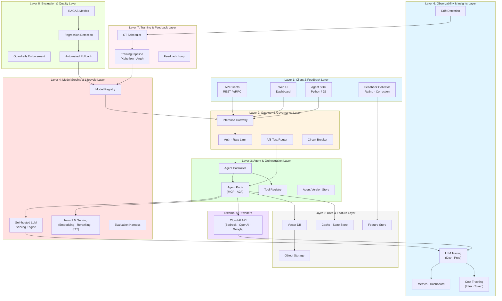
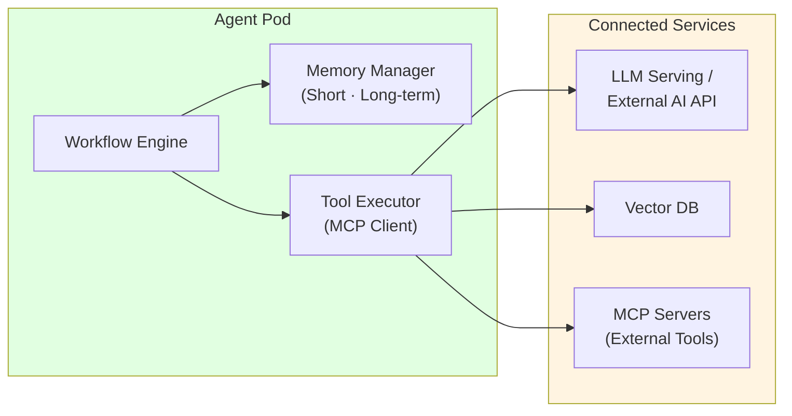
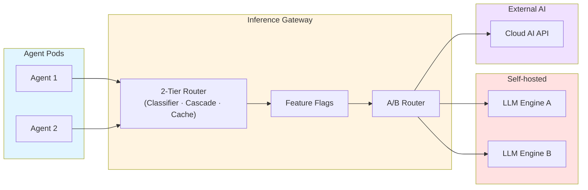
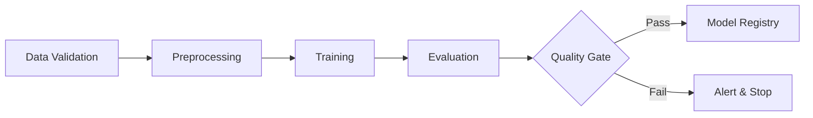
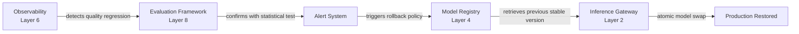
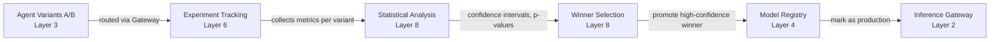
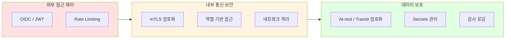
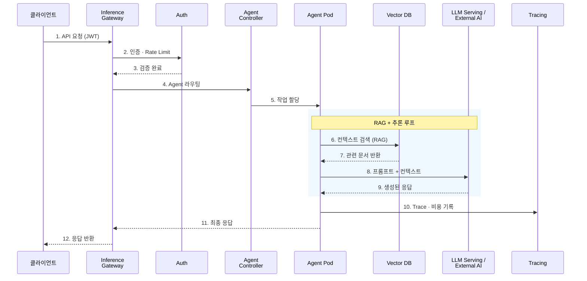

import { LayerRoles, TenantIsolation, RequestProcessing } from '@site/src/components/ArchitectureTables';

## 개요

Agentic AI Platform은 자율적인 AI 에이전트가 복잡한 작업을 수행할 수 있도록 지원하는 통합 플랫폼입니다. 기존 GenAI 서비스 구축에서 직면하는 모델 서빙의 복잡성, 프레임워크 통합 부재, 자동 확장의 어려움, MLOps 자동화 부재, 비용 최적화 등의 과제를 해결하기 위해 설계되었습니다. 플랫폼은 **에이전트 오케스트레이션**, **지능형 추론 라우팅**, **벡터 검색 기반 RAG**, **LLM 트레이싱과 비용 분석**, **수평적 자동 확장**, **멀티 테넌트 리소스 격리**, **지속적 학습(CT) 파이프라인**, **품질 평가 자동화**를 핵심 기능으로 제공하며, 각 도전과제에 대한 상세 분석은 [기술적 도전과제](./agentic-ai-challenges.md) 문서를 참조하세요.

:::info 대상 독자
이 문서는 솔루션 아키텍트, 플랫폼 엔지니어, DevOps 엔지니어를 대상으로 합니다. Kubernetes와 AI/ML 워크로드에 대한 기본적인 이해가 필요합니다.
:::

---

## 전체 시스템 아키텍처

Agentic AI Platform은 8개의 주요 레이어로 구성됩니다. 각 레이어는 명확한 책임을 가지며, 느슨한 결합을 통해 독립적인 확장과 운영이 가능합니다.



**핵심 설계 원칙:**

- **Self-hosted + External AI 하이브리드**: 자체 호스팅 LLM과 외부 AI Provider API를 동일한 게이트웨이에서 통합 관리
- **2-Tier Cost Tracking**: 인프라 레벨(모델 단가 x 토큰)과 애플리케이션 레벨(Agent 스텝별 비용) 이중 추적
- **MCP/A2A 표준 프로토콜**: Agent와 도구 간(MCP), Agent 간(A2A) 통신을 표준화하여 상호운용성 확보
- **Closed-loop MLOps**: 프로덕션 피드백이 재학습을 트리거하고, 새 모델이 자동 평가 후 배포되는 폐쇄 루프
- **Quality-first Deployment**: 모든 모델 배포는 Evaluation Harness를 통과해야 프로덕션 승격 가능

### 레이어별 역할

<LayerRoles />

---

## 핵심 컴포넌트

### Layer 1: Client & Feedback Layer

Agent Runtime은 AI 에이전트가 실행되는 환경입니다. 각 에이전트는 독립적인 컨테이너로 실행되며, Agent Controller에 의해 라이프사이클이 관리됩니다.



| 기능 | 설명 |
|------|------|
| **상태 관리** | 대화 컨텍스트 및 작업 상태 유지, 체크포인팅 |
| **도구 실행** | MCP 프로토콜로 등록된 도구를 비동기 실행 |
| **메모리 관리** | 단기 메모리(세션)와 장기 메모리(벡터 DB) 결합 |
| **Agent 간 통신** | A2A 프로토콜로 멀티 에이전트 협업 |
| **오류 복구** | 실패한 작업의 자동 재시도 및 폴백 |

#### Feedback Collection

사용자 평가, 수정 사항, A/B 테스트 데이터를 체계적으로 수집합니다. 긍정/부정 피드백을 분류하여 Feature Store로 전달하며, 프로덕션 모델의 지속적 개선을 위한 데이터를 축적합니다.

**수집 데이터:**

| 유형 | 설명 | 활용 |
|------|------|------|
| 사용자 평가 | thumbs up/down, 1-5 별점 | 모델 품질 지표 |
| 수정 사항 | 사용자가 Agent 출력을 직접 수정한 내역 | Hard Negative 학습 데이터 |
| A/B 테스트 메트릭 | variant 별 성공률, 응답 품질 | 모델/Agent 버전 선택 |
| 암묵적 피드백 | 세션 지속 시간, 작업 완료 여부 | 사용자 만족도 추정 |

---

### Layer 2: Gateway & Governance Layer

#### Inference Gateway

Inference Gateway는 모델 추론 요청을 지능적으로 라우팅하는 핵심 컴포넌트입니다. Self-hosted LLM과 외부 AI Provider를 단일 엔드포인트로 통합합니다.



**라우팅 전략:**

| 전략 | 설명 |
|------|------|
| **모델 기반 라우팅** | 요청 헤더/파라미터에 따라 적절한 모델 백엔드로 분배 |
| **KV Cache-aware 라우팅** | LLM의 Prefix Cache 상태를 고려하여 TTFT 최소화 |
| **Cascade 라우팅** | 저비용 모델 우선 시도 → 실패 시 고성능 모델로 자동 전환 |
| **가중치 기반 라우팅** | Canary/Blue-Green 배포를 위한 트래픽 비율 분할 |
| **Fallback** | Provider 장애 시 대체 Provider로 자동 전환 |

#### Feature Flags

새로운 Agent 기능, 모델 버전, 라우팅 전략을 단계적으로 배포합니다. LaunchDarkly 스타일의 feature flag를 지원하며, 사용자 그룹별(dev/staging/production) 또는 퍼센트 기반(10% canary) 배포를 가능하게 합니다.

#### A/B Test Routing

Agent 또는 모델의 여러 버전을 동시에 실행하고 성능을 비교합니다. Gateway가 요청을 variant A/B로 분배하며, Experiment Tracking(Layer 6)이 메트릭을 수집하여 통계적 유의성을 검정합니다.

#### Cost Guardrails

요청별, Agent별, 테넌트별 비용 한도를 설정합니다. 월간 예산 초과 시 자동으로 저비용 모델로 폴백하거나, 알림을 발송하여 비용 폭증을 방지합니다.

#### Circuit Breaker

외부 AI Provider API 장애 시 자동으로 폴백 모델로 전환합니다. 연속 실패 임계값(예: 5회)을 초과하면 회로를 차단하고, 일정 시간 후 반개방 상태로 복구를 시도합니다.

---

### Layer 3: Agent & Orchestration Layer

#### Tool Registry

에이전트가 사용할 수 있는 도구를 중앙에서 선언적으로 관리합니다. 각 도구는 MCP 서버로 노출되어 Agent가 표준 프로토콜로 호출합니다.

| 도구 유형 | 용도 | 예시 |
|----------|------|------|
| **API 도구** | 외부 REST/gRPC 서비스 호출 | CRM 조회, 주문 처리 |
| **검색 도구** | 벡터 DB 검색, 문서 검색 | RAG 컨텍스트 보강 |
| **코드 실행** | 샌드박스 환경에서 코드 실행 | 데이터 분석, 계산 |
| **A2A 도구** | 다른 Agent에 작업 위임 | 전문 Agent 협업 |

#### Agent Version Store

배포된 Agent의 모든 버전을 저장하고 추적합니다. Semantic versioning(v1.2.3)을 적용하며, 각 버전의 성능 지표, 배포 이력, 롤백 이력을 메타데이터로 관리합니다.

**관리 항목:**
- Agent 프롬프트 버전 (시스템 프롬프트, 도구 설명)
- 도구 구성 버전 (허용 도구 목록, 파라미터)
- 성능 이력 (버전별 Task Completion Rate, 평균 지연시간)
- 롤백 정책 (이전 안정 버전 자동 복원 조건)

#### Dynamic Tool Discovery

Agent가 실행 시점에 필요한 도구를 동적으로 탐색하고 로드합니다. MCP Plugin Marketplace와 통합하여, Tool Registry에 없는 새로운 도구도 런타임에 추가할 수 있습니다.

---

### Layer 4: Model Serving & Lifecycle Layer

#### Self-hosted LLM Serving

PagedAttention, KV Cache 최적화, 분산 추론을 지원하는 고성능 LLM 서빙 엔진을 운영합니다. vLLM, llm-d 등 오픈소스 추론 엔진을 Kubernetes 위에서 자동 확장합니다.

#### Model Registry

모든 배포된 모델의 버전, 메타데이터, 성능 지표를 중앙 집중 관리합니다. MLflow 또는 DVC 스타일의 버전 관리를 제공하며, 프로덕션/스테이징/개발 단계별로 모델을 승격(promote)합니다.

**핵심 기능:**
- 모델 버전 관리 (semantic versioning: v1.2.3)
- 메타데이터 추적 (학습 데이터, 하이퍼파라미터, 평가 지표, 학습 시간)
- 모델 승격 워크플로우 (dev → staging → production)
- 롤백 지원 (이전 안정 버전으로 원복)
- 계보 추적 (데이터 소스 → Feature Store → 학습 → 모델)

**저장 구조:**

```
s3://model-registry/
├── llama-3-70b/
│   ├── v1.0.0/
│   │   ├── model.safetensors
│   │   ├── metadata.json
│   │   └── evaluation_metrics.json
│   ├── v1.1.0/
│   └── v1.2.0/ (current production)
└── mistral-7b/
```

#### Fine-tuning Service

프로덕션 모델을 특정 도메인에 최적화합니다. LoRA, QLoRA, Adapter 기반 경량 파인튜닝을 지원하며, 전체 모델 재학습 대비 80% 비용 절감을 달성합니다.

**파인튜닝 파이프라인:**
1. 도메인 데이터 수집 (프로덕션 피드백 + 수동 라벨링)
2. LoRA 어댑터 학습 (rank 16-32, alpha 16-64)
3. 평가 (원본 모델 vs 파인튜닝 모델)
4. 승격 (품질 개선 5% 이상 시 프로덕션 배포)

#### Model Evaluation Harness

배포 전 모델 품질을 체계적으로 검증합니다. Accuracy, F1 Score, RAGAS 메트릭, Guardrails 통과율을 자동 측정하며, 품질 임계값 미달 시 배포를 자동 차단합니다.

**평가 메트릭:**
- **기본 메트릭**: Perplexity, BLEU, ROUGE-L
- **RAG 메트릭**: Context Precision, Context Recall, Faithfulness
- **안전성**: Guardrails 통과율 (>= 95%)
- **지연시간**: P50/P95/P99 latency

#### Model Distillation Pipeline

대형 모델(teacher)의 지식을 소형 모델(student)로 압축합니다. 추론 비용 70% 절감, 지연시간 50% 단축을 달성하면서도 품질은 95% 수준을 유지합니다.

---

### Layer 5: Data & Feature Layer

#### Vector DB (RAG 저장소)

벡터 DB는 RAG 시스템의 핵심입니다. 문서를 임베딩 벡터로 변환하여 저장하고, Agent 요청 시 유사도 검색으로 관련 컨텍스트를 제공합니다.

**설계 고려사항:**
- **멀티 테넌트 격리**: Partition Key로 테넌트별 데이터 분리
- **인덱스 전략**: HNSW 인덱스로 고성능 Approximate Nearest Neighbor 검색
- **하이브리드 검색**: Dense Vector + Sparse Vector (BM25) 결합으로 검색 품질 향상

#### Feature Store

ML 모델 학습과 추론에 사용되는 입력 특성(feature)을 중앙 집중 관리합니다. 학습 시와 추론 시 동일한 특성 정의를 보장하여 training-serving skew를 방지합니다.

**핵심 기능:**
- 특성 버전 관리 (point-in-time correctness)
- 온라인/오프라인 스토어 분리 (저지연 추론 vs 배치 학습)
- 특성 재사용 (여러 모델이 동일 특성 공유)
- 특성 계보 추적 (데이터 소스 → 특성 변환 → 모델)

**아키텍처:**

```
Online Store (Redis/DynamoDB)
  └─ 저지연 특성 조회 (< 10ms)
  └─ 실시간 추론용

Offline Store (S3 Parquet)
  └─ 대용량 특성 저장
  └─ 배치 학습용
```

#### ETL/Data Ingestion Pipeline

원시 데이터를 Feature Store 및 Vector DB로 변환하여 적재합니다. Airflow/Argo Workflows 기반 DAG로 구성되며, 데이터 품질 검증(Great Expectations)을 파이프라인에 통합합니다.

**파이프라인 단계:**
1. Extract: S3/RDS에서 원시 데이터 수집
2. Transform: Spark 기반 특성 변환
3. Validate: Great Expectations 품질 검증
4. Load: Feature Store + Vector DB 적재

#### Data Quality Monitoring

입력 데이터의 분포 변화(data drift)를 실시간 감지합니다. Kolmogorov-Smirnov 테스트, Jensen-Shannon divergence 등 통계적 방법으로 드리프트를 정량화하며, 임계값 초과 시 자동으로 재학습을 트리거합니다.

**감지 메트릭:**
- PSI (Population Stability Index) > 0.25: 큰 변화
- KL Divergence > 0.1: 분포 이동
- Missing Rate 변화 > 10%: 데이터 품질 저하

#### Data Lineage & Versioning

데이터의 계보를 추적하여 재현 가능성을 보장합니다. 특정 모델 버전이 어떤 데이터 버전으로 학습되었는지 역추적할 수 있으며, 규제 감사 시 증거 자료로 활용합니다.

---

### Layer 6: Observability & Insights Layer

#### LLM Tracing

모든 LLM 호출의 입력, 출력, 지연시간, 토큰 사용량을 기록합니다. 개발 환경에서는 디버깅용 상세 트레이스를, 프로덕션에서는 샘플링된 트레이스를 저장합니다.

#### Quality Metrics

Agent 및 RAG 파이프라인의 품질을 정량적으로 측정합니다. RAGAS 메트릭, Agent 성공률, Semantic Similarity를 실시간 추적하며, 품질 저하 시 자동 알림을 발송합니다.

**RAGAS Metrics:**
- Context Precision: 검색된 문서의 정확도
- Context Recall: 정답 컨텍스트 포함 여부
- Faithfulness: 생성된 답변이 컨텍스트에 근거하는지
- Answer Relevancy: 질문과 답변의 관련성

**Agent Success Rate:**
- Task Completion Rate: Agent가 작업을 완료한 비율
- Tool Execution Accuracy: 도구 호출 성공률
- Multi-step Coherence: 여러 단계 작업의 논리적 일관성

#### Data Drift Detection

프로덕션 입력 데이터의 통계적 분포 변화를 감지합니다. 학습 데이터와 추론 데이터의 분포가 크게 달라지면 모델 성능이 저하되므로, 이를 조기에 탐지하여 재학습을 트리거합니다.

#### Experiment Tracking

모든 모델 학습 실험을 기록합니다. Weights & Biases 스타일로 하이퍼파라미터, 학습 곡선, 평가 메트릭을 저장하며, 이전 실험과 비교하여 최적 설정을 찾습니다.

#### A/B Test Analysis

Gateway Layer에서 실행된 A/B 테스트 결과를 통계적으로 분석합니다. Mann-Whitney U test로 유의성을 검정하며, 신뢰 구간(Confidence Interval) 계산으로 승자를 결정합니다.

---

### Layer 7: Training & Feedback Layer

프로덕션 피드백을 기반으로 모델을 지속적으로 개선하는 계층입니다. 사용자 평가, 데이터 드리프트 감지, A/B 테스트 결과를 학습 파이프라인으로 피드백하여 모델 성능 저하를 방지합니다.

#### Training Pipeline Orchestration

Kubeflow Pipelines 또는 Argo Workflows로 학습 워크플로우를 자동화합니다. 데이터 검증 → 전처리 → 학습 → 평가 → 등록 단계를 DAG로 정의하며, 각 단계 실패 시 재시도 및 알림 정책을 적용합니다.



**파이프라인 컴포넌트:**
- Data Validation: Great Expectations로 입력 데이터 품질 검증
- Preprocessing: Feature Store에서 특성 로드 및 정규화
- Training: 분산 학습 (DeepSpeed, Megatron, FSDP)
- Evaluation: 홀드아웃 세트로 품질 검증
- Registration: 평가 통과 시 Model Registry에 등록

#### Continuous Training (CT) Scheduler

데이터 드리프트 감지 시 자동으로 재학습을 실행합니다. 예약 기반(매주 일요일 자정) 또는 이벤트 기반(드리프트 임계값 초과) 트리거를 지원하며, 재학습 빈도와 비용을 균형있게 관리합니다.

**트리거 조건:**
- 예약 기반: Cron 표현식 (0 0 * * 0 - 매주 일요일)
- 드리프트 기반: PSI > 0.25 또는 KL Divergence > 0.1
- 품질 저하: Agent Success Rate < 85% 지속 7일
- 수동 트리거: 관리자 승인 후 즉시 실행

#### Feedback Loop

프로덕션 환경에서 수집된 피드백(사용자 평가, 수정 사항, A/B 테스트 결과)을 Feature Store로 반영합니다. 긍정 피드백은 학습 데이터로 추가되고, 부정 피드백은 필터링 또는 하드 네거티브 샘플로 활용됩니다.

**피드백 처리 로직:**

```
Positive Feedback (thumbs up)
  → Add to training dataset as positive example

Negative Feedback (thumbs down)
  → If user provides correction:
     → Add as hard negative (원본 출력 vs 올바른 출력)
  → If no correction:
     → Filter from training dataset
```

#### Data Drift Detection

입력 데이터 분포의 통계적 변화를 감지합니다. Evidently AI 또는 NannyML 라이브러리를 사용하며, PSI(Population Stability Index) > 0.25 초과 시 알림을 발생시킵니다.

#### Concept Drift Detection

모델 출력 품질의 저하를 감지합니다. 예측 신뢰도, 사용자 만족도, Agent 작업 성공률 하락을 모니터링하며, 통계적 유의성 검정(Mann-Whitney U test)을 통해 실제 성능 저하와 노이즈를 구분합니다.

#### Automated Retraining Trigger

드리프트 탐지 또는 품질 저하 시 자동으로 재학습 파이프라인을 실행합니다. 재학습 완료 후 새 모델은 스테이징 환경에서 canary 배포로 검증되며, 품질 개선이 확인되면 프로덕션으로 승격됩니다.

---

### Layer 8: Evaluation & Quality Layer

모델 및 Agent 품질을 체계적으로 측정하고, 품질 저하 시 자동으로 대응하는 계층입니다. RAGAS 메트릭, Agent 성공률, Guardrails 통과율을 실시간 추적하며, 회귀 탐지 시 자동 롤백을 실행합니다.

#### Quality Evaluation Framework

**RAGAS Metrics** (RAG 품질):
- Context Precision: 검색된 문서의 정확도
- Context Recall: 정답 컨텍스트 포함 여부
- Faithfulness: 생성된 답변이 컨텍스트에 근거하는지
- Answer Relevancy: 질문과 답변의 관련성

**Agent Success Rate:**
- Task Completion Rate: Agent가 작업을 완료한 비율
- Tool Execution Accuracy: 도구 호출 성공률
- Multi-step Coherence: 여러 단계 작업의 논리적 일관성

**평가 빈도:**
- Real-time: 모든 요청에 대해 즉시 평가 (latency 추가 < 50ms)
- Batch: 매 시간 샘플 100개 추출하여 상세 평가

#### RAGAS Metrics

RAG (Retrieval Augmented Generation) 파이프라인의 품질을 측정합니다. Context Precision, Recall, Faithfulness, Answer Relevancy 4가지 메트릭을 자동 계산하며, 목표치 미달 시 알림을 발송합니다.

**메트릭 정의:**
- Context Precision = (관련 문서 수) / (검색된 문서 수)
- Context Recall = (검색된 관련 문서 수) / (전체 관련 문서 수)
- Faithfulness = (컨텍스트에서 검증된 문장 수) / (전체 생성 문장 수)
- Answer Relevancy = cosine_similarity(질문 임베딩, 답변 임베딩)

#### Agent Success Rate Tracking

Agent의 작업 완료율을 실시간 추적합니다. 성공/실패/부분성공을 분류하며, 실패 원인(도구 오류, 모델 오류, 시간초과)을 분석하여 개선점을 도출합니다.

#### Guardrails Enforcement

NeMo Guardrails 또는 Guardrails AI를 사용하여 LLM 출력을 검증합니다:
- PII Leakage Detection (개인정보 유출 차단)
- Prompt Injection Detection (프롬프트 인젝션 방어)
- Toxic Content Filtering (유해 콘텐츠 필터링)
- Factuality Check (사실 검증)

**차단 정책:**
- PII 탐지 시: 출력을 마스킹하고 경고 로그 기록
- Prompt Injection 탐지 시: 요청을 거부하고 사용자에게 알림
- Toxic Content 탐지 시: 대체 답변 생성 또는 기본 응답 반환

#### Regression Detection

새 모델 버전 배포 후 품질 메트릭을 지속적으로 모니터링합니다. RAGAS 점수가 이전 버전 대비 5% 이상 하락하거나, Agent 성공률이 통계적으로 유의미하게 감소하면(p < 0.05) 회귀로 판단합니다.

**회귀 탐지 로직:**

```
1. 새 모델을 10% canary 배포
2. 1시간 동안 메트릭 수집 (n = 1000 샘플)
3. Mann-Whitney U test 실행 (alpha = 0.05)
4. If p-value < 0.05 AND 평균 메트릭 하락 > 5%:
   → 회귀로 판단
   → 자동 롤백 실행
```

#### Automated Rollback Policy

회귀 탐지 시 자동으로 이전 안정 버전으로 롤백합니다:
1. Canary 배포로 새 모델을 10% 트래픽에 노출
2. 1시간 동안 품질 메트릭 수집
3. 통계적 검정으로 회귀 여부 판단
4. 회귀 탐지 시 Model Registry에서 이전 버전을 가져와 즉시 교체
5. 알림 발송 및 포스트모템 문서 생성

**롤백 실행 시간:**
- 자동 롤백: 회귀 탐지 후 5분 이내 완료
- 수동 롤백: 관리자 승인 후 즉시 실행

#### Quality SLOs

품질 Service Level Objectives를 정의하고 준수율을 추적합니다:
- RAGAS Faithfulness ≥ 0.85 (85% 이상의 답변이 사실에 근거)
- Agent Task Completion Rate ≥ 0.90 (90% 이상의 작업 성공)
- Guardrails Pass Rate ≥ 0.95 (95% 이상이 안전 기준 통과)
- Response Latency p99 ≤ 2s (99%의 요청이 2초 내 응답)

**SLO 위반 시:**
- 경고: 1회 위반 시 Slack 알림
- 심각: 3회 연속 위반 시 PagerDuty 페이징
- 치명: 6시간 지속 위반 시 자동 롤백 + 긴급 회의 소집

---

## 레이어 간 통합 플로우

8개 레이어가 어떻게 상호작용하여 완전한 MLOps 파이프라인을 구성하는지 보여줍니다.

### Training → Serving Loop

프로덕션 피드백이 재학습을 트리거하고, 새 모델이 배포되는 전체 루프입니다.

```mermaid
graph LR
    A[Production Agent<br/>Layer 3] -->|collects feedback| B[Feedback Store<br/>Layer 1]
    B -->|data drift detection| C[Feature Store<br/>Layer 5]
    C -->|triggers retraining| D[Training Pipeline<br/>Layer 7]
    D -->|model evaluation| E[Model Registry<br/>Layer 4]
    E -->|canary deployment| F[Inference Gateway<br/>Layer 2]
    F -->|fallback if regression| G[Previous Model<br/>Layer 4]
```



**플로우 설명:**
1. Layer 3 (Agent)가 사용자 피드백을 수집하여 Layer 1 (Feedback Store)에 저장
2. Layer 5 (Feature Store)가 입력 데이터 드리프트를 감지
3. Layer 7 (Training Pipeline)이 재학습 트리거를 받아 새 모델 학습
4. Layer 4 (Model Registry)에 새 모델 등록
5. Layer 2 (Gateway)가 10% canary 배포로 새 모델 검증
6. 회귀 탐지 시 Layer 4에서 이전 버전으로 자동 롤백

### Evaluation → Rollback Path

품질 회귀를 감지하고 자동으로 롤백하는 경로입니다.



**플로우 설명:**
1. Layer 6 (Observability)가 RAGAS 점수 하락을 감지
2. Layer 8 (Evaluation)이 Mann-Whitney U test로 통계적 유의성 검정
3. p-value < 0.05 확인 시 Alert System이 롤백 정책 실행
4. Layer 4 (Model Registry)에서 마지막 안정 버전 조회
5. Layer 2 (Gateway)가 5분 내 원자적 모델 교체
6. 프로덕션 복구 완료

### A/B Testing → Production

두 Agent/Model variant를 실험하여 승자를 프로덕션에 배포하는 경로입니다.



**플로우 설명:**
1. Layer 3 (Agent)가 A/B 두 variant를 실행
2. Layer 2 (Gateway)가 요청을 50:50으로 분배
3. Layer 6 (Experiment Tracking)이 variant별 메트릭 수집 (n = 1000 이상)
4. Layer 8 (Statistical Analysis)이 Mann-Whitney U test 실행
5. p < 0.05 AND 평균 메트릭 개선 > 5% 시 승자 선정
6. Layer 4 (Model Registry)에 승자 variant를 프로덕션으로 표시
7. Layer 2 (Gateway)가 100% 트래픽을 승자로 라우팅

---

## 배포 아키텍처

### 네임스페이스 구성

관심사 분리와 보안을 위해 기능별로 네임스페이스를 분리합니다.

| 네임스페이스 | 컴포넌트 | Pod Security | GPU |
|-------------|---------|-------------|-----|
| **ai-gateway** | Inference Gateway, Auth, A/B Router | restricted | - |
| **ai-agents** | Agent Controller, Agent Pods, Tool Registry | baseline | - |
| **ai-inference** | LLM Serving Engine, GPU Nodes | privileged | 필요 |
| **ai-data** | Vector DB, Cache, Feature Store | baseline | - |
| **ai-training** | Training Pipeline, CT Scheduler | privileged | 필요 |
| **observability** | Tracing, Metrics, Dashboard, Drift Detection | baseline | - |
| **ai-evaluation** | RAGAS, Guardrails, Regression Detection | baseline | - |

---

## 확장성 설계

### 수평적 확장 전략

각 컴포넌트는 독립적으로 수평 확장이 가능합니다.

| 컴포넌트 | 스케일링 트리거 | 방식 |
|---------|---------------|------|
| Agent Pod | 메시지 큐 길이, 활성 세션 수 | Event-driven Autoscaling |
| LLM Serving | GPU 사용률, 대기 큐 길이 | HPA + GPU Node Auto-provisioning |
| Vector DB | 쿼리 지연 시간, 인덱스 크기 | Query/Index Node 독립 확장 |
| Cache | 메모리 사용률 | Cluster 확장 |
| Training Pipeline | 학습 작업 큐 길이 | Spot Instance Auto-provisioning |
| Evaluation | 평가 요청 큐 길이 | HPA |

### 멀티 테넌트 지원

여러 팀이나 프로젝트가 동일한 플랫폼을 공유할 수 있도록 네임스페이스 격리, 리소스 쿼터, 네트워크 정책을 조합한 멀티 테넌트를 지원합니다.

<TenantIsolation />

---

## 보안 아키텍처

Agentic AI Platform은 외부 접근, 내부 통신, 데이터 보안의 **3중 보안 레이어**를 적용합니다.



**Agent 특화 보안 고려사항:**

- **프롬프트 인젝션 방어**: 입력 검증 레이어(Guardrails)로 악의적 프롬프트 차단
- **도구 실행 권한 제한**: Agent별 호출 가능 도구를 선언적으로 정의, 최소 권한 원칙 적용
- **PII 유출 방지**: 출력 필터링으로 민감 정보 노출 차단
- **실행 시간 제한**: Agent 무한 루프 방지를 위한 타임아웃 및 최대 스텝 수 설정

:::danger 보안 주의사항
- 프로덕션 환경에서는 반드시 mTLS를 활성화하세요
- API 키와 토큰은 Secrets Manager에 저장하세요
- 정기적으로 보안 감사를 수행하고 취약점을 패치하세요
:::

---

## 데이터 플로우

사용자 요청이 플랫폼을 통해 처리되는 전체 흐름입니다.



<RequestProcessing />

---

## 모니터링 및 관측성

### 핵심 모니터링 영역

| 영역 | 대상 메트릭 | 목적 |
|------|-----------|------|
| **Agent Performance** | 요청 수, P50/P99 지연 시간, 오류율, 스텝 수 | 에이전트 성능 추적 |
| **LLM Performance** | 토큰 처리량, TTFT, TPS, 큐 대기 시간 | 모델 서빙 성능 |
| **Resource Usage** | CPU, 메모리, GPU 사용률/온도 | 리소스 효율성 |
| **Cost Tracking** | 테넌트별/모델별 토큰 비용, 인프라 비용 | 비용 거버넌스 |
| **Quality** | RAGAS 점수, Agent 성공률, Guardrails 통과율 | 품질 SLO 준수 |
| **Training** | 학습 빈도, 모델 승격률, 드리프트 탐지 횟수 | MLOps 파이프라인 건강도 |

**알림 규칙 예시:**
- Agent P99 지연 시간 > 10초 → Warning
- Agent 오류율 > 5% → Critical
- GPU 사용률 < 20% (30분 지속) → Cost Warning
- 토큰 비용 일일 예산 80% 도달 → Budget Warning
- RAGAS Faithfulness < 0.85 (1시간 지속) → Quality Warning
- Agent Success Rate < 90% (7일 지속) → Retraining Trigger

---

## 플랫폼 요구사항

| 영역 | 필요 역량 | 설명 |
|------|----------|------|
| 컨테이너 오케스트레이션 | 관리형 Kubernetes | GPU 노드 자동 프로비저닝, 선언적 워크로드 관리 |
| 네트워킹 | Gateway API 지원 | 지능형 모델 라우팅, mTLS, Rate Limiting |
| 모델 서빙 | LLM 추론 엔진 | PagedAttention, KV Cache 최적화, 분산 추론 |
| External AI 연동 | API Gateway / Proxy | 외부 AI Provider 통합, Fallback, 비용 추적 |
| Agent 프레임워크 | 워크플로우 엔진 | 멀티스텝 실행, 상태 관리, MCP/A2A 프로토콜 |
| 데이터 레이어 | 벡터 DB + 캐시 + Feature Store | RAG 검색, 세션 상태 저장, 장기 메모리, 특성 관리 |
| 관측성 | LLM 트레이싱 + 메트릭 | 토큰 비용 추적, Agent Trace 분석, 품질 평가 |
| 보안 | 다층 보안 모델 | OIDC/JWT, RBAC, NetworkPolicy, Guardrails |
| 학습 인프라 | 분산 학습 + CT 스케줄러 | LoRA/QLoRA 파인튜닝, 자동 재학습 파이프라인 |
| 평가 프레임워크 | 자동 품질 측정 + 롤백 | RAGAS, A/B 테스트, 회귀 탐지, 자동 롤백 |

구체적인 기술 스택과 구현 방법은 [AWS Native 플랫폼](../platform-selection/aws-native-agentic-platform.md) 또는 [EKS 기반 오픈 아키텍처](../platform-selection/agentic-ai-solutions-eks.md)를 참조하세요.

---

## 결론

Agentic AI Platform 아키텍처의 핵심 원칙:

1. **모듈화**: 각 컴포넌트는 독립적으로 배포, 확장, 업데이트 가능
2. **하이브리드 AI**: Self-hosted LLM과 External AI Provider를 통합 관리
3. **표준 프로토콜**: MCP/A2A로 도구 연결과 Agent 간 통신을 표준화
4. **관측성**: 전체 요청 흐름의 Trace, 비용, 품질을 통합 모니터링
5. **보안**: 다층 보안 모델 + Agent 특화 보안(Guardrails, 도구 권한 제한)
6. **멀티 테넌트**: 네임스페이스 격리, 리소스 쿼터, 네트워크 정책으로 다중 팀 지원
7. **Closed-loop MLOps**: 피드백 → 드리프트 탐지 → 재학습 → 평가 → 배포 자동화
8. **Quality-first**: 모든 모델 변경은 통계적 검증을 통과해야 프로덕션 승격

:::tip 구현 가이드
이 플랫폼 아키텍처를 구현하는 구체적인 방법은 다음 문서에서 다룹니다:

- [기술적 도전과제](./agentic-ai-challenges.md) — 플랫폼 구축 시 직면하는 핵심 과제
- [AWS Native 플랫폼](../platform-selection/aws-native-agentic-platform.md) — 매니지드 서비스 기반 구현
- [EKS 기반 오픈 아키텍처](../platform-selection/agentic-ai-solutions-eks.md) — EKS + 오픈소스 기반 구현
:::

## 참고 자료

### 업계 참조 아키텍처

- [The 2026 AI Ops Stack](https://tinyctl.dev/tutorials/the-2026-ai-ops-stack-complete-guide/) — 8-layer AI Ops 아키텍처, MCP Protocol 통합
- [AI System Design: A Comprehensive Reference Architecture](https://infrasketch.net/blog/ai-system-design-whitepaper) — 5-layer platform design, 데이터 플로우 패턴
- [MLOps in 2026: The Definitive Guide](https://rahulkolekar.com/mlops-in-2026-the-definitive-guide-tools-cloud-platforms-architectures-and-a-practical-playbook/) — CI/CD/CT, Feature Store, Model Registry

### 주요 저자

- Chip Huyen: "Designing Machine Learning Systems" (2022), "AI Engineering" (2025) — MLOps 프로덕션 베스트 프랙티스
- Eugene Yan: "What We Learned from a Year of Building with LLMs" (O'Reilly 2024) — 실전 LLM 구축 경험
- Shreya Shankar: DocETL research, MLOps papers (UC Berkeley) — 데이터 품질 및 평가 프레임워크

### 공식 문서

- [Kubernetes Gateway API](https://gateway-api.sigs.k8s.io/) — K8s 공식 게이트웨이 API
- [MCP (Model Context Protocol)](https://modelcontextprotocol.io/) — MCP 프로토콜 명세
- [CNCF Cloud Native Architecture](https://www.cncf.io/) — 클라우드 네이티브 아키텍처 패턴
- [OpenTelemetry](https://opentelemetry.io/) — 관측성 표준

### 논문 / 기술 블로그

- [A2A (Agent-to-Agent Protocol)](https://google.github.io/A2A/) — Google 멀티 에이전트 통신 프로토콜
- [LangChain Architecture Patterns](https://blog.langchain.dev/) — Agent 아키텍처 패턴
- [Building Production-Ready LLM Applications](https://huyenchip.com/2023/04/11/llm-engineering.html) — 프로덕션 LLM 엔지니어링
- [AWS Well-Architected Framework for AI/ML](https://aws.amazon.com/architecture/) — AI/ML 워크로드 설계 원칙

### 관련 문서 (내부)

- [기술적 도전과제](./agentic-ai-challenges.md) — 플랫폼이 해결하는 5가지 핵심 문제
- [Knowledge Feature Store](./knowledge-feature-store.md) — 온톨로지 기반 특성 관리
- [Model Serving & 추론 인프라](../../model-serving/index.md) — vLLM, llm-d, MoE 배포 가이드
- [Operations & 거버넌스](../../operations-mlops/index.md) — Langfuse, RAGAS, Guardrails 운영
- [Reference Architecture](../../reference-architecture/index.md) — 단계별 구현 가이드
