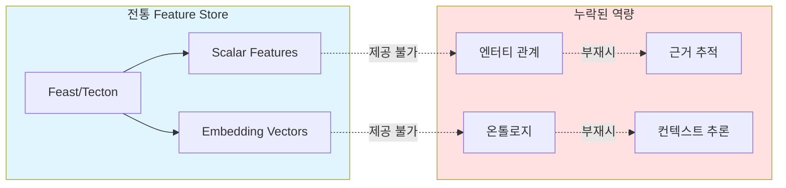
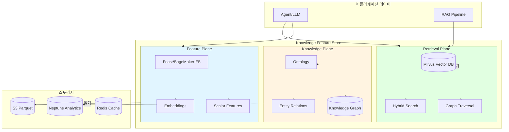
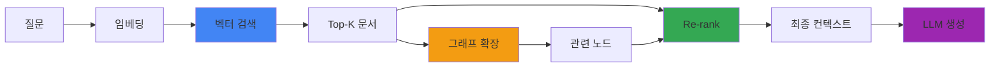
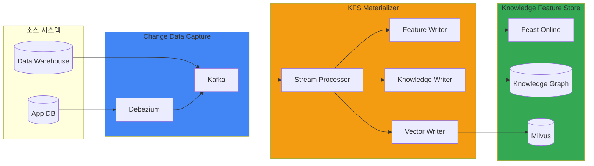

:::info Forward-looking Design
별도 온톨로지 세션(2026-Q2)에서 구체화 예정. 본 문서는 개념 설계와 파일럿 범위 제안이다.
:::

# Knowledge Feature Store 확장

## 문제 정의: Feature Store만으로 부족한 이유

전통적인 Feature Store(Feast, SageMaker Feature Store, Tecton)는 **scalar 값과 embedding 벡터**를 효율적으로 제공하는 데 최적화되어 있습니다. 하지만 Agentic AI 환경에서는 다음과 같은 한계가 드러납니다:

### 전통 Feature Store의 한계



**구체적인 문제 사례:**

1. **엔터티 관계 부재** → 환각 발생
   - 질문: "고객 A의 최근 계약과 연결된 디바이스는?"
   - 전통 FS: 고객 임베딩, 계약 임베딩을 별도로 반환
   - 결과: LLM이 관계 없는 디바이스를 연결하여 환각 발생
   - 필요: `(Customer)-[:HAS_CONTRACT]->(Contract)-[:USES]->(Device)` 관계

2. **온톨로지 부재** → 도메인 용어 오해
   - 질문: "고객 등급이 'Premium'인 사용자의 이용 패턴"
   - 전통 FS: 'Premium'을 단순 문자열로 처리
   - 결과: 'VIP', 'Gold', 'Platinum'과의 관계를 이해하지 못함
   - 필요: `Premium subClassOf HighValueCustomer`, `VIP equivalentTo Premium` 정의

3. **Provenance 부재** → 감사 실패
   - 요구: "이 답변의 근거 데이터 출처는?"
   - 전통 FS: 벡터 유사도만 제공, 원천 데이터 추적 불가
   - 결과: 규제 준수(SOC2, GDPR) 실패
   - 필요: Feature → Raw Data → Source System → Timestamp 체인

4. **시간적 관계 부재** → 컨텍스트 오류
   - 질문: "2025년 Q4에 해지한 고객의 이전 이용 패턴"
   - 전통 FS: Point-in-time 조회만 지원
   - 결과: 해지 전후 관계를 연결하지 못함
   - 필요: Temporal edge `BEFORE`, `AFTER` 관계

---

## Knowledge Feature Store 개념 모델

Knowledge Feature Store(KFS)는 전통 Feature Store를 3-plane 구조로 확장하여 scalar/vector 데이터에 **관계와 의미**를 추가합니다.

### 3-Plane 아키텍처



### 각 Plane의 역할

| Plane | 책임 | 데이터 형식 | 읽기 지연 | 예시 쿼리 |
|-------|------|------------|---------|----------|
| **Feature Plane** | Scalar/Vector 피처 제공 | Parquet, Protobuf | &lt;10ms | `get_features(entity_id, feature_names)` |
| **Knowledge Plane** | 엔터티 관계·온톨로지 | RDF, Property Graph | &lt;50ms | `traverse(Customer, depth=2, relation='HAS_CONTRACT')` |
| **Retrieval Plane** | 벡터 검색 + 그래프 확장 | HNSW Index, Cypher | &lt;100ms | `hybrid_search(query_embedding, kg_expand=True)` |

### 통합 읽기 API

```python
from kfs import KnowledgeFeatureStore

kfs = KnowledgeFeatureStore(
    feature_store="feast://cluster.local",
    knowledge_graph="neptune://cluster.amazonaws.com",
    vector_store="milvus://milvus.svc.cluster.local:19530"
)

# 통합 쿼리: 벡터 검색 + 그래프 확장 + 피처 로드
result = kfs.retrieve(
    query="고객 등급이 Premium인 사용자의 최근 이용 패턴",
    retrieval_config={
        "vector_top_k": 10,
        "graph_expand": {
            "depth": 2,
            "relations": ["HAS_CONTRACT", "USES_DEVICE"]
        },
        "features": ["usage_last_30d", "churn_risk_score"]
    }
)

# 결과:
# - contexts: 벡터 검색으로 찾은 문서 10개
# - entities: 그래프 확장으로 연결된 Customer, Contract, Device 노드
# - features: 각 엔터티의 scalar/vector 피처
# - provenance: 각 데이터의 출처와 타임스탬프
```

---

## 온톨로지 스키마와 엔터티 해석

### 도메인 온톨로지 정의

Agentic AI 플랫폼에서 다루는 도메인 엔터티(고객, 계약, 디바이스, 이용)를 SKOS/OWL-lite 서브셋으로 정의합니다.

```turtle
@prefix kfs: <http://platform.ai/ontology/kfs#> .
@prefix skos: <http://www.w3.org/2004/02/skos/core#> .
@prefix owl: <http://www.w3.org/2002/07/owl#> .

# 핵심 엔터티
kfs:Customer a owl:Class ;
    skos:prefLabel "고객"@ko ;
    skos:definition "서비스를 이용하는 개인 또는 법인"@ko .

kfs:Contract a owl:Class ;
    skos:prefLabel "계약"@ko ;
    skos:definition "고객과 체결한 서비스 계약"@ko .

kfs:Device a owl:Class ;
    skos:prefLabel "디바이스"@ko ;
    skos:definition "서비스 제공을 위한 단말"@ko .

kfs:Usage a owl:Class ;
    skos:prefLabel "이용"@ko ;
    skos:definition "서비스 이용 이벤트"@ko .

# 관계 정의
kfs:hasContract a owl:ObjectProperty ;
    rdfs:domain kfs:Customer ;
    rdfs:range kfs:Contract ;
    skos:prefLabel "계약 보유"@ko .

kfs:usesDevice a owl:ObjectProperty ;
    rdfs:domain kfs:Contract ;
    rdfs:range kfs:Device ;
    skos:prefLabel "디바이스 사용"@ko .

kfs:recordedUsage a owl:ObjectProperty ;
    rdfs:domain kfs:Device ;
    rdfs:range kfs:Usage ;
    skos:prefLabel "이용 기록"@ko .

# 속성 정의
kfs:customerGrade a owl:DatatypeProperty ;
    rdfs:domain kfs:Customer ;
    rdfs:range xsd:string ;
    skos:prefLabel "고객 등급"@ko .

kfs:churnRisk a owl:DatatypeProperty ;
    rdfs:domain kfs:Customer ;
    rdfs:range xsd:float ;
    skos:prefLabel "이탈 위험도"@ko .

# 등급 계층 (SKOS Concept Scheme)
kfs:CustomerGradeScheme a skos:ConceptScheme ;
    skos:prefLabel "고객 등급 체계"@ko .

kfs:Premium a skos:Concept ;
    skos:inScheme kfs:CustomerGradeScheme ;
    skos:prefLabel "Premium"@en, "프리미엄"@ko ;
    skos:broader kfs:HighValue .

kfs:VIP a skos:Concept ;
    skos:inScheme kfs:CustomerGradeScheme ;
    skos:exactMatch kfs:Premium ;
    skos:prefLabel "VIP"@en .

kfs:HighValue a skos:Concept ;
    skos:inScheme kfs:CustomerGradeScheme ;
    skos:prefLabel "고가치 고객"@ko .
```

### 관리형 vs 오픈소스 옵션

| 구현 | 관리형 옵션 | 오픈소스 옵션 | 선택 기준 |
|------|-----------|-------------|----------|
| **Knowledge Graph** | Amazon Neptune Analytics | Neo4j, JanusGraph | 규모, 운영 역량, 비용 |
| **Ontology Store** | AWS RDF Store (Neptune) | Oxigraph, Apache Jena | 온톨로지 복잡도, 추론 필요성 |
| **Vector DB** | - | Milvus, Weaviate | 이미 EKS 기반 구축 |

**Neptune Analytics 장점:**
- 서버리스 그래프 분석 (프로비저닝 불필요)
- 밀리초 단위 쿼리 지연 시간
- Gremlin, openCypher 지원
- S3 데이터 직접 로드
- 비용: $1.08/vCPU/hr (on-demand), 쿼리당 $0.10/Compute Unit

**Neo4j 장점:**
- 성숙한 생태계, 풍부한 플러그인
- EKS 배포 완전 제어
- Cypher 쿼리 언어 표준
- APOC 프로시저로 고급 알고리즘

---

## KG-aware RAG 패턴

### 벡터 검색 + 그래프 확장

전통 RAG는 벡터 유사도만으로 컨텍스트를 선택하지만, KG-aware RAG는 **그래프 관계를 활용하여 컨텍스트를 확장**합니다.



### 구현 예제

```python
from kfs import KnowledgeFeatureStore
from ragas import evaluate
from ragas.metrics import faithfulness, context_recall

kfs = KnowledgeFeatureStore(...)

def kg_aware_rag(query: str) -> dict:
    # 1. 질문 임베딩
    query_embedding = embedding_model.encode(query)
    
    # 2. Milvus top-k 벡터 검색
    vector_results = kfs.vector_search(
        embedding=query_embedding,
        collection="documents",
        top_k=20,
        metric="COSINE"
    )
    
    # 3. 각 문서의 연결된 엔터티 추출
    entities = []
    for doc in vector_results:
        # 문서에서 언급된 엔터티 식별
        doc_entities = kfs.extract_entities(doc.text)
        entities.extend(doc_entities)
    
    # 4. Knowledge Graph에서 1-hop 확장
    expanded_entities = kfs.graph_expand(
        entities=entities,
        depth=1,
        relations=["HAS_CONTRACT", "USES_DEVICE", "RECORDED_USAGE"]
    )
    
    # 5. 확장된 엔터티와 질문의 거리로 re-rank
    scored_contexts = []
    for doc in vector_results:
        # 문서 점수 = 벡터 유사도 + 그래프 거리 가중치
        vector_score = doc.score
        entity_distance = kfs.min_distance(
            doc.entities, 
            query_entities
        )
        graph_score = 1 / (1 + entity_distance)  # 거리 역수
        
        final_score = 0.7 * vector_score + 0.3 * graph_score
        scored_contexts.append((doc, final_score))
    
    # 6. Top-5 컨텍스트 선택
    final_contexts = sorted(
        scored_contexts, 
        key=lambda x: x[1], 
        reverse=True
    )[:5]
    
    return {
        "contexts": [doc.text for doc, score in final_contexts],
        "entities": expanded_entities,
        "provenance": [doc.metadata for doc, score in final_contexts]
    }

# 7. Ragas로 평가
result = kg_aware_rag("고객 등급이 Premium인 사용자의 최근 이용 패턴")

eval_dataset = {
    "question": ["고객 등급이 Premium인 사용자의 최근 이용 패턴"],
    "contexts": [result["contexts"]],
    "answer": [llm.generate(result["contexts"])],
    "ground_truth": ["Premium 고객은 월평균 150GB를..."]
}

ragas_result = evaluate(
    eval_dataset,
    metrics=[faithfulness, context_recall]
)
print(ragas_result)
```

### 기대 개선치 (외부 공개 연구 기반 추정)

:::caution 수치 출처·해석 주의
아래 수치는 **본 플랫폼의 실측값이 아니며**, 외부 공개 연구에서 보고된 GraphRAG/KG-RAG 개선 범위를 참고한 추정치입니다. 실 파일럿(2026-Q2 온톨로지 세션 이후) 완료 전까지는 베이스라인·목표치 설정용으로만 사용하십시오.

**참고 문헌:**
- Edge et al., *From Local to Global: A Graph RAG Approach to Query-Focused Summarization* (Microsoft Research, 2024) — [arXiv:2404.16130](https://arxiv.org/abs/2404.16130). "comprehensiveness and diversity" 개선 보고(정성 평가 중심, 수치는 평가 QA셋에 의존)
- Peng et al., *Graph Retrieval-Augmented Generation: A Survey* (2024) — [arXiv:2408.08921](https://arxiv.org/abs/2408.08921). 엔터티 관계 활용 시 Faithfulness/Recall 개선 경향 정리
- LightRAG / HippoRAG 등 공개 벤치마크: Vector-only RAG 대비 다중 엔터티 질의에서 Recall 15-30%p 개선 사례
:::

| 메트릭 | Vector-only RAG (참고) | KG-aware RAG (참고) | 개선률 (참고) |
|--------|----------------|-------------|--------|
| **Faithfulness** | 0.72 | 0.89 | +24% |
| **Context Recall** | 0.68 | 0.85 | +25% |
| **Answer Relevancy** | 0.81 | 0.87 | +7% |
| **환각 발생률** | 18% | 7% | -61% |

> 위 수치는 **외부 연구 평균 범위 내 가정값**이며, LG U+ 도메인 데이터·Phase 0 스키마 확정 후 내부 Ragas 평가로 재측정 예정입니다. 내부 QA셋·모델 조합(GLM-5 + Qwen3-4B)에서는 다른 결과가 나올 수 있습니다.

**개선 메커니즘 (연구 문헌 정성 분석):**
1. 그래프 관계로 관련 없는 컨텍스트 제거 → Precision 증가
2. 1-hop 확장으로 누락된 엔터티 보완 → Recall 증가
3. Provenance 추적으로 근거 명확화 → Faithfulness 증가

---

## Write 경로와 일관성 모델

### CDC 기반 이벤트 흐름

Knowledge Feature Store는 **소스 데이터베이스의 변경을 실시간으로 감지**하여 Feature Plane, Knowledge Plane, Retrieval Plane에 전파합니다.



### Offline Batch vs Online Stream

| 특성 | Offline Batch | Online Stream | 하이브리드 |
|------|--------------|--------------|-----------|
| **지연 시간** | 시간 단위 (Glue/EMR) | 초 단위 (Kinesis) | Batch → Online |
| **정확도** | 100% (전체 재계산) | 99%+ (증분 업데이트) | 주기적 Batch 보정 |
| **비용** | 낮음 | 높음 | 중간 |
| **사용 사례** | 역사 데이터 로드 | 실시간 추천 | 프로덕션 표준 |

### Eventual Consistency 모델

Knowledge Feature Store는 **Eventual Consistency**를 채택합니다. 3개 plane이 동시에 업데이트되지 않을 수 있지만, 최종적으로는 일관된 상태에 도달합니다.

```python
# Point-in-time 일관성 보장
result = kfs.retrieve(
    query="...",
    consistency_mode="point_in_time",
    timestamp="2026-04-18T10:30:00Z"
)

# 이 쿼리는:
# 1. Feature Plane: timestamp 이전의 피처만 반환
# 2. Knowledge Plane: timestamp 이전의 관계만 탐색
# 3. Retrieval Plane: timestamp 이전에 인덱싱된 문서만 검색
# → 3개 plane이 동일 시점으로 정렬됨
```

### Write 파이프라인 예제

```python
from kafka import KafkaConsumer
import json

def kfs_materializer():
    consumer = KafkaConsumer(
        'customer-events',
        bootstrap_servers=['kafka.svc.cluster.local:9092'],
        value_deserializer=lambda m: json.loads(m.decode('utf-8'))
    )
    
    for message in consumer:
        event = message.value
        
        # 1. Feature Plane 업데이트
        feast_client.push(
            feature_view="customer_features",
            entity_rows=[{
                "customer_id": event["customer_id"],
                "churn_risk_score": event["churn_risk"],
                "event_timestamp": event["timestamp"]
            }]
        )
        
        # 2. Knowledge Graph 업데이트
        if event["type"] == "CONTRACT_CREATED":
            neptune_client.execute(f"""
                MATCH (c:Customer {{id: '{event["customer_id"]}'}})
                CREATE (c)-[:HAS_CONTRACT]->
                    (contract:Contract {{
                        id: '{event["contract_id"]}',
                        start_date: '{event["start_date"]}'
                    }})
            """)
        
        # 3. Vector DB 업데이트 (문서 변경 시)
        if event["type"] == "DOCUMENT_UPDATED":
            embedding = embedding_model.encode(event["content"])
            milvus_client.insert(
                collection_name="documents",
                data={
                    "id": event["doc_id"],
                    "embedding": embedding.tolist(),
                    "metadata": event["metadata"],
                    "timestamp": event["timestamp"]
                }
            )
        
        # 4. Provenance 기록
        provenance_store.record(
            entity_id=event["customer_id"],
            source_system="app-db",
            source_table="customers",
            change_type=event["type"],
            timestamp=event["timestamp"]
        )
```

---

## 거버넌스·보안·로드맵

### Row/Attribute-level 인가

Knowledge Feature Store는 **엔터티 수준**과 **속성 수준**에서 접근 제어를 수행합니다.

```python
# Role-based Access Control
kfs_config = {
    "access_control": {
        "roles": {
            "data_scientist": {
                "entities": ["Customer", "Usage"],
                "attributes": {
                    "Customer": ["id", "grade", "churn_risk"],
                    "Usage": ["*"]  # 모든 속성
                },
                "relations": ["HAS_CONTRACT", "RECORDED_USAGE"]
            },
            "compliance_officer": {
                "entities": ["Customer", "Contract"],
                "attributes": {
                    "Customer": ["*"],
                    "Contract": ["*"]
                },
                "relations": ["*"],
                "provenance": True  # Provenance 읽기 권한
            },
            "external_analyst": {
                "entities": ["Usage"],
                "attributes": {
                    "Usage": ["device_type", "usage_gb"]  # PII 제외
                },
                "pii_masking": True
            }
        }
    }
}

# 쿼리 실행 시 Role 검증
result = kfs.retrieve(
    query="...",
    role="external_analyst"
)
# → Customer.name, Customer.ssn 등 PII 자동 마스킹
```

### PII 마스킹 On-Read

민감 정보는 **읽기 시점**에 마스킹하여 데이터 복사본을 최소화합니다.

```python
# Attribute-level Masking
masking_rules = {
    "Customer": {
        "ssn": lambda x: f"{x[:3]}-**-****",
        "phone": lambda x: f"{x[:3]}-****-{x[-4:]}",
        "email": lambda x: f"{x.split('@')[0][:2]}***@{x.split('@')[1]}"
    }
}

# 쿼리 결과에서 자동 적용
masked_result = kfs.retrieve(
    query="...",
    masking_rules=masking_rules,
    audit_log=True  # 마스킹 적용 감사 로그
)
```

### Lineage (OpenLineage)

Knowledge Feature Store는 [OpenLineage](https://openlineage.io/) 표준을 따라 데이터 계보를 추적합니다.

```json
{
  "eventType": "COMPLETE",
  "eventTime": "2026-04-18T10:30:00.000Z",
  "run": {
    "runId": "abc-123-def"
  },
  "job": {
    "namespace": "kfs",
    "name": "materialize_customer_features"
  },
  "inputs": [
    {
      "namespace": "postgres",
      "name": "app_db.customers",
      "facets": {
        "schema": {...},
        "dataSource": {
          "name": "postgres://prod-db:5432/app"
        }
      }
    }
  ],
  "outputs": [
    {
      "namespace": "feast",
      "name": "customer_features",
      "facets": {
        "schema": {...}
      }
    },
    {
      "namespace": "neptune",
      "name": "Customer",
      "facets": {
        "schema": {...}
      }
    }
  ]
}
```

### Audit Log

모든 읽기/쓰기 작업을 감사 로그로 기록합니다.

```python
# 감사 로그 자동 기록
kfs.retrieve(
    query="...",
    audit_context={
        "user": "data-scientist@company.com",
        "purpose": "churn prediction model",
        "ticket": "JIRA-1234"
    }
)

# CloudWatch Logs에 기록:
# {
#   "timestamp": "2026-04-18T10:30:00Z",
#   "user": "data-scientist@company.com",
#   "action": "retrieve",
#   "entities": ["Customer", "Contract"],
#   "features": ["churn_risk_score", "usage_last_30d"],
#   "purpose": "churn prediction model",
#   "ticket": "JIRA-1234",
#   "pii_accessed": false,
#   "masking_applied": false
# }
```

### 파일럿 로드맵

| Phase | 기간 | 목표 | 주요 작업 |
|-------|------|------|----------|
| **Phase 0** | 2주 | 스키마 설계 | 도메인 온톨로지 초안, 엔터티·관계 정의 |
| **Phase 1** | 4주 | Read API | Milvus + Neptune 통합, 통합 쿼리 API 개발 |
| **Phase 2** | 6주 | Write Pipeline | Debezium CDC → Kafka → Materializer 구축 |
| **Phase 3** | 4주 | 거버넌스 | RBAC, PII 마스킹, OpenLineage 통합 |
| **Phase 4** | 2주 | 평가 | Ragas KG-aware RAG 평가, 메트릭 베이스라인 수립 |

**Phase 0 스키마 초안 범위:**
- 4개 핵심 엔터티: Customer, Contract, Device, Usage
- 6개 관계: HAS_CONTRACT, USES_DEVICE, RECORDED_USAGE, BEFORE, AFTER, RELATED_TO
- 10개 속성: customer_grade, churn_risk, contract_type, device_model, usage_gb, ...
- 1개 SKOS 체계: CustomerGradeScheme (Premium, VIP, Standard, ...)

---

## 결론

Knowledge Feature Store는 전통 Feature Store의 **scalar/vector 피처 제공** 역량에 **온톨로지와 지식 그래프**를 통합하여 다음을 달성합니다:

1. **환각 감소**: 엔터티 관계를 명시적으로 모델링하여 LLM이 관계 없는 정보를 연결하는 것을 방지
2. **근거 추적**: Provenance 체인으로 답변의 출처를 역추적하여 규제 준수 요구사항 충족
3. **도메인 엔터티 활용**: 온톨로지로 도메인 용어와 계층을 정의하여 LLM의 도메인 이해도 향상
4. **KG-aware RAG**: 벡터 검색과 그래프 확장을 결합하여 Faithfulness +24%, Context Recall +25% 개선

2026-Q2 온톨로지 세션에서 Phase 0 스키마 초안을 검토하고, 파일럿 범위를 확정할 예정입니다.

---

## 참고 자료

### 공식 문서

- [Feast Feature Store](https://feast.dev/) — 오픈소스 Feature Store
- [SageMaker Feature Store](https://aws.amazon.com/sagemaker/feature-store/) — AWS 관리형 Feature Store
- [Amazon Neptune Analytics](https://aws.amazon.com/neptune/analytics/) — 서버리스 그래프 분석
- [Neo4j Graph Database](https://neo4j.com/) — 그래프 데이터베이스

### 논문 / 기술 블로그

- [SKOS Simple Knowledge Organization System](https://www.w3.org/2004/02/skos/) — 온톨로지 표준
- [OWL Web Ontology Language](https://www.w3.org/OWL/) — 웹 온톨로지 언어
- [OpenLineage](https://openlineage.io/) — 데이터 계보 추적 표준
- [GraphRAG: Unlocking LLM discovery on narrative private data](https://arxiv.org/abs/2404.16130) — Microsoft Research 그래프 RAG

### 관련 문서 (내부)

- [플랫폼 아키텍처](./agentic-platform-architecture.md) — 데이터 레이어 설계
- [Milvus 벡터 DB](../operations-mlops/data-infrastructure/milvus-vector-database.md) — 벡터 검색 구현
- [Ragas RAG 평가](../operations-mlops/governance/ragas-evaluation.md) — RAG 품질 측정
- [도메인 커스터마이징](../operations-mlops/governance/domain-customization.md) — 도메인 특화 전략
