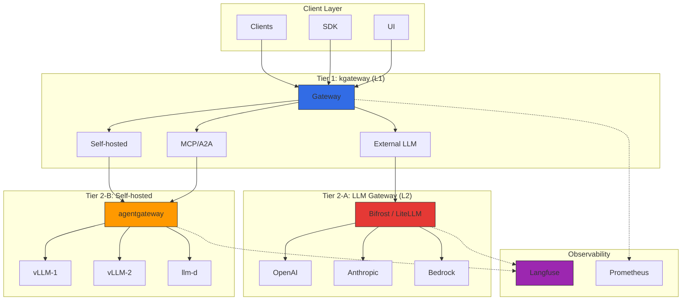
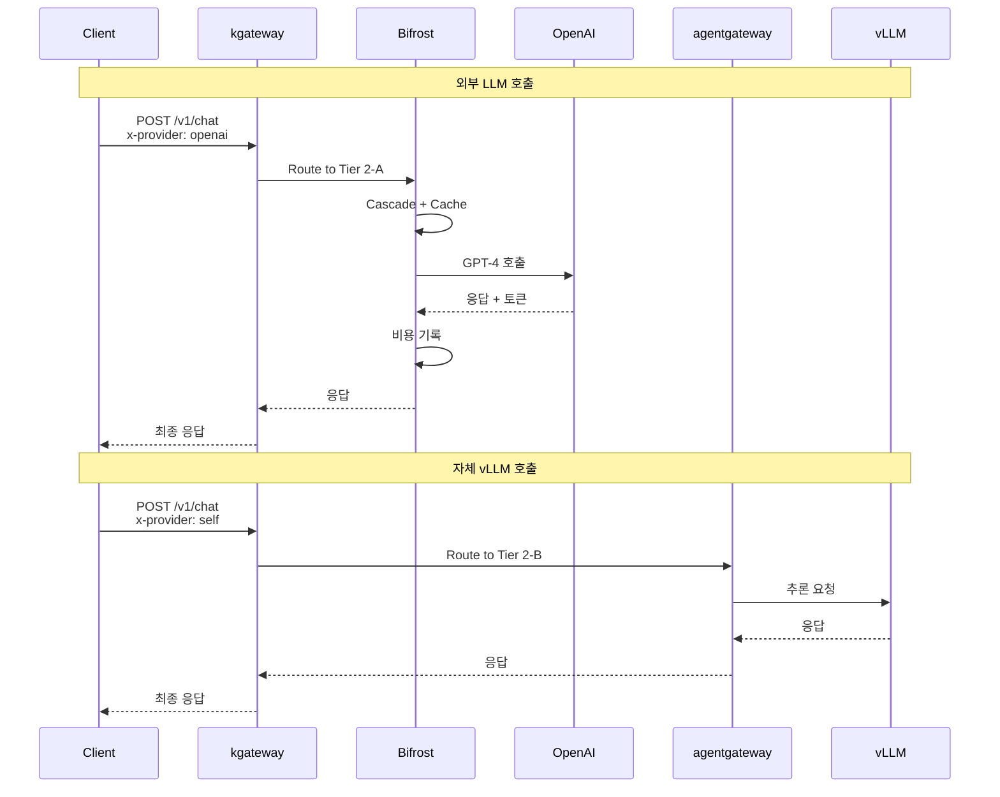
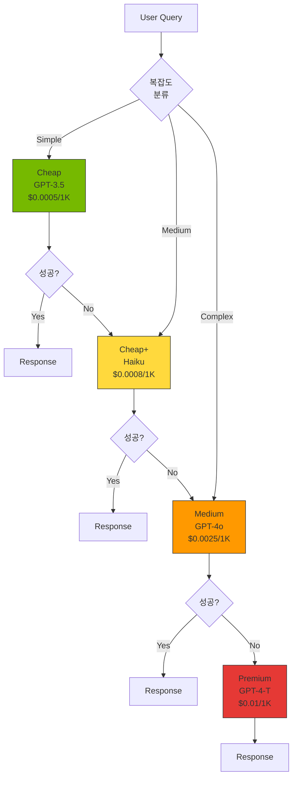
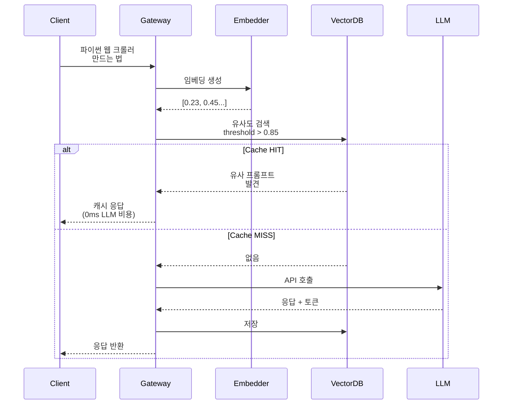
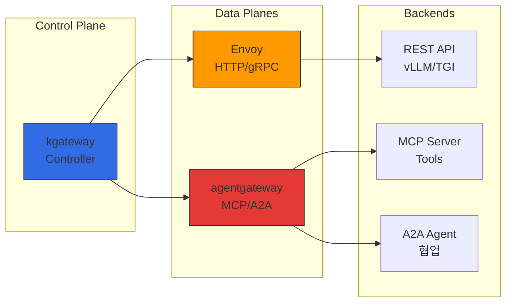

# 추론 게이트웨이 & LLM Gateway 아키텍처

> 작성일: 2025-02-05 | 수정일: 2026-04-05 | 읽는 시간: 약 12분

## 개요

대규모 AI 모델 서빙 환경에서는 **인프라 레벨의 트래픽 관리**와 **LLM 프로바이더 추상화**라는 두 가지 서로 다른 관심사를 분리해야 합니다. 단일 Gateway로 모든 기능을 처리하면 복잡성이 급증하고 각 레이어의 특화된 기능을 최적화하기 어렵습니다.

| 관심사 | 요구사항 | 단일 Gateway 문제점 |
|--------|----------|-------------------|
| **인프라 트래픽 관리** | Kubernetes 네이티브 라우팅, mTLS, 서킷 브레이커 | LLM 특화 로직과 혼재되어 복잡도 증가 |
| **LLM 프로바이더 추상화** | 100+ 프로바이더 통합, 토큰 카운팅, 시맨틱 캐싱 | Envoy/Gateway API 확장으로 구현 시 비표준 의존성 발생 |
| **AI 프로토콜** | MCP, A2A, JSON-RPC 세션 | 범용 Gateway는 stateful 세션 지원 미비 |

이를 해결하기 위해 **2-Tier Gateway 아키텍처**를 채택합니다:

- **L1 (Inference Gateway)**: kgateway 기반 Kubernetes Gateway API 표준 구현체로 트래픽 라우팅, mTLS, rate limiting 처리
- **L2 (LLM Gateway)**: Bifrost 또는 LiteLLM 기반 경량 게이트웨이로 프로바이더 통합, cascade routing, semantic caching 담당

이 분리를 통해 각 티어는 자신의 관심사에만 집중하고, 운영팀은 인프라와 AI 워크로드를 독립적으로 관리할 수 있습니다.

---

## 2-Tier Gateway 아키텍처

### 전체 구조

### Tier별 역할 분리

| Tier | 컴포넌트 | 책임 | 프로토콜 |
|------|----------|------|----------|
| **Tier 1** | kgateway (Envoy 기반) | 트래픽 라우팅, mTLS, rate limiting, 네트워크 정책 | HTTP/HTTPS, gRPC |
| **Tier 2-A** | Bifrost (또는 LiteLLM) | 외부 LLM 프로바이더 통합, 비용 추적, cascade routing, semantic caching | OpenAI-compatible API |
| **Tier 2-B** | agentgateway | 자체 추론 인프라 라우팅, MCP/A2A 세션, Tool Poisoning 방지 | HTTP, JSON-RPC, MCP, A2A |

### 트래픽 플로우

---

## kgateway (L1 Inference Gateway)

### Gateway API 기반 라우팅

kgateway는 Kubernetes Gateway API 표준을 구현하여 벤더 중립적인 설정이 가능합니다. 핵심 리소스는 다음과 같습니다:

import { ComponentStructureTable } from '@site/src/components/InferenceGatewayTables';

<ComponentStructureTable />

- **GatewayClass**: Gateway 구현체를 정의하는 클러스터 수준 리소스. kgateway 컨트롤러를 지정합니다.
- **Gateway**: 실제 리스너(포트, 프로토콜, TLS)를 정의합니다. AWS NLB와 통합하여 외부 트래픽을 수신합니다.
- **HTTPRoute**: 경로, 헤더, 가중치 등 조건 기반으로 백엔드 서비스를 선택하는 라우팅 규칙입니다.

:::info Gateway API 표준
Gateway API v1.2.0+는 HTTPRoute 개선, GRPCRoute 안정화, BackendTLSPolicy 등을 제공합니다. kgateway v2.0+는 이 표준을 완전히 지원하며, 다른 Gateway 구현체로의 마이그레이션이 용이합니다.
:::

### Dynamic Routing 개념

kgateway는 요청 특성에 따라 다양한 라우팅 전략을 지원합니다:

| 라우팅 유형 | 기준 | 사용 사례 |
|------------|------|----------|
| **헤더 기반** | `x-model-id`, `x-provider` 등 | 모델별/프로바이더별 백엔드 선택 |
| **경로 기반** | `/v1/chat/completions`, `/v1/embeddings` | API 유형별 서비스 분리 |
| **가중치 기반** | backendRef weight | 카나리 배포, A/B 테스트 |
| **복합 조건** | 헤더 + 경로 + 고객 티어 | 프리미엄/일반 고객별 전용 백엔드 |

**카나리 배포 전략**: 새 모델 버전을 5-10% 트래픽으로 시작하여, 오류율/지연 시간/품질 메트릭을 모니터링하면서 25% -> 50% -> 75% -> 100%로 점진적으로 증가시킵니다. 문제 발생 시 weight를 0으로 설정하여 즉시 롤백합니다.

### 로드 밸런싱 전략

| 전략 | 설명 | 적합 시나리오 |
|------|------|--------------|
| **Round Robin** | 순차적 분배 (기본값) | 균일한 모델 인스턴스 |
| **Random** | 무작위 분배 | 대규모 백엔드 풀 |
| **Consistent Hash** | 동일 키 → 동일 백엔드 | KV Cache 재활용, 세션 유지 |

Consistent Hash는 LLM 추론에서 특히 유용합니다. 동일 사용자의 요청을 같은 vLLM 인스턴스로 라우팅하면 prefix cache 적중률이 높아져 TTFT(Time to First Token)를 크게 개선할 수 있습니다.

### Topology-Aware Routing (Kubernetes 1.33+)

Kubernetes 1.33+의 topology-aware routing을 활용하면 동일 AZ 내 Pod 간 통신을 우선시하여 크로스 AZ 데이터 전송 비용을 절감합니다.

import { TopologyEffectsTable } from '@site/src/components/InferenceGatewayTables';

<TopologyEffectsTable />

### 장애 대응 개념

AI 추론 환경에서는 다음 세 가지 장애 대응 메커니즘이 핵심입니다:

| 메커니즘 | 설명 | LLM 추론 고려사항 |
|----------|------|-------------------|
| **타임아웃** | 요청별 최대 처리 시간 제한 | LLM은 긴 응답 생성 시 수십 초 소요 가능. 충분한 타임아웃 필요 (120s+) |
| **재시도** | 5xx, 타임아웃, 연결 실패 시 자동 재시도 | 최대 3회 제한. 무한 재시도는 시스템 과부하 유발 |
| **서킷 브레이커** | 연속 실패 시 백엔드 일시 차단 | 너무 민감한 설정은 정상 트래픽도 차단. GPU OOM 등 일시적 오류 구분 필요 |

:::danger 장애 대응 주의사항
- **타임아웃**: 스트리밍 응답 시 `backendRequest` 타임아웃은 첫 바이트까지의 시간, `request`는 전체 요청 시간
- **재시도**: POST 요청의 재시도는 멱등성을 보장해야 함. LLM 추론은 대부분 멱등하나 도구 호출은 주의 필요
- **서킷 브레이커**: `maxEjectionPercent`를 50% 이하로 설정하여 최소 절반의 백엔드는 항상 가용하도록 보장
:::

---

## LLM Gateway 솔루션 비교

### 주요 솔루션 비교 표

| 솔루션 | 언어 | 주요 특징 | 프로바이더 수 | 라이선스 | 적합 환경 |
|--------|------|-----------|---------------|----------|-----------|
| **Bifrost** | Go/Rust | 50x faster, cascade routing, 통합 API | 20+ | Apache 2.0 | 고성능, 저비용, 셀프호스트 |
| **LiteLLM** | Python | 100+ 프로바이더, Langfuse 네이티브 | 100+ | MIT | Python 생태계, 빠른 프로토타이핑 |
| **Portkey** | TypeScript | SOC2 인증, semantic caching, Virtual Keys | 250+ | Proprietary + OSS | 엔터프라이즈, 규정 준수 |
| **Kong AI Gateway** | Lua/C | MCP 지원, 기존 Kong 인프라 활용 | 10+ | Apache 2.0 / Enterprise | 기존 Kong 사용자 |
| **Cloudflare AI Gateway** | Edge Workers | 글로벌 CDN, edge caching, DDoS 방어 | 10+ | Proprietary | 글로벌 배포, edge 레이턴시 |
| **Helicone** | Rust | Gateway + Observability 통합, 고성능 | 50+ | Apache 2.0 | 고성능 + 관측성 동시 필요 |
| **OpenRouter** | TypeScript | 호스티드, 200+ 모델, API 키 하나로 통합 | 200+ | Proprietary | 빠른 시작, 프로토타이핑 |

### Bifrost: 고성능 LLM Gateway

**장점:**
- Go/Rust 구현으로 Python 대비 **50배 빠른 throughput**, 1/10 메모리 사용
- Cascade routing 네이티브 지원 (cheap -> premium 자동 라우팅)
- Kubernetes Helm Chart 네이티브 배포
- OpenAI 호환 Unified API

**단점:**
- 프로바이더 수는 LiteLLM보다 적음 (20+ vs 100+)
- 문서화는 LiteLLM이 더 성숙

**설정 방식**: `config.json` 기반 Gateway 모드 (ConfigMap으로 선언적 관리). 모델명은 `provider/model` 포맷 (예: `openai/glm-5`). 프록시 레이턴시 100us 미만.

### LiteLLM: Python 생태계 대안

**장점:**
- 100+ 프로바이더 지원 (OpenAI, Anthropic, Bedrock, Azure, GCP 등)
- `success_callback: ["langfuse"]` 한 줄로 Langfuse 연동
- LangChain, LlamaIndex 직접 통합
- Virtual Keys, Budget Control, Rate Limiting 내장

**단점:**
- Python 기반으로 Bifrost 대비 낮은 throughput
- 대규모 concurrent 요청 시 메모리 사용량 높음

### 선택 기준

| 사용 사례 | 권장 솔루션 | 이유 |
|-----------|-----------|------|
| 고성능, 저비용 셀프호스트 | **Bifrost** | 50x 빠른 처리, 저메모리 |
| Python 생태계 (LangChain) | **LiteLLM** | 네이티브 통합, 100+ 프로바이더 |
| 엔터프라이즈 규정 준수 | **Portkey** | SOC2/HIPAA/GDPR, Semantic Cache |
| 고성능 + 관측성 통합 | **Helicone** | Rust 기반 All-in-one |
| 빠른 프로토타이핑 | **OpenRouter** | 호스티드, 즉시 시작 |

### 시나리오별 추천 조합

| 시나리오 | 추천 조합 | 이유 |
|----------|----------|------|
| **스타트업/PoC** | kgateway + Bifrost | 저비용 셀프호스트, 10분 배포 |
| **셀프호스트 중심** | kgateway + agentgateway + vLLM | 외부 API 의존 최소화, MCP/A2A 지원 |
| **엔터프라이즈 멀티 프로바이더** | kgateway + Portkey + Langfuse | 규정 준수, 250+ 프로바이더 |
| **하이브리드 (외부+자체)** | kgateway + Bifrost + agentgateway | 풀 2-Tier: 외부는 Bifrost, 자체는 agentgateway |
| **글로벌 배포** | Cloudflare AI Gateway + kgateway | Edge caching, DDoS 방어 |

---

## Cascade Routing (비용 최적화)

### 개념

Cascade Routing은 쿼리 복잡도에 따라 **cheap -> medium -> premium** 모델을 단계적으로 시도하여 비용을 최적화합니다. 간단한 질의는 저렴한 모델로 처리하고, 실패하거나 품질이 낮을 경우에만 상위 모델로 escalate합니다.

### Fallback 조건

각 단계에서 다음 조건 충족 시 상위 모델로 escalate합니다:

| 조건 | 설명 |
|------|------|
| **HTTP 5xx** | 서버 오류 (500, 502, 503, 504) |
| **Rate Limit** | 프로바이더 rate limit 초과 |
| **Timeout** | 응답 시간 초과 |
| **Quality Score < 0.7** | 응답 품질 점수 미달 (옵션) |

### 복잡도 분류 기준

| 조건 | 시작 모델 | 예시 |
|------|----------|------|
| 토큰 < 100, 코드 블록 없음 | Cheap (GPT-3.5) | "오늘 날씨 어때?" |
| 토큰 < 500 | Cheap+ (Haiku) | "이메일 초안 작성해줘" |
| 토큰 < 1500 또는 코드 포함 | Medium (GPT-4o) | "Python 함수 리팩토링" |
| 토큰 > 1500 | Premium (GPT-4 Turbo) | "시스템 아키텍처 설계" |

### 비용 절감 효과

**시나리오**: 일 10,000 요청

| 복잡도 분포 | 모델 | 요청 수 | 단가 ($/1K out) | 비용 |
|-------------|------|---------|-----------------|------|
| Simple (50%) | GPT-3.5 Turbo | 5,000 | $0.0005 | $2.5 |
| Medium (30%) | Claude Haiku | 3,000 | $0.0008 | $2.4 |
| Complex (15%) | GPT-4o | 1,500 | $0.0025 | $3.75 |
| Very Complex (5%) | GPT-4 Turbo | 500 | $0.01 | $5 |
| **합계** | | 10,000 | | **$13.65/일** |

**비교**: 모든 요청을 GPT-4 Turbo로 처리 시 $50/일. **Cascade Routing으로 73% 절감**.

---

## Semantic Caching

### 개념

Semantic Caching은 동일한 프롬프트가 아닌 **의미적으로 유사한 프롬프트**를 감지하여 이전 응답을 재사용함으로써 LLM API 비용을 절감합니다. 임베딩 기반 유사도 매칭을 사용합니다.

### 유사도 임계값 (Similarity Threshold)

| Threshold | 의미 | 캐시 적중률 | 정확도 |
|-----------|------|-------------|--------|
| **0.95+** | 거의 동일한 문장 | 낮음 (~10%) | 매우 높음 |
| **0.85-0.94** | 의미가 같고 표현이 약간 다름 | 중간 (~30%) | 높음 **(권장)** |
| **0.75-0.84** | 유사한 주제 | 높음 (~50%) | 중간 (거짓 긍정 위험) |
| **0.70 이하** | 관련 있는 주제 | 매우 높음 | 낮음 (부적절한 응답 위험) |

**권장 설정**: **0.85** (의미는 같고 표현만 다른 경우 캐시 재사용)

### 비용 절감 효과

**시나리오**: 일 10,000 요청, 캐시 적중률 30%, GPT-4 Turbo

| 항목 | 캐시 없음 | Semantic Cache 적용 |
|------|-----------|---------------------|
| 실제 LLM 호출 | 10,000 | 7,000 (30% 절감) |
| 토큰 (평균 500 out/req) | 5M tokens | 3.5M tokens |
| 월 비용 | **$4,500** | **$3,150 (30% 절감)** |

추가 비용: 임베딩 모델 ~$0.5/월, Redis/Milvus ~$10-20/월. **순 절감: ~$1,300/월 (29%)**

:::tip Semantic Caching 구현 옵션
- **Portkey**: 내장 semantic cache (`similarityThreshold: 0.85` 설정)
- **Helicone**: Rust 기반 고성능 semantic cache
- **자체 구현**: Redis + 임베딩 모델 + cosine similarity (상세 구성은 Reference Architecture 참조)
:::

---

## agentgateway 데이터 플레인

### 개요

**agentgateway**는 kgateway의 AI 워크로드 전용 데이터 플레인입니다. 기존 Envoy 데이터 플레인은 stateless HTTP/gRPC 트래픽에 최적화되어 있지만, AI 에이전트는 stateful JSON-RPC 세션, MCP 프로토콜, Tool Poisoning 방지 등 특수한 요구사항을 가지고 있습니다.

### Envoy vs agentgateway 비교

| 항목 | Envoy 데이터 플레인 | agentgateway |
|------|---------------------|---------------------------|
| **세션 관리** | Stateless, HTTP 쿠키 기반 | Stateful JSON-RPC 세션, 인메모리 세션 스토어 |
| **프로토콜** | HTTP/1.1, HTTP/2, gRPC | MCP (Model Context Protocol), A2A (Agent-to-Agent) |
| **보안** | mTLS, RBAC | Tool Poisoning 방지, per-session Authorization |
| **라우팅** | 경로/헤더 기반 | 세션 ID 기반, 도구 호출 검증 |
| **관측성** | HTTP 메트릭, Access Log | LLM 토큰 추적, 도구 호출 체인, 비용 |

### 핵심 기능

#### 1. Stateful JSON-RPC 세션 관리

MCP 프로토콜은 클라이언트와 서버 간 long-lived JSON-RPC 세션을 요구합니다. agentgateway는 세션 ID를 추적하고 동일 세션의 요청을 같은 백엔드로 라우팅하여 세션 컨텍스트를 유지합니다.

- **세션 추적**: `X-MCP-Session-ID` 헤더 기반 세션 식별
- **Sticky Session**: 동일 세션의 모든 요청을 같은 백엔드로 라우팅
- **세션 타임아웃**: 비활성 세션 자동 정리 (기본 30분)

#### 2. MCP/A2A 프로토콜 네이티브 지원

kgateway의 HTTPRoute를 통해 MCP/A2A 트래픽을 agentgateway로 라우팅합니다. agentgateway는 JSON-RPC 메시지를 파싱하고 적절한 MCP 서버 또는 A2A 에이전트로 전달합니다.

- `/mcp/v1` 경로: MCP 프로토콜 트래픽
- `/a2a/v1` 경로: A2A 에이전트 간 통신

#### 3. Tool Poisoning 방지

악의적인 클라이언트가 도구 호출을 조작하여 권한 밖의 작업을 수행하는 것을 방지합니다:

- **허용 도구 목록**: 명시적으로 허용된 도구만 호출 가능
- **거부 목록**: `exec_shell`, `read_credentials` 등 위험 도구 차단
- **응답 크기 제한**: 도구 응답의 최대 크기 제한
- **무결성 검증**: 도구 설명 변조 감지 (SHA-256 해시)

#### 4. Per-session Authorization

각 세션별로 독립적인 인가 정책을 적용합니다:

- **JWT 토큰 검증**: 세션 시작 시 발급자/대상 확인
- **역할 기반 도구 접근**: admin은 모든 도구, user는 제한된 도구만 사용
- **세션 바인딩**: 인증 정보를 세션에 바인딩하여 세션 하이재킹 방지

:::info agentgateway 프로젝트 현황
agentgateway는 2025년 말 kgateway 프로젝트에서 분리된 AI 전용 데이터 플레인으로, 현재 활발하게 개발 중입니다. MCP 프로토콜과 A2A 프로토콜의 빠른 발전에 맞춰 기능이 지속적으로 추가되고 있습니다.
:::

---

## 모니터링 & Observability

### 핵심 메트릭

AI 추론 게이트웨이에서 모니터링해야 하는 핵심 메트릭은 다음과 같습니다:

import { MonitoringMetricsTable } from '@site/src/components/InferenceGatewayTables';

<MonitoringMetricsTable />

| 메트릭 카테고리 | 주요 항목 | 의미 |
|----------------|----------|------|
| **레이턴시** | TTFT (Time to First Token) | 첫 번째 토큰 생성까지의 시간. 사용자 체감 응답성 |
| **처리량** | TPS (Tokens Per Second) | 초당 토큰 생성 수. 모델 서빙 효율성 |
| **에러율** | 5xx / 전체 요청 | 백엔드 장애 비율. 5% 초과 시 즉시 대응 |
| **캐시 적중률** | Cache Hit / 전체 요청 | Semantic Cache 효율성. 30% 이상 권장 |
| **비용** | 모델별 토큰 사용량 x 단가 | 실시간 비용 추적 |

### Langfuse OTel 연동

Bifrost/LiteLLM에서 Langfuse로 OTel trace를 전송하면 다음을 추적할 수 있습니다:

- **프롬프트/완료 내용**: 실제 입출력 확인
- **토큰 사용량**: 모델별/시간별 토큰 소비
- **비용 분석**: 일별/주별 비용 트렌드
- **도구 호출 체인**: 에이전트 -> LLM -> Tool -> 응답 전체 trace

OTel 연동은 Bifrost의 `otel` 플러그인 또는 LiteLLM의 `success_callback: ["langfuse"]` 설정으로 활성화합니다. 상세 구성은 [모니터링 스택 설정](../reference-architecture/monitoring-observability-setup.md)을 참조하세요.

### 알림 규칙 권장

| 알림 | 조건 | 심각도 |
|------|------|--------|
| 높은 에러율 | 5xx > 5% (5분간) | Critical |
| 높은 레이턴시 | P99 > 30초 (5분간) | Warning |
| 서킷 브레이커 활성화 | circuit_breaker_open == 1 | Critical |
| 캐시 적중률 급락 | Cache hit < 30% | Warning |
| 예산 초과 임박 | Budget > 80% | Warning |

---

## 관련 문서

### 실전 배포 가이드

- [게이트웨이 구성 가이드](../reference-architecture/inference-gateway-setup.md) - kgateway, Bifrost, agentgateway 설치 및 YAML 매니페스트
- [OpenClaw AI Gateway 배포](../reference-architecture/openclaw-ai-gateway.mdx) - OpenClaw + Bifrost + Hubble 실전 배포
- [커스텀 모델 배포](../reference-architecture/custom-model-deployment.md) - vLLM/llm-d 배포 가이드

### 비용 및 관측성

- [코딩 도구 & 비용 분석](../reference-architecture/coding-tools-cost-analysis.md) - Aider/Cline 연결, NLB 통합 라우팅 패턴
- [모니터링 스택 설정](../reference-architecture/monitoring-observability-setup.md) - Langfuse OTel 연동, Prometheus, Grafana 대시보드
- [LLMOps Observability](../operations-mlops/llmops-observability.md) - Langfuse/LangSmith 기반 LLM 관측성

### 관련 인프라

- [GPU 리소스 관리](../model-serving/gpu-resource-management.md) - 동적 리소스 할당 전략
- [llm-d 분산 추론](../model-serving/llm-d-eks-automode.md) - EKS Auto Mode 기반 분산 추론
- [Agent 모니터링](../operations-mlops/agent-monitoring.md) - Langfuse 통합 가이드

---

## 참고 자료

### 공식 문서

- [Kubernetes Gateway API](https://gateway-api.sigs.k8s.io/)
- [kgateway 공식 문서](https://kgateway.dev/docs/)
- [agentgateway GitHub](https://github.com/kgateway-dev/agentgateway)
- [Bifrost 공식 문서](https://bifrost.dev/docs)
- [LiteLLM 공식 문서](https://docs.litellm.ai/)

### LLM 프로바이더

- [OpenAI API Reference](https://platform.openai.com/docs/api-reference)
- [Anthropic Claude API](https://docs.anthropic.com/claude/reference)
- [AWS Bedrock](https://docs.aws.amazon.com/bedrock/)

### 관련 프로토콜

- [Model Context Protocol (MCP) Spec](https://modelcontextprotocol.io/specification)
- [Agent-to-Agent (A2A) Protocol](https://github.com/a2a-protocol/spec)
