:::info 검증 상태
본 문서의 구현 샘플(IAM OAuth 전파, Lambda Trace Forwarder, Dual-write Memory, Cost-arbitrage Router)은 **설계 참조용**이며, us-east-2 테어다운(2026-04-18) 이후 해당 리전의 AgentCore·EKS 조합 통합 테스트 이력이 없습니다. Phase 3 실배포 착수 전 IAM 경계·Trace correlation·PrivateLink endpoint 3종에 대한 E2E 검증 수행 예정.
:::

## 개요

Bedrock AgentCore는 강력한 매니지드 Agent 플랫폼이지만, 엔터프라이즈 환경에서는 자체 호스팅 인프라와의 조합이 필요한 경우가 많습니다. 이 문서는 **AgentCore의 서버리스 장점과 EKS 기반 Self-hosted 인프라의 유연성을 결합**하여 최적의 하이브리드 아키텍처를 설계하기 위한 의사결정 프레임워크와 검증된 패턴 카탈로그를 제공합니다.

:::info 선행 문서
이 문서를 읽기 전에 다음 문서를 먼저 참조하세요:
- [AWS Native 플랫폼](./aws-native-agentic-platform.md) — AgentCore 7개 서비스 개요 (중복 방지)
- [EKS 기반 오픈 아키텍처](./agentic-ai-solutions-eks.md) — Self-hosted 스택 구성
- [AI 플랫폼 선택 가이드](./ai-platform-decision-framework.md) — 매니지드 vs 오픈소스 의사결정
- [SageMaker-EKS 통합](../reference-architecture/integrations/sagemaker-eks-integration.md) — 하이브리드 VPC/IAM 참고
:::

---

## 하이브리드 배치 동기

### 단일 접근의 한계

**AgentCore만 사용할 때의 제약**:
- Bedrock GA 100+ 모델 중심 (자체 Fine-tuned SLM 호스팅 불가)
- 토큰 기반 과금 (고빈도 단순 작업에서 비용 증가)
- 온프레미스 데이터 소스와의 latency
- MCP 서버가 VPC 내부에 있을 때 복잡한 PrivateLink 설정 필요

**EKS Self-hosted만 사용할 때의 제약**:
- Agent Runtime 인프라 운영 부담 (Kagent Pod + Redis State Store)
- 서버리스 스케일링 대비 복잡한 오토스케일링 (KEDA Queue 기반)
- 매니지드 메모리 관리 부재 (직접 구현)
- 멀티 에이전트 오케스트레이션 프레임워크 직접 구축

### 하이브리드의 핵심 가치

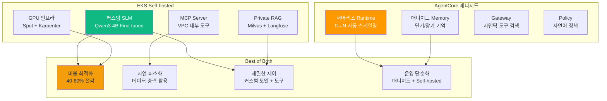

### 비용 손익분기점 계산

| 월 추론 볼륨 | AgentCore Only | EKS Self-hosted Only | Hybrid (Cascade) | 최적 접근 |
|-------------|---------------|---------------------|------------------|----------|
| ~10만 건 | **$300-500** | $800-1,200 | $400-700 | AgentCore Only |
| ~50만 건 | $1,500-2,000 | $1,200-1,800 | **$800-1,200** | Hybrid 시작점 |
| ~150만 건 | $4,500-6,000 | $2,500-3,500 | **$2,000-2,800** | Hybrid 필수 |
| ~500만 건+ | $15,000+ | **$3,500-5,000** | **$4,000-6,000** | EKS 중심 Hybrid |

:::tip 손익분기점
월 50만 건 이상 추론 볼륨에서 Hybrid 접근이 비용 효율적입니다. [코딩 도구 비용 분석](../reference-architecture/integrations/coding-tools-cost-analysis.md)에서 상세 계산식을 참조하세요.
:::

---

## Decision Matrix: Agent를 어디에 둘 것인가

8개 핵심 축으로 평가하여 Agent 배치를 결정합니다.

| 평가 축 | AgentCore | EKS Kagent | Hybrid | 판단 기준 |
|--------|-----------|------------|--------|----------|
| **추론 지연** | 중간 (50-200ms) | 낮음 (10-50ms) | **낮음** | VPC 내부 도구 호출 → EKS |
| **비용** | 고빈도 시 높음 | 고빈도 시 낮음 | **최적** | 단순=EKS, 복잡=AgentCore |
| **PII 처리** | VPC 외부 (제약) | VPC 내부 (유리) | **유연** | 민감 데이터 → EKS MCP |
| **모델 커스텀** | Bedrock 모델만 | 자유 (Qwen3, 커스텀) | **자유** | Fine-tuned 모델 → EKS |
| **도구 체인** | REST→MCP 변환 | K8s 네이티브 | **양쪽** | 외부 SaaS → AgentCore Gateway |
| **세션 길이** | 최대 8시간 | 제한 없음 | **제한 없음** | 장시간 대화 → EKS State |
| **감사 요건** | CloudTrail 자동 | 직접 구현 필요 | **CloudTrail + Custom** | 규제 → AgentCore 우선 |
| **팀 역량** | Kubernetes 불필요 | Kubernetes 필수 | **선택적** | K8s 초보 → AgentCore 중심 |

### 의사결정 플로우차트

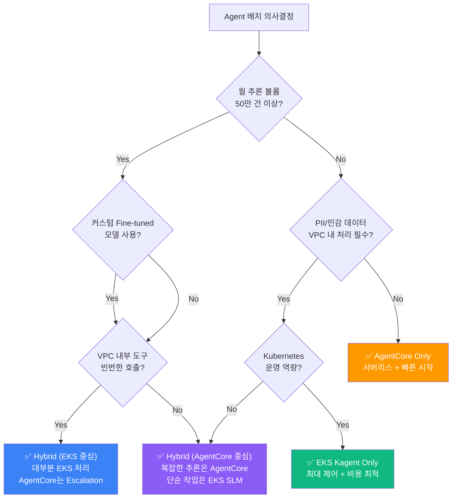

---

## 데이터 중력과 툴 코로케이션 패턴

### 데이터 중력(Data Gravity)이란?

데이터가 많은 곳에 컴퓨팅을 배치하는 것이 네트워크 지연과 비용을 최소화합니다.

**전형적인 시나리오**:
- EKS VPC 내부에 Milvus 벡터 DB (수 GB~TB 규모)
- AgentCore Runtime은 VPC 외부 (Bedrock 서비스 계정)
- Agent가 RAG 검색을 위해 Milvus 조회 시 **PrivateLink 경유 필요** → 지연 증가 + 복잡도 증가

### 역방향 호출 패턴

AgentCore Runtime이 EKS VPC 내부의 MCP 서버를 호출하는 아키텍처입니다.

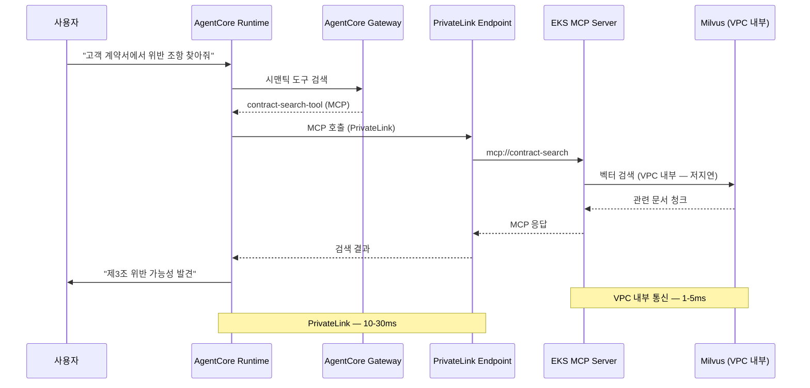

### PrivateLink 설정

```yaml
# privatelink-mcp-endpoint.yaml
apiVersion: v1
kind: Service
metadata:
  name: mcp-server-nlb
  namespace: mcp-system
  annotations:
    service.beta.kubernetes.io/aws-load-balancer-type: "nlb"
    service.beta.kubernetes.io/aws-load-balancer-internal: "true"
    service.beta.kubernetes.io/aws-load-balancer-nlb-target-type: "ip"
spec:
  type: LoadBalancer
  selector:
    app: mcp-server
  ports:
    - port: 443
      targetPort: 8080
      protocol: TCP
---
# VPC Endpoint Service 생성 (AWS Console 또는 Terraform)
# 1. NLB ARN 확인
# 2. VPC Endpoint Service 생성 (Acceptance required: No)
# 3. AgentCore IAM Role에 Endpoint 접근 권한 추가
```

### S3+KMS 경계 설정

민감한 데이터는 S3 + KMS 암호화를 통해 AgentCore와 EKS 간 안전하게 공유합니다.

```python
# secure_artifact_manager.py
import boto3
import json

class SecureArtifactManager:
    def __init__(self, bucket: str, kms_key_id: str):
        self.s3 = boto3.client('s3')
        self.kms = boto3.client('kms')
        self.bucket = bucket
        self.kms_key_id = kms_key_id
    
    def store_sensitive_result(self, agent_id: str, session_id: str, data: dict) -> str:
        """민감 결과를 S3에 암호화 저장"""
        key = f"agentcore/{agent_id}/{session_id}/result.json"
        
        self.s3.put_object(
            Bucket=self.bucket,
            Key=key,
            Body=json.dumps(data),
            ServerSideEncryption='aws:kms',
            SSEKMSKeyId=self.kms_key_id,
            Metadata={'pii': 'true', 'agent-session': session_id}
        )
        return f"s3://{self.bucket}/{key}"
    
    def load_from_eks(self, s3_uri: str) -> dict:
        """EKS Pod에서 S3 객체 로드 (Pod Identity로 KMS 복호화)"""
        bucket, key = s3_uri.replace('s3://', '').split('/', 1)
        response = self.s3.get_object(Bucket=bucket, Key=key)
        return json.loads(response['Body'].read())
```

**IAM 정책**:
```json
{
  "Version": "2012-10-17",
  "Statement": [
    {
      "Effect": "Allow",
      "Principal": {
        "AWS": "arn:aws:iam::ACCOUNT:role/AgentCoreExecutionRole"
      },
      "Action": ["s3:PutObject"],
      "Resource": "arn:aws:s3:::my-secure-artifacts/agentcore/*",
      "Condition": {
        "StringEquals": {"s3:x-amz-server-side-encryption": "aws:kms"}
      }
    },
    {
      "Effect": "Allow",
      "Principal": {
        "AWS": "arn:aws:iam::ACCOUNT:role/EKSPodRole"
      },
      "Action": ["s3:GetObject"],
      "Resource": "arn:aws:s3:::my-secure-artifacts/agentcore/*"
    }
  ]
}
```

---

## Hand-off 패턴 카탈로그

### 패턴 (a): Router-front (AgentCore Gateway→Self-hosted)

AgentCore Gateway가 요청을 분석하여 AgentCore Agent 또는 EKS Self-hosted Agent로 라우팅합니다.

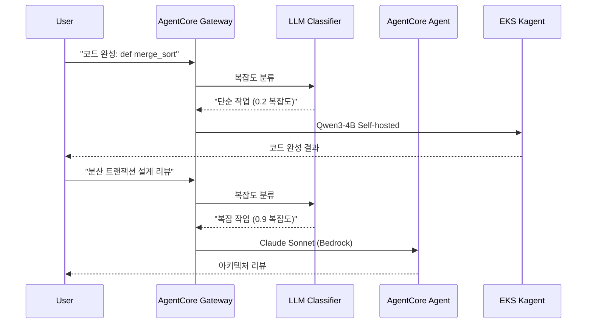

**분류 기준**:

| 복잡도 점수 | 라우팅 대상 | 예시 작업 |
|-----------|-----------|----------|
| 0.0-0.3 | EKS Qwen3-4B | 코드 완성, 번역, 요약 |
| 0.3-0.7 | AgentCore Claude Haiku | 기본 분석, 간단한 추론 |
| 0.7-1.0 | AgentCore Claude Sonnet | 아키텍처 리뷰, 복잡한 추론 |

**구현**:

```python
# classifier_router.py
from strands import Agent
from strands.models import BedrockModel
import boto3

bedrock_runtime = boto3.client('bedrock-agent-runtime')

class HybridRouter:
    def __init__(self):
        self.classifier = Agent(
            model=BedrockModel(model_id="anthropic.claude-haiku-20250320"),
            system_prompt="""당신은 요청 복잡도 분류기입니다.
복잡도를 0.0-1.0 사이로 평가하여 JSON 응답하세요.
{"complexity": 0.0-1.0, "reason": "이유"}"""
        )
    
    def route(self, user_request: str) -> dict:
        classification = self.classifier(f"요청: {user_request}")
        complexity = classification['complexity']
        
        if complexity < 0.3:
            return self._route_to_eks(user_request)
        elif complexity < 0.7:
            return self._route_to_agentcore(user_request, model='haiku')
        else:
            return self._route_to_agentcore(user_request, model='sonnet')
    
    def _route_to_eks(self, request: str) -> dict:
        """EKS Kagent로 라우팅"""
        import requests
        response = requests.post(
            "http://kagent-service.agents.svc.cluster.local/invoke",
            json={"prompt": request, "model": "qwen3-4b"}
        )
        return {"response": response.json(), "routed_to": "eks-kagent"}
    
    def _route_to_agentcore(self, request: str, model: str) -> dict:
        """AgentCore로 라우팅"""
        response = bedrock_runtime.invoke_agent(
            agentId='AGENT123',
            agentAliasId='ALIAS456',
            sessionId='session-' + str(hash(request)),
            inputText=request
        )
        return {"response": response, "routed_to": f"agentcore-{model}"}
```

---

### 패턴 (b): Escalation (Qwen3 Self→AgentCore Reasoning)

EKS Self-hosted Agent가 먼저 처리하고, 복잡도가 임계값을 초과하면 AgentCore로 에스컬레이션합니다.

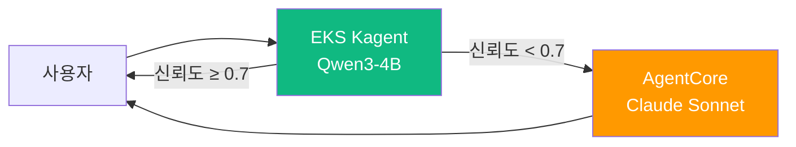

**에스컬레이션 트리거**:
- LLM 응답 신뢰도 점수 < 0.7
- 도구 호출 실패 2회 이상
- 사용자 명시적 요청 ("더 정확한 답변 필요")

**구현**:

```python
# escalation_agent.py
from strands import Agent
import boto3

class EscalatingAgent:
    def __init__(self):
        self.primary_agent = Agent(
            model=LocalModel("http://vllm-qwen3.vllm.svc.cluster.local"),
            tools=["code_completion", "translation"]
        )
        self.bedrock_runtime = boto3.client('bedrock-agent-runtime')
    
    def process(self, user_request: str) -> dict:
        # 1차: EKS Self-hosted Agent
        response = self.primary_agent(user_request)
        confidence = response.metadata.get('confidence', 0.0)
        
        if confidence >= 0.7:
            return {"response": response, "agent": "eks-qwen3", "confidence": confidence}
        
        # 에스컬레이션: AgentCore Claude Sonnet
        print(f"⚠️ 낮은 신뢰도 ({confidence}) → AgentCore 에스컬레이션")
        agentcore_response = self.bedrock_runtime.invoke_agent(
            agentId='EXPERT_AGENT_ID',
            agentAliasId='PROD_ALIAS',
            sessionId='escalation-session',
            inputText=f"원본 요청: {user_request}\n\n초기 시도 실패 (신뢰도: {confidence}). 정확한 답변 제공 필요."
        )
        return {"response": agentcore_response, "agent": "agentcore-sonnet", "escalated": True}
```

---

### 패턴 (c): Dual-write Memory (AgentCore Memory↔EKS Langfuse)

AgentCore와 EKS Agent 간 대화 기록을 동기화하여 일관된 컨텍스트를 유지합니다.

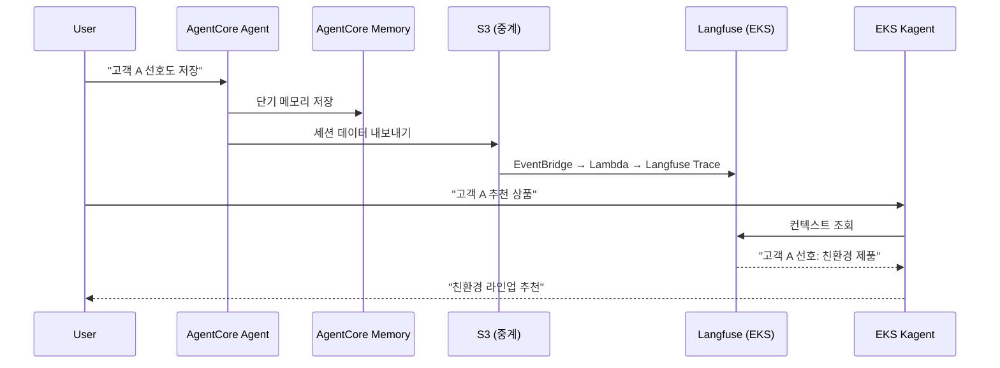

**동기화 전략**:

| 이벤트 | AgentCore → EKS | EKS → AgentCore |
|--------|----------------|----------------|
| 세션 시작 | Memory Session ID → S3 | Langfuse Trace ID → DynamoDB |
| 도구 호출 | Action Group 실행 로그 → CloudWatch → Langfuse | Langfuse Span → CloudWatch Logs Insights |
| 세션 종료 | Memory 요약 → S3 → Langfuse | Langfuse 세션 통계 → AgentCore Analytics |

**구현**:

```python
# dual_memory_sync.py
import boto3
from langfuse import Langfuse
from datetime import datetime

class DualMemoryManager:
    def __init__(self):
        self.s3 = boto3.client('s3')
        self.langfuse = Langfuse(
            public_key="lf_pk_...",
            secret_key="lf_sk_...",
            host="https://langfuse.eks.internal"
        )
        self.agentcore_memory_bucket = "agentcore-memory-export"
    
    def sync_agentcore_to_langfuse(self, agent_id: str, session_id: str):
        """AgentCore Memory → Langfuse 동기화"""
        # AgentCore Memory 내보내기 (S3)
        memory_key = f"{agent_id}/{session_id}/memory.json"
        memory_obj = self.s3.get_object(Bucket=self.agentcore_memory_bucket, Key=memory_key)
        memory_data = json.loads(memory_obj['Body'].read())
        
        # Langfuse Trace 생성
        trace = self.langfuse.trace(
            id=session_id,
            name=f"AgentCore Session {agent_id}",
            metadata={"source": "agentcore", "agent_id": agent_id}
        )
        
        for turn in memory_data['conversation']:
            trace.span(
                name=f"Turn {turn['turn_id']}",
                input=turn['user_input'],
                output=turn['agent_response'],
                metadata={"timestamp": turn['timestamp']}
            )
        
        trace.update(output=memory_data.get('summary'))
        print(f"✅ AgentCore Memory → Langfuse 동기화 완료: {session_id}")
    
    def sync_langfuse_to_agentcore(self, trace_id: str, agent_id: str):
        """Langfuse → AgentCore Memory 동기화"""
        trace = self.langfuse.get_trace(trace_id)
        
        # AgentCore Memory 형식으로 변환
        memory_data = {
            "agent_id": agent_id,
            "session_id": trace_id,
            "conversation": [
                {"turn_id": i, "user_input": span.input, "agent_response": span.output}
                for i, span in enumerate(trace.spans)
            ],
            "synced_at": datetime.utcnow().isoformat()
        }
        
        # S3 업로드 (AgentCore가 import)
        self.s3.put_object(
            Bucket=self.agentcore_memory_bucket,
            Key=f"{agent_id}/{trace_id}/imported-memory.json",
            Body=json.dumps(memory_data)
        )
        print(f"✅ Langfuse → AgentCore Memory 동기화 완료: {trace_id}")
```

---

### 패턴 (d): Cost-arbitrage (고빈도=EKS, 저빈도 복잡=AgentCore)

요청 빈도와 복잡도에 따라 비용 최적 Agent를 선택합니다.

**비용 모델**:

| 시나리오 | 월 요청 수 | 평균 토큰 | AgentCore 비용 | EKS 비용 | 최적 선택 |
|---------|-----------|---------|--------------|----------|----------|
| 코드 완성 | 500만 건 | 300 토큰 | ~$15,000 | ~$3,500 | **EKS** |
| 아키텍처 리뷰 | 5만 건 | 5,000 토큰 | ~$2,500 | $3,500 (GPU 유휴) | **AgentCore** |
| 번역 | 200만 건 | 500 토큰 | ~$10,000 | ~$2,000 | **EKS** |
| 복잡한 추론 | 10만 건 | 8,000 토큰 | ~$8,000 | $4,000 (전용 GPU) | **AgentCore** |

**라우팅 로직**:

```python
# cost_arbitrage_router.py
class CostArbitrageRouter:
    def __init__(self):
        self.request_counts = {}  # 요청 빈도 추적
        
        # 비용 계수 (예시)
        self.agentcore_cost_per_1k_tokens = 0.003  # Claude Haiku
        self.eks_fixed_monthly = 500  # GPU 인스턴스 고정 비용
        self.eks_break_even_requests = 200000  # 손익분기
    
    def should_use_eks(self, task_type: str, estimated_tokens: int) -> bool:
        """비용 기반 라우팅 결정"""
        monthly_requests = self.request_counts.get(task_type, 0)
        
        # 고빈도 작업 → EKS
        if monthly_requests > self.eks_break_even_requests:
            return True
        
        # 저빈도 + 복잡 → AgentCore
        if estimated_tokens > 5000 and monthly_requests < 50000:
            return False
        
        # 단순 작업 → EKS (고정 비용 상각)
        if estimated_tokens < 1000:
            return True
        
        return False  # 기본: AgentCore
```

---

## IAM·세션·관측성 통합 경계

### AgentCore Identity OAuth 토큰 전파

AgentCore Identity가 발급한 OAuth 토큰을 EKS MCP 서버까지 안전하게 전달합니다.

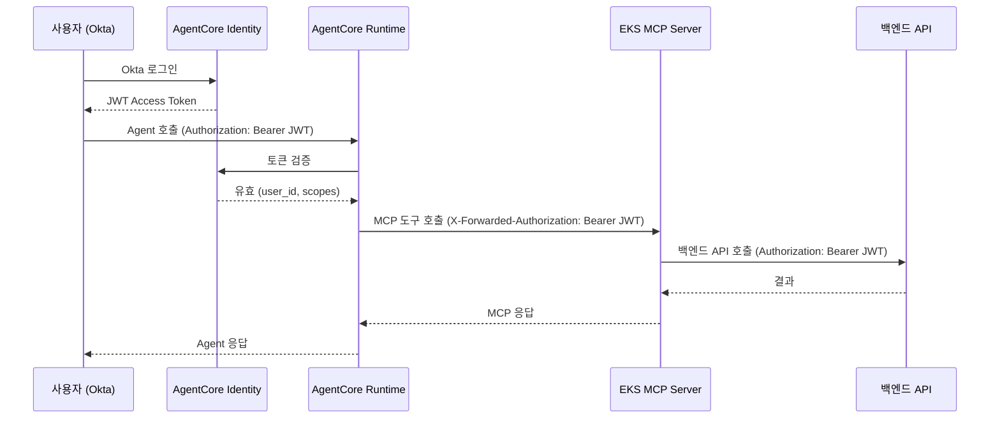

**EKS MCP Server 인증 검증**:

```python
# mcp_auth_middleware.py
import jwt
from functools import wraps
from flask import request, jsonify

def validate_agentcore_token(f):
    @wraps(f)
    def decorated(*args, **kwargs):
        token = request.headers.get('X-Forwarded-Authorization', '').replace('Bearer ', '')
        
        if not token:
            return jsonify({"error": "Missing authorization token"}), 401
        
        try:
            # AgentCore Identity 공개키로 검증
            payload = jwt.decode(
                token,
                audience="mcp-server",
                issuer="https://bedrock.amazonaws.com/agentcore/identity",
                algorithms=["RS256"],
                options={"verify_signature": True}
            )
            request.user_id = payload['sub']
            request.scopes = payload['scope']
            return f(*args, **kwargs)
        except jwt.ExpiredSignatureError:
            return jsonify({"error": "Token expired"}), 401
        except jwt.InvalidTokenError:
            return jsonify({"error": "Invalid token"}), 401
    
    return decorated

@app.route('/mcp/customer-lookup', methods=['POST'])
@validate_agentcore_token
def customer_lookup():
    """인증된 사용자만 고객 조회 가능"""
    customer_id = request.json.get('customer_id')
    # request.user_id로 감사 로그 기록
    return {"customer": fetch_customer(customer_id)}
```

### CloudWatch GenAI Observability ↔ Langfuse OTel 브리지

AgentCore 트레이스와 EKS Langfuse 트레이스를 통합하여 전체 Agent 플로우를 추적합니다.

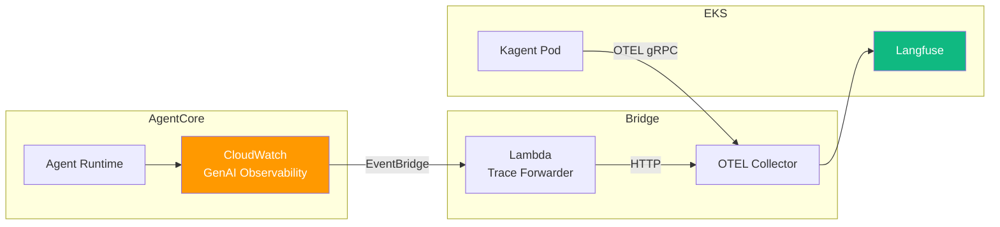

**Trace Correlation ID 규칙**:

| 소스 | Trace ID 형식 | Parent Span ID |
|------|--------------|----------------|
| AgentCore | `ac-{session_id}-{timestamp}` | `ac-root` |
| EKS Kagent | `eks-{pod_name}-{trace_id}` | `ac-{session_id}` (AgentCore 호출 시) |
| Hybrid Trace | `hybrid-{session_id}` | 양쪽에서 공유 |

**Lambda Trace Forwarder**:

```python
# trace_forwarder_lambda.py
import boto3
import json
import requests
from datetime import datetime

cloudwatch = boto3.client('logs')
langfuse_endpoint = "https://langfuse.eks.internal/api/public/ingestion"

def lambda_handler(event, context):
    """CloudWatch GenAI Observability → Langfuse 전달"""
    for record in event['Records']:
        message = json.loads(record['Sns']['Message'])
        
        if message['source'] == 'aws.bedrock.agentcore':
            trace_data = message['detail']
            
            # Langfuse 형식으로 변환
            langfuse_trace = {
                "id": f"hybrid-{trace_data['sessionId']}",
                "name": f"AgentCore {trace_data['agentId']}",
                "metadata": {
                    "source": "agentcore",
                    "agent_id": trace_data['agentId'],
                    "aws_region": message['region']
                },
                "spans": [
                    {
                        "name": step['actionGroupName'],
                        "input": step['input'],
                        "output": step['output'],
                        "start_time": step['startTime'],
                        "end_time": step['endTime']
                    }
                    for step in trace_data.get('actionGroupInvocations', [])
                ]
            }
            
            # Langfuse로 전송
            response = requests.post(
                langfuse_endpoint,
                json=langfuse_trace,
                headers={"Authorization": f"Bearer {os.environ['LANGFUSE_API_KEY']}"}
            )
            print(f"✅ Trace 전달 완료: {trace_data['sessionId']} → Langfuse")
    
    return {"statusCode": 200}
```

---

## 점진적 마이그레이션 로드맵

### Phase 1: AgentCore Only (0-3개월)

**목표**: 빠른 프로덕션 배포, 인프라 운영 부담 제로

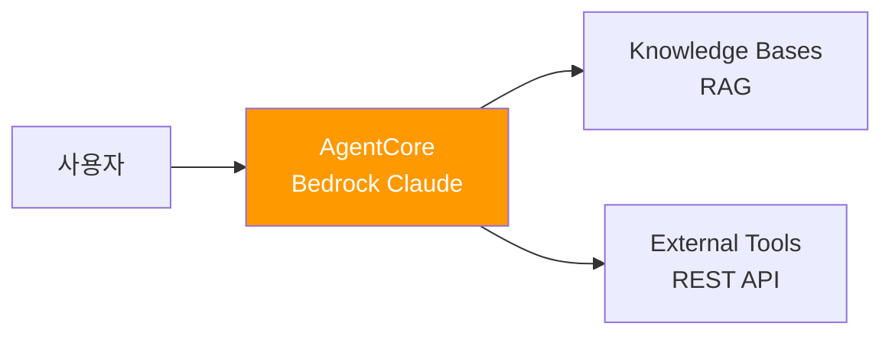

**체크리스트**:
- [ ] Bedrock 모델 선택 (Claude Sonnet/Haiku)
- [ ] Strands SDK로 Agent 구현
- [ ] AgentCore에 배포 (`agentcore deploy`)
- [ ] Knowledge Bases RAG 구성
- [ ] CloudWatch GenAI Observability 활성화

**Exit Criteria (Phase 2 전환 트리거)**:
- 월 추론 볼륨 50만 건 초과
- Bedrock 토큰 비용 월 $1,500 초과
- VPC 내부 도구 호출 빈도 높음 (p95 latency > 100ms)

---

### Phase 2: Bedrock + Self-hosted SLM (3-6개월)

**목표**: 비용 최적화, 단순 작업을 EKS Qwen3-4B로 오프로드

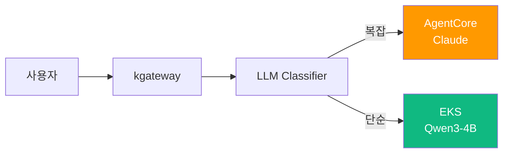

**체크리스트**:
- [ ] EKS 클러스터 구성 (Auto Mode 또는 Karpenter)
- [ ] vLLM으로 Qwen3-4B 배포
- [ ] LLM Classifier 구현 (Cascade Routing)
- [ ] kgateway + Bifrost 2-Tier Gateway 구성
- [ ] 비용 대시보드 구축 (AgentCore vs EKS 비용 추적)

**Exit Criteria (Phase 3 전환 트리거)**:
- EKS Agent와 AgentCore Agent 간 컨텍스트 공유 필요
- 양쪽에서 동일한 세션 유지 요구
- Fine-tuned 커스텀 모델 필요

---

### Phase 3: Full Hybrid Cross-routing (6-12개월)

**목표**: 양방향 라우팅, 통합 컨텍스트, 최적 비용

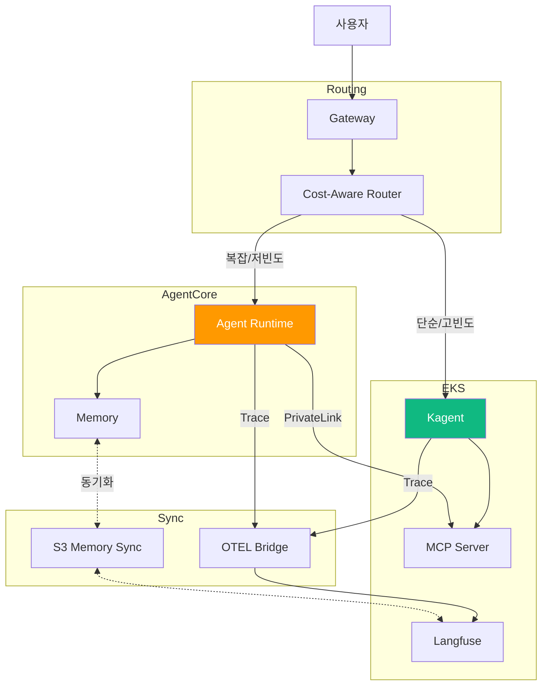

**체크리스트**:
- [ ] Dual-write Memory 동기화 구현 (패턴 c)
- [ ] Trace Correlation ID 통합
- [ ] PrivateLink Endpoint for MCP
- [ ] Cost-arbitrage Router 구현 (패턴 d)
- [ ] Escalation 로직 구현 (패턴 b)
- [ ] 통합 대시보드 (AgentCore + EKS 통합 관측성)

**Success Metrics**:
- 비용 절감률: 40-60% (Bedrock Only 대비)
- p95 지연: AgentCore 단독 대비 20% 개선
- 세션 컨텍스트 일관성: 95% 이상
- Agent 가용성: 99.9% (양쪽 Failover)

---

## 전환 트리거 지표

각 Phase 전환을 결정하는 정량적 지표입니다.

| 지표 | Phase 1 → 2 임계값 | Phase 2 → 3 임계값 |
|------|-------------------|-------------------|
| **월 추론 볼륨** | > 50만 건 | > 150만 건 |
| **월 비용** | > $1,500 | > $3,000 |
| **평균 지연 (p95)** | > 100ms | > 200ms |
| **세션 컨텍스트 손실률** | N/A | > 5% |
| **커스텀 모델 요구** | Fine-tuning 필요 | 도메인 특화 SLM 필요 |
| **팀 K8s 역량** | 초보 | 중급 이상 |

---

## 참고 자료

### 공식 문서

- [Amazon Bedrock AgentCore](https://docs.aws.amazon.com/bedrock/latest/userguide/agents.html) — AgentCore 공식 문서
- [AgentCore Identity & Policy](https://docs.aws.amazon.com/bedrock/latest/userguide/agents-identity.html) — 인증·정책 가이드
- [EKS PrivateLink](https://docs.aws.amazon.com/eks/latest/userguide/private-clusters.html) — VPC 내부 연결
- [AWS PrivateLink for Services](https://docs.aws.amazon.com/vpc/latest/privatelink/) — 서비스 엔드포인트

### 논문 / 기술 블로그

- [CloudWatch Generative AI Observability](https://aws.amazon.com/blogs/mt/launching-amazon-cloudwatch-generative-ai-observability-preview/) — 관측성 통합
- [Hybrid AI Architecture Patterns](https://aws.amazon.com/blogs/machine-learning/) — 하이브리드 패턴
- [Langfuse Self-Hosting Guide](https://langfuse.com/docs/deployment/self-host) — 자체 호스팅 가이드
- [Building Cost-Effective AI Systems](https://huyenchip.com/2023/04/11/llm-engineering.html) — 비용 최적화

### 관련 문서 (내부)

- [AWS Native 플랫폼](./aws-native-agentic-platform.md) — AgentCore 7개 서비스 개요
- [EKS 기반 오픈 아키텍처](./agentic-ai-solutions-eks.md) — Self-hosted 스택
- [SageMaker-EKS 통합](../reference-architecture/integrations/sagemaker-eks-integration.md) — VPC/IAM 참고
- [코딩 도구 비용 분석](../reference-architecture/integrations/coding-tools-cost-analysis.md) — 손익분기점 계산
