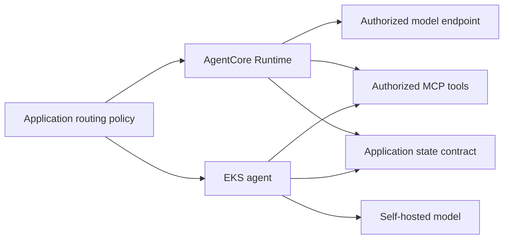
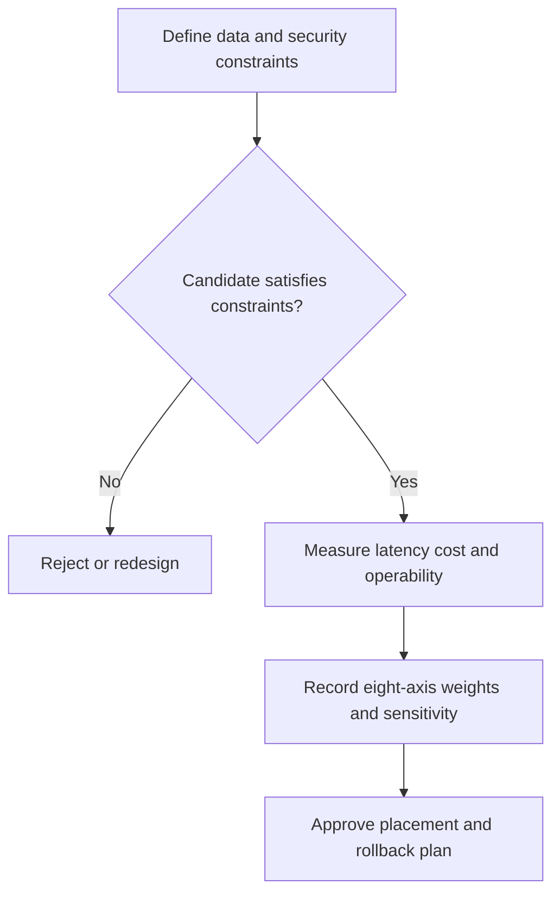
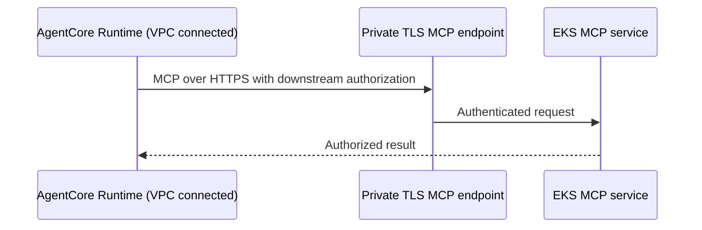

## 개요

Amazon Bedrock AgentCore Runtime과 EKS self-hosted agent를 결합할 때의 배치·네트워크·인증·상태 경계를 설명합니다. AgentCore Runtime, AgentCore Gateway, Bedrock 모델 추론은 서로 다른 기능과 비용 항목입니다.

:::caution Operator acceptance pending
공개 API·설계 오류는 수정했지만 조직별 8축 가중치, 온프레미스 연계, IAM/STS E2E와 마이그레이션 일정은 승인되지 않았습니다. 이 검토에서는 배포나 유료 모델 호출을 수행하지 않았습니다. 잔여 승인: [Issue #4](https://github.com/devfloor9/engineering-playbook/issues/4).
:::

## 하이브리드 배치 동기

배치는 데이터 경계·모델 제어·운영 역량·총비용을 함께 평가하여 결정합니다.

### 단일 접근의 한계

AgentCore Runtime은 agent 실행 환경이며 모델 endpoint를 호출합니다. Runtime 비용을 모델의 token 요금으로만 설명하지 않습니다. Bedrock Custom Model Import와 EKS의 vLLM 운영은 별도 선택입니다. EKS에도 상태·확장·가용성·인가 운영 비용이 있습니다.

### 하이브리드의 핵심 가치

하이브리드 설계의 기대 가치는 배치 유연성입니다. 비용 절감률과 지연 개선율은 baseline과 측정 없이는 확정하지 않습니다.


```mermaid
flowchart LR
    ROUTER[Application routing policy] --> AC[AgentCore Runtime]
    ROUTER --> EKS[EKS agent]
    AC --> MODEL[Authorized model endpoint]
    EKS --> LOCAL[Self-hosted model]
    AC --> TOOLS[Authorized MCP tools]
    EKS --> TOOLS
    AC --> STATE[Application state contract]
    EKS --> STATE
```

### 비용 손익분기점 계산

월 요청 수만으로 손익분기점을 정하지 않습니다. 입력·출력 token, model/provider, Runtime vCPU/memory 사용 시간, Memory/Gateway 사용량, GPU 유휴/준비 용량, 네트워크·스토리지·운영 비용을 동일 기간으로 합산합니다. 공개 가격표와 승인된 원장을 사용하고 통화·리전·가격 기준일을 기록합니다. 이전의 고정 50만 건 기준과 비용 표는 실측 자료가 없어 삭제했습니다.

## Decision Matrix: Agent를 어디에 둘 것인가

8축은 평가 틀이며 특정 조직의 승인된 가중치가 아닙니다. 먼저 데이터/보안 필수 조건을 pass/fail로 적용합니다. 통과한 대안에만 `score = Σ(weight × rating)`을 적용하고 가중치 합은 1로 둡니다. 모르는 rating을 임의로 채우지 않습니다.

| 축 | 필요한 증거 |
|---|---|
| 추론 지연 | 동일 payload·warm/cold·network별 p95/p99 |
| 비용 | 동일 기간의 Runtime+모델+인프라 총비용 |
| PII 처리 | data flow·인가·보존·로그/embedding 노출 검토 |
| 모델 커스텀 | 모델/엔진 기능과 endpoint 계약 |
| 도구 체인 | MCP transport·인증·timeout·idempotency |
| 세션 길이 | runtime 수명과 durable application state 구분 |
| 감사 요건 | 활성화한 CloudTrail/data event·앱 감사 coverage |
| 팀 역량 | on-call·보안·GPU/배포·복구 책임 |

### 의사결정 플로우차트

고정 요청량이나 “PII이면 EKS” 규칙 대신 필수 조건→측정→승인 순서로 결정합니다. EKS도 추가 통제 없이 민감 데이터 안전성을 보장하지 않습니다.


```mermaid
flowchart TD
    A[Define data and security constraints] --> B{Candidate satisfies constraints?}
    B -->|No| C[Reject or redesign]
    B -->|Yes| D[Measure latency cost and operability]
    D --> E[Record eight-axis weights and sensitivity]
    E --> F[Approve placement and rollback plan]
```

## 데이터 중력과 툴 코로케이션 패턴

데이터 위치·접근 방식·권한과 agent 실행 위치를 함께 설계합니다.

### 데이터 중력(Data Gravity)이란?

Runtime VPC 연결을 사용하면 지정 subnet·security group을 통해 VPC 리소스에 접근할 수 있습니다. 기본 public 네트워크 모드에서 임의의 private endpoint가 자동으로 접근 가능해지지 않습니다.

### 역방향 호출 패턴

같은 VPC의 내부 MCP endpoint는 Runtime VPC 연결과 실제 DNS·route·security group·TLS·인증 구성이 필요합니다. `*.svc.cluster.local`은 VPC 전체에서 자동 해석되는 이름이 아닙니다. 내부 load balancer 등 VPC에서 도달 가능한 endpoint를 사용합니다. Gateway를 거치면 Gateway target의 지원 네트워크/인증 경계를 별도로 검증합니다.


```mermaid
sequenceDiagram
    participant R as AgentCore Runtime (VPC connected)
    participant E as Private TLS MCP endpoint
    participant M as EKS MCP service
    R->>E: MCP over HTTPS with downstream authorization
    E->>M: Authenticated request
    M-->>R: Authorized result
```

### PrivateLink 설정

PrivateLink는 소비자 VPC interface endpoint와 공급자 endpoint service의 연결입니다. NLB Service YAML만으로 완성되지 않습니다. 공급자는 허용 principal·연결 승인, NLB listener/target, TLS 종료 위치를 구성합니다. 소비자는 endpoint·DNS·security group과 Runtime의 VPC 경로를 확인합니다. IAM role에 endpoint 접근 정책을 추가하는 것만으로 TCP 연결이나 앱 인가가 생기지 않습니다. EKS API용 PrivateLink와 사용자 MCP 서비스의 endpoint service를 혼동하지 않습니다.

### S3+KMS 경계 설정

S3 resource policy(bucket policy), role identity policy, KMS key policy는 별도 정책입니다. bucket policy에는 Principal이 있지만 role identity policy에는 넣지 않습니다. writer는 제한된 prefix의 s3:PutObject 및 해당 KMS key의 kms:GenerateDataKey가 필요하며 multipart 업로드 등에는 kms:Decrypt도 필요할 수 있습니다. reader는 s3:GetObject와 kms:Decrypt가 필요합니다. KMS key policy/grant도 해당 사용을 허용해야 합니다.

정확한 key ARN·prefix·TLS·보존/삭제 정책을 고정하고 잘못된 key·다른 tenant prefix·다른 role을 거부하는지 확인합니다. SSE-KMS 헤더만으로 보안 경계가 완성되지는 않습니다. session_id만으로 만든 object key를 신뢰하지 말고 검증된 tenant/owner에 scope를 묶습니다.

## Hand-off 패턴 카탈로그

패턴은 애플리케이션 구현 계약입니다. AgentCore 제품의 자동 라우팅·메모리 복제 기능으로 해석하지 않습니다.

### 패턴 (a): 애플리케이션 Router-front {#패턴-a-router-front-agentcore-gatewayself-hosted}

AgentCore Gateway는 도구를 MCP 인터페이스로 연결합니다. 일반 inference 요청의 복잡도 분류와 모델 선택은 애플리케이션 router의 책임입니다. 모델을 선택하는 문자열을 반환해도 실제 Runtime 배포의 model 설정은 바뀌지 않습니다. 허용된 runtime ARN/endpoint별로 agent model 설정을 명시하거나 검증된 payload 계약을 구현합니다.

### 패턴 (b): Escalation (Qwen3 Self→AgentCore Reasoning)

에스컬레이션은 검증된 품질 규칙과 남은 deadline을 적용합니다. LLM이 말한 confidence를 교정된 확률로 사용하지 않습니다. tool 부작용·stream이 이미 시작된 요청을 다른 agent에서 자동 반복하지 않습니다. 전달할 context·허용 도구·idempotency key·request_id와 응답 소유자를 정의합니다.

### 패턴 (c): Canonical state와 목적별 projection {#패턴-c-dual-write-memory-agentcore-memoryeks-langfuse}

Langfuse는 관측 저장소이며 AgentCore Memory와 자동 양방향 세션 복제를 제공하지 않습니다. S3에 memory.json을 쓰는 것만으로 AgentCore Memory에 import되지 않습니다. 실제 Memory API와 명시적인 adapter가 필요합니다.

하나의 canonical conversation/event log에 event_id·tenant·session owner·sequence·schema version을 기록합니다. Memory와 Langfuse는 목적별 projection으로 다루고 retry/deduplication, 순서, 지연, 충돌·삭제 전파를 정의합니다. Langfuse trace를 권한 검사 없이 사용자 대화 상태로 읽지 않습니다.

### 패턴 (d): Cost-arbitrage (고빈도=EKS, 저빈도 복잡=AgentCore)

품질·인가 제약을 통과한 경로만 비용 비교에 포함합니다. 고정 token 단가 하나로 AgentCore Runtime·모델 비용을 합치지 않습니다. 각 경로의 추가 비용과 준비 용량을 계산하고 fallback 재시도까지 포함합니다. 실제 계측 전에는 더 저렴한 경로를 단정하지 않습니다.

## IAM·세션·관측성 통합 경계

IAM 호출자, STS 대상 role, Runtime 실행 role과 최종 사용자 OAuth identity는 서로 다릅니다. 다음 예시는 EKS의 caller role(예시 계정 A)이 계정 B의 RuntimeInvokerRole을 AssumeRole하여 **계정 B 자격 증명으로 계정 B Runtime을 호출**하는 경로입니다. 실제 계정·리전·ARN은 승인된 manifest에 넣습니다. 코드는 호출 계약 예시이며 이 검토에서는 실행하지 않았습니다.

1. A의 caller identity policy는 B의 정확한 role ARN에 sts:AssumeRole을 허용합니다.
2. B의 trust policy는 A의 정확한 caller role만 신뢰합니다. EKS Pod Identity/IRSA의 최초 federation trust는 이 trust와 별도로 구성합니다. 온프레미스는 승인된 federation/credential provider를 사용합니다.
3. B의 invoker identity policy는 선택한 runtime 및 runtime endpoint에 InvokeAgentRuntime을 허용합니다. Runtime execution role은 별개이며 bedrock-agentcore.amazonaws.com 서비스 trust와 필요한 모델/도구 권한을 갖습니다. 실행 role을 일반 호출자에게 넘기지 않습니다.
4. 이 경로는 AssumeRole 후 같은 계정에서 호출합니다. A 자격 증명으로 직접 cross-account 호출하도록 바꾸면 runtime/endpoint의 resource policy와 caller policy를 별도로 검토해야 합니다.

```json
[
  {
    "name": "A caller identity policy",
    "policy": {"Version": "2012-10-17", "Statement": [{
      "Effect": "Allow", "Action": "sts:AssumeRole",
      "Resource": "arn:aws:iam::444455556666:role/RuntimeInvokerRole"
    }]}
  },
  {
    "name": "B RuntimeInvokerRole trust policy",
    "policy": {"Version": "2012-10-17", "Statement": [{
      "Effect": "Allow", "Action": "sts:AssumeRole",
      "Principal": {"AWS": "arn:aws:iam::111122223333:role/EKSPodCallerRole"}
    }]}
  },
  {
    "name": "B invoker identity policy",
    "policy": {"Version": "2012-10-17", "Statement": [{
      "Effect": "Allow", "Action": "bedrock-agentcore:InvokeAgentRuntime",
      "Resource": [
        "arn:aws:bedrock-agentcore:us-east-1:444455556666:runtime/example_agent-0123456789",
        "arn:aws:bedrock-agentcore:us-east-1:444455556666:runtime/example_agent-0123456789/runtime-endpoint/DEFAULT"
      ]
    }]}
  }
]
```

```python
import json
import uuid
import boto3

REGION = "us-east-1"
ROLE_ARN = "arn:aws:iam::444455556666:role/RuntimeInvokerRole"
RUNTIME_ARN = ("arn:aws:bedrock-agentcore:us-east-1:444455556666:"
               "runtime/example_agent-0123456789")

def invoke_assumed(prompt: str, session_id: str):
    # session_id is server-owned and bound to the authenticated tenant/user.
    if not 33 <= len(session_id) <= 256:
        raise ValueError("Use a valid conversation session ID, such as a UUID")
    sts = boto3.client("sts", region_name=REGION)  # Default credential chain
    creds = sts.assume_role(
        RoleArn=ROLE_ARN,
        RoleSessionName="hybrid-invoker",
        DurationSeconds=3600,  # Chained role sessions cannot exceed one hour.
    )["Credentials"]
    client = boto3.client(
        "bedrock-agentcore", region_name=REGION,
        aws_access_key_id=creds["AccessKeyId"],
        aws_secret_access_key=creds["SecretAccessKey"],
        aws_session_token=creds["SessionToken"],
    )
    return client.invoke_agent_runtime(
        agentRuntimeArn=RUNTIME_ARN, qualifier="DEFAULT",
        runtimeSessionId=session_id, contentType="application/json",
        payload=json.dumps({"prompt": prompt}).encode("utf-8"),
    )

# Generate once for a NEW conversation; persist it under verified ownership.
new_session_id = str(uuid.uuid4())
# response = invoke_assumed("approved test input", new_session_id)
# Consume/close response["response"] according to response["contentType"].
```

JSON은 이름을 붙인 세 정책의 목록이며 한 IAM 정책으로 그대로 제출하는 형식이 아닙니다. 예제는 매 호출 시 새 STS 자격 증명을 얻습니다. 서비스에서는 만료 전에 갱신하는 SDK credential provider를 사용하고 session token·Expiration을 관리합니다. Runtime conversation 수명과 STS credential 수명은 다릅니다. 사용자 ID 전파 헤더를 추가한다면 InvokeAgentRuntimeForUser 권한도 별도 검토합니다.

### AgentCore Identity OAuth 토큰 전파

JWT 원 발급자는 설정된 IdP/authorization server입니다. AgentCore Identity를 사용자 JWT 발급자로 그리지 않습니다. Runtime inbound token의 audience가 MCP와 다르면 그대로 전달하지 말고 대상 서비스용 OAuth credential/token-exchange 경로를 사용합니다. OAuth Runtime invocation은 SigV4 SDK 예제와 다른 HTTPS Bearer 경로입니다.

MCP는 Authorization Bearer를 신뢰된 TLS 경로에서 수신하고 서명·issuer·audience·expiry·scope를 확인합니다. 임의 X-Forwarded-Authorization을 신뢰하지 않습니다. 아래는 단일 IdP의 space-delimited scope 계약 예시입니다. middleware는 token/JWKS 오류를 401, scope 부족을 403으로 처리하고 tenant·객체 권한도 검증해야 합니다.

```python
import jwt
from jwt import PyJWKClient

ISSUER = "https://idp.example.com/oauth2/default"
AUDIENCE = "mcp-service"
JWKS = PyJWKClient("https://idp.example.com/oauth2/default/v1/keys")

def verify_mcp_token(token: str) -> dict:
    # Trusted configuration supplies the issuer/JWKS URL, never the token.
    key = JWKS.get_signing_key_from_jwt(token).key
    claims = jwt.decode(
        token, key, algorithms=["RS256"], audience=AUDIENCE, issuer=ISSUER,
        options={"require": ["exp", "iss", "aud", "sub"]},
    )
    scope_value = claims.get("scope", "")
    scopes = set(scope_value.split()) if isinstance(scope_value, str) else set()
    if "customer:read" not in scopes:
        raise PermissionError("Insufficient scope")
    return claims  # Caller must still enforce tenant/object authorization.
```

### CloudWatch GenAI Observability ↔ Langfuse OTel 브리지

OTel trace ID는 16-byte(32 hex), span ID는 8-byte(16 hex)이며 유효한 값은 all-zero가 아닙니다. `ac-{session_id}` 같은 문자열을 trace ID로 사용하지 않습니다. W3C traceparent/tracestate를 전파하고 session/request 식별자는 별도 attributes로 기록합니다.

instrumentation에서 승인된 OTel collector/exporter로 보내 CloudWatch와 Langfuse 경로를 명시적으로 구성합니다. CloudWatch가 자동으로 EventBridge에 span을 내보내고 기존 Lambda가 이를 수신한다는 계약은 없습니다. parent/child 연결·sampling·중복·누락·PII redaction을 검증합니다.

## 점진적 마이그레이션 로드맵

아래 기간은 순서 설명용이며 달력상의 약속이 아닙니다. 완료 조건을 통과할 때만 다음 단계로 진행하고 조직별 change window·서비스 등록·보안 검토 일정을 별도 승인합니다.

### Phase 1: AgentCore Only (0-3개월)

agent payload·응답·세션 소유권·IAM/OAuth·data boundary와 baseline을 정의합니다. 실제 model 및 Runtime 요금을 분리해 기록합니다. 코드/API 정적 검증과 허가된 시험의 결과가 준비되어야 다음 단계로 이동합니다.

### Phase 2: Bedrock + Self-hosted SLM (3-6개월)

EKS 후보 경로의 모델 기능·네트워크·준비 용량·실패 정책을 검증합니다. 동일 데이터셋과 품질 기준에서 비용·TTFT를 비교합니다. 트래픽 비율과 rollback gate를 승인하고 단계별 결과를 기록합니다.

### Phase 3: Full Hybrid Cross-routing (6-12개월)

cross-routing에서는 tenant/session 고립, 상태 event 순서와 재처리, 도구 중복 실행 방지, credential 만료, fallback, trace correlation을 확인합니다. 등록/보안 승인 일정과 충돌하는 항목은 dependency owner와 결정 날짜를 기록하여 해소합니다. 기존의 고정 절감률·95% 상태 일관성 수치는 승인 기준으로 사용하지 않습니다.

## 전환 트리거 지표

운영자는 다음 증거를 비공개 저장소에 보존하고 공개 문서에는 승인된 비식별 결론만 반영합니다.

1. 8축 가중치·rating 근거·hard constraint·가중치 민감도와 ADR 승인자를 기록합니다.
2. 온프레미스↔Runtime↔EKS 각 hop의 DNS·route·TLS·인증·timeout·payload 계약·소유자를 대조합니다.
3. IAM은 caller policy→STS trust→임시 credential→Runtime 권한→execution role→도구 권한을 E2E로 확인합니다. 올바른 role의 허용, 다른 principal/ARN·만료 credential·누락 session token의 거부를 기록합니다.
4. OAuth는 잘못된 issuer/audience/signature, 만료 token, scope 부족, tenant 간 session 재사용을 거부해야 합니다. 허용·거부 결과와 correlation ID만 보존하며 token은 기록하지 않습니다.
5. canonical state replay·삭제·부분 실패·trace parent 연결을 검증합니다. 모델·도구 호출이 필요한 시험은 운영자 승인 범위에서 수행합니다.
6. phase별 exit criterion·change window·서비스 등록 dependency·rollback owner·승인 일자를 연결합니다. 실측이 없는 항목은 pending으로 유지합니다.

## 참고 자료

### 공식 문서

- [Amazon Bedrock AgentCore](https://docs.aws.amazon.com/bedrock-agentcore/latest/devguide/what-is-bedrock-agentcore.html) — AgentCore 공식 개발자 가이드
- [AgentCore Identity](https://docs.aws.amazon.com/bedrock-agentcore/latest/devguide/identity.html) — 인증·자격 증명 가이드
- [AgentCore VPC 연결](https://docs.aws.amazon.com/bedrock-agentcore/latest/devguide/agentcore-vpc.html) — Runtime·내장 도구 VPC 구성
- [EKS PrivateLink](https://docs.aws.amazon.com/eks/latest/userguide/private-clusters.html) — VPC 내부 연결
- [AWS PrivateLink for Services](https://docs.aws.amazon.com/vpc/latest/privatelink/) — 서비스 엔드포인트
- [InvokeAgentRuntime API](https://docs.aws.amazon.com/bedrock-agentcore/latest/APIReference/API_InvokeAgentRuntime.html) — payload, session, response
- [STS AssumeRole](https://docs.aws.amazon.com/STS/latest/APIReference/API_AssumeRole.html) — temporary credentials, trust, role chaining
- [Runtime permissions](https://docs.aws.amazon.com/bedrock-agentcore/latest/devguide/runtime-permissions.html) — caller and execution roles
- [AgentCore resource policies](https://docs.aws.amazon.com/bedrock-agentcore/latest/devguide/resource-based-policies.html) — runtime/endpoint cross-account boundaries
- [OpenTelemetry Trace API](https://opentelemetry.io/docs/specs/otel/trace/api/) — trace and span identifiers

### 논문 / 기술 블로그

- [CloudWatch Generative AI Observability](https://aws.amazon.com/blogs/mt/launching-amazon-cloudwatch-generative-ai-observability-preview/) — 관측성 통합
- [AgentCore Runtime 네트워크 연결 패턴](https://aws.amazon.com/blogs/networking-and-content-delivery/network-connectivity-patterns-for-agents-deployed-on-amazon-bedrock-agentcore-runtime/) — Runtime VPC·PrivateLink 연결 패턴
- [Langfuse Self-Hosting Guide](https://langfuse.com/docs/deployment/self-host) — 자체 호스팅 가이드
- [Building Cost-Effective AI Systems](https://huyenchip.com/2023/04/11/llm-engineering.html) — 비용 최적화

### 관련 문서 (내부)

- [AWS Native 플랫폼](./aws-native-agentic-platform.md) — AgentCore 서비스 개요
- [EKS 기반 오픈 아키텍처](./agentic-ai-solutions-eks.md) — Self-hosted 스택
- [추론 플랫폼 벤치마크: AgentCore vs EKS](../../../benchmarks/agentcore-vs-eks-inference.md) — 기능·성능·비용 비교 벤치마크 계획
- [SageMaker-EKS 통합](../../reference-architecture/integrations/sagemaker-eks-integration.md) — VPC/IAM 참고
- [코딩 도구 비용 분석](../../reference-architecture/integrations/coding-tools-cost-analysis.md) — 손익분기점 계산
