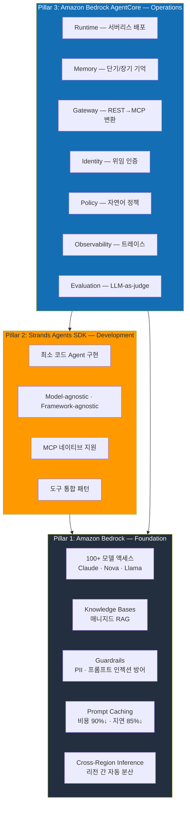
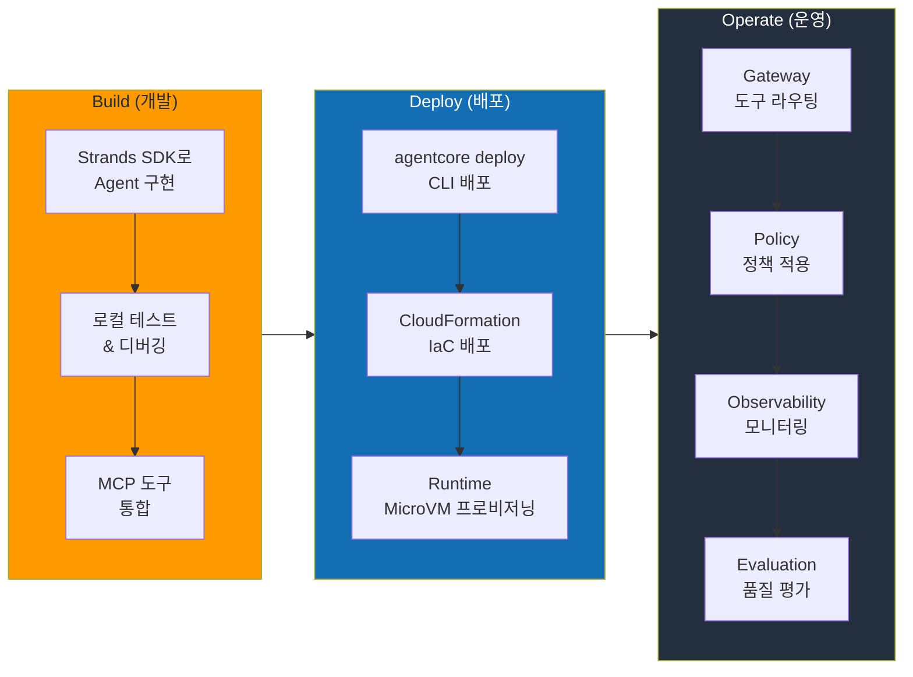
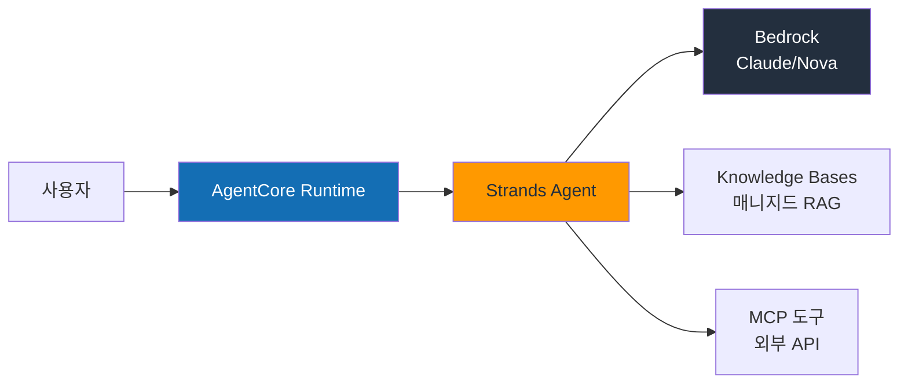
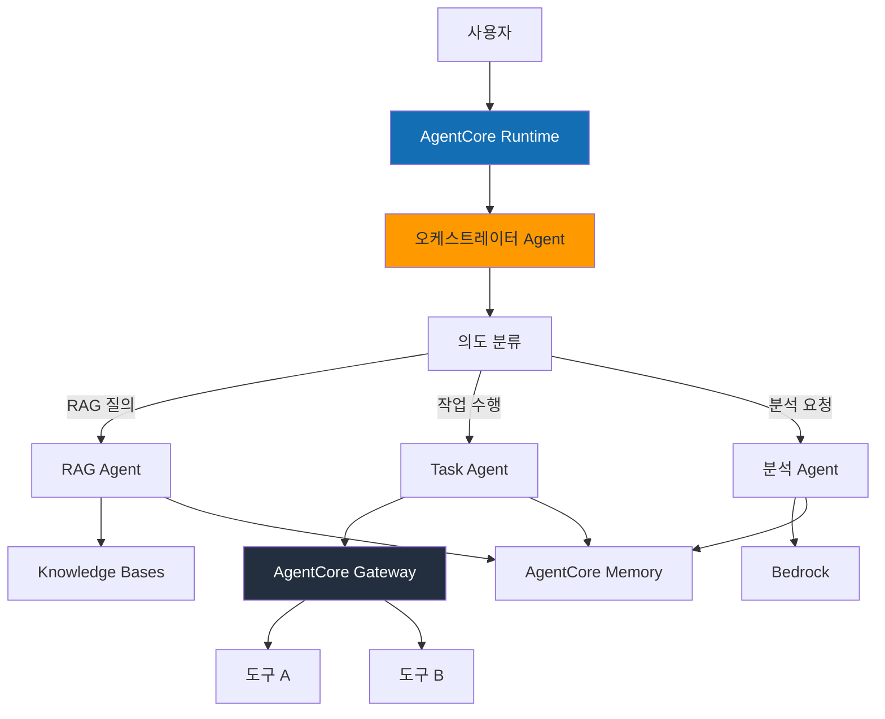
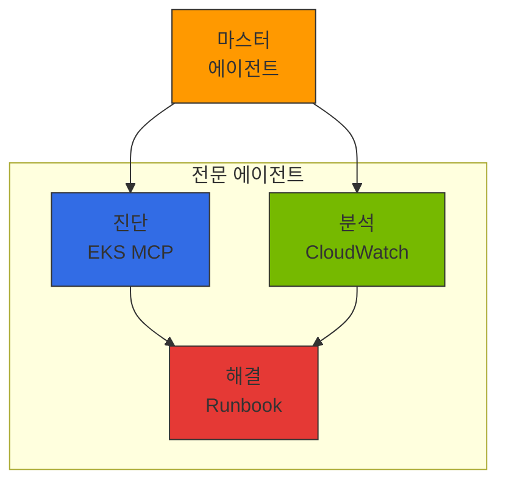

import { EKSMCPFeatures, KagentVsAgentCore, MultiAgentPatterns, MCPServerEcosystem } from '@site/src/components/BedrockMcpTables';

## 개요

AWS 매니지드 서비스를 활용하면 **인프라 운영이 아닌 Agent의 비즈니스 로직에 집중**할 수 있습니다. GPU 관리, 스케일링, 가용성, 보안을 AWS가 처리하고, 개발팀은 Agent가 해결할 문제에만 역량을 투입합니다.

AWS Agentic AI 스택은 세 개의 축(Pillar)으로 구성됩니다.

| Pillar | 서비스 | 역할 |
|--------|--------|------|
| **기반(Foundation)** | Amazon Bedrock | 모델 액세스, RAG, 가드레일, 프롬프트 캐싱 |
| **개발(Development)** | Strands Agents SDK | 에이전트 프레임워크, MCP 네이티브, 도구 통합 |
| **운영(Operations)** | Amazon Bedrock AgentCore | 서버리스 배포, 메모리, 게이트웨이, 정책, 평가 |

:::info 핵심 관점
이 문서는 AWS 매니지드 서비스가 제공하는 **Agent 개발 최적화 접근**을 다룹니다. 매니지드 서비스로 충분한 영역은 AWS에 맡기고, 팀의 역량을 Agent 비즈니스 로직에 집중하는 전략입니다. 다만 이 접근은 다중 모델 여정의 **첫 단계**입니다. 트래픽 증가에 따른 비용 압박, 도메인 특화 SLM 필요성, 데이터 주권 요구가 생기면 [EKS 기반 오픈 아키텍처](./agentic-ai-solutions-eks.md)로 확장하여 자체 호스팅 모델과 Bedrock을 **하이브리드로 조합**하는 것이 현실적 최적해입니다.
:::

### 도전과제 해결 매핑

[기술적 도전과제](../foundations/agentic-ai-challenges.md)에서 다룬 5가지 핵심 과제를 AWS Native 접근으로 해결하는 방법:

| 도전과제 | AWS Native 해결 방안 |
|---------|---------------------|
| GPU 리소스 관리 및 비용 최적화 | Bedrock 서버리스 추론 — GPU 관리 불필요 |
| 지능형 추론 라우팅 및 게이트웨이 | Bedrock Cross-Region Inference + AgentCore Gateway |
| LLMOps 관찰성 및 비용 거버넌스 | AgentCore Observability + CloudWatch |
| Agent 오케스트레이션 및 안전성 | Strands SDK + Bedrock Guardrails + AgentCore Policy |
| 모델 공급망 관리 | Bedrock Model Evaluation + Prompt Management |

:::tip AWS Native의 핵심 가치
GPU 인프라 관리, 스케일링, 가용성, 보안을 AWS가 처리하므로 팀은 Agent 비즈니스 로직에만 집중할 수 있습니다. 더 세밀한 제어가 필요한 경우 [EKS 기반 오픈 아키텍처](./agentic-ai-solutions-eks.md)와 조합할 수 있습니다.
:::

---

## AWS Agentic AI 서비스 아키텍처

### 3-Pillar 아키텍처



---

## Amazon Bedrock: 기반 레이어

Amazon Bedrock은 Agentic AI 플랫폼의 **기반 인프라**를 제공합니다. 100개 이상의 파운데이션 모델에 단일 API로 접근하고, RAG, 가드레일, 프롬프트 캐싱까지 매니지드로 지원합니다.

### 핵심 기능

| 기능 | 설명 | 핵심 가치 |
|------|------|----------|
| **모델 액세스** | Claude, Nova, Llama, Mistral 등 100+ 모델 | 단일 API, 모델 전환 코드 변경 불필요 |
| **Knowledge Bases** | 문서 파싱 → 청킹 → 임베딩 → 인덱싱 → 검색 | 원클릭 RAG 파이프라인, S3 업로드만으로 완료 |
| **Guardrails** | PII 필터링, 프롬프트 인젝션 방어, 토픽 제한 | 콘솔에서 정책 설정, 코드 변경 없음 |
| **Prompt Caching** | 반복 컨텍스트 캐싱 | 비용 최대 90% 절감, 지연 최대 85% 단축 |
| **Cross-Region Inference** | 리전 간 자동 트래픽 분산 | 용량 한계 시 자동 폴백, 가용성 향상 |
| **Prompt Management** | 프롬프트 버전 관리, A/B 테스트 | 프롬프트 이력 추적, 롤백 지원 |
| **Model Evaluation** | 자동화된 모델 평가, 배치 처리 | LLM-as-a-judge, 사람 평가 워크플로우 |

:::tip Prompt Caching 활용
긴 시스템 프롬프트나 반복적인 도구 정의를 사용하는 Agent는 Prompt Caching을 활성화하면 비용과 지연을 대폭 줄일 수 있습니다. 특히 RAG 컨텍스트가 자주 반복되는 패턴에 효과적입니다.
:::

---

## Strands Agents SDK: 개발 프레임워크

**Strands Agents SDK**는 AWS가 Apache 2.0으로 공개한 오픈소스 에이전트 프레임워크입니다. 최소한의 코드로 프로덕션급 Agent를 구현하며, Model-agnostic 설계로 Bedrock 외에도 다양한 모델 프로바이더를 지원합니다.

### 최소 코드 Agent 구현

```python
from strands import Agent
from strands.models import BedrockModel

# 기본 Agent — 3줄로 완성
agent = Agent(
    model=BedrockModel(model_id="anthropic.claude-sonnet-4-20250514"),
    tools=["calculator", "web_search"],
)
result = agent("서울의 현재 기온을 섭씨와 화씨로 변환해줘")
```

### MCP 네이티브 지원

```python
from strands import Agent
from strands.tools.mcp import MCPClient

# MCP 서버 연결 — 외부 도구를 자동 탐색하여 Agent에 통합
mcp_client = MCPClient(server_url="http://mcp-server:8080")

agent = Agent(
    model=BedrockModel(model_id="anthropic.claude-sonnet-4-20250514"),
    tools=[mcp_client],  # MCP 도구 자동 탐색 및 등록
)
result = agent("최근 주문 내역을 조회하고 배송 상태를 확인해줘")
```

### 커스텀 도구 정의

```python
from strands import Agent, tool

@tool
def lookup_customer(customer_id: str) -> dict:
    """고객 정보를 조회합니다."""
    # 비즈니스 로직 구현
    return {"name": "홍길동", "tier": "GOLD", "since": "2023-01"}

@tool
def create_ticket(title: str, priority: str, description: str) -> dict:
    """고객 문의 티켓을 생성합니다."""
    return {"ticket_id": "TK-2026-0042", "status": "OPEN"}

agent = Agent(
    model=BedrockModel(model_id="anthropic.claude-sonnet-4-20250514"),
    tools=[lookup_customer, create_ticket],
    system_prompt="당신은 고객 서비스 Agent입니다. 고객 정보를 조회하고 필요 시 티켓을 생성합니다.",
)
```

### Strands SDK 핵심 특성

| 특성 | 설명 |
|------|------|
| **Apache 2.0** | 상업적 사용 자유, 포크 가능 |
| **Model-agnostic** | Bedrock, OpenAI, Anthropic API, Ollama 등 다양한 백엔드 지원 |
| **Framework-agnostic** | FastAPI, Flask, Lambda 등 어떤 런타임에서든 실행 |
| **MCP 네이티브** | Model Context Protocol 빌트인 지원, 별도 어댑터 불필요 |
| **AgentCore 통합** | `agentcore deploy` 한 줄로 프로덕션 배포 |
| **스트리밍 응답** | 토큰 단위 스트리밍, 실시간 UX 지원 |

---

## Amazon Bedrock AgentCore: 운영 플랫폼

AgentCore는 **Agent의 프로덕션 운영에 필요한 모든 것**을 매니지드로 제공하는 플랫폼입니다. 2025년 GA(General Availability)로 출시되었으며, 7개의 핵심 서비스로 구성됩니다.

### 7대 핵심 서비스

#### 1. Runtime — 서버리스 Agent 배포

AgentCore Runtime은 **Firecracker MicroVM** 기반의 격리된 실행 환경을 제공합니다.

| 항목 | 사양 |
|------|------|
| 격리 수준 | Firecracker MicroVM (하드웨어 수준 격리) |
| 세션 지속 | 최대 8시간 연속 세션 |
| 스케일링 | 0에서 자동 확장, 요청 없으면 0으로 축소 |
| 배포 | `agentcore deploy` CLI 또는 CloudFormation |
| 콜드 스타트 | 수 초 이내 |

```bash
# Strands Agent를 AgentCore에 배포
agentcore deploy \
  --agent-name "customer-service" \
  --entry-point "agent.py" \
  --runtime python3.12 \
  --memory 512 \
  --timeout 3600
```

#### 2. Memory — 단기/장기 기억 관리

Agent가 대화 컨텍스트와 사용자 선호를 기억하도록 하는 매니지드 메모리 서비스입니다.

| 메모리 유형 | 설명 | 활용 예시 |
|------------|------|----------|
| **단기 메모리** | 세션 내 대화 기록 | 멀티턴 대화에서 이전 질문 참조 |
| **장기 메모리** | 세션 간 지속 정보 | 사용자 선호, 과거 상호작용 패턴 |
| **자동 요약** | 긴 대화를 자동 요약하여 저장 | 컨텍스트 윈도우 초과 시 핵심 정보 유지 |
| **사용자 프로파일** | 개인화 정보 학습 | "이 사용자는 간결한 답변을 선호" |

#### 3. Gateway — 지능형 도구 라우팅

AgentCore Gateway는 **REST API를 MCP 프로토콜로 자동 변환**하고, 시맨틱 도구 검색으로 수백 개의 도구 중 관련 있는 도구만 선별합니다.

:::info 시맨틱 도구 검색
Agent에 300개의 도구가 등록되어 있어도 Gateway가 사용자 요청을 분석하여 관련 있는 4개 도구만 Agent에 전달합니다. 이를 통해 LLM 컨텍스트 윈도우를 절약하고 도구 선택 정확도를 높입니다.
:::

| 기능 | 설명 |
|------|------|
| **REST → MCP 변환** | 기존 REST API를 MCP 도구로 자동 래핑 |
| **시맨틱 검색** | 300개 도구 → 관련 4개 자동 필터링 |
| **도구 레지스트리** | 중앙 집중식 도구 등록 및 버전 관리 |
| **인증 전파** | 사용자 인증 정보를 도구까지 안전하게 전달 |

#### 4. Identity — 위임 인증

| 기능 | 설명 |
|------|------|
| **IdP 통합** | Okta, Amazon Cognito, OIDC 호환 프로바이더 |
| **위임 인증** | Agent가 사용자 대신 도구에 인증 (OAuth 2.0 토큰 교환) |
| **세분화된 권한** | 도구별, 리소스별 접근 제어 |
| **감사 로그** | 모든 인증 이벤트 CloudTrail 기록 |

#### 5. Policy — 자연어 정책 정의

자연어로 정책을 정의하면 **결정론적 런타임으로 컴파일**되어 일관된 정책 적용을 보장합니다.

```text
# 자연어 정책 예시
정책: "골드 등급 이상 고객만 환불 처리를 허용한다"
→ 컴파일 → 결정론적 룰 엔진으로 실행 (LLM 호출 없이)

정책: "외부 API 호출 시 반드시 PII를 마스킹한다"
→ 컴파일 → Gateway 레벨에서 자동 적용
```

| 특성 | 설명 |
|------|------|
| **자연어 입력** | 비개발자도 정책 정의 가능 |
| **결정론적 실행** | 컴파일된 정책은 LLM 없이 확정적으로 적용 |
| **실시간 강제** | 런타임에서 매 요청마다 정책 검증 |
| **감사 추적** | 정책 적용/거부 이력 전체 기록 |

#### 6. Observability — 통합 모니터링

| 기능 | 설명 |
|------|------|
| **CloudWatch 통합** | 메트릭, 로그, 알람 자동 수집 |
| **OpenTelemetry** | 표준 계측으로 기존 모니터링 도구와 호환 |
| **스텝별 트레이스** | Agent 추론 → 도구 호출 → 응답 전 과정 추적 |
| **비용 대시보드** | 모델별, Agent별, 세션별 비용 시각화 |

#### 7. Evaluation — 지속적 품질 모니터링

| 기능 | 설명 |
|------|------|
| **LLM-as-judge** | LLM이 Agent 응답 품질을 자동 평가 |
| **13개 평가 기준** | 정확성, 관련성, 유해성, 일관성 등 |
| **A/B 테스트** | 프롬프트/모델 변경의 품질 영향을 정량 측정 |
| **지속적 모니터링** | 프로덕션 트래픽에서 실시간 품질 추적 |
| **사람 평가 워크플로우** | 자동 평가와 전문가 평가 병행 |

---

## 아키텍처 패턴

### Build → Deploy → Operate 워크플로우



### 단순 Agent 패턴

FAQ, 빌링 조회, 상태 확인 등 단일 작업을 수행하는 Agent에 적합합니다.



### 복잡 Agent 패턴 (멀티스텝)

여러 도구를 순차/병렬로 호출하고, 중간 결과에 따라 분기하는 Agent에 적합합니다.



### 멀티 에이전트 패턴

독립적인 Agent들이 협업하여 복잡한 비즈니스 프로세스를 처리합니다.

```python
from strands import Agent
from strands.models import BedrockModel
from strands.multiagent import MultiAgentOrchestrator

# 전문 Agent 정의
research_agent = Agent(
    model=BedrockModel(model_id="anthropic.claude-sonnet-4-20250514"),
    system_prompt="당신은 리서치 전문가입니다.",
    tools=["web_search", "document_reader"],
)

analysis_agent = Agent(
    model=BedrockModel(model_id="anthropic.claude-sonnet-4-20250514"),
    system_prompt="당신은 데이터 분석 전문가입니다.",
    tools=["calculator", "chart_generator"],
)

writer_agent = Agent(
    model=BedrockModel(model_id="anthropic.claude-sonnet-4-20250514"),
    system_prompt="당신은 보고서 작성 전문가입니다.",
    tools=["document_writer"],
)

# 멀티 에이전트 오케스트레이션
orchestrator = MultiAgentOrchestrator(
    agents=[research_agent, analysis_agent, writer_agent],
    strategy="sequential",  # 순차 실행: 리서치 → 분석 → 작성
)
result = orchestrator("2026년 1분기 시장 동향 보고서를 작성해줘")
```

---

## 배포 가이드

AWS Native Agentic AI Platform의 실전 배포 방법은 다음 세 가지 접근으로 구성됩니다:

### 배포 방법 개요

| 접근 | 도구 | 적합 시나리오 |
|------|------|--------------|
| **CLI 배포** | `agentcore deploy` | 빠른 프로토타입, 단일 Agent 배포 |
| **IaC 배포** | CloudFormation / CDK | 프로덕션 환경, 재현 가능한 인프라 |
| **풀스택 템플릿** | FAST 템플릿 | 전체 스택 (Agent + API + UI) 부트스트랩 |

### Strands + AgentCore 개념

**Strands Agent 구조:**
```python
from strands import Agent
from strands.models import BedrockModel

# 최소 코드로 Agent 정의
agent = Agent(
    model=BedrockModel(model_id="anthropic.claude-sonnet-4-20250514"),
    tools=["calculator", "web_search"],
    system_prompt="당신은 수학 도우미입니다.",
)

# Lambda 핸들러로 래핑
def handler(event, context):
    return agent(event["prompt"])
```

**AgentCore 배포 워크플로우:**
1. Agent 코드 작성 (Python)
2. `agentcore deploy` 실행 → Firecracker MicroVM에 자동 배포
3. 엔드포인트 생성 → REST API로 Agent 호출 가능
4. Memory/Gateway/Policy 자동 연결

### CloudFormation IaC 패턴

AWS CloudFormation을 사용하면 Agent와 관련 리소스(Knowledge Base, Guardrails 등)를 선언적으로 관리할 수 있습니다:

```yaml
Resources:
  CustomerServiceAgent:
    Type: AWS::Bedrock::AgentCoreEndpoint
    Properties:
      AgentName: customer-service
      Runtime: python3.12
      EntryPoint: agent.py:handler
      Environment:
        Variables:
          MODEL_ID: anthropic.claude-sonnet-4-20250514
          KNOWLEDGE_BASE_ID: !Ref KnowledgeBase

  KnowledgeBase:
    Type: AWS::Bedrock::KnowledgeBase
    Properties:
      Name: customer-faq
      StorageConfiguration:
        Type: OPENSEARCH_SERVERLESS
```

:::info 실전 배포 가이드
상세한 kubectl/helm 명령어, 전체 YAML 매니페스트, Python boto3 배포 스크립트는 [Reference Architecture](../../reference-architecture/) 섹션을 참조하세요. 이 문서는 AWS Native 접근의 **개념과 패턴**에 집중합니다.
:::

---

## 엔터프라이즈 적용 사례

### Baemin(배달의민족): RAG 기반 지식 Agent

| 항목 | 내용 |
|------|------|
| **과제** | 고객센터 상담사의 내부 정책 검색 시간 단축 |
| **구성** | Strands Agent + Bedrock Knowledge Bases + Claude |
| **성과** | 상담 효율 **30% 향상**, 정책 검색 시간 90% 단축 |
| **핵심 가치** | RAG 파이프라인 구축 없이 S3 문서 업로드만으로 지식 Agent 완성 |

### CJ OnStyle: 멀티에이전트 라이브커머스

| 항목 | 내용 |
|------|------|
| **과제** | 라이브 방송 중 실시간 고객 질문 응답 자동화 |
| **구성** | 멀티에이전트 (상품 정보 Agent + 주문 Agent + 추천 Agent) |
| **성과** | 고객 응답률 **3배 향상**, 실시간 처리 지연 2초 이내 |
| **핵심 가치** | AgentCore Runtime의 자동 스케일링으로 방송 트래픽 급증 대응 |

### Amazon Devices: 제조 Agent

| 항목 | 내용 |
|------|------|
| **과제** | 제조 라인 품질 검사 모델 파인튜닝 자동화 |
| **구성** | Strands Agent + Bedrock Fine-tuning + AgentCore |
| **성과** | 파인튜닝 소요 시간 **수일 → 1시간**으로 단축 |
| **핵심 가치** | Agent가 데이터 전처리 → 파인튜닝 → 평가를 자동 오케스트레이션 |

---

## 비용 구조

AgentCore 기반 플랫폼의 비용은 **사용한 만큼만 과금**되는 서버리스 모델을 따릅니다.

### 과금 체계

| 서비스 | 과금 기준 | 특징 |
|--------|----------|------|
| **Bedrock 추론** | 입력/출력 토큰 수 | 온디맨드, 프로비저닝 처리량 선택 가능 |
| **AgentCore Runtime** | 세션 시간 + 메모리 사용량 | 요청 없으면 0 과금, 최대 8시간 세션 |
| **Knowledge Bases** | 스토리지 + 쿼리 수 | OpenSearch Serverless 기반 |
| **Guardrails** | 처리된 텍스트 단위 | 입력/출력 각각 과금 |
| **Prompt Caching** | 캐시 히트 시 90% 할인 | 반복 패턴이 많을수록 절감 |

### 운영 비용 절감 포인트

| 영역 | 절감 요소 |
|------|----------|
| **GPU 관리** | GPU 인스턴스 프로비저닝, 패치, 스케일링 운영 인력 불필요 |
| **인프라 운영** | 서버리스 아키텍처로 클러스터 관리 부담 제거 |
| **보안 컴플라이언스** | AWS의 SOC 2, HIPAA, ISO 27001 인증 활용 |
| **가용성 관리** | 멀티 AZ 자동 배치, Cross-Region Inference로 DR 내장 |
| **모니터링 구축** | CloudWatch 네이티브 통합으로 별도 모니터링 스택 불필요 |

:::info 비용 최적화 팁
- **Prompt Caching**: 시스템 프롬프트가 긴 Agent는 반드시 활성화하세요
- **프로비저닝 처리량**: 안정적인 트래픽이 있다면 온디맨드 대비 최대 50% 절감됩니다
- **Cross-Region Inference**: 특정 리전 용량 한계 시 자동 폴백으로 throttling을 방지합니다
- **Batch Inference**: 실시간이 불필요한 평가/분석 작업은 배치 모드로 비용을 절감하세요
:::

---

## MCP 프로토콜과 EKS 통합

### MCP (Model Context Protocol) 개요

MCP는 AI 에이전트와 도구 간의 **표준 통신 프로토콜**입니다:

- **도구 검색**: 에이전트가 사용 가능한 도구를 동적으로 검색
- **컨텍스트 전달**: 실행 컨텍스트와 상태를 표준화된 형식으로 전달
- **결과 반환**: 도구 실행 결과를 구조화된 형식으로 반환
- **에이전트 간 통신**: A2A 프로토콜을 통한 멀티 에이전트 협업

### EKS MCP 서버 통합

AWS는 EKS 전용 호스팅 MCP 서버를 제공하여 Kubernetes 클러스터와 AI 에이전트 간의 통합을 지원합니다:

<EKSMCPFeatures />

**EKS MCP 서버 배포 개념:**

MCP 서버는 Kubernetes 클러스터 내에서 실행되며, Agent가 kubectl 명령어를 실행하지 않고도 클러스터 상태를 조회하고 작업을 수행할 수 있게 합니다.

```bash
# AWS MCP 서버 저장소 클론
git clone https://github.com/awslabs/mcp.git
cd mcp/servers/eks

# Docker 이미지 빌드 및 EKS 배포
docker build -t eks-mcp-server:latest .
kubectl apply -f k8s/deployment.yaml
```

**AgentCore + MCP 통합 패턴:**

Bedrock AgentCore는 MCP 서버를 Action Group으로 등록하여 Agent가 Kubernetes 도구를 사용할 수 있게 합니다:

```python
import boto3

bedrock_agent = boto3.client('bedrock-agent')

# 에이전트 생성
response = bedrock_agent.create_agent(
    agentName='sre-agent',
    foundationModel='anthropic.claude-sonnet-4-20250514',
    instruction='You are an SRE agent for Kubernetes troubleshooting.',
    agentResourceRoleArn='arn:aws:iam::ACCOUNT:role/BedrockAgentRole',
)

# MCP 도구 연결 (Action Group)
bedrock_agent.create_agent_action_group(
    agentId=response['agent']['agentId'],
    agentVersion='DRAFT',
    actionGroupName='eks-mcp-tools',
    actionGroupExecutor={'customControl': 'RETURN_CONTROL'},
    apiSchema={
        'payload': {
            'openapi': '3.0.0',
            'info': {'title': 'EKS MCP Tools', 'version': '1.0'},
            'paths': {
                '/pod-logs': {'post': {'description': 'Get pod logs'}},
                '/k8s-events': {'post': {'description': 'Get K8s events'}},
            }
        }
    }
)
```

:::info 실전 배포 상세
완전한 boto3 스크립트, IAM 정책, YAML 매니페스트는 [Reference Architecture](../../reference-architecture/) 섹션을 참조하세요.
:::

### Self-hosted Agent와의 하이브리드 전략

EKS 기반 Self-hosted Agent와 Bedrock AgentCore를 함께 활용할 수 있습니다:

<KagentVsAgentCore />

**하이브리드 접근**: 비용이 중요한 고빈도 호출은 EKS Self-hosted Agent로, 복잡한 추론이 필요한 저빈도 호출은 Bedrock AgentCore로 라우팅하는 전략이 효과적입니다.

### 멀티 에이전트 오케스트레이션

AgentCore는 MCP/A2A를 통한 에이전트 간 협업을 지원합니다:

<MultiAgentPatterns />



### AWS MCP 서버 에코시스템

AWS는 공식 MCP 서버를 오픈소스로 제공합니다 ([github.com/awslabs/mcp](https://github.com/awslabs/mcp)):

<MCPServerEcosystem />

### CloudWatch Gen AI Observability 통합

:::tip CloudWatch Gen AI Observability GA
CloudWatch Generative AI Observability는 **2025년 10월 GA**되었습니다. AgentCore와 네이티브로 통합되어 별도 설정 없이 에이전트 호출, 도구 실행, 토큰 사용량이 자동으로 CloudWatch에 기록됩니다.
:::

- **에이전트 실행 추적**: 엔드투엔드 트레이싱으로 전체 추론 흐름 가시화
- **도구 호출 모니터링**: MCP 서버별 호출 횟수, 지연, 오류율 추적
- **토큰 소비 분석**: 모델별 입출력 토큰 사용량 및 비용 추적
- **이상 탐지**: CloudWatch Anomaly Detection과 연동하여 비정상 패턴 자동 감지

---

## 다음 단계

- 매니지드 vs 오픈소스 vs 하이브리드 중 최적 접근 선택 → [AI 플랫폼 선택 가이드](./ai-platform-decision-framework.md)
- EKS 기반 오픈소스 아키텍처가 필요하다면 → [EKS 기반 오픈 아키텍처](./agentic-ai-solutions-eks.md)
- 전체 플랫폼 설계 → [플랫폼 아키텍처](../foundations/agentic-platform-architecture.md)

## 참고 자료

### 공식 문서

- [Amazon Bedrock AgentCore 문서](https://docs.aws.amazon.com/bedrock/latest/userguide/agents.html) — AgentCore 공식 가이드
- [Strands Agents SDK (GitHub)](https://github.com/awslabs/strands) — 오픈소스 Agent 프레임워크
- [Model Context Protocol 사양](https://modelcontextprotocol.io/) — MCP 프로토콜 명세
- [AWS MCP Servers (GitHub)](https://github.com/awslabs/mcp) — AWS 공식 MCP 서버

### 논문 / 기술 블로그

- [CloudWatch Generative AI Observability](https://aws.amazon.com/blogs/mt/launching-amazon-cloudwatch-generative-ai-observability-preview/) — 관측성 GA 발표
- [Building Production Agent Systems](https://aws.amazon.com/blogs/machine-learning/) — 프로덕션 Agent 구축
- [CNS421: Streamline EKS Operations with Agentic AI](https://www.youtube.com/watch?v=4s-a0jY4kSE) — re:Invent 2025 세션
- [Agent-to-Agent Protocol Deep Dive](https://google.github.io/A2A/) — 멀티 에이전트 통신

### 관련 문서 (내부)

- [플랫폼 아키텍처](../foundations/agentic-platform-architecture.md) — 6개 핵심 레이어
- [기술적 도전과제](../foundations/agentic-ai-challenges.md) — 5가지 핵심 과제
- [AI 플랫폼 선택 가이드](./ai-platform-decision-framework.md) — 매니지드 vs 오픈소스
- [EKS 기반 오픈 아키텍처](./agentic-ai-solutions-eks.md) — 자체 호스팅 비교
