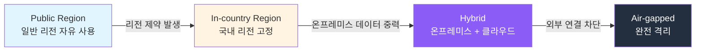
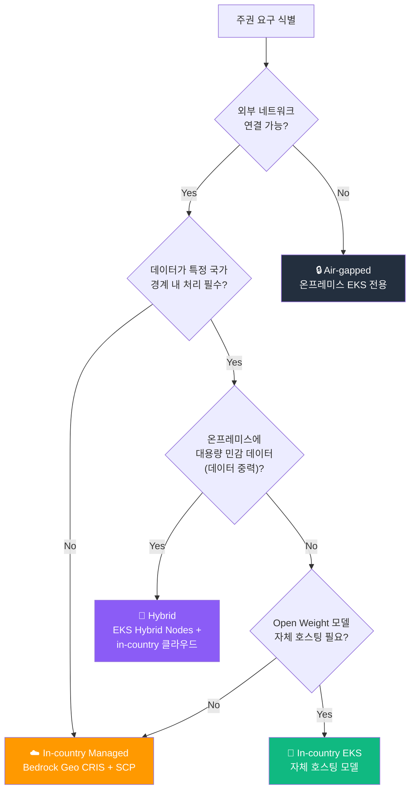
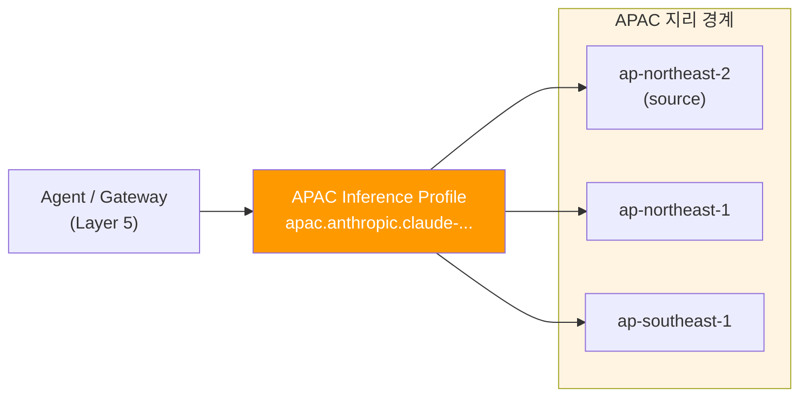
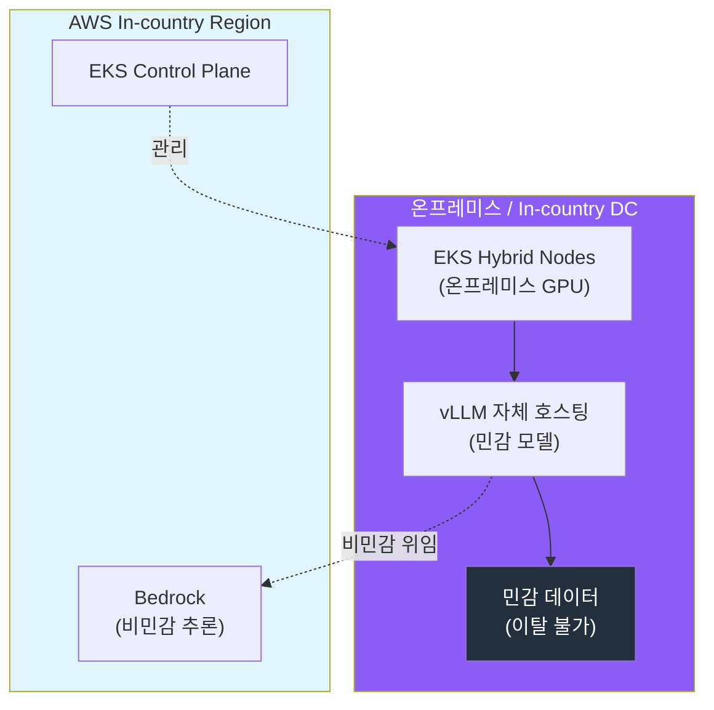

import { SovereigntySpectrum } from '@site/src/components/DecisionFrameworkTables';

## 개요

금융, 공공, 의료, 자율주행 등 규제 산업에서 Agentic AI를 도입할 때 가장 강한 제약은 **데이터 주권(Data Sovereignty)**입니다. 추론 입출력, 학습 데이터, 모델 가중치가 특정 국가·지리 경계를 벗어나면 안 되는 요구가 하드 제약으로 작용합니다. 이 문서는 데이터 주권 요구를 **AWS Native, EKS 자체 호스팅, 하이브리드** 중 어떤 조합으로 충족할지 의사결정 프레임워크를 제공하고, **SCP 리전 강제**, **Bedrock Geographic cross-Region inference**, **EKS Hybrid Nodes** 기반 구현 패턴을 정리합니다.

:::info 선행 문서
이 문서를 읽기 전에 다음 문서를 먼저 참조하세요:
- [플랫폼 아키텍처](../foundations/agentic-platform-architecture.md) — 거버넌스·안전·주권 플레인
- [AI 플랫폼 선택 가이드](./ai-platform-decision-framework.md) — 매니지드 vs 오픈소스 의사결정
- [EKS 기반 오픈 아키텍처](./agentic-ai-solutions-eks.md) — Self-hosted 스택, EKS Hybrid Nodes
:::

---

## 데이터 주권 스펙트럼

데이터 주권 요구는 단일 기준이 아니라 **연속적인 스펙트럼**입니다. 요구 강도가 높아질수록 매니지드 서비스 의존도는 낮아지고 자체 호스팅·온프레미스 비중이 커집니다.

<SovereigntySpectrum />



| 수준 | 데이터 경계 | 권장 접근 | 대표 사례 |
|------|-----------|----------|----------|
| **Public** | 리전 제약 없음 | AWS Native (Bedrock + AgentCore) | 일반 SaaS, 내부 생산성 도구 |
| **In-country** | 국내 리전 내 처리·저장 | Bedrock Geographic CRIS + SCP 리전 강제 | 국내 금융, 공공 클라우드 |
| **Hybrid** | 온프레미스 + in-country 클라우드 | EKS Hybrid Nodes + 자체 호스팅 모델 | 데이터 중력이 큰 제조·자율주행 |
| **Air-gapped** | 외부 네트워크 완전 차단 | 온프레미스 EKS + 자체 호스팅 전용 | 국방, 기밀 연구 |

:::tip 대부분은 In-country 또는 Hybrid로 수렴
완전 Air-gapped는 드물고, 실무에서는 **In-country 리전 고정 + 민감 워크로드만 온프레미스 자체 호스팅**하는 Hybrid가 가장 흔한 해법입니다. 자율주행 비전 데이터처럼 대용량·고민감 데이터를 다루는 조직은 데이터 중력 때문에 온프레미스 GPU를 두고, 일반 추론은 in-country 리전의 Bedrock/EKS와 조합합니다.
:::

---

## 의사결정 플로우차트



---

## 수단 1: SCP 기반 리전 강제

데이터 주권의 가장 기본적인 기술 통제는 **승인되지 않은 리전에서의 AWS API 호출을 조직 수준에서 차단**하는 것입니다. AWS Organizations의 Service Control Policy(SCP)로 구현하며, 개별 IAM 정책보다 상위에서 가드레일로 작동합니다.

### 리전 거부 SCP 패턴

핵심은 `Deny` 효과에 `aws:RequestedRegion` 조건을 걸되, 리전 개념이 없는 **글로벌 서비스(IAM, Organizations, CloudFront, Route 53 등)는 `NotAction`으로 예외 처리**하는 것입니다. 예외하지 않으면 글로벌 서비스 호출까지 막혀 계정이 정상 동작하지 않습니다.

```json
{
    "Version": "2012-10-17",
    "Statement": [
        {
            "Sid": "DenyOutsideApprovedRegions",
            "Effect": "Deny",
            "NotAction": [
                "iam:*",
                "organizations:*",
                "kms:*",
                "cloudfront:*",
                "route53:*",
                "sts:*",
                "support:*",
                "globalaccelerator:*",
                "budgets:*",
                "ce:*",
                "health:*",
                "ec2:DescribeRegions"
            ],
            "Resource": "*",
            "Condition": {
                "StringNotEquals": {
                    "aws:RequestedRegion": [
                        "ap-northeast-2",
                        "ap-northeast-1"
                    ]
                },
                "ArnNotLike": {
                    "aws:PrincipalARN": [
                        "arn:aws:iam::*:role/RegionBypassBreakGlassRole"
                    ]
                }
            }
        }
    ]
}
```

| 요소 | 역할 |
|------|------|
| `Effect: Deny` + `aws:RequestedRegion` | 승인 리전(`ap-northeast-2` 등) 외 모든 요청 거부 |
| `NotAction` (글로벌 서비스) | IAM·Organizations·KMS·CloudFront 등 리전 무관 서비스 예외 |
| `ArnNotLike` (break-glass) | 긴급 운영용 예외 역할 1개 지정 (감사 추적 필수) |

:::warning Bedrock 사용 시 SCP와 cross-Region inference 충돌 주의
Bedrock Geographic cross-Region inference를 사용하는 경우, 소스 리전만 허용하면 추론이 **실패**합니다. inference profile이 라우팅하는 **모든 destination 리전을 SCP 허용 목록에 포함**해야 합니다. 예를 들어 `apac` 프로파일이 `ap-northeast-1`, `ap-northeast-2`, `ap-southeast-1`로 라우팅한다면 세 리전을 모두 허용해야 합니다.
:::

### Control Tower Region Deny Control

AWS Control Tower를 사용하는 조직은 직접 SCP를 작성하는 대신 **Region deny control**(landing zone 수준)을 활성화하면 동일한 효과를 선언적으로 얻을 수 있습니다. 글로벌 서비스 예외 목록이 사전 정의되어 있어 유지보수가 간편합니다.

---

## 수단 2: Bedrock Geographic Cross-Region Inference

매니지드 모델(Bedrock)을 쓰면서도 데이터 residency를 지키려면 **Geographic cross-Region inference(CRIS)**를 사용합니다. 요청을 단일 리전이 아니라 **지정된 지리 경계(US, EU, APAC 등) 내 리전들로만** 분산하여, 처리량을 높이면서 데이터가 지리 경계를 벗어나지 않도록 보장합니다.



| 특성 | 설명 |
|------|------|
| **데이터 경계** | 지리(US/EU/APAC) 내 리전으로만 라우팅, 경계 외 이동 없음 |
| **처리량** | 단일 리전 대비 burst 트래픽 흡수, throttling 완화 |
| **전송 암호화** | 리전 간 트래픽은 AWS 보안 네트워크에서 암호화 전송 |
| **IAM 요구** | 소스 리전 + 모든 destination 리전의 foundation model 접근 권한 필요 |

:::info IAM·SCP 동시 설정 필요
Geographic CRIS는 ① inference profile ARN, ② 소스 리전의 foundation model, ③ **모든 destination 리전의 foundation model**에 대한 `bedrock:InvokeModel` 권한이 모두 있어야 동작합니다. 조직에 리전 거부 SCP가 있다면 destination 리전도 함께 허용해야 합니다. (위 [수단 1](#수단-1-scp-기반-리전-강제) 경고 참조)
:::

---

## 수단 3: EKS Hybrid Nodes 기반 하이브리드·자체 호스팅

데이터 중력이 크거나(대용량 비전·로그 데이터) in-country 리전조차 허용되지 않는 경우, **온프레미스 또는 in-country 데이터센터의 GPU를 EKS 클러스터에 편입**하는 EKS Hybrid Nodes로 자체 호스팅합니다. 컨트롤 플레인은 AWS 리전에, 데이터 플레인(GPU 노드)은 온프레미스에 두어 단일 Kubernetes 운영 모델을 유지합니다.



| 구성 요소 | 배치 | 이유 |
|----------|------|------|
| EKS Control Plane | AWS in-country 리전 | 관리형 운영, 패치·HA 위임 |
| GPU 데이터 플레인 | 온프레미스 (Hybrid Nodes) | 민감 데이터 이탈 방지, 데이터 중력 |
| 민감 모델 추론 | 온프레미스 vLLM | 입출력이 경계를 벗어나지 않음 |
| 비민감 추론 | in-country Bedrock | 운영 부담 절감, Cascade 위임 |

**자율주행 비전 데이터 시나리오**: 차량 카메라 원본 데이터는 용량이 크고 민감하여 온프레미스에 고정됩니다. 어노테이션·전처리 추론은 온프레미스 GPU(Hybrid Nodes)에서 자체 호스팅 모델로 처리하고, 일반 텍스트 요약·리포팅 같은 비민감 작업만 in-country 리전의 매니지드 서비스로 위임하여 비용과 운영 부담을 줄입니다.

:::info EKS Hybrid Nodes 상세
EKS Hybrid Nodes 구성, 온프레미스 GPU 편입, 네트워킹 요구사항은 [EKS 기반 오픈 아키텍처](./agentic-ai-solutions-eks.md#eks-auto-mode로-빠르게-시작)를 참조하세요.
:::

---

## 주권 수준별 권장 구성 요약

| 주권 수준 | 추론 | 데이터·모델 | 리전 통제 | 핵심 수단 |
|----------|------|-----------|----------|----------|
| **Public** | Bedrock (글로벌/지리 CRIS) | 리전 제약 없음 | 선택 | AWS Native |
| **In-country (Managed)** | Bedrock Geographic CRIS | in-country 리전 | SCP 리전 강제 | 수단 1 + 2 |
| **In-country (Self-hosted)** | in-country EKS + vLLM | in-country 리전 | SCP 리전 강제 | 수단 1 + 3 |
| **Hybrid** | 온프레미스 vLLM + in-country Bedrock | 온프레미스 + 리전 | SCP + 네트워크 격리 | 수단 1 + 2 + 3 |
| **Air-gapped** | 온프레미스 EKS 전용 | 온프레미스 전용 | 물리·네트워크 격리 | 수단 3 (외부 연결 차단) |

---

## 컴플라이언스 매핑

데이터 주권 수단은 규제 요구와 직접 연결됩니다.

| 규제 | 핵심 요구 | 대응 수단 |
|------|----------|----------|
| **전자금융감독규정** | 국내 데이터 처리·보관 | SCP in-country 리전 강제, 자체 호스팅 |
| **ISMS-P** | 데이터 위치·접근 통제, 감사 추적 | SCP + CloudTrail, RBAC |
| **GDPR (EU)** | EU 역내 개인정보 처리 | Bedrock EU Geographic CRIS |
| **개인정보보호법** | 국외 이전 제한 | 리전 거부 SCP, 온프레미스 격리 |

:::info 컴플라이언스 상세
SOC2·ISMS-P 통제 항목과 플랫폼 컴포넌트 매핑은 [컴플라이언스 프레임워크](../../operations-mlops/governance/compliance-framework.md)를 참조하세요.
:::

---

## 결론

데이터 주권은 단일 스위치가 아니라 Public → In-country → Hybrid → Air-gapped로 이어지는 스펙트럼이며, 각 수준은 SCP 리전 강제, Bedrock Geographic cross-Region inference, EKS Hybrid Nodes 자체 호스팅을 조합하여 충족합니다. 대부분의 규제 산업 조직은 **in-country 리전 고정 + 민감 워크로드 온프레미스 자체 호스팅**의 Hybrid로 수렴하며, 비민감 작업은 매니지드 서비스로 위임하여 비용과 운영 부담을 최적화합니다. 주권 통제는 거버넌스 플레인에서 플랫폼 전 레이어에 걸쳐 강제됩니다.

---

## 참고 자료

### 공식 문서

- [Service Control Policies (SCP)](https://docs.aws.amazon.com/organizations/latest/userguide/orgs_manage_policies_scps.html) — AWS Organizations SCP 가이드
- [Region deny control - AWS Control Tower](https://docs.aws.amazon.com/controltower/latest/controlreference/primary-region-deny-policy.html) — 리전 거부 컨트롤 SCP
- [Geographic cross-Region inference - Amazon Bedrock](https://docs.aws.amazon.com/bedrock/latest/userguide/geographic-cross-region-inference.html) — 지리 경계 추론, IAM·SCP 요구사항
- [Restrict data transfers across AWS Regions](https://docs.aws.amazon.com/prescriptive-guidance/latest/privacy-reference-architecture/restrict-data-transfers-across-regions.html) — 리전 간 데이터 전송 제한 SCP 샘플

### 논문 / 기술 블로그

- [AWS Well-Architected Generative AI Lens](https://docs.aws.amazon.com/wellarchitected/latest/generative-ai-lens/generative-ai-lens.html) — 생성형 AI 설계 원칙, 데이터 거버넌스
- [Data Residency and Hybrid Cloud Lens](https://docs.aws.amazon.com/wellarchitected/latest/financial-services-industry-lens/data-residency.html) — 데이터 residency 설계
- [Amazon EKS Hybrid Nodes](https://docs.aws.amazon.com/eks/latest/userguide/hybrid-nodes-overview.html) — 온프레미스 노드 편입

### 관련 문서 (내부)

- [플랫폼 아키텍처](../foundations/agentic-platform-architecture.md) — 거버넌스·안전·주권 플레인
- [AI 플랫폼 선택 가이드](./ai-platform-decision-framework.md) — 매니지드 vs 오픈소스 vs 하이브리드
- [EKS 기반 오픈 아키텍처](./agentic-ai-solutions-eks.md) — EKS Hybrid Nodes 자체 호스팅
- [컴플라이언스 프레임워크](../../operations-mlops/governance/compliance-framework.md) — SOC2·ISMS-P 매핑
