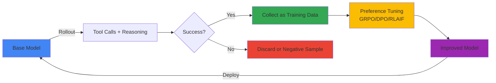
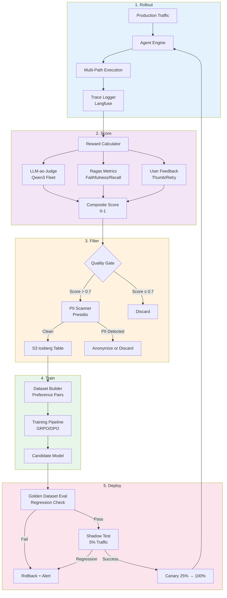
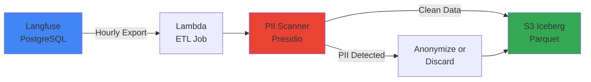

:::warning Self-Hosted SLM 전용
본 루프는 self-hosted 오픈웨이트 모델(Qwen3, Llama 4, GLM-5 등) 전용이다. AgentCore의 Claude/Nova 등 관리형 폐쇄 모델은 자가 학습 불가이므로 스코프에서 제외한다.
:::

# Self-Improving Agent Loop (Autosearch)

## Autosearch 담론과 엔터프라이즈 해석

### Karpathy의 핵심 주장

Andrej Karpathy는 LLM이 단순한 "next token prediction" 기계를 넘어 **자가 탐색(autosearch)** 시스템으로 진화할 것이라고 주장했다. 핵심 메커니즘:

1. **Tool-use Rollout**: LLM이 도구(코드 실행, 웹 검색, 계산기 등)를 사용하며 여러 추론 경로를 탐색
2. **Success as Signal**: 성공한 경로(정답 도달, 작업 완료)가 다음 학습의 시그널이 됨
3. **Self-Supervised Loop**: 인간 라벨링 없이 자체 성공·실패 데이터를 축적하고 강화학습으로 재학습
4. **Compound Growth**: 더 강해진 모델이 더 많은 성공 trace를 생성 → 더 강해지는 선순환



**예시**: 수학 문제 해결 Agent
- **Rollout**: "53 × 47 = ?"에 대해 5가지 접근(직접 계산, Python 실행, Wolfram Alpha, 근사 추정, 분해 계산)
- **Success**: Python 실행과 분해 계산이 정답 2491에 도달
- **Training**: 성공 경로를 preferred 샘플로, 실패 경로를 rejected 샘플로 DPO 학습
- **Next Iteration**: 모델이 복잡한 계산 시 Python 실행을 먼저 시도하도록 bias 증가

### 엔터프라이즈 환경의 제약

Karpathy의 이상론을 기업 환경에 적용하려면 다음 제약을 고려해야 한다:

| 제약 | 설명 | 해결 방향 |
|------|------|----------|
| **데이터 거버넌스** | 프로덕션 trace에 PII, 기밀 정보 포함 가능 | Presidio PII 스캐너, k-anonymity, consent 추적 |
| **비용** | Rollout마다 LLM 호출 N배 증가 (N=탐색 경로 수) | 비용·품질 trade-off 최적화, 저비용 모델 우선 사용 |
| **Reward 모델링** | "성공"의 정의가 모호(고객 만족? 정확도? latency?) | 복합 reward: LLM-as-judge + Ragas + 유저 피드백 |
| **Mode Collapse** | 특정 패턴만 반복 생성 (diversity 손실) | Entropy regularization, diverse sampling |
| **Regulatory** | 모델 변경마다 감사 로그, 모델 카드 업데이트 필요 | 버전 관리, audit trail, [Agent 버전관리](../../aidlc/enterprise/agent-versioning/index.md) 연동 |

:::tip 엔터프라이즈 인사이트
Self-improving loop는 **"완전 자동화"가 아니라 "인간 감독 하의 자동 강화"**로 해석해야 한다. 매 iteration마다 품질 게이트와 휴먼-인-루프 검증이 필수다.
:::

---

## 5-Stage Loop 아키텍처

### 전체 아키텍처 다이어그램



### Stage 1: Rollout — 프로덕션 트래픽 수집

**목표**: 실제 사용자 요청에 대한 Agent 실행 trace를 수집한다.

**실행 주기**: 연속(Real-time)

**입력**: 사용자 요청, 컨텍스트, Agent 상태  
**출력**: Trace (프롬프트, 도구 호출, 중간 추론, 최종 응답, latency, 토큰 수)

**수집 메커니즘**:

```python
from langfuse import Langfuse

langfuse = Langfuse()

@trace_agent_call  # 데코레이터로 자동 trace
def execute_agent(user_query: str, context: dict):
    trace = langfuse.trace(name="agent-execution", metadata={"user_id": context["user_id"]})
    
    with trace.span(name="retrieval"):
        docs = vector_db.search(user_query)
    
    with trace.span(name="reasoning"):
        response = llm.generate(prompt=build_prompt(user_query, docs))
    
    with trace.span(name="tool-execution"):
        if response.requires_tool:
            tool_result = execute_tool(response.tool_name, response.tool_args)
    
    trace.event(name="completion", metadata={"tokens": response.token_count})
    return response
```

**다양성 확보**: 동일 요청에 대해 temperature 변화(0.7/0.9/1.1)로 3가지 응답 생성 → diversity 증가

**실패 복구**: Trace 수집 실패해도 사용자 응답은 정상 반환 (async logging)

---

### Stage 2: Score — Reward 계산

**목표**: 각 trace에 0-1 점수를 부여하여 "얼마나 좋은 응답인가"를 정량화한다.

**실행 주기**: 시간별(Hourly) 배치

**입력**: Langfuse trace ID 배치  
**출력**: `{trace_id: reward_score}` 테이블

**복합 Reward 공식**:

```python
reward_score = (
    w1 * llm_judge_score +      # LLM-as-Judge (0-1)
    w2 * ragas_faithfulness +   # Ragas faithfulness (0-1)
    w3 * ragas_context_recall + # Ragas context recall (0-1)
    w4 * user_feedback_score +  # Thumbs up=1, down=0, neutral=0.5
    w5 * latency_penalty        # P99 초과 시 감점
)

# 기본 가중치 (실험으로 조정)
w1, w2, w3, w4, w5 = 0.3, 0.25, 0.2, 0.2, 0.05
```

**LLM-as-Judge 프롬프트**:

```python
judge_prompt = f"""
다음 Agent 응답을 평가하세요:

**질문**: {question}
**컨텍스트**: {context}
**응답**: {answer}

평가 기준:
1. 정확성: 컨텍스트 기반 사실 정확성
2. 완전성: 질문의 모든 측면을 다루는가
3. 명확성: 사용자가 이해하기 쉬운가
4. 간결성: 불필요한 정보 없이 핵심만 전달하는가

0-1 사이 점수와 근거를 JSON으로 반환하세요.
{{"score": 0.85, "reasoning": "정확하고 완전하나 약간 장황함"}}
"""

judge_response = cheap_llm.generate(judge_prompt)  # Qwen3-7B 사용 (비용 절감)
```

**Ragas 평가**:

```python
from ragas.metrics import faithfulness, context_recall

eval_data = {
    "question": [question],
    "answer": [answer],
    "contexts": [contexts],
    "ground_truth": [ground_truth] if available else None
}

ragas_result = evaluate(Dataset.from_dict(eval_data), metrics=[faithfulness, context_recall])
```

**User Feedback 통합**:

```python
# Langfuse에서 사용자 피드백 조회
feedback = langfuse.get_scores(trace_id=trace_id, name="user-feedback")
user_score = 1.0 if feedback.value == "positive" else 0.0 if feedback.value == "negative" else 0.5
```

**비용 최적화**:
- LLM-as-Judge는 저비용 모델(Qwen3-7B, Llama 4 Scout) 사용
- Ragas는 캐싱(동일 question+context 조합 재사용)
- 유저 피드백 우선 — 피드백 있으면 LLM-as-Judge 스킨

---

### Stage 3: Filter — 데이터 큐레이션 & PII 게이트

**목표**: 고품질 trace만 학습 데이터로 선별하고, 민감 정보를 제거한다.

**실행 주기**: 시간별(Hourly) 배치

**입력**: Scored traces  
**출력**: Clean training dataset (S3 Iceberg 테이블)

**품질 게이트**:

```python
def filter_traces(scored_traces):
    filtered = []
    for trace in scored_traces:
        # 1. 최소 점수 임계값
        if trace.reward_score < 0.7:
            continue
        
        # 2. Latency 이상치 제거 (P99 > 30초)
        if trace.latency > 30:
            continue
        
        # 3. 에러 발생 trace 제외
        if trace.error_count > 0:
            continue
        
        # 4. 중복 제거 (동일 question+answer 조합)
        if is_duplicate(trace):
            continue
        
        filtered.append(trace)
    
    return filtered
```

**PII 스캐닝 (Presidio)**:

```python
from presidio_analyzer import AnalyzerEngine
from presidio_anonymizer import AnonymizerEngine

analyzer = AnalyzerEngine()
anonymizer = AnonymizerEngine()

def scan_and_anonymize(text: str) -> tuple[str, bool]:
    """PII 탐지 후 익명화. (익명화된 텍스트, PII 발견 여부) 반환"""
    results = analyzer.analyze(text=text, language='ko')
    
    if not results:
        return text, False  # PII 없음
    
    # PII 발견 → 익명화
    anonymized = anonymizer.anonymize(text=text, analyzer_results=results)
    return anonymized.text, True

# Trace 처리
for trace in filtered_traces:
    trace.question, q_has_pii = scan_and_anonymize(trace.question)
    trace.answer, a_has_pii = scan_and_anonymize(trace.answer)
    
    if q_has_pii or a_has_pii:
        trace.metadata["pii_detected"] = True
```

**k-Anonymity 체크** (동일 query 패턴이 k명 이상 있어야 학습 데이터로 사용):

```python
def check_k_anonymity(traces, k=5):
    """동일 패턴이 k건 미만이면 제거"""
    query_counts = defaultdict(int)
    for trace in traces:
        query_pattern = extract_pattern(trace.question)  # 엔티티 제거 후 패턴 추출
        query_counts[query_pattern] += 1
    
    return [t for t in traces if query_counts[extract_pattern(t.question)] >= k]
```

**저장소 — S3 + Iceberg**:

```python
import pyiceberg

catalog = pyiceberg.catalog.load_catalog("training_data")
table = catalog.load_table("agent_traces")

# Iceberg 테이블에 append
table.append([
    {"trace_id": t.id, "question": t.question, "answer": t.answer, 
     "reward": t.reward_score, "timestamp": t.timestamp}
    for t in filtered_traces
])
```

**규제 준수**:
- **GDPR/PIPA**: 사용자 동의 없이 학습 데이터 사용 시 opt-out 메커니즘 필수
- **데이터 보관 기간**: 학습 완료 후 90일 이내 삭제 (정책 설정)
- **Audit Log**: 모든 PII 탐지·익명화 이벤트를 CloudTrail/Audit DB에 기록

---

### Stage 4: Train — Preference Tuning

**목표**: 고품질 trace를 사용해 모델을 강화학습으로 재학습한다.

**실행 주기**: 주간(Weekly) 또는 월간(Monthly)

**입력**: S3 Iceberg 테이블 (preference pairs)  
**출력**: Candidate 모델 체크포인트

**Preference Pair 구성**:

Self-improving loop는 "동일 질문에 대한 여러 응답" 중 reward가 높은 것을 preferred, 낮은 것을 rejected로 사용한다.

```python
def build_preference_pairs(traces):
    """동일 question에 대한 trace들을 묶어 pair 생성"""
    grouped = defaultdict(list)
    for trace in traces:
        grouped[trace.question].append(trace)
    
    pairs = []
    for question, trace_list in grouped.items():
        if len(trace_list) < 2:
            continue  # pair 불가
        
        # Reward 기준 정렬
        sorted_traces = sorted(trace_list, key=lambda t: t.reward_score, reverse=True)
        
        # Top 1 vs Bottom 1 pair
        preferred = sorted_traces[0]
        rejected = sorted_traces[-1]
        
        # Reward 차이가 충분히 커야 유의미한 pair
        if preferred.reward_score - rejected.reward_score < 0.2:
            continue
        
        pairs.append({
            "prompt": question,
            "chosen": preferred.answer,
            "rejected": rejected.answer,
            "reward_diff": preferred.reward_score - rejected.reward_score
        })
    
    return pairs
```

**학습 방법 선택 가이드**:

| 방법 | 데이터 요구량 | GPU-hours (7B 모델) | 수렴 안정성 | 적합 시나리오 |
|------|-------------|---------------------|------------|-------------|
| **GRPO** | 1k+ pairs | ~50 (4×H100) | ⭐⭐⭐ | 초기 self-improvement, 빠른 iteration |
| **DPO** | 5k+ pairs | ~200 (8×H100) | ⭐⭐⭐⭐ | 충분한 데이터 확보 후, 안정적 학습 |
| **RLAIF** | 10k+ pairs + reward model | ~500 (8×H100) | ⭐⭐ | 복잡한 reward 모델링 필요 시 |
| **RFT** | 10k+ high-quality traces | ~300 (8×H100) | ⭐⭐⭐⭐⭐ | Supervised 학습 가능한 golden dataset 확보 시 |

:::tip 선택 가이드
- **초기 (데이터 &lt;2k pairs)**: GRPO — 가장 빠르고 적은 데이터로 효과
- **중기 (데이터 5k-10k pairs)**: DPO — 안정성과 효과의 균형
- **성숙기 (데이터 >10k)**: RLAIF 또는 RFT — 복잡한 reward 모델링
:::

**GRPO 학습 예시 (NeMo-RL)**:

```python
from nemo.collections.nlp.models.language_modeling import MegatronGPTSFTModel
from nemo_aligner.algorithms.grpo import GRPOTrainer

# Base model 로드
model = MegatronGPTSFTModel.restore_from("qwen3-7b-base.nemo")

# GRPO 설정
grpo_config = {
    "num_rollouts": 4,  # 질문당 4개 응답 생성
    "kl_coef": 0.05,    # KL divergence penalty (policy drift 방지)
    "clip_range": 0.2,
    "learning_rate": 1e-6,
    "batch_size": 16,
    "gradient_accumulation": 4,
}

trainer = GRPOTrainer(model=model, config=grpo_config)

# 학습 실행
trainer.fit(train_dataset=preference_pairs, val_dataset=golden_dataset)

# 체크포인트 저장
model.save_to("qwen3-7b-grpo-2026-04-18.nemo")
```

**DPO 학습 예시 (TRL)**:

```python
from transformers import AutoModelForCausalLM, AutoTokenizer
from trl import DPOTrainer, DPOConfig

model = AutoModelForCausalLM.from_pretrained("Qwen/Qwen3-7B-Instruct")
tokenizer = AutoTokenizer.from_pretrained("Qwen/Qwen3-7B-Instruct")

dpo_config = DPOConfig(
    beta=0.1,  # Temperature for DPO loss
    learning_rate=5e-7,
    per_device_train_batch_size=2,
    gradient_accumulation_steps=8,
    max_length=2048,
    num_train_epochs=1,
)

trainer = DPOTrainer(
    model=model,
    args=dpo_config,
    train_dataset=preference_dataset,
    tokenizer=tokenizer,
)

trainer.train()
model.save_pretrained("qwen3-7b-dpo-2026-04-18")
```

**학습 모니터링**:

```python
# Wandb 연동으로 실시간 메트릭 추적
import wandb

wandb.init(project="self-improving-agent", name="grpo-2026-04-18")

# 추적 메트릭
- Reward mean/std (배치별)
- KL divergence (base model 대비 policy drift)
- Loss curve
- Validation accuracy (golden dataset)
- Training time per epoch
```

**비용 추정 (Qwen3-7B, 5k pairs, DPO)**:
- GPU: 8× H100 × 25시간 = 200 GPU-hours
- 클라우드 비용 (p5.48xlarge, $98.32/hr): ~$2,458
- 비교: 매주 학습 시 월 $10k, 월간 학습 시 월 $2.5k

---

### Stage 5: Deploy — 회귀 검증 & 점진 배포

**목표**: 새로 학습된 모델이 기존 대비 퇴화하지 않았는지 검증 후 프로덕션에 배포한다.

**실행 주기**: 학습 완료 후 1회

**입력**: Candidate 모델 체크포인트  
**출력**: 프로덕션 배포 또는 롤백

**Golden Dataset 평가**:

```python
from ragas import evaluate
from datasets import Dataset

# Golden Dataset (도메인 전문가가 검증한 100-200개 QA)
golden_data = load_golden_dataset("s3://golden-eval/agent-qa-v2.jsonl")

# Baseline 모델 평가
baseline_results = evaluate_model(baseline_model, golden_data)

# Candidate 모델 평가
candidate_results = evaluate_model(candidate_model, golden_data)

# 통계 비교
from scipy.stats import ttest_rel

t_stat, p_value = ttest_rel(baseline_results, candidate_results)

if p_value < 0.05 and mean(candidate_results) > mean(baseline_results):
    print("✅ Candidate 모델이 통계적으로 유의하게 우수")
    decision = "PROCEED_TO_SHADOW"
elif mean(candidate_results) < mean(baseline_results) * 0.95:
    print("❌ 5% 이상 퇴화 감지 → 롤백")
    decision = "ROLLBACK"
else:
    print("⚠️ 유의미한 차이 없음 → 추가 검증 필요")
    decision = "MANUAL_REVIEW"
```

**Shadow Test (5% 트래픽)**:

```python
# Inference Gateway 설정 (LiteLLM + Feature Flag)
from ldclient import LDClient, Context

ld_client = LDClient(sdk_key="sdk-key")

def select_model(user_id: str) -> str:
    context = Context.builder(user_id).kind("user").build()
    variant = ld_client.get_variant("agent-model-shadow-test", context)
    
    # 95% baseline, 5% candidate (shadow)
    return "qwen3-7b-baseline" if variant.name == "control" else "qwen3-7b-candidate"

# Shadow 응답은 로깅만, 사용자에게는 baseline 반환
async def execute_with_shadow(query: str, user_id: str):
    baseline_task = agent_call(model="qwen3-7b-baseline", query=query)
    candidate_task = agent_call(model="qwen3-7b-candidate", query=query, shadow=True)
    
    baseline_resp, candidate_resp = await asyncio.gather(baseline_task, candidate_task)
    
    # 비교 로깅
    log_shadow_comparison(query, baseline_resp, candidate_resp)
    
    return baseline_resp  # 사용자에게는 baseline만
```

**회귀 모니터링 (24시간)**:

```promql
# Prometheus 쿼리: Candidate vs Baseline 에러율
rate(agent_errors_total{model="candidate"}[1h]) / rate(agent_requests_total{model="candidate"}[1h])
vs
rate(agent_errors_total{model="baseline"}[1h]) / rate(agent_requests_total{model="baseline"}[1h])

# Latency P99
histogram_quantile(0.99, rate(agent_latency_bucket{model="candidate"}[1h]))
vs
histogram_quantile(0.99, rate(agent_latency_bucket{model="baseline"}[1h]))

# User Feedback 비율
sum(rate(user_feedback_positive{model="candidate"}[1h])) / sum(rate(user_feedback_total{model="candidate"}[1h]))
```

**자동 롤백 트리거**:

```yaml
# Prometheus AlertManager
- alert: CandidateModelRegression
  expr: |
    (rate(agent_errors_total{model="candidate"}[30m]) 
     / rate(agent_requests_total{model="candidate"}[30m]))
    > 1.5 * 
    (rate(agent_errors_total{model="baseline"}[30m]) 
     / rate(agent_requests_total{model="baseline"}[30m]))
  for: 30m
  annotations:
    summary: "Candidate 모델 에러율 1.5배 증가 → 자동 롤백"
  # Webhook → Lambda → LaunchDarkly API (variant weight를 0%로 변경)
```

**Canary 배포 (Shadow 성공 시)**:

```python
# LaunchDarkly 콘솔에서 점진적 비율 증가
# Day 1: 5% (shadow) → 5% (live)
# Day 2: 25%
# Day 3: 50%
# Day 4: 100%

# 각 단계마다 24시간 모니터링 → 회귀 없으면 다음 단계
```

---

## Reward 설계

### LLM-as-Judge + Ragas + User Feedback 가중치

**기본 가중치** (실험으로 조정 필요):

```python
REWARD_WEIGHTS = {
    "llm_judge": 0.30,        # LLM-as-Judge 평가
    "faithfulness": 0.25,     # Ragas faithfulness (환각 방지)
    "context_recall": 0.20,   # Ragas context recall (검색 품질)
    "user_feedback": 0.20,    # Thumbs up/down
    "latency_penalty": 0.05,  # P99 초과 시 감점
}

def compute_reward(trace):
    score = 0.0
    
    # 1. LLM-as-Judge
    judge_score = llm_judge_evaluate(trace.question, trace.answer, trace.context)
    score += REWARD_WEIGHTS["llm_judge"] * judge_score
    
    # 2. Ragas faithfulness
    faith_score = ragas.faithfulness.score(trace.answer, trace.context)
    score += REWARD_WEIGHTS["faithfulness"] * faith_score
    
    # 3. Ragas context recall
    recall_score = ragas.context_recall.score(trace.context, trace.ground_truth)
    score += REWARD_WEIGHTS["context_recall"] * recall_score
    
    # 4. User feedback
    feedback_score = 1.0 if trace.user_feedback == "positive" else \
                     0.0 if trace.user_feedback == "negative" else 0.5
    score += REWARD_WEIGHTS["user_feedback"] * feedback_score
    
    # 5. Latency penalty (P99 > 10초 시 감점)
    if trace.latency > 10:
        penalty = min(0.05, (trace.latency - 10) / 100)  # 최대 5% 감점
        score -= penalty
    
    return max(0.0, min(1.0, score))  # 0-1 범위로 clamp
```

### 가중치 조정 실험

**A/B Test로 최적 가중치 탐색**:

```python
# 실험군 정의
experiments = [
    {"name": "baseline", "weights": {"llm_judge": 0.3, "faithfulness": 0.25, ...}},
    {"name": "user-first", "weights": {"llm_judge": 0.2, "user_feedback": 0.4, ...}},
    {"name": "quality-first", "weights": {"faithfulness": 0.4, "context_recall": 0.3, ...}},
]

# 각 실험군에 대해 별도 학습 파이프라인 실행
for exp in experiments:
    model = train_with_rewards(base_model, preference_pairs, reward_weights=exp["weights"])
    
    # Golden dataset 평가
    results = evaluate(model, golden_dataset)
    
    # 프로덕션 테스트 (Canary 5%)
    production_metrics = deploy_canary(model, traffic_pct=0.05, duration_hours=24)
    
    # 비즈니스 메트릭 추적
    print(f"{exp['name']}: Accuracy={results.accuracy}, User Satisfaction={production_metrics.satisfaction}")
```

**반복 최적화**:
1. 초기 가중치로 모델 학습
2. 프로덕션 배포 후 비즈니스 메트릭 수집 (user satisfaction, task completion rate)
3. 가중치 조정 후 재학습
4. 2-3회 iteration 후 최적 조합 확정

---

## 데이터 큐레이션 & PII 게이트

### Langfuse Trace → S3 Iceberg 테이블

**데이터 플로우**:



**Lambda ETL Job**:

```python
import boto3
import psycopg2
from presidio_analyzer import AnalyzerEngine
from pyiceberg.catalog import load_catalog

def lambda_handler(event, context):
    # 1. Langfuse DB에서 지난 1시간 trace 조회
    conn = psycopg2.connect(os.environ["LANGFUSE_DB_URL"])
    cursor = conn.execute("""
        SELECT id, input, output, metadata, score
        FROM traces
        WHERE created_at > NOW() - INTERVAL '1 hour'
          AND score > 0.7
    """)
    traces = cursor.fetchall()
    
    # 2. PII 스캐닝
    analyzer = AnalyzerEngine()
    clean_traces = []
    
    for trace in traces:
        input_results = analyzer.analyze(text=trace["input"], language="ko")
        output_results = analyzer.analyze(text=trace["output"], language="ko")
        
        if input_results or output_results:
            # PII 발견 → 익명화 or 폐기
            if should_anonymize(trace):
                trace = anonymize_trace(trace, input_results, output_results)
            else:
                continue  # 폐기
        
        clean_traces.append(trace)
    
    # 3. Iceberg 테이블에 저장
    catalog = load_catalog("glue", **{"s3.endpoint": "https://s3.amazonaws.com"})
    table = catalog.load_table("training_data.agent_traces")
    table.append(clean_traces)
    
    return {"status": "success", "traces_processed": len(clean_traces)}
```

### Presidio PII 스캐너

**지원 엔티티** (한국어):
- 이름, 이메일, 전화번호, 주민등록번호, 신용카드 번호, 주소, IP 주소

**커스텀 인식기 추가**:

```python
from presidio_analyzer import Pattern, PatternRecognizer

# 한국 계좌번호 패턴
account_number_recognizer = PatternRecognizer(
    supported_entity="KR_ACCOUNT_NUMBER",
    patterns=[Pattern("account", r"\d{3}-\d{2}-\d{6}", 0.8)],
)

analyzer.registry.add_recognizer(account_number_recognizer)
```

### k-Anonymity

**개념**: 동일한 패턴의 query가 최소 k명 이상 존재해야 개인 식별 위험이 낮다고 판단.

**구현**:

```python
from collections import defaultdict

def apply_k_anonymity(traces, k=5):
    """k-anonymity 기준 미달 trace 제거"""
    
    # 1. Query 패턴 추출 (named entity 제거)
    pattern_groups = defaultdict(list)
    for trace in traces:
        pattern = extract_pattern(trace.question)  # "홍길동" → "[NAME]", "2026-04-18" → "[DATE]"
        pattern_groups[pattern].append(trace)
    
    # 2. k개 미만 그룹 제거
    filtered = []
    for pattern, group in pattern_groups.items():
        if len(group) >= k:
            filtered.extend(group)
        else:
            print(f"⚠️ 패턴 '{pattern}' 제거 (k={len(group)} < {k})")
    
    return filtered

def extract_pattern(text: str) -> str:
    """Named entity를 placeholder로 치환"""
    # NER 모델로 엔티티 추출 후 치환
    entities = ner_model.predict(text)
    for entity in entities:
        text = text.replace(entity.text, f"[{entity.label}]")
    return text
```

### 약관 & 지역 저장 요건

**한국 PIPA (개인정보보호법)**:
- 사용자 동의 없이 프로필 기반 자동 결정 금지 → **opt-in consent 필수**
- 국외 이전 시 별도 동의 필요 → **국내 리전(ap-northeast-2) 저장**

**GDPR**:
- Right to be forgotten → **사용자 요청 시 7일 내 삭제**
- Data minimization → **학습 완료 후 90일 이내 원본 trace 삭제**

**Consent 추적**:

```python
# User consent 테이블
consent_table = {
    "user_id": "u123",
    "consent_to_training": True,
    "consent_date": "2026-04-01",
    "withdraw_date": None,
}

# Trace 수집 시 consent 확인
if not user_consents[trace.user_id].consent_to_training:
    continue  # 학습 데이터로 사용 불가
```

---

## Preference Tuning 선택 가이드

### GRPO (Group Relative Policy Optimization)

**원리**: 동일 프롬프트에 대한 여러 응답(rollout)의 상대적 reward를 기준으로 policy 업데이트. PPO의 변형이지만 reference model 불필요.

**장점**:
- 적은 데이터로도 효과 (1k pairs부터)
- 빠른 수렴 (50 GPU-hours)
- Reference model 불필요 → 메모리 절약

**단점**:
- 수렴 불안정 (learning rate 조정 민감)
- 복잡한 reward 함수 대응 어려움

**사용 예시**:

```python
# NeMo-Aligner GRPO
from nemo_aligner.algorithms.grpo import GRPOTrainer

trainer = GRPOTrainer(
    model=base_model,
    num_rollouts=4,           # 질문당 4개 응답 생성
    kl_coef=0.05,             # KL penalty
    learning_rate=1e-6,
    batch_size=16,
)

trainer.fit(train_dataset)
```

**적합 시나리오**: 초기 self-improvement, 빠른 iteration 필요 시

---

### DPO (Direct Preference Optimization)

**원리**: Preferred/rejected pair를 직접 사용하여 implicit reward 학습. Reward model 없이 policy 직접 최적화.

**장점**:
- 안정적 수렴
- Reference model과의 KL divergence 자동 제어
- 구현 단순 (TRL 라이브러리)

**단점**:
- 충분한 데이터 필요 (5k+ pairs)
- 학습 시간 김 (200 GPU-hours)

**사용 예시**:

```python
from trl import DPOTrainer, DPOConfig

config = DPOConfig(
    beta=0.1,                 # DPO temperature
    learning_rate=5e-7,
    max_length=2048,
    num_train_epochs=1,
)

trainer = DPOTrainer(
    model=base_model,
    args=config,
    train_dataset=preference_dataset,  # {"prompt", "chosen", "rejected"} 형식
    tokenizer=tokenizer,
)

trainer.train()
```

**적합 시나리오**: 충분한 데이터 확보 후 안정적 학습

---

### RLAIF (Reinforcement Learning from AI Feedback)

**원리**: AI가 생성한 피드백으로 reward model 학습 → PPO로 policy 최적화. RLHF의 "Human" → "AI" 변형.

**장점**:
- 복잡한 reward 함수 표현 가능
- 대규모 학습에 유리

**단점**:
- Reward model 학습 오버헤드 (추가 GPU-hours)
- 수렴 불안정 (hyperparameter 민감)
- 구현 복잡도 높음

**사용 예시**:

```python
# 1. Reward model 학습
from transformers import AutoModelForSequenceClassification

reward_model = AutoModelForSequenceClassification.from_pretrained("Qwen/Qwen3-7B", num_labels=1)

reward_trainer = Trainer(
    model=reward_model,
    train_dataset=labeled_comparisons,  # (prompt, response_a, response_b, preference)
)
reward_trainer.train()

# 2. PPO로 policy 최적화
from trl import PPOTrainer

ppo_trainer = PPOTrainer(
    model=base_model,
    ref_model=reference_model,
    reward_model=reward_model,
    config=ppo_config,
)

ppo_trainer.train()
```

**적합 시나리오**: 복잡한 reward 모델링 필요 시 (예: 다단계 추론, 창의성 평가)

---

### RFT (Rejection Sampling Fine-Tuning)

**원리**: 다수 rollout 중 high-reward 응답만 선별 → supervised fine-tuning. RL 없이 SFT로 강화.

**장점**:
- 가장 안정적 수렴
- 구현 단순 (SFT와 동일)
- High-quality dataset 확보 시 최고 효율

**단점**:
- Golden dataset 필요 (10k+ high-quality traces)
- Exploration 부족 (선별된 응답만 학습)

**사용 예시**:

```python
# 1. High-reward trace 선별
high_quality_traces = [t for t in traces if t.reward_score > 0.9]

# 2. SFT 데이터셋 구성
sft_dataset = [
    {"prompt": t.question, "completion": t.answer}
    for t in high_quality_traces
]

# 3. SFT 학습
from transformers import Trainer

trainer = Trainer(
    model=base_model,
    train_dataset=sft_dataset,
    args=TrainingArguments(learning_rate=2e-5, num_train_epochs=3),
)

trainer.train()
```

**적합 시나리오**: 도메인 전문가가 검증한 golden dataset 확보 시

---

### 실전 비교 (Qwen3-7B, 5k pairs 기준)

| 메트릭 | GRPO | DPO | RLAIF | RFT |
|--------|------|-----|-------|-----|
| **GPU-hours** | 50 | 200 | 500 | 300 |
| **최소 데이터** | 1k | 5k | 10k | 10k |
| **수렴 안정성** | ⭐⭐⭐ | ⭐⭐⭐⭐ | ⭐⭐ | ⭐⭐⭐⭐⭐ |
| **구현 복잡도** | 중 | 낮 | 높 | 낮 |
| **Reward 유연성** | 낮 | 중 | 높 | 낮 |
| **클라우드 비용** | $500 | $2,000 | $5,000 | $3,000 |

**권장 로드맵**:
1. **Phase 1 (1-2개월)**: GRPO로 빠른 proof-of-concept
2. **Phase 2 (3-6개월)**: 데이터 축적 후 DPO 전환
3. **Phase 3 (6개월+)**: 복잡한 reward 필요 시 RLAIF 도입, 또는 golden dataset 확보 시 RFT 병행

---

## Safety — Reward Hacking 탐지 및 방어

### Reward Hacking이란?

모델이 "진짜 좋은 응답"이 아니라 "reward를 높게 받는 응답"만 학습하는 현상.

**예시**:
- **과도한 장황함**: 길게 쓰면 completeness 점수 ↑ → 불필요하게 긴 답변 생성
- **템플릿 반복**: "다음 단계를 따르세요: 1) ... 2) ..." 패턴이 높은 점수 → 모든 답변이 동일 형식
- **확신 과잉**: "절대 확실합니다" 같은 단정적 표현이 LLM-as-Judge 점수 ↑ → 환각도 자신있게 답변

### Diverse Rollout 샘플링

**전략**: 동일 질문에 대해 다양한 응답 생성 → diversity 확보.

```python
def diverse_rollout(prompt: str, n=4):
    """다양성 확보를 위한 샘플링"""
    responses = []
    
    for i in range(n):
        # Temperature, top_p 변화
        temp = 0.7 + i * 0.1  # 0.7, 0.8, 0.9, 1.0
        top_p = 0.9 - i * 0.05  # 0.9, 0.85, 0.8, 0.75
        
        response = llm.generate(
            prompt=prompt,
            temperature=temp,
            top_p=top_p,
            max_tokens=512,
        )
        responses.append(response)
    
    return responses
```

**Diversity 메트릭 모니터링**:

```python
from sentence_transformers import SentenceTransformer
from sklearn.metrics.pairwise import cosine_similarity

embedder = SentenceTransformer("sentence-transformers/paraphrase-multilingual-mpnet-base-v2")

def measure_diversity(responses: list[str]) -> float:
    """응답 간 cosine similarity 평균 (낮을수록 diverse)"""
    embeddings = embedder.encode(responses)
    similarities = cosine_similarity(embeddings)
    
    # 대각선 제외 (자기 자신과의 유사도)
    avg_sim = (similarities.sum() - len(responses)) / (len(responses) * (len(responses) - 1))
    
    return 1 - avg_sim  # diversity score (높을수록 diverse)

# 알림 설정
if measure_diversity(batch_responses) < 0.3:
    alert("⚠️ 응답 diversity 부족 → mode collapse 가능성")
```

### Entropy Regularization

**목적**: 모델이 특정 패턴에 과도하게 치우치지 않도록 출력 분포의 entropy를 유지.

```python
import torch
import torch.nn.functional as F

def entropy_regularized_loss(logits, labels, entropy_coef=0.01):
    """Cross-entropy loss + entropy regularization"""
    
    # 1. 기본 loss
    ce_loss = F.cross_entropy(logits, labels)
    
    # 2. Output distribution의 entropy 계산
    probs = F.softmax(logits, dim=-1)
    entropy = -torch.sum(probs * torch.log(probs + 1e-10), dim=-1).mean()
    
    # 3. Entropy를 loss에서 빼서 high-entropy 선호
    total_loss = ce_loss - entropy_coef * entropy
    
    return total_loss
```

**Entropy 모니터링**:

```python
# 학습 중 batch별 entropy 추적
wandb.log({"output_entropy": entropy.item()})

# Entropy가 급감하면 mode collapse 경고
if entropy < 2.0:  # threshold는 vocab size에 따라 조정
    alert("⚠️ Low entropy detected → mode collapse 가능성")
```

### Policy Drift 모니터링 (KL Divergence)

**목적**: 재학습 후 모델이 base model과 너무 멀어지지 않도록 KL divergence 추적.

```python
import torch.nn.functional as F

def compute_kl_divergence(base_model, new_model, test_prompts):
    """Base model과 new model의 KL divergence 계산"""
    
    kl_divs = []
    for prompt in test_prompts:
        # Base model logits
        with torch.no_grad():
            base_logits = base_model(prompt).logits
            base_probs = F.softmax(base_logits, dim=-1)
        
        # New model logits
        new_logits = new_model(prompt).logits
        new_probs = F.softmax(new_logits, dim=-1)
        
        # KL(new || base)
        kl = F.kl_div(new_probs.log(), base_probs, reduction='batchmean')
        kl_divs.append(kl.item())
    
    return sum(kl_divs) / len(kl_divs)

# 배포 전 체크
kl_threshold = 0.5  # 경험적으로 조정
avg_kl = compute_kl_divergence(base_model, candidate_model, golden_prompts)

if avg_kl > kl_threshold:
    alert(f"⚠️ KL divergence {avg_kl:.3f} > {kl_threshold} → policy drift 과도")
    decision = "ROLLBACK"
```

### 휴먼-인-루프 검증

**전략**: 전체 학습 데이터의 1-2%를 주간 인간 검토로 품질 확인.

```python
def sample_for_human_review(traces, sample_rate=0.02):
    """랜덤 샘플링 + edge case 우선 선택"""
    
    # 1. 랜덤 샘플
    random_sample = random.sample(traces, int(len(traces) * sample_rate * 0.5))
    
    # 2. Edge case 우선 샘플 (높은 reward + 낮은 user feedback)
    edge_cases = sorted(
        traces,
        key=lambda t: abs(t.reward_score - t.user_feedback_score),
        reverse=True
    )[:int(len(traces) * sample_rate * 0.5)]
    
    return random_sample + edge_cases

# Weekly review
review_batch = sample_for_human_review(last_week_traces)

# Labeling UI로 전송
for trace in review_batch:
    send_to_labeling_ui(trace, reviewer="domain_expert")
```

**검토 결과 피드백**:

```python
# 인간 검토 결과
human_labels = load_human_reviews("s3://reviews/week-2026-04-18.json")

# Reward 함수와 인간 평가 간 상관계수 계산
from scipy.stats import spearmanr

corr, p_value = spearmanr(
    [h.reward_score for h in human_labels],
    [h.human_score for h in human_labels]
)

if corr < 0.7:
    alert(f"⚠️ Reward-human 상관계수 {corr:.2f} < 0.7 → reward 함수 재조정 필요")
```

---

## 조직 의사결정 체크리스트

### 비용 손익 분석

**투자 비용 (월간 기준)**:

| 항목 | 비용 (USD) | 비고 |
|------|-----------|------|
| **GPU 학습** | $2,500 | 주간 DPO 학습, 8×H100 × 25h |
| **Trace 저장** | $300 | S3 + Iceberg (1TB) |
| **LLM-as-Judge 추론** | $500 | Qwen3-7B, 시간당 10k 평가 |
| **Ragas 평가** | $200 | 캐싱 활용 |
| **인프라 운영** | $500 | Lambda, Glue, Athena |
| **총계** | **$4,000** | 월간 운영 비용 |

**예상 효과 (3개월 기준)**:

| 메트릭 | Before | After | 개선율 |
|--------|--------|-------|--------|
| **Exact Match** | 0.78 | 0.85 | +9%p |
| **User Satisfaction** | 3.5/5 | 4.2/5 | +20% |
| **Task Completion** | 72% | 83% | +11%p |
| **Escalation Rate** | 15% | 9% | -40% |

**ROI 계산**:
- 월 비용: $4,000
- 인간 에이전트 1명 절감 (연봉 $60k) → 월 $5,000 절감
- **Payback Period**: 0.8개월

### 거버넌스

**모델 카드 업데이트**:

```yaml
# model-card.yaml
model_name: "qwen3-7b-agent-v2"
version: "2.0"
training_date: "2026-04-18"
base_model: "Qwen/Qwen3-7B-Instruct"

training_data:
  source: "Production traces (2026-01 ~ 2026-03)"
  size: "5,247 preference pairs"
  pii_filtered: true
  consent_verified: true

training_method:
  algorithm: "DPO"
  hyperparameters:
    beta: 0.1
    learning_rate: 5e-7
    epochs: 1

evaluation:
  golden_dataset: "agent-qa-v2 (150 samples)"
  exact_match: 0.85
  faithfulness: 0.88
  user_satisfaction: 4.2/5

safety:
  pii_scanning: "Presidio v2.2"
  k_anonymity: 5
  human_review_rate: 0.02

approval:
  approved_by: "Jane Doe (Lead ML Engineer)"
  approval_date: "2026-04-18"
  deployment_stage: "Canary 5%"
```

**감사 로그**:

```sql
-- 모든 학습 이벤트 기록
CREATE TABLE training_audit_log (
    id UUID PRIMARY KEY,
    event_type VARCHAR(50),  -- 'training_started', 'model_deployed', 'rollback'
    model_version VARCHAR(50),
    triggered_by VARCHAR(100),
    timestamp TIMESTAMP,
    metadata JSONB
);

-- 예시 쿼리: "2026년 4월에 누가 모델을 배포했는가?"
SELECT * FROM training_audit_log
WHERE event_type = 'model_deployed'
  AND timestamp BETWEEN '2026-04-01' AND '2026-04-30';
```

### 팀 역량 체크

**필요 역량**:

| 역량 | 필수도 | 현재 수준 | 격차 해소 방안 |
|------|--------|----------|--------------|
| **RL 전문성** | ⭐⭐⭐ | - | 외부 컨설팅 or 채용 |
| **MLOps 성숙도** | ⭐⭐⭐⭐ | - | CI/CD 파이프라인 구축 |
| **LLM 평가 경험** | ⭐⭐⭐ | - | Ragas/Langfuse 교육 |
| **프로덕션 운영** | ⭐⭐⭐⭐⭐ | - | SRE 팀 협업 |
| **데이터 거버넌스** | ⭐⭐⭐⭐ | - | Legal/Compliance 팀 연계 |

**최소 팀 구성**:
- ML Engineer (RL 경험) × 1
- MLOps Engineer × 1
- Data Engineer × 1
- SRE × 0.5 (part-time)
- Domain Expert (labeling) × 1

### Go/No-Go 기준

**Go (진행) 조건**:
- ✅ 월 $4k 예산 확보
- ✅ 최소 3개월 production trace 축적 (>2k traces)
- ✅ Golden dataset 준비 (>100 samples)
- ✅ MLOps 파이프라인 구축 (CI/CD, monitoring)
- ✅ Legal/Compliance 승인 (PII 처리, consent)
- ✅ RL/MLOps 전문성 확보 (내부 or 외부)

**No-Go (중단) 조건**:
- ❌ 데이터 부족 (&lt;1k traces)
- ❌ 팀 역량 부족 (RL 전문성 없음)
- ❌ Compliance 미해결 (PII 처리 방안 없음)
- ❌ ROI 부정적 (비용 > 예상 효과)

**Phase별 의사결정**:

1. **Phase 0 (Pilot, 1개월)**: GRPO로 소규모 실험, 500 traces, $500 예산
   - **Go 기준**: Exact Match +3%p 이상 개선
2. **Phase 1 (PoC, 3개월)**: DPO로 확장, 5k traces, $12k 예산
   - **Go 기준**: User Satisfaction +10% 이상, 회귀 없음
3. **Phase 2 (Production, 6개월+)**: 정기 학습 루프 확립
   - **Go 기준**: ROI > 1.5, 품질 게이트 통과율 >95%

---

## 참고 자료

### 학술 논문

- **DPO**: Rafailov et al., "Direct Preference Optimization: Your Language Model is Secretly a Reward Model" (NeurIPS 2023)  
  [arxiv.org/abs/2305.18290](https://arxiv.org/abs/2305.18290)

- **GRPO**: DeepSeek, "DeepSeek-R1: Incentivizing Reasoning Capability in LLMs via Reinforcement Learning" (2024)  
  [arxiv.org/abs/2401.02954](https://arxiv.org/abs/2401.02954)

- **RLAIF**: Bai et al., "Constitutional AI: Harmlessness from AI Feedback" (2022)  
  [arxiv.org/abs/2212.08073](https://arxiv.org/abs/2212.08073)

### 오픈소스 라이브러리

- **TRL (Transformer Reinforcement Learning)**: [github.com/huggingface/trl](https://github.com/huggingface/trl)
- **NeMo-Aligner**: [github.com/NVIDIA/NeMo-Aligner](https://github.com/NVIDIA/NeMo-Aligner)
- **Ragas**: [docs.ragas.io](https://docs.ragas.io/)
- **Presidio**: [microsoft.github.io/presidio](https://microsoft.github.io/presidio/)

### 관련 문서

- [Agent 변경 관리 — 프롬프트·모델 버전 관리](../../aidlc/enterprise/agent-versioning/index.md)
- [Agent 모니터링 및 운영](../operations-mlops/agent-monitoring.md)
- [Ragas RAG 평가 프레임워크](../operations-mlops/ragas-evaluation.md)
- [Cascade Routing 튜닝 전략](../reference-architecture/cascade-routing-tuning.md) (같은 커밋에서 생성 예정)
- [Continuous Training Pipeline](../reference-architecture/continuous-training-pipeline.md) (같은 커밋에서 생성 예정)

:::danger Reward Hacking 디스클레이머
Self-improving loop는 **"완전 자동화"가 불가능**하다. Reward hacking, mode collapse, policy drift는 언제든 발생할 수 있으며, 휴먼-인-루프 검증과 통계적 모니터링이 **필수**다. 맹목적 자동화는 모델 품질 퇴화로 이어질 수 있다.
:::

---

## 다음 단계

Self-improving loop 도입을 검토 중이라면:

1. **[Cascade Routing 튜닝](../reference-architecture/cascade-routing-tuning.md)** — 저비용 모델 우선 시도로 학습 데이터 다양성 확보
2. **[Continuous Training Pipeline](../reference-architecture/continuous-training-pipeline.md)** — 정기 학습 자동화 파이프라인 설계
3. **[Agent 변경 관리](../../aidlc/enterprise/agent-versioning/index.md)** — 모델 버전 관리 및 점진 배포 전략
4. **[Agent 모니터링](../operations-mlops/agent-monitoring.md)** — Langfuse 기반 trace 수집 및 비용 추적
