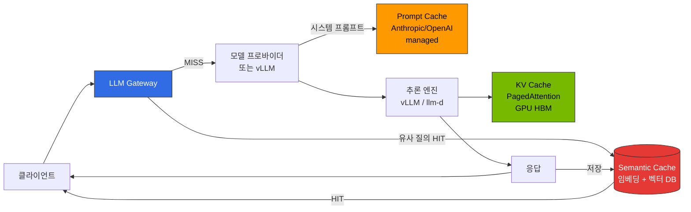
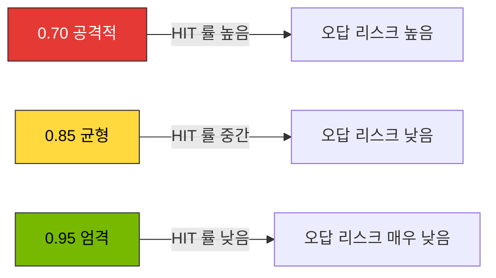
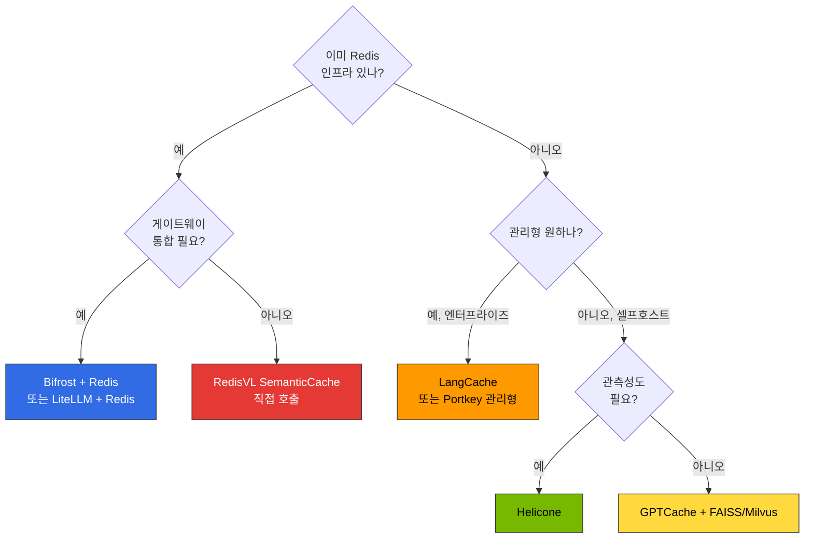

# Semantic Caching 전략

> 작성일: 2026-04-17 | 읽는 시간: 약 15분

이 문서는 LLM 추론 파이프라인에서 **게이트웨이 레벨 의미 기반 캐싱(Semantic Caching)** 의 설계 원칙, 구현 옵션, 운영 고려사항을 다룹니다. 배포 스니펫(Helm values, Redis 설정 등)은 [추론 게이트웨이 구성 가이드](../reference-architecture/inference-gateway-setup.md)와 [OpenClaw AI Gateway 배포](../reference-architecture/openclaw-ai-gateway.mdx)를 참조하세요.

## 1. 개요

### 왜 Semantic Cache가 필요한가

대규모 LLM 서비스에서 사용자 질의는 **표현만 다르고 의미가 같은** 경우가 매우 많습니다. 문자열 단위로 정확히 일치하는 전통적 캐시(HTTP cache, Redis key-value)로는 이러한 중복을 제거할 수 없습니다. Semantic Cache는 **임베딩 기반 유사도**로 의미가 유사한 요청을 탐지하여 이전 응답을 재사용함으로써 다음 3가지 문제를 동시에 개선합니다.

- **토큰 비용 감소**: 캐시 HIT 시 LLM 호출을 건너뛰어 API 비용·GPU 시간을 절약
- **지연시간 단축**: 생성 지연(수백 ms ~ 수 초) 대신 벡터 조회(수 ms)로 응답
- **GPU 용량 확보**: 자체 호스팅 vLLM/llm-d 환경에서 처리량(throughput)을 유효 확대

### 예상 절감률 (임계값별)

절감률은 **사용자 질의의 반복성**, **도메인**(FAQ/고객 지원/코드 생성), **프롬프트 구조** 에 따라 크게 달라지므로 아래 수치는 공개된 구현체 문서·벤더 블로그에서 관측되는 일반적 범위입니다. 각 조직은 **점진적 롤아웃** 과 A/B 평가로 실제 효과를 검증해야 합니다.

| 유사도 임계값 | 운영 정책 | 관측되는 절감률 범위 | 특징 |
|--------------|----------|-------------------|------|
| **0.95 (엄격)** | 거의 동일한 질의만 캐시 | 약 10-15% | 오답 위험 매우 낮음, 엄격한 품질 요구 서비스 |
| **0.85 (균형)** | 의미 동일·표현 차이 허용 | 약 30-40% | 일반 LLM 챗/어시스턴트 권장 기본값 |
| **0.70 (공격적)** | 관련 주제까지 묶음 | 약 50-60% | FAQ/정적 KB 등 반복률 매우 높은 워크로드 한정 |

출처 참고: [Redis — Building an LLM semantic cache](https://redis.io/blog/building-llm-applications-with-kernel-memory-and-redis/), [Portkey Semantic Cache 문서](https://docs.portkey.ai/docs/product/ai-gateway/cache-simple-and-semantic), [Helicone Caching 문서](https://docs.helicone.ai/features/advanced-usage/caching), [GPTCache README](https://github.com/zilliztech/GPTCache).

:::warning 절감률 수치는 반드시 검증
위 숫자는 공개 자료 기반의 **대략적 범위** 입니다. 모든 도메인에서 동일한 HIT 률이 나오지 않습니다. 대시보드(§6)로 **자사 워크로드의 실제 HIT 률·false-positive 률** 을 측정한 후 임계값을 확정하세요.
:::

---

## 2. 캐시 계층 구분

LLM 추론 파이프라인에는 **3가지 서로 다른 캐시 계층** 이 존재합니다. 각각 동작 위치·저장 단위·비용 영향이 달라서, Semantic Cache는 다른 2계층을 **대체하지 않고 보완** 합니다.

### 3계층 캐시 흐름도



### 계층별 비교 표

| 항목 | KV Cache (vLLM PagedAttention) | Prompt Cache (Anthropic/OpenAI managed) | Semantic Cache (Gateway 레벨) |
|------|-------------------------------|----------------------------------------|-------------------------------|
| **동작 위치** | 추론 엔진 내부 (GPU HBM) | 모델 프로바이더 측 | Gateway (Bifrost/LiteLLM/Portkey) 앞단 |
| **저장 단위** | 토큰 단위 KV 블록 | 명시적 `cache_control` 마커 구간 | 전체 응답 객체 (텍스트/JSON) |
| **매칭 방식** | **접두사(prefix) 완전 일치** | 프로바이더 내부 해시 기반 완전 일치 | **임베딩 코사인 유사도** |
| **주 목적** | TTFT·throughput 개선 | 반복 시스템 프롬프트 비용 절감 | **중복 LLM 호출 자체를 제거** |
| **비용 영향** | GPU 시간 절감 (자체 호스팅) | 입력 토큰 단가 할인 (관리형) | API 호출 자체를 건너뜀 |
| **실패 시 영향** | 성능 저하만 | 캐시 미적용 시 일반 단가 | **응답 품질에 직접 영향** (오답 리스크) |
| **관련 문서** | [vLLM 모델 서빙](../model-serving/vllm-model-serving.md) | 프로바이더 공식 문서 | 본 문서 |

:::tip 세 계층은 독립적으로 조합 가능
Semantic Cache HIT → 즉시 응답 (LLM 호출 생략). MISS 시 프로바이더 호출 → Prompt Cache가 시스템 프롬프트 입력 비용 절감 → 추론 엔진 내부 KV Cache가 생성 속도 개선. 세 계층은 **서로 직교(orthogonal)** 하므로 동시에 활성화하는 것이 일반적입니다.
:::

### 적용 시점 비교

- **프로토타입/단일 모델**: KV Cache(자동) + Prompt Cache(프로바이더 지원 시) 만으로 충분
- **멀티테넌트/멀티 프로바이더**: Gateway 레벨 Semantic Cache 추가 — 동일 질의가 여러 사용자에서 반복되는 패턴을 흡수
- **FAQ/챗봇/고정 KB**: Semantic Cache 임계값을 낮춰(0.80~0.85) 적극 재사용
- **코드 생성/IDE 에이전트**: Semantic Cache **보수적 적용**(0.95) 또는 비활성 — 유사 질의라도 파일 컨텍스트가 달라 재사용 위험이 큼

---

## 3. 유사도 임계값 설계

### 임계값별 트레이드오프



### 임계값 선택 기준

| 임계값 | 적합 워크로드 | 부적합 워크로드 | 비고 |
|--------|-------------|---------------|------|
| **0.95 이상** | 코드 생성, 법률·의료 어시스턴트, 금융 자문 | (광범위하게 적용 가능) | 표현 차이가 거의 없는 동일 질의만 HIT |
| **0.85-0.94 (권장)** | 일반 챗봇, 고객 지원, 문서 요약, 제품 Q&A | 코드 생성(컨텍스트 민감) | 의미 동일·표현 차이 허용. 대부분 서비스의 기본값 |
| **0.75-0.84** | FAQ, 정적 KB, 사내 문서 검색 결과 설명 | 대화형 추론, 다중 턴 | 거짓 긍정 증가 — 응답 검증 레이어 필요 |
| **0.70 이하** | 거의 사용 안 함 — 대량 FAQ 한정 | 모든 범용 서비스 | 무관한 질의끼리 묶일 위험 |

### 임계값 설정 시 고려 요소

1. **사용자 허용 오차**: 고객 지원처럼 "가장 가까운 답"으로 충분하면 낮게, 코드·계산이면 높게
2. **도메인 어휘 다양성**: 용어 동의어가 많은 도메인(의료/법률)은 임베딩이 의미를 잘 묶어 낮춰도 안전한 경향
3. **임베딩 모델 품질**: 강력한 임베딩(예: `text-embedding-3-large`, `bge-m3`)일수록 임계값을 낮춰도 안전성 유지
4. **대화 컨텍스트**: 멀티 턴 대화는 이전 턴을 해시 키에 포함해야 함(§5 참조)
5. **언어·로케일**: 다국어 서비스는 언어별 namespace를 분리하여 교차 오염 방지

:::warning 임계값은 고정값이 아니라 관측 기반 튜닝 대상
초기에는 0.90 으로 보수적으로 시작하고, Langfuse/Grafana 대시보드에서 **HIT 률, user dissatisfaction 지표(👎, regenerate 클릭 등)** 를 모니터링하며 0.05 씩 조정하는 것이 안전합니다.
:::

---

## 4. 구현 옵션 비교 (2026-04 기준)

공식 문서와 레포지토리 기준으로 정리한 주요 옵션입니다. 기능이 빠르게 변경되므로 배포 시점에 공식 문서를 다시 확인하세요.

### 비교 표

| 도구 | 라이선스 | 백엔드 | 주요 장점 | 한계 | 공식 자료 |
|------|----------|--------|---------|------|----------|
| **GPTCache** | OSS (MIT) | Redis / Milvus / FAISS / SQLite | 다양한 백엔드, 어댑터 풍부, 초기부터 Semantic Cache에 특화 | 2024 이후 릴리스 빈도 감소, LangChain/LiteLLM에 비해 커뮤니티 주도 | [GitHub](https://github.com/zilliztech/GPTCache) |
| **Redis Semantic Cache (RedisVL)** | OSS (MIT) | Redis Stack / Redis 8+ | 기존 Redis 인프라 재사용, `SemanticCache` 클래스 네이티브 제공, 벡터 검색 내장 | 임베딩 파이프라인과 TTL 정책은 애플리케이션이 직접 구성 | [RedisVL — Semantic Cache](https://redis.io/docs/latest/develop/ai/redisvl/user_guide/semantic_caching/) |
| **Portkey** | SaaS + Self-host (OSS Gateway, Apache 2.0) | 내장 스토어 / Redis | 게이트웨이 일체형 (라우팅/가드레일/캐시 통합), Virtual Keys로 멀티테넌트 | 고급 기능은 관리형 플랜 의존, 셀프호스트 구성 복잡 | [Portkey Semantic Cache](https://docs.portkey.ai/docs/product/ai-gateway/cache-simple-and-semantic) |
| **Helicone** | OSS (Apache 2.0) / SaaS | ClickHouse(관측성) + Redis/S3(캐시) | 관측성·로깅과 캐시 통합, Rust 게이트웨이로 저지연 | 셀프호스트 풀스택은 의존성 많음, 캐시 기본은 exact-match (Semantic은 고급 기능) | [Helicone Caching](https://docs.helicone.ai/features/advanced-usage/caching) |
| **Bifrost + Redis** | OSS (Apache 2.0) + OSS Redis | Redis | Go 기반 저지연, CEL Rules로 캐시 키 커스터마이징, 기존 Bifrost 배포 재사용 | Semantic Cache 자체는 프러그인/사이드카로 직접 구성 필요 | [Bifrost 문서](https://www.getmaxim.ai/bifrost/docs) |
| **LangCache (Redis Labs)** | 관리형 SaaS (Redis Enterprise) | Redis Enterprise | 완전관리형, 임베딩 모델·거버넌스 포함 (2025 하반기 GA) | Enterprise 전용, 리전 제약, 비용 | [Redis LangCache](https://redis.io/langcache/) |

### 도구 선택 결정 트리



### 시나리오별 추천

| 시나리오 | 추천 조합 | 이유 |
|----------|----------|------|
| **기존 EKS + Redis 운영** | Bifrost + Redis + RedisVL | 신규 벤더 도입 없이 기존 인프라 재사용 |
| **관리형 + 규정 준수** | Portkey 관리형 또는 LangCache | SOC2/HIPAA 등 인증, 운영 부담 최소 |
| **관측성 우선** | Helicone | 캐시·라우팅·로그를 단일 제품에서 |
| **초기 PoC / 프로토타입** | LiteLLM + Redis (`cache: true`) | 설정 1-2줄로 활성, 빠른 검증 |
| **오픈소스 강한 제약** | GPTCache + Milvus | 벤더 락인 없음, 백엔드 선택 자유 |

---

## 5. 라우팅 통합 (kgateway / LiteLLM / Bifrost)

Semantic Cache는 **게이트웨이 앞단** 에 위치하여 LLM 호출 자체를 건너뛰기 때문에, 캐시 키 설계와 namespace 분리가 응답 품질·보안·멀티테넌시에 직접적인 영향을 줍니다.

### 캐시 키 설계 원칙

가장 단순한 키는 `embedding(user_query)` 하나지만, 실제 서비스에서는 다음 요소를 **반드시** 함께 키에 포함해야 합니다.

```
cache_key = (
    model_id,                     # 모델 종류·버전 교차 오염 방지
    system_prompt_hash,           # 시스템 프롬프트가 다르면 완전히 다른 답
    tenant_id | user_id,          # 멀티테넌트/사용자별 격리
    language | locale,            # 언어 교차 오염 방지
    tool_set_hash,                # 에이전트의 사용 가능 도구 집합
    embedding(user_query)         # 의미적 유사도 매칭 대상
)
```

- `model_id`: `glm-5` 와 `qwen3-4b` 는 서로의 응답을 **절대 재사용해서는 안 됨**
- `system_prompt_hash`: 시스템 프롬프트가 "한국어로만 답변" → "영어로만 답변"으로 바뀌면 캐시 분리 필수
- `tenant_id`: SaaS에서 A사 데이터가 B사 응답에 노출되는 사고 방지
- `tool_set_hash`: 에이전트가 사용 가능한 도구 집합이 다르면 응답 전략이 달라짐

### 멀티테넌트 namespace 전략

| 계층 | namespace 예시 | 이유 |
|------|---------------|------|
| **조직 / 테넌트** | `cache:{tenantId}:*` | 데이터 격리, 감사 경계 |
| **사용자** | `cache:{tenantId}:{userId}:*` | 개인정보 포함 질의의 사용자 간 누수 방지 |
| **언어** | `cache:{tenantId}:ko:*` / `:en:*` | 다국어 서비스에서 교차 오염 방지 |
| **도메인** | `cache:{tenantId}:support:*` / `:billing:*` | 컨텍스트가 다른 도메인 간 재사용 차단 |
| **모델 버전** | `cache:{...}:glm-5:v2026-03:*` | 모델 업그레이드 시 일괄 invalidation 가능 |

### Gateway별 통합 패턴

- **LiteLLM**: `litellm_settings.cache: true` + `cache_params.type: redis` 로 간단히 활성. Semantic 모드는 `type: redis-semantic-cache` 와 임베딩 설정 필요. 구체 설정은 [LiteLLM Caching 문서](https://docs.litellm.ai/docs/proxy/caching) 참조.
- **Bifrost**: CEL Rules로 헤더(`x-cache-enabled: true`) 또는 특정 테넌트 한정 캐시 적용. 본체는 exact-match이므로 Semantic 계층은 Redis + RedisVL 사이드카로 구성.
- **Portkey**: `config` 객체에 `cache.mode: "semantic"`, `cache.max_age` 지정. Virtual Keys와 결합하여 테넌트별 캐시 정책 분리.
- **Helicone**: `Helicone-Cache-Enabled: true` 헤더와 관련 설정 헤더로 요청별 제어. 자세한 옵션은 공식 문서 참조.

### 비-결정성(non-determinism) 처리

`temperature > 0`, `top_p < 1`, 또는 도구 호출이 포함된 요청은 **매번 다른 응답**이 나오므로 단순 재사용 시 사용자 경험 저하가 발생할 수 있습니다.

- 스트리밍·에이전트형 요청은 **기본 캐시 비활성** 으로 시작하고, 확실히 재현 가능한 엔드포인트(예: `/summarize`, `/classify`)에만 선택적 허용
- `temperature=0` 요청만 캐시하는 라우팅 규칙 추천

---

## 6. 관측성 (Langfuse 연동)

Semantic Cache는 **사용자에게 직접 영향** 을 주는 레이어이므로 관측성 없이는 운영이 불가능합니다. Langfuse 또는 동급 관측 스택으로 다음을 반드시 수집하세요.

### Langfuse Trace 태그

각 요청 trace에 다음 속성을 attach 합니다 (Langfuse Python/TypeScript SDK 모두 `metadata` 또는 `tags` 로 지원).

- `cache_hit`: `true` / `false`
- `similarity_score`: `0.92` (HIT일 때, 매칭된 최고 유사도)
- `cache_source`: `redis-semantic` / `portkey` / `helicone` 등
- `cache_namespace`: `{tenant}:{lang}:{domain}` (PII 포함 금지)
- `cache_ttl_remaining_s`: 남은 TTL (디버그용)
- `cache_eviction_reason`: MISS 원인 (`below_threshold`, `namespace_miss`, `ttl_expired`)

### 대시보드 권장 패널

Langfuse의 커스텀 대시보드 또는 Prometheus + Grafana로 다음을 시각화합니다.

| 패널 | 쿼리/메트릭 | 목표값 |
|------|------------|--------|
| **HIT 률 전체** | `count(cache_hit=true) / count(*)` | 15-40% (서비스 특성별) |
| **HIT 률 (namespace별)** | group by `cache_namespace` | 테넌트 편차 모니터링 |
| **similarity_score 분포** | histogram of `similarity_score` on HIT | 임계값 근처 bin 과도 주의 |
| **False-positive 프록시** | 👎 피드백 / regenerate 클릭률 (cache_hit=true 조건) | 베이스라인 대비 상승 없을 것 |
| **절감 토큰 합계** | `sum(tokens_saved)` on HIT | 비용 리포트 |
| **캐시 스토어 크기** | Redis `DBSIZE`, 메모리 사용량 | TTL·eviction 정책 점검 |

### 알림 규칙

| 알림 | 조건 | 심각도 |
|------|------|--------|
| HIT 률 급락 | HIT 률이 이전 24h 평균의 50% 미만 | Warning — 임베딩/Redis 장애 가능 |
| HIT 률 비정상 상승 | HIT 률이 70% 초과 + false-positive 프록시 동반 상승 | Critical — 임계값 오설정 의심 |
| similarity_score 편중 | 임계값 ±0.02 내 HIT 비율 > 40% | Warning — 경계선 매칭 과다 |
| Redis latency | P99 > 20ms | Warning — 캐시가 병목 |

### Langfuse OTel 연동 참조

Bifrost/LiteLLM의 OTel 전송 설정은 기존 [LLMOps Observability](../operations-mlops/llmops-observability.md) 및 [추론 게이트웨이 구성 가이드](../reference-architecture/inference-gateway-setup.md) 문서를 따릅니다. 캐시 관련 태그는 애플리케이션/게이트웨이 플러그인 레이어에서 span attribute로 추가합니다.

---

## 7. 실전 체크리스트

### 보안 & 프라이버시

- **PII 포함 프롬프트 캐시 금지**: 이메일·주민등록번호·신용카드 등은 캐시 키·값에 저장하지 말 것. Guardrails(PII redaction) 레이어를 Semantic Cache **앞** 에 배치
- **프롬프트 인젝션 시 캐시 독성 방지**: 인젝션 탐지기에 걸린 요청은 응답과 무관하게 캐시 저장 금지
- **크로스 테넌트 누수 방지**: namespace 설계(§5)를 단위 테스트로 강제
- **감사 로그 보존**: HIT/MISS, namespace, similarity_score 를 최소 90일 보존 (사고 조사 대비)

### 운영 & 수명주기

- **TTL 설계**:
  - 정적 KB/FAQ: 7-30일
  - 제품 정보·가격처럼 변경 가능: 1-24시간
  - 시계열·주가·뉴스: 캐시 비활성 또는 수 분 이내
- **모델 버전 교체 시 invalidation**: 모델 키에 버전 포함(`glm-5:v2026-03`) → 새 버전 배포 시 이전 namespace 자연 만료 또는 수동 FLUSH
- **임베딩 모델 교체 시 전체 무효화**: 임베딩 공간이 바뀌면 기존 벡터 거리 의미가 달라지므로 반드시 전량 재구축
- **점진적 롤아웃**: 신규 임계값/정책은 특정 테넌트·트래픽 비율에서만 먼저 활성화 (A/B)
- **장애 시 fallback**: Redis 장애 시 자동으로 캐시를 끄고 원본 호출로 fail-open. 단, 트래픽 급증 대비 원본 쪽 rate limit 사전 확보
- **용량 관리**: Redis `maxmemory-policy allkeys-lru` 권장. 모니터링 후 정책 조정

### 품질 가드레일

- **응답 길이 제한**: 비정상적으로 큰 응답은 캐시 금지(저장 비용·전송 지연)
- **도구 호출 응답**: 외부 API 결과가 포함된 응답은 재사용 금지(또는 매우 짧은 TTL)
- **사용자 피드백 연동**: 👎 / regenerate 시 해당 cache entry 자동 eviction
- **주기적 품질 평가**: 캐시 HIT 샘플을 LLM-as-judge 또는 Ragas로 주간 평가 ([Ragas 평가](../operations-mlops/ragas-evaluation.md) 참조)

### 배포 전 점검

- [ ] 캐시 키에 `model_id`, `system_prompt_hash`, `tenant_id`, `language` 포함 확인
- [ ] Guardrails(PII redaction) 가 캐시보다 앞단에 배치되었는지 확인
- [ ] TTL / 모델 버전 invalidation 정책 문서화
- [ ] Langfuse 트레이스에 `cache_hit`, `similarity_score` 기록 확인
- [ ] HIT 률 / false-positive 대시보드 구성 완료
- [ ] Redis (또는 벡터 DB) 장애 시 fail-open 시나리오 검증
- [ ] 샘플링 기반 품질 평가(Ragas 또는 LLM-judge) 주기 설정

---

## 8. 도메인별 적용 패턴

동일한 Semantic Cache 엔진이라도 도메인에 따라 **키 구성·임계값·TTL·비활성 조건** 이 크게 다릅니다. 대표적인 4가지 패턴을 정리합니다.

### 패턴 A: FAQ · 제품 Q&A 챗봇

- **특성**: 질의가 반복적, 정답이 상대적으로 고정
- **키 구성**: `(tenant_id, language, product_version, embedding(query))`
- **임계값**: 0.80-0.85 — 표현 다양성 허용
- **TTL**: 24-72시간 (제품 업데이트 주기에 맞춤)
- **주의**: 제품 버전이 올라가면 `product_version` 키 변경으로 자연 무효화

### 패턴 B: 사내 KB · 문서 검색 어시스턴트

- **특성**: 사용자별 권한에 따라 접근 가능한 문서가 다름
- **키 구성**: `(tenant_id, role_or_acl_hash, language, embedding(query))`
- **임계값**: 0.85-0.90 — 권한별 격리가 우선
- **TTL**: 1-7일 (문서 업데이트 주기)
- **주의**: ACL이 바뀐 사용자는 캐시 key를 완전히 새로 생성해야 하므로 `role_hash` 업데이트 시 해당 namespace flush

### 패턴 C: 고객 지원 티켓 분류·초안 답변

- **특성**: 유사 고객 문의가 반복적, 감정·긴급도 포함
- **키 구성**: `(tenant_id, intent_class, language, embedding(query))`
- **임계값**: 0.85 — 의미 동일 재사용
- **TTL**: 6-24시간
- **주의**: PII(고객명, 주문번호)는 Guardrails에서 redact 후 임베딩 생성

### 패턴 D: 코드 생성 · IDE 에이전트

- **특성**: 동일 질의라도 현재 열린 파일·프로젝트 컨텍스트가 다르면 답이 달라져야 함
- **권장**: **기본 비활성** 또는 임계값 0.97 이상으로만 허용
- **허용 시 키 구성**: `(repo_hash, open_file_hash, embedding(query))`
- **TTL**: 짧게 (30분-2시간)
- **주의**: 리팩터링·디버깅 질의는 컨텍스트 의존성이 커서 HIT 시 품질 저하 위험 — 비활성이 안전

### 패턴 비교 요약

| 패턴 | 임계값 | TTL | 사용자별 격리 | 기본 캐시 상태 |
|------|--------|-----|--------------|-------------|
| FAQ / 제품 Q&A | 0.80-0.85 | 24-72h | 테넌트만 | **활성** |
| 사내 KB | 0.85-0.90 | 1-7d | ACL 기반 | 활성 |
| 고객 지원 초안 | 0.85 | 6-24h | 테넌트 + 언어 | 활성 |
| 코드 생성 | 0.97+ | 30m-2h | 리포·파일별 | **비활성 권장** |

---

## 9. FAQ

**Q1. Semantic Cache와 RAG(검색 증강 생성)는 어떻게 다른가요?**
A. RAG는 **새 응답을 생성하기 위한 컨텍스트** 를 벡터 DB에서 가져오는 것이고, Semantic Cache는 **기존 완성 응답을 재사용** 하는 것입니다. 둘 다 벡터 검색을 쓰지만 목적과 위치가 다릅니다. RAG는 LLM 호출 **전에 입력을 보강**, Semantic Cache는 **LLM 호출 자체를 회피**.

**Q2. 스트리밍 응답도 캐시할 수 있나요?**
A. 가능하지만, 저장 시 완전한 응답으로 재조립한 뒤 저장하고 HIT 시에도 스트리밍을 "재현"해야 사용자 경험이 유지됩니다. Portkey/LiteLLM 일부는 자동 처리하지만, 셀프호스트 구현에서는 복잡도가 높으니 초기엔 비스트리밍 엔드포인트부터 적용을 권장합니다.

**Q3. 임베딩 모델은 어떻게 선택하나요?**
A. 다국어 서비스면 `bge-m3`, `text-embedding-3-large`, `multilingual-e5-large` 등 다국어 특화 임베딩을 권장합니다. 영어 전용이면 더 경량인 `text-embedding-3-small`, `gte-small` 로 충분합니다. 임베딩 모델을 바꾸면 **전체 캐시 무효화** 가 필요하다는 점을 반드시 기억하세요.

**Q4. `temperature > 0` 요청을 캐시하면 왜 위험한가요?**
A. 비결정성(non-determinism) 때문입니다. 사용자가 의도적으로 매번 다른 답을 원해서 `temperature`를 높인 것인데 같은 답이 돌아오면 기대와 어긋납니다. 창의적 답변·브레인스토밍 엔드포인트는 캐시 비활성이 기본입니다.

**Q5. 캐시 HIT 률이 너무 낮으면 어떻게 하나요?**
A. 먼저 (1) namespace가 과도하게 세분화됐는지 (특히 `user_id` 까지 분리했는지) 점검하고, (2) 임계값을 0.05 낮춰보고, (3) 임베딩 모델 품질을 평가합니다. FAQ/정적 KB 워크로드가 아니라면 10-15% HIT 률도 정상 범위입니다.

**Q6. 분산 환경에서 일관성 문제가 있나요?**
A. Redis 단일 클러스터 또는 Redis Enterprise/ElastiCache를 쓰면 강한 일관성이 보장됩니다. 벡터 검색 인덱스 업데이트에는 짧은 지연(수십 ms)이 있을 수 있으므로, HIT 판단이 "최신 write 직후 readable" 가정에 의존하지 않도록 설계하세요. 대부분 이 지연은 사용자 체감에 영향 없습니다.

**Q7. 캐시된 응답의 법적/규정 준수 이슈는 없나요?**
A. 의료·금융·법률 도메인에서는 **캐시 HIT 도 기록 의무** 가 있을 수 있습니다 (응답 제공 이력). 감사 로그에 `cache_hit=true, source=<cache_key>` 를 반드시 남기고, 보존 기간은 해당 규제(HIPAA/금융감독원 등)에 맞춰 설정하세요.

---

## 10. 참고 자료

### 공식 문서 & 레포지토리

- [Redis — Semantic Caching (RedisVL)](https://redis.io/docs/latest/develop/ai/redisvl/user_guide/semantic_caching/)
- [Redis LangCache (관리형)](https://redis.io/langcache/)
- [Portkey — Semantic Cache](https://docs.portkey.ai/docs/product/ai-gateway/cache-simple-and-semantic)
- [Helicone — Caching](https://docs.helicone.ai/features/advanced-usage/caching)
- [LiteLLM — Caching](https://docs.litellm.ai/docs/proxy/caching)
- [Bifrost 공식 문서](https://www.getmaxim.ai/bifrost/docs)
- [GPTCache (Zilliz)](https://github.com/zilliztech/GPTCache)

### 관련 문서

- [추론 게이트웨이 & LLM Gateway 라우팅 전략](../reference-architecture/inference-gateway-routing.md)
- [추론 게이트웨이 구성 가이드](../reference-architecture/inference-gateway-setup.md)
- [OpenClaw AI Gateway 배포](../reference-architecture/openclaw-ai-gateway.mdx)
- [LLMOps Observability](../operations-mlops/llmops-observability.md)
- [Milvus 벡터 데이터베이스](../operations-mlops/milvus-vector-database.md)
- [Ragas 평가](../operations-mlops/ragas-evaluation.md)

### 연구 & 배경

- [Anthropic — Prompt Caching](https://docs.anthropic.com/en/docs/build-with-claude/prompt-caching)
- [OpenAI — Prompt Caching](https://platform.openai.com/docs/guides/prompt-caching)
- [vLLM — PagedAttention (KV Cache)](https://docs.vllm.ai/en/latest/design/paged_attention.html)
