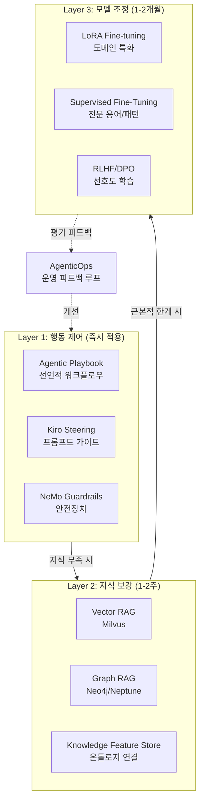
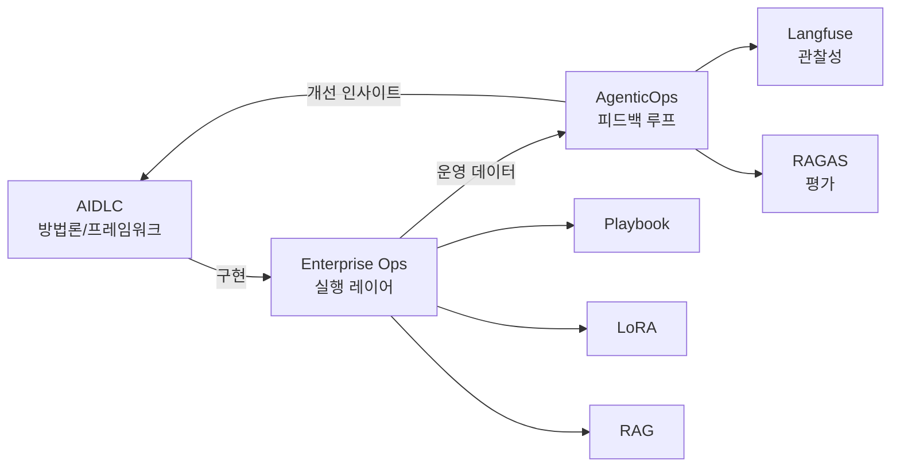

# Enterprise Ops

엔터프라이즈 환경에서 Agentic AI를 안전하고 효과적으로 운영하기 위한 실전 가이드입니다.

## 왜 Enterprise Ops가 필요한가

대기업과 금융(FSI) 산업의 AI 도입은 단순히 모델을 배포하는 것을 넘어 다음과 같은 과제를 해결해야 합니다:

- **컴플라이언스**: 금융규제, 개인정보보호법, 산업별 준수사항
- **거버넌스**: 승인 프로세스, 감사 추적, 책임 소재 명확화
- **도메인 특화**: 기업 내부 용어, 레거시 시스템 연동, 업무 프로세스 이해
- **재현성**: 프롬프트 엔지니어링에서 선언적 워크플로우로 전환
- **비용 관리**: ROI 검증, 단계별 투자 전략

:::info
Enterprise Ops는 **AIDLC(AI Development Lifecycle)**의 구현 레이어이며, **AgenticOps**의 운영 피드백을 실제 워크플로우에 적용하는 실무 프레임워크입니다.
:::

## 3-Layer 접근 전략

엔터프라이즈 AI 운영은 즉시 적용 가능한 것부터 장기 투자가 필요한 것까지 3개 레이어로 구성됩니다:



### Layer 1: 행동 제어 (프롬프트 수준)

**특징**: 즉시 적용, 가역적, 낮은 비용

- **Agentic Playbook**: IaC처럼 워크플로우를 선언적으로 정의
- **Kiro Steering**: 단일 에이전트 행동 가이드
- **Guardrails**: 금지 패턴, PII 차단, 컴플라이언스 자동 체크

:::tip 적용 시나리오
- 코딩 컨벤션 강제
- 보안 정책 준수 (Secrets 탐지, OWASP 체크)
- 승인 게이트 (특정 액션 수행 전 인간 승인)
:::

### Layer 2: 지식 보강 (외부 지식 제공)

**특징**: 1-2주 구축, RAG 파이프라인, 모델 재학습 불필요

- **Vector RAG**: 문서/API 명세를 임베딩하여 실시간 검색
- **Graph RAG**: 엔티티 관계를 그래프로 구조화하여 추론
- **Knowledge Feature Store**: 온톨로지와 연결하여 도메인 지식 제공

:::tip 적용 시나리오
- 내부 API 사용법 학습 (OpenAPI Spec → RAG)
- 레거시 시스템 매뉴얼 참조
- 규제 문서 자동 인용
:::

### Layer 3: 모델 조정 (가중치 변경)

**특징**: 2-4주 이상, GPU 자원 필요, ROI 검증 필수

- **LoRA Fine-tuning**: 파라미터 효율적 학습 (수백MB 체크포인트)
- **Supervised Fine-Tuning**: 전문 용어, 업무 패턴 학습
- **RLHF/DPO**: 선호도 기반 행동 조정

:::caution ROI 검증 필수
Layer 3는 비용과 시간이 많이 들기 때문에 Layer 1, 2로 해결할 수 없는 경우에만 투자하세요:
- 기존 모델이 도메인 용어를 전혀 이해하지 못함
- RAG로 제공해도 추론 능력이 부족
- 명시적 패턴을 반복적으로 학습해야 함
:::

## 시나리오별 레이어 매트릭스

| 시나리오 | Layer 1 | Layer 2 | Layer 3 | 비고 |
|---------|---------|---------|---------|------|
| **코딩 컨벤션 강제** | ✅ 필수 | ⚪ 불필요 | ⚪ 불필요 | Playbook만으로 충분 |
| **내부 API 사용** | ✅ 권장 | ✅ 필수 | ⚪ 불필요 | API Spec을 RAG로 제공 |
| **도메인 전문 용어** | ✅ 권장 | ✅ 권장 | ✅ 핵심 | 금융/의료 등 전문 분야 |
| **SOC2 절차 준수** | ✅ 필수 | ✅ 권장 | ⚪ 불필요 | Playbook + 감사 로그 |
| **레거시 전환 패턴** | ✅ 권장 | ✅ 필수 | ✅ 핵심 | COBOL→Java 등 |
| **고객 응대 톤앤매너** | ✅ 권장 | ⚪ 불필요 | ✅ 권장 | 브랜드 정체성 학습 |
| **보안 취약점 탐지** | ✅ 필수 | ✅ 권장 | ⚪ 불필요 | Guardrails + OWASP RAG |

## Phase별 도입 로드맵

| Phase | 기간 | 주요 활동 | 산출물 |
|-------|------|----------|--------|
| **Phase 0: 즉시** | 1일 | Kiro Steering 작성, 기본 Guardrails 설정 | `steering.yaml`, `guardrails.py` |
| **Phase 1: 1-2주** | 1-2주 | Playbook 정의, Vector RAG 구축 | `playbook.yaml`, Milvus 컬렉션 |
| **Phase 2: 2-4주** | 2-4주 | Graph RAG 연결, Langfuse 감사 로그 통합 | Neo4j 스키마, 대시보드 |
| **Phase 3: 1-2개월** | 1-2개월 | LoRA 학습 데이터셋 구축, Fine-tuning 파이프라인 | LoRA 체크포인트, 평가 메트릭 |
| **Phase 4: 지속** | 상시 | AgenticOps 피드백 루프, 모델 재학습 자동화 | MLOps 파이프라인 |

:::tip 단계별 투자 전략
1. **Quick Win (Phase 0-1)**: Playbook + RAG로 80% 효과
2. **Validation (Phase 2)**: 실제 업무에 적용하며 ROI 측정
3. **Scale (Phase 3-4)**: 검증된 유즈케이스에만 Fine-tuning 투자
:::

## AIDLC / AgenticOps와의 관계



- **AIDLC**: "무엇을 해야 하는가" (거버넌스, 컴플라이언스, 테스트 전략)
- **Enterprise Ops**: "어떻게 구현하는가" (Playbook, RAG, LoRA)
- **AgenticOps**: "어떻게 개선하는가" (메트릭 수집, 피드백, 재학습)

## 하위 문서

import DocCardList from '@theme/DocCardList';

<DocCardList />

## 현재 운영 엔드포인트

LG U+ Agentic AI Platform의 실제 서비스 엔드포인트 구조:

```bash
# 모델 추론 API (OpenAI 호환)
http://<NLB_ENDPOINT>/v1/chat/completions
http://<NLB_ENDPOINT>/v1/embeddings

# LLM Observability (Langfuse)
http://<NLB_ENDPOINT>/langfuse/

# GPU/인프라 모니터링 (Amazon Managed Grafana)
https://<AMG_ENDPOINT>/d/gpu-dashboard
```

:::info 엔드포인트 비식별화
실제 운영 환경의 엔드포인트는 보안을 위해 비식별 처리되었습니다. 내부 문서를 참조하세요.
:::

## 참고 자료

- [AIDLC 개요](/docs/aidlc/)
- [AgenticOps 피드백 루프](/docs/operations-observability/agentic-ops/)
- [Kiro Steering Spec](https://github.com/devfloor9/kiro/tree/main/src/kiro/steering)
- [NeMo Guardrails 공식 문서](https://docs.nvidia.com/nemo/guardrails/)
- [LangGraph 워크플로우](https://langchain-ai.github.io/langgraph/)
