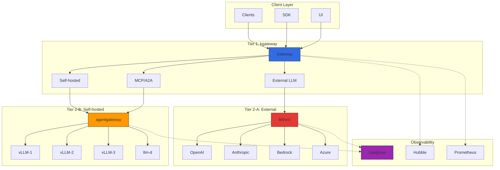
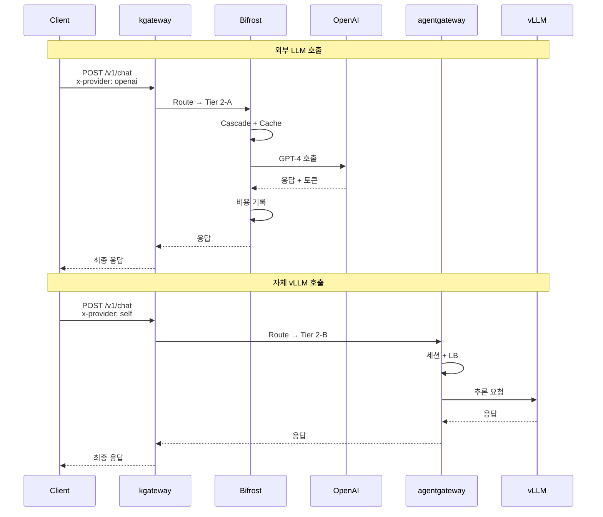
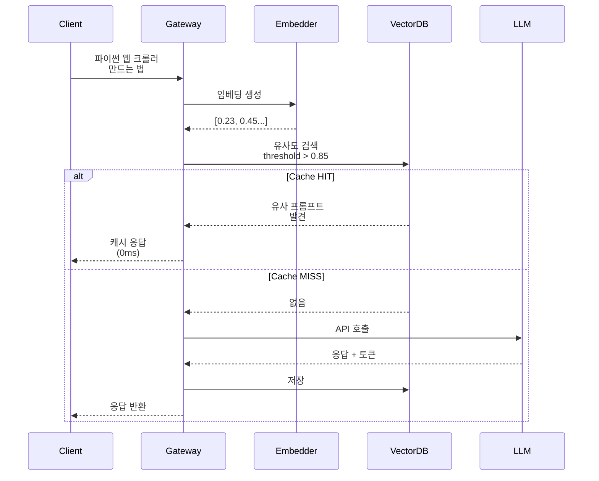
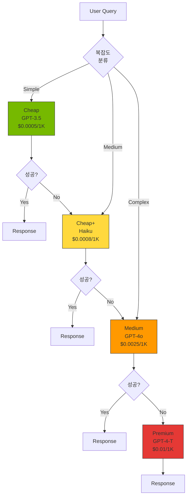
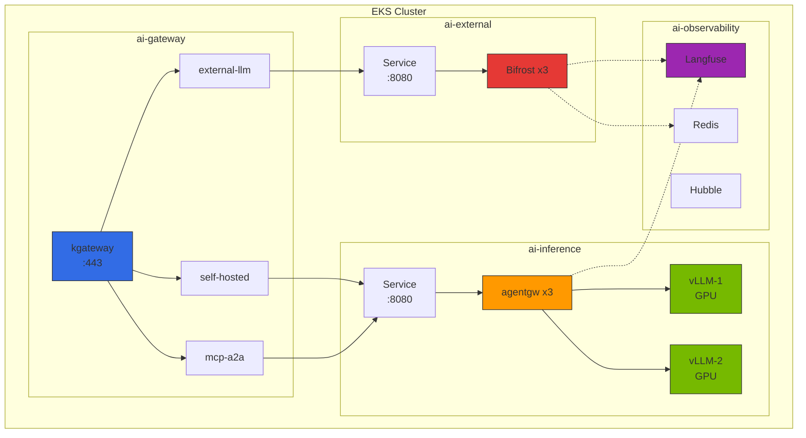

# LLM Gateway 2-Tier 아키텍처

> 작성일: 2026-03-16 | 수정일: 2026-03-18 | 읽는 시간: 약 20분

## 개요

LLM 서빙 환경에서는 인프라 레벨의 트래픽 관리와 LLM 프로바이더 추상화라는 두 가지 서로 다른 관심사를 분리해야 합니다. 단일 Gateway로 모든 기능을 처리하려 하면 복잡성이 급증하고 각 레이어의 특화된 기능을 최적화하기 어렵습니다.

### 단일 Gateway의 한계

| 관심사 | 요구사항 | 단일 Gateway 문제점 |
|--------|----------|-------------------|
| **인프라 트래픽 관리** | Kubernetes 네이티브 라우팅, mTLS, 서킷 브레이커, 네트워크 정책 | LLM 특화 로직과 혼재되어 복잡도 증가 |
| **LLM 프로바이더 추상화** | 100+ 프로바이더 통합, 토큰 카운팅, 시맨틱 캐싱, 비용 추적 | Envoy/Gateway API 확장으로 구현 시 비표준 의존성 발생 |
| **AI 프로토콜** | MCP(Model Context Protocol), A2A(Agent-to-Agent), JSON-RPC 세션 | 범용 Gateway는 stateful 세션 지원 미비 |

### 2-Tier 접근의 장점

**Tier 1 (인프라 Gateway)**: Kubernetes Gateway API 표준 구현체(kgateway)로 트래픽 제어, 라우팅, 보안, 네트워크 정책을 처리합니다. Envoy 기반의 성능과 Kubernetes 생태계 네이티브 통합을 제공합니다.

**Tier 2 (LLM Gateway)**: LLM 프로바이더 추상화에 특화된 경량 게이트웨이로 100+ 프로바이더 통합, 비용 추적, 시맨틱 캐싱, cascade routing을 담당합니다. Bifrost(고성능 Go/Rust 기반)를 기본으로 하며, Python 생태계에서는 LiteLLM을 대안으로 사용할 수 있습니다.

이 분리를 통해:

- 각 티어는 자신의 관심사에만 집중하여 최적화
- Tier 1은 Kubernetes 표준을 따라 이식성 확보
- Tier 2는 빠르게 진화하는 LLM 생태계에 민첩하게 대응
- 운영팀은 인프라와 AI 워크로드를 독립적으로 관리 가능

### 주요 목표

- **트래픽 제어**: Kubernetes Gateway API 표준 기반 라우팅
- **프로바이더 추상화**: OpenAI/Anthropic/Bedrock/Azure/GCP 통합 API
- **비용 최적화**: Cascade routing, semantic caching, budget control
- **AI 프로토콜 지원**: MCP/A2A 네이티브 라우팅

---

## 2-Tier Gateway 아키텍처

### 전체 구조 다이어그램



### Tier별 역할 분리

| Tier | 컴포넌트 | 책임 | 프로토콜 |
|------|----------|------|----------|
| **Tier 1** | kgateway (Envoy 기반) | 트래픽 라우팅, mTLS, rate limiting, 네트워크 정책, LoadBalancing | HTTP/HTTPS, gRPC |
| **Tier 2-A** | Bifrost (또는 LiteLLM) | 외부 LLM 프로바이더 통합, 비용 추적, cascade routing, semantic caching | OpenAI-compatible API |
| **Tier 2-B** | kgateway + agentgateway | 자체 추론 인프라 라우팅, MCP/A2A 세션, Tool Poisoning 방지 | HTTP, JSON-RPC, MCP, A2A |

### 트래픽 플로우



---

## agentgateway 데이터 플레인

### 개요

**agentgateway**는 kgateway의 AI 워크로드 전용 데이터 플레인입니다. 기존 Envoy 데이터 플레인은 stateless HTTP/gRPC 트래픽에 최적화되어 있지만, AI 에이전트는 stateful JSON-RPC 세션, MCP 프로토콜, Tool Poisoning 방지 등 특수한 요구사항을 가지고 있습니다.

### Envoy 데이터 플레인과의 차이점

| 항목 | Envoy 데이터 플레인 | agentgateway 데이터 플레인 |
|------|---------------------|---------------------------|
| **세션 관리** | Stateless, HTTP 쿠키 기반 | Stateful JSON-RPC 세션, 인메모리 세션 스토어 |
| **프로토콜** | HTTP/1.1, HTTP/2, gRPC | MCP (Model Context Protocol), A2A (Agent-to-Agent), JSON-RPC |
| **보안** | mTLS, RBAC | Tool Poisoning 방지, per-session Authorization |
| **라우팅** | 경로/헤더 기반 | 세션 ID 기반, 도구 호출 검증 |
| **관측성** | HTTP 메트릭, Access Log | LLM 토큰 추적, 도구 호출 체인, 비용 |

### 핵심 기능

#### 1. Stateful JSON-RPC 세션 관리

MCP 프로토콜은 클라이언트와 서버 간 long-lived JSON-RPC 세션을 요구합니다. agentgateway는 세션 ID를 추적하고 동일 세션의 요청을 같은 백엔드로 라우팅합니다.

```yaml
# 세션 기반 라우팅 설정
apiVersion: kgateway.dev/v1alpha1
kind: SessionPolicy
metadata:
  name: mcp-session-policy
spec:
  sessionIdHeader: "X-MCP-Session-ID"
  sessionTimeout: 30m
  stickySession: true
```

#### 2. MCP/A2A 프로토콜 네이티브 지원

```yaml
# MCP 프로토콜 라우팅
apiVersion: gateway.networking.k8s.io/v1
kind: HTTPRoute
metadata:
  name: mcp-route
spec:
  parentRefs:
    - name: ai-inference-gateway
      sectionName: https
  rules:
    - matches:
        - path:
            type: PathPrefix
            value: /mcp/v1
      backendRefs:
        - name: agentgateway-service
          port: 8080
      filters:
        - type: ExtensionRef
          extensionRef:
            group: kgateway.dev
            kind: MCPFilter
            name: mcp-session-handler
```

#### 3. Tool Poisoning 방지

악의적인 클라이언트가 도구 호출을 조작하여 권한 밖의 작업을 수행하는 것을 방지합니다.

```yaml
apiVersion: kgateway.dev/v1alpha1
kind: ToolPolicy
metadata:
  name: tool-validation-policy
spec:
  allowedTools:
    - name: "search_documents"
      allowedScopes: ["read:documents"]
    - name: "send_email"
      allowedScopes: ["write:email"]
  denyList:
    - "exec_shell"
    - "read_credentials"
```

#### 4. Per-session Authorization

```yaml
apiVersion: kgateway.dev/v1alpha1
kind: SessionAuthPolicy
metadata:
  name: session-auth
spec:
  authType: JWT
  jwtValidation:
    issuer: "https://auth.example.com"
    audience: "ai-agents"
  sessionBinding:
    enabled: true
    refreshInterval: 5m
```

### EKS 배포 예시

```yaml
apiVersion: apps/v1
kind: Deployment
metadata:
  name: agentgateway
  namespace: ai-gateway
spec:
  replicas: 3
  selector:
    matchLabels:
      app: agentgateway
  template:
    metadata:
      labels:
        app: agentgateway
    spec:
      serviceAccountName: agentgateway-sa
      containers:
        - name: agentgateway
          image: kgateway/agentgateway:v1.0.0
          ports:
            - containerPort: 8080
              name: http
            - containerPort: 9090
              name: metrics
          env:
            - name: SESSION_STORE_TYPE
              value: "redis"
            - name: REDIS_URL
              value: "redis://redis-master:6379"
            - name: MCP_ENABLED
              value: "true"
            - name: TOOL_VALIDATION_ENABLED
              value: "true"
          resources:
            requests:
              cpu: 500m
              memory: 512Mi
            limits:
              cpu: 1000m
              memory: 1Gi
          livenessProbe:
            httpGet:
              path: /healthz
              port: 8080
            initialDelaySeconds: 10
            periodSeconds: 10
          readinessProbe:
            httpGet:
              path: /ready
              port: 8080
            initialDelaySeconds: 5
            periodSeconds: 5
---
apiVersion: v1
kind: Service
metadata:
  name: agentgateway-service
  namespace: ai-gateway
spec:
  selector:
    app: agentgateway
  ports:
    - name: http
      port: 8080
      targetPort: 8080
    - name: metrics
      port: 9090
      targetPort: 9090
  type: ClusterIP
```

---

## LLM Gateway 솔루션 비교 (2026)

### 주요 솔루션 비교 표

| 솔루션 | 언어 | 주요 특징 | 프로바이더 수 | 라이선스 | 적합 환경 |
|--------|------|-----------|---------------|----------|-----------|
| **Bifrost** | Go/Rust | 50x faster than Python, 통합 API, cascade routing | 20+ | Apache 2.0 | 고성능, 저비용, 셀프호스트 중심 |
| **LiteLLM** | Python | 100+ 프로바이더, 광범위 생태계, Langfuse/Langsmith 네이티브 | 100+ | MIT | Python 생태계, 빠른 프로토타이핑, 다양한 프로바이더 |
| **Portkey** | TypeScript | 엔터프라이즈급, semantic caching, SOC2 인증, Virtual Keys | 250+ | Proprietary + OSS (Gateway만) | 엔터프라이즈, 규정 준수, 고급 캐싱 |
| **Kong AI Gateway** | Lua/C | 플러그인 생태계, MCP support, 기존 Kong 인프라 활용 | 10+ (플러그인 확장 가능) | Apache 2.0 / Enterprise | 기존 Kong 사용자, API 관리 통합 |
| **Cloudflare AI Gateway** | Edge Workers | 글로벌 CDN, edge caching, DDoS 방어, 즉시 시작 | 10+ | Proprietary (Free tier 있음) | 글로벌 배포, edge 레이턴시, DDoS 방어 |
| **Helicone** | Rust | Gateway + Observability 통합, 고성능, 실시간 로깅 | 50+ | Apache 2.0 | 고성능 + 관측성 동시 필요 |
| **OpenRouter** | TypeScript | 호스티드, 즉시 시작, 200+ 모델, API 키 하나로 통합 | 200+ | Proprietary (호스티드) | 빠른 시작, 프로토타이핑, 벤더 잠금 허용 |

### 상세 비교

#### Bifrost

**장점:**
- Go/Rust 구현으로 Python 대비 50배 빠른 throughput
- 메모리 효율: Python LiteLLM 대비 1/10 메모리 사용
- Cascade routing 네이티브 지원: cheap → premium 자동 라우팅
- Kubernetes 네이티브 배포 (Helm Chart)
- Unified API: OpenAI 호환 인터페이스로 모든 프로바이더 통합

**단점:**
- 프로바이더 수는 LiteLLM보다 적음 (20+ vs 100+)
- Python 생태계 통합은 LiteLLM이 더 풍부
- 문서화는 LiteLLM이 더 성숙

**적합 시나리오:**
- 고성능, 저비용이 핵심 요구사항
- 셀프호스트 중심 환경
- Kubernetes 네이티브 배포

#### LiteLLM (Python 생태계 대안)

**장점:**
- 100+ 프로바이더 지원: OpenAI, Anthropic, Bedrock, Azure, GCP, Cohere, Hugging Face 등
- Langfuse/LangSmith 원클릭 통합: `success_callback: ["langfuse"]`
- 광범위한 문서화 및 커뮤니티
- Python 생태계 네이티브: LangChain, LlamaIndex 직접 통합
- Virtual Keys, Budget Control, Rate Limiting 내장

**단점:**
- Python 기반으로 Bifrost 대비 낮은 throughput (50배 차이)
- 메모리 사용량 높음 (특히 대규모 concurrent 요청 시)

**적합 시나리오:**
- Python 생태계 (LangChain, LlamaIndex) 중심 환경
- 100+ 프로바이더 중 다양한 선택지 필요
- 빠른 프로토타이핑

#### Portkey

**장점:**
- 엔터프라이즈급 기능: SOC2 Type 2, HIPAA, GDPR 준수
- Semantic Caching: 임베딩 기반 유사 프롬프트 캐싱 (최대 40% 비용 절감)
- Virtual Keys: 팀별/프로젝트별 API 키 관리
- 250+ 프로바이더 지원
- Fallback, Retry, Load Balancing 고급 설정

**단점:**
- 엔터프라이즈 기능은 유료 (OSS 버전은 Gateway만)
- 호스티드 서비스 의존 (self-hosted 옵션은 Enterprise 플랜)

**적합 시나리오:**
- 엔터프라이즈 규정 준수 필요
- Semantic Caching으로 비용 절감 필수
- 호스티드 서비스 허용

#### Kong AI Gateway

**장점:**
- 기존 Kong API Gateway 플러그인으로 통합
- MCP (Model Context Protocol) 네이티브 지원
- 광범위한 플러그인 생태계 (Auth, Rate Limiting, Caching)
- 성숙한 엔터프라이즈 지원

**단점:**
- Kong 인프라가 없으면 도입 비용 높음
- LLM 특화 기능은 Bifrost/LiteLLM보다 적음
- Enterprise 기능은 유료

**적합 시나리오:**
- 기존 Kong 사용자
- API 관리와 LLM Gateway 통합 필요

#### Cloudflare AI Gateway

**장점:**
- 글로벌 CDN: 200+ 도시, 레이턴시 최소화
- Edge Caching: 응답 캐싱 (동일 프롬프트)
- DDoS 방어: Cloudflare 네트워크 레벨 방어
- 즉시 시작: 코드 수정 없이 URL만 변경

**단점:**
- Semantic Caching 미지원 (동일 프롬프트만 캐싱)
- 프로바이더 수 제한적 (10+)
- 호스티드 서비스 의존

**적합 시나리오:**
- 글로벌 배포, edge 레이턴시 중요
- DDoS 방어 필요
- Cloudflare 인프라 사용 중

#### Helicone

**장점:**
- Rust 구현: 고성능, 낮은 레이턴시
- Gateway + Observability 통합: 별도 Langfuse 불필요
- 실시간 로깅 및 분석
- 50+ 프로바이더 지원
- Self-hosted 또는 Cloud 선택 가능

**단점:**
- 생태계는 LiteLLM보다 작음
- Observability 기능은 Langfuse보다 제한적

**적합 시나리오:**
- 고성능 + 관측성 동시 필요
- Rust 기반 인프라 선호
- All-in-one 솔루션 선호

#### OpenRouter

**장점:**
- 호스티드 서비스: 인프라 관리 불필요
- 200+ 모델: GPT-4, Claude, Gemini, Llama, Mistral 등
- API 키 하나로 모든 모델 접근
- 즉시 시작: 가입 후 바로 사용

**단점:**
- 호스티드 서비스 의존 (self-hosted 불가)
- 커스터마이징 제한
- 벤더 잠금 위험

**적합 시나리오:**
- 빠른 시작, 프로토타이핑
- 인프라 관리 회피
- 벤더 잠금 허용

---

## Semantic Caching 전략

### 개요

Semantic Caching은 동일한 프롬프트가 아닌 **의미적으로 유사한 프롬프트**를 감지하여 이전 응답을 재사용함으로써 LLM API 비용을 절감합니다. 전통적인 exact match 캐싱은 문자열이 정확히 일치해야 하지만, semantic caching은 임베딩 기반 유사도 매칭을 사용합니다.

### 작동 원리



### 유사도 임계값 (Similarity Threshold)

| Threshold | 의미 | 캐시 적중률 | 정확도 |
|-----------|------|-------------|--------|
| **0.95+** | 거의 동일한 문장 | 낮음 (~10%) | 매우 높음 |
| **0.85-0.94** | 의미가 같고 표현이 약간 다름 | 중간 (~30%) | 높음 (권장) |
| **0.75-0.84** | 유사한 주제 | 높음 (~50%) | 중간 (거짓 긍정 위험) |
| **0.70 이하** | 관련 있는 주제 | 매우 높음 | 낮음 (부적절한 응답 위험) |

권장 설정: **0.85** (의미는 같고 표현만 다른 경우 캐시 재사용)

### 비용 절감 효과

**시나리오**: 일 10,000 요청, 캐시 적중률 30%, GPT-4 Turbo

| 항목 | 캐시 없음 | Semantic Cache 적용 |
|------|-----------|---------------------|
| 실제 LLM 호출 | 10,000 | 7,000 (30% 절감) |
| 토큰 (평균 500 out/req) | 5M tokens | 3.5M tokens |
| 비용 ($0.03/1K out tokens) | $150/일 | $105/일 |
| **월 비용** | **$4,500** | **$3,150 (30% 절감)** |

추가 비용:
- 임베딩 모델 (`text-embedding-3-small`): ~$0.5/월
- Redis/Milvus: ~$10-20/월

**순 절감: ~$1,300/월 (29%)**

### Portkey의 Semantic Cache 구현

```yaml
# Portkey Config
config:
  cache:
    mode: semantic
    embeddingModel: text-embedding-3-small
    similarityThreshold: 0.85
    ttl: 86400  # 24시간
    maxCacheSize: 10000
```

### Helicone의 Semantic Cache 구현

```typescript
// Helicone Client
import { HeliconeAPIClient } from "@helicone/helicone";

const helicone = new HeliconeAPIClient({
  apiKey: process.env.HELICONE_API_KEY,
  cache: {
    enabled: true,
    semanticCache: {
      threshold: 0.85,
      embeddingProvider: "openai",
      embeddingModel: "text-embedding-3-small"
    }
  }
});
```

### Redis + Embedding 기반 자체 구현

```python
# Python 구현 예시
import openai
import redis
import numpy as np
from sklearn.metrics.pairwise import cosine_similarity

redis_client = redis.Redis(host='localhost', port=6379, db=0)

def get_embedding(text: str) -> list[float]:
    response = openai.embeddings.create(
        model="text-embedding-3-small",
        input=text
    )
    return response.data[0].embedding

def semantic_cache_lookup(prompt: str, threshold: float = 0.85) -> str | None:
    # 1. 프롬프트 임베딩 생성
    prompt_embedding = np.array(get_embedding(prompt))

    # 2. Redis에서 모든 캐시된 임베딩 조회
    cached_keys = redis_client.keys("cache:*")

    for key in cached_keys:
        cached_data = redis_client.hgetall(key)
        cached_embedding = np.array(eval(cached_data[b'embedding'].decode()))

        # 3. Cosine Similarity 계산
        similarity = cosine_similarity(
            prompt_embedding.reshape(1, -1),
            cached_embedding.reshape(1, -1)
        )[0][0]

        # 4. Threshold 초과 시 캐시 적중
        if similarity > threshold:
            return cached_data[b'response'].decode()

    return None

def semantic_cache_store(prompt: str, response: str):
    embedding = get_embedding(prompt)
    cache_key = f"cache:{hash(prompt)}"

    redis_client.hset(cache_key, mapping={
        'prompt': prompt,
        'embedding': str(embedding),
        'response': response
    })
    redis_client.expire(cache_key, 86400)  # 24시간 TTL
```

---

## Cascade Routing (비용 최적화)

### 개요

Cascade Routing은 쿼리 복잡도에 따라 cheap → cheap_plus → medium → premium 모델을 단계적으로 시도하여 비용을 최적화합니다. 간단한 질의는 저렴한 모델로 처리하고, 실패하거나 품질이 낮을 경우에만 상위 모델로 escalate합니다.

### 작동 원리



### 비용 절감 예시

**시나리오**: 일 10,000 요청

| 복잡도 분포 | 모델 | 요청 수 | 단가 ($/1K out) | 비용 |
|-------------|------|---------|-----------------|------|
| Simple (50%) | GPT-3.5 Turbo | 5,000 | $0.0005 | $2.5 |
| Medium (30%) | Claude Haiku | 3,000 | $0.0008 | $2.4 |
| Complex (15%) | GPT-4o | 1,500 | $0.0025 | $3.75 |
| Very Complex (5%) | GPT-4 Turbo | 500 | $0.01 | $5 |
| **합계** | | 10,000 | | **$13.65/일** |

**비교: 모든 요청을 GPT-4 Turbo로 처리**
- 비용: 10,000 × 500 tokens × $0.01/1K = **$50/일**

**절감: $36.35/일 = 73% 절감**

### Bifrost의 Cascade Routing 설정

```yaml
# bifrost-config.yaml
models:
  - name: cheap
    provider: openai
    model: gpt-3.5-turbo
    costPer1kTokens: 0.0005

  - name: cheap_plus
    provider: anthropic
    model: claude-3-haiku
    costPer1kTokens: 0.0008

  - name: medium
    provider: openai
    model: gpt-4o
    costPer1kTokens: 0.0025

  - name: premium
    provider: openai
    model: gpt-4-turbo
    costPer1kTokens: 0.01

routing:
  strategy: cascade
  cascade:
    order:
      - cheap
      - cheap_plus
      - medium
      - premium

    # 각 단계 실패 조건
    fallbackConditions:
      - statusCode: [500, 502, 503, 504]
      - errorType: ["rate_limit", "timeout"]
      - qualityScore: < 0.7  # 응답 품질 점수

    # 복잡도 기반 초기 모델 선택
    complexityClassifier:
      enabled: true
      rules:
        - condition: "tokens < 100 && no_code_blocks"
          startModel: cheap
        - condition: "tokens < 500"
          startModel: cheap_plus
        - condition: "tokens < 1500 || has_code"
          startModel: medium
        - condition: "tokens > 1500"
          startModel: premium
```

### LiteLLM의 Cascade Routing 설정 (Python 생태계 대안)

```yaml
# litellm-config.yaml
model_list:
  - model_name: cascade-router
    litellm_params:
      model: gpt-3.5-turbo
      fallbacks:
        - model: anthropic/claude-3-haiku
        - model: gpt-4o
        - model: gpt-4-turbo

router_settings:
  routing_strategy: "cost-based-routing"
  enable_pre_call_checks: true

  # 복잡도 분류
  content_moderation:
    enabled: true
    complexity_check:
      enabled: true
      rules:
        - if: "length < 100 and no_code"
          route_to: "gpt-3.5-turbo"
        - if: "length < 500"
          route_to: "anthropic/claude-3-haiku"
        - else:
          route_to: "gpt-4o"

  # 실패 시 폴백
  fallback_models:
    - gpt-4-turbo
```

---

## EKS 배포 가이드

### 전체 아키텍처 (EKS 클러스터 내부)



### Namespace 전략

| Namespace | 용도 | 리소스 |
|-----------|------|--------|
| **ai-gateway** | Tier 1 인프라 Gateway | kgateway, HTTPRoute, Certificate |
| **ai-external** | Tier 2-A 외부 LLM | Bifrost (또는 LiteLLM), Redis Cache |
| **ai-inference** | Tier 2-B 자체 추론 | agentgateway, vLLM, llm-d |
| **ai-observability** | 관측성 스택 | Langfuse, Hubble UI, Prometheus |

### kgateway 설치 (Helm)

```bash
# Gateway API CRD 설치
kubectl apply -f https://github.com/kubernetes-sigs/gateway-api/releases/download/v1.2.0/standard-install.yaml

# Namespace 생성
kubectl create namespace ai-gateway

# kgateway Helm 설치
helm repo add kgateway oci://cr.kgateway.dev/kgateway-dev/charts
helm repo update

helm install kgateway kgateway/kgateway \
  --namespace ai-gateway \
  --version 2.0.5 \
  --set controller.replicaCount=2 \
  --set controller.resources.requests.cpu=500m \
  --set controller.resources.requests.memory=512Mi \
  --set metrics.enabled=true \
  --set metrics.serviceMonitor.enabled=true
```

### Bifrost 설치 (Helm)

```bash
kubectl create namespace ai-external

# Bifrost Helm Chart (예시)
helm repo add bifrost https://bifrost.dev/charts
helm install bifrost bifrost/bifrost \
  --namespace ai-external \
  --set replicaCount=3 \
  --set image.tag=v2.0.0 \
  --set config.semanticCache.enabled=true \
  --set config.semanticCache.redisUrl=redis://redis:6379 \
  --set config.cascadeRouting.enabled=true \
  --set config.observability.langfuse.enabled=true \
  --set config.observability.langfuse.host=http://langfuse.ai-observability:3000
```

또는 직접 Deployment:

```yaml
apiVersion: apps/v1
kind: Deployment
metadata:
  name: bifrost
  namespace: ai-external
spec:
  replicas: 3
  selector:
    matchLabels:
      app: bifrost
  template:
    metadata:
      labels:
        app: bifrost
    spec:
      containers:
        - name: bifrost
          image: bifrost/bifrost:v2.0.0
          ports:
            - containerPort: 8080
              name: http
          env:
            - name: BIFROST_CONFIG
              value: /etc/bifrost/config.yaml
          volumeMounts:
            - name: config
              mountPath: /etc/bifrost
          resources:
            requests:
              cpu: 500m
              memory: 512Mi
            limits:
              cpu: 1000m
              memory: 1Gi
      volumes:
        - name: config
          configMap:
            name: bifrost-config
---
apiVersion: v1
kind: Service
metadata:
  name: bifrost-service
  namespace: ai-external
spec:
  selector:
    app: bifrost
  ports:
    - port: 8080
      targetPort: 8080
  type: ClusterIP
```

### agentgateway 설치

```bash
kubectl create namespace ai-inference

kubectl apply -f - <<EOF
apiVersion: apps/v1
kind: Deployment
metadata:
  name: agentgateway
  namespace: ai-inference
spec:
  replicas: 3
  selector:
    matchLabels:
      app: agentgateway
  template:
    metadata:
      labels:
        app: agentgateway
    spec:
      serviceAccountName: agentgateway-sa
      containers:
        - name: agentgateway
          image: kgateway/agentgateway:v1.0.0
          ports:
            - containerPort: 8080
              name: http
            - containerPort: 9090
              name: metrics
          env:
            - name: SESSION_STORE_TYPE
              value: "redis"
            - name: REDIS_URL
              value: "redis://redis.ai-observability:6379"
            - name: MCP_ENABLED
              value: "true"
            - name: TOOL_VALIDATION_ENABLED
              value: "true"
          resources:
            requests:
              cpu: 500m
              memory: 512Mi
            limits:
              cpu: 1000m
              memory: 1Gi
---
apiVersion: v1
kind: Service
metadata:
  name: agentgateway-service
  namespace: ai-inference
spec:
  selector:
    app: agentgateway
  ports:
    - port: 8080
      targetPort: 8080
    - port: 9090
      targetPort: 9090
  type: ClusterIP
EOF
```

### 통합 HTTPRoute 설정

```yaml
# HTTPRoute: 외부 LLM (Bifrost)
apiVersion: gateway.networking.k8s.io/v1
kind: HTTPRoute
metadata:
  name: external-llm-route
  namespace: ai-gateway
spec:
  parentRefs:
    - name: ai-inference-gateway
      namespace: ai-gateway
      sectionName: https

  hostnames:
    - "ai.example.com"

  rules:
    - matches:
        - path:
            type: PathPrefix
            value: /v1/chat/completions
          headers:
            - name: x-provider
              value: "external"
      backendRefs:
        - name: bifrost-service
          namespace: ai-external
          port: 8080
---
# HTTPRoute: 자체 vLLM (agentgateway)
apiVersion: gateway.networking.k8s.io/v1
kind: HTTPRoute
metadata:
  name: self-hosted-route
  namespace: ai-gateway
spec:
  parentRefs:
    - name: ai-inference-gateway
      namespace: ai-gateway

  rules:
    - matches:
        - path:
            type: PathPrefix
            value: /v1/chat/completions
          headers:
            - name: x-provider
              value: "self-hosted"
      backendRefs:
        - name: agentgateway-service
          namespace: ai-inference
          port: 8080
---
# HTTPRoute: MCP/A2A 프로토콜
apiVersion: gateway.networking.k8s.io/v1
kind: HTTPRoute
metadata:
  name: mcp-a2a-route
  namespace: ai-gateway
spec:
  parentRefs:
    - name: ai-inference-gateway
      namespace: ai-gateway

  rules:
    - matches:
        - path:
            type: PathPrefix
            value: /mcp/v1
      backendRefs:
        - name: agentgateway-service
          namespace: ai-inference
          port: 8080
    - matches:
        - path:
            type: PathPrefix
            value: /a2a/v1
      backendRefs:
        - name: agentgateway-service
          namespace: ai-inference
          port: 8080
```

---

## 시나리오별 추천

### 추천 조합 표

| 시나리오 | 추천 조합 | 이유 |
|----------|----------|------|
| **스타트업/PoC** | OpenRouter 단독 또는 kgateway + Bifrost | OpenRouter는 호스티드로 즉시 시작. Bifrost는 저비용 셀프호스트. |
| **셀프호스트 중심** | kgateway + agentgateway + vLLM | 외부 API 의존 최소화, 데이터 주권 확보, MCP/A2A 지원. |
| **엔터프라이즈 멀티 프로바이더** | kgateway + Portkey + Langfuse | 규정 준수(SOC2/HIPAA), semantic caching, 250+ 프로바이더. |
| **LangChain 생태계** | kgateway + LiteLLM + LangSmith | Python 네이티브, LangChain 직접 통합, 100+ 프로바이더. |
| **하이브리드 (외부+자체)** | kgateway + Bifrost + agentgateway + vLLM | 풀 2-tier: 외부 LLM은 Bifrost로, 자체 vLLM은 agentgateway로 분리. |
| **고성능 + 관측성** | kgateway + Helicone | Rust 고성능, Gateway + Observability 통합, 별도 Langfuse 불필요. |
| **글로벌 배포** | Cloudflare AI Gateway + kgateway | Edge caching, DDoS 방어, 200+ 도시 CDN. |
| **기존 Kong 사용자** | Kong AI Gateway + MCP 플러그인 | 기존 Kong 인프라 활용, API 관리 통합. |

### 상세 시나리오

#### 1. 스타트업/PoC: 빠른 시작

**추천**: OpenRouter (호스티드) 또는 kgateway + Bifrost (셀프호스트)

**OpenRouter (호스티드)**
```bash
# 코드 변경 없이 URL만 교체
export OPENAI_API_BASE=https://openrouter.ai/api/v1
export OPENAI_API_KEY=sk-or-v1-xxx

# 200+ 모델 즉시 사용 가능
curl https://openrouter.ai/api/v1/chat/completions \
  -H "Content-Type: application/json" \
  -H "Authorization: Bearer $OPENAI_API_KEY" \
  -d '{
    "model": "anthropic/claude-3-opus",
    "messages": [{"role": "user", "content": "Hello"}]
  }'
```

**kgateway + Bifrost (셀프호스트)**
- 10분 배포: Helm 차트 2개
- 비용: ~$30/월 (ARM64 Spot)
- 제어: 완전한 설정 제어, 데이터 프라이버시

#### 2. 셀프호스트 중심: 데이터 주권

**추천**: kgateway + agentgateway + vLLM/llm-d

- 외부 API 의존 없음
- MCP/A2A 프로토콜 네이티브 지원
- Tool Poisoning 방지
- Per-session Authorization
- GPU 인프라 완전 제어

#### 3. 엔터프라이즈 멀티 프로바이더

**추천**: kgateway + Portkey + Langfuse

```yaml
# Portkey Config
providers:
  - openai: gpt-4-turbo
  - anthropic: claude-3-opus
  - bedrock: claude-3-sonnet
  - azure: gpt-4
  - google: gemini-pro

features:
  semanticCache:
    enabled: true
    threshold: 0.85
  virtualKeys:
    enabled: true
    budget:
      monthly: 10000
  compliance:
    soc2: true
    hipaa: true
    gdpr: true
```

#### 4. LangChain 생태계

**추천**: kgateway + LiteLLM + LangSmith

```python
from langchain.llms import OpenAI
from langchain.callbacks import LangSmithCallback

# LiteLLM은 OpenAI-compatible API 제공
llm = OpenAI(
    openai_api_base="http://litellm-proxy:4000",
    callbacks=[LangSmithCallback()]
)

# LangChain 체인 그대로 사용
from langchain.chains import LLMChain
chain = LLMChain(llm=llm, prompt=prompt)
chain.run("What is LangChain?")
```

#### 5. 하이브리드 (외부+자체)

**추천**: kgateway + Bifrost + agentgateway + vLLM

```yaml
# HTTPRoute: 복잡한 질의는 외부 LLM, 단순 질의는 자체 vLLM
rules:
  - matches:
      - headers:
          - name: x-complexity
            value: "high"
    backendRefs:
      - name: bifrost-service  # → OpenAI GPT-4
        namespace: ai-external

  - matches:
      - headers:
          - name: x-complexity
            value: "low"
    backendRefs:
      - name: agentgateway-service  # → 자체 vLLM
        namespace: ai-inference
```

---

## 요약

### 핵심 포인트

1. **2-Tier 분리**: Tier 1 (인프라 트래픽 관리) + Tier 2 (LLM 프로바이더 추상화) 관심사 분리
2. **agentgateway**: AI 워크로드 전용 데이터 플레인, MCP/A2A 네이티브, Tool Poisoning 방지
3. **Semantic Caching**: 임베딩 기반 유사 프롬프트 캐싱으로 30-40% 비용 절감
4. **Cascade Routing**: 복잡도 기반 모델 자동 선택으로 70% 비용 절감
5. **솔루션 선택**: 기본 권장(Bifrost - 고성능, 저비용), Python 생태계(LiteLLM), 엔터프라이즈(Portkey), 통합(Helicone), 호스티드(OpenRouter)

### 다음 단계

- [Inference Gateway 및 Dynamic Routing](./inference-gateway-routing.md) - kgateway 라우팅 상세
- [OpenClaw AI Gateway 배포](./openclaw-ai-gateway.mdx) - 실전 배포 예시
- [Agent 모니터링](../operations-mlops/agent-monitoring.md) - Langfuse/LangSmith 통합

---

## 참고 자료

### 공식 문서

- [kgateway 공식 문서](https://kgateway.dev/docs/)
- [agentgateway GitHub](https://github.com/kgateway-dev/agentgateway)
- [Bifrost 공식 문서](https://bifrost.dev/docs)
- [LiteLLM 공식 문서](https://docs.litellm.ai/)
- [Portkey 공식 문서](https://portkey.ai/docs)
- [Kong AI Gateway](https://docs.konghq.com/gateway/latest/ai-gateway/)
- [Cloudflare AI Gateway](https://developers.cloudflare.com/ai-gateway/)
- [Helicone 공식 문서](https://docs.helicone.ai/)
- [OpenRouter](https://openrouter.ai/docs)

### Kubernetes & Gateway API

- [Kubernetes Gateway API](https://gateway-api.sigs.k8s.io/)
- [Gateway API v1.2.0 Release Notes](https://github.com/kubernetes-sigs/gateway-api/releases/tag/v1.2.0)

### 관련 프로토콜

- [Model Context Protocol (MCP) Spec](https://modelcontextprotocol.io/specification)
- [Agent-to-Agent (A2A) Protocol](https://github.com/a2a-protocol/spec)

### LLM 프로바이더

- [OpenAI API Reference](https://platform.openai.com/docs/api-reference)
- [Anthropic Claude API](https://docs.anthropic.com/claude/reference)
- [AWS Bedrock](https://docs.aws.amazon.com/bedrock/)
- [Azure OpenAI](https://learn.microsoft.com/en-us/azure/ai-services/openai/)
- [Google Vertex AI](https://cloud.google.com/vertex-ai/docs)
