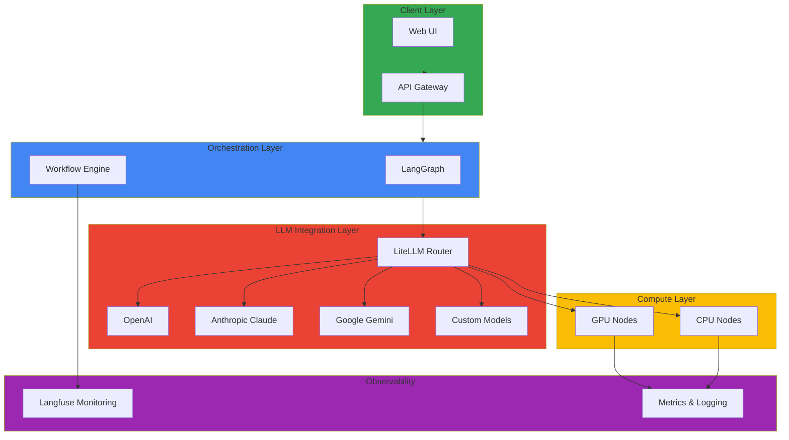

# Agentic AI Platform

> 📅 **작성일**: 2025-02-05 | ⏱️ **읽는 시간**: 약 3분

현대의 생성형 AI 플랫폼은 단순한 모델 서빙을 넘어 복잡한 에이전트 시스템, 동적 리소스 관리, 그리고 비용 효율적인 운영이 요구되는 종합적인 기술 스택을 필요로 합니다. Amazon EKS 기반의 Agentic AI 플랫폼은 Kubernetes의 강력한 오케스트레이션 능력을 활용하여 이러한 요구사항을 충족시키는 현대적인 접근 방식입니다. 이 플랫폼은 GPU 리소스의 동적 할당과 스케일링, 다양한 LLM 프로바이더 간의 지능적 라우팅, 그리고 실시간 모니터링을 통한 비용 최적화를 하나의 통합된 시스템으로 제공합니다.

Kubernetes 네이티브 접근 방식의 핵심 철학은 오픈소스 생태계를 적극 활용하면서도 엔터프라이즈급 안정성을 확보하는 것입니다. LiteLLM과 vLLM을 통한 모델 서빙, LangGraph 기반의 복잡한 에이전트 워크플로우, Milvus를 활용한 벡터 데이터베이스 통합, 그리고 Langfuse를 통한 전체 파이프라인 모니터링이 Kubernetes 클러스터 위에서 조화롭게 작동합니다. 특히 Karpenter를 통한 노드 자동 스케일링과 NVIDIA GPU Operator를 결합하면 워크로드 패턴에 따라 GPU 리소스를 동적으로 프로비저닝하고 해제함으로써 클라우드 비용을 극적으로 절감할 수 있습니다.

프로덕션 환경 구축을 위한 실전 출발점으로 AWS는 두 가지 핵심 샘플 저장소를 제공합니다. GenAI on EKS Starter Kit (aws-samples/sample-genai-on-eks-starter-kit)은 LiteLLM, vLLM, SGLang, Langfuse, Milvus, Open WebUI, n8n, Strands Agents, Agno 등 필수 컴포넌트들의 통합 구성을 제공하여 빠른 프로토타이핑과 개발을 지원합니다. 한편 Scalable Model Inference and Agentic AI (aws-solutions-library-samples/guidance-for-scalable-model-inference-and-agentic-ai-on-amazon-eks)는 Karpenter 자동 스케일링, llm-d 기반 분산 추론, LiteLLM 게이트웨이, OpenSearch 기반 RAG 시스템, 그리고 멀티 에이전트 시스템 구축에 필요한 프로덕션급 아키텍처 패턴을 제시합니다.

이러한 기술 스택의 조합은 Frontier Model 트래픽 처리에서 발생하는 네 가지 핵심 도전과제를 효과적으로 해결합니다. GPU 스케줄링과 리소스 격리는 MIG와 Time-Slicing을 통해 다중 테넌트 환경에서도 안정적인 성능을 보장하며, 동적 라우팅 계층은 모델 가용성과 비용을 고려한 지능적인 요청 분배를 수행합니다. Agent 라이프사이클 관리는 Kagent CRD를 통해 선언적으로 정의되고, 전체 시스템의 관찰 가능성은 Langfuse와 Prometheus 기반 메트릭으로 확보됩니다. 이 모든 것이 Kubernetes의 자가 치유 능력과 결합되어 24/7 무중단 운영이 가능한 플랫폼을 완성합니다.

## 주요 문서 (구현 순서)

### 이해 및 설계

- [1. 기술적 도전과제](./agentic-ai-challenges.md) - Agentic AI 플랫폼의 핵심 과제 이해
- [2. EKS 기반 해결방안](./agentic-ai-solutions-eks.md) - Kubernetes 기반 솔루션 접근
- [3. 플랫폼 아키텍처](./agentic-platform-architecture.md) - 전체 아키텍처 설계

### GPU 인프라 구성

- [4. GPU 리소스 관리](./gpu-resource-management.md) - MIG, Time-Slicing 등 GPU 리소스 설정

### 모델 서빙 (기본 → 고급)

- [5. vLLM 모델 서빙](./vllm-model-serving.md) - 기본 모델 서빙 구성
- [6. MoE 모델 서빙](./moe-model-serving.md) - Mixture of Experts 모델 서빙
- [7. llm-d EKS Auto Mode](./llm-d-eks-automode.md) - Kubernetes 네이티브 분산 추론
- [8. NeMo 프레임워크](./nemo-framework.md) - 학습 및 서빙 프레임워크

### 추론 라우팅 및 게이트웨이

- [9. Inference Gateway](./inference-gateway-routing.md) - 지능형 요청 라우팅

### RAG 데이터 레이어

- [10. Milvus 벡터 DB](./milvus-vector-database.md) - 벡터 저장소 구축

### AI 에이전트 배포

- [11. Kagent Agent 관리](./kagent-kubernetes-agents.md) - CRD 기반 에이전트 관리

### 운영 및 모니터링

- [12. Agent 모니터링 & 운영](./agent-monitoring.md) - 에이전트 상태 및 성능 모니터링

### 평가 및 검증

- [13. Ragas 평가](./ragas-evaluation.md) - RAG 파이프라인 품질 평가

### Bedrock AgentCore 통합

- [14. Bedrock AgentCore & MCP](./bedrock-agentcore-mcp.md) - AWS Bedrock 에이전트 통합

### MLOps 파이프라인

- [15. MLOps 파이프라인](./mlops-pipeline-eks.md) - Kubeflow + MLflow + KServe 엔드투엔드 ML 라이프사이클
- [16. SageMaker-EKS 통합](./sagemaker-eks-integration.md) - SageMaker 학습 + EKS 서빙 하이브리드 구성

## 🎯 학습 목표

이 섹션을 통해 다음을 학습할 수 있습니다:

- Agentic AI 플랫폼 구축 시 4가지 핵심 기술적 도전과제 이해
- EKS에서 확장 가능한 GenAI 플랫폼 구축 방법
- 여러 LLM 제공자(OpenAI, Anthropic, Google 등) 통합
- 복잡한 AI 워크플로우 설계 및 구현
- GPU 리소스 효율적 활용 및 최적화 전략
- AI/ML 워크로드의 자동 스케일링 및 리소스 관리
- 프로덕션 환경에서의 AI 모델 배포 및 운영
- Kagent, Kgateway, Milvus, Ragas, NeMo 등 오픈소스 활용
- 비용 추적 및 최적화
- 성능 모니터링 및 분석

## 🏗️ 아키텍처 패턴

## 🔧 주요 기술 및 도구

| 기술 | 설명 | 용도 |
| --- | --- | --- |
| **Kagent** | Kubernetes Agent 관리 | CRD 기반 Agent 라이프사이클 |
| **Kgateway** | Inference Gateway | 동적 라우팅 및 로드밸런싱 |
| **Milvus** | 벡터 데이터베이스 | RAG 파이프라인 지원 |
| **Ragas** | RAG 평가 프레임워크 | 품질 측정 및 CI/CD 통합 |
| **NeMo** | LLM 학습 프레임워크 | 파인튜닝 및 최적화 |
| **LiteLLM** | 다중 LLM 프로바이더 통합 | LLM 라우팅 및 폴백 |
| **LangGraph** | AI 워크플로우 오케스트레이션 | 복잡한 AI 워크플로우 구현 |
| **Langfuse** | GenAI 애플리케이션 모니터링 | 추적, 모니터링, 분석 |
| **NVIDIA GPU Operator** | GPU 리소스 관리 | GPU 드라이버 및 런타임 |
| **Karpenter** | 노드 자동 스케일링 | 비용 효율적 리소스 관리 |
| **vLLM** | 고성능 LLM 서빙 | PagedAttention 기반 추론 |

## 💡 핵심 개념

### LiteLLM 라우팅

- **프로바이더 추상화**: 다양한 LLM API를 통일된 인터페이스로 사용
- **폴백 메커니즘**: 한 제공자 실패 시 자동으로 다른 제공자로 전환
- **로드 밸런싱**: 여러 모델에 요청 분산
- **비용 최적화**: 가성비 좋은 모델 자동 선택

### LangGraph 워크플로우

- **상태 관리**: 각 단계의 상태를 명확하게 관리
- **조건부 분기**: 결과에 따른 동적 흐름 제어
- **병렬 처리**: 독립적인 작업 동시 실행
- **오류 처리**: 안정적인 예외 처리 메커니즘

### Langfuse 모니터링

- **요청 추적**: 각 API 호출의 전체 과정 기록
- **비용 분석**: 모델별, 프로젝트별 비용 추적
- **성능 분석**: 응답 시간, 정확도 등 메트릭 분석
- **사용자 피드백**: 생성 결과에 대한 피드백 수집

### GPU 리소스 최적화

#### MIG (Multi-Instance GPU)

- **단일 GPU 분할**: 하나의 GPU를 여러 인스턴스로 분할
- **리소스 격리**: 완전한 컴퓨팅 격리 제공
- **효율성**: 다중 테넌트 환경에서 안정적

#### Time-Slicing

- **시간 공유**: GPU 시간을 여러 작업이 공유
- **유연성**: 개발/테스트 환경에 적합
- **비용**: MIG보다 저렴하지만 성능 공유

## 📊 성능 및 비용 최적화

### 모델 선택 기준

| 모델 | 성능 | 비용 | 용도 |
|------|------|------|------|
| GPT-4 | 최고 | 높음 | 복잡한 작업 |
| GPT-4 Turbo | 높음 | 중간 | 균형잡은 선택 |
| GPT-3.5 Turbo | 중간 | 낮음 | 빠른 응답 필요 시 |
| Claude 3 Opus | 매우 높음 | 매우 높음 | 고정확도 필요 시 |
| Open Source | 다양 | 낮음 | 완전한 제어 필요 시 |

### 비용 최적화 전략

- **프롬프트 캐싱**: 반복적인 프롬프트 캐시
- **배치 처리**: 비즈니스 크리티컬하지 않은 작업 배치 처리
- **모델 계층화**: 복잡도에 따라 다른 모델 사용
- **컨텍스트 최소화**: 불필요한 토큰 제거

## 🔗 관련 카테고리

- [Operations & Observability](/docs/operations-observability) - AI/ML 워크로드 모니터링
- [Infrastructure Optimization](/docs/infrastructure-optimization) - GPU 성능 최적화
- [Hybrid Infrastructure](/docs/hybrid-infrastructure) - 하이브리드 환경의 AI 배포

---

:::tip 팁
GenAI 워크로드는 GPU 리소스를 많이 사용하므로, 비용 최적화를 위해 Spot 인스턴스와 자동 스케일링을 적극 활용하세요. 또한 Langfuse를 통해 비용을 추적하고 지속적으로 모니터링하십시오.
:::

:::info 추천 학습 경로

**Agentic AI 플랫폼 구축 경로:**

1. [1. 기술적 도전과제](./agentic-ai-challenges.md) - 핵심 과제 이해
2. [2. EKS 기반 해결방안](./agentic-ai-solutions-eks.md) - Kubernetes 솔루션
3. [3. 플랫폼 아키텍처](./agentic-platform-architecture.md) - 아키텍처 설계
4. [4. GPU 리소스 관리](./gpu-resource-management.md) - GPU 인프라 설정
5. [9. Inference Gateway](./inference-gateway-routing.md) - 동적 라우팅 구성
6. [12. Agent 모니터링 & 운영](./agent-monitoring.md) - 운영 체계 구축

**GenAI 애플리케이션 개발 경로:**

1. [5. vLLM 모델 서빙](./vllm-model-serving.md) - 기본 모델 서빙
2. [9. Inference Gateway](./inference-gateway-routing.md) - LiteLLM 라우팅
3. [10. Milvus 벡터 DB](./milvus-vector-database.md) - RAG 데이터 레이어
4. [11. Kagent Agent 관리](./kagent-kubernetes-agents.md) - 에이전트 배포
5. [13. Ragas 평가](./ragas-evaluation.md) - 품질 평가
:::

:::warning 주의 - 비용 관리
생성형 AI 서비스는 API 호출 비용이 빠르게 누적될 수 있습니다. 초기에는 요청 속도 제한(rate limiting)을 설정하고, Langfuse로 비용을 지속적으로 모니터링하세요.
:::
