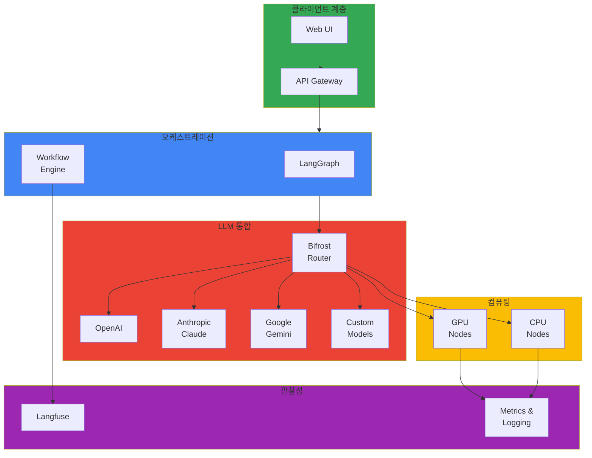

# Agentic AI Platform

> 📅 **작성일**: 2025-02-05 | **수정일**: 2026-03-20 | ⏱️ **읽는 시간**: 약 9분

Agentic AI Platform은 자율적인 AI 에이전트가 복잡한 작업을 수행할 수 있도록 지원하는 통합 플랫폼입니다. 이 문서 시리즈는 플랫폼의 아키텍처를 이해하고, 구축 시 직면하는 **5가지 핵심 도전과제**(GPU 리소스 관리, 추론 라우팅, LLMOps 관찰성, Agent 오케스트레이션, 모델 공급망)를 파악한 후, 이를 해결하는 **두 가지 접근 방식**을 제시합니다.

**AWS Native 접근**은 Amazon Bedrock, Strands Agents SDK, AgentCore를 활용하여 인프라 운영 부담을 최소화하고 Agent 개발에 집중하는 전략입니다. GPU 관리가 불필요하며, 서버리스 추론과 매니지드 RAG를 통해 빠르게 시작할 수 있습니다.

**EKS 기반 오픈 아키텍처**는 Amazon EKS와 오픈소스 생태계(vLLM, Bifrost, LangGraph, Langfuse, Milvus 등)를 활용하여 Open Weight 모델 자체 호스팅, 하이브리드 아키텍처, 세밀한 GPU 비용 최적화를 달성하는 전략입니다. EKS Auto Mode로 빠르게 시작하고, Karpenter와 EKS Capability(ACK, KRO, ArgoCD)로 운영 부담을 최소화합니다.

두 접근은 **상호 보완적**이며, AWS Native로 시작하여 필요에 따라 EKS로 확장하는 점진적 여정을 권장합니다.

## 주요 문서

:::tip 문서 구성
이 섹션의 문서들이 4개 서브카테고리로 구성됩니다.
:::

### [설계 & 아키텍처](./design-architecture/index.md)

- [플랫폼 아키텍처](./design-architecture/agentic-platform-architecture.md) — Agentic AI Platform의 구조와 핵심 레이어
- [기술적 도전과제](./design-architecture/agentic-ai-challenges.md) — 플랫폼 구축 시 직면하는 5가지 핵심 과제
- [AWS Native 플랫폼](./design-architecture/aws-native-agentic-platform.md) — 매니지드 서비스로 도전과제 해결
- [EKS 기반 오픈 아키텍처](./design-architecture/agentic-ai-solutions-eks.md) — EKS + 오픈소스로 도전과제 해결

### [모델 서빙 & 추론 인프라](./model-serving/index.md)

- [EKS GPU 노드 전략](./model-serving/eks-gpu-node-strategy.md) — Auto Mode + Karpenter + Hybrid Node 구성
- [GPU 리소스 관리](./model-serving/gpu-resource-management.md) — Karpenter 스케일링, KEDA, DRA, 비용 최적화
- [vLLM 모델 서빙](./model-serving/vllm-model-serving.md) — 기본 모델 서빙 구성
- [llm-d 분산 추론](./model-serving/llm-d-eks-automode.md) — Kubernetes 네이티브 분산 추론, Disaggregated Serving
- [MoE 모델 서빙](./model-serving/moe-model-serving.md) — Mixture of Experts 모델 서빙
- [NVIDIA GPU 스택](./model-serving/nvidia-gpu-stack.md) — GPU Operator, DCGM, MIG/Time-Slicing, Dynamo
- [NeMo 프레임워크](./model-serving/nemo-framework.md) — 학습 및 서빙 프레임워크

### [게이트웨이 & 에이전트](./gateway-agents/index.md)

- [Inference Gateway](./gateway-agents/inference-gateway-routing.md) — 지능형 요청 라우팅
- [Milvus 벡터 DB](./gateway-agents/milvus-vector-database.md) — 벡터 저장소 구축
- [Kagent Agent 관리](./gateway-agents/kagent-kubernetes-agents.md) — CRD 기반 에이전트 관리
- [Bedrock AgentCore & MCP](./gateway-agents/bedrock-agentcore-mcp.md) — AWS Bedrock 에이전트 통합
- [OpenClaw AI Gateway](./gateway-agents/openclaw-ai-gateway.mdx) — OpenClaw + Bifrost Auto-Router + Full Observability
- [LLM Gateway 아키텍처](./gateway-agents/llm-gateway-architecture.md) — 2-Tier Gateway 설계 및 솔루션 선택
- [LLMOps Observability](./gateway-agents/llmops-observability.md) — Langfuse/LangSmith/Helicone 비교 가이드

### [운영 & MLOps](./operations-mlops/index.md)

- [Agent 모니터링 & 운영](./operations-mlops/agent-monitoring.md) — 에이전트 상태 및 성능 모니터링
- [Ragas 평가](./operations-mlops/ragas-evaluation.md) — RAG 파이프라인 품질 평가
- [MLOps 파이프라인](./operations-mlops/mlops-pipeline-eks.md) — Kubeflow + MLflow + ArgoCD GitOps
- [SageMaker-EKS 통합](./operations-mlops/sagemaker-eks-integration.md) — SageMaker 학습 + EKS 서빙 하이브리드

## 🎯 학습 목표

이 섹션을 통해 다음을 학습할 수 있습니다:

- Agentic AI 플랫폼 구축 시 5가지 핵심 기술적 도전과제 이해
- EKS에서 확장 가능한 GenAI 플랫폼 구축 방법
- 여러 LLM 제공자(OpenAI, Anthropic, Google 등) 통합
- 복잡한 AI 워크플로우 설계 및 구현
- GPU 리소스 효율적 활용 및 최적화 전략
- AI/ML 워크로드의 자동 스케일링 및 리소스 관리
- 프로덕션 환경에서의 AI 모델 배포 및 운영
- Kagent, Kgateway, Milvus, Ragas, NeMo 등 오픈소스 활용
- 비용 추적 및 최적화
- 성능 모니터링 및 분석

## 🏗️ 아키텍처 패턴

```mermaid
flowchart TB
    subgraph Client["클라이언트 계층"]
        WebUI[Web UI]
        APIGateway[API Gateway]
    end

    subgraph Orchestration["오케스트레이션"]
        LangGraph[LangGraph]
        Workflow[Workflow<br/>Engine]
    end

    subgraph LLM["LLM 통합"]
        Bifrost[Bifrost<br/>Router]
        OpenAI[OpenAI]
        Anthropic[Anthropic<br/>Claude]
        Google[Google<br/>Gemini]
        Custom[Custom<br/>Models]
    end

    subgraph Compute["컴퓨팅"]
        GPU[GPU<br/>Nodes]
        CPU[CPU<br/>Nodes]
    end

    subgraph Observability["관찰성"]
        Langfuse[Langfuse]
        Metrics[Metrics &<br/>Logging]
    end

    Client --> APIGateway
    APIGateway --> Orchestration
    Orchestration --> Bifrost
    Bifrost --> OpenAI
    Bifrost --> Anthropic
    Bifrost --> Google
    Bifrost --> Custom
    Bifrost --> GPU
    Bifrost --> CPU
    Workflow --> Langfuse
    GPU --> Metrics
    CPU --> Metrics

    style Client fill:#34a853
    style Orchestration fill:#4285f4
    style LLM fill:#ea4335
    style Compute fill:#fbbc04
    style Observability fill:#9c27b0
```

## 🔧 주요 기술 및 도구

| 기술 | 버전 | 설명 | 용도 |
| --- | --- | --- | --- |
| **Kagent** | v0.3+ | Kubernetes Agent 관리 | CRD 기반 Agent 라이프사이클 |
| **Kgateway** | v2.0+ | Inference Gateway | 동적 라우팅 및 로드밸런싱 |
| **Milvus** | v2.4+ | 벡터 데이터베이스 | RAG 파이프라인 지원 |
| **Ragas / DeepEval** | v0.1+ / v1.x | RAG 평가 프레임워크 | 품질 측정 및 CI/CD 통합 |
| **NeMo** | v25.02 | LLM 학습 프레임워크 | 파인튜닝 및 최적화 |
| **Bifrost** | v1.x | 다중 LLM 프로바이더 통합 | LLM 라우팅 및 폴백 (Rust 기반) |
| **LangGraph** | v0.2+ | AI 워크플로우 오케스트레이션 | 복잡한 AI 워크플로우 구현 |
| **Langfuse** | v3.x | GenAI 애플리케이션 모니터링 | 추적, 모니터링, 분석 |
| **NVIDIA GPU Operator** | v24.9+ | GPU 리소스 관리 | GPU 드라이버 및 런타임 |
| **Karpenter** | v1.2+ | 노드 자동 스케일링 | 비용 효율적 리소스 관리 |
| **vLLM** | v0.7.x | 고성능 LLM 서빙 | PagedAttention 기반 추론 |
| **Triton Inference Server** | v2.x+ | 비-LLM 추론 서버 | Embedding, Reranking, STT |
| **llm-d** | v0.3+ | 분산 추론 스케줄러 | Prefix Caching 인식 라우팅 |
| **MCP/A2A** | v1.0+ | 에이전트 프로토콜 | Agent 도구 연결 및 통신 표준 |

## 💡 핵심 개념

### Bifrost 라우팅

- **프로바이더 추상화**: 다양한 LLM API를 통일된 인터페이스로 사용
- **폴백 메커니즘**: 한 제공자 실패 시 자동으로 다른 제공자로 전환
- **로드 밸런싱**: 여러 모델에 요청 분산
- **비용 최적화**: 가성비 좋은 모델 자동 선택
- **고성능**: Rust 기반으로 LiteLLM 대비 50배 빠른 처리

### LangGraph 워크플로우

- **상태 관리**: 각 단계의 상태를 명확하게 관리
- **조건부 분기**: 결과에 따른 동적 흐름 제어
- **병렬 처리**: 독립적인 작업 동시 실행
- **오류 처리**: 안정적인 예외 처리 메커니즘

### Langfuse 모니터링

- **요청 추적**: 각 API 호출의 전체 과정 기록
- **비용 분석**: 모델별, 프로젝트별 비용 추적
- **성능 분석**: 응답 시간, 정확도 등 메트릭 분석
- **사용자 피드백**: 생성 결과에 대한 피드백 수집

### GPU 리소스 최적화

#### MIG (Multi-Instance GPU)

- **단일 GPU 분할**: 하나의 GPU를 여러 인스턴스로 분할
- **리소스 격리**: 완전한 컴퓨팅 격리 제공
- **효율성**: 다중 테넌트 환경에서 안정적

#### Time-Slicing

- **시간 공유**: GPU 시간을 여러 작업이 공유
- **유연성**: 개발/테스트 환경에 적합
- **비용**: MIG보다 저렴하지만 성능 공유

## 📊 성능 및 비용 최적화

### 모델 선택 기준

| 모델 | 성능 | 비용 | 용도 |
|------|------|------|------|
| GPT-4.1 | 최고 | 중간 | 복잡한 작업, 균형잡힌 선택 |
| GPT-4o mini | 중간 | 낮음 | 빠른 응답 필요 시 |
| Claude 4.x Sonnet | 매우 높음 | 중간 | 코딩, 분석 작업 |
| Claude 4.x Opus | 매우 높음 | 매우 높음 | 고정확도 필요 시 |
| Gemini 2.5 | 매우 높음 | 중간 | 멀티모달 작업 |
| Open Source (Llama 3) | 다양 | 낮음 | 완전한 제어 필요 시 |

### 비용 최적화 전략

- **프롬프트 캐싱**: 반복적인 프롬프트 캐시
- **배치 처리**: 비즈니스 크리티컬하지 않은 작업 배치 처리
- **모델 계층화**: 복잡도에 따라 다른 모델 사용
- **컨텍스트 최소화**: 불필요한 토큰 제거

## 🔗 관련 카테고리

- [Operations & Observability](/docs/operations-observability) - AI/ML 워크로드 모니터링
- [Infrastructure Optimization](/docs/infrastructure-optimization) - GPU 성능 최적화
- [Hybrid Infrastructure](/docs/hybrid-infrastructure) - 하이브리드 환경의 AI 배포

---

:::tip 팁
GenAI 워크로드는 GPU 리소스를 많이 사용하므로, 비용 최적화를 위해 Spot 인스턴스와 자동 스케일링을 적극 활용하세요. 또한 Langfuse를 통해 비용을 추적하고 지속적으로 모니터링하십시오.
:::

:::info 추천 학습 경로

**Agentic AI 플랫폼 구축 경로:**

1. [플랫폼 아키텍처](./design-architecture/agentic-platform-architecture.md) - 플랫폼 구조 이해
2. [기술적 도전과제](./design-architecture/agentic-ai-challenges.md) - 핵심 과제 이해
3. [AWS Native 플랫폼](./design-architecture/aws-native-agentic-platform.md) 또는 [EKS 기반 오픈 아키텍처](./design-architecture/agentic-ai-solutions-eks.md) - 접근 전략 선택
4. [EKS GPU 노드 전략](./model-serving/eks-gpu-node-strategy.md) - 노드 프로비저닝
5. [GPU 리소스 관리](./model-serving/gpu-resource-management.md) - Karpenter, KEDA, DRA
6. [Inference Gateway](./gateway-agents/inference-gateway-routing.md) - 동적 라우팅 구성
7. [Agent 모니터링 & 운영](./operations-mlops/agent-monitoring.md) - 운영 체계 구축

**GenAI 애플리케이션 개발 경로:**

1. [vLLM 모델 서빙](./model-serving/vllm-model-serving.md) - 추론 엔진 배포
2. [llm-d 분산 추론](./model-serving/llm-d-eks-automode.md) - KV Cache-aware 라우팅
3. [Inference Gateway](./gateway-agents/inference-gateway-routing.md) - 트래픽 라우팅
4. [Milvus 벡터 DB](./gateway-agents/milvus-vector-database.md) - RAG 데이터 레이어
5. [Kagent Agent 관리](./gateway-agents/kagent-kubernetes-agents.md) - 에이전트 배포
6. [Ragas 평가](./operations-mlops/ragas-evaluation.md) - 품질 평가
:::

:::warning 주의 - 비용 관리
생성형 AI 서비스는 API 호출 비용이 빠르게 누적될 수 있습니다. 초기에는 요청 속도 제한(rate limiting)을 설정하고, Langfuse로 비용을 지속적으로 모니터링하세요.
:::
