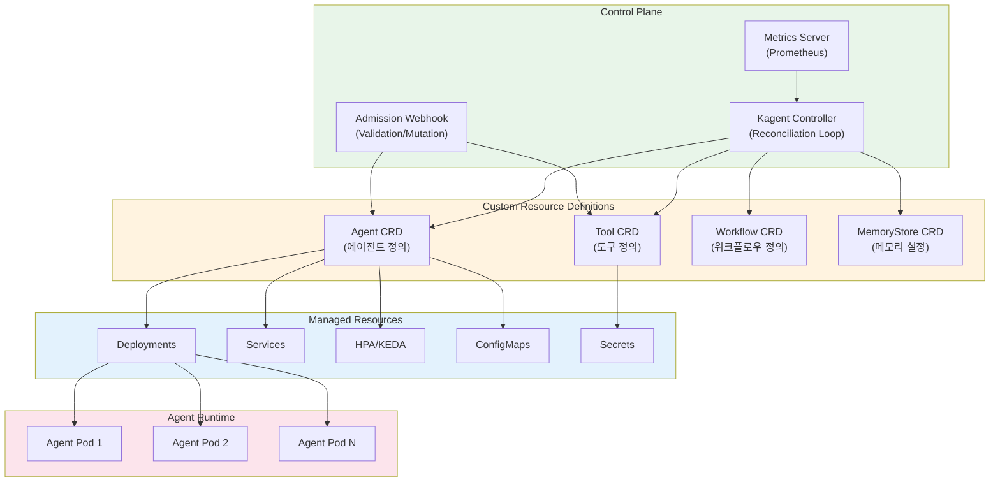
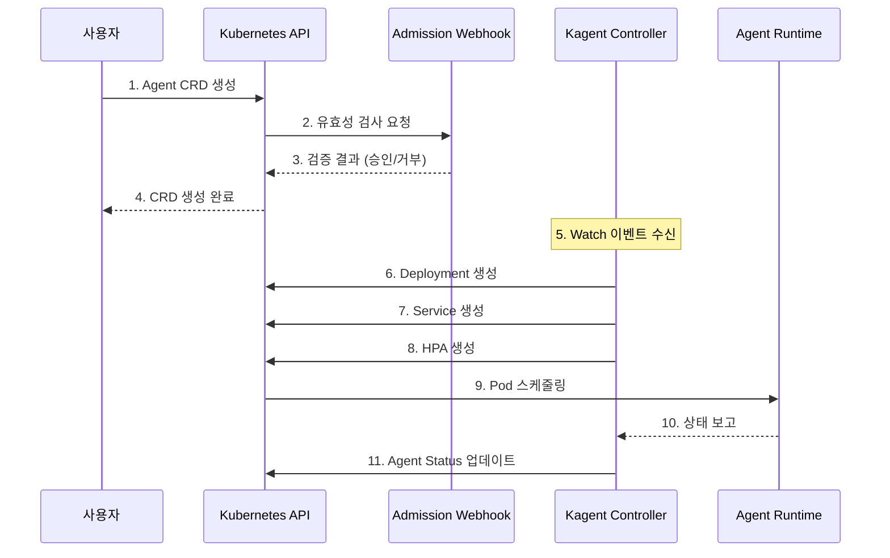
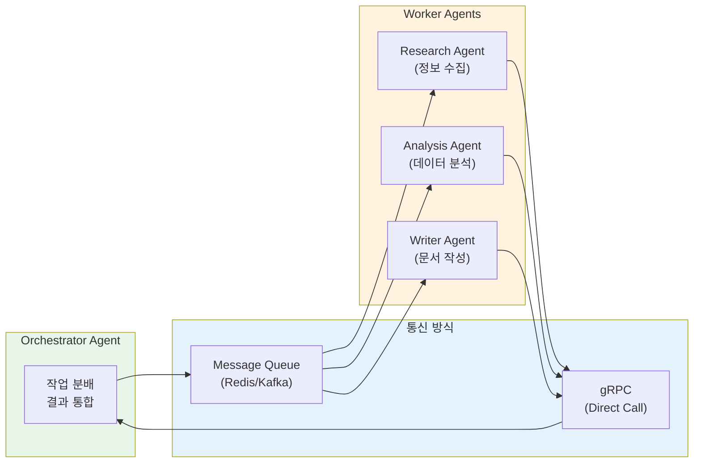

# Kagent - Kubernetes AI Agent 관리

이 문서에서는 Kagent를 활용하여 Kubernetes 환경에서 AI 에이전트를 효율적으로 배포하고 관리하는 방법을 다룹니다. Kagent는 Kubernetes Operator 패턴을 기반으로 AI 에이전트의 전체 라이프사이클을 선언적으로 관리할 수 있게 해주는 오픈소스 도구입니다.

## 개요

Kagent는 Kubernetes 네이티브 방식으로 AI 에이전트를 관리하기 위한 오픈소스 프로젝트입니다. Custom Resource Definition(CRD)을 통해 에이전트, 도구, 워크플로우를 선언적으로 정의하고, Operator가 이를 자동으로 배포 및 관리합니다.

### 주요 기능

- **선언적 에이전트 관리**: YAML 기반 에이전트 정의 및 배포
- **도구 레지스트리**: 에이전트가 사용할 도구를 CRD로 중앙 관리
- **자동 스케일링**: HPA/KEDA 통합을 통한 동적 확장
- **멀티 에이전트 오케스트레이션**: 복잡한 워크플로우를 위한 에이전트 간 협업
- **관측성 통합**: LangFuse, OpenTelemetry와의 네이티브 연동

:::info 대상 독자
이 문서는 Kubernetes 관리자, 플랫폼 엔지니어, MLOps 엔지니어를 대상으로 합니다. Kubernetes 기본 개념(Pod, Deployment, CRD)에 대한 이해가 필요합니다.
:::

## Kagent 아키텍처

Kagent는 Kubernetes Operator 패턴을 따르며, Controller, CRD, Webhook으로 구성됩니다.




### 컴포넌트 설명

| 컴포넌트 | 역할 | 설명 |
| -------- | ---- | ---- |
| **Kagent Controller** | 조정 루프 | CRD 변경을 감지하고 원하는 상태로 리소스를 조정 |
| **Admission Webhook** | 검증/변환 | CRD 생성/수정 시 유효성 검사 및 기본값 설정 |
| **Metrics Server** | 메트릭 수집 | 에이전트 상태 및 성능 메트릭 노출 |
| **Agent CRD** | 에이전트 정의 | AI 에이전트의 스펙, 모델, 도구 설정 |
| **Tool CRD** | 도구 정의 | 에이전트가 사용할 도구(API, 검색 등) 정의 |
| **Workflow CRD** | 워크플로우 정의 | 멀티 에이전트 협업 워크플로우 정의 |

### 컴포넌트 상호작용



## Kagent 설치

### 사전 요구사항

- Kubernetes 클러스터 (v1.25 이상)
- kubectl CLI 도구
- Helm v3 (Helm 설치 시)
- cert-manager (Webhook TLS 인증서 관리)

:::warning cert-manager 필수
Kagent의 Admission Webhook은 TLS 인증서가 필요합니다. 설치 전 cert-manager가 클러스터에 설치되어 있어야 합니다.
:::


### Helm 차트 설치

Helm을 사용한 설치가 가장 권장되는 방법입니다.

#### 1. Helm 저장소 추가

```bash
# Kagent Helm 저장소 추가
helm repo add kagent https://kagent-dev.github.io/kagent
helm repo update

# 사용 가능한 버전 확인
helm search repo kagent --versions
```

#### 2. 네임스페이스 생성

```bash
# Kagent 시스템 네임스페이스 생성
kubectl create namespace kagent-system

# 에이전트 배포용 네임스페이스 생성
kubectl create namespace ai-agents
```

#### 3. values.yaml 설정

```yaml
# values.yaml
controller:
  # 컨트롤러 복제본 수 (고가용성)
  replicaCount: 2
  
  # 리소스 설정
  resources:
    requests:
      cpu: 100m
      memory: 128Mi
    limits:
      cpu: 500m
      memory: 512Mi
  
  # 로그 레벨
  logLevel: info
  
  # 메트릭 설정
  metrics:
    enabled: true
    port: 8080

webhook:
  # Webhook 활성화
  enabled: true
  
  # 인증서 설정 (cert-manager 사용)
  certManager:
    enabled: true
    issuerRef:
      name: kagent-selfsigned-issuer
      kind: Issuer

# 모니터링 설정
monitoring:
  # ServiceMonitor 생성 (Prometheus Operator)
  serviceMonitor:
    enabled: true
    namespace: observability
    interval: 30s

# RBAC 설정
rbac:
  create: true

# 서비스 계정
serviceAccount:
  create: true
  name: kagent-controller

# 노드 선택자
nodeSelector:
  kubernetes.io/os: linux

# Tolerations
tolerations: []

# Affinity
affinity:
  podAntiAffinity:
    preferredDuringSchedulingIgnoredDuringExecution:
      - weight: 100
        podAffinityTerm:
          labelSelector:
            matchExpressions:
              - key: app.kubernetes.io/name
                operator: In
                values:
                  - kagent
          topologyKey: kubernetes.io/hostname
```

#### 4. Helm 설치 실행

```bash
# Kagent 설치
helm install kagent kagent/kagent \
  --namespace kagent-system \
  --values values.yaml \
  --wait

# 설치 상태 확인
helm status kagent -n kagent-system
```


### 매니페스트 설치

Helm을 사용하지 않는 경우, 매니페스트를 직접 적용할 수 있습니다.

#### 1. CRD 설치

```bash
# CRD 매니페스트 다운로드 및 적용
kubectl apply -f https://github.com/kagent-dev/kagent/releases/latest/download/crds.yaml

# CRD 설치 확인
kubectl get crds | grep kagent
```

예상 출력:

```text
agents.kagent.dev                    2025-02-05T00:00:00Z
tools.kagent.dev                     2025-02-05T00:00:00Z
workflows.kagent.dev                 2025-02-05T00:00:00Z
memorystores.kagent.dev              2025-02-05T00:00:00Z
```

#### 2. Controller 배포

```yaml
# kagent-controller.yaml
apiVersion: v1
kind: Namespace
metadata:
  name: kagent-system
---
apiVersion: v1
kind: ServiceAccount
metadata:
  name: kagent-controller
  namespace: kagent-system
---
apiVersion: rbac.authorization.k8s.io/v1
kind: ClusterRole
metadata:
  name: kagent-controller-role
rules:
  - apiGroups: ["kagent.dev"]
    resources: ["agents", "tools", "workflows", "memorystores"]
    verbs: ["*"]
  - apiGroups: ["kagent.dev"]
    resources: ["agents/status", "workflows/status"]
    verbs: ["get", "update", "patch"]
  - apiGroups: ["apps"]
    resources: ["deployments"]
    verbs: ["*"]
  - apiGroups: [""]
    resources: ["services", "configmaps", "secrets", "pods"]
    verbs: ["*"]
  - apiGroups: ["autoscaling"]
    resources: ["horizontalpodautoscalers"]
    verbs: ["*"]
  - apiGroups: ["keda.sh"]
    resources: ["scaledobjects"]
    verbs: ["*"]
---
apiVersion: rbac.authorization.k8s.io/v1
kind: ClusterRoleBinding
metadata:
  name: kagent-controller-binding
roleRef:
  apiGroup: rbac.authorization.k8s.io
  kind: ClusterRole
  name: kagent-controller-role
subjects:
  - kind: ServiceAccount
    name: kagent-controller
    namespace: kagent-system
---
apiVersion: apps/v1
kind: Deployment
metadata:
  name: kagent-controller
  namespace: kagent-system
spec:
  replicas: 2
  selector:
    matchLabels:
      app: kagent-controller
  template:
    metadata:
      labels:
        app: kagent-controller
    spec:
      serviceAccountName: kagent-controller
      containers:
        - name: controller
          image: ghcr.io/kagent-dev/kagent-controller:latest
          args:
            - --leader-elect=true
            - --metrics-bind-address=:8080
            - --health-probe-bind-address=:8081
          ports:
            - containerPort: 8080
              name: metrics
            - containerPort: 8081
              name: health
          resources:
            requests:
              cpu: 100m
              memory: 128Mi
            limits:
              cpu: 500m
              memory: 512Mi
          livenessProbe:
            httpGet:
              path: /healthz
              port: 8081
            initialDelaySeconds: 15
            periodSeconds: 20
          readinessProbe:
            httpGet:
              path: /readyz
              port: 8081
            initialDelaySeconds: 5
            periodSeconds: 10
```

```bash
# Controller 배포
kubectl apply -f kagent-controller.yaml
```


### 설치 검증

설치가 완료되면 다음 명령으로 상태를 확인합니다.

```bash
# Controller Pod 상태 확인
kubectl get pods -n kagent-system

# 예상 출력:
# NAME                                 READY   STATUS    RESTARTS   AGE
# kagent-controller-5d4f6b7c8d-abc12   1/1     Running   0          2m
# kagent-controller-5d4f6b7c8d-def34   1/1     Running   0          2m

# CRD 확인
kubectl get crds | grep kagent.dev

# Controller 로그 확인
kubectl logs -n kagent-system -l app=kagent-controller --tail=50

# Webhook 상태 확인 (Helm 설치 시)
kubectl get validatingwebhookconfigurations | grep kagent
kubectl get mutatingwebhookconfigurations | grep kagent
```

:::tip 설치 문제 해결
Controller가 시작되지 않는 경우:

1. `kubectl describe pod -n kagent-system <pod-name>`으로 이벤트 확인
2. RBAC 권한이 올바르게 설정되었는지 확인
3. cert-manager가 정상 동작하는지 확인 (Webhook 사용 시)
:::

## Agent CRD 정의

Agent CRD는 AI 에이전트의 모든 설정을 선언적으로 정의합니다.

### Agent 리소스 스펙

```yaml
apiVersion: kagent.dev/v1alpha1
kind: Agent
metadata:
  name: customer-support-agent
  namespace: ai-agents
  labels:
    app: customer-support
    team: support
    environment: production
spec:
  # 에이전트 기본 정보
  displayName: "고객 지원 에이전트"
  description: "고객 문의에 응답하고 티켓을 생성하는 AI 에이전트"
  
  # 모델 설정
  model:
    provider: openai          # openai, anthropic, bedrock, vllm
    name: gpt-4-turbo
    endpoint: ""              # 커스텀 엔드포인트 (vLLM 등)
    temperature: 0.7
    maxTokens: 4096
    topP: 0.9
    frequencyPenalty: 0.0
    presencePenalty: 0.0
    # API 키 참조
    apiKeySecretRef:
      name: openai-api-key
      key: api-key
  
  # 시스템 프롬프트
  systemPrompt: |
    당신은 친절하고 전문적인 고객 지원 에이전트입니다.
    
    ## 역할
    - 고객 문의에 정확하고 도움이 되는 답변 제공
    - 필요시 지식 베이스 검색을 통한 정보 확인
    - 해결되지 않는 문제는 티켓 생성
    
    ## 지침
    - 항상 정중하고 공감하는 태도 유지
    - 모르는 것은 솔직히 인정
    - 민감한 정보 요청 시 본인 확인 절차 안내
  
  # 사용할 도구 목록
  tools:
    - name: search-knowledge-base
    - name: create-ticket
    - name: get-customer-info
  
  # 메모리 설정
  memory:
    type: redis
    config:
      host: redis-master.ai-data.svc.cluster.local
      port: 6379
      database: 0
      ttl: 3600           # 세션 TTL (초)
      maxHistory: 50      # 최대 대화 기록 수
    secretRef:
      name: redis-credentials
      key: password
  
  # 스케일링 설정
  scaling:
    minReplicas: 2
    maxReplicas: 10
    metrics:
      - type: cpu
        target:
          type: Utilization
          averageUtilization: 70
      - type: memory
        target:
          type: Utilization
          averageUtilization: 80
    # KEDA 스케일링 (선택사항)
    keda:
      enabled: true
      triggers:
        - type: prometheus
          metadata:
            serverAddress: http://prometheus.observability.svc:9090
            metricName: agent_active_sessions
            threshold: "50"
            query: sum(agent_active_sessions{agent="customer-support"})
  
  # 리소스 제한
  resources:
    requests:
      memory: "512Mi"
      cpu: "250m"
    limits:
      memory: "1Gi"
      cpu: "500m"
  
  # 환경 변수
  env:
    - name: LOG_LEVEL
      value: "info"
    - name: LANGFUSE_ENABLED
      value: "true"
    - name: LANGFUSE_HOST
      value: "http://langfuse.observability.svc:3000"
  
  # 관측성 설정
  observability:
    tracing:
      enabled: true
      provider: langfuse
      sampleRate: 1.0
    metrics:
      enabled: true
      port: 9090
  
  # 헬스체크
  healthCheck:
    enabled: true
    path: /health
    port: 8080
    initialDelaySeconds: 10
    periodSeconds: 30
```


### Tool CRD 정의

Tool CRD는 에이전트가 사용할 수 있는 도구를 정의합니다.

```yaml
apiVersion: kagent.dev/v1alpha1
kind: Tool
metadata:
  name: search-knowledge-base
  namespace: ai-agents
  labels:
    category: retrieval
spec:
  # 도구 유형: api, retrieval, code, human
  type: retrieval
  
  # 도구 설명 (LLM이 도구 선택 시 참조)
  displayName: "지식 베이스 검색"
  description: |
    회사의 지식 베이스에서 관련 문서를 검색합니다.
    고객 문의에 답변하기 위한 정보를 찾을 때 사용하세요.
  
  # Retrieval 설정
  retrieval:
    vectorStore:
      type: milvus
      host: milvus-proxy.ai-data.svc.cluster.local
      port: 19530
      collection: support-knowledge
    embedding:
      provider: openai
      model: text-embedding-3-small
      dimension: 1536
    search:
      topK: 5
      scoreThreshold: 0.7
      filter: ""
  
  # 입력 파라미터 정의
  parameters:
    - name: query
      type: string
      required: true
      description: "검색할 질문 또는 키워드"
    - name: category
      type: string
      required: false
      description: "문서 카테고리 필터 (예: faq, manual, policy)"
      enum: ["faq", "manual", "policy", "all"]
      default: "all"
  
  # 출력 스키마
  output:
    type: array
    items:
      type: object
      properties:
        content:
          type: string
          description: "문서 내용"
        score:
          type: number
          description: "유사도 점수"
        metadata:
          type: object
          description: "문서 메타데이터"
---
apiVersion: kagent.dev/v1alpha1
kind: Tool
metadata:
  name: create-ticket
  namespace: ai-agents
  labels:
    category: api
spec:
  type: api
  
  displayName: "티켓 생성"
  description: |
    고객 문의를 티켓으로 생성합니다.
    에이전트가 직접 해결할 수 없는 문제일 때 사용하세요.
  
  # API 설정
  api:
    endpoint: http://ticketing-service.support.svc:8080/api/v1/tickets
    method: POST
    timeout: 30s
    retries: 3
    headers:
      Content-Type: application/json
    # 인증 설정
    authentication:
      type: bearer
      secretRef:
        name: ticketing-api-token
        key: token
  
  parameters:
    - name: title
      type: string
      required: true
      description: "티켓 제목"
      maxLength: 200
    - name: description
      type: string
      required: true
      description: "문제 상세 설명"
    - name: priority
      type: string
      required: false
      description: "우선순위"
      enum: ["low", "medium", "high", "urgent"]
      default: "medium"
    - name: category
      type: string
      required: true
      description: "문의 카테고리"
      enum: ["billing", "technical", "general", "complaint"]
    - name: customer_id
      type: string
      required: true
      description: "고객 ID"
  
  output:
    type: object
    properties:
      ticket_id:
        type: string
        description: "생성된 티켓 ID"
      status:
        type: string
        description: "티켓 상태"
      created_at:
        type: string
        description: "생성 시간"
---
apiVersion: kagent.dev/v1alpha1
kind: Tool
metadata:
  name: get-customer-info
  namespace: ai-agents
  labels:
    category: api
spec:
  type: api
  
  displayName: "고객 정보 조회"
  description: |
    고객 ID로 고객 정보를 조회합니다.
    고객 확인이 필요할 때 사용하세요.
  
  api:
    endpoint: http://customer-service.crm.svc:8080/api/v1/customers/{customer_id}
    method: GET
    timeout: 10s
    authentication:
      type: bearer
      secretRef:
        name: crm-api-token
        key: token
  
  parameters:
    - name: customer_id
      type: string
      required: true
      description: "조회할 고객 ID"
      pattern: "^[A-Z0-9]{8}$"
  
  output:
    type: object
    properties:
      id:
        type: string
      name:
        type: string
      email:
        type: string
      tier:
        type: string
      created_at:
        type: string
```


### Memory 설정

에이전트의 대화 컨텍스트와 상태를 저장하기 위한 메모리 설정입니다.

```yaml
apiVersion: kagent.dev/v1alpha1
kind: MemoryStore
metadata:
  name: agent-memory-redis
  namespace: ai-agents
spec:
  # 메모리 유형: redis, postgres, in-memory
  type: redis
  
  # Redis 설정
  redis:
    host: redis-master.ai-data.svc.cluster.local
    port: 6379
    database: 0
    # TLS 설정
    tls:
      enabled: true
      secretRef:
        name: redis-tls-cert
    # 인증
    auth:
      secretRef:
        name: redis-credentials
        passwordKey: password
  
  # 메모리 정책
  policy:
    # 세션 TTL
    sessionTTL: 3600
    # 최대 대화 기록
    maxConversationHistory: 100
    # 메모리 압축 (긴 대화 요약)
    compression:
      enabled: true
      threshold: 50
      model: gpt-3.5-turbo
    # 장기 메모리 설정
    longTermMemory:
      enabled: true
      vectorStore:
        type: milvus
        collection: agent-memories
```

### Scaling 설정

에이전트의 자동 스케일링을 위한 상세 설정입니다.

```yaml
# HPA 기반 스케일링
scaling:
  minReplicas: 2
  maxReplicas: 20
  
  # 스케일링 동작 설정
  behavior:
    scaleDown:
      stabilizationWindowSeconds: 300
      policies:
        - type: Percent
          value: 10
          periodSeconds: 60
    scaleUp:
      stabilizationWindowSeconds: 0
      policies:
        - type: Percent
          value: 100
          periodSeconds: 15
        - type: Pods
          value: 4
          periodSeconds: 15
      selectPolicy: Max
  
  # 메트릭 기반 스케일링
  metrics:
    - type: Resource
      resource:
        name: cpu
        target:
          type: Utilization
          averageUtilization: 70
    - type: Resource
      resource:
        name: memory
        target:
          type: Utilization
          averageUtilization: 80
    # 커스텀 메트릭
    - type: Pods
      pods:
        metric:
          name: agent_requests_per_second
        target:
          type: AverageValue
          averageValue: "100"
```

## Agent 라이프사이클 관리

### 에이전트 배포 절차

#### 1. 사전 준비

```bash
# 네임스페이스 생성
kubectl create namespace ai-agents

# API 키 시크릿 생성
kubectl create secret generic openai-api-key \
  --namespace ai-agents \
  --from-literal=api-key='sk-your-api-key-here'

# Redis 인증 정보 시크릿 생성
kubectl create secret generic redis-credentials \
  --namespace ai-agents \
  --from-literal=password='your-redis-password'
```

#### 2. Tool 리소스 배포

```bash
# Tool CRD 적용
kubectl apply -f tools/search-knowledge-base.yaml
kubectl apply -f tools/create-ticket.yaml
kubectl apply -f tools/get-customer-info.yaml

# Tool 상태 확인
kubectl get tools -n ai-agents
```

#### 3. Agent 리소스 배포

```bash
# Agent CRD 적용
kubectl apply -f agents/customer-support-agent.yaml

# 배포 상태 확인
kubectl get agents -n ai-agents

# 상세 상태 확인
kubectl describe agent customer-support-agent -n ai-agents
```

#### 4. 배포 검증

```bash
# 생성된 리소스 확인
kubectl get deployments -n ai-agents
kubectl get services -n ai-agents
kubectl get hpa -n ai-agents

# Pod 상태 확인
kubectl get pods -n ai-agents -l app=customer-support-agent

# 로그 확인
kubectl logs -n ai-agents -l app=customer-support-agent --tail=100

# 에이전트 엔드포인트 테스트
kubectl port-forward svc/customer-support-agent 8080:8080 -n ai-agents

# 다른 터미널에서 테스트
curl -X POST http://localhost:8080/chat \
  -H "Content-Type: application/json" \
  -d '{"message": "안녕하세요, 결제 문의드립니다."}'
```


### 업데이트 절차

에이전트 설정을 변경하고 업데이트하는 절차입니다.

#### 설정 변경 및 적용

```bash
# 현재 설정 확인
kubectl get agent customer-support-agent -n ai-agents -o yaml

# 설정 수정 (에디터 사용)
kubectl edit agent customer-support-agent -n ai-agents

# 또는 파일 수정 후 적용
kubectl apply -f agents/customer-support-agent.yaml
```

#### 롤링 업데이트 모니터링

```bash
# 업데이트 상태 모니터링
kubectl rollout status deployment/customer-support-agent -n ai-agents

# Pod 교체 상태 확인
kubectl get pods -n ai-agents -l app=customer-support-agent -w

# 이벤트 확인
kubectl get events -n ai-agents --sort-by='.lastTimestamp' | grep customer-support
```

#### 카나리 배포 (선택사항)

```yaml
apiVersion: kagent.dev/v1alpha1
kind: Agent
metadata:
  name: customer-support-agent-canary
  namespace: ai-agents
  labels:
    app: customer-support
    version: canary
spec:
  # 새로운 모델 또는 설정으로 테스트
  model:
    provider: openai
    name: gpt-4o  # 새 모델
    temperature: 0.5
  
  # 최소 복제본으로 테스트
  scaling:
    minReplicas: 1
    maxReplicas: 2
  
  # 나머지 설정은 동일...
```

### 롤백 절차

문제 발생 시 이전 버전으로 롤백하는 절차입니다.

#### Deployment 롤백

```bash
# 롤아웃 히스토리 확인
kubectl rollout history deployment/customer-support-agent -n ai-agents

# 특정 리비전 상세 확인
kubectl rollout history deployment/customer-support-agent -n ai-agents --revision=2

# 이전 버전으로 롤백
kubectl rollout undo deployment/customer-support-agent -n ai-agents

# 특정 리비전으로 롤백
kubectl rollout undo deployment/customer-support-agent -n ai-agents --to-revision=2

# 롤백 상태 확인
kubectl rollout status deployment/customer-support-agent -n ai-agents
```

#### Agent CRD 롤백

```bash
# 이전 버전의 Agent CRD 적용
kubectl apply -f agents/customer-support-agent-v1.yaml

# 또는 Git에서 이전 버전 복원
git checkout HEAD~1 -- agents/customer-support-agent.yaml
kubectl apply -f agents/customer-support-agent.yaml
```

:::danger 롤백 주의사항

- 롤백 전 현재 상태를 백업하세요
- 데이터베이스 스키마 변경이 있었다면 데이터 호환성을 확인하세요
- 롤백 후 모든 기능이 정상 동작하는지 테스트하세요
:::

## 멀티 에이전트 오케스트레이션

복잡한 작업을 여러 에이전트가 협업하여 처리하는 워크플로우를 정의합니다.

### 에이전트 간 통신




### 워크플로우 정의

Workflow CRD를 사용하여 멀티 에이전트 워크플로우를 정의합니다.

```yaml
apiVersion: kagent.dev/v1alpha1
kind: Workflow
metadata:
  name: research-report-workflow
  namespace: ai-agents
spec:
  displayName: "리서치 리포트 생성 워크플로우"
  description: "주제에 대한 리서치를 수행하고 분석 리포트를 생성합니다"
  
  # 워크플로우 입력
  input:
    - name: topic
      type: string
      required: true
      description: "리서치 주제"
    - name: depth
      type: string
      required: false
      default: "standard"
      enum: ["quick", "standard", "deep"]
  
  # 워크플로우 단계 정의
  steps:
    # 1단계: 정보 수집
    - name: research
      agent: research-agent
      input:
        topic: "{{ .input.topic }}"
        sources: ["web", "academic", "news"]
      output:
        - name: research_data
          path: ".result.data"
      timeout: 300s
      retries: 2
    
    # 2단계: 데이터 분석 (병렬 실행)
    - name: analyze-trends
      agent: analysis-agent
      dependsOn: [research]
      input:
        data: "{{ .steps.research.output.research_data }}"
        analysis_type: "trend"
      output:
        - name: trend_analysis
          path: ".result"
      parallel: true
    
    - name: analyze-sentiment
      agent: analysis-agent
      dependsOn: [research]
      input:
        data: "{{ .steps.research.output.research_data }}"
        analysis_type: "sentiment"
      output:
        - name: sentiment_analysis
          path: ".result"
      parallel: true
    
    # 3단계: 리포트 작성
    - name: write-report
      agent: writer-agent
      dependsOn: [analyze-trends, analyze-sentiment]
      input:
        research: "{{ .steps.research.output.research_data }}"
        trends: "{{ .steps.analyze-trends.output.trend_analysis }}"
        sentiment: "{{ .steps.analyze-sentiment.output.sentiment_analysis }}"
        format: "markdown"
      output:
        - name: report
          path: ".result.document"
    
    # 4단계: 검토 및 수정
    - name: review
      agent: reviewer-agent
      dependsOn: [write-report]
      input:
        document: "{{ .steps.write-report.output.report }}"
        criteria: ["accuracy", "clarity", "completeness"]
      output:
        - name: final_report
          path: ".result.reviewed_document"
  
  # 워크플로우 출력
  output:
    report: "{{ .steps.review.output.final_report }}"
    metadata:
      research_sources: "{{ .steps.research.output.research_data.sources }}"
      analysis_summary: "{{ .steps.analyze-trends.output.trend_analysis.summary }}"
  
  # 오류 처리
  errorHandling:
    # 단계 실패 시 동작
    onStepFailure: retry
    maxRetries: 3
    # 전체 워크플로우 실패 시
    onWorkflowFailure: notify
    notificationChannel:
      type: slack
      webhook:
        secretRef:
          name: slack-webhook
          key: url
  
  # 타임아웃 설정
  timeout: 1800s  # 30분
  
  # 동시 실행 제한
  concurrency:
    maxConcurrent: 5
    policy: queue  # queue, reject, replace
```

### 워크플로우 실행

```bash
# 워크플로우 정의 적용
kubectl apply -f workflows/research-report-workflow.yaml

# 워크플로우 실행 (WorkflowRun 생성)
cat <<EOF | kubectl apply -f -
apiVersion: kagent.dev/v1alpha1
kind: WorkflowRun
metadata:
  name: research-run-001
  namespace: ai-agents
spec:
  workflowRef:
    name: research-report-workflow
  input:
    topic: "2024년 AI 트렌드 분석"
    depth: "deep"
EOF

# 실행 상태 확인
kubectl get workflowruns -n ai-agents

# 상세 상태 확인
kubectl describe workflowrun research-run-001 -n ai-agents

# 실행 로그 확인
kubectl logs -n ai-agents -l workflow-run=research-run-001 --tail=100
```

### 워크플로우 모니터링

```yaml
# 워크플로우 상태 확인
apiVersion: kagent.dev/v1alpha1
kind: WorkflowRun
metadata:
  name: research-run-001
status:
  phase: Running  # Pending, Running, Succeeded, Failed
  startTime: "2025-02-05T10:00:00Z"
  steps:
    - name: research
      phase: Succeeded
      startTime: "2025-02-05T10:00:00Z"
      completionTime: "2025-02-05T10:03:00Z"
    - name: analyze-trends
      phase: Running
      startTime: "2025-02-05T10:03:00Z"
    - name: analyze-sentiment
      phase: Running
      startTime: "2025-02-05T10:03:00Z"
    - name: write-report
      phase: Pending
    - name: review
      phase: Pending
  conditions:
    - type: Initialized
      status: "True"
    - type: Running
      status: "True"
```


## 운영 가이드

### 모니터링 설정

```yaml
# ServiceMonitor for Prometheus
apiVersion: monitoring.coreos.com/v1
kind: ServiceMonitor
metadata:
  name: kagent-agents
  namespace: observability
spec:
  selector:
    matchLabels:
      kagent.dev/monitored: "true"
  namespaceSelector:
    matchNames:
      - ai-agents
  endpoints:
    - port: metrics
      interval: 15s
      path: /metrics
---
# PrometheusRule for Alerts
apiVersion: monitoring.coreos.com/v1
kind: PrometheusRule
metadata:
  name: kagent-alerts
  namespace: observability
spec:
  groups:
    - name: kagent-agent-alerts
      rules:
        - alert: AgentHighErrorRate
          expr: |
            sum(rate(agent_request_errors_total[5m])) by (agent) /
            sum(rate(agent_request_total[5m])) by (agent) > 0.05
          for: 5m
          labels:
            severity: critical
          annotations:
            summary: "에이전트 {{ $labels.agent }} 오류율 증가"
            description: "오류율이 5%를 초과했습니다. 현재: {{ $value | humanizePercentage }}"
        
        - alert: AgentHighLatency
          expr: |
            histogram_quantile(0.99, 
              sum(rate(agent_request_duration_seconds_bucket[5m])) by (agent, le)
            ) > 30
          for: 5m
          labels:
            severity: warning
          annotations:
            summary: "에이전트 {{ $labels.agent }} 응답 지연"
            description: "P99 지연 시간이 30초를 초과했습니다"
        
        - alert: AgentPodNotReady
          expr: |
            kube_deployment_status_replicas_ready{deployment=~".*-agent"} /
            kube_deployment_status_replicas{deployment=~".*-agent"} < 0.5
          for: 5m
          labels:
            severity: critical
          annotations:
            summary: "에이전트 Pod 가용성 저하"
            description: "{{ $labels.deployment }}의 Ready Pod가 50% 미만입니다"
```

### 로깅 설정

```yaml
# 에이전트 로깅 ConfigMap
apiVersion: v1
kind: ConfigMap
metadata:
  name: agent-logging-config
  namespace: ai-agents
data:
  logging.yaml: |
    version: 1
    disable_existing_loggers: false
    formatters:
      json:
        class: pythonjsonlogger.jsonlogger.JsonFormatter
        format: "%(asctime)s %(name)s %(levelname)s %(message)s"
    handlers:
      console:
        class: logging.StreamHandler
        formatter: json
        stream: ext://sys.stdout
    loggers:
      kagent:
        level: INFO
        handlers: [console]
        propagate: false
      langchain:
        level: WARNING
        handlers: [console]
        propagate: false
    root:
      level: INFO
      handlers: [console]
```

### 트러블슈팅

#### 일반적인 문제 해결

| 문제 | 원인 | 해결 방법 |
| ---- | ---- | --------- |
| Pod CrashLoopBackOff | API 키 오류, 메모리 부족 | 시크릿 확인, 리소스 증가 |
| 높은 지연 시간 | 모델 응답 지연, 네트워크 문제 | 타임아웃 조정, 모델 변경 |
| Tool 실행 실패 | 엔드포인트 오류, 인증 실패 | Tool 설정 확인, 시크릿 갱신 |
| 스케일링 미작동 | 메트릭 수집 실패, HPA 설정 오류 | Prometheus 연결 확인, HPA 검증 |

#### 디버깅 명령어

```bash
# 에이전트 상태 상세 확인
kubectl describe agent <agent-name> -n ai-agents

# Pod 이벤트 확인
kubectl get events -n ai-agents --field-selector involvedObject.name=<pod-name>

# 컨테이너 로그 확인 (이전 컨테이너 포함)
kubectl logs <pod-name> -n ai-agents --previous

# 실시간 로그 스트리밍
kubectl logs -f -l app=<agent-name> -n ai-agents

# Pod 내부 접속
kubectl exec -it <pod-name> -n ai-agents -- /bin/sh

# 네트워크 연결 테스트
kubectl run debug --rm -it --image=curlimages/curl -- \
  curl -v http://customer-support-agent.ai-agents.svc:8080/health
```

## 결론

Kagent를 활용하면 Kubernetes 환경에서 AI 에이전트를 선언적으로 관리할 수 있습니다. 주요 이점은 다음과 같습니다:

- **선언적 관리**: YAML 기반 에이전트 정의로 GitOps 워크플로우 지원
- **자동화된 운영**: Operator 패턴을 통한 자동 복구 및 스케일링
- **표준화**: CRD를 통한 에이전트 정의 표준화
- **확장성**: Kubernetes 네이티브 스케일링 메커니즘 활용
- **관측성**: 통합 모니터링 및 추적 지원

:::tip 다음 단계

- [Agentic AI Platform 아키텍처](./agentic-platform-architecture.md) - 전체 플랫폼 설계
- [Agent 모니터링](./agent-monitoring.md) - LangFuse 통합 가이드
- [GPU 리소스 관리](./gpu-resource-management.md) - 동적 리소스 할당

:::

## 참고 자료

- [Kagent GitHub Repository](https://github.com/kagent-dev/kagent)
- [Kagent Documentation](https://kagent.dev/docs)
- [Kubernetes Operator Pattern](https://kubernetes.io/docs/concepts/extend-kubernetes/operator/)
- [Custom Resource Definitions](https://kubernetes.io/docs/concepts/extend-kubernetes/api-extension/custom-resources/)
- [Horizontal Pod Autoscaler](https://kubernetes.io/docs/tasks/run-application/horizontal-pod-autoscale/)
- [KEDA Documentation](https://keda.sh/docs/)
