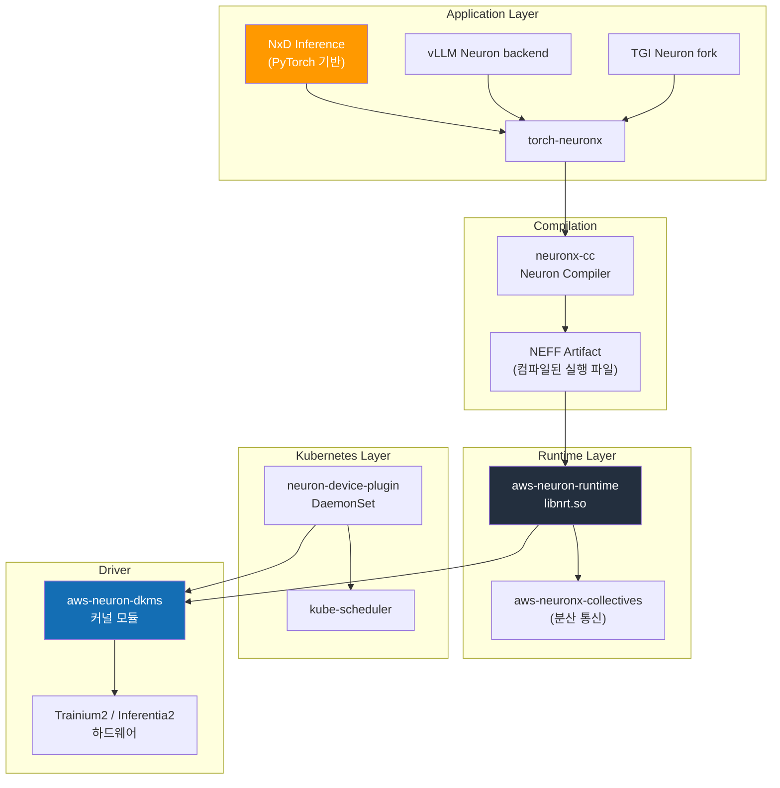
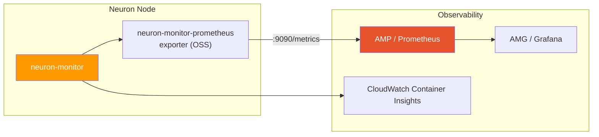

# AWS Neuron Stack

AWS Neuron은 AWS가 설계한 AI 가속기(Trainium, Inferentia) 위에서 학습·추론 워크로드를 실행하기 위한 소프트웨어 스택입니다. NVIDIA의 CUDA + GPU Operator 조합이 NVIDIA GPU 상에서 수행하는 역할과 유사하게, Neuron SDK + Neuron Device Plugin 이 EKS 위에서 Trainium/Inferentia 칩을 Kubernetes 리소스로 추상화합니다.

이 문서는 Trainium2/Inferentia2 인스턴스를 EKS에서 운영하기 위한 Neuron 소프트웨어 스택, Device Plugin, Karpenter 구성, 추론 프레임워크 선택 기준을 다룹니다. NVIDIA GPU 기반 스택은 [NVIDIA GPU 스택](./nvidia-gpu-stack.md)을, 노드 타입 선택 전반은 [EKS GPU 노드 전략](./eks-gpu-node-strategy.md)을 참조하세요.

| 계층 | 역할 | 핵심 컴포넌트 |
|------|------|-------------|
| **인프라 자동화** | Neuron 드라이버, 런타임, Device Plugin | aws-neuron-dkms, neuron-device-plugin |
| **컴파일러** | 모델 → NEFF(Neuron Executable) 컴파일 | neuronx-cc (Neuron Compiler) |
| **런타임** | NeuronCore 실행, 메모리 관리 | aws-neuron-runtime, neuronx-collectives |
| **추론 프레임워크** | 대규모 LLM 서빙 | NxD Inference, vLLM Neuron backend, TGI Neuron |
| **관측** | NeuronCore 메트릭, 프로파일링 | neuron-monitor, neuron-top, neuron-ls |

---

## 1. 왜 Neuron 인가

### 1.1 Neuron 을 선택하는 세 가지 이유

**1) 비용 효율성 (Per-Token TCO)**

AWS 공식 자료 기준 Trainium2/Inferentia2 는 유사 성능 GPU 대비 토큰당 비용이 낮습니다. 특히 다음 조건에서 효과가 큽니다.

- 장기간(> 3개월) 지속되는 안정적 추론 트래픽
- FP8/INT8/BF16 기반 표준 Transformer 계열 모델
- AWS Reserved/Savings Plan 적용 가능한 워크로드

**2) Capacity 가용성**

NVIDIA H100/H200/B200 공급이 타이트한 시기에 Trainium2 는 상대적으로 확보가 용이합니다. 특히 미국/아시아 특정 리전에서 p5/p5en 재고 부족 시 Neuron 이 실질적인 대안이 됩니다.

**3) Bedrock 과의 연속성**

Bedrock 이 서빙하는 일부 FM(Claude, Llama, Titan 등)은 내부적으로 Neuron 스택 위에서 동작합니다. Bedrock → Self-hosted 마이그레이션 경로에서 Neuron 을 선택하면 컴파일된 아티팩트 및 운영 패턴을 재사용할 수 있습니다.

### 1.2 적합/비적합 워크로드

| 구분 | 워크로드 |
|------|---------|
| **적합** | 표준 Llama/Mistral/Qwen 계열 추론, 대규모 장기 운영, FP8/BF16 기반 서빙, Bedrock 스타일 거버넌스 |
| **주의 필요** | 신규 아키텍처 최초 출시 모델(지원 지연), 커스텀 CUDA 커널 의존 워크로드, AWQ/GPTQ 일부 양자화 포맷 |
| **부적합** | 연구·실험 환경에서 모델 구조를 자주 바꾸는 경우, CUDA 전용 라이브러리(Triton inference server custom kernels)에 강하게 결합된 코드 |

:::info Neuron vs NVIDIA 의사결정 원칙
- **모델 생태계 최신성이 핵심** → NVIDIA GPU (H100/H200/B200)
- **장기 운영 TCO / Capacity 가 핵심** → Trainium2 / Inferentia2
- **Bedrock 과 하이브리드 운영** → Neuron 우선 검토
:::

---

## 2. 인스턴스 라인업

AWS 공식 제품 페이지 및 EC2 사용자 가이드 기준 2026-04 시점의 Neuron 인스턴스 라인업입니다. 실제 리전별 가용성은 AWS 콘솔에서 확인해야 합니다.

### 2.1 추론 전용 인스턴스 (Inferentia2)

| 인스턴스 | 칩 수 | NeuronCore | 총 가속기 메모리 | vCPU | 메모리 | 네트워크 |
|---------|------|-----------|----------------|------|-------|---------|
| inf2.xlarge | 1× Inferentia2 | 2 | 32 GB | 4 | 16 GB | 최대 15 Gbps |
| inf2.8xlarge | 1× Inferentia2 | 2 | 32 GB | 32 | 128 GB | 최대 25 Gbps |
| inf2.24xlarge | 6× Inferentia2 | 12 | 192 GB | 96 | 384 GB | 50 Gbps |
| inf2.48xlarge | 12× Inferentia2 | 24 | 384 GB | 192 | 768 GB | 100 Gbps |

### 2.2 학습·추론 겸용 인스턴스 (Trainium1/Trainium2)

| 인스턴스 | 칩 수 | NeuronCore | 총 가속기 메모리 | vCPU | 메모리 | 네트워크 |
|---------|------|-----------|----------------|------|-------|---------|
| trn1.2xlarge | 1× Trainium1 | 2 | 32 GB | 8 | 32 GB | 최대 12.5 Gbps |
| trn1.32xlarge | 16× Trainium1 | 32 | 512 GB | 128 | 512 GB | 800 Gbps EFA |
| trn1n.32xlarge | 16× Trainium1 | 32 | 512 GB | 128 | 512 GB | 1,600 Gbps EFA |
| trn2.48xlarge | 16× Trainium2 | 128 | 1.5 TB (HBM3) | 192 | 2 TiB | 3.2 Tbps EFA v3 |
| **trn2 Ultra** (trn2u.48xlarge) | 64× Trainium2 (4×trn2 NeuronLink) | 512 | 6 TB (HBM3) | - | - | 12.8 Tbps |

:::caution 버전·수치 주의
- NeuronCore 수 및 메모리 용량은 AWS 공식 자료 기준이며 SDK 릴리스에 따라 보고 단위가 달라질 수 있습니다. 배포 전 `neuron-ls` 로 실제 디바이스를 확인하세요.
- trn2 Ultra(trn2u)는 AWS 공식 발표 기준 "NeuronLink 로 4개 trn2 를 결합한 ultraserver" 입니다. 일반 가용성 및 리전 범위는 AWS 공식 문서를 확인해야 합니다.
- inf1 (1세대 Inferentia) 은 본 문서에서 다루지 않습니다. 신규 배포에는 Inferentia2/Trainium2 를 사용하세요.
:::

---

## 3. Neuron SDK 2.x 스택 아키텍처

### 3.1 계층 구조



### 3.2 핵심 컴포넌트

| 컴포넌트 | 설명 | 배포 형태 |
|---------|------|---------|
| **aws-neuron-dkms** | Linux 커널 모듈. `/dev/neuron*` 디바이스 노드 생성 | AMI 사전 설치 또는 DKMS 패키지 |
| **aws-neuron-runtime (libnrt)** | NeuronCore 실행, 메모리 관리, 스케줄링 | 컨테이너 이미지 포함 |
| **aws-neuronx-collectives** | 분산 학습·추론용 collectives (AllReduce, AllGather 등) | 컨테이너 이미지 포함 |
| **neuronx-cc** | 그래프 컴파일러. PyTorch/JAX 모델을 NEFF 로 변환 | 개발·빌드 단계에서 사용 |
| **torch-neuronx** | PyTorch 2.x 프론트엔드. `torch.compile(backend="neuronx")` | pip 패키지 |
| **neuron-device-plugin** | Kubernetes Device Plugin. `aws.amazon.com/neuron*` 리소스 등록 | DaemonSet |
| **neuron-monitor / neuron-top / neuron-ls** | 관측 및 프로파일링 도구 | 컨테이너 이미지/CLI |

:::info Neuron SDK 2.x (2026-04 기준 최신 안정 버전)
Neuron SDK 는 2.x 릴리스 트레인에서 정기적으로 업데이트됩니다. 2026-04 기준 최신 안정 버전의 주요 특징:

- Trainium2 (trn2) + trn2 Ultra(NeuronLink) 정식 지원
- NxD Inference 의 LLM 라이브러리 (Llama 3/4, DBRX, Mistral 계열 pre-compiled checkpoint)
- vLLM Neuron backend 정식 지원 (continuous batching, PagedAttention-유사 구조)
- PyTorch 2.5+ / JAX 호환
- FP8 (E4M3/E5M2) 추론 경로

정확한 마이너 버전은 [AWS Neuron SDK Release Notes](https://awsdocs-neuron.readthedocs-hosted.com/en/latest/release-notes/) 에서 확인하세요.
:::

### 3.3 컴파일 모델과 NEFF

Neuron 은 **사전 컴파일(Ahead-of-Time) 모델** 입니다. PyTorch eager 모드로 바로 실행되지 않으며, `neuronx-cc` 가 연산 그래프를 NeuronCore 하드웨어 명령어(NEFF, Neuron Executable File Format)로 변환해야 실행됩니다.

```
PyTorch / JAX 모델
        ↓  torch-neuronx trace/compile
Neuron IR (HLO)
        ↓  neuronx-cc
NEFF (Neuron Executable) — 최초 컴파일 5-30분, 이후 캐시 재사용
        ↓  aws-neuron-runtime
Trainium / Inferentia 하드웨어 실행
```

**운영상의 함의:**
- 첫 Pod 기동 시 NEFF 컴파일로 20-30분 이상 소요 가능 → **사전 컴파일 후 S3/ECR 에 캐싱**
- 모델 가중치 변경 시 재컴파일 필요 → CI 파이프라인에서 NEFF 아티팩트를 함께 관리
- NxD Inference 는 공식 모델에 대해 **pre-compiled checkpoint** 을 제공하여 초기 기동 시간을 단축

---

## 4. EKS 통합

### 4.1 Neuron Device Plugin 배포

Neuron Device Plugin 은 노드의 `/dev/neuron*` 디바이스를 Kubernetes 확장 리소스로 등록합니다. AWS 공식 YAML/Helm 차트를 사용합니다.

```bash
# 공식 YAML 기반 배포 예
kubectl apply -f https://raw.githubusercontent.com/aws-neuron/aws-neuron-sdk/master/src/k8/k8s-neuron-device-plugin.yml
kubectl apply -f https://raw.githubusercontent.com/aws-neuron/aws-neuron-sdk/master/src/k8/k8s-neuron-device-plugin-rbac.yml
```

배포 후 노드 리소스에 다음이 나타납니다.

```bash
kubectl describe node <trn2-node> | grep aws.amazon.com
# Allocatable:
#   aws.amazon.com/neuron:       16    # trn2.48xlarge: Trainium2 칩 수
#   aws.amazon.com/neuroncore:  128    # 총 NeuronCore 수
#   aws.amazon.com/neurondevice: 16    # 디바이스 파일 수
```

### 4.2 리소스 요청 패턴

Pod 스펙에서 Neuron 리소스를 요청할 때 세 가지 단위 중 하나를 선택합니다.

| 리소스 | 의미 | 사용 시점 |
|-------|------|---------|
| `aws.amazon.com/neuron` | Neuron 칩 단위 (trn2 의 Trainium2 칩) | 칩 단위 할당이 명확한 경우 |
| `aws.amazon.com/neuroncore` | NeuronCore 단위 (trn2 칩당 8개) | 세밀한 코어 단위 스케줄링 |
| `aws.amazon.com/neurondevice` | `/dev/neuron*` 디바이스 파일 단위 | 레거시 / 특정 도구 호환용 |

```yaml
# 예: trn2.48xlarge 전체 사용 (칩 16개 = NeuronCore 128개)
apiVersion: v1
kind: Pod
metadata:
  name: llama3-70b-neuron
spec:
  nodeSelector:
    node.kubernetes.io/instance-type: trn2.48xlarge
  tolerations:
    - key: aws.amazon.com/neuron
      operator: Exists
      effect: NoSchedule
  containers:
    - name: server
      image: public.ecr.aws/neuron/pytorch-inference-neuronx:2.x
      resources:
        limits:
          aws.amazon.com/neuron: "16"
        requests:
          aws.amazon.com/neuron: "16"
```

```yaml
# 예: NeuronCore 4개만 사용 (inf2.xlarge 2개 + NeuronCore 절반)
resources:
  limits:
    aws.amazon.com/neuroncore: "4"
```

### 4.3 노드 Taint / Toleration 패턴

NVIDIA GPU 노드와 동일한 패턴을 권장합니다.

```yaml
# 노드에 taint 적용 (Karpenter NodePool 에서 설정)
taints:
  - key: aws.amazon.com/neuron
    effect: NoSchedule
```

```yaml
# Pod 에서 toleration 선언
tolerations:
  - key: aws.amazon.com/neuron
    operator: Exists
    effect: NoSchedule
```

### 4.4 AMI 선택

| AMI | Neuron 드라이버 | 권장 용도 |
|-----|--------------|---------|
| **EKS Optimized AMI (Neuron)** | 사전 설치 | 프로덕션 표준 — `--ami-type AL2023_x86_64_NEURON` 또는 동등 |
| **Deep Learning AMI (Neuron)** | 사전 설치 + Neuron SDK tools | 개발/디버깅 노드 |
| **일반 AL2023** | 수동 설치(DKMS) | 권장하지 않음 |

EKS 관리형 노드 그룹에서 Neuron 최적화 AMI 사용 시 `nodeadm` 이 Neuron 드라이버를 자동으로 구성합니다.

---

## 5. Karpenter NodePool 예시

### 5.1 trn2 학습/대형 추론 NodePool

```yaml
apiVersion: karpenter.sh/v1
kind: NodePool
metadata:
  name: neuron-trn2
spec:
  template:
    metadata:
      labels:
        accelerator: neuron
        accelerator-family: trainium2
    spec:
      requirements:
        - key: karpenter.k8s.aws/instance-family
          operator: In
          values: ["trn2"]
        - key: karpenter.sh/capacity-type
          operator: In
          values: ["spot", "on-demand"]
        - key: topology.kubernetes.io/zone
          operator: In
          values: ["us-east-2a", "us-east-2b", "us-east-2c"]
      taints:
        - key: aws.amazon.com/neuron
          effect: NoSchedule
      nodeClassRef:
        group: karpenter.k8s.aws
        kind: EC2NodeClass
        name: neuron-nodeclass
  disruption:
    consolidationPolicy: WhenEmpty
    consolidateAfter: 10m
  limits:
    aws.amazon.com/neuron: "64"
```

### 5.2 inf2 저비용 추론 NodePool

```yaml
apiVersion: karpenter.sh/v1
kind: NodePool
metadata:
  name: neuron-inf2
spec:
  template:
    metadata:
      labels:
        accelerator: neuron
        accelerator-family: inferentia2
    spec:
      requirements:
        - key: karpenter.k8s.aws/instance-family
          operator: In
          values: ["inf2"]
        - key: karpenter.sh/capacity-type
          operator: In
          values: ["spot", "on-demand"]
      taints:
        - key: aws.amazon.com/neuron
          effect: NoSchedule
      nodeClassRef:
        group: karpenter.k8s.aws
        kind: EC2NodeClass
        name: neuron-nodeclass
  limits:
    aws.amazon.com/neuron: "48"
```

### 5.3 EC2NodeClass (Neuron AMI)

```yaml
apiVersion: karpenter.k8s.aws/v1
kind: EC2NodeClass
metadata:
  name: neuron-nodeclass
spec:
  amiSelectorTerms:
    - alias: al2023@latest   # Neuron 최적화 AMI variant 를 사용하는 경우 명시적으로 id 지정 권장
  role: KarpenterNodeRole-eks-genai
  subnetSelectorTerms:
    - tags:
        karpenter.sh/discovery: eks-genai
        subnet-type: private
  securityGroupSelectorTerms:
    - tags:
        karpenter.sh/discovery: eks-genai
  blockDeviceMappings:
    - deviceName: /dev/xvda
      ebs:
        volumeSize: 500Gi   # NEFF 캐시 + 모델 가중치 공간
        volumeType: gp3
        iops: 16000
        throughput: 1000
        encrypted: true
  metadataOptions:
    httpTokens: required
```

:::tip AMI 선택 주의
Karpenter EC2NodeClass 의 `amiSelectorTerms` 에서 `al2023` alias 는 표준 AL2023 AMI 를 의미합니다. Neuron 드라이버가 사전 설치된 variant 를 사용하려면 AWS 가 게시하는 Neuron optimized AMI 의 SSM parameter 또는 명시적 AMI ID 를 지정하세요. UserData 로 Neuron DKMS 를 설치하는 방식도 가능하지만 권장하지 않습니다.
:::

---

## 6. 추론 프레임워크

Neuron 에서 LLM 을 서빙하는 주요 프레임워크는 세 가지입니다.

### 6.1 NxD Inference (Neuron Distributed Inference)

AWS 가 공식 유지하는 **대규모 LLM 추론 라이브러리** 입니다. PyTorch 기반으로 Llama 계열 및 주요 공개 모델에 대해 Tensor/Pipeline Parallelism, Continuous Batching, PagedAttention 유사 메모리 관리, Speculative Decoding 을 제공합니다.

**특징:**
- Llama 3/4, DBRX, Mistral, Mixtral 등 **pre-compiled checkpoint 공식 제공**
- NeuronCore 단위의 TP/PP 구성 API
- Bedrock 내부 서빙 경로와 유사한 최적화 프로파일
- Apache 2.0 / AWS 공식 지원

### 6.2 vLLM Neuron backend

vLLM 의 Neuron 백엔드는 2024년부터 실험적으로 도입되었고, 2025~2026 시점에 기능 parity 가 빠르게 개선되고 있습니다. 2026-04 기준 주요 LLM(Llama 3/4, Qwen, Mistral) 에 대해 continuous batching 및 OpenAI 호환 API 서빙이 가능합니다.

**특징:**
- `vllm --device neuron --tensor-parallel-size N` 형태로 기존 vLLM 배포 스크립트와 호환
- PagedAttention 자체는 CUDA 구현이나, Neuron backend 는 동등한 블록 단위 KV 관리를 제공
- 최신 vLLM 기능(speculative decoding, chunked prefill, prefix caching)의 Neuron parity 는 기능별로 다르므로 **릴리스 노트 확인 필수**

### 6.3 TGI (Text Generation Inference) Neuron fork

HuggingFace 가 유지하는 TGI 의 **optimum-neuron** 기반 fork 입니다. `optimum[neuronx]` 를 통해 HuggingFace 모델을 간단히 Neuron 으로 컴파일·서빙합니다.

**특징:**
- HuggingFace Hub 기반 워크플로우와 긴밀하게 통합
- TGI 자체가 2025년부터 유지보수 모드 → 신규 기능은 vLLM 대비 느린 편
- SageMaker 의 HuggingFace LLM DLC 와의 호환성

### 6.4 프레임워크 비교

| 항목 | NxD Inference | vLLM Neuron backend | TGI Neuron fork |
|------|--------------|--------------------|-----------------| 
| **유지 주체** | AWS 공식 | vLLM 커뮤니티 + AWS 기여 | HuggingFace + AWS 기여 |
| **모델 커버리지** | AWS 선정 공식 모델 (Llama/Mistral/DBRX 등) | vLLM 지원 모델 중 Neuron 포팅된 것 | HuggingFace 모델 중 optimum-neuron 지원 |
| **pre-compiled checkpoint** | 제공 | 부분적 | 부분적 |
| **OpenAI 호환 API** | 지원 | 지원 | 지원 |
| **Continuous Batching** | 지원 | 지원 | 지원 |
| **Speculative Decoding** | 지원 (모델별) | 부분 지원 | 제한적 |
| **Prefix Caching** | 모델별 | 제한적 | 제한적 |
| **업데이트 속도** | AWS 릴리스 주기 | vLLM 릴리스 주기(빠름) | 느림(유지보수 모드) |
| **권장 용도** | AWS 공식 모델 대규모 프로덕션 | 다양한 모델·기능 최신 기능 활용 | HuggingFace 생태계 연속성 |

:::tip 프레임워크 선택 가이드
- **Llama 계열 대규모 프로덕션** → NxD Inference (pre-compiled checkpoint 이점)
- **다양한 모델, 최신 vLLM 기능 활용** → vLLM Neuron backend
- **HuggingFace Hub 기반 기존 파이프라인** → TGI Neuron fork
- **신규 프로젝트** 는 NxD Inference 또는 vLLM Neuron 중 택일을 권장
:::

---

## 7. 지원 모델 매트릭스

AWS Neuron 공식 Model Zoo 및 NxD Inference 지원 매트릭스 기준입니다. 최신 지원 범위는 [AWS Neuron Samples GitHub](https://github.com/aws-neuron/aws-neuron-samples) 및 [NxD Inference 문서](https://awsdocs-neuron.readthedocs-hosted.com/en/latest/libraries/nxd-inference/index.html) 를 확인하세요.

### 7.1 주요 공식 지원 모델 (2026-04 기준)

| 모델 | 크기 | 권장 인스턴스 | Pre-compiled | 비고 |
|------|-----|------------|-------------|------|
| Llama 3.1 8B / 70B | 8B / 70B | inf2.48xlarge / trn2.48xlarge | ✅ | NxD 공식 |
| Llama 3.3 70B | 70B | trn2.48xlarge | ✅ | NxD 공식 |
| Llama 4 (Scout/Maverick) | 17B-400B | trn2.48xlarge / trn2 Ultra | 릴리스 기준 확인 | NxD 지원 확장 중 |
| Mistral 7B / Mixtral 8x7B | 7B / 47B | inf2.48xlarge | ✅ | NxD/vLLM 지원 |
| Mixtral 8x22B | 141B | trn2.48xlarge | 부분 | MoE, EP 필요 |
| Qwen3 계열 | 4B-32B | inf2 / trn2 | 부분 | vLLM Neuron backend 경유 권장 |
| DBRX 132B | 132B | trn2.48xlarge | ✅ | NxD 공식 (MoE) |
| DeepSeek V3 | 671B MoE | trn2 Ultra | 제한적 | 컴파일·메모리 제약 확인 필요 |

:::caution 미래 지원 모델
DeepSeek V3, Llama 4 Maverick, GLM-5 등 최신 대형 MoE 모델은 Neuron 지원이 단계적으로 추가됩니다. 배포 전 반드시 **해당 시점의 NxD Inference 지원 매트릭스와 Release Notes** 를 확인하세요. 본 문서의 표는 참고 목적이며 구체 버전 지원 여부를 보장하지 않습니다.
:::

### 7.2 양자화 지원

| 포맷 | Neuron 지원 |
|------|------------|
| BF16 | 기본 |
| FP16 | 지원 |
| FP8 (E4M3, E5M2) | Trainium2 지원, Inferentia2 제한적 |
| INT8 (weights) | 지원 (모델별) |
| AWQ | 제한적 (모델·버전별 확인 필요) |
| GPTQ | 제한적 |
| GGUF | 미지원 |

---

## 8. 관측성

### 8.1 Neuron 전용 도구

| 도구 | 역할 | 사용 시점 |
|-----|------|---------|
| **neuron-ls** | 노드의 Neuron 디바이스 나열 | 초기 진단 |
| **neuron-top** | 실시간 NeuronCore 사용률, 메모리, 전력 | 실시간 모니터링 |
| **neuron-monitor** | JSON 포맷 메트릭 스트리밍 | Prometheus exporter 입력 |
| **neuron-profile** | NEFF 실행 프로파일링 | 성능 최적화 |

### 8.2 Prometheus / CloudWatch 통합



**수집 체인:**
- `neuron-monitor` 가 JSON 스트림으로 NeuronCore 사용률, HBM 사용량, 디바이스 온도, 실행 지연 등을 출력
- OSS 커뮤니티의 `neuron-monitor-prometheus` exporter 가 이를 Prometheus 형식으로 변환
- AMP(Amazon Managed Prometheus) 에서 remote-write 로 수집하고 AMG(Amazon Managed Grafana) 에서 대시보드화
- CloudWatch Container Insights 의 Neuron 메트릭도 함께 활용 가능

상세 AMP/AMG 구성은 [모니터링·Observability 셋업](../reference-architecture/monitoring-observability-setup.md) 을 참조하세요.

### 8.3 주요 메트릭

| 메트릭 | 설명 | 활용 |
|-------|------|------|
| `neuron_core_utilization` | NeuronCore 사용률 (%) | HPA/KEDA 트리거 |
| `neuron_device_memory_used` | HBM 사용량 (MB) | OOM 방지, 용량 계획 |
| `neuron_execution_latency` | 추론 요청 처리 지연 | SLO 모니터링 |
| `neuron_hardware_ecc_events` | ECC 오류 수 | 하드웨어 건강 체크 |
| `neuron_power_watts` | 칩당 전력 (W) | 열·비용 관리 |

---

## 9. 한계 및 주의사항

### 9.1 기능 제약

| 범주 | 제약 |
|------|------|
| **커스텀 커널** | CUDA 전용 커널(FlashAttention custom impl 등)은 Neuron 으로 직접 포팅 필요 |
| **양자화** | AWQ/GPTQ 일부 변종, GGUF 미지원 |
| **컴파일 시간** | 신규 모델 최초 컴파일 20-30분 이상 → NEFF 캐시 필수 |
| **디버깅** | nvidia-smi 대비 GPU 텔레메트리 도구 생태계가 협소 |
| **오픈소스 생태계** | NVIDIA GPU Operator / DCGM 동등 "통합 오케스트레이터" 부재 — Neuron Device Plugin + 별도 exporter 조합 |

### 9.2 운영상 주의점

:::warning 프로덕션 배포 전 체크리스트
- [ ] 대상 모델이 NxD Inference 또는 vLLM Neuron backend 에서 **현재 버전에서 지원되는지** 확인
- [ ] 모델 NEFF 를 **CI 단계에서 사전 컴파일** 하고 S3/ECR 에 아티팩트로 관리
- [ ] 첫 Pod 기동 지연을 고려한 `readinessProbe` / `startupProbe` 설정 (initialDelaySeconds 충분히 크게)
- [ ] HPA/KEDA 트리거 메트릭에서 `neuron_core_utilization` 이 정상적으로 수집되는지 검증
- [ ] 리전별 Trainium2 capacity 확인 및 Spot 인터럽트 정책 수립
- [ ] Bedrock 과의 하이브리드 운영 시 모델 버전 동기화 정책 명문화
:::

### 9.3 Neuron 에서 피해야 하는 워크로드

- 매주 모델 구조를 바꾸는 R&D 실험 — 컴파일 비용이 반복적으로 발생
- Triton Inference Server + 커스텀 Python backend 가 이미 깊게 결합된 기존 스택
- 매우 작은 요청(&lt;10 tokens/sec) 의 드문 호출 — 워밍업·컴파일 오버헤드가 상대적으로 큼

---

## 10. 관련 문서

- [EKS GPU 노드 전략](./eks-gpu-node-strategy.md) — AWS 가속기 선택 가이드, NVIDIA vs Neuron
- [NVIDIA GPU 스택](./nvidia-gpu-stack.md) — NVIDIA 스택과의 비교 기준
- [GPU 리소스 관리](./gpu-resource-management.md) — Karpenter/KEDA/DRA 기반 오토스케일링
- [vLLM 모델 서빙](./vllm-model-serving.md) — vLLM 기반 추론 엔진 (CUDA 경로)
- [MoE 모델 서빙](./moe-model-serving.md) — MoE 구조 개념 및 Trainium2 배치 전략
- [모니터링·Observability 셋업](../reference-architecture/monitoring-observability-setup.md) — AMP/AMG, Langfuse, OTel

## 참고 자료

- [AWS Neuron SDK GitHub (aws-neuron)](https://github.com/aws-neuron/aws-neuron-sdk)
- [AWS Neuron Documentation](https://awsdocs-neuron.readthedocs-hosted.com/)
- [AWS Neuron Samples](https://github.com/aws-neuron/aws-neuron-samples)
- [NxD Inference Documentation](https://awsdocs-neuron.readthedocs-hosted.com/en/latest/libraries/nxd-inference/index.html)
- [Neuron SDK Release Notes](https://awsdocs-neuron.readthedocs-hosted.com/en/latest/release-notes/)
- [AWS Trainium2 제품 페이지](https://aws.amazon.com/machine-learning/trainium/)
- [AWS Inferentia2 제품 페이지](https://aws.amazon.com/machine-learning/inferentia/)
- [vLLM Neuron backend 문서](https://docs.vllm.ai/en/latest/getting_started/installation.html#neuron-installation)
- [optimum-neuron (HuggingFace)](https://github.com/huggingface/optimum-neuron)
- [AWS Neuron Kubernetes Device Plugin](https://github.com/aws-neuron/aws-neuron-sdk/tree/master/src/k8)
