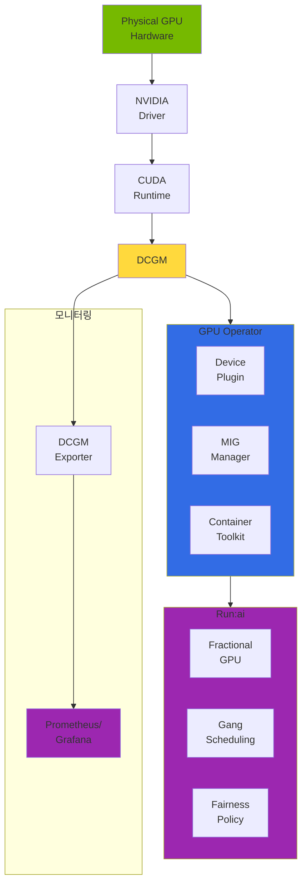
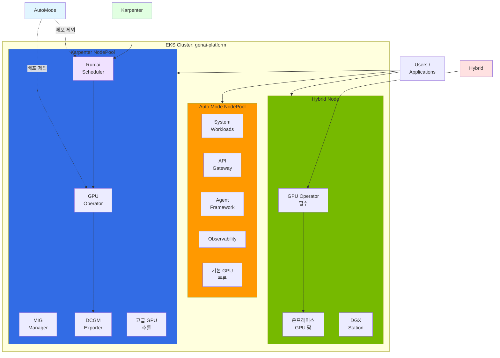
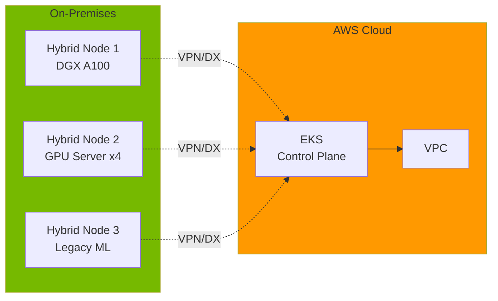
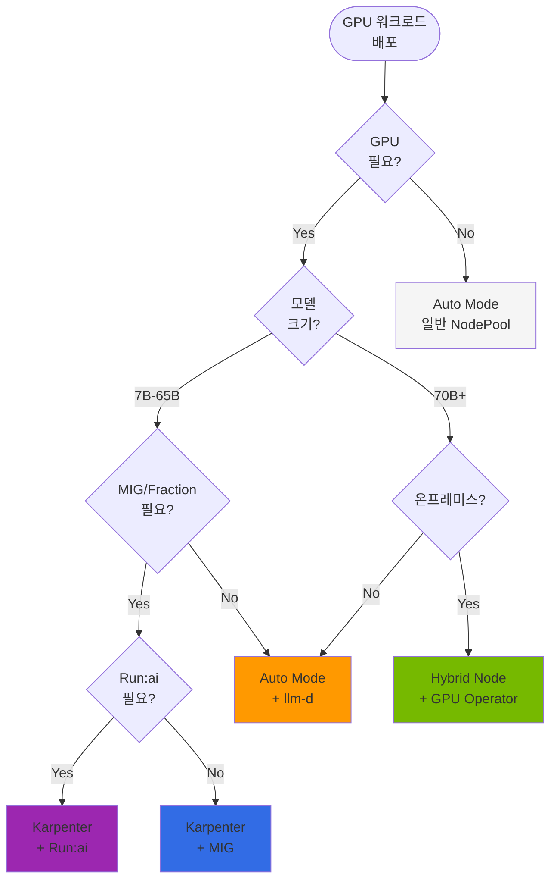

# EKS GPU 노드 전략: Auto Mode + Karpenter + Hybrid Node

## 1. 개요

EKS에서 GPU 워크로드를 운영할 때 노드 타입 선택은 운영 복잡도, 비용, 기능 활용도에 직접적인 영향을 미칩니다. GPU 추론과 훈련 워크로드는 일반 컨테이너 워크로드와 달리 다음과 같은 특수한 요구사항을 가집니다:

- **드라이버 의존성**: NVIDIA GPU 드라이버, Container Toolkit, Device Plugin
- **고급 기능**: MIG (Multi-Instance GPU), vGPU, Time-Slicing
- **모니터링**: DCGM (Data Center GPU Manager) 기반 메트릭
- **스케줄링**: Fractional GPU, Topology-Aware Placement, Gang Scheduling

AWS EKS는 GPU 워크로드를 위해 4가지 노드 타입을 제공합니다:

1. **EKS Auto Mode**: AWS가 전체 노드 라이프사이클을 관리 (드라이버 사전 설치)
2. **Karpenter (Self-Managed)**: 자동 스케일링 + 사용자 정의 가능
3. **Managed Node Group**: AWS 관리 노드 그룹 (제한적 자동 스케일링)
4. **Hybrid Node**: 온프레미스 서버를 EKS 클러스터에 연결

**핵심 원칙**: 하나의 EKS 클러스터에서 여러 노드 타입을 동시에 운영할 수 있습니다. 이를 활용해 워크로드 특성에 맞는 최적의 노드 전략을 구성할 수 있습니다.

### 주요 목표

- Auto Mode의 제약사항 이해 (특히 GPU Operator 불가 이유)
- Karpenter + GPU Operator 조합의 장점
- Run:ai, DCGM, GPU Operator 의존 관계
- 하이브리드 아키텍처 설계 (Auto Mode + Karpenter + Hybrid Node)

---

## 2. EKS 노드 타입별 특성 비교

| 특성 | Auto Mode | Karpenter | Managed Node Group | Hybrid Node |
|------|-----------|-----------|-------------------|-------------|
| **관리 주체** | AWS 완전 관리 | Self-Managed (사용자) | AWS 관리 | On-Premises 관리 |
| **자동 스케일링** | 자동 (AWS 제어) | 자동 (NodePool 기반) | 수동/제한적 | 수동 |
| **Custom AMI** | 불가 | 가능 | 가능 | 가능 |
| **SSH 접근** | 불가 | 가능 | 가능 | 가능 |
| **GPU 드라이버** | 사전 설치 (AWS) | 사용자 설치 | 사용자 설치 | 사용자 설치 |
| **GPU Operator 호환** | **불가** | **가능** | 가능 | 가능 |
| **Privileged DaemonSet** | 제한적 | 가능 | 가능 | 가능 |
| **Root Filesystem** | Read-Only | Read-Write | Read-Write | Read-Write |
| **SELinux** | Enforcing | Permissive | Permissive | 사용자 설정 |
| **MIG 지원** | 불가 (GPU Operator 필요) | 가능 | 가능 | 가능 |
| **DCGM Exporter** | 수동 설치 가능 | GPU Operator 포함 | 수동 설치 | GPU Operator 포함 |
| **Run:ai 호환** | **불가** | **가능** | 가능 | 가능 |
| **비용** | 낮음 (관리 불필요) | 중간 | 중간 | 낮음 (Capex) |
| **적합 워크로드** | 단순 추론 | 고급 GPU 기능 | 정적 워크로드 | 온프레미스 통합 |

**핵심 인사이트**:

- **Auto Mode**: GPU 드라이버가 사전 설치되어 즉시 사용 가능하지만, **GPU Operator를 설치할 수 없음**
- **Karpenter**: Auto Mode의 자동 스케일링 장점 + GPU Operator 설치 가능
- **Hybrid Node**: 온프레미스 GPU 서버를 EKS로 통합 (GPU Operator 필수)

---

## 3. EKS Auto Mode의 GPU 지원과 제약

### 3.1 Auto Mode가 자동 제공하는 GPU 스택

EKS Auto Mode는 GPU 인스턴스 (p5, g6e, g5 등)에서 다음을 사전 설치합니다:

```yaml
# Auto Mode GPU Node에서 자동 제공되는 컴포넌트

1. NVIDIA GPU 드라이버
   - AWS가 관리하는 드라이버 버전
   - /dev/nvidia* 디바이스 자동 생성

2. NVIDIA Container Toolkit
   - containerd 플러그인 자동 구성
   - nvidia-container-runtime 설치

3. NVIDIA Device Plugin
   - kubernetes.io/nvidia-gpu 리소스 자동 등록
   - GPU 디바이스 스케줄링 가능

4. GPU 리소스 등록
   - Pod에서 nvidia.com/gpu: 1 요청 가능
   - Topology-aware scheduling 지원
```

**장점**: Pod에서 바로 GPU 사용 가능

```yaml
apiVersion: v1
kind: Pod
metadata:
  name: gpu-test
spec:
  containers:
  - name: cuda-test
    image: nvidia/cuda:12.2.0-runtime-ubuntu22.04
    command: ["nvidia-smi"]
    resources:
      limits:
        nvidia.com/gpu: 1
  nodeSelector:
    karpenter.sh/nodepool: auto-mode-gpu  # Auto Mode NodePool
```

### 3.2 Auto Mode에서 GPU Operator를 설치할 수 없는 이유

**핵심: "안 하는 게 아니라 못 하는 것"**

많은 사용자가 "Auto Mode에서 GPU Operator를 설치하면 되지 않나?"라고 질문합니다. 하지만 **기술적으로 불가능**합니다.

#### 구조적 제약 사항

| GPU Operator 동작 | 필요 권한 | Auto Mode 상태 | 결과 |
|-------------------|----------|---------------|------|
| **Driver DaemonSet** | Host `/lib/modules` 쓰기 | Read-Only Filesystem | **FAIL** |
| **Container Toolkit** | Host `/usr/bin`, `/etc/containerd` 쓰기 | Read-Only + AWS 관리 | **FAIL** |
| **Device Plugin** | Privileged DaemonSet | 이미 AWS가 등록 | **CONFLICT** |
| **MIG Manager** | `nvidia-smi` 호스트 실행 | Read-Only + No SSH | **FAIL** |
| **DCGM Exporter** | GPU 디바이스 접근 | Partially Possible | **PARTIAL** |

#### 1) Read-Only Root Filesystem

```bash
# Auto Mode 노드에 접근 불가 (SSH/SSM 차단)
# 만약 접근 가능했다면 다음과 같은 상태:

$ mount | grep "/ "
/dev/nvme0n1p1 on / type ext4 (ro,relatime)
# ↑ "ro" = read-only

# GPU Operator Driver DaemonSet가 시도하는 작업:
$ nvidia-installer --kernel-module-only
ERROR: Unable to write to /lib/modules/5.15.0-1234-aws/
ERROR: Filesystem is read-only
```

**GPU Operator의 Driver DaemonSet은 호스트 `/lib/modules`에 커널 모듈을 설치해야 하는데, Auto Mode는 루트 파일시스템이 Read-Only입니다.**

#### 2) SELinux Enforcing

```bash
$ getenforce
Enforcing

# GPU Operator Container Toolkit이 시도하는 작업:
$ ln -s /usr/bin/nvidia-container-toolkit /host/usr/bin/
ln: failed to create symbolic link: SELinux policy denies access
```

**Auto Mode는 SELinux Enforcing 모드로 고정되어 GPU Operator의 호스트 파일 수정이 차단됩니다.**

#### 3) Device Plugin 이중 등록 충돌

```yaml
# Auto Mode는 이미 AWS가 관리하는 Device Plugin 실행 중

$ kubectl get pods -n kube-system | grep device-plugin
nvidia-device-plugin-daemonset-aws-managed-xxxxx   1/1  Running

# GPU Operator를 설치하면:
$ helm install gpu-operator nvidia/gpu-operator

# 결과: 두 개의 Device Plugin이 동일한 리소스 등록 시도
nvidia.com/gpu (AWS)
nvidia.com/gpu (GPU Operator)

# Kubelet 에러 발생:
E0316 12:34:56.789012  kubelet.go:2345] Failed to register resource provider:
duplicate resource name "nvidia.com/gpu"
```

**Auto Mode의 AWS 관리 Device Plugin과 GPU Operator의 Device Plugin이 동일한 리소스를 등록하려고 하면 충돌이 발생합니다.**

#### 4) No SSH / No SSM Access

```bash
# Auto Mode 노드는 SSH, SSM Session Manager 모두 차단
$ aws ssm start-session --target i-0123456789abcdef
An error occurred (TargetNotConnected): The specified target instance is not connected.

# MIG 설정, 드라이버 업그레이드, 디버깅 모두 불가
$ nvidia-smi -mig 1
ERROR: Cannot access node shell
```

**GPU Operator의 MIG Manager는 노드 셸 접근이 필요하지만, Auto Mode는 보안상 모든 접근을 차단합니다.**

### 3.3 "driver: false 로 설치하면?" — 그래도 안 되는 이유

일부 사용자는 다음과 같이 시도합니다:

```yaml
# GPU Operator Helm Values
driver:
  enabled: false  # AWS가 이미 설치했으니 드라이버 스킵

toolkit:
  enabled: false  # Container Toolkit도 스킵

devicePlugin:
  enabled: true  # Device Plugin만 사용

migManager:
  enabled: true  # MIG 관리 활성화

dcgm:
  enabled: true  # 모니터링 활성화
```

**이 방법도 실패합니다. 이유:**

#### 1) Device Plugin 이중 등록 충돌 (위와 동일)

```yaml
# AWS Device Plugin vs GPU Operator Device Plugin
# 동일한 nvidia.com/gpu 리소스 등록 시도 → 충돌
```

#### 2) MIG Manager 호스트 접근 불가

```yaml
# MIG Manager DaemonSet이 시도하는 작업:
apiVersion: apps/v1
kind: DaemonSet
metadata:
  name: nvidia-mig-manager
spec:
  template:
    spec:
      hostPID: true  # 호스트 PID 네임스페이스 접근
      containers:
      - name: mig-manager
        securityContext:
          privileged: true
        command:
        - nvidia-smi
        - -mig
        - 1
        volumeMounts:
        - name: host-root
          mountPath: /host
          readOnly: false  # ← 쓰기 필요
```

**Auto Mode의 Read-Only Filesystem 때문에 MIG 설정 파일을 `/etc/nvidia/mig/` 에 쓸 수 없습니다.**

#### 3) 노드 교체 시 설정 초기화

```yaml
# Auto Mode는 노드를 자주 교체 (Spot, Scale-down)
# GPU Operator 설정은 영속성 없음

Node auto-mode-gpu-node-1 (RUNNING)
  ├── GPU Operator DaemonSet 배포
  └── MIG 프로파일 설정 (메모리에만 존재)

Node auto-mode-gpu-node-1 (TERMINATED)  # Auto Mode가 노드 교체
Node auto-mode-gpu-node-2 (NEW)         # 새 노드: 설정 초기화됨
```

**Auto Mode는 노드를 Stateless로 관리하므로, GPU Operator의 설정이 유지되지 않습니다.**

---

## 4. Karpenter + GPU Operator: 최적의 조합

### 4.1 왜 Karpenter인가

Karpenter는 Auto Mode의 자동 스케일링 장점을 유지하면서, GPU Operator를 완전히 활용할 수 있습니다.

| 기능 | Auto Mode | Karpenter | Self-Managed Node Group |
|------|-----------|-----------|------------------------|
| **자동 스케일링** | 자동 (AWS 제어) | 자동 (NodePool 기반) | 수동 (ASG 기반) |
| **GPU Operator** | 불가 | 가능 | 가능 |
| **Custom AMI** | 불가 | 가능 | 가능 |
| **Root Filesystem** | Read-Only | Read-Write | Read-Write |
| **MIG 지원** | 불가 | 가능 | 가능 |
| **Run:ai 호환** | 불가 | 가능 | 가능 |
| **Spot Instance** | 제한적 | 완전 지원 | 제한적 |
| **노드 교체 속도** | 빠름 | 매우 빠름 | 느림 (ASG) |
| **비용 최적화** | AWS 자동 | 사용자 제어 | 사용자 제어 |

**결론**: Karpenter는 Auto Mode의 자동화 + Self-Managed의 유연성을 모두 제공합니다.

### 4.2 Karpenter GPU NodePool 설정

```yaml
apiVersion: karpenter.sh/v1
kind: NodePool
metadata:
  name: gpu-inference
  namespace: karpenter
spec:
  # 노드 템플릿
  template:
    metadata:
      labels:
        node-type: gpu-inference
        gpu-operator: enabled
        workload: llm-inference
    spec:
      # 인스턴스 타입 제약
      requirements:
        # GPU 인스턴스 타입
        - key: node.kubernetes.io/instance-type
          operator: In
          values:
            - p5.48xlarge      # H100 x8 (640GB HBM3)
            - g6e.12xlarge     # L40S x4 (192GB GDDR6)
            - g5.12xlarge      # A10G x4 (96GB GDDR6)
            - g5.48xlarge      # A10G x8 (192GB GDDR6)

        # Capacity Type (Spot 제외 - 추론 워크로드는 On-Demand 권장)
        - key: karpenter.sh/capacity-type
          operator: In
          values: [on-demand]

        # Availability Zone (Multi-AZ 분산)
        - key: topology.kubernetes.io/zone
          operator: In
          values: [us-west-2a, us-west-2b, us-west-2c]

      # GPU 노드 Taints (일반 워크로드 배치 방지)
      taints:
        - key: nvidia.com/gpu
          effect: NoSchedule
          value: "true"

      # Kubelet 설정
      kubelet:
        # GPU 워크로드는 메모리 집약적
        maxPods: 110
        # Eviction 임계값 조정
        evictionHard:
          memory.available: "10Gi"
          nodefs.available: "10%"
        # Image Pull 병렬화
        imageGCHighThresholdPercent: 85
        imageGCLowThresholdPercent: 80

  # 중단 정책 (비용 최적화)
  disruption:
    # 노드가 비어 있으면 5분 후 종료
    consolidationPolicy: WhenEmpty
    consolidateAfter: 5m
    # 사용 중인 노드는 유지
    budgets:
      - nodes: "100%"
        duration: 10m

  # 리소스 제한 (비용 폭발 방지)
  limits:
    cpu: "1000"
    memory: "4000Gi"
    nvidia.com/gpu: "32"  # 최대 32개 GPU (p5.48xlarge 4대)

---
apiVersion: karpenter.sh/v1
kind: NodePool
metadata:
  name: gpu-training
  namespace: karpenter
spec:
  template:
    metadata:
      labels:
        node-type: gpu-training
        gpu-operator: enabled
        workload: model-training
    spec:
      requirements:
        - key: node.kubernetes.io/instance-type
          operator: In
          values:
            - p5.48xlarge      # H100 x8 (훈련 최적화)
            - p4d.24xlarge     # A100 x8 (40GB)

        # Spot Instance 허용 (훈련은 중단 허용)
        - key: karpenter.sh/capacity-type
          operator: In
          values: [spot, on-demand]

      taints:
        - key: workload
          effect: NoSchedule
          value: "training"

      kubelet:
        maxPods: 50  # 훈련 워크로드는 Pod 수 제한
        evictionHard:
          memory.available: "20Gi"  # 훈련은 메모리 여유 필요

  disruption:
    # Spot 중단 시에도 10분 유예
    consolidationPolicy: WhenUnderutilized
    consolidateAfter: 10m

  limits:
    nvidia.com/gpu: "64"  # 최대 64개 GPU (p5.48xlarge 8대)
```

### 4.3 EC2NodeClass 설정

```yaml
apiVersion: karpenter.k8s.aws/v1
kind: EC2NodeClass
metadata:
  name: gpu-inference
  namespace: karpenter
spec:
  # AMI 선택 (GPU 최적화 AMI)
  amiSelectorTerms:
    - alias: al2023  # Amazon Linux 2023 (권장)
      # 또는 Custom AMI:
      # id: ami-0123456789abcdef (NVIDIA 드라이버 사전 설치)

  # IAM Role
  role: KarpenterNodeRole-eks-genai-cluster

  # Subnet 선택 (Private Subnet)
  subnetSelectorTerms:
    - tags:
        karpenter.sh/discovery: eks-genai-cluster
        subnet-type: private

  # Security Group
  securityGroupSelectorTerms:
    - tags:
        karpenter.sh/discovery: eks-genai-cluster

  # User Data (GPU Operator 설치 준비)
  userData: |
    #!/bin/bash
    set -ex

    # GPU Operator를 위한 사전 작업

    # 1. NVIDIA Fabric Manager 설치 (NVLink 필요 시)
    # p5.48xlarge, p4d.24xlarge는 NVLink 사용
    if [[ $(ec2-metadata --instance-type | grep -E "p5|p4d") ]]; then
      yum install -y nvidia-fabricmanager
      systemctl enable nvidia-fabricmanager
      systemctl start nvidia-fabricmanager
    fi

    # 2. Kernel Headers 설치 (GPU Operator가 드라이버 컴파일)
    yum install -y kernel-devel-$(uname -r) kernel-headers-$(uname -r)

    # 3. Containerd 설정 (nvidia-container-runtime 준비)
    mkdir -p /etc/containerd
    containerd config default > /etc/containerd/config.toml
    sed -i 's/SystemdCgroup = false/SystemdCgroup = true/' /etc/containerd/config.toml
    systemctl restart containerd

    # 4. 대용량 모델 다운로드를 위한 디스크 확장
    # EBS 볼륨을 200Gi로 확장 (NodeClass blockDeviceMappings에서 설정)

    # 5. 노드 레이블 추가 (GPU Operator NodeSelector)
    echo "KUBELET_EXTRA_ARGS='--node-labels=gpu-operator=enabled'" >> /etc/sysconfig/kubelet

  # EBS 볼륨 설정
  blockDeviceMappings:
    - deviceName: /dev/xvda
      ebs:
        volumeSize: 200Gi      # LLM 모델 캐싱용
        volumeType: gp3
        iops: 16000            # 높은 IOPS (모델 로딩 속도 향상)
        throughput: 1000       # 1000 MB/s
        encrypted: true
        deleteOnTermination: true

  # Metadata Options (IMDSv2 필수)
  metadataOptions:
    httpEndpoint: enabled
    httpProtocolIPv6: disabled
    httpPutResponseHopLimit: 2
    httpTokens: required  # IMDSv2

  # Tags (비용 추적)
  tags:
    Environment: production
    Team: ml-platform
    ManagedBy: karpenter
    Workload: gpu-inference
```

### 4.4 GPU Operator 설치 (Karpenter 노드 전용)

```yaml
# Helm Values for GPU Operator
# helm install gpu-operator nvidia/gpu-operator -f gpu-operator-values.yaml

# 1. Driver 설정
driver:
  enabled: true
  version: "550.90.07"  # CUDA 12.4 호환
  repository: nvcr.io/nvidia
  image: driver

  # Karpenter 노드에만 배포
  nodeSelector:
    gpu-operator: enabled

  tolerations:
    - key: nvidia.com/gpu
      operator: Exists
      effect: NoSchedule

  # 라이선스 설정 (vGPU 사용 시)
  licensingConfig:
    configMapName: ""  # 일반 GPU는 불필요

# 2. Toolkit 설정
toolkit:
  enabled: true
  version: 1.14.6-ubuntu22.04

  nodeSelector:
    gpu-operator: enabled

  tolerations:
    - key: nvidia.com/gpu
      operator: Exists
      effect: NoSchedule

# 3. Device Plugin 설정
devicePlugin:
  enabled: true
  version: v0.15.0

  # Resource 이름 설정
  config:
    name: time-slicing-config  # ConfigMap 이름
    default: "any"

  nodeSelector:
    gpu-operator: enabled

  tolerations:
    - key: nvidia.com/gpu
      operator: Exists
      effect: NoSchedule

# 4. MIG Manager 설정
migManager:
  enabled: true
  version: v0.7.0

  # MIG 전략 (Auto Mode에서는 불가능)
  config:
    name: mig-parted-config
    default: "all-balanced"  # 모든 GPU를 균등 분할

  nodeSelector:
    gpu-operator: enabled

  tolerations:
    - key: nvidia.com/gpu
      operator: Exists
      effect: NoSchedule

# 5. DCGM Exporter 설정 (Prometheus 메트릭)
dcgmExporter:
  enabled: true
  version: 3.3.5-3.4.1-ubuntu22.04

  # 메트릭 수집 주기
  config:
    name: dcgm-exporter-metrics

  serviceMonitor:
    enabled: true
    interval: 15s
    honorLabels: true

  nodeSelector:
    gpu-operator: enabled

  tolerations:
    - key: nvidia.com/gpu
      operator: Exists
      effect: NoSchedule

# 6. Node Feature Discovery
nfd:
  enabled: true  # GPU 기능 자동 탐지

# 7. GFD (GPU Feature Discovery)
gfd:
  enabled: true

  nodeSelector:
    gpu-operator: enabled

# 8. Operator 자체 설정
operator:
  # Auto Mode 노드 제외 (중요!)
  nodeSelector:
    node-type: gpu-inference  # Karpenter NodePool 레이블

  tolerations:
    - key: nvidia.com/gpu
      operator: Exists
      effect: NoSchedule

  defaultRuntime: containerd

  # Validator 비활성화 (Auto Mode 노드와 충돌 방지)
  validator:
    nodeSelector:
      gpu-operator: enabled
```

**핵심 설정**:

1. **nodeSelector: gpu-operator: enabled**: Auto Mode 노드 제외
2. **MIG Manager 활성화**: Auto Mode에서는 불가능했던 MIG 기능
3. **DCGM Exporter**: GPU 메트릭 자동 수집 (Prometheus 통합)

---

## 5. GPU Operator / DCGM / Run:ai 아키텍처

### 5.1 계층 구조 다이어그램



**의존 관계**:

```
Run:ai (최상위 스케줄링 레이어)
  ↓ depends on
GPU Operator (인프라 자동화 레이어)
  ↓ includes
DCGM (모니터링 엔진)
  ↓ requires
NVIDIA Driver (커널 모듈)
  ↓
Physical GPU (하드웨어)
```

### 5.2 GPU Operator의 역할

GPU Operator는 Kubernetes에서 GPU 워크로드를 자동화하는 인프라 계층입니다.

| 컴포넌트 | 역할 | Auto Mode | Karpenter |
|----------|------|-----------|-----------|
| **nvidia-driver** | GPU 커널 모듈 설치 | AWS 사전 설치 | GPU Operator 설치 |
| **container-toolkit** | Container runtime 통합 | AWS 사전 구성 | GPU Operator 구성 |
| **device-plugin** | GPU 리소스 등록 | AWS Device Plugin | GPU Operator Plugin |
| **gpu-feature-discovery** | GPU 속성 라벨링 | 제한적 | 완전 지원 |
| **mig-manager** | MIG 프로파일 관리 | 불가 | 가능 |
| **dcgm-exporter** | Prometheus 메트릭 | 수동 설치 | 자동 포함 |
| **node-status-exporter** | 노드 상태 메트릭 | 불가 | 자동 포함 |

**GPU Operator의 핵심 가치**:

```yaml
# GPU Operator 없이 직접 구성하려면:
# 1. 각 노드에 SSH 접근
# 2. NVIDIA 드라이버 수동 설치
# 3. Container Toolkit 수동 구성
# 4. Device Plugin Manifest 수동 배포
# 5. DCGM 수동 설치
# 6. MIG 수동 설정
# → 노드 100대면 100번 반복

# GPU Operator 사용 시:
helm install gpu-operator nvidia/gpu-operator
# → 모든 노드에 자동 배포, 자동 업그레이드, 자동 모니터링
```

### 5.3 DCGM의 역할

DCGM (Data Center GPU Manager)은 NVIDIA GPU의 모니터링 엔진입니다.

#### 수집 메트릭 유형

**1. 성능 메트릭**

```promql
# GPU SM (Streaming Multiprocessor) 사용률
DCGM_FI_DEV_GPU_UTIL{gpu="0", namespace="inference"} 75

# Tensor Core 사용률 (AI 워크로드 핵심 지표)
DCGM_FI_PROF_PIPE_TENSOR_ACTIVE{gpu="0"} 92

# 메모리 사용률
DCGM_FI_DEV_FB_USED{gpu="0"} 68719476736  # 64GB / 80GB (A100)

# PCIe/NVLink Throughput
DCGM_FI_PROF_PCIE_TX_BYTES{gpu="0"} 15728640000  # 15 GB/s
DCGM_FI_PROF_NVLINK_TX_BYTES{gpu="0"} 629145600000  # 600 GB/s (p5.48xlarge)

# Power Consumption
DCGM_FI_DEV_POWER_USAGE{gpu="0"} 450  # 450W / 700W (H100)

# Temperature
DCGM_FI_DEV_GPU_TEMP{gpu="0"} 68  # 68°C
```

**2. 헬스 체크**

```promql
# ECC (Error Correcting Code) 오류
DCGM_FI_DEV_ECC_DBE_VOL_TOTAL{gpu="0"} 0  # Double Bit Errors (심각)

# XID 오류 (하드웨어 오류 코드)
DCGM_FI_DEV_XID_ERRORS{gpu="0"} 0

# Thermal Throttling (과열로 인한 성능 저하)
DCGM_FI_DEV_THERMAL_VIOLATION{gpu="0"} 0

# Clock Throttling Reason
DCGM_FI_DEV_CLOCK_THROTTLE_REASONS{gpu="0", reason="hw_thermal"} 0
```

**3. 프로파일링**

```promql
# Per-Process GPU 메모리 사용량
DCGM_FI_DEV_FB_USED_BY_PROCESS{pid="12345", process="python3"} 17179869184  # 16GB

# MIG Instance별 메트릭
DCGM_FI_DEV_GPU_UTIL{gpu="0", mig_instance="1g.10gb"} 45

# Per-User GPU 사용률 (Run:ai 연동)
runai_gpu_utilization{user="data-scientist-1", team="ml-team"} 0.87
```

### 5.4 Run:ai의 역할

Run:ai는 GPU Operator + DCGM 위에서 동작하는 **스케줄링 및 오케스트레이션** 계층입니다.

#### Run:ai 핵심 기능

**1. GPU 스케줄링 고급 기능**

```yaml
# Fractional GPU (GPU 분할 스케줄링)
apiVersion: run.ai/v1
kind: RunaiJob
metadata:
  name: inference-job
spec:
  gpuFraction: 0.5  # GPU 1개를 0.5개로 요청 (2개 Pod이 1개 GPU 공유)
  gpuMemory: 20Gi   # 메모리 한계 설정

  # Run:ai가 자동 처리:
  # - CUDA_VISIBLE_DEVICES 환경변수 설정
  # - GPU 메모리 제한 (nvidia-smi 기반)
  # - Time-Slicing 스케줄링

---
# Dynamic MIG (런타임에 MIG 프로파일 변경)
apiVersion: run.ai/v1
kind: RunaiJob
metadata:
  name: training-job
spec:
  migProfile: "3g.40gb"  # MIG 3-slice (A100 40GB → 3개 인스턴스)

  # Run:ai가 자동 처리:
  # - nvidia-smi mig 명령 실행
  # - MIG UUID 자동 할당
  # - Pod에 MIG Instance 매핑

---
# Gang Scheduling (분산 훈련 동시 시작)
apiVersion: run.ai/v1
kind: DistributedJob
metadata:
  name: llama-70b-training
spec:
  workers: 8        # 8개 Pod 동시 필요
  gpusPerWorker: 8  # 각 Pod에 GPU 8개

  # Run:ai가 자동 처리:
  # - 64개 GPU가 동시에 Available할 때만 스케줄링
  # - 모든 Pod이 동시에 시작
  # - 하나라도 실패하면 전체 롤백

---
# Bin Packing + Topology-Aware
apiVersion: run.ai/v1
kind: RunaiJob
spec:
  topology: "same-node"  # GPU가 동일 노드에 있어야 함

  # Run:ai가 자동 처리:
  # - NVLink 연결된 GPU끼리 매칭
  # - PCIe Bandwidth 최적화
  # - NUMA Affinity 고려
```

**2. 리소스 관리**

```yaml
# Department → Project → User 계층 구조
Department: "ML Platform Team"
  ├── Project: "LLM Inference"
  │   ├── GPU Quota: 32
  │   ├── Over-Quota: 16 (idle 시 사용 가능)
  │   └── Users:
  │       ├── ml-engineer-1 (Quota: 8)
  │       └── ml-engineer-2 (Quota: 4)
  └── Project: "Model Training"
      ├── GPU Quota: 64
      ├── Over-Quota: 32
      └── Fairness Policy: "DRF"  # Dominant Resource Fairness

# Preemption (우선순위 기반 선점)
Job: high-priority-inference
  Priority: 100
  → 낮은 우선순위 Job을 선점하고 GPU 확보

# Fairness (공정성 알고리즘)
Algorithm: "Dominant Resource Fairness"
  → 각 User의 GPU 사용 시간을 추적
  → 적게 사용한 User에게 우선권
```

**3. 가시성 및 거버넌스**

```yaml
# Run:ai Dashboard 제공 메트릭 (DCGM 기반)

Per-User GPU Utilization:
  ml-engineer-1: 87% (GPU 8개, 평균 87% 활용)
  ml-engineer-2: 45% (GPU 4개, 평균 45% 활용)

Per-Team GPU Cost:
  ML Platform Team: $12,450/month (GPU 64개)
  ├── LLM Inference: $8,200/month (GPU 32개)
  └── Model Training: $4,250/month (GPU 32개)

Idle GPU Detection:
  gpu-node-5: GPU 2,3번 Idle (12시간) → 알림 발송

Job Queueing:
  Pending Jobs: 8
  ├── training-job-1: 대기 중 (GPU 16개 필요, 현재 8개 Available)
  └── inference-job-2: 실행 중 (GPU 4개 사용)
```

### 5.5 의존 관계 정리

| 조합 | 가능? | 사용 사례 |
|------|------|----------|
| **GPU Operator만** | YES | 기본 GPU 추론, 간단한 훈련 |
| **GPU Operator + DCGM** | YES | GPU 모니터링 + Alerting |
| **GPU Operator + Run:ai** | YES | 엔터프라이즈 GPU 관리 (권장) |
| **DCGM만** | YES | 베어메탈 환경 GPU 모니터링 |
| **Run:ai만** | NO | GPU Operator 필수 (Driver, Plugin 필요) |
| **Auto Mode + Run:ai** | NO | GPU Operator 설치 불가 |
| **Auto Mode + DCGM Exporter** | YES | 수동 설치 가능 (제한적) |

**핵심 인사이트**:

- **Run:ai는 GPU Operator 위에서만 동작** (Driver, Device Plugin 필요)
- **Auto Mode는 GPU Operator를 설치할 수 없으므로 Run:ai 불가**
- **Karpenter + GPU Operator + Run:ai = 엔터프라이즈 GPU 플랫폼 최적 구성**

---

## 6. 권장 하이브리드 아키텍처

하나의 EKS 클러스터에서 3가지 노드 타입을 동시에 운영하는 전략입니다.



### 6.1 워크로드별 노드 배치 전략

| 워크로드 유형 | 노드 타입 | GPU Operator | 이유 |
|--------------|-----------|--------------|------|
| **시스템 컴포넌트** | Auto Mode | 불필요 | 관리 불필요, 비용 최소화 |
| **API Gateway** | Auto Mode | 불필요 | CPU 워크로드 |
| **Agent Orchestration** | Auto Mode | 불필요 | CPU 워크로드 |
| **간단한 GPU 추론** | Auto Mode | 불필요 | MIG 불필요, 빠른 스케일링 |
| **MIG 기반 추론** | Karpenter | 필수 | MIG Manager 필요 |
| **Fractional GPU** | Karpenter | 필수 | Run:ai 필요 |
| **모델 훈련** | Karpenter | 필수 | Gang Scheduling 필요 |
| **온프레미스 GPU** | Hybrid Node | 필수 | AWS 관리 GPU 스택 없음 |

### 6.2 Karpenter NodePool 구성 (상세)

```yaml
# 1. 간단한 추론 (Auto Mode로 처리)
apiVersion: karpenter.sh/v1
kind: NodePool
metadata:
  name: auto-mode-gpu-simple
spec:
  template:
    spec:
      requirements:
        - key: node.kubernetes.io/instance-type
          operator: In
          values: [g5.xlarge, g5.2xlarge]  # 소형 GPU
        - key: karpenter.sh/capacity-type
          operator: In
          values: [on-demand]
  limits:
    nvidia.com/gpu: "8"

---
# 2. 고급 추론 (Karpenter + GPU Operator)
apiVersion: karpenter.sh/v1
kind: NodePool
metadata:
  name: karpenter-gpu-advanced
spec:
  template:
    metadata:
      labels:
        gpu-operator: enabled
        runai-enabled: "true"
    spec:
      requirements:
        - key: node.kubernetes.io/instance-type
          operator: In
          values: [p5.48xlarge, g6e.12xlarge]
      taints:
        - key: nvidia.com/gpu
          effect: NoSchedule
  limits:
    nvidia.com/gpu: "64"

---
# 3. 모델 훈련 (Karpenter + Spot)
apiVersion: karpenter.sh/v1
kind: NodePool
metadata:
  name: karpenter-gpu-training
spec:
  template:
    metadata:
      labels:
        gpu-operator: enabled
        workload: training
    spec:
      requirements:
        - key: node.kubernetes.io/instance-type
          operator: In
          values: [p5.48xlarge]  # H100만 사용
        - key: karpenter.sh/capacity-type
          operator: In
          values: [spot, on-demand]  # Spot 우선
      taints:
        - key: workload
          effect: NoSchedule
          value: "training"
  disruption:
    consolidationPolicy: WhenUnderutilized
    consolidateAfter: 30m  # 훈련 중단 방지
  limits:
    nvidia.com/gpu: "128"
```

### 6.3 GPU Operator 배포 (Karpenter 노드만)

```yaml
# GPU Operator Helm Values
operator:
  # Auto Mode 노드 제외 (핵심 설정)
  affinity:
    nodeAffinity:
      requiredDuringSchedulingIgnoredDuringExecution:
        nodeSelectorTerms:
          - matchExpressions:
              # gpu-operator=enabled 레이블이 있는 노드만
              - key: gpu-operator
                operator: In
                values: [enabled]
              # Auto Mode 노드 제외
              - key: eks.amazonaws.com/compute-type
                operator: NotIn
                values: [auto]

driver:
  nodeSelector:
    gpu-operator: enabled

migManager:
  enabled: true
  nodeSelector:
    gpu-operator: enabled
  config:
    name: mig-config
    default: all-balanced

dcgmExporter:
  enabled: true
  nodeSelector:
    gpu-operator: enabled
  serviceMonitor:
    enabled: true

runai:
  enabled: true  # Run:ai 통합 활성화
```

---

## 7. EKS Hybrid Node GPU 팜

### 7.1 Hybrid Node 개념

EKS Hybrid Node는 **온프레미스 서버를 EKS 클러스터에 등록**하는 기능입니다 (2024년 11월 GA).



**핵심 특징**:

- 온프레미스 GPU 서버를 EKS에 등록 (IAM, Kubelet 인증)
- AWS 관리 GPU 스택 없음 → **GPU Operator 필수**
- VPN 또는 AWS Direct Connect 필요
- EKS Control Plane은 AWS 관리, 워커 노드는 온프레미스

### 7.2 Hybrid Node 등록

```bash
# 1. Hybrid Node IAM Role 생성
aws iam create-role \
  --role-name EKSHybridNodeRole \
  --assume-role-policy-document file://hybrid-node-trust-policy.json

aws iam attach-role-policy \
  --role-name EKSHybridNodeRole \
  --policy-arn arn:aws:iam::aws:policy/AmazonEKSWorkerNodePolicy

# 2. Hybrid Node 등록 (온프레미스 서버에서 실행)
curl -o hybrid-node-installer.sh https://hybrid.eks.amazonaws.com/installer
chmod +x hybrid-node-installer.sh

sudo ./hybrid-node-installer.sh \
  --cluster-name genai-platform \
  --region us-west-2 \
  --role-arn arn:aws:iam::123456789012:role/EKSHybridNodeRole \
  --credential-provider ssm  # AWS SSM을 통한 인증

# 3. GPU Operator 자동 설치 (Hybrid Node 감지 시)
kubectl apply -f - <<EOF
apiVersion: v1
kind: ConfigMap
metadata:
  name: gpu-operator-config
  namespace: gpu-operator
data:
  hybrid-node-detected: "true"
  auto-install-driver: "true"
EOF

# 4. 노드 확인
kubectl get nodes -l node.kubernetes.io/instance-type=hybrid
NAME                STATUS   ROLES    AGE   VERSION
dgx-a100-station-1  Ready    <none>   5m    v1.29.0
gpu-server-pool-1   Ready    <none>   5m    v1.29.0
```

### 7.3 Hybrid Node GPU Operator 설치

```yaml
# GPU Operator Helm Values (Hybrid Node 전용)
operator:
  nodeSelector:
    node.kubernetes.io/instance-type: hybrid

driver:
  enabled: true
  # Hybrid Node는 Ubuntu/RHEL 등 다양한 OS
  repository: nvcr.io/nvidia
  version: "550.90.07"

  nodeSelector:
    node.kubernetes.io/instance-type: hybrid

toolkit:
  enabled: true
  nodeSelector:
    node.kubernetes.io/instance-type: hybrid

devicePlugin:
  enabled: true
  nodeSelector:
    node.kubernetes.io/instance-type: hybrid

migManager:
  enabled: true
  nodeSelector:
    node.kubernetes.io/instance-type: hybrid

dcgmExporter:
  enabled: true
  nodeSelector:
    node.kubernetes.io/instance-type: hybrid
  serviceMonitor:
    enabled: true
    additionalLabels:
      location: on-premises
```

### 7.4 3-노드 타입 공존 전략

```yaml
# Pod 배치 전략 (NodeSelector + Affinity)

# 1. 간단한 추론 → Auto Mode
apiVersion: v1
kind: Pod
metadata:
  name: simple-inference
spec:
  containers:
  - name: llama-7b
    resources:
      limits:
        nvidia.com/gpu: 1
  nodeSelector:
    eks.amazonaws.com/compute-type: auto  # Auto Mode 노드

---
# 2. MIG 기반 추론 → Karpenter
apiVersion: v1
kind: Pod
metadata:
  name: mig-inference
spec:
  containers:
  - name: llama-70b
    resources:
      limits:
        nvidia.com/mig-1g.10gb: 1  # MIG Instance
  nodeSelector:
    gpu-operator: enabled
  affinity:
    nodeAffinity:
      requiredDuringSchedulingIgnoredDuringExecution:
        nodeSelectorTerms:
          - matchExpressions:
              - key: node.kubernetes.io/instance-type
                operator: In
                values: [p5.48xlarge, g6e.12xlarge]

---
# 3. 온프레미스 GPU → Hybrid Node
apiVersion: v1
kind: Pod
metadata:
  name: onprem-training
spec:
  containers:
  - name: pytorch-ddp
    resources:
      limits:
        nvidia.com/gpu: 8
  nodeSelector:
    node.kubernetes.io/instance-type: hybrid
  tolerations:
    - key: on-premises
      operator: Exists
      effect: NoSchedule
```

---

## 8. llm-d와 모델 크기별 노드 전략

### 8.1 llm-d on EKS Auto Mode: 가능하지만 제약 있음

[llm-d](./llm-d-eks-automode.md)는 KV-cache 인식 라우팅과 분산 추론을 제공하는 Kubernetes 네이티브 추론 스케줄러입니다. llm-d의 핵심 가치는 **GPU 파티셔닝이 아니라 요청 라우팅 최적화**이므로, Auto Mode에서도 핵심 기능은 동작합니다.

| llm-d 기능 | Auto Mode | Karpenter + GPU Operator |
|---|---|---|
| InferencePool/InferenceModel CRD | 동작 | 동작 |
| KV-cache aware routing | 동작 | 동작 |
| Prefix caching 라우팅 | 동작 | 동작 |
| 모델 메트릭 기반 로드 밸런싱 | 동작 | 동작 |
| Pod/노드 자동 스케일링 | 동작 | 동작 |
| MIG로 GPU 분할 후 Pod 배치 | **불가** | 동작 |
| Fractional GPU (0.5 GPU) | **불가** | 동작 |
| DCGM 상세 GPU 메트릭 | 제한적 | 동작 |

그러나 **GPU fraction을 제어할 수 없으므로, 모델 크기에 따라 GPU 활용 효율이 크게 달라집니다.**

### 8.2 모델 크기별 GPU 활용 효율

#### 대형 모델 (70B+) -- Auto Mode 적합

```
Qwen3-72B on H100 80GB
┌────────────────────────────────────────────┐
│ ████████████████████████████████████████░░ │
│ GPU 메모리 사용: ~75GB / 80GB (93%)        │
│ GPU Utilization: 85-95%                    │
│ llm-d KV-cache 라우팅: 효과적               │
│ → GPU를 거의 다 사용, 낭비 없음              │
└────────────────────────────────────────────┘
```

#### 중소형 모델 (7B-13B) -- Auto Mode 비효율

```
Llama-3-8B on H100 80GB
┌────────────────────────────────────────────┐
│ ████████░░░░░░░░░░░░░░░░░░░░░░░░░░░░░░░░ │
│ GPU 메모리 사용: ~16GB / 80GB (20%)        │
│ GPU Utilization: 20-40%                    │
│ llm-d KV-cache 라우팅: 효과적               │
│ → 라우팅은 최적이지만 GPU 80%가 유휴 상태    │
└────────────────────────────────────────────┘
```

#### MIG 분할 시 (Karpenter + GPU Operator)

```
H100을 MIG 3g.40gb x 2로 분할
┌───────────────────┐ ┌───────────────────┐
│ MIG 1: Llama-8B   │ │ MIG 2: Llama-8B   │
│ ████████░░░░░░░░░ │ │ ████████░░░░░░░░░ │
│ 16GB / 40GB       │ │ 16GB / 40GB       │
│ Pod A             │ │ Pod B             │
└───────────────────┘ └───────────────────┘
→ 하나의 GPU에서 2개 모델 인스턴스 운영
→ 비용 50% 절감 + llm-d 라우팅까지 적용
```

### 8.3 비용 영향 시뮬레이션

p5.48xlarge (H100 x8) 기준, 월 비용 약 $98,000:

| 구성 | 7B 모델 인스턴스 수 | GPU 사용량 | GPU 활용률 | 실효 비용/인스턴스 |
|---|---|---|---|---|
| Auto Mode (GPU 전체 할당) | 8개 | GPU 8개 | ~25% | $12,250 |
| Karpenter + MIG (4분할) | 8개 | GPU 2개 | ~80% | **$3,063** |
| **절감 효과** | 동일 | **75% 절감** | **3.2배 향상** | **75% 절감** |

:::warning 모델 크기와 비용 효율
모델 파라미터 수가 작을수록 Auto Mode에서의 GPU 낭비가 커집니다. 7B 모델을 H100에서 운영하면 GPU 메모리의 80%가 유휴 상태로 남으며, 이는 직접적인 비용 낭비입니다. MIG 파티셔닝이 필수적인 이유입니다.
:::

### 8.4 모델 크기별 권장 노드 전략

| 모델 크기 | 예시 | 권장 노드 | 이유 |
|---|---|---|---|
| **70B+** | Qwen3-72B, Llama-3-70B | Auto Mode + llm-d | GPU를 거의 다 사용, 관리 편의성 |
| **30B-65B** | Qwen3-32B, CodeLlama-34B | Auto Mode 또는 Karpenter | GPU 메모리 50%+ 사용, 상황에 따라 선택 |
| **13B-30B** | Llama-3-13B | Karpenter + MIG 2분할 | GPU 활용률 개선 필요 |
| **7B 이하** | Llama-3-8B, Mistral-7B | Karpenter + MIG 4-7분할 | GPU 낭비 심각, MIG 필수 |
| **멀티 모델 서빙** | 여러 모델 동시 운영 | Karpenter + MIG | 모델별 MIG 파티션 분리 |
| **개발/테스트** | 모델 무관 | Auto Mode | 빠른 시작, 비용 민감하지 않음 |

### 8.5 실전 하이브리드 배치 예시

```yaml
# 대형 모델: Auto Mode + llm-d (GPU 전체 사용)
apiVersion: inference.ai/v1alpha2
kind: InferencePool
metadata:
  name: qwen3-72b-pool
  namespace: ai-inference
spec:
  targetPortNumber: 8000
  selector:
    app: vllm-qwen3-72b
  extensionRef:
    name: llm-d-endpoint-picker
---
apiVersion: apps/v1
kind: Deployment
metadata:
  name: vllm-qwen3-72b
  namespace: ai-inference
spec:
  replicas: 4
  template:
    spec:
      containers:
        - name: vllm
          image: vllm/vllm-openai:latest
          args: ["--model", "Qwen/Qwen3-72B", "--tensor-parallel-size", "4"]
          resources:
            limits:
              nvidia.com/gpu: 4           # GPU 전체 사용 (Auto Mode OK)
      nodeSelector:
        eks.amazonaws.com/compute-type: auto

---
# 소형 모델: Karpenter + MIG + llm-d (GPU 분할)
apiVersion: inference.ai/v1alpha2
kind: InferencePool
metadata:
  name: llama3-8b-pool
  namespace: ai-inference
spec:
  targetPortNumber: 8000
  selector:
    app: vllm-llama3-8b
  extensionRef:
    name: llm-d-endpoint-picker
---
apiVersion: apps/v1
kind: Deployment
metadata:
  name: vllm-llama3-8b
  namespace: ai-inference
spec:
  replicas: 8
  template:
    spec:
      containers:
        - name: vllm
          image: vllm/vllm-openai:latest
          args: ["--model", "meta-llama/Llama-3-8B", "--gpu-memory-utilization", "0.9"]
          resources:
            limits:
              nvidia.com/mig-3g.40gb: 1   # MIG 인스턴스 사용 (Karpenter)
      nodeSelector:
        gpu-operator: enabled
      tolerations:
        - key: nvidia.com/gpu
          operator: Exists
          effect: NoSchedule
```

---

## 9. 노드 전략 의사결정 플로우차트



### 의사결정 테이블

| 질문 | 답변 | 권장 노드 타입 | GPU Operator | 이유 |
|------|------|---------------|--------------|------|
| GPU 불필요 | - | Auto Mode | 불필요 | 비용 최소화 |
| 간단한 GPU 추론 | MIG 불필요 | Auto Mode GPU | 불필요 | 빠른 배포 |
| MIG 필요 | - | Karpenter | 필수 | MIG Manager 필요 |
| Fractional GPU | - | Karpenter | 필수 | Run:ai 필요 |
| Run:ai 스케줄링 | - | Karpenter | 필수 | GPU Operator 기반 |
| 온프레미스 GPU | - | Hybrid Node | 필수 | AWS 드라이버 없음 |
| 비용 최소화 | Spot 허용 | Karpenter Spot | 필수 | 유연한 Spot 관리 |
| 대규모 훈련 | Gang Scheduling | Karpenter + Run:ai | 필수 | 동시 시작 보장 |

---

## 10. 요약

### 10.1 노드 타입별 최적 시나리오

| 시나리오 | 노드 타입 | GPU Operator | Run:ai | 설정 복잡도 | 비용 |
|----------|-----------|--------------|--------|------------|------|
| **단순 GPU 추론** | Auto Mode | 불필요 | 불가 | 낮음 | 낮음 |
| **MIG 기반 추론** | Karpenter | 필수 | 선택 | 중간 | 중간 |
| **Fractional GPU** | Karpenter | 필수 | 필수 | 높음 | 중간 |
| **모델 훈련** | Karpenter | 필수 | 선택 | 중간 | 높음 |
| **Gang Scheduling** | Karpenter | 필수 | 필수 | 높음 | 높음 |
| **온프레미스 GPU** | Hybrid Node | 필수 | 선택 | 높음 | 낮음 (Capex) |
| **하이브리드 클라우드** | Auto + Karpenter + Hybrid | 부분 필수 | 선택 | 매우 높음 | 혼합 |

### 10.2 핵심 원칙

**1. Auto Mode의 제약을 이해하라**

```yaml
# Auto Mode는 GPU Operator를 설치할 수 없음 (기술적 불가능)
이유:
  - Read-Only Root Filesystem
  - SELinux Enforcing
  - Device Plugin 이중 등록 충돌
  - No SSH / SSM Access

결론:
  → MIG, Run:ai, DCGM 자동 설치 불가
  → 간단한 GPU 추론만 가능
```

**2. Karpenter는 최적의 균형점**

```yaml
장점:
  - Auto Mode의 자동 스케일링 유지
  - GPU Operator 완전 설치 가능
  - Custom AMI 지원
  - Spot Instance 유연한 관리

단점:
  - Self-Managed (사용자가 업그레이드 관리)
  - 초기 설정 복잡도

결론:
  → 엔터프라이즈 GPU 플랫폼의 표준
```

**3. Hybrid Node는 온프레미스 통합 전용**

```yaml
사용 사례:
  - 기존 GPU 서버 자산 활용
  - 데이터 주권 (Data Residency)
  - 레거시 시스템 통합

필수 요구사항:
  - GPU Operator 필수
  - VPN / Direct Connect 필요
  - 네트워크 지연 고려

결론:
  → 클라우드 + 온프레미스 하이브리드 전략
```

### 9.3 권장 아키텍처

**소규모 스타트업 (< 32 GPU)**

```yaml
구성: Auto Mode Only
  - 간단한 GPU 추론
  - 관리 오버헤드 최소화
  - GPU Operator 불필요

비용: $5,000 - $15,000/월
복잡도: 낮음
```

**중규모 기업 (32 - 128 GPU)**

```yaml
구성: Auto Mode + Karpenter
  - Auto Mode: 일반 워크로드 + 간단한 추론
  - Karpenter: MIG 기반 추론, DCGM 모니터링

비용: $15,000 - $80,000/월
복잡도: 중간
```

**대규모 엔터프라이즈 (> 128 GPU)**

```yaml
구성: Auto Mode + Karpenter + Hybrid Node
  - Auto Mode: 시스템 워크로드
  - Karpenter: GPU Operator + Run:ai
  - Hybrid Node: 온프레미스 GPU 팜

비용: $80,000 - $500,000/월 (클라우드) + Capex (온프레미스)
복잡도: 높음
```

---

## 10. 다음 단계 & 참고 자료

### 10.1 다음 단계

1. **EKS Auto Mode 테스트**
   ```bash
   eksctl create cluster --name test-auto \
     --region us-west-2 \
     --node-type=auto
   ```

2. **Karpenter + GPU Operator PoC**
   ```bash
   helm install karpenter oci://public.ecr.aws/karpenter/karpenter
   helm install gpu-operator nvidia/gpu-operator
   ```

3. **Run:ai 평가판**
   - [Run:ai 무료 평가판 신청](https://www.run.ai/trial)
   - 30일 무료 (최대 16 GPU)

4. **Hybrid Node 파일럿**
   ```bash
   curl -o hybrid-installer.sh https://hybrid.eks.amazonaws.com/installer
   sudo ./hybrid-installer.sh --cluster-name test-cluster
   ```

### 10.2 참고 자료

**AWS 공식 문서**

- [EKS Auto Mode 공식 문서](https://docs.aws.amazon.com/eks/latest/userguide/auto-mode.html)
- [Karpenter 공식 문서](https://karpenter.sh)
- [EKS Hybrid Nodes](https://docs.aws.amazon.com/eks/latest/userguide/hybrid-nodes.html)

**NVIDIA 문서**

- [GPU Operator 공식 문서](https://docs.nvidia.com/datacenter/cloud-native/gpu-operator/latest/index.html)
- [DCGM 공식 문서](https://docs.nvidia.com/datacenter/dcgm/latest/index.html)
- [MIG User Guide](https://docs.nvidia.com/datacenter/tesla/mig-user-guide/index.html)

**Run:ai 문서**

- [Run:ai Documentation](https://docs.run.ai)
- [Run:ai + EKS Integration Guide](https://docs.run.ai/latest/admin/runai-setup/cluster-setup/eks/)

**커뮤니티 리소스**

- [NVIDIA GPU Cloud](https://ngc.nvidia.com)
- [Karpenter Slack](https://kubernetes.slack.com/archives/C02SFFZSA2K)
- [AWS Containers Roadmap](https://github.com/aws/containers-roadmap)

**관련 문서**

- [GPU 리소스 관리](./gpu-resource-management.md) - Karpenter, DCGM, KEDA 기반 스케일링
- [llm-d 분산 추론](./llm-d-eks-automode.md) - Kubernetes 네이티브 분산 추론 (Auto Mode & Karpenter)
- [EKS 기반 해결방안](../design-architecture/agentic-ai-solutions-eks.md) - 전체 플랫폼 아키텍처

---

**마지막 업데이트**: 2026-03-16
**작성자**: devfloor9
**태그**: `eks` `gpu` `auto-mode` `karpenter` `hybrid-node` `gpu-operator` `nvidia` `run-ai`
