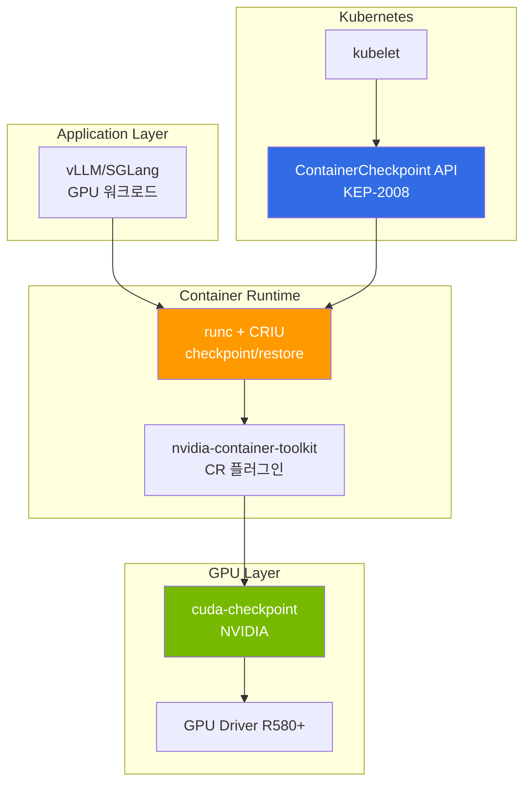

:::caution Experimental / Research Preview
2026.04 기준, GPU CRIU는 NVIDIA cuda-checkpoint + CRIU + runc 통합이 alpha/beta 상태이며 프로덕션 투입 불가. 본 문서는 기술 동향과 검증 체크리스트 제공 목적이다.
:::

# CRIU 기반 GPU 무중단 마이그레이션 (Preview)

## 1. 왜 CRIU인가: Spot reclaim과 KV cache 손실 문제

### 문제 상황

대형 LLM 서빙 환경에서 Spot 인스턴스 사용은 비용 절감의 핵심 전략입니다(85-94% 절감). 그러나 Spot reclaim 발생 시 다음과 같은 문제가 발생합니다:

**p5en.48xlarge H200×8 환경의 GLM-5 (744B MoE) 사례:**

| 항목 | 시간 | 비고 |
|------|-----|------|
| Spot reclaim 경고 | 2분 | AWS가 제공하는 유일한 시간 |
| 모델 재로딩 시간 | 15-20분 | 744B 파라미터 가중치 로드 |
| KV Cache 워밍업 | 5-10분 | 주요 prefix 재생성 |
| **총 복구 시간** | **22-32분** | 긴급 요청 처리 불가 |
| **비용** | $40-65/reclaim | p5en 시간당 ~$120 기준 |

**Spot reclaim의 근본적 한계:**

```
Spot reclaim 경고 (2분)
  ↓
  ├─ gracefulShutdown (1-2분) — 진행 중 요청 완료
  ├─ 모델 언로드 (30초-1분) — 메모리 해제
  └─ Pod 종료
       ↓
  새 노드 프로비저닝 (3-5분)
       ↓
  모델 재로딩 (15-20분) ← 병목
       ↓
  KV Cache 워밍업 (5-10분) ← 병목
       ↓
  서빙 재개 (총 25-37분)
```

### 기존 대안의 한계

| 대안 | 장점 | 한계 |
|------|------|------|
| **Warm Replica** | 즉시 전환 가능 | GPU 2배 비용 ($240/hr → $480/hr) |
| **llm-d KV Offload** | KV Cache만 네트워크 전송 | 모델 재로딩은 여전히 필요 |
| **On-Demand fallback** | 안정적 | Spot 대비 10배 비용 |
| **Multi-AZ 분산** | AZ 장애 대응 | Spot reclaim 자체는 해결 불가 |

### CRIU가 해결하려는 핵심 문제

CRIU(Checkpoint/Restore In Userspace)는 실행 중인 프로세스의 **전체 상태**를 디스크로 저장(checkpoint)하고, 다른 노드에서 그 시점부터 재개(restore)할 수 있게 합니다.

**GPU 워크로드에 적용 시 기대 효과:**

```
Spot reclaim 경고 (2분)
  ↓
  CRIU checkpoint (1-2분) — GPU 메모리 + 프로세스 상태 dump
  ↓
  새 노드 프로비저닝 (3-5분)
  ↓
  CRIU restore (1-3분) ← 모델 재로딩 생략
  ↓
  서빙 재개 (총 5-10분, 70-80% 단축)
```

**절감 효과:**

- **복구 시간**: 25-37분 → 5-10분 (70-80% 단축)
- **비용**: reclaim당 $40-65 → $10-20 (50-70% 절감)
- **SLA**: 긴급 요청을 22분 대신 5분 안에 처리 가능

---

## 2. 기술 스택 현황 (2026.04)

### 전체 아키텍처



### 핵심 컴포넌트 성숙도

| 컴포넌트 | 버전 | 상태 | 비고 |
|---------|------|------|------|
| **CRIU** | v4.0+ | Stable | CPU 워크로드는 프로덕션 검증 |
| **cuda-checkpoint** | alpha/beta | **Experimental** | NVIDIA 공식 도구, GPU 메모리 dump |
| **nvidia-container-toolkit** | v1.17+ | Beta | CR(checkpoint/restore) 플러그인 포함 |
| **runc** | v1.2+ | Alpha | CRIU 통합, GPU CR 지원 |
| **K8s ContainerCheckpoint API** | 1.30 alpha | **Alpha** | KEP-2008, feature gate 필요 |
| **EKS 지원** | - | **미지원** | 자체 검증 필요 |

:::warning 성숙도 경고
- **cuda-checkpoint**: NVIDIA Labs 프로젝트로 beta 이하. 공식 지원 없음
- **K8s API**: 1.30 alpha, 1.34까지 beta 예상. GA는 1.35+ 전망
- **EKS**: ContainerCheckpoint API가 feature gate이므로 EKS에서 활성화 여부 불명확
- **프로덕션 사례**: 공개된 GPU CRIU 프로덕션 사례 없음 (2026.04 기준)
:::

### 기술 스택 상세

#### CRIU (Checkpoint/Restore In Userspace)

- **역할**: 리눅스 프로세스의 메모리, 파일 디스크립터, 네트워크 소켓, 스레드 상태를 checkpoint
- **GPU 제약**: 기본적으로 GPU 메모리를 인식하지 못함 → cuda-checkpoint 필요
- **성숙도**: CPU 워크로드는 10년+ 역사로 안정적. Docker/Podman도 사용

#### cuda-checkpoint (NVIDIA)

- **GitHub**: [NVIDIA/cuda-checkpoint](https://github.com/NVIDIA/cuda-checkpoint)
- **역할**: CUDA context, GPU 메모리(device memory), unified memory를 dump/restore
- **제약사항**:
  - H100/H200: device memory 최대 80GB/141GB → checkpoint 파일 크기 동일
  - PCIe BAR 재매핑: 동일 GPU UUID 노드로만 restore 가능
  - NVLink topology 고정: 멀티 GPU 워크로드는 동일 토폴로지 필요
  - CUDA 버전 일치: checkpoint/restore 시 동일 CUDA 버전 필수

#### nvidia-container-toolkit CR 플러그인

- **역할**: containerd/runc가 GPU 컨테이너를 checkpoint/restore할 때 cuda-checkpoint를 자동 호출
- **설정**: `/etc/nvidia-container-runtime/config.toml`에서 `checkpoint-restore = true`
- **현황**: v1.17+에서 experimental 지원

#### K8s ContainerCheckpoint API (KEP-2008)

```yaml
# K8s 1.30+ (alpha, feature gate 필요)
apiVersion: v1
kind: Pod
metadata:
  name: vllm-pod
spec:
  enableServiceLinks: false
  containers:
  - name: vllm
    image: vllm/vllm-openai:latest
    # checkpoint 대상 컨테이너
```

**checkpoint 생성:**

```bash
kubectl checkpoint create <pod-name> \
  --container=vllm \
  --output=/var/lib/kubelet/checkpoints/vllm-ckpt.tar
```

**restore (새 노드에서):**

```bash
kubectl apply -f pod-restore.yaml  # checkpoint 경로 참조
```

:::caution K8s API 제약
- 1.30: alpha, feature gate `ContainerCheckpoint=true` 필요
- EKS Auto Mode: feature gate 제어 불가 → 사용 불가
- EKS Standard Mode: kube-apiserver/kubelet flag 수정 필요
:::

---

## 3. GPU 상태 checkpoint의 근본 제약

### Device Memory Dump 크기

| GPU | VRAM | checkpoint 파일 크기 | 전송 시간 (10GbE) | 전송 시간 (100GbE) |
|-----|------|-------------------|-----------------|------------------|
| A100 40GB | 40GB | ~40GB | 32초 | 3.2초 |
| H100 80GB | 80GB | ~80GB | 64초 | 6.4초 |
| H200 141GB | 141GB | ~141GB | 113초 | 11.3초 |
| H200 x8 | 1,128GB | ~1,128GB | **15분** | **1.5분** |

:::warning 네트워크 병목
p5en.48xlarge (H200×8)의 checkpoint는 **1.1TB**입니다. 노드 간 전송이 필요한 경우:
- 10GbE: 15분 (Spot reclaim 2분 내 불가능)
- 100GbE: 1.5분 (Spot reclaim 2분 내 가능, but ENA 제약)
- **실질적으로 노드 간 migrate는 불가능**, 동일 노드 재시작만 현실적
:::

### PCIe BAR 재매핑 제약

GPU는 PCIe Base Address Register(BAR)를 통해 CPU와 통신합니다. checkpoint 시 저장된 BAR 주소는 **하드웨어 종속적**이므로 다음 제약이 있습니다:

| 시나리오 | 가능 여부 | 이유 |
|---------|---------|------|
| 동일 노드 재시작 | ✅ | 동일 PCIe 슬롯, 동일 BAR 주소 |
| 동일 인스턴스 타입 (동일 AZ) | ⚠️ Experimental | GPU UUID 일치 보장 어려움 |
| 동일 인스턴스 타입 (Cross-AZ) | ❌ | PCIe 토폴로지 상이 |
| 이기종 (H200→H100) | ❌ | 아키텍처·메모리 크기 상이 |

### NVLink Topology 고정

멀티 GPU 워크로드(TP=4, TP=8)는 GPU 간 NVLink 연결 구조에 의존합니다. checkpoint는 **GPU 인덱스와 NVLink 토폴로지를 절대 경로로 저장**하므로:

```
Original:
  GPU 0 <--NVLink--> GPU 1
  GPU 2 <--NVLink--> GPU 3

Restore on different topology:
  GPU 0 <--PCIe--> GPU 1  ← NVLink 끊김
  GPU 2 <--NVLink--> GPU 3
  → Tensor Parallelism 통신 실패
```

**결론**: TP>1 워크로드는 **동일 NVLink 구성 노드로만** restore 가능

### CUDA Context 버전 일치

- **CUDA Runtime 버전**: checkpoint/restore 시 동일 CUDA 버전 필수 (12.2 ↔ 12.3 불가)
- **Driver ABI 호환성**: GPU 드라이버 메이저 버전 일치 필요 (R580 ↔ R570 불가)
- **AMI 고정**: EKS Auto Mode는 드라이버 버전 제어 불가 → Karpenter + Custom AMI 필요

---

## 4. EKS 적용 시나리오 매트릭스

### 시나리오별 실현 가능성

| 시나리오 | 실현 가능성 | 복잡도 | 비고 |
|---------|-----------|-------|------|
| **(a) 동일 노드 재시작** | ✅ Ready | 중간 | OS 업데이트, kubelet 재시작 |
| **(b) 동일 인스턴스 타입 migrate** | ⚠️ Experimental | 높음 | GPU UUID 일치 보장 어려움 |
| **(c) 이기종 migrate (H200↔H100)** | ❌ Blocked | - | 아키텍처 상이 |
| **(d) Cross-AZ migrate** | ❌ Blocked | - | NIXL 권장 |

### (a) 동일 노드 재시작 — Ready

**Use Case:**
- Spot reclaim 없이 노드 OS 업데이트
- kubelet/containerd 재시작
- GPU 드라이버 업데이트 (동일 메이저 버전)

**절차:**

```bash
# 1. Checkpoint 생성
kubectl checkpoint create gpu-pod-1 \
  --container=vllm \
  --output=/mnt/efs/checkpoints/vllm-$(date +%s).tar

# 2. 노드 유지보수
kubectl drain <node> --ignore-daemonsets
# ... OS 업데이트, 드라이버 업데이트
kubectl uncordon <node>

# 3. Restore
kubectl apply -f vllm-pod-restore.yaml
```

**제약사항:**
- EFS/FSx에 checkpoint 저장 필수 (로컬 디스크는 재시작 시 삭제)
- 동일 GPU 인덱스(CUDA_VISIBLE_DEVICES) 유지 필요
- kubelet feature gate `ContainerCheckpoint=true` 필요 (EKS Standard)

**예상 효과:**
- 재시작 시간: 20-30분 → 3-5분 (80-85% 단축)
- 유지보수 윈도우: 1시간 → 10분

### (b) 동일 인스턴스 타입 migrate — Experimental

**Use Case:**
- Spot reclaim 시 동일 인스턴스 타입 노드로 이관
- 노드 교체 (하드웨어 장애)

**전제 조건:**
- 동일 인스턴스 타입 (p5en.48xlarge → p5en.48xlarge)
- 동일 AZ (us-east-2a → us-east-2a)
- **동일 GPU UUID** — AWS가 보장하지 않음 ⚠️

**GPU UUID 사전 확인:**

```bash
# 모든 p5en 노드의 GPU UUID 수집
kubectl get nodes -l node.kubernetes.io/instance-type=p5en.48xlarge \
  -o json | jq '.items[].metadata.labels["nvidia.com/gpu.uuid"]'
```

**NodePool 제약:**

```yaml
apiVersion: karpenter.sh/v1
kind: NodePool
metadata:
  name: gpu-checkpoint-pool
spec:
  template:
    spec:
      requirements:
        - key: node.kubernetes.io/instance-type
          operator: In
          values: ["p5en.48xlarge"]  # 단일 타입 고정
        - key: topology.kubernetes.io/zone
          operator: In
          values: ["us-east-2a"]  # 단일 AZ 고정
        # GPU UUID 일치 보장 불가능 — AWS API 미지원
```

**문제점:**
- AWS는 GPU UUID 사전 예약 API 미제공
- checkpoint/restore 실패 시 fallback으로 cold start 필요
- Spot reclaim 2분 내 checkpoint + 네트워크 전송 + restore 불가능

**결론:** 기술적으로 가능하나 **실전 운영 불가**. 검증 환경 실험 용도

### (c) 이기종 migrate (H200↔H100) — Blocked

**불가능한 이유:**
- GPU 아키텍처 상이 (Hopper vs Ada)
- VRAM 크기 상이 (141GB vs 80GB)
- CUDA Compute Capability 상이 (9.0 vs 8.0)
- cuda-checkpoint가 아키텍처 간 변환 미지원

### (d) Cross-AZ migrate — Blocked

**Use Case:**
- AZ 장애 시 다른 AZ로 이관

**대안: llm-d NIXL KV Offload**

Cross-AZ GPU 워크로드 이관은 CRIU 대신 **llm-d NIXL**이 더 적합합니다:

```
AZ-A:
  Prefill Pod → KV Cache를 AZ-B로 NIXL 전송

AZ-B:
  Decode Pod ← KV Cache 수신 → 모델은 이미 로드된 상태
```

| 항목 | CRIU | llm-d NIXL |
|------|------|-----------|
| 전송 데이터 | 전체 GPU 메모리 (1TB+) | KV Cache만 (수십 GB) |
| 전송 시간 | 15분+ | 수 초 |
| 모델 재로딩 | 불필요 | 필요 (but Decode Pod는 이미 로드) |
| 네트워크 | 10GbE → 병목 | RDMA/NVLink → 초고속 |

**상세**: [llm-d EKS Auto Mode — Disaggregated Serving](../inference-frameworks/llm-d-eks-automode.md#disaggregated-serving-개념)

---

## 5. 실전 대안과 조합 전략

### 대안 비교표

| 전략 | 복구 시간 | 비용 | 복잡도 | 성숙도 | 권장 |
|------|---------|-----|-------|-------|:----:|
| **Warm Replica** | 즉시 | 2배 | 낮음 | 프로덕션 | ⭐⭐⭐ |
| **llm-d NIXL KV Offload** | 5-10분 | 1배 | 중간 | GA | ⭐⭐⭐⭐ |
| **vLLM Prefix Cache Warm-up** | 10-15분 | 1배 | 낮음 | GA | ⭐⭐⭐ |
| **Karpenter do-not-evict** | - | Spot 불가 | 낮음 | GA | ⭐⭐ |
| **2-replica Hot Standby** | 1-2분 | 2배 | 낮음 | 프로덕션 | ⭐⭐⭐⭐⭐ |
| **CRIU (동일 노드)** | 3-5분 | 1배 | 높음 | Experimental | ⭐ |
| **CRIU (Cross-node)** | 불가능 | - | - | Blocked | ❌ |

### llm-d NIXL KV Offload

llm-d의 Disaggregated Serving은 Prefill/Decode를 분리하고, KV Cache를 NIXL로 전송합니다. Spot reclaim 시:

```
Prefill Pod (Spot, p5en.48xlarge):
  - Spot reclaim 경고 → checkpoint KV Cache to S3/FSx (수 초)
  - Pod 종료

Decode Pod (On-Demand, p5.48xlarge):
  - 기존 모델 계속 서빙
  - Prefill 없이 decode만 수행 (일시적 TTFT 증가)

새 Prefill Pod:
  - KV Cache를 S3/FSx에서 복구 (5-10초)
  - 서빙 재개
```

**장점:**
- Decode Pod는 중단 없음
- Prefill 복구만 5-10초
- 모델 재로딩 불필요

**단점:**
- TTFT가 일시적으로 증가 (Prefill Pod 복구 중)

**상세**: [llm-d EKS Auto Mode](../inference-frameworks/llm-d-eks-automode.md)

### vLLM Prefix Cache Warm-up

vLLM v0.18+는 자동 prefix caching을 지원합니다. Spot reclaim 전 주요 prefix를 미리 처리하여 캐시를 워밍업할 수 있습니다:

```python
# warm-up 스크립트
prefixes = [
    "You are a helpful assistant...",
    "Analyze the following document...",
    # ... 주요 시스템 프롬프트
]

for prefix in prefixes:
    client.completions.create(
        model="gpt-4",
        prompt=prefix,
        max_tokens=1  # 최소 생성으로 캐시만 워밍업
    )
```

**장점:**
- vLLM 기본 기능, 별도 도구 불필요
- Spot reclaim 후 주요 prefix는 빠른 응답

**단점:**
- 모델 재로딩은 여전히 15-20분 필요
- 전체 KV Cache 복구는 불가능

### Karpenter do-not-evict

Karpenter의 `do-not-evict` annotation으로 특정 Pod를 Spot reclaim 대상에서 제외할 수 있습니다:

```yaml
apiVersion: v1
kind: Pod
metadata:
  annotations:
    karpenter.sh/do-not-evict: "true"
spec:
  # ... GPU Pod 정의
```

**장점:**
- 중단 없음

**단점:**
- Spot 인스턴스를 On-Demand처럼 사용 → 비용 이점 상실
- AWS Spot reclaim 자체는 막을 수 없음 (annotation은 Karpenter의 자발적 consolidation만 제어)

### 2-replica Hot Standby (권장)

프로덕션 환경에서 가장 안정적인 전략은 **2개 replica 운영**입니다:

```yaml
apiVersion: apps/v1
kind: Deployment
metadata:
  name: vllm-serving
spec:
  replicas: 2  # 최소 2개 유지
  template:
    spec:
      containers:
      - name: vllm
        # ... 동일 모델 서빙
      affinity:
        podAntiAffinity:
          requiredDuringSchedulingIgnoredDuringExecution:
          - labelSelector:
              matchLabels:
                app: vllm-serving
            topologyKey: kubernetes.io/hostname  # 다른 노드에 배치
```

**비용:**
- 2대 운영 시 비용 2배 → Spot 사용 시 **On-Demand 1대와 비슷한 비용**
- p5.48xlarge Spot $12/hr × 2 = $24/hr vs On-Demand $98/hr × 1

**장점:**
- 1개 replica Spot reclaim 시 나머지 1개가 트래픽 처리
- 복구 중 서비스 중단 없음
- 로드 밸런싱으로 처리량 2배

**단점:**
- GPU 2배 사용 (but Spot으로 On-Demand 1대 수준 비용)

### 조합 전략

현실적인 최적 구성은 **2-replica Hot Standby + llm-d NIXL**입니다:

```
┌─────────────────────┐
│ llm-d Gateway       │
│ (KV Cache-aware LB) │
└──────────┬──────────┘
           │
    ┌──────┴───────┐
    │              │
┌───▼───┐      ┌───▼───┐
│Replica│      │Replica│
│   1   │      │   2   │
│ Spot  │      │ Spot  │
│p5.48x │      │p5.48x │
└───────┘      └───────┘
  다른 AZ        다른 AZ

Replica 1 Spot reclaim:
  → llm-d가 Replica 2로 트래픽 전환
  → KV Cache는 NIXL로 공유 (필요 시)
  → Replica 1 복구 (15분) 중에도 서비스 정상
```

**장점:**
- 서비스 무중단
- KV Cache 재사용으로 TTFT 단축
- Spot 활용으로 비용 효율적

---

## 6. 로드맵과 검증 포인트

### CNCF/Kubernetes 커뮤니티 동향

| 시기 | 주요 이정표 | 상태 |
|------|-----------|------|
| K8s 1.30 | ContainerCheckpoint API alpha | 완료 (2024.04) |
| K8s 1.32 | ContainerCheckpoint API beta | 예상 (2024.12) |
| K8s 1.34 | ContainerCheckpoint API GA | 예상 (2025.08) |
| K8s 1.35 | GPU checkpoint 공식 지원 | 희망 (2026.02) |
| **2026.04** | **현재 위치** | **Alpha/Beta 혼재** |

:::info CNCF WG 활동
CNCF Batch Working Group과 AI Working Group에서 GPU checkpoint를 논의 중입니다. 그러나 공식 KEP는 아직 없으며, nvidia-container-toolkit의 실험적 구현만 존재합니다.
:::

### 자체 검증 체크리스트

CRIU GPU checkpoint를 실험하려면 다음 체크리스트를 확인하세요:

#### 인프라 요구사항

- [ ] **EKS Standard Mode** — Auto Mode는 feature gate 제어 불가
- [ ] **K8s 1.30+** — ContainerCheckpoint API 필요
- [ ] **kubelet feature gate** — `ContainerCheckpoint=true`
- [ ] **GPU Driver R580+** — cuda-checkpoint 호환 버전
- [ ] **Custom AMI** — 드라이버 버전 고정 필요
- [ ] **EFS/FSx 마운트** — checkpoint 파일 저장 (HDD는 느림, SSD 권장)

#### 소프트웨어 스택

- [ ] **runc v1.2+** — CRIU 통합 버전
- [ ] **CRIU v4.0+** — GPU 지원 빌드
- [ ] **cuda-checkpoint beta** — NVIDIA Labs에서 다운로드
- [ ] **nvidia-container-toolkit v1.17+** — CR 플러그인 활성화
- [ ] **동일 CUDA 버전** — checkpoint/restore 노드 일치

#### 노드 설정

- [ ] **NodePool 단일 인스턴스 타입** — 이기종 불가
- [ ] **단일 AZ** — Cross-AZ 불가
- [ ] **GPU UUID 수집** — 사전 매핑 테이블 작성
- [ ] **NVLink 토폴로지 일치** — 멀티 GPU 시 필수

#### 테스트 시나리오

1. **동일 노드 재시작 테스트** (Low Risk)
   - 테스트 Pod checkpoint/restore
   - 모델 로딩 시간 vs checkpoint 시간 비교
   - 메모리 무결성 검증 (inference 결과 동일성)

2. **동일 인스턴스 타입 migrate 테스트** (High Risk)
   - GPU UUID 수동 매핑
   - checkpoint 네트워크 전송
   - restore 성공률 측정
   - 실패 시 fallback 절차 검증

3. **Spot reclaim 시뮬레이션** (Production Readiness)
   - 2분 타이머로 강제 checkpoint
   - 복구 시간 측정
   - SLA 영향 분석

### 검증 실패 시 조치

| 실패 유형 | 조치 |
|---------|------|
| checkpoint 생성 실패 | cuda-checkpoint 로그 확인, GPU 드라이버 버전 검증 |
| restore 실패 (GPU UUID 불일치) | 동일 노드로만 restore, NodePool 재설계 |
| restore 실패 (CUDA 버전 불일치) | AMI 버전 고정, 드라이버 업데이트 금지 |
| Spot reclaim 2분 내 미완료 | checkpoint 크기 축소, 네트워크 대역폭 확대, 또는 CRIU 포기 |
| 성능 저하 | CRIU overhead 측정, warm-up 시간 고려 |

---

## 참고 자료

- **CRIU 공식 문서**: [criu.org](https://criu.org/)
- **NVIDIA cuda-checkpoint GitHub**: [github.com/NVIDIA/cuda-checkpoint](https://github.com/NVIDIA/cuda-checkpoint)
- **K8s KEP-2008**: [ContainerCheckpoint API](https://github.com/kubernetes/enhancements/tree/master/keps/sig-node/2008-forensic-container-checkpointing)
- **nvidia-container-toolkit CR 플러그인**: [NVIDIA Container Toolkit Docs](https://docs.nvidia.com/datacenter/cloud-native/container-toolkit/latest/)
- **llm-d NIXL**: [llm-d GitHub](https://github.com/llm-d/llm-d) — KV Cache 네트워크 전송 대안

## 관련 문서

- [EKS GPU 노드 전략](./eks-gpu-node-strategy.md) — Spot/On-Demand 전략, 비용 최적화
- [GPU 리소스 관리](./gpu-resource-management.md) — Karpenter 오토스케일링
- [llm-d EKS Auto Mode](../inference-frameworks/llm-d-eks-automode.md) — Disaggregated Serving + NIXL KV Offload
- [vLLM 모델 서빙](../inference-frameworks/vllm-model-serving.md) — Prefix Cache, KV Cache 관리
