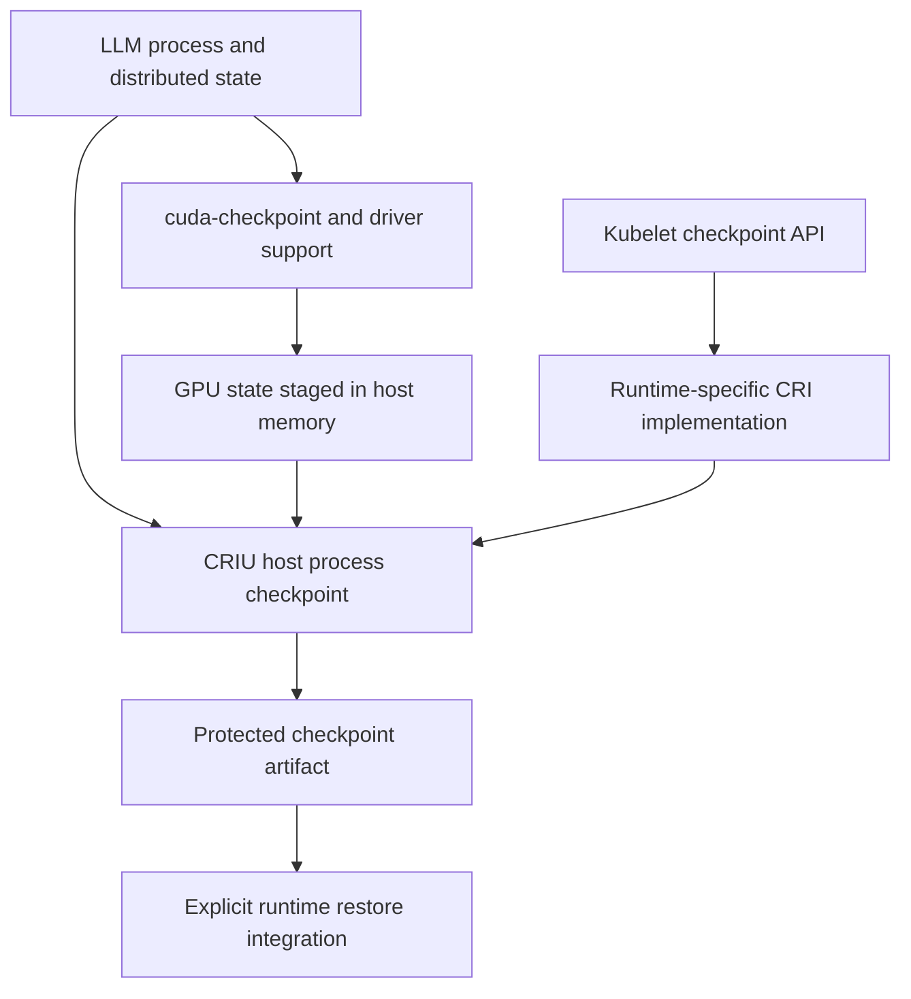

:::caution Experimental / Verification pending
이 문서는 GPU checkpoint/restore의 기술 제약과 운영자가 검증할 절차를 설명합니다. NVIDIA 기능·Kubernetes API의 지원 범위와 특정 EKS/LLM 배포의 운영 승인은 별개입니다. 이 검토에서는 GPU 실행, drain, Spot 중단, 부하 시험을 수행하지 않았습니다. 과거 초안의 복구 시간·비용·절감률은 검증 자료가 없어 삭제했습니다.

운영 검증 추적: [Issue #7](https://github.com/devfloor9/engineering-playbook/issues/7). 공개 자료 검토일: 2026-09-18.
:::

## 배경: Spot reclaim과 KV cache 손실 문제

Spot 종료 전에 요청을 안전하게 이동하려면 노드 프로세스 상태와 서비스 가용성을 별도로 설계해야 합니다.

### 문제 상황

EC2 Spot의 stop/terminate 알림은 통상 중단 약 2분 전에 제공되지만 best effort입니다. hibernation은 즉시 시작할 수 있습니다. 2분을 보장된 drain 예산으로 사용하지 않습니다. 모델 로딩·prefill·노드 준비 시간은 모델/가중치 형식/스토리지/드라이버/분산 구성을 고정해 측정해야 합니다.

### 기존 대안의 한계

| 대안 | 보존하는 것 | 남는 제약 |
|---|---|---|
| Warm replica | 이미 준비된 별도 서빙 용량 | 여유 처리량·장애 도메인·비용 검증 |
| KV 전송/외부 캐시 | 지원 connector의 KV block | 프로세스/진행 중 stream 전체 복원 아님 |
| On-Demand 용량 | Spot 회수 노출 감소 | 용량·모델 준비 시간·일반 장애 |
| Multi-AZ | 일부 장애 도메인 분리 | 동시 회수·네트워크·가용 용량 |

### CRIU가 해결하려는 핵심 문제

CRIU는 지원되는 Linux 프로세스 상태를 저장합니다. GPU 상태는 NVIDIA driver의 checkpoint 기능과 연동해야 하며 host RAM·외부 소켓·파일·분산 통신 상태까지 검토해야 합니다. checkpoint+전송+restore가 cold start보다 빠르다는 보장은 없습니다. 서비스 무중단은 준비된 다른 replica와 요청 처리 정책의 속성입니다.

## 기술 스택 검토 (2026-09-18) {#기술-스택-현황-202604}

2026-09-18 공개 자료 기준으로 기존 2026.04 서술을 재검토했습니다. 아래 설명은 버전별 기능 확인이며 해당 workload의 운영 승인 상태는 아닙니다.

### 전체 아키텍처

다음은 개념 연결입니다. 자동 동작하는 표준 Kubernetes GPU migration controller를 뜻하지 않습니다.


```mermaid
flowchart TB
    APP[LLM process and distributed state] --> CRIU[CRIU host process checkpoint]
    APP --> CUDA[cuda-checkpoint and driver support]
    CUDA --> HOST[GPU state staged in host memory]
    HOST --> CRIU
    KUBELET[Kubelet checkpoint API] --> CRI[Runtime-specific CRI implementation]
    CRI --> CRIU
    CRIU --> ARTIFACT[Protected checkpoint artifact]
    ARTIFACT --> RESTORE[Explicit runtime restore integration]
```

### 핵심 컴포넌트 성숙도

| 컴포넌트 | 확인된 범위 | 운영자가 고정할 항목 |
|---|---|---|
| CRIU | Linux process checkpoint/restore | CRIU·kernel·runtime build와 지원 기능 |
| cuda-checkpoint | driver별 기능: 550 기반, 570 API, 580 migration 기능 | utility commit/SHA256·driver·CUDA 및 해당 release note |
| ContainerCheckpoint | Kubernetes 1.30 beta (기본 활성화) | 배포 Kubernetes·CRI와 checkpoint 지원 |
| 복원 | checkpoint API와 별도 runtime 절차 | artifact 형식·restore 도구·동작 증거 |
| EKS Auto Mode | AWS가 OS·kubelet·runtime·AMI 관리 | 관리 경계 안에서 가능한 검증만 수행 |

### 기술 스택 상세

최소 버전만 맞춘다고 전체 LLM stack의 복원이 성립하지 않습니다. driver 기능, CRIU 연동, CRI checkpoint, 분산 런타임을 각각 확인합니다.

#### CRIU (Checkpoint/Restore In Userspace)

CRIU 자체가 모든 NVIDIA device 상태를 처리하는 것은 아닙니다. CUDA 상태를 host에 보존하고 장치 자원을 해제하는 NVIDIA 측 절차와 host process checkpoint를 조합해야 합니다. checkpoint에는 민감한 메모리·토큰이 포함될 수 있어 암호화·접근 제어·보존 기간이 필요합니다.

#### cuda-checkpoint (NVIDIA)

[NVIDIA cuda-checkpoint README](https://github.com/NVIDIA/cuda-checkpoint)는 driver별 지원 범위를 구분하며 580에서 GPU migration 기능을 설명합니다. source→target GPU mapping과 해당 release의 device 호환 조건을 확인합니다. 검토한 README는 **UVM과 `cuMemExportToShareableHandle`을 미지원**으로 명시합니다. IPC 지원은 driver release별로 확인하고, 검증에 사용한 utility commit·binary hash·driver 버전을 기록합니다.

#### NVIDIA Container Toolkit 연동 경계 {#nvidia-container-toolkit-cr-플러그인}

기존 `checkpoint-restore = true` 및 “Toolkit 1.17+ CR 플러그인”을 범용 설정으로 사용할 공식 근거를 확인하지 못했습니다. 이를 실행 절차에서 제거했습니다. NVIDIA Container Toolkit의 GPU 노출 기능과 CRIU의 CUDA 연동을 구분하고 실제 runtime 통합 문서를 확인합니다.

#### K8s ContainerCheckpoint API (KEP-2008)

표준 인터페이스는 kubelet의 인증된 `POST /checkpoint/{namespace}/{pod}/{container}` 요청이며 timeout query를 받을 수 있습니다. 표준 `kubectl checkpoint create` 명령은 없습니다. checkpoint는 kubelet host에 artifact를 만들며 일반 Pod YAML에 경로를 넣는 것만으로 restore되지 않습니다. Runtime 지원과 kubelet 접근 권한이 필요합니다. GPU·InfiniBand 등 외부 장치의 복원 보장은 이 API 범위 밖입니다.

## GPU 상태 checkpoint의 근본 제약

checkpoint 크기·전송·복원은 실제 저장한 allocation과 host 상태로 결정됩니다. GPU 명목 VRAM 합계는 파일 크기의 측정값이 아닙니다.

### Device Memory Dump 크기

전송 시간의 물리적 하한은 `8 × bytes / bits_per_second`입니다. 예를 들어 1,128 GB(십진)를 전송한다고 **가정**하면 10 Gbit/s에서 902.4초, 100 Gbit/s에서 90.24초입니다. dump·restore·CPU copy·스토리지·프로토콜 overhead와 대역폭 경쟁을 포함하지 않은 산술 예시입니다. 90.24초라는 하한만으로 Spot 예산 내 완료를 승인할 수 없습니다.

### PCIe BAR 재매핑 제약

BAR 주소나 AZ가 같다는 조건만으로 지원 여부를 결정하지 않습니다. NVIDIA가 지원하는 device mapping·대상 GPU 속성·driver 조건과 runtime restore 방식을 검증해야 합니다. GPU UUID는 장치 식별자이며 다른 인스턴스에서 동일 UUID를 예약할 필요 조건으로 제시하지 않습니다.

### NVLink Topology 고정

Tensor/pipeline parallel workload는 모든 rank, NCCL communicator, CUDA IPC, RDMA registration, 외부 peer 상태를 함께 검토해야 합니다. topology가 같아도 복원이 보장되지 않습니다. 단일 CUDA process 예제를 다중 GPU/노드 LLM의 승인으로 확대하지 않습니다.

### CUDA Context 버전 일치

source/target의 kernel, AMI, CUDA runtime, driver, utility, CRIU, runtime 및 GPU 속성을 기록합니다. 호환 범위는 고정한 release 문서와 실제 결과로 결정합니다. Auto Mode에서는 사용자 custom AMI·driver pin·CRI-O 교체를 운영 옵션으로 제시하지 않습니다.

## EKS 적용 시나리오 매트릭스

이 매트릭스의 승인 상태는 모두 운영 증거 대기입니다. 장소·인스턴스 이름만으로 Ready/Blocked를 판정하지 않습니다.

### 시나리오별 실현 가능성

| 시나리오 | 문서상 판단 | 필요한 증거 |
|---|---|---|
| 동일 host | 검증 후보 | 종료 후 artifact 보존·process/장치 복원 |
| 동일 GPU 구성의 다른 host | 버전 의존 후보 | device mapping·네트워크·분산 상태 |
| 다른 GPU SKU | 호환성 검증 필요 | NVIDIA release 조건·메모리·kernel 지원 |
| Cross-AZ | AZ 자체가 금지 조건은 아님 | 대역폭·지연·비용·스토리지·application 복구 |
| Auto Mode | host stack 변경 불가 | AWS 관리 경계 및 지원 확인; 표준 migration 절차로 제시하지 않음 |

### (a) 동일 노드 재시작 — 검증 대기 {#a-동일-노드-재시작--ready}

기존 Ready 표기는 철회합니다. 동일 host 재시작도 driver reset, storage lifetime, 외부 연결 및 workload 무결성 검증이 필요합니다. 인스턴스 reboot와 종료는 다르며 모든 로컬 디스크가 reboot 때 삭제된다고 단정하지 않습니다. 종료되는 host 밖에 복구에 필요한 artifact를 보존합니다.

### (b) 동일 인스턴스 타입 migrate — Experimental

동일 인스턴스 타입은 구성 비교를 단순화할 뿐 성공 조건이 아닙니다. GPU UUID를 source→target으로 매핑하고 checkpoint·전송·restore·cold-start fallback을 별도로 검증합니다. 단일 AZ 고정은 용량 선택지를 줄이므로 요구사항으로 일반화하지 않습니다.

### (c) 이기종 migrate (H200↔H100) — 호환성 검증 {#c-이기종-migrate-h200h100--blocked}

H100과 H200은 모두 Hopper 계열이며 compute capability 9.0입니다. 기존 Hopper/Ada·9.0/8.0 비교는 잘못되었습니다. 이것이 SKU 간 복원을 보장하지는 않습니다. GPU migration 지원 조건, 메모리 용량 및 사용 API를 고정한 NVIDIA 문서로 확인해야 합니다.

### (d) Cross-AZ Migration — Verification Pending {#d-cross-az-migrate--blocked}

AZ 경계만으로 CRIU가 금지되거나 NIXL 전송이 수 초에 완료된다고 판단하지 않습니다. NIXL은 데이터 전송 계층이며 NVLink가 AZ 사이에 연결되는 것이 아닙니다. Cross-AZ 경로·보안·대역폭·전송 비용과 모델이 준비된 대상 replica를 확인합니다.

## 실전 대안과 조합 전략

복구 전략은 서비스 SLO, 중복 용량, cache 호환성과 운영 가능성으로 선택합니다. 고정된 복구 시간이나 무중단을 보장하지 않습니다.

### 대안 비교표

| 전략 | 확인할 조건 |
|---|---|
| 준비된 replica | 잔존 replica의 부하 수용, failure-domain 분리 |
| Prefix warm-up | 새 replica 모델 준비 후 승인된 prefix 재계산 |
| Disaggregated serving | 실제 connector·routing·decode의 KV 보유 및 대체 prefill |
| CRIU | 지원 stack, artifact 보존, 복원 무결성, 실패 시 cold start |

### llm-d NIXL KV 전송 {#llm-d-nixl-kv-offload-v07-cncf-sandbox}

llm-d/vLLM의 prefill/decode 분리와 NIXL 전송은 자동 S3 checkpoint 기능을 의미하지 않습니다. decode가 이미 받은 KV로 기존 생성을 이어갈 수 있는지는 connector·rank 상태에 달려 있습니다. 새 요청은 사용 가능한 prefill 경로가 필요합니다. prefill Pod 손실 뒤 모델 로딩이 사라지는 것도 아닙니다. 별도 외부 KV cache를 구성했다면 보존·버전 호환·실패 정책을 따로 검증합니다.

### vLLM Prefix Cache Warm-up

vLLM automatic prefix caching은 같은 prefix의 prefill 계산을 재사용합니다. 기본 in-memory cache는 process 종료 시 사라집니다. 종료 예정 replica에서 warm-up해도 새 replica에 전달되지 않습니다. 새 replica의 모델이 로드된 뒤 승인된 고정 prefix를 처리하고 TTFT와 cache hit을 확인합니다. 진행 중 generation 상태·KV 전체 복원과 구분합니다. 이 검토에서는 warm-up 호출을 실행하지 않았습니다.

### Karpenter do-not-disrupt {#karpenter-do-not-evict}

현재 Karpenter annotation은 `karpenter.sh/do-not-disrupt`입니다. 자발적 disruption을 제어하며 EC2 Spot 회수·노드 장애를 막지 못합니다. PDB나 긴 grace period도 EC2 종료 deadline을 연장하지 못합니다. pinned Karpenter 버전의 interruption 처리와 NodePool terminationGracePeriod를 확인합니다.

### 2-replica Hot Standby (권장)

replica 2개만으로 가용성이나 처리량 2배를 보장하지 않습니다. selector/label 일치, 서로 다른 node·장애 도메인, survivor의 용량, 모델 준비 상태, PDB, request routing을 검증합니다. 두 replica가 같은 Spot pool에서 동시에 사라지는 경우도 포함합니다. 비용은 실제 리전·용량 유형·준비 시간으로 계산합니다.

### 조합 전략

graceful drain + warm start의 권장 순서는 아래와 같습니다. 이는 **운영자 승인 후 실행할 절차**이며 실제 수행 기록이 아닙니다.

```text
PREPARE (before interruption)
  Pin model/runtime/config; provision or identify ready alternate capacity.
  Load replacement model; warm approved prefixes on that replica.
  Verify serving readiness, capacity, model identity, and routing.

ON INTERRUPTION / MAINTENANCE
  Record notice arrival and actual termination deadline; do not assume 120 s.
  Cordon prevents scheduling only; separately stop new application admission.
  Route new requests to the ready replacement; record endpoint propagation.
  Let admitted requests/streams finish within the remaining budget.
  Cancel or report incomplete requests explicitly at the deadline.
  Terminate after drain completion or budget exhaustion.

RECOVERY
  Replenish capacity; warm replacement prefixes after model load.
  Verify first-token latency, errors, cache hits, and survivor capacity.
  If no replacement is ready, use approved fallback or return explicit errors.
```

`preStop` 시간은 Pod `terminationGracePeriodSeconds`에 포함됩니다. 앱 drain 예산은 EC2 남은 시간·Pod grace·NodePool 종료 제한 중 최소값에서 전파 지연과 안전 여유를 뺀 값입니다. 수동 `kubectl drain --grace-period=X --timeout=Y --ignore-daemonsets`의 X는 Pod grace, Y는 CLI 대기 제한이며 서버 가용성 보장이 아닙니다. drain은 node의 여러 namespace에 영향을 주므로 대상 workload 전체·PDB를 기록합니다. Karpenter/Auto Mode가 이미 종료를 처리하면 독립 drain controller를 경쟁 실행하지 않습니다. `--force`, `--disable-eviction`, `--delete-emptydir-data`로 실패를 우회하지 않습니다.

## 로드맵과 검증 포인트

업스트림 지원과 실제 배포 검증을 분리하여 추적합니다. 버전 없는 “현재 tagged release 없음” 문구를 지원 상태로 사용하지 않습니다.

### Kubernetes·NVIDIA 지원 상태 검토 {#cncfkubernetes-커뮤니티-동향-2026-04-20-재검증}

공식 kubelet API 문서와 KEP 상태는 ContainerCheckpoint를 1.30부터 beta(기본 활성화)로 설명합니다. KEP의 stable 목표 milestone은 릴리스 완료 증거가 아닙니다. 이는 Kubernetes GPU live migration GA를 의미하지 않습니다. NVIDIA utility·driver·CRIU의 고정 commit/release를 함께 기록하고 변경 시 호환성 검토를 다시 수행합니다.

### 자체 검증 체크리스트

승인 결과는 아래 네 범주의 증거와 연결되어야 합니다. 로컬 정적 검사만으로 체크박스를 완료하지 않습니다.

#### 인프라 요구사항

- [ ] UTC 시험 기간, 비공개 account/profile/region·cluster·namespace·node manifest와 영향 범위를 기록합니다.
- [ ] Auto Mode인지 사용자 관리 GPU node인지 구분합니다. Auto Mode에서 runtime/AMI/driver 교체를 시도하지 않습니다.
- [ ] 복구 용량·스토리지 lifetime·네트워크·암호화·접근 제어 및 rollback 책임자를 확인합니다.

#### 소프트웨어 스택

- [ ] 모델 revision·tokenizer·가중치/quantization·TP/PP·serving engine·CUDA·NCCL·driver·kernel·CRI·CRIU·utility commit/hash를 고정합니다.
- [ ] 사용한 UVM/IPC/RDMA API와 release 지원 조건을 대조합니다.
- [ ] prefix cache, 외부 KV store, process checkpoint의 보존 범위를 구분합니다.

#### 노드 설정

- [ ] source/target GPU 속성·UUID mapping·topology·host RAM·artifact 크기와 전송 경로를 기록합니다.
- [ ] PDB·readiness·preStop·Pod/NodePool 종료 제한·interruption handler 소유자를 기록합니다.
- [ ] warm capacity 없음·동시 Spot 손실 시 fallback/오류 응답을 정의합니다.

#### 테스트 시나리오

1. 운영자 승인 환경에서 고정된 비민감 request fixture와 부하 조건을 기록합니다. 합성·로컬 검토와 실제 GPU 시험 결과를 구분합니다.
2. notice 수신, deadline, 신규 admission 중단, endpoint 전환, 마지막 stream 완료, SIGTERM/SIGKILL, 새 모델 준비, 첫 토큰 시각을 동일 UTC clock으로 기록합니다.
3. 요청 ID별 성공·취소·부분 응답·중복 실행을 대조합니다. KV가 전송·복구·재계산 중 무엇이었는지 cache 통계와 로그로 확인합니다.
4. warm/cold 경로의 TTFT p50/p95/p99, 오류율, drain 완료율, 미완료 수, 모델 준비 시간을 보고합니다. 최소 표본 수·반복 수·허용 degradation은 사전 승인합니다.
5. checkpoint 경로는 restore 무결성·분산 rank 정상성·실패 시 cold start를 추가 확인합니다. tagged release 변경은 새 검토 입력이며 자동 승인 조건이 아닙니다.

### 검증 실패 시 조치

deadline 초과나 복원 실패 시 검증된 replica로 전환하고 해당 checkpoint 재사용을 중지합니다. artifact·설정·로그를 접근 통제된 저장소에 보존합니다. 깨진 stream을 무조건 재실행하지 않으며 결과가 불명확한 tool 작업은 중복 방지 절차를 따릅니다. 운영자 승인과 비식별 증거가 연결되기 전 Experimental / Verification pending을 유지합니다.

## 참고 자료

다음 공식 자료의 기능 범위와 배포 버전을 함께 확인합니다.

- [NVIDIA cuda-checkpoint](https://github.com/NVIDIA/cuda-checkpoint) — driver-specific features and restrictions
- [Kubelet checkpoint API](https://kubernetes.io/docs/reference/node/kubelet-checkpoint-api/) — request interface and feature state
- [Kubernetes Pod termination](https://kubernetes.io/docs/concepts/workloads/pods/pod-lifecycle/#pod-termination) — grace period and preStop
- [EKS Auto Mode managed instances](https://docs.aws.amazon.com/eks/latest/userguide/automode-learn-instances.html) — OS/runtime ownership
- [EC2 Spot interruption notices](https://docs.aws.amazon.com/AWSEC2/latest/UserGuide/spot-instance-termination-notices.html) — notice timing
- [Karpenter disruption](https://karpenter.sh/docs/concepts/disruption/) — interruption and do-not-disrupt
- [NVIDIA CUDA GPU capabilities](https://developer.nvidia.com/cuda/gpus) — H100/H200 compute capability
- [vLLM automatic prefix caching](https://docs.vllm.ai/en/latest/features/automatic_prefix_caching/) — cache reuse semantics
- [vLLM disaggregated prefill](https://docs.vllm.ai/en/latest/features/disagg_prefill/) — connector-dependent KV transfer
- [NVIDIA Container Toolkit](https://docs.nvidia.com/datacenter/cloud-native/container-toolkit/latest/) — container integration

## 관련 문서

- [EKS GPU 노드 전략](./eks-gpu-node-strategy.md) — Spot/On-Demand 전략, 비용 최적화
- [GPU 리소스 관리](./gpu-resource-management.md) — Karpenter 오토스케일링
- [llm-d EKS Auto Mode](../inference-frameworks/llm-d-eks-automode.md) — Disaggregated Serving + NIXL KV Offload
- [vLLM 모델 서빙](../inference-frameworks/vllm-model-serving.md) — Prefix Cache, KV Cache 관리
