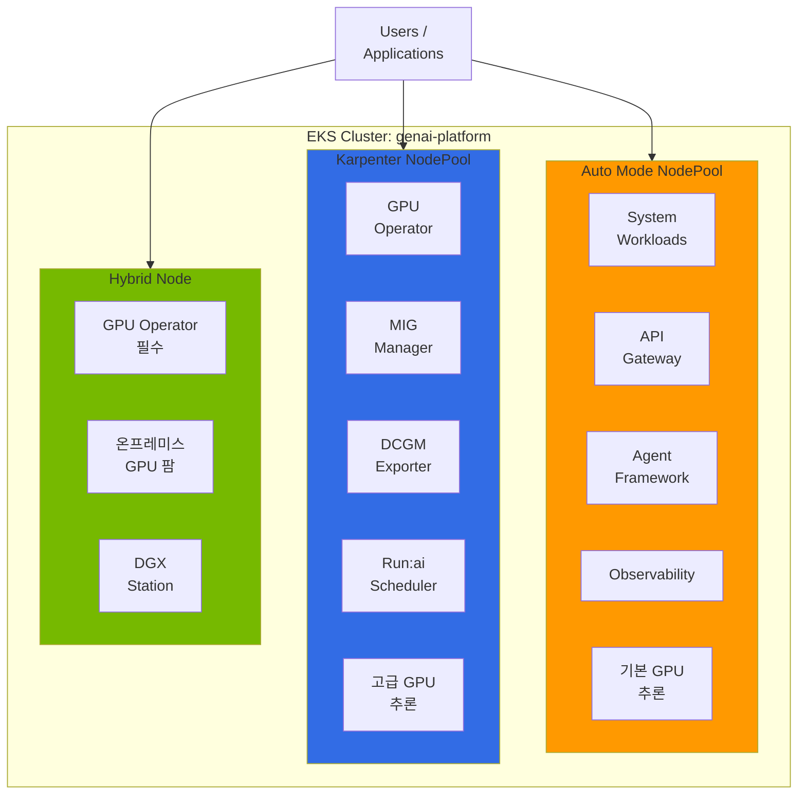
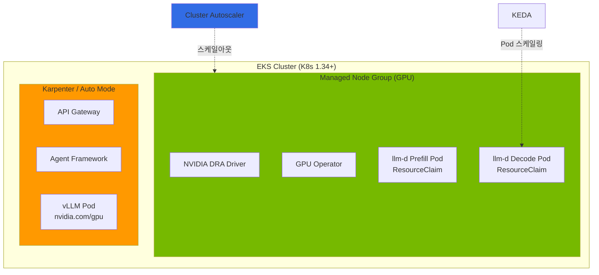
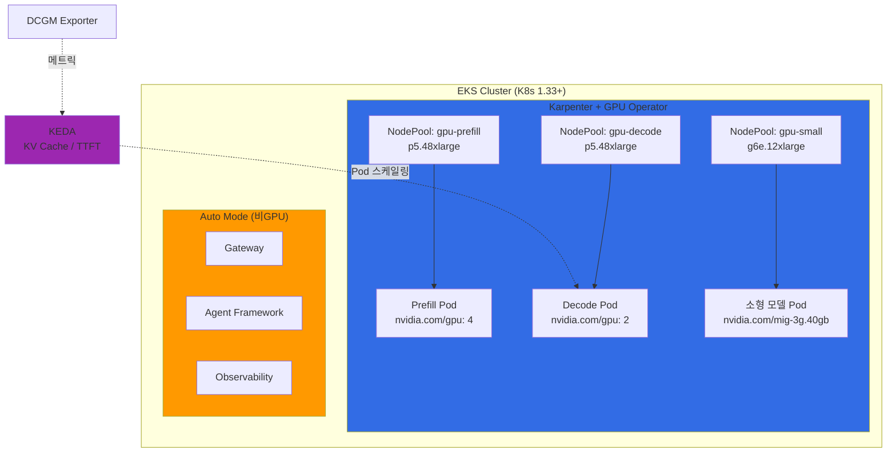
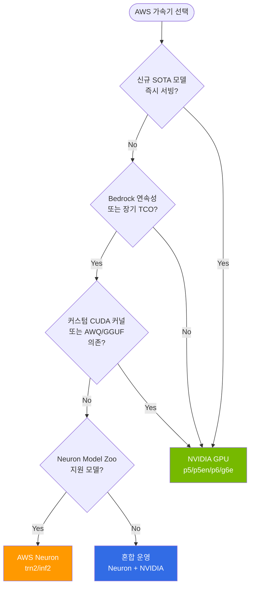
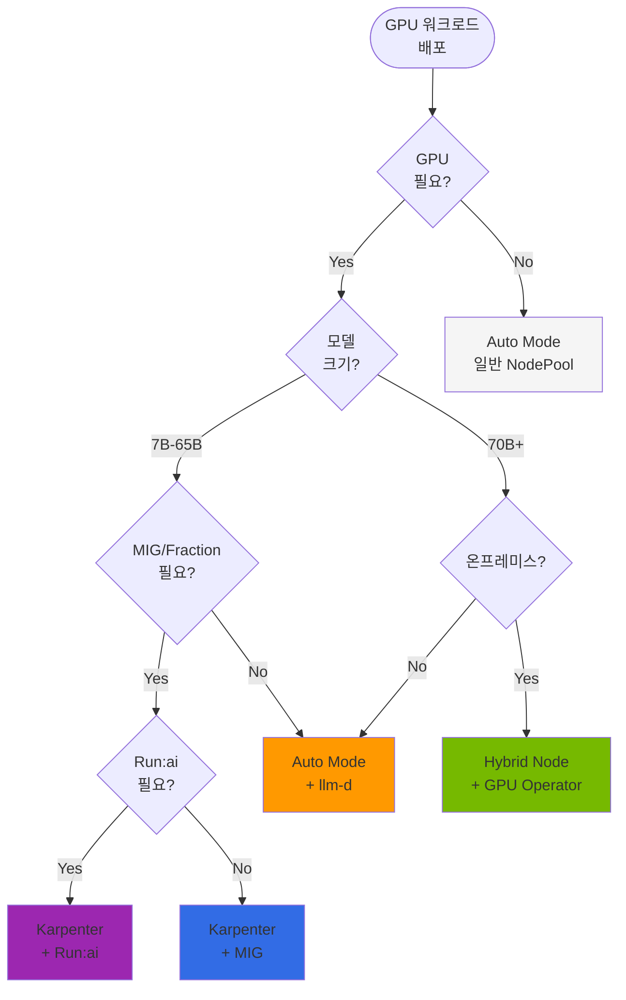

## 개요

EKS에서 GPU 워크로드를 운영할 때 노드 타입 선택은 운영 복잡도, 비용, 기능 활용도에 직접적인 영향을 미칩니다. GPU 추론과 훈련 워크로드는 일반 컨테이너 워크로드와 달리 다음과 같은 특수한 요구사항을 가집니다:

- **드라이버 의존성**: NVIDIA GPU 드라이버, Container Toolkit, Device Plugin
- **고급 기능**: MIG (Multi-Instance GPU), Time-Slicing, Fractional GPU
- **모니터링**: DCGM (Data Center GPU Manager) 기반 메트릭
- **스케줄링**: Topology-Aware Placement, Gang Scheduling

AWS EKS는 GPU 워크로드를 위해 4가지 노드 타입을 제공합니다:

| 노드 타입 | 설명 |
|-----------|------|
| **EKS Auto Mode** | AWS가 전체 노드 라이프사이클을 관리 (GPU 드라이버 사전 설치) |
| **Karpenter** | 자동 스케일링 + Custom AMI, MIG 등 완전한 사용자 정의 |
| **Managed Node Group** | AWS 관리 노드 그룹, DRA(Dynamic Resource Allocation) 유일 지원 |
| **Hybrid Node** | 온프레미스 GPU 서버를 EKS 클러스터에 연결 |

:::tip 핵심 원칙
하나의 EKS 클러스터에서 여러 노드 타입을 **동시에** 운영할 수 있습니다. 워크로드 특성에 맞는 최적의 노드 조합을 구성하세요.
:::

### 이 문서의 범위

이 문서는 **노드 타입 선택과 하이브리드 아키텍처 설계**에 집중합니다. GPU Operator/DCGM/Dynamo 등 NVIDIA 소프트웨어 스택 상세, GPU 오토스케일링, llm-d 분산 추론, 보안/트러블슈팅은 각 전문 문서에서 다룹니다 (문서 하단 "관련 문서" 참조).

---

## 노드 타입별 특성 비교

### 기능 비교 테이블

| 특성 | Auto Mode | Karpenter | Managed Node Group | Hybrid Node |
|------|-----------|-----------|-------------------|-------------|
| **관리 주체** | AWS 완전 관리 | Self-Managed | AWS 관리 | On-Premises |
| **자동 스케일링** | 자동 (AWS 제어) | 자동 (NodePool 기반) | 수동/제한적 | 수동 |
| **Custom AMI** | 불가 | 가능 | 가능 | 가능 |
| **SSH 접근** | 불가 | 가능 | 가능 | 가능 |
| **GPU 드라이버** | 사전 설치 (AWS) | 사용자 설치 | 사용자 설치 | 사용자 설치 |
| **GPU Operator** | **가능** (Device Plugin 레이블 비활성화) | **가능** | 가능 | 가능 |
| **Root Filesystem** | Read-Only | Read-Write | Read-Write | Read-Write |
| **MIG 지원** | 불가 (NodeClass read-only) | 가능 | 가능 | 가능 |
| **DRA 호환** | **불가** (관리형 내부 Karpenter, 버전 고정) | **v1.14.0+ 지원** (Provider v1.14.0부터, [v1.13 이하 미지원](https://github.com/kubernetes-sigs/karpenter/pull/2384)) | **가능** (권장) | 가능 |
| **DCGM Exporter** | GPU Operator로 설치 | GPU Operator 포함 | 수동 설치 | GPU Operator 포함 |
| **Run:ai 호환** | **가능** (Device Plugin 비활성화) | **가능** | 가능 | 가능 |
| **비용** | 낮음 (관리 불필요) | 중간 | 중간 | 낮음 (Capex) |
| **적합 워크로드** | 단순 추론 | 고급 GPU 기능 | DRA 워크로드 | 온프레미스 통합 |

### 워크로드별 노드 선택 가이드

**Auto Mode를 선택하는 경우:**
- GPU 드라이버 관리 부담 없이 빠르게 추론 서비스를 시작하고 싶을 때
- MIG, Fractional GPU가 불필요한 대형 모델 (70B+) 서빙
- 시스템/비GPU 워크로드 (API Gateway, Agent, Observability)

**Karpenter를 선택하는 경우:**
- MIG 파티셔닝, Custom AMI, Spot Instance 유연한 제어가 필요할 때
- Run:ai, KAI Scheduler 등 GPU Operator ClusterPolicy 의존 프로젝트 사용
- 중소형 모델의 GPU 활용률 최적화 (MIG 분할)

**Managed Node Group을 선택하는 경우:**
- DRA(Dynamic Resource Allocation) 기반 GPU 관리가 필요할 때
- P6e-GB200 UltraServer 등 DRA 전용 인스턴스 사용

**Hybrid Node를 선택하는 경우:**
- 기존 온프레미스 GPU 서버 자산을 EKS에 통합할 때
- 데이터 주권 (Data Residency) 요구사항

---

## EKS Auto Mode GPU 지원과 제약

### Auto Mode 기본 GPU 스택

EKS Auto Mode는 GPU 인스턴스에서 다음을 사전 설치합니다:

1. **NVIDIA GPU 드라이버** - AWS 관리 버전, `/dev/nvidia*` 디바이스 자동 생성
2. **NVIDIA Container Toolkit** - containerd 플러그인 자동 구성
3. **NVIDIA Device Plugin** - `nvidia.com/gpu` 리소스 자동 등록
4. **GPU 리소스 등록** - Pod에서 `nvidia.com/gpu: 1` 요청 즉시 가능

```yaml
apiVersion: v1
kind: Pod
metadata:
  name: gpu-test
spec:
  containers:
  - name: cuda-test
    image: nvidia/cuda:12.2.0-runtime-ubuntu22.04
    command: ["nvidia-smi"]
    resources:
      limits:
        nvidia.com/gpu: 1
```

### Auto Mode에서 GPU Operator 설치 — Device Plugin 비활성화 패턴

GPU Operator는 Auto Mode에서 **설치 가능**합니다. 핵심은 **Device Plugin만 노드 레이블로 비활성화**하고 나머지 컴포넌트(DCGM Exporter, NFD, GFD)는 정상 운영하는 것입니다. 이 패턴은 [awslabs/ai-on-eks PR #288](https://github.com/awslabs/ai-on-eks/pull/288)에서 검증되었습니다.

**왜 GPU Operator가 필요한가?** KAI Scheduler, Run:ai 등 여러 프로젝트는 GPU Operator의 **ClusterPolicy CRD**에 의존합니다. ClusterPolicy 없이는 이들 프로젝트가 시작조차 하지 못합니다. Auto Mode에서도 GPU Operator를 설치해야 하는 핵심 이유입니다.

```
ClusterPolicy CRD (GPU Operator)
  ↓ depends on
KAI Scheduler (GPU-aware Pod 배치)
Run:ai (Fractional GPU, Gang Scheduling)
  ↓ reads
DCGM Exporter (GPU 메트릭)
NFD/GFD (하드웨어 레이블)
```

컴포넌트별 활성화 기준(환경별 매트릭스), Device Plugin 비활성화 NodePool 레이블, Auto Mode용/Karpenter용 Helm values 전체는 [NVIDIA GPU 스택 — EKS 환경별 GPU Operator 구성](./nvidia-gpu-stack.md#eks-환경별-gpu-operator-구성)을 참조하세요.

:::caution Auto Mode의 실제 제약
GPU Operator 설치는 가능하지만, NodeClass가 read-only이므로 다음은 불가합니다:
- **MIG 파티셔닝**: NodeClass에서 MIG 프로파일 설정 불가
- **Custom AMI**: 특정 드라이버 버전 핀 불가
- **SSH/SSM 접근**: 노드 직접 디버깅 불가

MIG 기반 GPU 분할이 필요하면 Karpenter + GPU Operator로 전환하세요.
:::

### 대형 GPU 인스턴스 지원 현황 (2026.04 검증 시점 기준, 재검증 필요)

GLM-5 (744B MoE) 배포 과정에서 확인한 Auto Mode의 대형 GPU 인스턴스 지원 현황입니다. p5.48xlarge는 Spot 프로비저닝이 확인되었으나, p5en/p6는 2026.04 검증 시점에서 제약이 있었습니다 (재검증 필요).

**상세 지원 현황**: [EKS Auto Mode GPU 인스턴스 지원 현황](../inference-frameworks/llm-d-eks-automode.md#eks-auto-mode-gpu-인스턴스-지원-현황-202604-검증) 참조

### Auto Mode + MNG 하이브리드 제약

p5en/p6 사용을 위해 Auto Mode 클러스터에 MNG를 추가하는 하이브리드 패턴은 **현재 불가능**합니다:

- MNG 생성 시 `CREATING` 상태에서 30분 이상 멈춤
- CloudFormation 스택의 `Resources` 필드가 `null`로 유지
- Auto Mode의 managed compute 레이어와 MNG의 ASG 기반 관리가 내부적으로 충돌

**결론**: 대형 GPU (H200+, B200) 사용 시 **EKS Standard Mode + Karpenter + MNG**를 사용하세요.

### Device Plugin 충돌 해결

Auto Mode 노드에서 GPU Operator를 `devicePlugin.enabled=true`로 설치하면 내장 Device Plugin과 충돌합니다.

```bash
kubectl describe node <gpu-node> | grep nvidia.com/gpu
# Allocatable: nvidia.com/gpu: 0  (예상: 8)
```

**해결**: NodePool에 `nvidia.com/gpu.deploy.device-plugin: "false"` 레이블 추가 (위 "Device Plugin 비활성화 패턴" 섹션 참조)

### 노드 강제 종료 제약

Auto Mode가 관리하는 EC2 인스턴스는 `ec2:TerminateInstances`를 차단합니다. 비정상 노드 복구 절차:

1. 워크로드 삭제: `kubectl delete pod <gpu-pod>`
2. NodeClaim 삭제: `kubectl delete nodeclaim <nodeclaim-name>`
3. Karpenter가 Empty 노드 감지 후 자동 종료 (5-10분)
4. 새 NodeClaim 생성으로 정상 노드 시작

### Consolidation과 단일 Replica 서비스 가용성 (2026.07 검증)

Auto Mode의 내장 Karpenter는 비용 최적화를 위해 노드 consolidation(통합·회수)을 상시 수행합니다. 이 과정에서 **replica 1개로 운영되는 서비스는 Pod 재배치 동안 ALB 타깃그룹에 healthy 타깃이 없어져 503을 반환**합니다. 응답 헤더가 `server: awselb/2.0`이면 애플리케이션이 아닌 ALB가 직접 생성한 503입니다.

실제 사례: Langfuse(replica 1)를 Auto Mode 클러스터에서 운영할 때, consolidation이 하루 수차례 노드를 교체하면서 타깃 Deregister → 신규 Pod 기동 → Register 사이의 공백마다 503이 발생했습니다. CloudTrail에서 `eks-auto-mode-compute` 역할의 `TerminateInstances`와 타깃그룹 `DeregisterTargets`/`RegisterTargets` 이벤트가 반복되는 패턴으로 확인할 수 있습니다.

**해결 — 4가지를 세트로 적용해야 합니다. replicas 증설만으로는 불충분합니다:**

1. **replicas 2 + PodDisruptionBudget**: Karpenter는 PDB를 존중하므로 `minAvailable: 1` PDB가 있어야 순차 evict가 강제됩니다. PDB 없이 replicas만 늘리면 두 Pod가 연달아 evict될 수 있습니다.

```yaml
apiVersion: policy/v1
kind: PodDisruptionBudget
metadata:
  name: langfuse-web
spec:
  minAvailable: 1
  selector:
    matchLabels:
      app: langfuse-web
```

2. **노드 분산**: 두 replica가 같은 노드에 스케줄되면 노드 1개 회수로 동시에 중단됩니다. `topologySpreadConstraints` 또는 hostname 기준 `podAntiAffinity`로 분산합니다.

```yaml
topologySpreadConstraints:
  - maxSkew: 1
    topologyKey: kubernetes.io/hostname
    whenUnsatisfiable: DoNotSchedule
    labelSelector:
      matchLabels:
        app: langfuse-web
```

3. **ALB Pod Readiness Gate**: Pod가 Ready여도 ALB 타깃은 아직 `initial` 상태일 수 있습니다. 네임스페이스에 readiness gate 주입 라벨을 추가하면 ALB 헬스체크 통과까지 Pod가 Ready로 간주되지 않아, "신규 타깃 healthy 확인 → 기존 타깃 제거" 순서가 강제됩니다.

```bash
kubectl label namespace <ns> elbv2.k8s.aws/pod-readiness-gate-inject=enabled
```

4. **(대안) Disruption 제외**: replica를 늘릴 수 없는 워크로드는 Pod에 `karpenter.sh/do-not-disrupt: "true"` 어노테이션을 추가해 consolidation 대상에서 제외합니다. 단, 해당 노드는 비용 최적화 대상에서도 제외됩니다.

### Auto Mode 인스턴스 지원 확인 방법

NodePool dry-run으로 특정 인스턴스 타입의 지원 여부를 사전 확인할 수 있습니다:

```yaml
apiVersion: karpenter.sh/v1
kind: NodePool
metadata:
  name: gpu-test-dryrun
spec:
  template:
    spec:
      requirements:
        - key: node.kubernetes.io/instance-type
          operator: In
          values: ["p5en.48xlarge"]
      nodeClassRef:
        group: eks.amazonaws.com
        kind: NodeClass
        name: default
  limits:
    nvidia.com/gpu: "8"
```

dry-run 후 `kubectl get nodeclaim` 이벤트에서 `NoCompatibleInstanceTypes`가 발생하면 해당 인스턴스 타입은 Auto Mode에서 미지원입니다.

---

## Karpenter GPU NodePool 구성

### Karpenter 선택 기준

Karpenter는 Auto Mode의 자동 스케일링 장점을 유지하면서, GPU Operator를 완전히 활용할 수 있는 최적의 균형점입니다. Auto Mode와의 항목별 차이는 위 [기능 비교 테이블](#기능-비교-테이블)을 참조하세요. 요약하면 Custom AMI·MIG·Spot 완전 지원이 Karpenter를 선택하는 결정 요인입니다.

### NodePool·비용 구성 참조

추론/훈련 NodePool YAML, EC2NodeClass, Spot + On-Demand fallback, 토폴로지·Gang Scheduling, Spot 가격 비교와 비용 최적화 전략은 [GPU 리소스 관리](./gpu-resource-management.md)에서 다룹니다. Karpenter 노드 전용 GPU Operator Helm values는 [NVIDIA GPU 스택 — EKS 환경별 GPU Operator 구성](./nvidia-gpu-stack.md#eks-환경별-gpu-operator-구성)을 참조하세요.

노드 전략 관점의 요점은 다음과 같습니다.

- **추론 NodePool**: On-Demand 우선, `consolidationPolicy: WhenEmpty`로 서빙 중단 최소화
- **훈련 NodePool**: `capacity-type: [spot, on-demand]`로 Spot 우선 + fallback, `consolidateAfter: 30m`으로 훈련 중단 방지
- **Spot 절감률**: p5/p5en/p6 계열은 Spot으로 약 69-85% 절감 가능 (PoC/데모 환경 적극 활용)

---

## 권장 하이브리드 아키텍처

### 3-노드 타입 공존 아키텍처

하나의 EKS 클러스터에서 Auto Mode + Karpenter + Hybrid Node를 동시에 운영합니다.



### 워크로드별 노드 배치 전략

| 워크로드 유형 | 노드 타입 | GPU Operator | 이유 |
|--------------|-----------|--------------|------|
| **시스템 컴포넌트** | Auto Mode | 불필요 | 관리 불필요, 비용 최소화 |
| **API Gateway / Agent** | Auto Mode | 불필요 | CPU 워크로드 |
| **간단한 GPU 추론 (70B+)** | Auto Mode | 선택 (DCGM 시 필요) | MIG 불필요, 빠른 스케일링 |
| **MIG 기반 추론** | Karpenter | 필수 | MIG Manager 필요 |
| **Fractional GPU** | Karpenter | 필수 | Run:ai 필요 |
| **모델 훈련** | Karpenter | 필수 | Gang Scheduling, Spot |
| **DRA 워크로드** | Managed Node Group | 필수 | Karpenter/Auto Mode 미지원 |
| **온프레미스 GPU** | Hybrid Node | 필수 | AWS 관리 GPU 스택 없음 |

### DRA 워크로드를 위한 MNG 하이브리드

DRA(Dynamic Resource Allocation)는 K8s 1.34에서 GA로 승격되었으며, GPU 메모리 세밀 할당, NVLink 토폴로지 인식 스케줄링 등 Device Plugin을 넘어서는 고급 GPU 관리를 제공합니다. **DRA 지원 여부는 Karpenter 버전과 배포 방식에 따라 갈립니다** — self-managed Karpenter v1.14.0+(`ignoreDRARequests=false`)와 MNG는 지원하고, EKS Auto Mode는 내부 Karpenter 버전 제약으로 현재 미지원입니다. 프로비저닝 방식별 호환성 표와 활성화 파라미터는 [GPU 리소스 관리 — 노드 프로비저닝 호환성](./gpu-resource-management.md#노드-프로비저닝-호환성)을 참조하세요.



| 워크로드 | 노드 타입 | GPU 할당 방식 | 스케일링 |
|---|---|---|---|
| DRA 워크로드 (llm-d, P6e-GB200) | **Managed Node Group** | ResourceClaim (DRA) | Cluster Autoscaler |
| 일반 GPU 추론 (vLLM 단독) | Karpenter / Auto Mode | `nvidia.com/gpu` (Device Plugin) | Karpenter |
| 비GPU 워크로드 | Karpenter / Auto Mode | - | Karpenter |

상세 DRA 스케일아웃 전략은 [GPU 리소스 관리](./gpu-resource-management.md#dra-워크로드의-스케일아웃)를 참조하세요.

### 모델 크기별 권장 노드 전략

| 모델 크기 | 예시 | 권장 노드 | 이유 |
|---|---|---|---|
| **70B+** | Qwen2.5-72B, Llama-3.3-70B | Auto Mode + llm-d | GPU를 거의 다 사용, 관리 편의성 |
| **30B-65B** | Qwen3-32B | Auto Mode 또는 Karpenter | GPU 50%+ 사용, 상황에 따라 선택 |
| **13B-30B** | Llama-3-13B | Karpenter + MIG 2분할 | GPU 활용률 개선 필요 |
| **7B 이하** | Llama-3-8B, Mistral-7B | Karpenter + MIG 4-7분할 | GPU 낭비 심각, MIG 필수 |
| **멀티 모델** | 여러 모델 동시 운영 | Karpenter + MIG | 모델별 MIG 파티션 분리 |
| **개발/테스트** | 모델 무관 | Auto Mode | 빠른 시작 |

### 모델 크기별 비용 영향

p5.48xlarge (H100 x8) On-Demand $55.04/hr 기준, 월 비용 약 $40,000 (2025-06 가격 인하 반영):

| 구성 | 7B 모델 인스턴스 수 | GPU 사용량 | GPU 활용률 | 실효 비용/인스턴스 |
|---|---|---|---|---|
| Auto Mode (GPU 전체 할당) | 8개 | GPU 8개 | ~25% | $5,020 |
| Karpenter + MIG (4분할) | 8개 | GPU 2개 | ~80% | **$1,256** |
| **절감 효과** | 동일 | **75% 절감** | **3.2배 향상** | **75% 절감** |

:::warning 모델 크기와 비용 효율
모델 파라미터 수가 작을수록 Auto Mode에서의 GPU 낭비가 커집니다. 7B 모델을 H100에서 운영하면 GPU 메모리의 80%가 유휴 상태로 남으며, 이는 직접적인 비용 낭비입니다. 중소형 모델에는 MIG 파티셔닝이 필수적입니다.
:::

### 현시점 최적 구성 (2026.04)

대부분의 LLM 서빙 환경에서는 DRA가 아직 필수가 아닙니다. Device Plugin + MIG 조합으로 GPU 분할과 토폴로지 배치를 충분히 커버할 수 있으며, Karpenter의 빠른 스케일아웃이 MNG + Cluster Autoscaler보다 LLM 서빙 SLO에 유리합니다.



| 기준 | Karpenter + Device Plugin | MNG + DRA |
|---|---|---|
| **스케일아웃 속도** | 빠름 (Karpenter) | 느림 (Cluster Autoscaler) |
| **GPU 분할** | MIG 지원 (GPU Operator) | DRA 네이티브 |
| **운영 복잡도** | 단일 스택 | MNG + Karpenter 혼용 |
| **K8s 버전** | 1.32+ | 1.34+ (DRA GA) |
| **생태계 성숙도** | 프로덕션 검증 | 초기 단계 |

### 규모별 권장 구성

**소규모 (< 32 GPU)**

```yaml
구성: Auto Mode + Karpenter (GPU 전용)
  - Auto Mode: 일반 워크로드
  - Karpenter: GPU 추론 (Device Plugin)
  - GPU Operator: DCGM 모니터링
비용: $5,000 - $15,000/월
```

**중규모 (32 - 128 GPU)**

```yaml
구성: Karpenter + GPU Operator + KEDA
  - Karpenter NodePool: Prefill / Decode / 소형 모델 분리
  - GPU Operator: MIG, DCGM, NFD/GFD
  - KEDA: KV Cache / TTFT 기반 Pod 스케일링
비용: $15,000 - $80,000/월
```

**대규모 (> 128 GPU)**

```yaml
구성: Karpenter + GPU Operator + Run:ai + Hybrid Node
  - Karpenter: GPU Operator + Run:ai
  - Hybrid Node: 온프레미스 GPU 팜 통합
  - P6e-GB200 도입 시: MNG + DRA 추가
비용: $80,000 - $500,000/월 (클라우드) + Capex (온프레미스)
```

### DRA 전환 시점

| 조건 | 전환 필요 |
|---|---|
| P6e-GB200 UltraServer 도입 | 필수 (Device Plugin 미지원) |
| Multi-Node NVLink / IMEX 필요 | 필수 (ComputeDomain은 DRA 전용) |
| CEL 기반 세밀한 GPU 속성 선택 | 권장 |
| GPU 공유 (MPS) | 권장 |
| Self-managed Karpenter v1.14.0+ (DRA 지원) | 전환 최적 시점 (MNG 불필요) |

:::tip 전환 전략
**지금**: Karpenter + GPU Operator (Device Plugin + MIG) -- 가장 빠르고 운영 가능한 프로덕션 구성

**P6e-GB200 도입 시**: MNG (DRA, GPU) + Karpenter (비GPU) 하이브리드

**Self-managed Karpenter v1.14.0+ 채택 시**: Karpenter + DRA 통합 -- 최종 목표 구성
:::

---

## AWS 가속기 선택 가이드 — NVIDIA vs Neuron

EKS GPU 노드 전략은 전통적으로 NVIDIA GPU (p/g 시리즈) 중심으로 설계되어 왔지만, 2026년 시점에는 **Trainium2/Inferentia2** 기반 AWS 커스텀 가속기가 프로덕션 대안으로 성숙했습니다. Neuron 스택의 상세는 [AWS Neuron Stack](./aws-neuron-stack.md) 에서 다루며, 이 절은 노드 전략 수립 단계에서의 선택 기준만 정리합니다.

### NVIDIA GPU vs AWS Neuron 의사결정 표

| 기준 | NVIDIA GPU (p5/p5en/p6/g6e) | AWS Neuron (trn2/inf2) |
|------|---------------------------|---------------------|
| **모델 생태계 최신성** | 즉시 지원 (신규 모델 Day-1) | AWS 포팅 주기 지연 (몇 주~몇 달) |
| **장기 운영 TCO** | 높음 (H100/H200/B200 Spot 도 고가) | 토큰당 비용 유리 (AWS 자료 기준) |
| **Capacity 가용성** | 리전·시기에 따라 타이트 | 상대적으로 확보 용이 |
| **커스텀 CUDA 커널** | 전면 지원 | 지원 불가 (NEFF 컴파일 필요) |
| **양자화 포맷** | AWQ/GPTQ/GGUF 광범위 | BF16/FP16/FP8, AWQ/GPTQ 제한적 |
| **관측 생태계** | GPU Operator + DCGM 성숙 | neuron-monitor + OSS exporter |
| **오픈소스 서빙** | vLLM, SGLang, TRT-LLM 등 풍부 | NxD Inference / vLLM Neuron / TGI Neuron |
| **Bedrock 연속성** | 무관 | Bedrock 내부 스택과 동일 경로 |
| **하이브리드(온프레미스)** | Hybrid Node 로 가능 | EC2 전용 (온프레미스 불가) |

### 선택 플로우



### 권장 혼합 운영 패턴

- **Frontier (최신 모델) 레이어**: NVIDIA GPU (p5en/p6) — 신규 모델을 빠르게 도입
- **Volume (고빈도 추론) 레이어**: Neuron (trn2/inf2) — 안정 모델을 저비용으로 대량 서빙
- **Edge/온프레미스**: Hybrid Node + NVIDIA GPU — Neuron 은 EC2 전용

상세한 Neuron SDK, Device Plugin, Karpenter NodePool, 추론 프레임워크(NxD Inference / vLLM Neuron / TGI Neuron) 선택은 [AWS Neuron Stack](./aws-neuron-stack.md) 문서를 참조하세요.

---

## 노드 전략 의사결정 플로우차트



### 의사결정 요약 테이블

| 질문 | 답변 | 권장 노드 타입 | GPU Operator |
|------|------|---------------|--------------|
| GPU 불필요 | - | Auto Mode | 불필요 |
| 간단한 GPU 추론 (MIG 불필요) | - | Auto Mode GPU | 선택 |
| MIG 필요 | - | Karpenter | 필수 |
| DRA 필요 | - | **Managed Node Group** | 필수 |
| Fractional GPU / Run:ai | - | Karpenter | 필수 |
| 온프레미스 GPU | - | Hybrid Node | 필수 |
| 비용 최소화 (Spot 허용) | - | Karpenter Spot | 필수 |
| 대규모 훈련 (Gang Scheduling) | - | Karpenter + Run:ai | 필수 |
| P6e-GB200 | DRA 필수 | **Managed Node Group** | 필수 |

---

## 관련 문서

### GPU 스택 및 모니터링

GPU Operator, DCGM, MIG, Time-Slicing, KAI Scheduler, Dynamo 등 NVIDIA GPU 소프트웨어 스택의 상세 내용은 별도 문서를 참조하세요.

- **[NVIDIA GPU 스택](./nvidia-gpu-stack.md)** - GPU Operator, DCGM Exporter, MIG Manager, Dynamo, KAI Scheduler

### GPU 리소스 관리

Karpenter, KEDA, DRA 기반 GPU 오토스케일링 전략은 다음을 참조하세요.

- **[GPU 리소스 관리](./gpu-resource-management.md)** - Karpenter NodePool, KEDA 스케일링, DRA 스케일아웃 전략

### 추론 엔진

- **[llm-d EKS Auto Mode](../inference-frameworks/llm-d-eks-automode.md)** - llm-d 분산 추론, KV-cache 인식 라우팅, Auto Mode/Karpenter 노드 전략
- **[vLLM 모델 서빙](../inference-frameworks/vllm-model-serving.md)** - vLLM 배포 및 최적화

### 하이브리드 인프라

온프레미스 GPU 서버의 EKS Hybrid Node 등록, VPN/Direct Connect 구성, GPU Operator 설치는 다음을 참조하세요.

- **[Hybrid Infrastructure](/docs/hybrid-infrastructure)** - 온프레미스 + 클라우드 하이브리드 아키텍처

### 배포 및 보안

GPU 워크로드의 실전 배포 YAML, 보안 정책 (Pod Security Standards, NetworkPolicy, IAM), 트러블슈팅 가이드는 Reference Architecture를 참조하세요.

- **[Reference Architecture: GPU 인프라](../../reference-architecture/model-lifecycle/custom-model-deployment.md)** - GPU 보안, 트러블슈팅, 배포 가이드

### 플랫폼 아키텍처

- **[EKS 기반 오픈 아키텍처](../../design-architecture/platform-selection/agentic-ai-solutions-eks.md)** - 전체 Agentic AI 플랫폼 아키텍처
