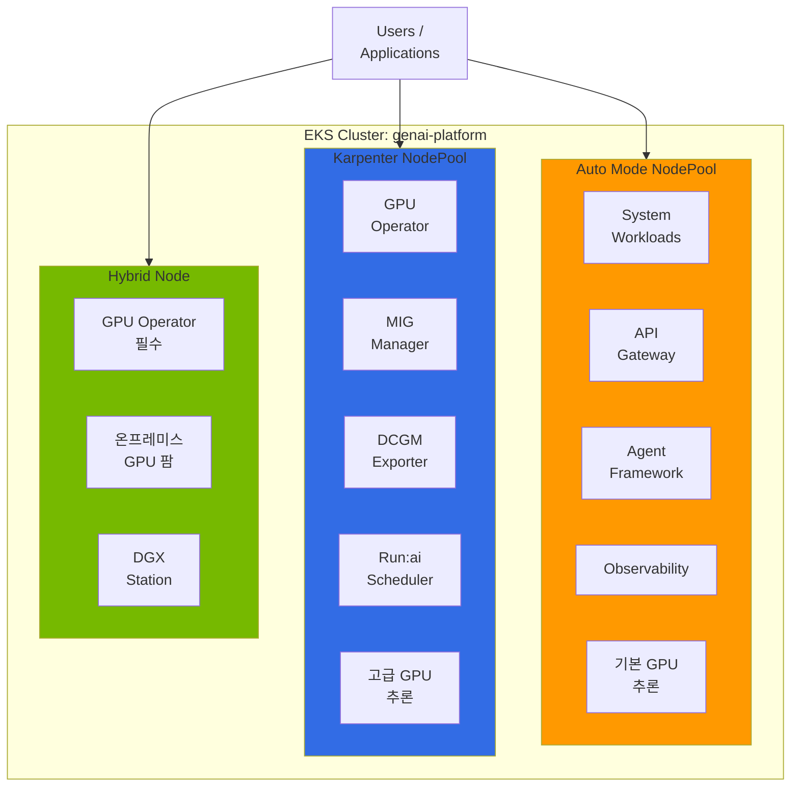
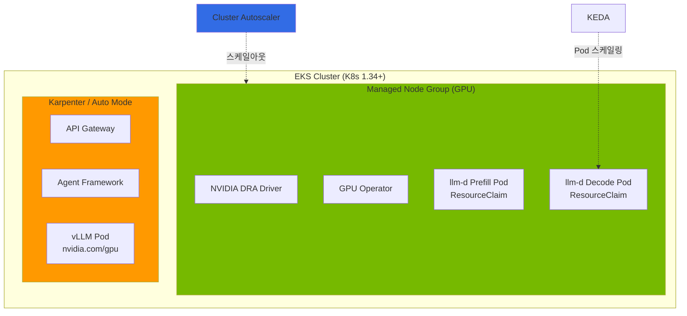
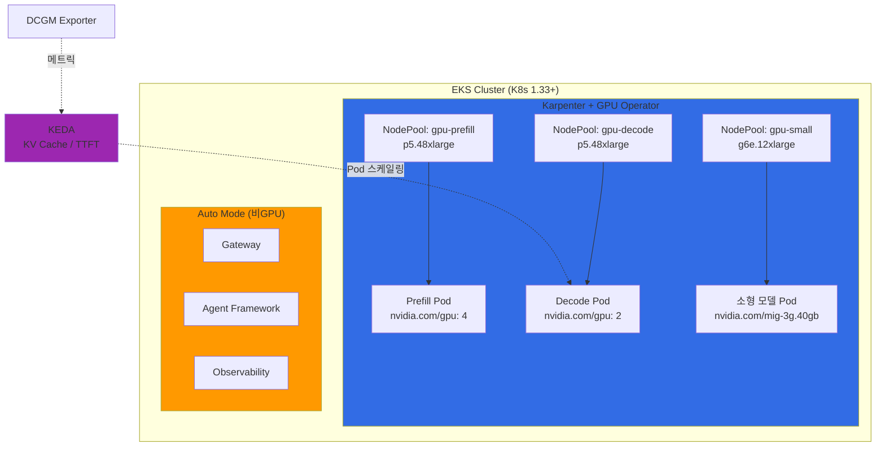

# EKS GPU 노드 전략

## 1. 개요

EKS에서 GPU 워크로드를 운영할 때 노드 타입 선택은 운영 복잡도, 비용, 기능 활용도에 직접적인 영향을 미칩니다. GPU 추론과 훈련 워크로드는 일반 컨테이너 워크로드와 달리 다음과 같은 특수한 요구사항을 가집니다:

- **드라이버 의존성**: NVIDIA GPU 드라이버, Container Toolkit, Device Plugin
- **고급 기능**: MIG (Multi-Instance GPU), Time-Slicing, Fractional GPU
- **모니터링**: DCGM (Data Center GPU Manager) 기반 메트릭
- **스케줄링**: Topology-Aware Placement, Gang Scheduling

AWS EKS는 GPU 워크로드를 위해 4가지 노드 타입을 제공합니다:

| 노드 타입 | 설명 |
|-----------|------|
| **EKS Auto Mode** | AWS가 전체 노드 라이프사이클을 관리 (GPU 드라이버 사전 설치) |
| **Karpenter** | 자동 스케일링 + Custom AMI, MIG 등 완전한 사용자 정의 |
| **Managed Node Group** | AWS 관리 노드 그룹, DRA(Dynamic Resource Allocation) 유일 지원 |
| **Hybrid Node** | 온프레미스 GPU 서버를 EKS 클러스터에 연결 |

:::tip 핵심 원칙
하나의 EKS 클러스터에서 여러 노드 타입을 **동시에** 운영할 수 있습니다. 워크로드 특성에 맞는 최적의 노드 조합을 구성하세요.
:::

### 이 문서의 범위

이 문서는 **노드 타입 선택과 하이브리드 아키텍처 설계**에 집중합니다. GPU Operator/DCGM/Dynamo 등 NVIDIA 소프트웨어 스택 상세, GPU 오토스케일링, llm-d 분산 추론, 보안/트러블슈팅은 각 전문 문서에서 다룹니다 (7장 관련 문서 참조).

---

## 2. 노드 타입별 특성 비교

### 2.1 기능 비교 테이블

| 특성 | Auto Mode | Karpenter | Managed Node Group | Hybrid Node |
|------|-----------|-----------|-------------------|-------------|
| **관리 주체** | AWS 완전 관리 | Self-Managed | AWS 관리 | On-Premises |
| **자동 스케일링** | 자동 (AWS 제어) | 자동 (NodePool 기반) | 수동/제한적 | 수동 |
| **Custom AMI** | 불가 | 가능 | 가능 | 가능 |
| **SSH 접근** | 불가 | 가능 | 가능 | 가능 |
| **GPU 드라이버** | 사전 설치 (AWS) | 사용자 설치 | 사용자 설치 | 사용자 설치 |
| **GPU Operator** | **가능** (Device Plugin 레이블 비활성화) | **가능** | 가능 | 가능 |
| **Root Filesystem** | Read-Only | Read-Write | Read-Write | Read-Write |
| **MIG 지원** | 불가 (NodeClass read-only) | 가능 | 가능 | 가능 |
| **DRA 호환** | **불가** (내부 Karpenter 기반) | **불가** ([#1231](https://github.com/kubernetes-sigs/karpenter/issues/1231)) | **가능** (권장) | 가능 |
| **DCGM Exporter** | GPU Operator로 설치 | GPU Operator 포함 | 수동 설치 | GPU Operator 포함 |
| **Run:ai 호환** | **가능** (Device Plugin 비활성화) | **가능** | 가능 | 가능 |
| **비용** | 낮음 (관리 불필요) | 중간 | 중간 | 낮음 (Capex) |
| **적합 워크로드** | 단순 추론 | 고급 GPU 기능 | DRA 워크로드 | 온프레미스 통합 |

### 2.2 선택 가이드: 언제 어떤 노드를 쓸 것인가

**Auto Mode를 선택하는 경우:**
- GPU 드라이버 관리 부담 없이 빠르게 추론 서비스를 시작하고 싶을 때
- MIG, Fractional GPU가 불필요한 대형 모델 (70B+) 서빙
- 시스템/비GPU 워크로드 (API Gateway, Agent, Observability)

**Karpenter를 선택하는 경우:**
- MIG 파티셔닝, Custom AMI, Spot Instance 유연한 제어가 필요할 때
- Run:ai, KAI Scheduler 등 GPU Operator ClusterPolicy 의존 프로젝트 사용
- 중소형 모델의 GPU 활용률 최적화 (MIG 분할)

**Managed Node Group을 선택하는 경우:**
- DRA(Dynamic Resource Allocation) 기반 GPU 관리가 필요할 때
- P6e-GB200 UltraServer 등 DRA 전용 인스턴스 사용

**Hybrid Node를 선택하는 경우:**
- 기존 온프레미스 GPU 서버 자산을 EKS에 통합할 때
- 데이터 주권 (Data Residency) 요구사항

---

## 3. EKS Auto Mode GPU 지원과 제약

### 3.1 Auto Mode가 자동 제공하는 GPU 스택

EKS Auto Mode는 GPU 인스턴스에서 다음을 사전 설치합니다:

1. **NVIDIA GPU 드라이버** - AWS 관리 버전, `/dev/nvidia*` 디바이스 자동 생성
2. **NVIDIA Container Toolkit** - containerd 플러그인 자동 구성
3. **NVIDIA Device Plugin** - `nvidia.com/gpu` 리소스 자동 등록
4. **GPU 리소스 등록** - Pod에서 `nvidia.com/gpu: 1` 요청 즉시 가능

```yaml
apiVersion: v1
kind: Pod
metadata:
  name: gpu-test
spec:
  containers:
  - name: cuda-test
    image: nvidia/cuda:12.2.0-runtime-ubuntu22.04
    command: ["nvidia-smi"]
    resources:
      limits:
        nvidia.com/gpu: 1
```

### 3.2 Auto Mode에서 GPU Operator 설치: Device Plugin 비활성화 패턴

GPU Operator는 Auto Mode에서 **설치 가능**합니다. 핵심은 **Device Plugin만 노드 레이블로 비활성화**하고 나머지 컴포넌트(DCGM Exporter, NFD, GFD)는 정상 운영하는 것입니다. 이 패턴은 [awslabs/ai-on-eks PR #288](https://github.com/awslabs/ai-on-eks/pull/288)에서 검증되었습니다.

**왜 GPU Operator가 필요한가?** KAI Scheduler, Run:ai 등 여러 프로젝트는 GPU Operator의 **ClusterPolicy CRD**에 의존합니다. ClusterPolicy 없이는 이들 프로젝트가 시작조차 하지 못합니다. Auto Mode에서도 GPU Operator를 설치해야 하는 핵심 이유입니다.

GPU Operator의 전체 아키텍처와 컴포넌트 상세는 [NVIDIA GPU 스택](./nvidia-gpu-stack.md)을 참조하세요.

```
ClusterPolicy CRD (GPU Operator)
  ↓ depends on
KAI Scheduler (GPU-aware Pod 배치)
Run:ai (Fractional GPU, Gang Scheduling)
  ↓ reads
DCGM Exporter (GPU 메트릭)
NFD/GFD (하드웨어 레이블)
```

| GPU Operator 컴포넌트 | Auto Mode 설정 | 이유 |
|---------------------|--------------|------|
| **Driver** | `enabled: false` | AMI에 사전 설치 |
| **Container Toolkit** | `enabled: false` | AMI에 사전 설치 |
| **Device Plugin** | 레이블로 비활성화 | AWS 자체 Device Plugin 관리 |
| **DCGM Exporter** | `enabled: true` | GPU 메트릭 수집 |
| **NFD / GFD** | `enabled: true` | 하드웨어 기능 탐지 및 GPU 속성 레이블링 |

NodePool에서 Device Plugin을 비활성화하는 레이블 설정:

```yaml
apiVersion: karpenter.sh/v1
kind: NodePool
metadata:
  name: gpu-auto-mode
spec:
  template:
    metadata:
      labels:
        nvidia.com/gpu.deploy.device-plugin: "false"
    spec:
      requirements:
        - key: eks.amazonaws.com/instance-family
          operator: In
          values: ["p5", "g6e", "g5"]
      nodeClassRef:
        group: eks.amazonaws.com
        kind: NodeClass
        name: default
```

Helm Values (Auto Mode용):

```yaml
driver:
  enabled: false
toolkit:
  enabled: false
devicePlugin:
  enabled: true           # 전역 활성화, 노드 레이블로 선택적 비활성화
dcgmExporter:
  enabled: true
  serviceMonitor:
    enabled: true
nfd:
  enabled: true
gfd:
  enabled: true
```

:::caution Auto Mode의 실제 제약
GPU Operator 설치는 가능하지만, NodeClass가 read-only이므로 다음은 불가합니다:
- **MIG 파티셔닝**: NodeClass에서 MIG 프로파일 설정 불가
- **Custom AMI**: 특정 드라이버 버전 핀 불가
- **SSH/SSM 접근**: 노드 직접 디버깅 불가

MIG 기반 GPU 분할이 필요하면 Karpenter + GPU Operator로 전환하세요.
:::

### 3.3 대형 GPU 인스턴스 지원 현황 (2026.04 검증)

GLM-5 (744B MoE) 배포 과정에서 확인한 Auto Mode의 대형 GPU 인스턴스 지원 현황입니다. p5.48xlarge는 Spot 프로비저닝이 확인되었으나, p5en/p6는 현재 제약이 있습니다.

**상세 지원 현황**: [EKS Auto Mode GPU 인스턴스 지원 현황](../inference-frameworks/llm-d-eks-automode.md#eks-auto-mode-gpu-인스턴스-지원-현황-202604-검증) 참조

### 3.4 Auto Mode + MNG 하이브리드 제약

p5en/p6 사용을 위해 Auto Mode 클러스터에 MNG를 추가하는 하이브리드 패턴은 **현재 불가능**합니다:

- MNG 생성 시 `CREATING` 상태에서 30분 이상 멈춤
- CloudFormation 스택의 `Resources` 필드가 `null`로 유지
- Auto Mode의 managed compute 레이어와 MNG의 ASG 기반 관리가 내부적으로 충돌

**결론**: 대형 GPU (H200+, B200) 사용 시 **EKS Standard Mode + Karpenter + MNG**를 사용하세요.

### 3.5 Device Plugin 충돌 해결

Auto Mode 노드에서 GPU Operator를 `devicePlugin.enabled=true`로 설치하면 내장 Device Plugin과 충돌합니다.

```bash
kubectl describe node <gpu-node> | grep nvidia.com/gpu
# Allocatable: nvidia.com/gpu: 0  (예상: 8)
```

**해결**: NodePool에 `nvidia.com/gpu.deploy.device-plugin: "false"` 레이블 추가 (3.2절 참조)

### 3.6 노드 강제 종료 불가

Auto Mode가 관리하는 EC2 인스턴스는 `ec2:TerminateInstances`를 차단합니다. 비정상 노드 복구 절차:

1. 워크로드 삭제: `kubectl delete pod <gpu-pod>`
2. NodeClaim 삭제: `kubectl delete nodeclaim <nodeclaim-name>`
3. Karpenter가 Empty 노드 감지 후 자동 종료 (5-10분)
4. 새 NodeClaim 생성으로 정상 노드 시작

### 3.7 Auto Mode 인스턴스 지원 확인 방법

NodePool dry-run으로 특정 인스턴스 타입의 지원 여부를 사전 확인할 수 있습니다:

```yaml
apiVersion: karpenter.sh/v1
kind: NodePool
metadata:
  name: gpu-test-dryrun
spec:
  template:
    spec:
      requirements:
        - key: node.kubernetes.io/instance-type
          operator: In
          values: ["p5en.48xlarge"]
      nodeClassRef:
        group: eks.amazonaws.com
        kind: NodeClass
        name: default
  limits:
    nvidia.com/gpu: "8"
```

dry-run 후 `kubectl get nodeclaim` 이벤트에서 `NoCompatibleInstanceTypes`가 발생하면 해당 인스턴스 타입은 Auto Mode에서 미지원입니다.

---

## 4. Karpenter GPU NodePool 구성

### 4.1 왜 Karpenter인가

Karpenter는 Auto Mode의 자동 스케일링 장점을 유지하면서, GPU Operator를 완전히 활용할 수 있는 최적의 균형점입니다.

| 기능 | Auto Mode | Karpenter |
|------|-----------|-----------|
| **자동 스케일링** | 자동 (AWS 제어) | 자동 (NodePool 기반) |
| **GPU Operator** | 가능 (Device Plugin 비활성화) | 완전 가능 |
| **Custom AMI** | 불가 | 가능 |
| **MIG 지원** | 불가 | 가능 |
| **Spot Instance** | 제한적 | 완전 지원 |
| **노드 교체 속도** | 빠름 | 매우 빠름 |

### 4.2 추론 워크로드 NodePool

```yaml
apiVersion: karpenter.sh/v1
kind: NodePool
metadata:
  name: gpu-inference
spec:
  template:
    metadata:
      labels:
        node-type: gpu-inference
        gpu-operator: enabled
    spec:
      requirements:
        - key: node.kubernetes.io/instance-type
          operator: In
          values:
            - p5.48xlarge      # H100 x8 (640GB HBM3)
            - g6e.12xlarge     # L40S x4 (192GB GDDR6)
            - g5.12xlarge      # A10G x4 (96GB GDDR6)
        - key: karpenter.sh/capacity-type
          operator: In
          values: [on-demand]
        - key: topology.kubernetes.io/zone
          operator: In
          values: [us-west-2a, us-west-2b, us-west-2c]
      taints:
        - key: nvidia.com/gpu
          effect: NoSchedule
          value: "true"
      kubelet:
        maxPods: 110
        evictionHard:
          memory.available: "10Gi"
  disruption:
    consolidationPolicy: WhenEmpty
    consolidateAfter: 5m
  limits:
    cpu: "1000"
    memory: "4000Gi"
    nvidia.com/gpu: "32"
```

### 4.3 훈련 워크로드 NodePool (Spot + On-Demand fallback)

```yaml
apiVersion: karpenter.sh/v1
kind: NodePool
metadata:
  name: gpu-training
spec:
  template:
    metadata:
      labels:
        node-type: gpu-training
        gpu-operator: enabled
    spec:
      requirements:
        - key: node.kubernetes.io/instance-type
          operator: In
          values:
            - p5.48xlarge      # H100 x8
        - key: karpenter.sh/capacity-type
          operator: In
          values: [spot, on-demand]  # Spot 우선, On-Demand fallback
      taints:
        - key: workload
          effect: NoSchedule
          value: "training"
      kubelet:
        maxPods: 50
        evictionHard:
          memory.available: "20Gi"
  disruption:
    consolidationPolicy: WhenUnderutilized
    consolidateAfter: 30m  # 훈련 중단 방지
  limits:
    nvidia.com/gpu: "64"
```

### 4.4 EC2NodeClass 설정

```yaml
apiVersion: karpenter.k8s.aws/v1
kind: EC2NodeClass
metadata:
  name: gpu-inference
spec:
  amiSelectorTerms:
    - alias: al2023
  role: KarpenterNodeRole-eks-genai-cluster
  subnetSelectorTerms:
    - tags:
        karpenter.sh/discovery: eks-genai-cluster
        subnet-type: private
  securityGroupSelectorTerms:
    - tags:
        karpenter.sh/discovery: eks-genai-cluster
  blockDeviceMappings:
    - deviceName: /dev/xvda
      ebs:
        volumeSize: 200Gi
        volumeType: gp3
        iops: 16000
        throughput: 1000
        encrypted: true
        deleteOnTermination: true
  metadataOptions:
    httpEndpoint: enabled
    httpPutResponseHopLimit: 2
    httpTokens: required  # IMDSv2
  tags:
    Environment: production
    ManagedBy: karpenter
```

### 4.5 GPU Operator Helm Values (Karpenter 노드 전용)

```yaml
# helm install gpu-operator nvidia/gpu-operator -f values.yaml
driver:
  enabled: false          # AL2023: AMI 사전 설치

toolkit:
  enabled: false          # AL2023: AMI 사전 설치

devicePlugin:
  enabled: true
  nodeSelector:
    gpu-operator: enabled
  tolerations:
    - key: nvidia.com/gpu
      operator: Exists
      effect: NoSchedule

migManager:
  enabled: true
  nodeSelector:
    gpu-operator: enabled
  config:
    name: mig-parted-config
    default: "all-balanced"

dcgmExporter:
  enabled: true
  serviceMonitor:
    enabled: true
    interval: 15s
  nodeSelector:
    gpu-operator: enabled

nfd:
  enabled: true

gfd:
  enabled: true
  nodeSelector:
    gpu-operator: enabled

operator:
  nodeSelector:
    node-type: gpu-inference  # Karpenter NodePool 레이블
  tolerations:
    - key: nvidia.com/gpu
      operator: Exists
      effect: NoSchedule
  defaultRuntime: containerd
```

**핵심 설정 포인트:**
- `nodeSelector: gpu-operator: enabled` -- Auto Mode 노드 제외
- `driver/toolkit: false` -- AL2023 AMI에 사전 설치
- `migManager: true` -- Karpenter 노드에서 MIG 기능 활용

### 4.6 GPU 토폴로지 기반 스케줄링

분산 훈련에서 NVLink 연결된 GPU끼리 같은 노드에 배치하는 것이 성능에 결정적입니다:

```yaml
# Pod에서 GPU 토폴로지 힌트 설정
apiVersion: v1
kind: Pod
spec:
  containers:
  - name: pytorch-ddp
    resources:
      limits:
        nvidia.com/gpu: 4
  # 같은 NVLink 도메인 내 GPU 배치
  topologySpreadConstraints:
    - maxSkew: 1
      topologyKey: topology.kubernetes.io/zone
      whenUnsatisfiable: DoNotSchedule
      labelSelector:
        matchLabels:
          app: distributed-training
```

### 4.7 Spot 가격 비교 (us-east-2, 2026.04)

| 인스턴스 | On-Demand | Spot (최저) | VRAM | 절감률 |
|---------|-----------|------------|------|-------|
| p5.48xlarge | $98/hr | $12.5/hr | 640GB | 87% |
| p5en.48xlarge | ~$120/hr | $12.1/hr | 1,128GB | 90% |
| p6-b200.48xlarge | $180/hr | $11.4/hr | 1,536GB | 94% |

:::tip Spot 활용 권장
대형 GPU 인스턴스는 Spot으로 85-94% 비용 절감이 가능합니다. PoC/데모 환경에서는 Spot을 적극 활용하되, `consolidationPolicy: WhenEmpty`로 설정하여 불필요한 중단을 방지하세요. 가격은 approximate 수치이며 실시간 가격은 [AWS Spot Pricing](https://aws.amazon.com/ec2/spot/pricing/)에서 확인하세요.
:::

---

## 5. 권장 하이브리드 아키텍처

### 5.1 3-노드 타입 공존 아키텍처

하나의 EKS 클러스터에서 Auto Mode + Karpenter + Hybrid Node를 동시에 운영합니다.



### 5.2 워크로드별 노드 배치 전략

| 워크로드 유형 | 노드 타입 | GPU Operator | 이유 |
|--------------|-----------|--------------|------|
| **시스템 컴포넌트** | Auto Mode | 불필요 | 관리 불필요, 비용 최소화 |
| **API Gateway / Agent** | Auto Mode | 불필요 | CPU 워크로드 |
| **간단한 GPU 추론 (70B+)** | Auto Mode | 선택 (DCGM 시 필요) | MIG 불필요, 빠른 스케일링 |
| **MIG 기반 추론** | Karpenter | 필수 | MIG Manager 필요 |
| **Fractional GPU** | Karpenter | 필수 | Run:ai 필요 |
| **모델 훈련** | Karpenter | 필수 | Gang Scheduling, Spot |
| **DRA 워크로드** | Managed Node Group | 필수 | Karpenter/Auto Mode 미지원 |
| **온프레미스 GPU** | Hybrid Node | 필수 | AWS 관리 GPU 스택 없음 |

### 5.3 DRA 워크로드를 위한 MNG 하이브리드

DRA(Dynamic Resource Allocation)는 K8s 1.34에서 GA로 승격되었으며, GPU 메모리 세밀 할당, NVLink 토폴로지 인식 스케줄링 등 Device Plugin을 넘어서는 고급 GPU 관리를 제공합니다. **단, DRA는 Karpenter와 Auto Mode에서 사용할 수 없습니다.**

:::danger DRA + Karpenter/Auto Mode 비호환
Karpenter는 Pod의 `spec.resourceClaims`를 감지하면 노드 프로비저닝을 skip합니다 ([PR #2384](https://github.com/kubernetes-sigs/karpenter/pull/2384)). Karpenter는 Pod 요구사항을 시뮬레이션해서 최적 인스턴스를 계산하는데, DRA의 ResourceSlice는 노드가 존재한 후에야 DRA Driver가 발행하므로 **노드 생성 전 시뮬레이션이 불가능**합니다 (닭과 달걀 문제).

DRA 워크로드의 노드 관리는 **Managed Node Group + Cluster Autoscaler**가 유일한 정식 지원 방법입니다.
:::



| 워크로드 | 노드 타입 | GPU 할당 방식 | 스케일링 |
|---|---|---|---|
| DRA 워크로드 (llm-d, P6e-GB200) | **Managed Node Group** | ResourceClaim (DRA) | Cluster Autoscaler |
| 일반 GPU 추론 (vLLM 단독) | Karpenter / Auto Mode | `nvidia.com/gpu` (Device Plugin) | Karpenter |
| 비GPU 워크로드 | Karpenter / Auto Mode | - | Karpenter |

상세 DRA 스케일아웃 전략은 [GPU 리소스 관리](./gpu-resource-management.md#dra-워크로드의-스케일아웃)를 참조하세요.

### 5.4 모델 크기별 권장 노드 전략

| 모델 크기 | 예시 | 권장 노드 | 이유 |
|---|---|---|---|
| **70B+** | Qwen3-72B, Llama-3-70B | Auto Mode + llm-d | GPU를 거의 다 사용, 관리 편의성 |
| **30B-65B** | Qwen3-32B | Auto Mode 또는 Karpenter | GPU 50%+ 사용, 상황에 따라 선택 |
| **13B-30B** | Llama-3-13B | Karpenter + MIG 2분할 | GPU 활용률 개선 필요 |
| **7B 이하** | Llama-3-8B, Mistral-7B | Karpenter + MIG 4-7분할 | GPU 낭비 심각, MIG 필수 |
| **멀티 모델** | 여러 모델 동시 운영 | Karpenter + MIG | 모델별 MIG 파티션 분리 |
| **개발/테스트** | 모델 무관 | Auto Mode | 빠른 시작 |

### 5.5 모델 크기별 비용 영향

p5.48xlarge (H100 x8) 기준, 월 비용 약 $98,000:

| 구성 | 7B 모델 인스턴스 수 | GPU 사용량 | GPU 활용률 | 실효 비용/인스턴스 |
|---|---|---|---|---|
| Auto Mode (GPU 전체 할당) | 8개 | GPU 8개 | ~25% | $12,250 |
| Karpenter + MIG (4분할) | 8개 | GPU 2개 | ~80% | **$3,063** |
| **절감 효과** | 동일 | **75% 절감** | **3.2배 향상** | **75% 절감** |

:::warning 모델 크기와 비용 효율
모델 파라미터 수가 작을수록 Auto Mode에서의 GPU 낭비가 커집니다. 7B 모델을 H100에서 운영하면 GPU 메모리의 80%가 유휴 상태로 남으며, 이는 직접적인 비용 낭비입니다. 중소형 모델에는 MIG 파티셔닝이 필수적입니다.
:::

### 5.6 현시점 최적 구성 (2026.04)

대부분의 LLM 서빙 환경에서는 DRA가 아직 필수가 아닙니다. Device Plugin + MIG 조합으로 GPU 분할과 토폴로지 배치를 충분히 커버할 수 있으며, Karpenter의 빠른 스케일아웃이 MNG + Cluster Autoscaler보다 LLM 서빙 SLO에 유리합니다.



| 기준 | Karpenter + Device Plugin | MNG + DRA |
|---|---|---|
| **스케일아웃 속도** | 빠름 (Karpenter) | 느림 (Cluster Autoscaler) |
| **GPU 분할** | MIG 지원 (GPU Operator) | DRA 네이티브 |
| **운영 복잡도** | 단일 스택 | MNG + Karpenter 혼용 |
| **K8s 버전** | 1.32+ | 1.34+ (DRA GA) |
| **생태계 성숙도** | 프로덕션 검증 | 초기 단계 |

### 5.7 규모별 권장 구성

**소규모 (< 32 GPU)**

```yaml
구성: Auto Mode + Karpenter (GPU 전용)
  - Auto Mode: 일반 워크로드
  - Karpenter: GPU 추론 (Device Plugin)
  - GPU Operator: DCGM 모니터링
비용: $5,000 - $15,000/월
```

**중규모 (32 - 128 GPU)**

```yaml
구성: Karpenter + GPU Operator + KEDA
  - Karpenter NodePool: Prefill / Decode / 소형 모델 분리
  - GPU Operator: MIG, DCGM, NFD/GFD
  - KEDA: KV Cache / TTFT 기반 Pod 스케일링
비용: $15,000 - $80,000/월
```

**대규모 (> 128 GPU)**

```yaml
구성: Karpenter + GPU Operator + Run:ai + Hybrid Node
  - Karpenter: GPU Operator + Run:ai
  - Hybrid Node: 온프레미스 GPU 팜 통합
  - P6e-GB200 도입 시: MNG + DRA 추가
비용: $80,000 - $500,000/월 (클라우드) + Capex (온프레미스)
```

### 5.8 DRA 전환 시점

| 조건 | 전환 필요 |
|---|---|
| P6e-GB200 UltraServer 도입 | 필수 (Device Plugin 미지원) |
| Multi-Node NVLink / IMEX 필요 | 필수 (ComputeDomain은 DRA 전용) |
| CEL 기반 세밀한 GPU 속성 선택 | 권장 |
| GPU 공유 (MPS) | 권장 |
| Karpenter DRA 지원 GA | 전환 최적 시점 (MNG 불필요) |

:::tip 전환 전략
**지금**: Karpenter + GPU Operator (Device Plugin + MIG) -- 가장 빠르고 운영 가능한 프로덕션 구성

**P6e-GB200 도입 시**: MNG (DRA, GPU) + Karpenter (비GPU) 하이브리드

**Karpenter DRA GA 후**: Karpenter + DRA 통합 -- 최종 목표 구성
:::

---

## 6. AWS 가속기 선택 가이드 (NVIDIA vs Neuron)

EKS GPU 노드 전략은 전통적으로 NVIDIA GPU (p/g 시리즈) 중심으로 설계되어 왔지만, 2026년 시점에는 **Trainium2/Inferentia2** 기반 AWS 커스텀 가속기가 프로덕션 대안으로 성숙했습니다. Neuron 스택의 상세는 [AWS Neuron Stack](./aws-neuron-stack.md) 에서 다루며, 이 절은 노드 전략 수립 단계에서의 선택 기준만 정리합니다.

### 6.1 NVIDIA GPU vs AWS Neuron 의사결정 표

| 기준 | NVIDIA GPU (p5/p5en/p6/g6e) | AWS Neuron (trn2/inf2) |
|------|---------------------------|---------------------|
| **모델 생태계 최신성** | 즉시 지원 (신규 모델 Day-1) | AWS 포팅 주기 지연 (몇 주~몇 달) |
| **장기 운영 TCO** | 높음 (H100/H200/B200 Spot 도 고가) | 토큰당 비용 유리 (AWS 자료 기준) |
| **Capacity 가용성** | 리전·시기에 따라 타이트 | 상대적으로 확보 용이 |
| **커스텀 CUDA 커널** | 전면 지원 | 지원 불가 (NEFF 컴파일 필요) |
| **양자화 포맷** | AWQ/GPTQ/GGUF 광범위 | BF16/FP16/FP8, AWQ/GPTQ 제한적 |
| **관측 생태계** | GPU Operator + DCGM 성숙 | neuron-monitor + OSS exporter |
| **오픈소스 서빙** | vLLM, SGLang, TRT-LLM 등 풍부 | NxD Inference / vLLM Neuron / TGI Neuron |
| **Bedrock 연속성** | 무관 | Bedrock 내부 스택과 동일 경로 |
| **하이브리드(온프레미스)** | Hybrid Node 로 가능 | EC2 전용 (온프레미스 불가) |

### 6.2 선택 플로우


### 6.3 권장 혼합 운영 패턴

- **Frontier (최신 모델) 레이어**: NVIDIA GPU (p5en/p6) — 신규 모델을 빠르게 도입
- **Volume (고빈도 추론) 레이어**: Neuron (trn2/inf2) — 안정 모델을 저비용으로 대량 서빙
- **Edge/온프레미스**: Hybrid Node + NVIDIA GPU — Neuron 은 EC2 전용

상세한 Neuron SDK, Device Plugin, Karpenter NodePool, 추론 프레임워크(NxD Inference / vLLM Neuron / TGI Neuron) 선택은 [AWS Neuron Stack](./aws-neuron-stack.md) 문서를 참조하세요.

---

## 7. 노드 전략 의사결정 플로우차트


### 의사결정 요약 테이블

| 질문 | 답변 | 권장 노드 타입 | GPU Operator |
|------|------|---------------|--------------|
| GPU 불필요 | - | Auto Mode | 불필요 |
| 간단한 GPU 추론 (MIG 불필요) | - | Auto Mode GPU | 선택 |
| MIG 필요 | - | Karpenter | 필수 |
| DRA 필요 | - | **Managed Node Group** | 필수 |
| Fractional GPU / Run:ai | - | Karpenter | 필수 |
| 온프레미스 GPU | - | Hybrid Node | 필수 |
| 비용 최소화 (Spot 허용) | - | Karpenter Spot | 필수 |
| 대규모 훈련 (Gang Scheduling) | - | Karpenter + Run:ai | 필수 |
| P6e-GB200 | DRA 필수 | **Managed Node Group** | 필수 |

---

## 8. 관련 문서

### GPU 스택 및 모니터링

GPU Operator, DCGM, MIG, Time-Slicing, KAI Scheduler, Dynamo 등 NVIDIA GPU 소프트웨어 스택의 상세 내용은 별도 문서를 참조하세요.

- **[NVIDIA GPU 스택](./nvidia-gpu-stack.md)** - GPU Operator, DCGM Exporter, MIG Manager, Dynamo, KAI Scheduler

### GPU 리소스 관리

Karpenter, KEDA, DRA 기반 GPU 오토스케일링 전략은 다음을 참조하세요.

- **[GPU 리소스 관리](./gpu-resource-management.md)** - Karpenter NodePool, KEDA 스케일링, DRA 스케일아웃 전략

### 추론 엔진

- **[llm-d EKS Auto Mode](../inference-frameworks/llm-d-eks-automode.md)** - llm-d 분산 추론, KV-cache 인식 라우팅, Auto Mode/Karpenter 노드 전략
- **[vLLM 모델 서빙](../inference-frameworks/vllm-model-serving.md)** - vLLM 배포 및 최적화

### 하이브리드 인프라

온프레미스 GPU 서버의 EKS Hybrid Node 등록, VPN/Direct Connect 구성, GPU Operator 설치는 다음을 참조하세요.

- **[Hybrid Infrastructure](/docs/hybrid-infrastructure)** - 온프레미스 + 클라우드 하이브리드 아키텍처

### 배포 및 보안

GPU 워크로드의 실전 배포 YAML, 보안 정책 (Pod Security Standards, NetworkPolicy, IAM), 트러블슈팅 가이드는 Reference Architecture를 참조하세요.

- **[Reference Architecture: GPU 인프라](../../reference-architecture/custom-model-deployment.md)** - GPU 보안, 트러블슈팅, 배포 가이드

### 플랫폼 아키텍처

- **[EKS 기반 오픈 아키텍처](../../design-architecture/agentic-ai-solutions-eks.md)** - 전체 Agentic AI 플랫폼 아키텍처
