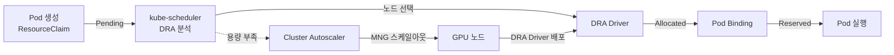
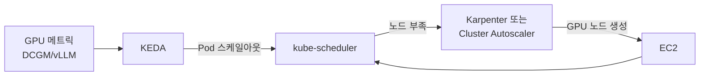
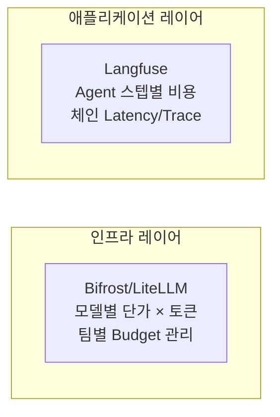

import Tabs from '@theme/Tabs';
import TabItem from '@theme/TabItem';
import { SpecificationTable, ComparisonTable } from '@site/src/components/tables';
import { DraLimitationsTable, ScalingDecisionTable } from '@site/src/components/GpuResourceTables';
import {
  SpotInstancePricingInference,
  SavingsPlansPricingTraining,
  CostOptimizationStrategies,
  KarpenterGpuOptimization
} from '@site/src/components/AgenticSolutionsTables';

EKS 환경에서 GPU 리소스를 관리하는 전략은 크게 세 가지 축으로 구성됩니다.

| 축 | 핵심 질문 | 주요 기술 |
|---|---|---|
| **프로비저닝** | 어떤 GPU 노드를 언제 생성하는가? | Karpenter, EKS Auto Mode, Managed Node Group |
| **스케줄링** | GPU Pod를 어떤 노드에 배치하는가? | Device Plugin, DRA, Topology-Aware Routing |
| **스케일링** | 트래픽 변화에 어떻게 대응하는가? | KEDA, HPA, Cluster Autoscaler |

이 문서는 각 축의 아키텍처와 설계 판단 기준을 다룹니다. GPU Operator 상세(ClusterPolicy, DCGM, MIG, Time-Slicing, Dynamo, KAI Scheduler 등 NVIDIA 소프트웨어 스택)는 [NVIDIA GPU 스택](./nvidia-gpu-stack.md)을 참조하세요.

---

## Karpenter GPU NodePool

:::info Karpenter GA (v1.0+)
Karpenter는 v1.0부터 GA 상태이며, 본 문서의 모든 예제는 `karpenter.sh/v1` API를 사용합니다. DRA allocator는 코어(`kubernetes-sigs/karpenter`) v1.14.0에 추가되었고, 이를 포함한 AWS Provider(`karpenter-provider-aws`) **v1.14.0**도 2026-07-11에 릴리스되었습니다. 따라서 **self-managed Karpenter v1.14.0+** 를 직접 설치하면 EKS에서 DRA 노드 프로비저닝이 가능합니다. 단, 컨트롤러 설정 `ignoreDRARequests`가 **기본값 `true`(DRA 요청 무시)** 이므로 이를 `false`로 바꿔야 실제로 동작합니다. 상세는 아래 [노드 프로비저닝 호환성](#노드-프로비저닝-호환성)과 [Karpenter DRA 활성화 파라미터](#karpenter-dra-활성화-파라미터-v1140)를 참조하세요.
:::

### GPU 노드 자동 프로비저닝 개념

Karpenter는 Pending Pod의 리소스 요청(`nvidia.com/gpu`, 메모리, CPU)을 분석하여 최적의 EC2 인스턴스를 자동으로 프로비저닝합니다. GPU 워크로드에서 Karpenter의 핵심 가치는 다음과 같습니다.

- **인스턴스 다양성**: 단일 NodePool에서 p4d, p5, g5, g6e 등 다양한 GPU 인스턴스를 지원
- **Spot/On-Demand 혼합**: capacity-type으로 비용과 안정성 균형 조절
- **Consolidation**: 유휴 GPU 노드를 자동으로 정리하여 비용 절감
- **Taint 기반 격리**: GPU 노드에 `nvidia.com/gpu` taint를 설정하여 비GPU 워크로드 배제

### NodePool 설정 예시

```yaml
apiVersion: karpenter.sh/v1
kind: NodePool
metadata:
  name: gpu-inference-pool
spec:
  template:
    metadata:
      labels:
        node-type: gpu-inference
        workload: genai
    spec:
      requirements:
        - key: kubernetes.io/arch
          operator: In
          values: ["amd64"]
        - key: karpenter.sh/capacity-type
          operator: In
          values: ["on-demand", "spot"]
        - key: node.kubernetes.io/instance-type
          operator: In
          values:
            - p4d.24xlarge    # 8x A100 40GB
            - p5.48xlarge     # 8x H100 80GB
            - g5.48xlarge     # 8x A10G 24GB
        - key: karpenter.k8s.aws/instance-gpu-count
          operator: Gt
          values: ["0"]
      nodeClassRef:
        group: karpenter.k8s.aws
        kind: EC2NodeClass
        name: gpu-nodeclass
      taints:
        - key: nvidia.com/gpu
          value: "true"
          effect: NoSchedule
  limits:
    cpu: 1000
    memory: 4000Gi
    nvidia.com/gpu: 64
  disruption:
    consolidationPolicy: WhenEmptyOrUnderutilized
    consolidateAfter: 30s
  weight: 100
```

**설계 포인트:**

- `limits.nvidia.com/gpu: 64` — 클러스터 전체 GPU 상한으로 비용 폭주 방지
- `disruption.consolidateAfter: 30s` — GPU 노드는 비용이 높으므로 빠른 정리가 핵심
- `weight: 100` — 여러 NodePool 중 이 풀의 우선순위 설정

### GPU 인스턴스 타입 비교

<ComparisonTable
  headers={['인스턴스 타입', 'GPU', 'GPU 메모리', 'vCPU', '메모리', '네트워크', '용도']}
  rows={[
    { id: '1', cells: ['p4d.24xlarge', '8x A100', '40GB x 8', '96', '1152 GiB', '400 Gbps EFA', '대규모 LLM 추론'], recommended: true },
    { id: '2', cells: ['p5.48xlarge', '8x H100', '80GB x 8', '192', '2048 GiB', '3200 Gbps EFA', '초대규모 모델, 학습'] },
    { id: '3', cells: ['p5e.48xlarge', '8x H200', '141GB x 8', '192', '2048 GiB', '3200 Gbps EFA', '대규모 모델 학습/추론'] },
    { id: '4', cells: ['g5.48xlarge', '8x A10G', '24GB x 8', '192', '768 GiB', '100 Gbps', '중소규모 모델 추론'] },
    { id: '5', cells: ['g6e.xlarge ~ g6e.48xlarge', 'NVIDIA L40S', '최대 8x48GB', '최대 192', '최대 768 GiB', '최대 100 Gbps', '비용 효율적 추론'] },
    { id: '6', cells: ['trn2.48xlarge', '16x Trainium2', '-', '192', '2048 GiB', '1600 Gbps', 'AWS 네이티브 학습'] }
  ]}
/>

:::tip 인스턴스 선택 가이드
- **p5e.48xlarge**: 100B+ 파라미터 모델, H200의 최대 메모리 활용
- **p5.48xlarge**: 70B+ 파라미터 모델, 최고 성능 요구 시
- **p4d.24xlarge**: 13B-70B 파라미터 모델, 비용 대비 성능 균형
- **g6e**: 13B-70B 모델, L40S의 비용 효율적 추론
- **g5.48xlarge**: 7B 이하 모델, 비용 효율적인 추론
- **trn2.48xlarge**: AWS 네이티브 학습 워크로드
:::

:::tip EKS Auto Mode
EKS Auto Mode는 GPU 워크로드를 자동으로 감지하고 적절한 GPU 인스턴스를 프로비저닝합니다. 별도 NodePool 설정 없이도 Pod의 리소스 요청에 따라 최적의 인스턴스를 선택합니다.
:::

---

## Kubernetes GPU 스케줄링

### Device Plugin 모델

Kubernetes에서 GPU를 사용하는 기본 방식은 NVIDIA Device Plugin입니다. kubelet에 `nvidia.com/gpu` 확장 리소스를 등록하고, Pod는 `resources.requests`에 GPU 수를 지정합니다.

```yaml
resources:
  requests:
    nvidia.com/gpu: 1
  limits:
    nvidia.com/gpu: 1
```

Device Plugin은 단순하고 안정적이지만, GPU를 **전체 단위로만** 할당할 수 있고, 속성 기반 선택(예: MIG 프로필, 특정 GPU 모델)이 불가능합니다.

### Topology-Aware Routing

K8s 1.33+에서 안정화된 Topology-Aware Routing은 GPU 노드 간 네트워크 지연을 최소화합니다. 같은 AZ(가용 영역) 내 GPU 노드로 트래픽을 우선 라우팅하여, 특히 멀티 노드 텐서 병렬화 워크로드에서 성능을 개선합니다.

```yaml
apiVersion: v1
kind: Service
metadata:
  name: vllm-inference
spec:
  selector:
    app: vllm
  ports:
    - port: 8000
  trafficDistribution: PreferSameZone
```

:::caution trafficDistribution 필드 사용
- `PreferSameZone`이 표준입니다 (`PreferClose`는 deprecated alias).
- 어노테이션 `service.kubernetes.io/topology-mode: Auto`를 함께 사용하면 어노테이션이 `trafficDistribution` 필드보다 우선하므로 필드가 무시됩니다. 어노테이션은 향후 deprecated 예정이므로 `trafficDistribution` 필드만 사용하세요.
:::

### Gang Scheduling

대규모 LLM 학습이나 텐서 병렬화 추론에서는 여러 GPU Pod가 **동시에** 스케줄링되어야 합니다. 일부만 배치되면 나머지가 Pending 상태로 리소스를 점유하는 교착 상태가 발생합니다.

**해결 방법:**
- **Coscheduling Plugin** (scheduler-plugins): PodGroup CRD로 최소 Pod 수를 지정하여 all-or-nothing 스케줄링
- **Volcano**: 배치 스케줄러로 Gang Scheduling 네이티브 지원
- **KAI Scheduler**: NVIDIA의 GPU-aware 스케줄러로 GPU 토폴로지 인식 Gang Scheduling (상세는 [NVIDIA GPU 스택](./nvidia-gpu-stack.md#kai-scheduler) 참조)

---

## DRA (Dynamic Resource Allocation)

### 개념과 필요성

DRA는 Device Plugin의 한계를 극복하는 Kubernetes의 리소스 할당 패러다임입니다. DRA 자체는 GPU 전용이 아니라 NIC·인터커넥트·FPGA 등 특수 디바이스 전반을 다루는 범용 프레임워크이며, 핵심 API 모델(DeviceClass·ResourceClaim·ResourceSlice)과 리소스 유형별 드라이버 생태계는 [Kubernetes DRA](../../../eks-best-practices/resource-cost/kubernetes-dra.md)에서 다룹니다. 본 섹션은 **EKS GPU 환경의 DRA 운영** 관점에 집중합니다.

<DraLimitationsTable />

:::info DRA 성숙도
DRA 코어는 K8s 1.34에서 GA(`resource.k8s.io/v1`, 기본 활성화)되었고 1.35에서 locked-to-default입니다. 버전 히스토리와 기능별 성숙도는 [Kubernetes DRA — 버전 히스토리](../../../eks-best-practices/resource-cost/kubernetes-dra.md#버전-히스토리)를 참조하세요.
:::

### GPU 할당 흐름

DRA는 **선언적 리소스 요청**(ResourceClaim)과 **즉시 할당**을 분리합니다. Pod가 "H100 GPU 1개, MIG 3g.20gb 프로필"처럼 속성 기반으로 GPU를 요청하면, DRA Driver가 실제 하드웨어와 매칭합니다. API 오브젝트 모델과 CEL 매칭의 일반 원리는 [Kubernetes DRA — 핵심 모델](../../../eks-best-practices/resource-cost/kubernetes-dra.md#dra-핵심-모델)을 참조하세요. 아래는 EKS에서 노드 스케일아웃이 결합된 GPU 할당 흐름입니다.



### DRA vs Device Plugin 비교

<ComparisonTable
  headers={['항목', 'Device Plugin', 'DRA']}
  rows={[
    { id: '1', cells: ['리소스 할당', '노드 시작 시 정적 등록', 'Pod 스케줄링 시 동적 할당'] },
    { id: '2', cells: ['할당 단위', '전체 GPU만 가능', 'GPU 분할 가능 (MIG, Time-Slicing)'] },
    { id: '3', cells: ['속성 기반 선택', '불가 (인덱스 기반)', 'CEL 표현식으로 GPU 속성 매칭'] },
    { id: '4', cells: ['멀티 리소스 조율', '불가', 'Pod 수준에서 여러 리소스 동시 조율'] },
    { id: '5', cells: ['Karpenter 호환', '완전 지원', 'v1.14.0+ 지원 (ignoreDRARequests=false), v1.13 이하 미지원'] },
    { id: '6', cells: ['성숙도', '프로덕션', 'K8s 1.34+ GA'], recommended: true }
  ]}
/>

### 노드 프로비저닝 호환성

:::warning DRA 노드 프로비저닝 호환성 (2026.07 기준)

| 노드 프로비저닝 | DRA 호환 | 비고 |
|---|---|---|
| **Managed Node Group** | ✅ 지원 | 권장 (모든 버전), Cluster Autoscaler 조합 |
| **Self-Managed Node Group** | ✅ 지원 | 수동 구성 필요 |
| **Self-managed Karpenter v1.14.0+** | ✅ 지원 | AWS Provider v1.14.0(2026-07-11)이 코어 v1.14.0의 DRA allocator 포함 ([PR #3113](https://github.com/kubernetes-sigs/karpenter/pull/3113)). consumable capacity·partitionable devices 지원 |
| **Self-managed Karpenter v1.13 이하** | ❌ 미지원 | `spec.resourceClaims` 있는 Pod를 skip ([PR #2384](https://github.com/kubernetes-sigs/karpenter/pull/2384)) |
| **EKS Auto Mode** | ❌ 미지원 (현재) | AWS 관리형 내부 Karpenter로 사용자가 버전을 올릴 수 없음. Auto Mode의 Karpenter가 v1.14+로 갱신되기 전까지 DRA 불가 |
:::

**버전별 동작 차이:**

DRA allocator는 코어 Karpenter v1.14.0에 병합되었고, 이를 포함한 AWS Provider v1.14.0도 릴리스되었습니다. 따라서 **self-managed Karpenter를 v1.14.0+로 직접 설치**하면 EKS에서 DRA 워크로드의 노드 프로비저닝이 동작합니다. v1.14.0 이전 Karpenter는 아래 구조적 제약으로 `spec.resourceClaims`가 있는 Pod를 skip했습니다.

1. **ResourceSlice는 노드 존재 후 생성**: DRA Driver가 노드에서 GPU를 탐지한 후 ResourceSlice를 발행하는데, Karpenter는 노드 생성 전에 이 정보가 필요합니다 (닭과 달걀 문제)
2. **인스턴스→ResourceSlice 매핑 부재**: Device Plugin에서는 `p5.48xlarge → nvidia.com/gpu: 8`을 정적으로 알 수 있지만, DRA에서는 Driver 구현에 따라 내용이 달라집니다
3. **CEL 표현식 시뮬레이션 불가**: 평가에 필요한 ResourceSlice 속성값이 노드 생성 전에는 존재하지 않습니다

v1.14.0의 DRA allocator는 이 시뮬레이션 문제를 코어 레벨에서 해결합니다. 단 **EKS Auto Mode는 AWS 관리형 내부 Karpenter**라 사용자가 버전을 임의로 올릴 수 없어, Auto Mode의 Karpenter 버전이 v1.14+로 갱신되기 전까지는 DRA를 사용할 수 없습니다. 이 경우 **MNG + Cluster Autoscaler**가 권장 방식입니다 (Cluster Autoscaler는 DRA를 해석하지 않고 "Pending Pod이 있으니 스케일업"만 판단하므로 버전 제약이 없습니다).

### Karpenter DRA 활성화 파라미터 (v1.14.0+)

Karpenter v1.14.0+는 DRA allocator 코드를 내장하지만, **컨트롤러가 기본적으로 DRA 요청을 무시**하도록 배포됩니다. self-managed Karpenter에서 DRA 노드 프로비저닝을 켜려면 아래 파라미터를 명시적으로 설정해야 합니다.

| 계층 | 파라미터 | 기본값 | DRA 사용 시 설정 |
|---|---|---|---|
| **Karpenter 컨트롤러** | `settings.ignoreDRARequests` (env `IGNORE_DRA_REQUESTS`) | `true` (DRA 요청 무시) | **`false`** — 스케줄링 시뮬레이션에서 Pod의 DRA 요청을 반영 |
| **Karpenter 버전** | core + provider-aws | — | **v1.14.0+** (v1.13 이하는 `spec.resourceClaims` Pod skip) |

```yaml
# Karpenter Helm values (karpenter-provider-aws v1.14.0+)
settings:
  # 기본값 true(DRA 요청 무시)를 false로 전환해야 DRA 스케줄링 시뮬레이션이 동작
  ignoreDRARequests: false
```

```bash
# 기존 설치 업그레이드 시
helm upgrade karpenter oci://public.ecr.aws/karpenter/karpenter \
  --version "1.14.0" \
  --namespace kube-system \
  --reuse-values \
  --set settings.ignoreDRARequests=false
```

:::caution `ignoreDRARequests`는 임시 플래그
Karpenter 공식 문서는 이 플래그에 대해 "**정식 DRA 지원이 GA되면 제거될 예정**"이라고 명시합니다. 즉 현재(v1.14.x)의 DRA 지원은 초기 단계이며, 향후 버전에서 기본 활성화되면서 플래그 자체가 사라질 수 있습니다. 업그레이드 시 릴리스 노트를 확인하세요.
:::

:::info NodePool 스펙은 변경 불필요
Karpenter 업그레이드 가이드의 "DRA는 additive하며 기존 NodePool 설정 변경이 필요 없다"는 문구는 **NodePool CRD 스펙**에 관한 것입니다. 위 `ignoreDRARequests`는 **컨트롤러 전역 설정**으로 별개이며, DRA를 쓰려면 반드시 전환해야 합니다.
:::

이 Karpenter 설정만으로는 GPU가 할당되지 않습니다. DRA로 GPU를 실제 광고·할당하는 주체는 **NVIDIA DRA 드라이버**이므로, 아래 클러스터·드라이버 계층 파라미터도 함께 갖춰져야 합니다.

### DRA 스택 전체 파라미터 (3계층)

DRA로 GPU를 사용하려면 **노드 프로비저닝(Karpenter) + 클러스터 DRA 활성화 + NVIDIA DRA 드라이버** 세 계층의 파라미터가 모두 충족되어야 합니다.

| 계층 | 파라미터 | 기본값 | DRA 사용 시 설정 |
|---|---|---|---|
| **1. K8s 피처게이트** | `DynamicResourceAllocation` | K8s 1.34+ 기본 on | on (1.33 이하는 kube-apiserver·scheduler·controller-manager·kubelet 전부 `--feature-gates=DynamicResourceAllocation=true`) |
| **1. K8s API 그룹** | `--runtime-config=resource.k8s.io/v1=true` | 1.34+ 기본 서빙 | 서빙 (EKS는 컨트롤 플레인 관리 — 클러스터 1.34/1.35면 자동) |
| **2. 노드 프로비저닝** | Karpenter `ignoreDRARequests` | `true` | **`false`** (위 표 참조) |
| **3. NVIDIA DRA 드라이버 GPU 할당** | `resources.gpus.enabled` (v25.10+ 차트는 `gpuResourcesEnabledOverride`) | **`false`** (GPU 서브시스템 기본 비활성) | **`true`** |
| **3. Device Plugin 비활성화** | GPU Operator `devicePlugin.enabled` | `true` | **`false`** (DRA 드라이버와 충돌 방지) |
| **3. 컨테이너 런타임 CDI** | containerd/CRI-O CDI | GPU Operator v25.10+ 기본 on | enabled (NVIDIA Driver 580+ 요구) |

```bash
# NVIDIA DRA 드라이버 설치 — GPU 할당 서브시스템 활성화 (기본 비활성)
helm install nvidia-dra-driver-gpu nvidia/nvidia-dra-driver-gpu \
  --namespace nvidia-dra-driver-gpu --create-namespace \
  --set gpuResourcesEnabledOverride=true \
  --set nvidiaDriverRoot=/run/nvidia/driver

# GPU Operator는 Device Plugin을 끄고 배포 (DRA 드라이버와 GPU 할당 충돌 방지)
helm upgrade -i gpu-operator nvidia/gpu-operator \
  --namespace gpu-operator --create-namespace \
  --set devicePlugin.enabled=false
```

:::warning NVIDIA DRA 드라이버 GPU 서브시스템은 기본 비활성
NVIDIA DRA 드라이버(`nvidia-dra-driver-gpu`)는 **GPU 할당**과 **ComputeDomain**(Multi-Node NVLink) 두 서브시스템으로 구성됩니다. Helm 차트에서 **GPU 할당 서브시스템(`resources.gpus.enabled`)이 기본 `false`** 이므로, GPU를 DRA로 할당하려면 명시적으로 켜야 합니다. NVIDIA Driver 580+ 및 컨테이너 런타임 CDI 활성화가 전제 조건입니다.
:::

### DRA 선택 가이드

:::tip 언제 DRA를 사용하는가
**DRA가 필요한 경우:**
- GPU 파티셔닝 필요 (MIG, Time-Slicing, MPS)
- 멀티 테넌트 환경에서 CEL 기반 GPU 속성 선택
- 토폴로지 인식 스케줄링 (NVLink, NUMA)
- P6e-GB200 UltraServer 환경 (DRA 필수)
- K8s 1.34+ 환경

**Device Plugin이 충분한 경우:**
- 전체 GPU 단위 할당만 필요
- EKS Auto Mode 사용 중(내부 Karpenter가 v1.14 미만)
- K8s 1.33 이하
:::

---

## KEDA GPU 기반 오토스케일링

### 스케일링 아키텍처

GPU 워크로드의 오토스케일링은 **2단계 체인**으로 동작합니다.



1. **워크로드 스케일링 (KEDA/HPA)**: GPU 메트릭을 기반으로 Pod 수를 조정
2. **노드 스케일링 (Karpenter/CA)**: Pending Pod 발생 시 GPU 노드 자동 프로비저닝

### LLM 서빙 메트릭 기반 ScaledObject

LLM 서빙에서는 단순 GPU 사용률보다 **KV Cache 포화율**, **TTFT**, **대기 큐 길이**가 더 민감한 스케일링 시그널입니다.

```yaml
apiVersion: keda.sh/v1alpha1
kind: ScaledObject
metadata:
  name: llm-serving-scaler
spec:
  scaleTargetRef:
    name: llm-serving
  minReplicaCount: 2
  maxReplicaCount: 10
  triggers:
    # KV Cache 포화 — LLM 서빙의 가장 민감한 시그널
    - type: prometheus
      metadata:
        query: avg(vllm:kv_cache_usage_perc{model="exaone"})
        threshold: "80"
    # 대기 중인 요청 수
    - type: prometheus
      metadata:
        query: sum(vllm:num_requests_waiting{model="exaone"})
        threshold: "10"
    # TTFT SLO 위반 근접
    - type: prometheus
      metadata:
        query: |
          histogram_quantile(0.95,
            rate(vllm_time_to_first_token_seconds_bucket[5m]))
        threshold: "2"
```

### Disaggregated Serving 스케일링 기준

Prefill과 Decode를 분리 운영하는 경우, 각 역할의 병목 시그널이 다릅니다.

| | Prefill | Decode |
|---|---|---|
| **병목 시그널** | TTFT 증가, 입력 큐 적체 | TPS 감소, KV Cache 포화 |
| **스케일 기준** | 입력 토큰 처리 대기시간 | 동시 생성 세션 수 |
| **스케일 단위** | GPU compute 집약 | GPU memory 집약 |

### 스케일링 임계값 권장

<SpecificationTable
  headers={['워크로드 유형', 'Scale Up 임계값', 'Scale Down 임계값', 'Cooldown']}
  rows={[
    { id: '1', cells: ['실시간 추론', 'GPU 70%', 'GPU 30%', '60초'] },
    { id: '2', cells: ['배치 처리', 'GPU 85%', 'GPU 40%', '300초'] },
    { id: '3', cells: ['대화형 서비스', 'GPU 60%', 'GPU 25%', '30초'] }
  ]}
/>

### DRA 워크로드의 스케일아웃

DRA 워크로드의 노드 스케일아웃은 **self-managed Karpenter v1.14.0+(`ignoreDRARequests=false`)** 또는 **MNG + Cluster Autoscaler**로 구성합니다. EKS Auto Mode는 내부 Karpenter 버전을 올릴 수 없어 후자가 필요합니다. 아래는 MNG + Cluster Autoscaler + KEDA 조합의 흐름입니다.

```
LLM 메트릭 (KV Cache, TTFT, Queue)
  → KEDA: Pod 스케일아웃
    → kube-scheduler: ResourceClaim 매칭 시도
      ├─ 성공 → 기존 노드에 배치
      └─ 실패 → Pod Pending
           → Cluster Autoscaler: MNG +1
             → 새 GPU 노드 → DRA Driver 설치
               → ResourceSlice 생성 → Pod 배치
```

---

## 비용 최적화 전략

### GPU 워크로드 비용 비교

#### 추론 워크로드 (시간당)

<SpotInstancePricingInference />

#### 학습 워크로드 (시간당)

<SavingsPlansPricingTraining />

### 비용 최적화 전략별 효과

<CostOptimizationStrategies />

### Karpenter 기반 4대 비용 최적화 전략

<KarpenterGpuOptimization />

| 전략 | 핵심 메커니즘 | 예상 절감 | 적용 대상 |
|------|-------------|----------|----------|
| **Spot 인스턴스 우선** | `capacity-type: spot` + 다양한 인스턴스 타입 지정 | 60-90% | 추론(stateless) 워크로드 |
| **시간대별 Disruption Budget** | 업무 시간 `nodes: 10%`, 비업무 시간 `nodes: 50%` | 30-40% | 업무 시간 패턴이 뚜렷한 서비스 |
| **Consolidation** | `WhenEmptyOrUnderutilized` + `consolidateAfter: 30s` | 20-30% | 모든 GPU 워크로드 |
| **워크로드별 인스턴스 최적화** | 소형 모델→g5, 대형 모델→p5, weight로 우선순위 | 15-25% | 다양한 모델 크기 운영 |

:::tip 비용 최적화 조합 효과
**추론 워크로드:** Spot(70%) + Consolidation(20%) + 시간대별 스케줄링(30%) = **총 약 85% 절감**

**학습 워크로드:** Savings Plans 1년 약정(35%) + 실험용 Spot(40%) + 체크포인트 재시작 = **총 약 60% 절감**
:::

### LLMOps 비용 거버넌스

인프라 비용과 함께 **토큰 레벨 비용**도 추적해야 완전한 비용 가시성을 확보할 수 있습니다.



- **인프라 레이어** (Bifrost/LiteLLM): 모델별 토큰 단가, 팀/프로젝트별 예산 할당, 월간 비용 리포트
- **애플리케이션 레이어** (Langfuse): Agent 워크플로우 단계별 토큰 소비, end-to-end 비용, Trace 기반 병목 분석

:::warning Spot 인스턴스 주의사항
- **중단 처리**: 2분 전 중단 알림. `terminationGracePeriodSeconds`와 `preStop` hook으로 graceful shutdown 구현 필수
- **워크로드 적합성**: 상태 비저장(stateless) 추론 워크로드에 적합
- **가용성**: 특정 인스턴스 타입의 Spot 가용성이 낮을 수 있으므로 다양한 타입 지정 권장
:::

### 비용 최적화 체크리스트

<SpecificationTable
  headers={['항목', '설명', '예상 절감']}
  rows={[
    { id: '1', cells: ['Spot 인스턴스 활용', '비프로덕션 및 내결함성 워크로드', '60-90%'] },
    { id: '2', cells: ['Consolidation 활성화', '유휴 노드 자동 정리', '20-30%'] },
    { id: '3', cells: ['Right-sizing', '워크로드에 맞는 인스턴스 선택', '15-25%'] },
    { id: '4', cells: ['스케줄 기반 스케일링', '비업무 시간 리소스 축소', '30-40%'] }
  ]}
/>

---

## 관련 문서

- [Kubernetes DRA](../../../eks-best-practices/resource-cost/kubernetes-dra.md) — DRA 범용 프레임워크 — 핵심 모델, GPU 외 리소스 유형, 도입 판단
- [NVIDIA GPU 스택](./nvidia-gpu-stack.md) — GPU Operator, DCGM, MIG, Time-Slicing, Dynamo
- [EKS GPU 노드 전략](./eks-gpu-node-strategy.md) — Auto Mode + Karpenter + Hybrid Node 구성
- [vLLM 모델 서빙](../inference-frameworks/vllm-model-serving.md) — 추론 엔진 배포

## 참고 자료

- [Karpenter 공식 문서](https://karpenter.sh/)
- [KEDA 공식 문서](https://keda.sh/)
- [AWS GPU 인스턴스 가이드](https://aws.amazon.com/ec2/instance-types/#Accelerated_Computing)
- [Kubernetes DRA Documentation](https://kubernetes.io/docs/concepts/scheduling-eviction/dynamic-resource-allocation/)
