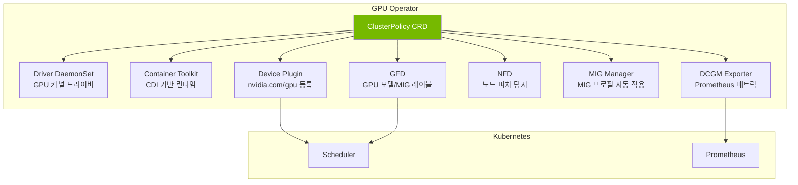
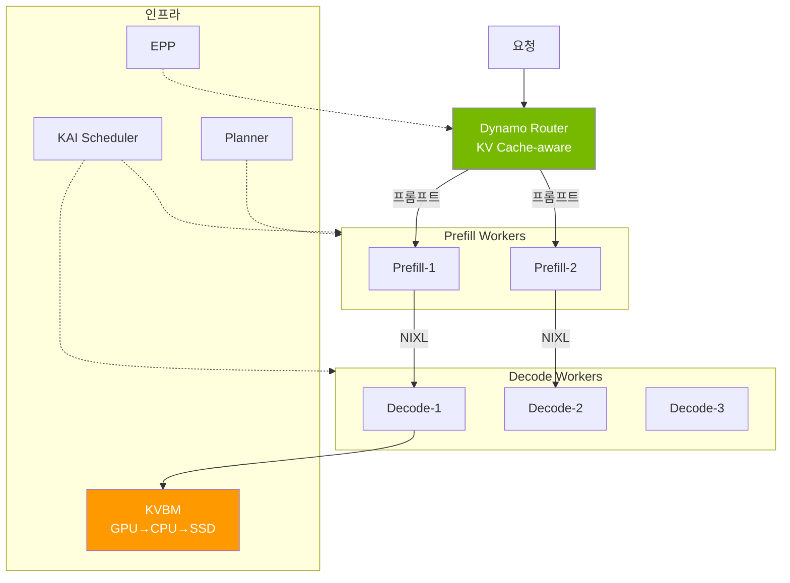

import Tabs from '@theme/Tabs';
import TabItem from '@theme/TabItem';
import { SpecificationTable, ComparisonTable } from '@site/src/components/tables';

# NVIDIA GPU 스택

NVIDIA GPU 소프트웨어 스택은 Kubernetes 환경에서 GPU를 운영하기 위한 계층 구조로 구성됩니다.

| 계층 | 역할 | 핵심 컴포넌트 |
|------|------|-------------|
| **인프라 자동화** | GPU 드라이버, 런타임, 플러그인을 선언적으로 관리 | GPU Operator (ClusterPolicy CRD) |
| **모니터링** | GPU 상태 수집 및 Prometheus 메트릭 노출 | DCGM, DCGM Exporter |
| **파티셔닝** | 단일 GPU를 여러 워크로드가 공유 | MIG, Time-Slicing |
| **추론 최적화** | 데이터센터 규모 LLM 서빙 | Dynamo, KAI Scheduler |

이 문서는 각 컴포넌트의 아키텍처와 설계 판단 기준을 다룹니다. GPU 노드 프로비저닝(Karpenter), 스케일링(KEDA), 비용 최적화는 [GPU 리소스 관리](./gpu-resource-management.md)를 참조하세요.

---

## GPU Operator 아키텍처

### 개념

GPU Operator는 **ClusterPolicy CRD** 하나로 GPU 스택 전체를 번들링하는 오케스트레이션 레이어입니다. 각 컴포넌트를 독립적으로 enable/disable할 수 있으며, 노드가 추가될 때 자동으로 GPU 환경을 구성합니다.

:::info GPU Operator v25.10.1 (2026.03 기준)

| 컴포넌트 | 버전 | 역할 |
|----------|------|------|
| GPU Operator | **v25.10.1** | GPU 스택 라이프사이클 관리 |
| NVIDIA Driver | **580.126.18** | GPU 커널 드라이버 |
| DCGM | **v4.5.2** | GPU 모니터링 엔진 |
| DCGM Exporter | **v4.5.2-4.8.1** | Prometheus 메트릭 노출 |
| Device Plugin | **v0.19.0** | K8s GPU 리소스 등록 |
| GFD | **v0.19.0** | GPU 노드 레이블링 |
| MIG Manager | **v0.13.1** | MIG 파티션 자동 관리 |
| Container Toolkit (CDI) | **v1.17.5** | 컨테이너 GPU 런타임 |

**v25.10.1 주요 신기능:** Blackwell(B200/GB200) 지원, HPC Job Mapping, CDMM(Confidential Computing), CDI(Container Device Interface)
:::

### 컴포넌트 구조



**각 컴포넌트의 역할:**

- **Driver DaemonSet**: GPU 커널 드라이버를 노드에 설치. AL2023/Bottlerocket에서는 AMI에 사전 설치되어 있으므로 `enabled: false`
- **Container Toolkit (CDI)**: 컨테이너 런타임에 GPU 디바이스를 주입. CDI(Container Device Interface) 기반으로 런타임 독립적
- **Device Plugin**: `nvidia.com/gpu` 확장 리소스를 kubelet에 등록. kube-scheduler가 GPU Pod를 배치할 수 있게 함
- **GFD (GPU Feature Discovery)**: GPU 모델, 드라이버 버전, MIG 프로필 등을 노드 레이블로 노출. nodeSelector/nodeAffinity에 활용
- **NFD (Node Feature Discovery)**: 하드웨어 피처(CPU, PCIe, NUMA 등)를 노드 레이블로 노출
- **MIG Manager**: ConfigMap 기반으로 MIG 프로필을 자동 적용. 노드 레이블 변경 시 재구성
- **DCGM Exporter**: DCGM 메트릭을 Prometheus 형식으로 노출

### EKS 환경별 GPU Operator 구성

| 환경 | Driver | Toolkit | Device Plugin | MIG | 비고 |
|------|--------|---------|---------------|-----|------|
| **EKS Auto Mode** | ❌ (AWS 자동) | ❌ (AWS 자동) | ❌ (레이블로 비활성화) | ❌ | DCGM/NFD/GFD 정상 동작 |
| **Karpenter (Self-Managed)** | ❌ (AL2023 AMI) | ❌ (AL2023 AMI) | ✅ | ✅ | 완전 지원 |
| **Managed Node Group** | ❌ (AL2023 AMI) | ❌ (AL2023 AMI) | ✅ | ✅ | 완전 지원 |
| **Hybrid Node (온프레미스)** | ✅ (필수) | ✅ (필수) | ✅ | ✅ | GPU Operator 필수 |

:::caution AMI별 GPU Driver 제약
- **AL2023 / Bottlerocket**: GPU 드라이버가 AMI에 사전 설치. `driver`와 `toolkit` 모두 `enabled: false` 필수
- **EKS Auto Mode**: AWS가 드라이버를 자동 관리. Device Plugin은 노드 레이블 `nvidia.com/gpu.deploy.device-plugin: "false"`로 비활성화
:::

### EKS Auto Mode에서의 GPU Operator

Auto Mode에서는 AWS가 GPU 드라이버와 Device Plugin을 관리하지만, **GPU Operator 설치가 여전히 유용한 경우**가 있습니다.

- **DCGM Exporter**: GPU 메트릭 수집 (Auto Mode 자체는 DCGM을 제공하지 않음)
- **GFD/NFD**: GPU 모델별 노드 레이블링으로 nodeSelector 활용
- **KAI Scheduler**: ClusterPolicy에 의존하는 프로젝트와의 호환성

```yaml
# Auto Mode NodePool — Device Plugin만 레이블로 비활성화
apiVersion: karpenter.sh/v1
kind: NodePool
metadata:
  name: gpu-auto-mode
spec:
  template:
    metadata:
      labels:
        nvidia.com/gpu.deploy.device-plugin: "false"
    spec:
      requirements:
        - key: eks.amazonaws.com/instance-family
          operator: In
          values: ["p5", "p4d"]
      nodeClassRef:
        group: eks.amazonaws.com
        kind: NodeClass
        name: default
```

---

## DCGM 모니터링

### 개요

NVIDIA DCGM(Data Center GPU Manager)은 GPU 상태를 수집하고 Prometheus로 메트릭을 노출하는 모니터링 엔진입니다. GPU Operator가 DCGM Exporter를 DaemonSet으로 자동 배포합니다.

### 배포 방식 선택

<Tabs>
  <TabItem value="daemonset" label="DaemonSet (권장)" default>

| 항목 | 내용 |
|------|------|
| **리소스 효율** | 노드당 1개 인스턴스 — 오버헤드 최소 |
| **관리** | GPU Operator가 자동 관리 |
| **메트릭 범위** | 노드의 모든 GPU 메트릭 수집 |
| **적합 환경** | 프로덕션 환경 (대부분의 경우) |

  </TabItem>
  <TabItem value="sidecar" label="Sidecar (특수 용도)">

| 항목 | 내용 |
|------|------|
| **리소스 효율** | Pod당 1개 인스턴스 — 오버헤드 높음 |
| **메트릭 범위** | 해당 Pod의 GPU 메트릭만 수집 |
| **적합 환경** | 멀티 테넌트 과금, Pod별 격리 필요 시 |

K8s 1.33+의 안정화된 Sidecar Containers(`restartPolicy: Always`)를 사용하여 Pod 라이프사이클과 함께 운영할 수 있습니다.

  </TabItem>
</Tabs>

### 주요 GPU 메트릭

<SpecificationTable
  headers={['메트릭', '설명', '활용']}
  rows={[
    { id: '1', cells: ['DCGM_FI_DEV_GPU_UTIL', 'GPU 코어 사용률 (%)', 'HPA/KEDA 트리거'] },
    { id: '2', cells: ['DCGM_FI_DEV_MEM_COPY_UTIL', '메모리 대역폭 사용률 (%)', '메모리 병목 감지'] },
    { id: '3', cells: ['DCGM_FI_DEV_FB_USED / FB_FREE', '프레임버퍼 사용량/여유량 (MB)', 'OOM 방지, 용량 계획'] },
    { id: '4', cells: ['DCGM_FI_DEV_POWER_USAGE', '전력 사용량 (W)', '비용 및 열 관리'] },
    { id: '5', cells: ['DCGM_FI_DEV_GPU_TEMP', 'GPU 온도 (C)', '열 스로틀링 방지'] },
    { id: '6', cells: ['DCGM_FI_DEV_SM_CLOCK', 'SM 클럭 속도 (MHz)', '성능 모니터링'] }
  ]}
/>

### Prometheus 연동 개념

DCGM Exporter는 `:9400/metrics` 엔드포인트로 Prometheus 형식의 메트릭을 노출합니다. GPU Operator 설치 시 `dcgmExporter.serviceMonitor.enabled=true`를 설정하면 ServiceMonitor가 자동 생성됩니다.

**수집 체인:**

```
GPU Hardware → DCGM Engine → DCGM Exporter (:9400) → Prometheus → Grafana/KEDA
```

**핵심 설계 결정:**
- **수집 주기**: 15초 (기본값). LLM 서빙에서는 10초로 단축 권장
- **메트릭 필터링**: `/etc/dcgm-exporter/dcp-metrics-included.csv`로 필요한 메트릭만 수집하여 카디널리티 제어
- **Pod-GPU 매핑**: `DCGM_EXPORTER_KUBERNETES=true` 설정 시 `pod`, `namespace`, `container` 레이블이 메트릭에 추가

---

## GPU 파티셔닝 전략

### MIG (Multi-Instance GPU)

MIG는 Ampere/Hopper/Blackwell 아키텍처 GPU(A100, H100, H200, B200)를 최대 7개의 **하드웨어적으로 독립된** GPU 인스턴스로 분할합니다. 각 MIG 인스턴스는 독립된 메모리, 캐시, SM(Streaming Multiprocessor)을 가지므로 워크로드 간 간섭 없이 안정적인 성능을 보장합니다.

**MIG의 핵심 가치:**
- **하드웨어 격리**: 메모리, SM, L2 캐시가 완전히 분리되어 QoS 보장
- **동시 실행**: 여러 추론 워크로드가 성능 저하 없이 동시 실행
- **GPU Operator 자동 관리**: MIG Manager가 ConfigMap 기반으로 프로필 자동 적용

**A100 40GB MIG 프로필:**

<SpecificationTable
  headers={['프로필', '메모리', 'SM 수', '용도', '예상 처리량']}
  rows={[
    { id: '1', cells: ['1g.5gb', '5GB', '14', '소형 모델 (3B 이하)', '~20 tok/s'] },
    { id: '2', cells: ['1g.10gb', '10GB', '14', '소형 모델 (3B-7B)', '~25 tok/s'] },
    { id: '3', cells: ['2g.10gb', '10GB', '28', '중형 모델 (7B-13B)', '~50 tok/s'] },
    { id: '4', cells: ['3g.20gb', '20GB', '42', '중대형 모델 (13B-30B)', '~100 tok/s'] },
    { id: '5', cells: ['4g.20gb', '20GB', '56', '대형 모델 (13B-30B)', '~130 tok/s'] },
    { id: '6', cells: ['7g.40gb', '40GB', '84', '전체 GPU (70B+)', '~200 tok/s'] }
  ]}
/>

**MIG 프로필 관리:**

GPU Operator의 MIG Manager는 노드 레이블(`nvidia.com/mig.config`)을 감시하여 MIG 프로필을 자동 적용합니다. ConfigMap에 프로필을 정의하고, 노드 레이블을 변경하면 MIG Manager가 GPU를 재구성합니다.

```yaml
# MIG 프로필 ConfigMap (mig-parted 형식)
apiVersion: v1
kind: ConfigMap
metadata:
  name: default-mig-parted-config
  namespace: gpu-operator
data:
  config.yaml: |
    version: v1
    mig-configs:
      all-1g.5gb:          # 7개 소형 인스턴스
        - devices: all
          mig-enabled: true
          mig-devices:
            "1g.5gb": 7
      mixed-balanced:      # 혼합 구성
        - devices: all
          mig-enabled: true
          mig-devices:
            "3g.20gb": 1
            "2g.10gb": 1
            "1g.5gb": 2
      single-7g:           # 단일 대형
        - devices: all
          mig-enabled: true
          mig-devices:
            "7g.40gb": 1
```

Pod에서 MIG 디바이스를 사용할 때는 `nvidia.com/mig-<profile>` 리소스를 요청합니다.

```yaml
resources:
  requests:
    nvidia.com/mig-1g.5gb: 1
  limits:
    nvidia.com/mig-1g.5gb: 1
```

### Time-Slicing

Time-Slicing은 시간 기반으로 GPU 컴퓨팅 시간을 분할하여 여러 Pod이 동일 GPU를 공유합니다. MIG와 달리 **모든 NVIDIA GPU에서 사용 가능**하지만, 워크로드 간 메모리 격리가 없습니다.

**구성 방법:**

GPU Operator의 ClusterPolicy에서 ConfigMap을 참조하여 Time-Slicing을 활성화합니다.

```yaml
# Time-Slicing ConfigMap
apiVersion: v1
kind: ConfigMap
metadata:
  name: time-slicing-config
  namespace: gpu-operator
data:
  any: |-
    version: v1
    sharing:
      timeSlicing:
        resources:
          - name: nvidia.com/gpu
            replicas: 4    # 각 GPU를 4개 Pod이 공유
```

Pod에서는 일반 GPU 요청과 동일하게 `nvidia.com/gpu: 1`을 요청합니다. Time-Slicing이 활성화된 노드에서는 GPU 조각이 할당됩니다.

### MIG vs Time-Slicing 비교

<ComparisonTable
  headers={['항목', 'MIG', 'Time-Slicing']}
  rows={[
    { id: '1', cells: ['격리 수준', '하드웨어 격리 (메모리, SM, 캐시)', '소프트웨어 시분할 (격리 없음)'] },
    { id: '2', cells: ['지원 GPU', 'A100, H100, H200, B200', '모든 NVIDIA GPU'] },
    { id: '3', cells: ['최대 분할', '7개 인스턴스', '제한 없음 (성능 저하 비례)'] },
    { id: '4', cells: ['성능 예측', '보장됨 (QoS)', '동시 워크로드 수에 따라 변동'] },
    { id: '5', cells: ['메모리 안전', 'OOM이 다른 인스턴스에 영향 없음', 'OOM이 다른 워크로드에 영향'] },
    { id: '6', cells: ['적합 환경', '프로덕션 추론, 멀티 테넌트', '개발/테스트, 배치 추론'], recommended: true }
  ]}
/>

:::warning Time-Slicing 성능 특성
- **컨텍스트 스위칭 오버헤드**: 약 1% 수준으로 미미
- **동시 실행 성능 저하**: GPU 메모리와 컴퓨팅을 공유하므로 동시 워크로드 수에 따라 **50-100% 성능 저하**
- **메모리 격리 없음**: 한 워크로드의 OOM이 다른 워크로드에 영향
- **적합**: 배치 추론, 개발/테스트 환경 | **부적합**: 실시간 추론(SLA), 고성능 학습
:::

---

## Dynamo: 데이터센터 규모 추론 최적화

### 개요

**NVIDIA Dynamo**는 데이터센터 규모의 LLM 추론을 최적화하는 오픈소스 프레임워크입니다. vLLM, SGLang, TensorRT-LLM을 백엔드로 지원하며, 기존 대비 **최대 7x 성능 향상**을 달성했습니다.

:::info Dynamo v1.0 GA (2026.03)
- **서빙 모드**: Aggregated + Disaggregated 동등 지원
- **핵심 기술**: Flash Indexer, NIXL, KAI Scheduler, Planner, EPP
- **배포 방식**: Kubernetes Operator + CRD (DGDR)
- **라이선스**: Apache 2.0
:::

### 핵심 아키텍처

Dynamo는 Aggregated Serving과 Disaggregated Serving 모두 지원합니다. Disaggregated 모드에서는 Prefill(프롬프트 처리)과 Decode(토큰 생성)를 분리하여 독립 스케일링합니다.



### 핵심 컴포넌트

| 컴포넌트 | 역할 | 이점 |
|----------|------|------|
| **Disaggregated Serving** | Prefill/Decode 워커 분리 | 각 단계별 독립 스케일링, GPU 활용 극대화 |
| **Flash Indexer** | Radix tree 기반 worker별 KV cache 인덱싱 | Prefix 매칭 최적화, KV 재사용률 극대화 |
| **KVBM** | GPU → CPU → SSD 3-tier 캐시 | 메모리 효율 극대화, 대규모 컨텍스트 지원 |
| **NIXL** | NVIDIA Inference Transfer Library | GPU 간 KV Cache 초고속 전송 (NVLink/RDMA). Dynamo, llm-d, production-stack, aibrix 등이 공통 사용 |
| **Planner** | SLO 기반 오토스케일링 | Profiling → SLO 목표 기반 자동 Prefill/Decode 스케일링 |
| **EPP** | Endpoint Picker Protocol | K8s Gateway API와 네이티브 통합 |
| **AIConfigurator** | 자동 TP/PP 추천 | 모델 크기, GPU 메모리, 네트워크 토폴로지 기반 최적 병렬화 |

### llm-d와의 선택 가이드

llm-d와 Dynamo는 모두 LLM 추론 라우팅/스케줄링을 담당하며, **라우팅 레이어에서 경쟁**하므로 선택하여 사용합니다.

```
llm-d:    Client → llm-d Router → vLLM Workers
Dynamo:   Client → Dynamo Router → Prefill Workers → (NIXL) → Decode Workers
```

<ComparisonTable
  headers={['항목', 'llm-d', 'Dynamo']}
  rows={[
    { id: '1', cells: ['아키텍처', 'Aggregated + Disaggregated', 'Aggregated + Disaggregated (동등 지원)'] },
    { id: '2', cells: ['KV Cache 라우팅', 'Prefix-aware', 'Prefix-aware + Flash Indexer (radix tree)'] },
    { id: '3', cells: ['KV Cache 전송', 'NIXL', 'NIXL (NVLink/RDMA)'] },
    { id: '4', cells: ['Pod 스케줄링', 'K8s 기본 스케줄러', 'KAI Scheduler (GPU-aware)'] },
    { id: '5', cells: ['오토스케일링', 'HPA/KEDA 연동', 'Planner (SLO 기반) + KEDA/HPA'] },
    { id: '6', cells: ['백엔드', 'vLLM', 'vLLM, SGLang, TRT-LLM'] },
    { id: '7', cells: ['복잡도', '낮음 — 기존 vLLM에 라우터 추가', '높음 — 전체 서빙 스택 교체'] },
    { id: '8', cells: ['성숙도', 'v0.5+', 'v1.0 GA'] }
  ]}
/>

| 시나리오 | 추천 |
|----------|------|
| 기존 vLLM에 라우팅만 추가 | **llm-d** |
| 소규모~중규모 (GPU 8개 이하) | **llm-d** |
| Gateway API 기반 K8s 네이티브 | **llm-d** |
| 대규모 (GPU 16개+), 처리량 극대화 | **Dynamo** |
| 긴 컨텍스트 (128K+) 워크로드 | **Dynamo** (3-tier KV cache) |
| 빠른 도입, 낮은 운영 복잡도 | **llm-d** |

:::tip 마이그레이션 경로
llm-d로 시작해서 규모가 커지면 Dynamo로 전환하는 것이 현실적입니다. 둘 다 vLLM 백엔드와 NIXL KV 전송을 공유합니다. 핵심 차이는 Dynamo의 Flash Indexer, KAI Scheduler, Planner입니다. Dynamo 1.0은 llm-d를 내부 컴포넌트로 통합할 수 있어, 완전한 대안이라기보다 상위 집합으로 볼 수도 있습니다.
:::

---

## KAI Scheduler

KAI Scheduler는 NVIDIA의 **GPU-aware Kubernetes Pod 스케줄러**입니다. 기본 kube-scheduler와 달리 GPU 토폴로지(NVLink, PCIe), MIG 슬라이스, Gang Scheduling을 인식하여 최적의 Pod 배치를 결정합니다.

### 핵심 기능

| 기능 | 설명 |
|------|------|
| **GPU Topology Awareness** | NVLink/PCIe 연결 구조를 인식하여 통신 비용 최소화 |
| **MIG-aware Scheduling** | MIG 슬라이스를 개별 스케줄링 단위로 인식 |
| **Gang Scheduling** | 분산 학습에서 모든 Pod가 동시에 배치되도록 보장 |
| **Fair-share Scheduling** | 네임스페이스/팀별 GPU 할당량 관리 |
| **Preemption** | 우선순위 기반 Pod 교체 |

### 설계 고려사항

- **ClusterPolicy 의존**: KAI Scheduler는 GPU Operator의 ClusterPolicy가 설치되어 있어야 동작합니다
- **EKS Auto Mode**: GPU Operator 설치 후 Device Plugin만 레이블로 비활성화하면 KAI Scheduler 사용 가능
- **kube-scheduler와의 관계**: KAI Scheduler는 kube-scheduler를 대체하지 않고, GPU 워크로드에 대해서만 스케줄링을 위임받는 Secondary Scheduler로 동작

:::info KAI Scheduler ≠ 오토스케일링
KAI Scheduler는 **Pod를 어떤 노드에 배치할지** 결정하는 스케줄러입니다. Pod 수를 늘리는 오토스케일링(KEDA/HPA)이나 노드를 추가하는 프로비저닝(Karpenter)과는 별개의 역할입니다.
:::

---

## 관련 문서

- [GPU 리소스 관리](./gpu-resource-management.md) — Karpenter, KEDA, DRA, 비용 최적화
- [EKS GPU 노드 전략](./eks-gpu-node-strategy.md) — Auto Mode + Karpenter + Hybrid Node 구성
- [vLLM 모델 서빙](../inference-frameworks/vllm-model-serving.md) — vLLM 기반 추론 엔진
- [llm-d EKS Auto Mode](../inference-frameworks/llm-d-eks-automode.md) — llm-d 상세 아키텍처

## 참고 자료

- [NVIDIA GPU Operator Documentation](https://docs.nvidia.com/datacenter/cloud-native/gpu-operator/latest/)
- [NVIDIA DCGM Exporter](https://github.com/NVIDIA/dcgm-exporter)
- [NVIDIA Dynamo GitHub](https://github.com/ai-dynamo/dynamo)
- [NIXL - NVIDIA Inference Transfer Library](https://github.com/ai-dynamo/nixl)
- [KAI Scheduler](https://github.com/NVIDIA/KAI-Scheduler)
