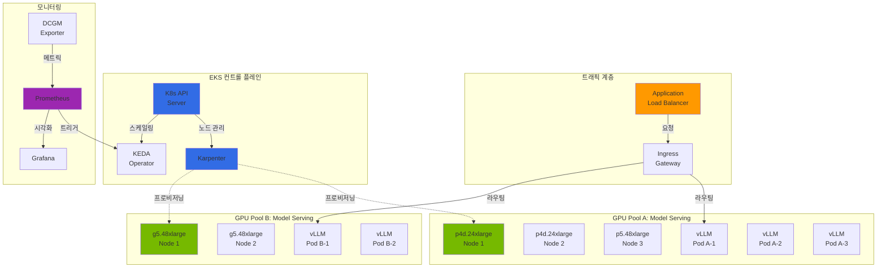
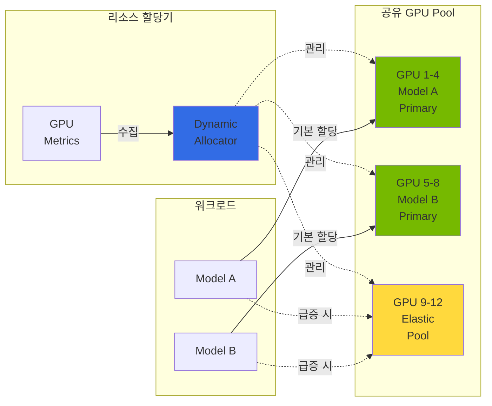
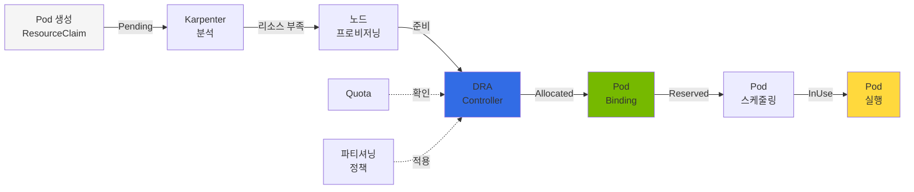
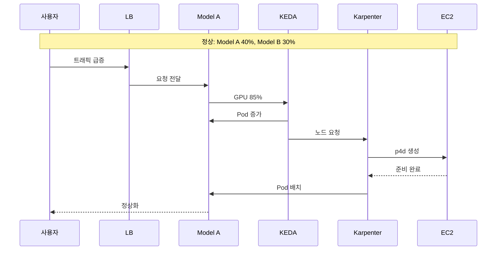
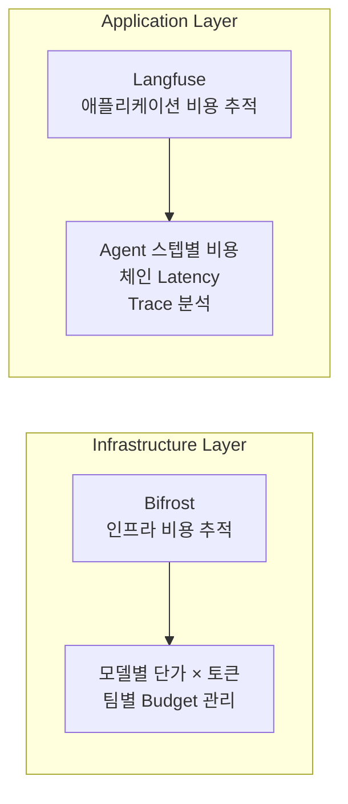

import Tabs from '@theme/Tabs';
import TabItem from '@theme/TabItem';
import { SpecificationTable, ComparisonTable } from '@site/src/components/tables';
import { DraLimitationsTable, ScalingDecisionTable } from '@site/src/components/GpuResourceTables';
import {
  SpotInstancePricingInference,
  SavingsPlansPricingTraining,
  SmallScaleCostCalculation,
  MediumScaleCostCalculation,
  LargeScaleCostCalculation,
  CostOptimizationStrategies,
  CostOptimizationDetails,
  TrainingCostOptimization,
  KarpenterGpuOptimization
} from '@site/src/components/AgenticSolutionsTables';

# EKS GPU 클러스터 동적 리소스 관리

> 📅 **작성일**: 2025-02-09 | **수정일**: 2026-03-20 | ⏱️ **읽는 시간**: 약 8분


## 개요

대규모 GenAI 서비스 환경에서는 복수의 GPU 클러스터를 효율적으로 관리하고, 트래픽 변화에 따라 동적으로 리소스를 재할당하는 것이 핵심입니다. 이 문서에서는 Amazon EKS 환경에서 Karpenter를 활용한 GPU 노드 자동 스케일링, KEDA를 통한 워크로드 자동 스케일링, DRA(Dynamic Resource Allocation) 기반 GPU 리소스 관리, 그리고 비용 최적화 전략을 다룹니다.

### 주요 목표

- **리소스 효율성**: GPU 리소스의 유휴 시간 최소화
- **비용 최적화**: Spot 인스턴스 활용 및 Consolidation을 통한 비용 절감
- **자동화된 스케일링**: 트래픽 패턴에 따른 자동 리소스 조정
- **서비스 안정성**: SLA 준수를 위한 적절한 리소스 확보

---

## 멀티 GPU 클러스터 아키텍처

### 전체 아키텍처 다이어그램



### 리소스 공유 아키텍처

복수 모델 간 GPU 리소스를 효율적으로 공유하기 위한 아키텍처입니다.



:::info 리소스 공유 원칙

- **Primary Pool**: 각 모델에 할당된 기본 GPU 리소스
- **Elastic Pool**: 트래픽 급증 시 동적으로 할당되는 공유 리소스
- **Priority-based Allocation**: 우선순위 기반 리소스 할당으로 중요 워크로드 보호

:::

---

## Karpenter 기반 노드 스케일링

:::info Karpenter v1.0+ GA 상태
Karpenter는 v1.0부터 GA(Generally Available) 상태로, 프로덕션 환경에서 안정적으로 사용할 수 있습니다. 본 문서의 모든 예제는 Karpenter v1 API (`karpenter.sh/v1`)를 사용합니다.
:::

### NodePool 설정

GPU 워크로드를 위한 Karpenter NodePool 설정 예제입니다.

```yaml
apiVersion: karpenter.sh/v1
kind: NodePool
metadata:
  name: gpu-inference-pool
spec:
  template:
    metadata:
      labels:
        node-type: gpu-inference
        workload: genai
    spec:
      requirements:
        - key: kubernetes.io/arch
          operator: In
          values: ["amd64"]
        - key: karpenter.sh/capacity-type
          operator: In
          values: ["on-demand", "spot"]
        - key: node.kubernetes.io/instance-type
          operator: In
          values:
            - p4d.24xlarge    # 8x A100 40GB
            - p5.48xlarge     # 8x H100 80GB
            - g5.48xlarge     # 8x A10G 24GB
        - key: karpenter.k8s.aws/instance-gpu-count
          operator: Gt
          values: ["0"]
      nodeClassRef:
        group: karpenter.k8s.aws
        kind: EC2NodeClass
        name: gpu-nodeclass
      taints:
        - key: nvidia.com/gpu
          value: "true"
          effect: NoSchedule
  limits:
    cpu: 1000
    memory: 4000Gi
    nvidia.com/gpu: 64
  disruption:
    consolidationPolicy: WhenEmptyOrUnderutilized
    consolidateAfter: 30s
  weight: 100
```

### EC2NodeClass 설정

GPU 인스턴스를 위한 EC2NodeClass 설정입니다.

```yaml
apiVersion: karpenter.k8s.aws/v1
kind: EC2NodeClass
metadata:
  name: gpu-nodeclass
spec:
  role: KarpenterNodeRole-${CLUSTER_NAME}
  amiSelectorTerms:
    - alias: al2023@latest
  subnetSelectorTerms:
    - tags:
        karpenter.sh/discovery: ${CLUSTER_NAME}
  securityGroupSelectorTerms:
    - tags:
        karpenter.sh/discovery: ${CLUSTER_NAME}
  blockDeviceMappings:
    - deviceName: /dev/xvda
      ebs:
        volumeSize: 500Gi
        volumeType: gp3
        iops: 10000
        throughput: 500
        encrypted: true
        deleteOnTermination: true
  instanceStorePolicy: RAID0
  userData: |
    #!/bin/bash
    # NVIDIA 드라이버 및 Container Toolkit 설정
    nvidia-smi

    # GPU 메모리 모드 설정 (Persistence Mode)
    nvidia-smi -pm 1

    # EFA 드라이버 로드 (p4d, p5 인스턴스용)
    modprobe efa
  tags:
    Environment: production
    Workload: genai-inference
```

### GPU 인스턴스 타입 비교

<ComparisonTable
  headers={['인스턴스 타입', 'GPU', 'GPU 메모리', 'vCPU', '메모리', '네트워크', '용도']}
  rows={[
    { id: '1', cells: ['p4d.24xlarge', '8x A100', '40GB x 8', '96', '1152 GiB', '400 Gbps EFA', '대규모 LLM 추론'], recommended: true },
    { id: '2', cells: ['p5.48xlarge', '8x H100', '80GB x 8', '192', '2048 GiB', '3200 Gbps EFA', '초대규모 모델, 학습'] },
    { id: '3', cells: ['p5e.48xlarge', '8x H200', '141GB x 8', '192', '2048 GiB', '3200 Gbps EFA', '대규모 모델 학습/추론'] },
    { id: '4', cells: ['g5.48xlarge', '8x A10G', '24GB x 8', '192', '768 GiB', '100 Gbps', '중소규모 모델 추론'] },
    { id: '5', cells: ['g6e.xlarge ~ g6e.48xlarge', 'NVIDIA L40S', '최대 8x48GB', '최대 192', '최대 768 GiB', '최대 100 Gbps', '비용 효율적 추론'] },
    { id: '6', cells: ['trn2.48xlarge', '16x Trainium2', '-', '192', '2048 GiB', '1600 Gbps', 'AWS 네이티브 학습'] }
  ]}
/>

:::tip 인스턴스 선택 가이드

- **p5e.48xlarge**: 100B+ 파라미터 모델, H200의 최대 메모리 활용
- **p5.48xlarge**: 70B+ 파라미터 모델, 최고 성능 요구 시
- **p4d.24xlarge**: 13B-70B 파라미터 모델, 비용 대비 성능 균형
- **g6e.xlarge~48xlarge**: 13B-70B 모델, L40S의 비용 효율적 추론
- **g5.48xlarge**: 7B 이하 모델, 비용 효율적인 추론
- **trn2.48xlarge**: AWS 네이티브 학습 워크로드, Trainium2 최적화

:::

:::tip EKS Auto Mode GPU 스케줄링
EKS Auto Mode는 GPU 워크로드를 자동으로 감지하고 적절한 GPU 인스턴스를 프로비저닝합니다. NodePool 설정 없이도 GPU Pod의 리소스 요청에 따라 최적의 인스턴스를 선택합니다.
:::

---

## Kubernetes GPU 리소스 관리

### K8s 1.33/1.34 주요 기능

Kubernetes 1.33과 1.34 버전에서는 GPU 워크로드 관리를 위한 여러 중요한 기능이 추가되었습니다.

<Tabs>
  <TabItem value="k8s133" label="Kubernetes 1.33+" default>

| 기능 | 설명 | GPU 워크로드 영향 |
|------|------|------------------|
| **Stable Sidecar Containers** | Init 컨테이너가 Pod 전체 라이프사이클 동안 실행 가능 | GPU 메트릭 수집, 로깅 사이드카 안정화 |
| **Topology-Aware Routing** | 노드 토폴로지 기반 트래픽 라우팅 | GPU 노드 간 최적 경로 선택, 지연 시간 감소 |
| **In-Place Resource Resizing** | Pod 재시작 없이 리소스 조정 | GPU 메모리 동적 조정 (제한적) |
| **DRA v1beta1 안정화** | Dynamic Resource Allocation API 안정화 | 프로덕션 GPU 파티셔닝 지원 |

  </TabItem>
  <TabItem value="k8s134" label="Kubernetes 1.34+">

| 기능 | 설명 | GPU 워크로드 영향 |
|------|------|------------------|
| **Projected Service Account Tokens** | 향상된 서비스 계정 토큰 관리 | GPU Pod의 보안 강화 |
| **DRA Prioritized Alternatives** | 리소스 할당 우선순위 대안 | GPU 리소스 경합 시 지능적 스케줄링 |
| **Improved Resource Quota** | 리소스 쿼터 세분화 | GPU 테넌트별 정밀한 할당 제어 |

  </TabItem>
</Tabs>

### DRA 심층 분석: Dynamic Resource Allocation

#### DRA의 등장 배경과 필요성

:::info DRA (Dynamic Resource Allocation) 상태 업데이트

- **K8s 1.26-1.30**: Alpha (feature gate 필요, `v1alpha2` API)
- **K8s 1.31**: Beta로 승격, 기본 활성화 (`v1alpha2` API)
- **K8s 1.32**: 새로운 구현(KEP #4381)으로 전환, `v1beta1` API (기본 비활성화)
- **K8s 1.33+**: `v1beta1` API 안정화, 성능 대폭 개선, 프로덕션 준비 완료
- **K8s 1.34+**: DRA 우선순위 대안(prioritized alternatives) 지원, 향상된 스케줄링
- EKS 1.32+에서 DRA를 사용하려면 `DynamicResourceAllocation` feature gate를 명시적으로 활성화해야 합니다.
- EKS 1.33+에서는 DRA가 기본 활성화되며, 안정적인 프로덕션 사용이 가능합니다.
:::

Kubernetes 초기 단계에서 GPU 리소스 할당은 **Device Plugin** 모델을 사용했습니다. 이 모델은 다음과 같은 근본적인 한계를 가집니다:

<DraLimitationsTable />

**DRA (Dynamic Resource Allocation)**는 Kubernetes 1.26에서 Alpha로 도입되었으며, 1.31+에서 Beta로 승격되어 이러한 한계를 극복합니다.

#### DRA의 핵심 개념

DRA는 **선언적 리소스 요청과 즉시 할당**을 분리하는 새로운 패러다임입니다:



#### ResourceClaim 라이프사이클

DRA의 핵심은 **ResourceClaim**이라는 새로운 Kubernetes 리소스입니다:

:::warning API 버전 주의
아래 예시는 K8s 1.31 이하의 `v1alpha2` API 기준입니다.

**K8s 1.32+**: `resource.k8s.io/v1beta1` API로 전환, ResourceClass 대신 DeviceClass 사용, ResourceClaim 스펙 구조 변경

**K8s 1.33+**: `v1beta1` API 안정화, 프로덕션 사용 권장

**K8s 1.34+**: DRA 우선순위 대안 지원, 향상된 리소스 스케줄링

프로덕션 배포 시 클러스터 버전에 맞는 API를 사용하세요.
:::

```yaml
# 1. 라이프사이클 상태 설명

# PENDING 상태: 리소스 할당 대기 중
apiVersion: resource.k8s.io/v1alpha2
kind: ResourceClaim
metadata:
  name: gpu-claim-vllm
  namespace: ai-inference
spec:
  resourceClassName: gpu.nvidia.com
  parametersRef:
    apiGroup: gpu.nvidia.com
    kind: GpuClaimParameters
    name: h100-params
status:
  phase: Pending  # 아직 할당되지 않음

---

# ALLOCATED 상태: DRA 컨트롤러가 리소스 예약 완료
status:
  phase: Allocated
  allocation:
    resourceHandle: "gpu-handle-12345"
    shareable: false

---

# RESERVED 상태: Pod이 바인딩될 준비 완료
status:
  phase: Reserved
  allocation:
    resourceHandle: "gpu-handle-12345"
    nodeName: "gpu-node-01"

---

# INUSE 상태: Pod이 활성 실행 중
status:
  phase: InUse
  allocation:
    resourceHandle: "gpu-handle-12345"
    nodeName: "gpu-node-01"
  reservedFor:
    - kind: Pod
      name: vllm-inference
      namespace: ai-inference
      uid: "abc123"
```

각 상태에서 다음 상태로 전환되려면 특정 조건을 만족해야 합니다:

- **Pending -> Allocated**: DRA 드라이버가 사용 가능한 리소스 확인 및 예약
- **Allocated -> Reserved**: Pod이 ResourceClaim을 지정하고 스케줄러가 노드 결정
- **Reserved -> InUse**: Pod이 실제로 노드에서 실행 시작

#### DRA vs Device Plugin 상세 비교

<ComparisonTable
  headers={['항목', 'Device Plugin', 'DRA']}
  rows={[
    { id: '1', cells: ['리소스 할당 시점', '노드 시작 시 (정적)', 'Pod 스케줄링 시 (동적)'] },
    { id: '2', cells: ['할당 단위', '전체 GPU만 가능', 'GPU 분할 가능 (MIG, time-slicing)'] },
    { id: '3', cells: ['우선순위 지원', '없음 (선착순)', 'ResourceClaim의 우선순위 지원'] },
    { id: '4', cells: ['멀티 리소스 조율', '불가능', 'Pod 수준에서 여러 리소스 조율'] },
    { id: '5', cells: ['성능 제약 정책', '없음', 'ResourceClass로 성능 정책 정의 가능'] },
    { id: '6', cells: ['할당 복원력', '노드 장애 시 수동 정리', '자동 복구 메커니즘'] },
    { id: '7', cells: ['Kubernetes 버전', '1.8+', '1.26+ (Alpha), 1.32+ (v1beta1)'] },
    { id: '8', cells: ['성숙도', '프로덕션', '1.33+ 프로덕션 준비'], recommended: true }
  ]}
/>

:::tip DRA 선택 가이드
**DRA를 사용해야 할 때:**

- GPU 파티셔닝이 필요한 경우 (MIG, time-slicing)
- 멀티 테넌트 환경에서 공정한 리소스 배분 필요
- 리소스 우선순위를 적용해야 하는 경우
- 동적 스케일링이 중요한 경우
- **K8s 1.33+ 환경**: DRA `v1beta1` API 안정화, 프로덕션 사용 권장
- **K8s 1.34+ 환경**: DRA 우선순위 대안으로 향상된 스케줄링 활용

**Device Plugin이 충분한 경우:**

- 단순히 GPU를 전체 단위로만 할당
- 레거시 시스템과의 호환성 중요
- Kubernetes 버전이 1.32 이하
:::

### Topology-Aware Routing 활용

GPU 노드 간 최적 경로를 선택하여 지연 시간을 최소화합니다.

```yaml
apiVersion: v1
kind: Service
metadata:
  name: vllm-inference
  namespace: ai-inference
  annotations:
    # K8s 1.33+ Topology-Aware Routing
    service.kubernetes.io/topology-mode: "Auto"
spec:
  selector:
    app: vllm
  ports:
    - port: 8000
      targetPort: 8000
  # 토폴로지 인식 라우팅 활성화
  trafficDistribution: PreferClose
```

---

## 워크로드 자동 스케일링

### KEDA ScaledObject 설정

KEDA를 사용하여 GPU 메트릭 기반 자동 스케일링을 구성합니다. GPU 메트릭은 DCGM Exporter를 통해 수집되며, DCGM 배포 및 메트릭 상세는 [NVIDIA GPU 스택](./nvidia-gpu-stack.md#dcgm-모니터링)을 참조하세요.

```yaml
apiVersion: keda.sh/v1alpha1
kind: ScaledObject
metadata:
  name: model-a-gpu-scaler
  namespace: inference
spec:
  scaleTargetRef:
    apiVersion: apps/v1
    kind: Deployment
    name: model-a-serving
  pollingInterval: 15
  cooldownPeriod: 60
  minReplicaCount: 2
  maxReplicaCount: 10
  fallback:
    failureThreshold: 3
    replicas: 3
  advanced:
    horizontalPodAutoscalerConfig:
      behavior:
        scaleDown:
          stabilizationWindowSeconds: 300
          policies:
            - type: Percent
              value: 25
              periodSeconds: 60
        scaleUp:
          stabilizationWindowSeconds: 0
          policies:
            - type: Percent
              value: 100
              periodSeconds: 15
            - type: Pods
              value: 4
              periodSeconds: 15
          selectPolicy: Max
  triggers:
    - type: prometheus
      metadata:
        serverAddress: http://prometheus-server.monitoring:9090
        metricName: gpu_utilization
        query: |
          avg(DCGM_FI_DEV_GPU_UTIL{pod=~"model-a-.*"})
        threshold: "70"
        activationThreshold: "50"
```

### 자동 스케일링 임계값

워크로드 특성에 따른 권장 임계값입니다.

<SpecificationTable
  headers={['워크로드 유형', 'Scale Up 임계값', 'Scale Down 임계값', 'Cooldown']}
  rows={[
    { id: '1', cells: ['실시간 추론', 'GPU 70%', 'GPU 30%', '60초'] },
    { id: '2', cells: ['배치 처리', 'GPU 85%', 'GPU 40%', '300초'] },
    { id: '3', cells: ['대화형 서비스', 'GPU 60%', 'GPU 25%', '30초'] }
  ]}
/>

:::tip 임계값 튜닝 가이드

1. **초기 설정**: 보수적인 값(Scale Up 80%, Scale Down 20%)으로 시작
2. **모니터링**: 2-3일간 실제 트래픽 패턴 관찰
3. **조정**: 응답 시간 SLA와 비용을 고려하여 점진적 조정
4. **검증**: 부하 테스트를 통한 설정 검증

:::

### HPA와 KEDA 연동

기본 HPA와 KEDA를 함께 사용하는 경우의 설정입니다.

```yaml
apiVersion: autoscaling/v2
kind: HorizontalPodAutoscaler
metadata:
  name: model-a-hpa
  namespace: inference
spec:
  scaleTargetRef:
    apiVersion: apps/v1
    kind: Deployment
    name: model-a-serving
  minReplicas: 2
  maxReplicas: 10
  metrics:
    - type: External
      external:
        metric:
          name: gpu_utilization
          selector:
            matchLabels:
              scaledobject.keda.sh/name: model-a-gpu-scaler
        target:
          type: AverageValue
          averageValue: "70"
```

### 동적 리소스 할당 전략

#### 트래픽 급증 시나리오

실제 운영 환경에서 발생할 수 있는 트래픽 급증 시나리오와 대응 전략입니다.



#### 모델 간 리소스 재할당 절차

Model A에 트래픽이 급증할 때 Model B의 유휴 리소스를 Model A에 할당하는 구체적인 절차입니다.

**단계 1: 메트릭 수집 및 분석**

```yaml
# DCGM Exporter가 수집하는 주요 메트릭
# - DCGM_FI_DEV_GPU_UTIL: GPU 사용률
# - DCGM_FI_DEV_MEM_COPY_UTIL: 메모리 복사 사용률
# - DCGM_FI_DEV_FB_USED: 프레임버퍼 사용량
```

**단계 2: 스케일링 결정**

<ScalingDecisionTable />

**단계 3: 리소스 재할당 실행**

```bash
# Model B의 replica 수 감소 (유휴 리소스 확보)
kubectl scale deployment model-b-serving --replicas=1 -n inference

# Model A의 replica 수 증가
kubectl scale deployment model-a-serving --replicas=5 -n inference

# 또는 KEDA가 자동으로 처리
```

**단계 4: 노드 레벨 스케일링**

Karpenter가 자동으로 추가 노드를 프로비저닝하거나 유휴 노드를 정리합니다.

:::warning 주의사항

리소스 재할당 시 Model B의 최소 SLA를 보장하기 위해 `minReplicas`를 설정해야 합니다. 완전한 리소스 회수는 서비스 중단을 야기할 수 있습니다.

:::

---

## 비용 최적화 전략

### GPU 워크로드 비용 비교

실제 AWS 가격 기준으로 다양한 GPU 인스턴스 타입의 비용 효율성을 비교합니다.

#### 추론 워크로드 비용 비교 (시간당)

<SpotInstancePricingInference />

#### 학습 워크로드 비용 비교 (시간당)

<SavingsPlansPricingTraining />

#### 월간 비용 시나리오 (24/7 운영 기준)

**시나리오 1: 소규모 추론 서비스 (g5.2xlarge x 2)**

<SmallScaleCostCalculation />

**시나리오 2: 중규모 추론 서비스 (g5.12xlarge x 4)**

<MediumScaleCostCalculation />

**시나리오 3: 대규모 학습 클러스터 (p4d.24xlarge x 8)**

<LargeScaleCostCalculation />

#### 비용 최적화 전략별 효과

<CostOptimizationStrategies />

:::tip 비용 최적화 실전 팁

**추론 워크로드:**
1. Spot 인스턴스를 기본으로 사용 (70% 절감)
2. Karpenter Consolidation으로 유휴 노드 제거 (추가 20% 절감)
3. 시간대별 스케줄링으로 비업무 시간 리소스 축소 (추가 30% 절감)
4. **총 절감 효과: 약 85%**

**학습 워크로드:**
1. Savings Plans 1년 약정 (35% 절감)
2. 실험용 학습은 Spot 인스턴스 사용 (추가 40% 절감)
3. 체크포인트 기반 재시작으로 Spot 중단 대응
4. **총 절감 효과: 약 60%**
:::

### Karpenter 기반 비용 최적화 전략

Karpenter는 GPU 인프라 비용 최적화의 **핵심 레버**입니다. 다음 4가지 전략을 조합하여 최대 효과를 얻을 수 있습니다.

<KarpenterGpuOptimization />

#### 전략 1: Spot 인스턴스 우선 활용

Karpenter의 Spot 인스턴스 지원을 활용하면 GPU 비용을 **최대 90%까지 절감**할 수 있습니다.

```yaml
apiVersion: karpenter.sh/v1
kind: NodePool
metadata:
  name: gpu-spot-inference
spec:
  template:
    metadata:
      labels:
        cost-tier: spot
        workload: inference
    spec:
      requirements:
        - key: karpenter.sh/capacity-type
          operator: In
          values: ["spot"]
        - key: node.kubernetes.io/instance-type
          operator: In
          values:
            - g5.12xlarge
            - g5.24xlarge
            - g5.48xlarge
            - p4d.24xlarge
      nodeClassRef:
        group: karpenter.k8s.aws
        kind: EC2NodeClass
        name: gpu-spot-nodeclass
      taints:
        - key: nvidia.com/gpu
          value: "true"
          effect: NoSchedule
        - key: karpenter.sh/capacity-type
          value: "spot"
          effect: NoSchedule
  limits:
    nvidia.com/gpu: 32
  disruption:
    consolidationPolicy: WhenEmpty
    consolidateAfter: 30s
  weight: 50  # On-Demand보다 우선 선택
```

#### 전략 2: 시간대별 스케줄 기반 비용 관리

업무 시간과 비업무 시간에 따른 차별화된 리소스 정책을 적용합니다.

```yaml
apiVersion: karpenter.sh/v1
kind: NodePool
metadata:
  name: gpu-scheduled-pool
spec:
  template:
    spec:
      requirements:
        - key: karpenter.sh/capacity-type
          operator: In
          values: ["on-demand", "spot"]
        - key: node.kubernetes.io/instance-type
          operator: In
          values:
            - g5.12xlarge
            - g5.24xlarge
      nodeClassRef:
        group: karpenter.k8s.aws
        kind: EC2NodeClass
        name: gpu-nodeclass
  limits:
    nvidia.com/gpu: 16
  disruption:
    consolidationPolicy: WhenEmptyOrUnderutilized
    consolidateAfter: 30s
    budgets:
      # 업무 시간: 안정성 우선 (노드 중단 최소화)
      - nodes: "10%"
        schedule: "0 9 * * 1-5"
        duration: 9h
      # 비업무 시간: 비용 우선 (적극적 통합)
      - nodes: "50%"
        schedule: "0 18 * * 1-5"
        duration: 15h
      # 주말: 최소 리소스 유지
      - nodes: "80%"
        schedule: "0 0 * * 0,6"
        duration: 24h
```

#### 전략 3: Consolidation을 통한 유휴 리소스 제거

```yaml
apiVersion: karpenter.sh/v1
kind: NodePool
metadata:
  name: gpu-consolidation-pool
spec:
  disruption:
    # 노드가 비어있거나 활용도가 낮을 때 통합
    consolidationPolicy: WhenEmptyOrUnderutilized
    # 빠른 통합으로 비용 절감 (30초 대기 후 통합)
    consolidateAfter: 30s
```

#### 전략 4: 워크로드별 인스턴스 최적화

```yaml
# 소규모 모델용 (7B 이하) - 비용 효율적
apiVersion: karpenter.sh/v1
kind: NodePool
metadata:
  name: gpu-small-models
spec:
  template:
    spec:
      requirements:
        - key: node.kubernetes.io/instance-type
          operator: In
          values:
            - g5.xlarge      # 1x A10G - $1.01/hr
            - g5.2xlarge     # 1x A10G - $1.21/hr
  weight: 100  # 최우선 선택

---
# 대규모 모델용 (70B+) - 성능 우선
apiVersion: karpenter.sh/v1
kind: NodePool
metadata:
  name: gpu-large-models
spec:
  template:
    spec:
      requirements:
        - key: node.kubernetes.io/instance-type
          operator: In
          values:
            - p4d.24xlarge   # 8x A100 - $32.77/hr
            - p5.48xlarge    # 8x H100 - $98.32/hr
  weight: 10   # 필요시에만 선택
```

#### 비용 최적화 전략 상세 비교

<CostOptimizationDetails />

:::warning Spot 인스턴스 주의사항

- **중단 처리**: Spot 인스턴스는 2분 전 중단 알림을 받습니다. 적절한 graceful shutdown 구현 필요
- **워크로드 적합성**: 상태 비저장(stateless) 추론 워크로드에 적합
- **가용성**: 특정 인스턴스 타입의 Spot 가용성이 낮을 수 있으므로 다양한 타입 지정 권장

:::

### Spot 중단 처리

```yaml
apiVersion: apps/v1
kind: Deployment
metadata:
  name: model-serving-spot
  namespace: inference
spec:
  template:
    spec:
      terminationGracePeriodSeconds: 120
      containers:
        - name: vllm
          lifecycle:
            preStop:
              exec:
                command:
                  - /bin/sh
                  - -c
                  - |
                    # 새 요청 수신 중단
                    curl -X POST localhost:8000/drain
                    # 진행 중인 요청 완료 대기
                    sleep 90
      tolerations:
        - key: karpenter.sh/capacity-type
          operator: Equal
          value: "spot"
          effect: NoSchedule
```

### Consolidation 정책

유휴 노드를 자동으로 정리하여 비용을 최적화합니다.

```yaml
apiVersion: karpenter.sh/v1
kind: NodePool
metadata:
  name: gpu-inference-pool
spec:
  disruption:
    # 노드가 비어있거나 활용도가 낮을 때 통합
    consolidationPolicy: WhenEmptyOrUnderutilized
    # 통합 대기 시간
    consolidateAfter: 30s
    # 예산 설정 - 동시에 중단 가능한 노드 수 제한
    budgets:
      - nodes: "20%"
      - nodes: "0"
        schedule: "0 9 * * 1-5"  # 평일 업무 시간에는 중단 방지
        duration: 8h
```

### LLMOps 비용 거버넌스

인프라 비용과 함께 토큰 레벨 비용도 추적해야 완전한 비용 가시성을 확보할 수 있습니다. **개발/스테이징 환경에서는 LangSmith**를, **프로덕션 환경에서는 Langfuse**를 사용하는 하이브리드 전략을 권장합니다.

#### 2-Tier 비용 추적 전략

완전한 비용 가시성을 위해서는 **인프라 레벨**과 **애플리케이션 레벨** 비용을 모두 추적해야 합니다.



**Bifrost (인프라 레벨):**
- 모델별 토큰 단가 설정 (GPT-4: $0.03/1K, Claude: $0.015/1K)
- 팀/프로젝트별 예산 할당 및 실시간 모니터링
- 월간 비용 리포트 및 알림

**Langfuse (애플리케이션 레벨):**
- Agent 워크플로우 각 단계별 토큰 소비 추적
- 체인 전체의 end-to-end latency 및 비용
- Trace 기반 성능 병목 분석

이 2-Tier 전략으로 "어떤 모델이 얼마나 사용되었는가"(인프라)와 "어떤 기능이 비용을 유발하는가"(애플리케이션)를 동시에 파악할 수 있습니다.

#### 비용 모니터링 대시보드 구성

```yaml
# Prometheus 비용 관련 메트릭 수집 규칙
apiVersion: monitoring.coreos.com/v1
kind: PrometheusRule
metadata:
  name: gpu-cost-rules
  namespace: monitoring
spec:
  groups:
    - name: gpu-cost
      rules:
        - record: gpu:hourly_cost:sum
          expr: |
            sum(
              karpenter_nodes_total_pod_requests{resource_type="nvidia.com/gpu"}
              * on(instance_type) group_left()
              aws_ec2_instance_hourly_cost
            )
        - alert: HighGPUCostAlert
          expr: gpu:hourly_cost:sum > 100
          for: 1h
          labels:
            severity: warning
          annotations:
            summary: "시간당 GPU 비용이 $100를 초과했습니다"
```

### 학습 인프라 비용 최적화

<TrainingCostOptimization />

:::tip 학습 인프라 모범 사례

1. **프로덕션 학습**: On-Demand 인스턴스로 안정성 확보
2. **실험/튜닝**: Spot 인스턴스로 비용 절감
3. **체크포인트**: FSx for Lustre에 주기적 저장
4. **모니터링**: TensorBoard + Prometheus로 학습 진행 추적
:::

### 비용 최적화 체크리스트

<SpecificationTable
  headers={['항목', '설명', '예상 절감']}
  rows={[
    { id: '1', cells: ['Spot 인스턴스 활용', '비프로덕션 및 내결함성 워크로드', '60-90%'] },
    { id: '2', cells: ['Consolidation 활성화', '유휴 노드 자동 정리', '20-30%'] },
    { id: '3', cells: ['Right-sizing', '워크로드에 맞는 인스턴스 선택', '15-25%'] },
    { id: '4', cells: ['스케줄 기반 스케일링', '비업무 시간 리소스 축소', '30-40%'] }
  ]}
/>

:::tip 비용 최적화 실행 체크리스트

1. **Spot 인스턴스 비율**: 추론 워크로드의 70% 이상을 Spot으로 운영
2. **Consolidation 활성화**: 30초 이내 유휴 노드 정리
3. **스케줄 기반 정책**: 비업무 시간 리소스 50% 이상 축소
4. **Right-sizing**: 모델 크기에 맞는 인스턴스 타입 자동 선택
:::

:::warning 비용 최적화 주의사항

- Spot 인스턴스 중단 시 서비스 영향 최소화를 위한 graceful shutdown 구현 필수
- 과도한 Consolidation은 스케일 아웃 지연을 유발할 수 있음
- 비용 절감과 SLA 준수 사이의 균형점 설정 필요
:::

:::tip 비용 모니터링

Kubecost 또는 AWS Cost Explorer를 활용하여 GPU 워크로드별 비용을 추적하고, 정기적으로 최적화 기회를 검토하세요.

:::

---

## 운영 모범 사례

### GPU 리소스 요청 설정

```yaml
apiVersion: apps/v1
kind: Deployment
metadata:
  name: model-a-serving
  namespace: inference
spec:
  template:
    spec:
      containers:
        - name: vllm
          resources:
            requests:
              nvidia.com/gpu: 1
              memory: "32Gi"
              cpu: "8"
            limits:
              nvidia.com/gpu: 1
              memory: "64Gi"
              cpu: "16"
```

### 모니터링 대시보드 구성

Grafana 대시보드에서 모니터링해야 할 핵심 패널:

1. **GPU 사용률 트렌드**: 시간별 GPU 사용률 변화
2. **메모리 사용량**: GPU 메모리 사용량 및 여유 공간
3. **Pod 스케일링 이벤트**: HPA/KEDA 스케일링 이력
4. **노드 프로비저닝**: Karpenter 노드 생성/삭제 이벤트
5. **비용 추적**: 시간당/일별 GPU 비용

### 알림 설정

```yaml
apiVersion: monitoring.coreos.com/v1
kind: PrometheusRule
metadata:
  name: gpu-alerts
  namespace: monitoring
spec:
  groups:
    - name: gpu-alerts
      rules:
        - alert: HighGPUUtilization
          expr: avg(DCGM_FI_DEV_GPU_UTIL) > 90
          for: 5m
          labels:
            severity: warning
          annotations:
            summary: "GPU 사용률이 90%를 초과했습니다"

        - alert: GPUMemoryPressure
          expr: (DCGM_FI_DEV_FB_USED / (DCGM_FI_DEV_FB_USED + DCGM_FI_DEV_FB_FREE)) > 0.9
          for: 2m
          labels:
            severity: critical
          annotations:
            summary: "GPU 메모리 부족 위험"
```

---

## 요약

EKS GPU 클러스터의 동적 리소스 관리는 GenAI 서비스의 성능과 비용 효율성을 결정하는 핵심 요소입니다.

### 핵심 포인트

1. **Karpenter 활용**: GPU 노드의 자동 프로비저닝 및 정리로 리소스 효율성 극대화
2. **DRA 기반 관리**: Dynamic Resource Allocation으로 GPU 리소스의 동적 할당 및 파티셔닝
3. **KEDA 연동**: GPU 메트릭 기반 워크로드 자동 스케일링
4. **Spot 인스턴스**: 적절한 워크로드에 Spot 활용으로 비용 절감
5. **Consolidation**: 유휴 리소스 자동 정리로 비용 최적화

### 다음 단계

- [NVIDIA GPU 소프트웨어 스택](./nvidia-gpu-stack.md) -- GPU Operator, DCGM, MIG, Time-Slicing, Dynamo
- [EKS GPU 노드 전략](./eks-gpu-node-strategy.md) -- Auto Mode + Karpenter + Hybrid Node 구성
- [vLLM 모델 서빙](./vllm-model-serving.md) -- 추론 엔진 배포

---

## 참고 자료

- [Karpenter 공식 문서](https://karpenter.sh/)
- [KEDA 공식 문서](https://keda.sh/)
- [AWS GPU 인스턴스 가이드](https://aws.amazon.com/ec2/instance-types/#Accelerated_Computing)
- [Kubernetes DRA Documentation](https://kubernetes.io/docs/concepts/scheduling-eviction/dynamic-resource-allocation/)
