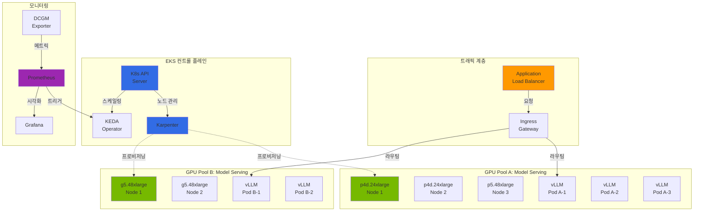
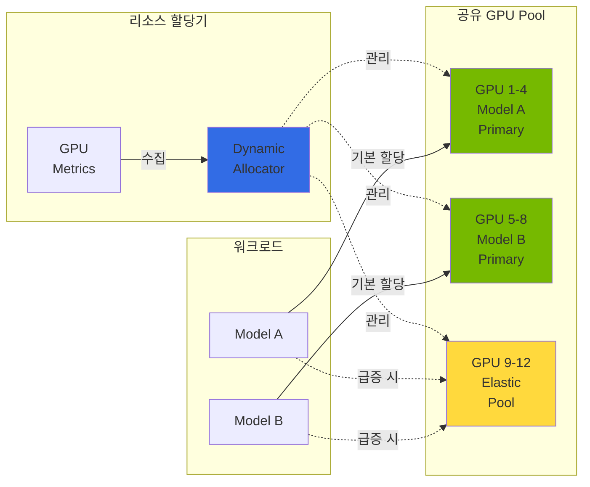
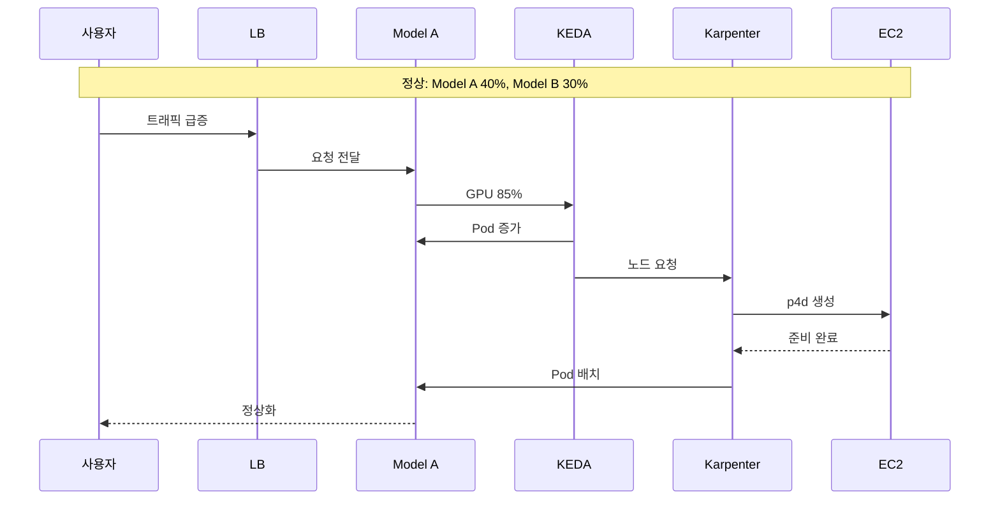
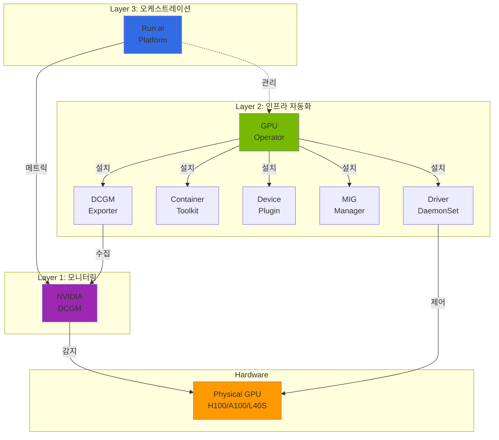
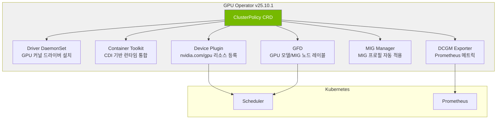
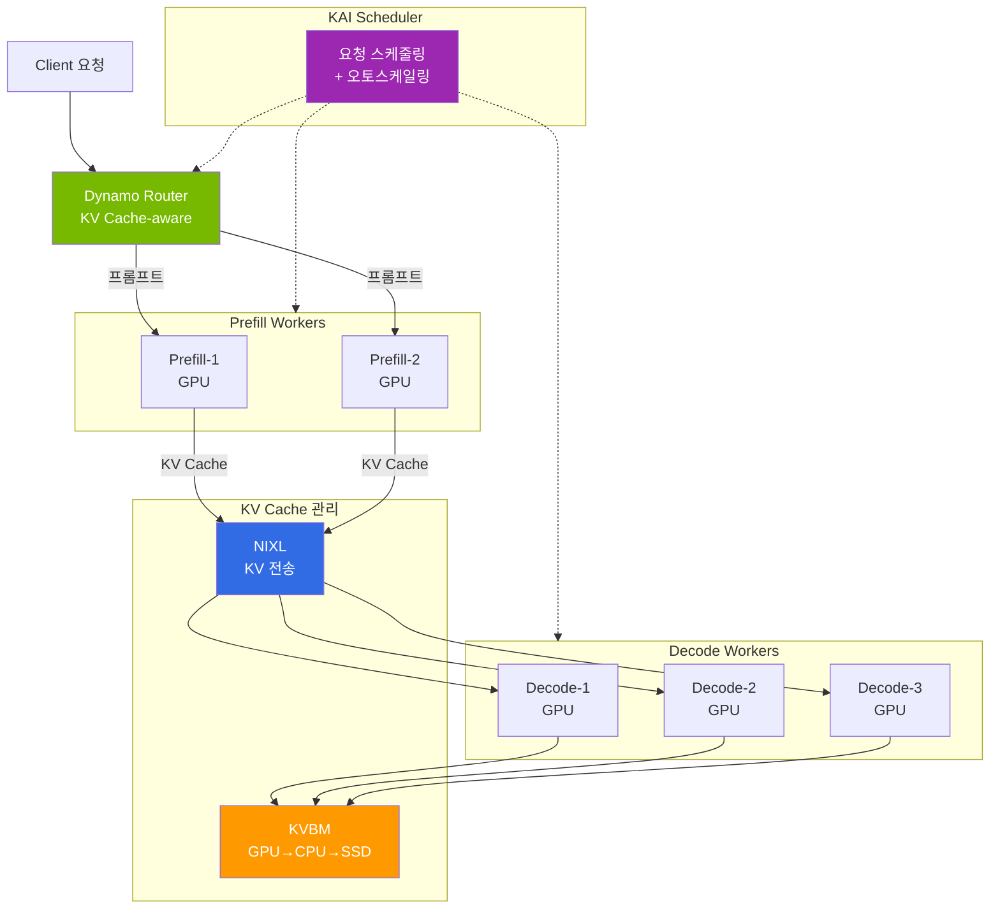
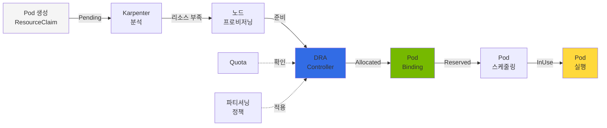
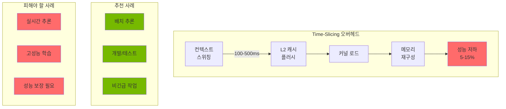

import Tabs from '@theme/Tabs';
import TabItem from '@theme/TabItem';
import { SpecificationTable, ComparisonTable } from '@site/src/components/tables';
import { DraLimitationsTable, ScalingDecisionTable } from '@site/src/components/GpuResourceTables';

# GPU 클러스터 동적 리소스 관리

> 📅 **작성일**: 2025-02-09 | **수정일**: 2026-02-14 | ⏱️ **읽는 시간**: 약 9분


## 개요

대규모 GenAI 서비스 환경에서는 복수의 GPU 클러스터를 효율적으로 관리하고, 트래픽 변화에 따라 동적으로 리소스를 재할당하는 것이 핵심입니다. 이 문서에서는 Amazon EKS 환경에서 Karpenter를 활용한 GPU 노드 자동 스케일링과 DCGM(Data Center GPU Manager) 기반 메트릭 수집, 그리고 KEDA를 통한 워크로드 자동 스케일링 전략을 다룹니다.

### 주요 목표

- **리소스 효율성**: GPU 리소스의 유휴 시간 최소화
- **비용 최적화**: Spot 인스턴스 활용 및 Consolidation을 통한 비용 절감
- **자동화된 스케일링**: 트래픽 패턴에 따른 자동 리소스 조정
- **서비스 안정성**: SLA 준수를 위한 적절한 리소스 확보

---

## Kubernetes 1.33/1.34 GPU 관리 개선사항

Kubernetes 1.33과 1.34 버전에서는 GPU 워크로드 관리를 위한 여러 중요한 기능이 추가되었습니다.

<Tabs>
  <TabItem value="k8s133" label="Kubernetes 1.33+" default>

| 기능 | 설명 | GPU 워크로드 영향 |
|------|------|------------------|
| **Stable Sidecar Containers** | Init 컨테이너가 Pod 전체 라이프사이클 동안 실행 가능 | GPU 메트릭 수집, 로깅 사이드카 안정화 |
| **Topology-Aware Routing** | 노드 토폴로지 기반 트래픽 라우팅 | GPU 노드 간 최적 경로 선택, 지연 시간 감소 |
| **In-Place Resource Resizing** | Pod 재시작 없이 리소스 조정 | GPU 메모리 동적 조정 (제한적) |
| **DRA v1beta1 안정화** | Dynamic Resource Allocation API 안정화 | 프로덕션 GPU 파티셔닝 지원 |

  </TabItem>
  <TabItem value="k8s134" label="Kubernetes 1.34+">

| 기능 | 설명 | GPU 워크로드 영향 |
|------|------|------------------|
| **Projected Service Account Tokens** | 향상된 서비스 계정 토큰 관리 | GPU Pod의 보안 강화 |
| **DRA Prioritized Alternatives** | 리소스 할당 우선순위 대안 | GPU 리소스 경합 시 지능적 스케줄링 |
| **Improved Resource Quota** | 리소스 쿼터 세분화 | GPU 테넌트별 정밀한 할당 제어 |

  </TabItem>
</Tabs>

:::info kubectl 버전 요구사항
Kubernetes 1.33+ 클러스터를 관리하려면 kubectl 1.33 이상이 필요합니다. 새로운 API 기능을 활용하려면 최신 kubectl 버전을 사용하세요.

```bash
# kubectl 버전 확인
kubectl version --client

# kubectl 1.33+ 설치 (Linux)
curl -LO "https://dl.k8s.io/release/v1.33.0/bin/linux/amd64/kubectl"
sudo install -o root -g root -m 0755 kubectl /usr/local/bin/kubectl
```
:::

### Sidecar Containers를 활용한 GPU 모니터링

Kubernetes 1.33+의 안정화된 Sidecar Containers를 사용하여 GPU 메트릭을 Pod 단위로 수집할 수 있습니다.

:::warning Sidecar vs DaemonSet: 어떤 방식을 선택할까?

**NVIDIA 공식 권장은 DaemonSet 방식**입니다 (본 문서 [DCGM Exporter 설정](#dcgm-exporter-설정) 섹션 참조). Sidecar 방식은 아래와 같은 특수한 경우에만 고려하세요.

<Tabs>
  <TabItem value="daemonset" label="DaemonSet (권장)" default>

| 항목 | 내용 |
|------|------|
| **리소스 효율** | 노드당 1개 인스턴스 — 오버헤드 최소 |
| **관리** | 중앙 집중식, GPU Operator가 자동 관리 |
| **메트릭 범위** | 노드의 모든 GPU 메트릭 수집 |
| **보안** | DaemonSet에만 `SYS_ADMIN` 부여 |
| **적합 환경** | 프로덕션 환경 (대부분의 경우) |

  </TabItem>
  <TabItem value="sidecar" label="Sidecar (특수 용도)">

| 항목 | 내용 |
|------|------|
| **리소스 효율** | Pod당 1개 인스턴스 — 오버헤드 높음 |
| **관리** | Pod 스펙에 포함, 개별 관리 |
| **메트릭 범위** | 해당 Pod의 GPU 메트릭만 수집 |
| **보안** | 모든 GPU Pod에 `SYS_ADMIN` 필요 |
| **적합 환경** | 멀티 테넌트 격리, Pod별 과금 추적 |

  </TabItem>
</Tabs>

**Sidecar가 유효한 시나리오:**
- **멀티 테넌트 과금**: 테넌트별 GPU 사용량을 Pod 단위로 정밀 추적해야 할 때
- **DaemonSet 설치 불가**: EKS Auto Mode 등 노드 접근이 제한된 환경
- **Pod 격리**: 특정 Pod의 GPU 메트릭만 독립적으로 모니터링해야 할 때

대부분의 프로덕션 환경에서는 **DaemonSet 방식**으로 충분합니다.
:::

```yaml
apiVersion: v1
kind: Pod
metadata:
  name: vllm-with-monitoring
  namespace: ai-inference
spec:
  initContainers:
    # Sidecar로 실행되는 DCGM Exporter (특수 용도)
    - name: dcgm-sidecar
      image: nvcr.io/nvidia/k8s/dcgm-exporter:4.4.2-4.7.0-ubuntu22.04
      restartPolicy: Always  # K8s 1.33+ Sidecar 기능
      ports:
        - name: metrics
          containerPort: 9400
      securityContext:
        capabilities:
          add: ["SYS_ADMIN"]
      resources:
        requests:
          cpu: "100m"
          memory: "128Mi"
        limits:
          cpu: "200m"
          memory: "256Mi"
  containers:
    - name: vllm
      image: vllm/vllm-openai:latest
      resources:
        requests:
          nvidia.com/gpu: 2
        limits:
          nvidia.com/gpu: 2
```

### Topology-Aware Routing 활용

GPU 노드 간 최적 경로를 선택하여 지연 시간을 최소화합니다.

```yaml
apiVersion: v1
kind: Service
metadata:
  name: vllm-inference
  namespace: ai-inference
  annotations:
    # K8s 1.33+ Topology-Aware Routing
    service.kubernetes.io/topology-mode: "Auto"
spec:
  selector:
    app: vllm
  ports:
    - port: 8000
      targetPort: 8000
  # 토폴로지 인식 라우팅 활성화
  trafficDistribution: PreferClose
```

---

## 멀티 GPU 클러스터 아키텍처

### 전체 아키텍처 다이어그램



### 리소스 공유 아키텍처

복수 모델 간 GPU 리소스를 효율적으로 공유하기 위한 아키텍처입니다.



:::info 리소스 공유 원칙

- **Primary Pool**: 각 모델에 할당된 기본 GPU 리소스
- **Elastic Pool**: 트래픽 급증 시 동적으로 할당되는 공유 리소스
- **Priority-based Allocation**: 우선순위 기반 리소스 할당으로 중요 워크로드 보호

:::

---

## 동적 리소스 할당 전략

### 트래픽 급증 시나리오

실제 운영 환경에서 발생할 수 있는 트래픽 급증 시나리오와 대응 전략입니다.



### 모델 간 리소스 재할당 절차

Model A에 트래픽이 급증할 때 Model B의 유휴 리소스를 Model A에 할당하는 구체적인 절차입니다.

#### 단계 1: 메트릭 수집 및 분석

```yaml
# DCGM Exporter가 수집하는 주요 메트릭
# - DCGM_FI_DEV_GPU_UTIL: GPU 사용률
# - DCGM_FI_DEV_MEM_COPY_UTIL: 메모리 복사 사용률
# - DCGM_FI_DEV_FB_USED: 프레임버퍼 사용량
```

#### 단계 2: 스케일링 결정

<ScalingDecisionTable />

#### 단계 3: 리소스 재할당 실행

```bash
# Model B의 replica 수 감소 (유휴 리소스 확보)
kubectl scale deployment model-b-serving --replicas=1 -n inference

# Model A의 replica 수 증가
kubectl scale deployment model-a-serving --replicas=5 -n inference

# 또는 KEDA가 자동으로 처리
```

#### 단계 4: 노드 레벨 스케일링

Karpenter가 자동으로 추가 노드를 프로비저닝하거나 유휴 노드를 정리합니다.

:::warning 주의사항

리소스 재할당 시 Model B의 최소 SLA를 보장하기 위해 `minReplicas`를 설정해야 합니다. 완전한 리소스 회수는 서비스 중단을 야기할 수 있습니다.

:::

---

## Karpenter 기반 노드 스케일링

:::info Karpenter v1.0+ GA 상태
Karpenter는 v1.0부터 GA(Generally Available) 상태로, 프로덕션 환경에서 안정적으로 사용할 수 있습니다. 본 문서의 모든 예제는 Karpenter v1 API (`karpenter.sh/v1`)를 사용합니다.
:::

### NodePool 설정

GPU 워크로드를 위한 Karpenter NodePool 설정 예제입니다.

```yaml
apiVersion: karpenter.sh/v1
kind: NodePool
metadata:
  name: gpu-inference-pool
spec:
  template:
    metadata:
      labels:
        node-type: gpu-inference
        workload: genai
    spec:
      requirements:
        - key: kubernetes.io/arch
          operator: In
          values: ["amd64"]
        - key: karpenter.sh/capacity-type
          operator: In
          values: ["on-demand", "spot"]
        - key: node.kubernetes.io/instance-type
          operator: In
          values:
            - p4d.24xlarge    # 8x A100 40GB
            - p5.48xlarge     # 8x H100 80GB
            - g5.48xlarge     # 8x A10G 24GB
        - key: karpenter.k8s.aws/instance-gpu-count
          operator: Gt
          values: ["0"]
      nodeClassRef:
        group: karpenter.k8s.aws
        kind: EC2NodeClass
        name: gpu-nodeclass
      taints:
        - key: nvidia.com/gpu
          value: "true"
          effect: NoSchedule
  limits:
    cpu: 1000
    memory: 4000Gi
    nvidia.com/gpu: 64
  disruption:
    consolidationPolicy: WhenEmptyOrUnderutilized
    consolidateAfter: 30s
  weight: 100
```

### EC2NodeClass 설정

GPU 인스턴스를 위한 EC2NodeClass 설정입니다.

```yaml
apiVersion: karpenter.k8s.aws/v1
kind: EC2NodeClass
metadata:
  name: gpu-nodeclass
spec:
  role: KarpenterNodeRole-${CLUSTER_NAME}
  amiSelectorTerms:
    - alias: al2023@latest
  subnetSelectorTerms:
    - tags:
        karpenter.sh/discovery: ${CLUSTER_NAME}
  securityGroupSelectorTerms:
    - tags:
        karpenter.sh/discovery: ${CLUSTER_NAME}
  blockDeviceMappings:
    - deviceName: /dev/xvda
      ebs:
        volumeSize: 500Gi
        volumeType: gp3
        iops: 10000
        throughput: 500
        encrypted: true
        deleteOnTermination: true
  instanceStorePolicy: RAID0
  userData: |
    #!/bin/bash
    # NVIDIA 드라이버 및 Container Toolkit 설정
    nvidia-smi

    # GPU 메모리 모드 설정 (Persistence Mode)
    nvidia-smi -pm 1

    # EFA 드라이버 로드 (p4d, p5 인스턴스용)
    modprobe efa
  tags:
    Environment: production
    Workload: genai-inference
```

### GPU 인스턴스 타입 비교

<ComparisonTable
  headers={['인스턴스 타입', 'GPU', 'GPU 메모리', 'vCPU', '메모리', '네트워크', '용도']}
  rows={[
    { id: '1', cells: ['p4d.24xlarge', '8x A100', '40GB x 8', '96', '1152 GiB', '400 Gbps EFA', '대규모 LLM 추론'], recommended: true },
    { id: '2', cells: ['p5.48xlarge', '8x H100', '80GB x 8', '192', '2048 GiB', '3200 Gbps EFA', '초대규모 모델, 학습'] },
    { id: '3', cells: ['p5e.48xlarge', '8x H200', '141GB x 8', '192', '2048 GiB', '3200 Gbps EFA', '대규모 모델 학습/추론'] },
    { id: '4', cells: ['g5.48xlarge', '8x A10G', '24GB x 8', '192', '768 GiB', '100 Gbps', '중소규모 모델 추론'] },
    { id: '5', cells: ['g6e.xlarge ~ g6e.48xlarge', 'NVIDIA L40S', '최대 8×48GB', '최대 192', '최대 768 GiB', '최대 100 Gbps', '비용 효율적 추론'] },
    { id: '6', cells: ['trn2.48xlarge', '16x Trainium2', '-', '192', '2048 GiB', '1600 Gbps', 'AWS 네이티브 학습'] }
  ]}
/>

:::tip 인스턴스 선택 가이드

- **p5e.48xlarge**: 100B+ 파라미터 모델, H200의 최대 메모리 활용
- **p5.48xlarge**: 70B+ 파라미터 모델, 최고 성능 요구 시
- **p4d.24xlarge**: 13B-70B 파라미터 모델, 비용 대비 성능 균형
- **g6e.xlarge~48xlarge**: 13B-70B 모델, L40S의 비용 효율적 추론
- **g5.48xlarge**: 7B 이하 모델, 비용 효율적인 추론
- **trn2.48xlarge**: AWS 네이티브 학습 워크로드, Trainium2 최적화

:::

:::tip EKS Auto Mode GPU 스케줄링
EKS Auto Mode는 GPU 워크로드를 자동으로 감지하고 적절한 GPU 인스턴스를 프로비저닝합니다. NodePool 설정 없이도 GPU Pod의 리소스 요청에 따라 최적의 인스턴스를 선택합니다.
:::

---

## GPU 메트릭 기반 자동 스케일링

### DCGM Exporter 설정

NVIDIA DCGM Exporter를 통해 GPU 메트릭을 Prometheus로 수집합니다.

```yaml
apiVersion: apps/v1
kind: DaemonSet
metadata:
  name: dcgm-exporter
  namespace: gpu-monitoring
  labels:
    app: dcgm-exporter
spec:
  selector:
    matchLabels:
      app: dcgm-exporter
  template:
    metadata:
      labels:
        app: dcgm-exporter
    spec:
      nodeSelector:
        nvidia.com/gpu.present: "true"
      tolerations:
        - key: nvidia.com/gpu
          operator: Exists
          effect: NoSchedule
      containers:
        - name: dcgm-exporter
          image: nvcr.io/nvidia/k8s/dcgm-exporter:4.4.2-4.7.0-ubuntu22.04
          ports:
            - name: metrics
              containerPort: 9400
          env:
            - name: DCGM_EXPORTER_LISTEN
              value: ":9400"
            - name: DCGM_EXPORTER_KUBERNETES
              value: "true"
            - name: DCGM_EXPORTER_COLLECTORS
              value: "/etc/dcgm-exporter/dcp-metrics-included.csv"
          volumeMounts:
            - name: pod-resources
              mountPath: /var/lib/kubelet/pod-resources
              readOnly: true
          securityContext:
            runAsNonRoot: false
            runAsUser: 0
            capabilities:
              add: ["SYS_ADMIN"]
      volumes:
        - name: pod-resources
          hostPath:
            path: /var/lib/kubelet/pod-resources
```

:::info DCGM Exporter 3.3+ 기능
DCGM Exporter 3.3+는 다음과 같은 향상된 기능을 제공합니다:
- **H100/H200 지원**: 최신 GPU 메트릭 수집
- **향상된 메트릭**: 더 세밀한 GPU 상태 모니터링
- **성능 개선**: 낮은 오버헤드로 메트릭 수집
:::

### 주요 GPU 메트릭

DCGM Exporter가 수집하는 핵심 메트릭입니다.

<SpecificationTable
  headers={['메트릭 이름', '설명', '스케일링 활용']}
  rows={[
    { id: '1', cells: ['DCGM_FI_DEV_GPU_UTIL', 'GPU 코어 사용률 (%)', 'HPA 트리거 기준'] },
    { id: '2', cells: ['DCGM_FI_DEV_MEM_COPY_UTIL', '메모리 대역폭 사용률 (%)', '메모리 병목 감지'] },
    { id: '3', cells: ['DCGM_FI_DEV_FB_USED', '프레임버퍼 사용량 (MB)', 'OOM 방지'] },
    { id: '4', cells: ['DCGM_FI_DEV_FB_FREE', '프레임버퍼 여유량 (MB)', '용량 계획'] },
    { id: '5', cells: ['DCGM_FI_DEV_POWER_USAGE', '전력 사용량 (W)', '비용 모니터링'] },
    { id: '6', cells: ['DCGM_FI_DEV_SM_CLOCK', 'SM 클럭 속도 (MHz)', '성능 모니터링'] },
    { id: '7', cells: ['DCGM_FI_DEV_GPU_TEMP', 'GPU 온도 (°C)', '열 관리'] }
  ]}
/>

### Prometheus ServiceMonitor 설정

```yaml
apiVersion: monitoring.coreos.com/v1
kind: ServiceMonitor
metadata:
  name: dcgm-exporter
  namespace: gpu-monitoring
spec:
  selector:
    matchLabels:
      app: dcgm-exporter
  endpoints:
    - port: metrics
      interval: 15s
      path: /metrics
  namespaceSelector:
    matchNames:
      - gpu-monitoring
```

### KEDA ScaledObject 설정

KEDA를 사용하여 GPU 메트릭 기반 자동 스케일링을 구성합니다.

```yaml
apiVersion: keda.sh/v1alpha1
kind: ScaledObject
metadata:
  name: model-a-gpu-scaler
  namespace: inference
spec:
  scaleTargetRef:
    apiVersion: apps/v1
    kind: Deployment
    name: model-a-serving
  pollingInterval: 15
  cooldownPeriod: 60
  minReplicaCount: 2
  maxReplicaCount: 10
  fallback:
    failureThreshold: 3
    replicas: 3
  advanced:
    horizontalPodAutoscalerConfig:
      behavior:
        scaleDown:
          stabilizationWindowSeconds: 300
          policies:
            - type: Percent
              value: 25
              periodSeconds: 60
        scaleUp:
          stabilizationWindowSeconds: 0
          policies:
            - type: Percent
              value: 100
              periodSeconds: 15
            - type: Pods
              value: 4
              periodSeconds: 15
          selectPolicy: Max
  triggers:
    - type: prometheus
      metadata:
        serverAddress: http://prometheus-server.monitoring:9090
        metricName: gpu_utilization
        query: |
          avg(DCGM_FI_DEV_GPU_UTIL{pod=~"model-a-.*"})
        threshold: "70"
        activationThreshold: "50"
```

### 자동 스케일링 임계값 설정

워크로드 특성에 따른 권장 임계값입니다.

<SpecificationTable
  headers={['워크로드 유형', 'Scale Up 임계값', 'Scale Down 임계값', 'Cooldown']}
  rows={[
    { id: '1', cells: ['실시간 추론', 'GPU 70%', 'GPU 30%', '60초'] },
    { id: '2', cells: ['배치 처리', 'GPU 85%', 'GPU 40%', '300초'] },
    { id: '3', cells: ['대화형 서비스', 'GPU 60%', 'GPU 25%', '30초'] }
  ]}
/>

:::tip 임계값 튜닝 가이드

1. **초기 설정**: 보수적인 값(Scale Up 80%, Scale Down 20%)으로 시작
2. **모니터링**: 2-3일간 실제 트래픽 패턴 관찰
3. **조정**: 응답 시간 SLA와 비용을 고려하여 점진적 조정
4. **검증**: 부하 테스트를 통한 설정 검증

:::

### HPA와 KEDA 연동

기본 HPA와 KEDA를 함께 사용하는 경우의 설정입니다.

```yaml
apiVersion: autoscaling/v2
kind: HorizontalPodAutoscaler
metadata:
  name: model-a-hpa
  namespace: inference
spec:
  scaleTargetRef:
    apiVersion: apps/v1
    kind: Deployment
    name: model-a-serving
  minReplicas: 2
  maxReplicas: 10
  metrics:
    - type: External
      external:
        metric:
          name: gpu_utilization
          selector:
            matchLabels:
              scaledobject.keda.sh/name: model-a-gpu-scaler
        target:
          type: AverageValue
          averageValue: "70"
```

---

## 비용 최적화 전략

### Spot 인스턴스 활용

GPU Spot 인스턴스를 활용하여 비용을 최대 90%까지 절감할 수 있습니다.

```yaml
apiVersion: karpenter.sh/v1
kind: NodePool
metadata:
  name: gpu-spot-pool
spec:
  template:
    spec:
      requirements:
        - key: karpenter.sh/capacity-type
          operator: In
          values: ["spot"]
        - key: node.kubernetes.io/instance-type
          operator: In
          values:
            - g5.12xlarge
            - g5.24xlarge
            - g5.48xlarge
      nodeClassRef:
        group: karpenter.k8s.aws
        kind: EC2NodeClass
        name: gpu-spot-nodeclass
      taints:
        - key: nvidia.com/gpu
          value: "true"
          effect: NoSchedule
        - key: karpenter.sh/capacity-type
          value: "spot"
          effect: NoSchedule
  limits:
    nvidia.com/gpu: 32
  disruption:
    consolidationPolicy: WhenEmpty
    consolidateAfter: 30s
  weight: 50
```

:::warning Spot 인스턴스 주의사항

- **중단 처리**: Spot 인스턴스는 2분 전 중단 알림을 받습니다. 적절한 graceful shutdown 구현 필요
- **워크로드 적합성**: 상태 비저장(stateless) 추론 워크로드에 적합
- **가용성**: 특정 인스턴스 타입의 Spot 가용성이 낮을 수 있으므로 다양한 타입 지정 권장

:::

### Spot 중단 처리

```yaml
apiVersion: apps/v1
kind: Deployment
metadata:
  name: model-serving-spot
  namespace: inference
spec:
  template:
    spec:
      terminationGracePeriodSeconds: 120
      containers:
        - name: vllm
          lifecycle:
            preStop:
              exec:
                command:
                  - /bin/sh
                  - -c
                  - |
                    # 새 요청 수신 중단
                    curl -X POST localhost:8000/drain
                    # 진행 중인 요청 완료 대기
                    sleep 90
      tolerations:
        - key: karpenter.sh/capacity-type
          operator: Equal
          value: "spot"
          effect: NoSchedule
```

### Consolidation 정책

유휴 노드를 자동으로 정리하여 비용을 최적화합니다.

```yaml
apiVersion: karpenter.sh/v1
kind: NodePool
metadata:
  name: gpu-inference-pool
spec:
  disruption:
    # 노드가 비어있거나 활용도가 낮을 때 통합
    consolidationPolicy: WhenEmptyOrUnderutilized
    # 통합 대기 시간
    consolidateAfter: 30s
    # 예산 설정 - 동시에 중단 가능한 노드 수 제한
    budgets:
      - nodes: "20%"
      - nodes: "0"
        schedule: "0 9 * * 1-5"  # 평일 업무 시간에는 중단 방지
        duration: 8h
```

### 비용 최적화 체크리스트

<SpecificationTable
  headers={['항목', '설명', '예상 절감']}
  rows={[
    { id: '1', cells: ['Spot 인스턴스 활용', '비프로덕션 및 내결함성 워크로드', '60-90%'] },
    { id: '2', cells: ['Consolidation 활성화', '유휴 노드 자동 정리', '20-30%'] },
    { id: '3', cells: ['Right-sizing', '워크로드에 맞는 인스턴스 선택', '15-25%'] },
    { id: '4', cells: ['스케줄 기반 스케일링', '비업무 시간 리소스 축소', '30-40%'] }
  ]}
/>

:::tip 비용 모니터링

Kubecost 또는 AWS Cost Explorer를 활용하여 GPU 워크로드별 비용을 추적하고, 정기적으로 최적화 기회를 검토하세요.

:::

---

## 운영 모범 사례

### GPU 리소스 요청 설정

```yaml
apiVersion: apps/v1
kind: Deployment
metadata:
  name: model-a-serving
  namespace: inference
spec:
  template:
    spec:
      containers:
        - name: vllm
          resources:
            requests:
              nvidia.com/gpu: 1
              memory: "32Gi"
              cpu: "8"
            limits:
              nvidia.com/gpu: 1
              memory: "64Gi"
              cpu: "16"
```

### 모니터링 대시보드 구성

Grafana 대시보드에서 모니터링해야 할 핵심 패널:

1. **GPU 사용률 트렌드**: 시간별 GPU 사용률 변화
2. **메모리 사용량**: GPU 메모리 사용량 및 여유 공간
3. **Pod 스케일링 이벤트**: HPA/KEDA 스케일링 이력
4. **노드 프로비저닝**: Karpenter 노드 생성/삭제 이벤트
5. **비용 추적**: 시간당/일별 GPU 비용

### 알림 설정

```yaml
apiVersion: monitoring.coreos.com/v1
kind: PrometheusRule
metadata:
  name: gpu-alerts
  namespace: monitoring
spec:
  groups:
    - name: gpu-alerts
      rules:
        - alert: HighGPUUtilization
          expr: avg(DCGM_FI_DEV_GPU_UTIL) > 90
          for: 5m
          labels:
            severity: warning
          annotations:
            summary: "GPU 사용률이 90%를 초과했습니다"

        - alert: GPUMemoryPressure
          expr: (DCGM_FI_DEV_FB_USED / (DCGM_FI_DEV_FB_USED + DCGM_FI_DEV_FB_FREE)) > 0.9
          for: 2m
          labels:
            severity: critical
          annotations:
            summary: "GPU 메모리 부족 위험"
```

---

## GPU Operator / DCGM / Run:ai 아키텍처

GPU 워크로드의 고급 기능(MIG 파티셔닝, Fractional GPU, 멀티 테넌트 스케줄링)을 활용하려면 GPU Operator 스택의 계층 구조를 이해해야 합니다.

:::info GPU Operator 최신 버전 (v25.10.1, 2026.03 기준)

| 컴포넌트 | 버전 | 역할 |
|----------|------|------|
| GPU Operator | **v25.10.1** | 전체 GPU 스택 라이프사이클 관리 |
| NVIDIA Driver | **580.105.08** | GPU 커널 드라이버 |
| DCGM | **v4.4.2-1** | GPU 모니터링 엔진 |
| DCGM Exporter | **v4.4.2-4.7.0** | Prometheus 메트릭 노출 |
| Device Plugin | **v0.18.1** | K8s GPU 리소스 등록 |
| GFD (GPU Feature Discovery) | **v0.18.1** | GPU 노드 레이블링 |
| MIG Manager | **v0.13.1** | MIG 파티션 자동 관리 |
| Container Toolkit (CDI) | **v1.17.5** | 컨테이너 GPU 런타임 |

**v25.10.1 주요 신기능:**
- **Blackwell 아키텍처 지원**: B200/GB200 GPU 완전 지원
- **HPC Job Mapping**: GPU Job 단위 메트릭 수집 및 어카운팅
- **CDMM (Confidential Data & Model Management)**: Confidential Computing 환경 GPU 지원
- **CDI (Container Device Interface)**: 컨테이너 런타임 독립적 디바이스 관리
:::

### 3계층 아키텍처



각 계층의 역할:

- **GPU Operator** (드라이버): GPU를 Kubernetes에 연결하는 기반 레이어. 드라이버 설치, 컨테이너 툴킷, 디바이스 플러그인, MIG 매니저를 DaemonSet으로 관리
- **DCGM** (센서): GPU 상태를 읽는 모니터링 엔진. SM Utilization, Tensor Core Activity, Memory, Power, Temperature, ECC Errors 등 수집
- **Run:ai** (관제탑): GPU Operator와 DCGM 위에서 동작하는 스케줄링/관리 레이어. Fractional GPU, Dynamic MIG, Gang Scheduling, Quota 관리 제공

### 의존 관계

| 조합 | 가능 여부 | 사용 사례 |
|---|---|---|
| GPU Operator만 | 가능 | 기본 GPU 추론, MIG 수동 설정, DCGM 메트릭 |
| GPU Operator + Run:ai | 가능 | 엔터프라이즈 GPU 클러스터 관리 (권장) |
| DCGM만 (드라이버 수동설치) | 가능 | 베어메탈, 단일 서버 모니터링 |
| Run:ai만 (GPU Operator 없이) | **불가** | GPU Operator 필수 의존성 |
| EKS Auto Mode + Run:ai | **불가** | GPU Operator 설치 불가 |

### EKS 환경별 GPU 관리 방식

| 노드 타입 | GPU 드라이버 | GPU Operator | MIG 지원 | Run:ai 지원 |
|---|---|---|---|---|
| Auto Mode | AWS 자동 설치 | 설치 불가 | 불가 | 불가 |
| Karpenter (Self-Managed) | GPU Operator 설치 | 완전 지원 | 완전 지원 | 완전 지원 |
| Managed Node Group | GPU Operator 설치 | 완전 지원 | 완전 지원 | 완전 지원 |
| Hybrid Node (온프레미스) | GPU Operator 필수 | 필수 구성 | 완전 지원 | 완전 지원 |

:::tip 노드 전략 상세 가이드
EKS Auto Mode와 Karpenter의 하이브리드 구성, GPU Operator 설치 방법, Hybrid Node GPU 팜 구성에 대한 상세 내용은 [EKS GPU 노드 전략](./eks-gpu-node-strategy.md)을 참조하세요.
:::

### GPU Operator 컴포넌트 상세

GPU Operator는 ClusterPolicy CRD를 통해 GPU 스택 전체를 선언적으로 관리합니다.



**Helm 설치 예시:**

```bash
# NVIDIA Helm 리포지토리 추가
helm repo add nvidia https://helm.ngc.nvidia.com/nvidia
helm repo update

# GPU Operator 설치
helm install gpu-operator nvidia/gpu-operator \
  --namespace gpu-operator --create-namespace \
  --set driver.version=580.105.08 \
  --set dcgmExporter.serviceMonitor.enabled=true \
  --set migManager.enabled=true \
  --set gfd.enabled=true
```

**ClusterPolicy CRD 예시:**

```yaml
apiVersion: nvidia.com/v1
kind: ClusterPolicy
metadata:
  name: cluster-policy
spec:
  operator:
    defaultRuntime: containerd
  driver:
    enabled: true
    version: "580.105.08"
  toolkit:
    enabled: true
  devicePlugin:
    enabled: true
  dcgmExporter:
    enabled: true
    version: "4.4.2-4.7.0"
    serviceMonitor:
      enabled: true
  migManager:
    enabled: true
    config:
      name: default-mig-parted-config
  gfd:
    enabled: true
  nodeStatusExporter:
    enabled: true
```

### EKS 환경별 GPU Operator 구성

| 환경 | GPU Operator | 드라이버 관리 | MIG | 제약사항 |
|------|-------------|-------------|-----|---------|
| EKS Auto Mode | 설치 불가 | AWS 자동 | 불가 | AWS 관리형, 커스터마이징 제한 |
| EKS + Karpenter | Helm 설치 | Operator 관리 | 완전 지원 | NodePool에 GPU AMI 지정 필요 |
| EKS Managed Node Group | Helm 설치 | Operator 관리 | 완전 지원 | 노드 그룹 단위 관리 |
| EKS Hybrid Nodes | Helm 설치 (필수) | Operator 필수 | 완전 지원 | 온프레미스 GPU 팜, 네트워크 설정 필요 |

---

## NVIDIA Dynamo: 데이터센터 규모 추론 최적화

### 개요

**NVIDIA Dynamo**는 데이터센터 규모의 LLM 추론을 최적화하는 오픈소스 프레임워크이다. vLLM, SGLang, TensorRT-LLM을 백엔드로 지원하며, SemiAnalysis InferenceX 벤치마크에서 기존 대비 **최대 7x 성능 향상**을 달성했다.

:::info Dynamo v1.0 (2026.03 GA)
- **지원 백엔드**: vLLM, SGLang, TensorRT-LLM
- **핵심 기술**: Disaggregated Serving, KV Cache Routing, NIXL, KAI Scheduler
- **배포 방식**: Kubernetes Operator + CRD 기반
- **라이선스**: Apache 2.0
:::

### 핵심 아키텍처

Dynamo는 Prefill(프롬프트 처리)과 Decode(토큰 생성)를 분리하는 **Disaggregated Serving** 아키텍처를 채택한다.



**핵심 컴포넌트:**

| 컴포넌트 | 역할 | 이점 |
|----------|------|------|
| **Disaggregated Serving** | Prefill/Decode 워커 분리 | 각 단계별 독립 스케일링, GPU 활용 극대화 |
| **KV Cache Routing** | Prefix-aware 요청 라우팅 | KV Cache 히트율 향상, TTFT 단축 |
| **KVBM (KV Block Manager)** | GPU → CPU → SSD 3-tier 캐시 | 메모리 효율 극대화, 대규모 컨텍스트 지원 |
| **NIXL** | NVIDIA Inference Transfer Library | GPU 간 KV Cache 초고속 전송 (NVLink/RDMA) |
| **KAI Scheduler** | 요청 스케줄링 + 오토스케일링 | SLA 기반 스케줄링, 리소스 최적 배치 |

### EKS 배포

Dynamo는 Kubernetes Operator 패턴으로 EKS에 배포된다.

**설치 순서:**

```bash
# 1. 모니터링 스택 (Prometheus + Grafana)
helm install kube-prometheus-stack prometheus-community/kube-prometheus-stack \
  --namespace monitoring --create-namespace

# 2. GPU Operator (이미 설치되어 있으면 스킵)
helm install gpu-operator nvidia/gpu-operator \
  --namespace gpu-operator --create-namespace

# 3. Dynamo Platform (Operator + etcd + NATS)
helm install dynamo-platform nvidia/dynamo-platform \
  --namespace dynamo-system --create-namespace

# 4. Dynamo vLLM 워크로드 배포
kubectl apply -f dynamo-vllm-deployment.yaml
```

**DynamoGraphDeploymentRequest (DGDR) CRD 기반 배포:**

```yaml
apiVersion: dynamo.nvidia.com/v1alpha1
kind: DynamoGraphDeploymentRequest
metadata:
  name: llama-70b-disagg
  namespace: ai-inference
spec:
  graph:
    name: disaggregated-llm
    engine: vllm
    model: meta-llama/Llama-3.1-70B-Instruct
  serving:
    mode: disaggregated  # aggregated | disaggregated
    prefill:
      replicas: 2
      resources:
        nvidia.com/gpu: 4
    decode:
      replicas: 4
      resources:
        nvidia.com/gpu: 2
  routing:
    strategy: prefix-aware
    kvCacheRouting: true
  sla:
    maxTTFT: 500ms
    maxITL: 50ms
  autoscaling:
    enabled: true
    minReplicas: 2
    maxReplicas: 16
    targetUtilization: 70
```

### AIConfigurator

Dynamo의 **AIConfigurator**는 모델과 하드웨어 구성에 따라 최적의 Tensor Parallelism(TP), Pipeline Parallelism(PP) 설정을 자동으로 추천한다.

| 기능 | 설명 |
|------|------|
| 자동 TP/PP 추천 | 모델 크기, GPU 메모리, 네트워크 토폴로지 기반 최적 병렬화 |
| Pareto Frontier | 처리량-지연 시간 트레이드오프 최적점 탐색 |
| 하드웨어 프로파일링 | GPU 간 대역폭, NVLink 토폴로지 자동 감지 |
| SLA 기반 최적화 | 목표 TTFT/ITL 기반 구성 추천 |

### 참고 자료

- [NVIDIA Dynamo GitHub](https://github.com/ai-dynamo/dynamo)
- [Dynamo Architecture Overview](https://github.com/ai-dynamo/dynamo/blob/main/docs/architecture.md)
- [NIXL - NVIDIA Inference Transfer Library](https://github.com/ai-dynamo/nixl)
- [KAI Scheduler](https://github.com/NVIDIA/KAI-Scheduler)

---

## 요약

GPU 클러스터의 동적 리소스 관리는 GenAI 서비스의 성능과 비용 효율성을 결정하는 핵심 요소입니다.

### 핵심 포인트

1. **Karpenter 활용**: GPU 노드의 자동 프로비저닝 및 정리로 리소스 효율성 극대화
2. **DCGM 메트릭**: 정확한 GPU 사용률 모니터링으로 데이터 기반 스케일링 결정
3. **KEDA 연동**: GPU 메트릭 기반 워크로드 자동 스케일링
4. **Spot 인스턴스**: 적절한 워크로드에 Spot 활용으로 비용 절감
5. **Consolidation**: 유휴 리소스 자동 정리로 비용 최적화
6. **GPU Operator 스택**: GPU Operator v25.10.1(드라이버), DCGM v4.4.2(센서), Run:ai(관제탑)의 3계층 구조 이해
7. **NVIDIA Dynamo**: Disaggregated Serving + KV Cache Routing으로 데이터센터 규모 추론 최적화

### 다음 단계

- [Agentic AI 플랫폼 아키텍처](../design-architecture/agentic-platform-architecture.md) - 전체 플랫폼 구성
- [Agentic AI 인프라](../design-architecture/agentic-ai-challenges.md) - AI 에이전트 운영 전략
- [EKS GPU 노드 전략](./eks-gpu-node-strategy.md) - Auto Mode + Karpenter + Hybrid Node 구성

---

## DRA 심층 분석: Dynamic Resource Allocation

### DRA의 등장 배경과 필요성

:::info DRA (Dynamic Resource Allocation) 상태 업데이트

- **K8s 1.26-1.30**: Alpha (feature gate 필요, `v1alpha2` API)
- **K8s 1.31**: Beta로 승격, 기본 활성화 (`v1alpha2` API)
- **K8s 1.32**: 새로운 구현(KEP #4381)으로 전환, `v1beta1` API (기본 비활성화)
- **K8s 1.33+**: `v1beta1` API 안정화, 성능 대폭 개선, 프로덕션 준비 완료
- **K8s 1.34+**: DRA 우선순위 대안(prioritized alternatives) 지원, 향상된 스케줄링
- EKS 1.32+에서 DRA를 사용하려면 `DynamicResourceAllocation` feature gate를 명시적으로 활성화해야 합니다.
- EKS 1.33+에서는 DRA가 기본 활성화되며, 안정적인 프로덕션 사용이 가능합니다.
:::

Kubernetes 초기 단계에서 GPU 리소스 할당은 **Device Plugin** 모델을 사용했습니다. 이 모델은 다음과 같은 근본적인 한계를 가집니다:

<DraLimitationsTable />

**DRA (Dynamic Resource Allocation)**는 Kubernetes 1.26에서 Alpha로 도입되었으며, 1.31+에서 Beta로 승격되어 이러한 한계를 극복합니다.

### DRA의 핵심 개념

DRA는 **선언적 리소스 요청과 즉시 할당**을 분리하는 새로운 패러다임입니다:



### ResourceClaim 라이프사이클

DRA의 핵심은 **ResourceClaim**이라는 새로운 Kubernetes 리소스입니다:

:::warning API 버전 주의
아래 예시는 K8s 1.31 이하의 `v1alpha2` API 기준입니다.

**K8s 1.32+**: `resource.k8s.io/v1beta1` API로 전환, ResourceClass 대신 DeviceClass 사용, ResourceClaim 스펙 구조 변경

**K8s 1.33+**: `v1beta1` API 안정화, 프로덕션 사용 권장

**K8s 1.34+**: DRA 우선순위 대안 지원, 향상된 리소스 스케줄링

프로덕션 배포 시 클러스터 버전에 맞는 API를 사용하세요.
:::

```yaml
# 1. 라이프사이클 상태 설명

# PENDING 상태: 리소스 할당 대기 중
apiVersion: resource.k8s.io/v1alpha2
kind: ResourceClaim
metadata:
  name: gpu-claim-vllm
  namespace: ai-inference
spec:
  resourceClassName: gpu.nvidia.com
  parametersRef:
    apiGroup: gpu.nvidia.com
    kind: GpuClaimParameters
    name: h100-params
status:
  phase: Pending  # 아직 할당되지 않음

---

# ALLOCATED 상태: DRA 컨트롤러가 리소스 예약 완료
status:
  phase: Allocated
  allocation:
    resourceHandle: "gpu-handle-12345"
    shareable: false

---

# RESERVED 상태: Pod이 바인딩될 준비 완료
status:
  phase: Reserved
  allocation:
    resourceHandle: "gpu-handle-12345"
    nodeName: "gpu-node-01"

---

# INUSE 상태: Pod이 활성 실행 중
status:
  phase: InUse
  allocation:
    resourceHandle: "gpu-handle-12345"
    nodeName: "gpu-node-01"
  reservedFor:
    - kind: Pod
      name: vllm-inference
      namespace: ai-inference
      uid: "abc123"
```

각 상태에서 다음 상태로 전환되려면 특정 조건을 만족해야 합니다:

- **Pending → Allocated**: DRA 드라이버가 사용 가능한 리소스 확인 및 예약
- **Allocated → Reserved**: Pod이 ResourceClaim을 지정하고 스케줄러가 노드 결정
- **Reserved → InUse**: Pod이 실제로 노드에서 실행 시작

### DRA vs Device Plugin 상세 비교

<ComparisonTable
  headers={['항목', 'Device Plugin', 'DRA']}
  rows={[
    { id: '1', cells: ['리소스 할당 시점', '노드 시작 시 (정적)', 'Pod 스케줄링 시 (동적)'] },
    { id: '2', cells: ['할당 단위', '전체 GPU만 가능', 'GPU 분할 가능 (MIG, time-slicing)'] },
    { id: '3', cells: ['우선순위 지원', '없음 (선착순)', 'ResourceClaim의 우선순위 지원'] },
    { id: '4', cells: ['멀티 리소스 조율', '불가능', 'Pod 수준에서 여러 리소스 조율'] },
    { id: '5', cells: ['성능 제약 정책', '없음', 'ResourceClass로 성능 정책 정의 가능'] },
    { id: '6', cells: ['할당 복원력', '노드 장애 시 수동 정리', '자동 복구 메커니즘'] },
    { id: '7', cells: ['Kubernetes 버전', '1.8+', '1.26+ (Alpha), 1.32+ (v1beta1)'] },
    { id: '8', cells: ['성숙도', '프로덕션', '1.33+ 프로덕션 준비'], recommended: true }
  ]}
/>

:::tip DRA 선택 가이드
**DRA를 사용해야 할 때:**

- GPU 파티셔닝이 필요한 경우 (MIG, time-slicing)
- 멀티 테넌트 환경에서 공정한 리소스 배분 필요
- 리소스 우선순위를 적용해야 하는 경우
- 동적 스케일링이 중요한 경우
- **K8s 1.33+ 환경**: DRA `v1beta1` API 안정화, 프로덕션 사용 권장
- **K8s 1.34+ 환경**: DRA 우선순위 대안으로 향상된 스케줄링 활용

**Device Plugin이 충분한 경우:**

- 단순히 GPU를 전체 단위로만 할당
- 레거시 시스템과의 호환성 중요
- Kubernetes 버전이 1.32 이하
:::

### 고급 GPU 파티셔닝 전략

#### 1. MIG (Multi-Instance GPU) 기반 파티셔닝

MIG는 H100, A100 같은 최신 GPU를 최대 7개의 독립적인 GPU로 분할합니다:

```yaml
# MIG 프로필 정의
apiVersion: gpu.nvidia.com/v1alpha1
kind: GpuClaimParameters
metadata:
  name: a100-mig-1g.5gb
  namespace: ai-inference
spec:
  # MIG 프로필 선택: 1g.5gb, 2g.10gb, 3g.20gb, 7g.40gb
  mig:
    profile: "1g.5gb"  # 5GB 메모리를 가진 MIG 인스턴스
    count: 1

---

# MIG 기반 ResourceClass
apiVersion: resource.k8s.io/v1alpha2
kind: ResourceClass
metadata:
  name: gpu.nvidia.com/mig
driverName: nvidia.com/gpu
structuredParameters: true
parametersSchema:
  openAPIV3Schema:
    type: object
    properties:
      gpuProfile:
        type: string
        enum: ["1g.5gb", "2g.10gb", "3g.20gb", "7g.40gb"]
        default: "1g.5gb"

---

# MIG ResourceClaim 사용 예시
apiVersion: resource.k8s.io/v1alpha2
kind: ResourceClaim
metadata:
  name: inference-gpu-mig
  namespace: ai-inference
spec:
  resourceClassName: gpu.nvidia.com/mig
  parametersRef:
    apiGroup: gpu.nvidia.com
    kind: GpuClaimParameters
    name: a100-mig-1g.5gb

---

# Pod에서 MIG ResourceClaim 사용
apiVersion: v1
kind: Pod
metadata:
  name: vllm-mig-inference
  namespace: ai-inference
spec:
  containers:
    - name: vllm
      image: vllm/vllm-openai:latest
      command: ["python", "-m", "vllm.entrypoints.openai.api_server"]
      args:
        - "--model"
        - "meta-llama/Llama-2-7b-hf"
        - "--gpu-memory-utilization"
        - "0.9"
      resources:
        requests:
          memory: "4Gi"
          cpu: "4"
        claims:
          - name: mig-gpu
  resourceClaims:
    - name: mig-gpu
      source:
        resourceClaimTemplateName: mig-template
```

**MIG 프로필 성능 지표:**

<SpecificationTable
  headers={['프로필', '메모리', 'SM 수', '용도', '예상 처리량']}
  rows={[
    { id: '1', cells: ['1g.5gb', '5GB', '14', '소형 모델 (3B-7B)', '~20 tok/s'] },
    { id: '2', cells: ['2g.10gb', '10GB', '28', '중형 모델 (7B-13B)', '~50 tok/s'] },
    { id: '3', cells: ['3g.20gb', '20GB', '42', '대형 모델 (13B-70B)', '~100 tok/s'] },
    { id: '4', cells: ['7g.40gb', '40GB', '84', '초대형 모델 (70B+)', '~200 tok/s'] }
  ]}
/>

#### 2. Time-Slicing 기반 파티셔닝

Time-Slicing은 시간 기반으로 GPU 시간을 분할하여 여러 Pod이 동일 GPU를 공유합니다:

```yaml
# Time-Slicing ResourceSlice 정의
apiVersion: gpu.nvidia.com/v1alpha1
kind: ResourceSlice
metadata:
  name: gpu-node-timeslice
  namespace: ai-inference
spec:
  nodeName: gpu-node-01
  devices:
    - id: 0  # GPU 0
      vendor: nvidia
      model: "A100-SXM4-80GB"
      # Time-slicing 설정: 최대 4개 Pod이 동일 GPU 사용 가능
      timeSlicing:
        replicas: 4
        # GPU 스케줄링 정책: "aggressive", "default", "conservative"
        schedulingPolicy: "default"
        # 컨텍스트 스위칭 오버헤드 설정 (ms)
        contextSwitchInterval: 100

---

# Time-Slicing ResourceClass
apiVersion: resource.k8s.io/v1alpha2
kind: ResourceClass
metadata:
  name: gpu.nvidia.com/timeslice
driverName: nvidia.com/gpu
structuredParameters: true

---

# Time-Slicing ResourceClaim 사용
apiVersion: resource.k8s.io/v1alpha2
kind: ResourceClaim
metadata:
  name: inference-gpu-slice
  namespace: ai-inference
spec:
  resourceClassName: gpu.nvidia.com/timeslice

---

# 여러 Pod이 동일 GPU를 time-slice로 공유
apiVersion: apps/v1
kind: Deployment
metadata:
  name: vllm-timeslice-replicas
  namespace: ai-inference
spec:
  replicas: 3  # 3개 Pod이 동일 GPU 공유
  selector:
    matchLabels:
      app: vllm-slice
  template:
    metadata:
      labels:
        app: vllm-slice
    spec:
      containers:
        - name: vllm
          image: vllm/vllm-openai:latest
          resources:
            requests:
              memory: "8Gi"
              cpu: "2"
            claims:
              - name: gpu-slice
      resourceClaims:
        - name: gpu-slice
          source:
            resourceClaimTemplateName: timeslice-template
```

**Time-Slicing 성능 고려사항:**



---

## 참고 자료

- [Karpenter 공식 문서](https://karpenter.sh/)
- [NVIDIA DCGM Exporter](https://github.com/NVIDIA/dcgm-exporter)
- [KEDA 공식 문서](https://keda.sh/)
- [AWS GPU 인스턴스 가이드](https://aws.amazon.com/ec2/instance-types/#Accelerated_Computing)
- [NVIDIA GPU Operator Documentation](https://docs.nvidia.com/datacenter/cloud-native/gpu-operator/latest/)
- [NVIDIA Dynamo - Datacenter Scale Inference](https://github.com/ai-dynamo/dynamo)
- [NIXL - NVIDIA Inference Transfer Library](https://github.com/ai-dynamo/nixl)
