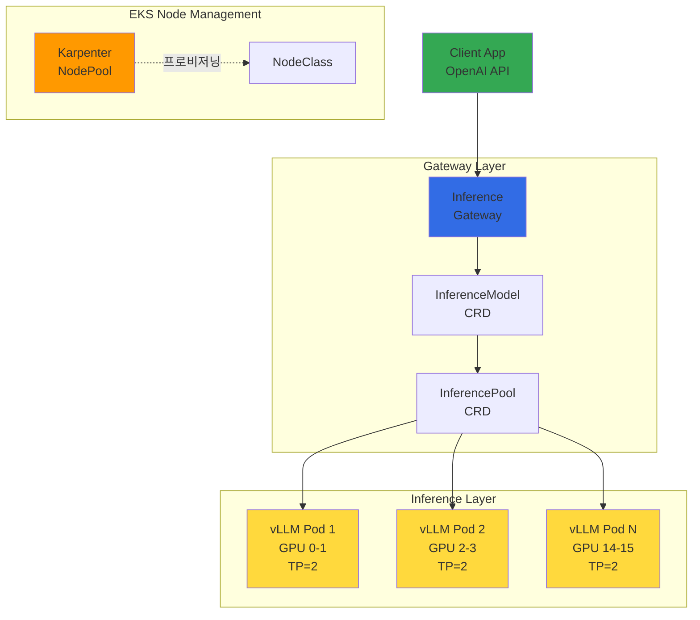
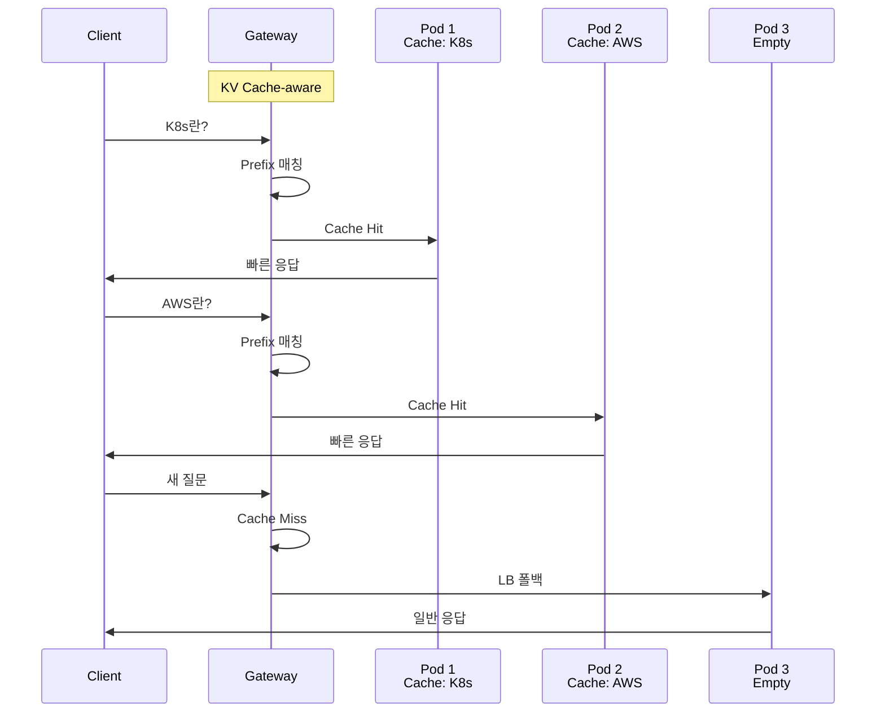
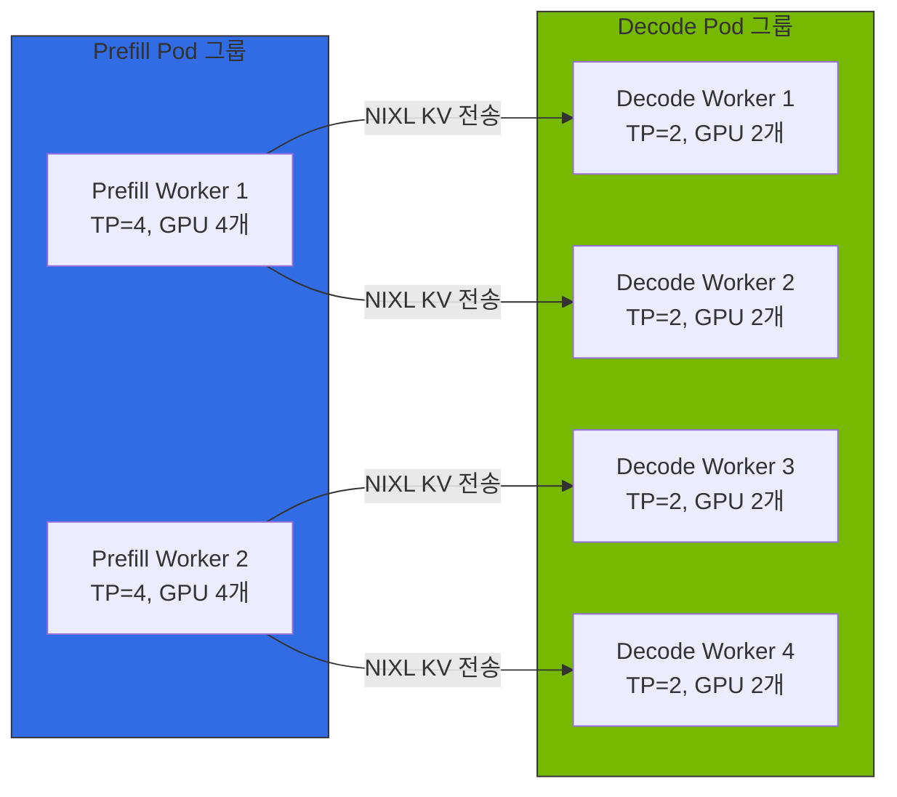
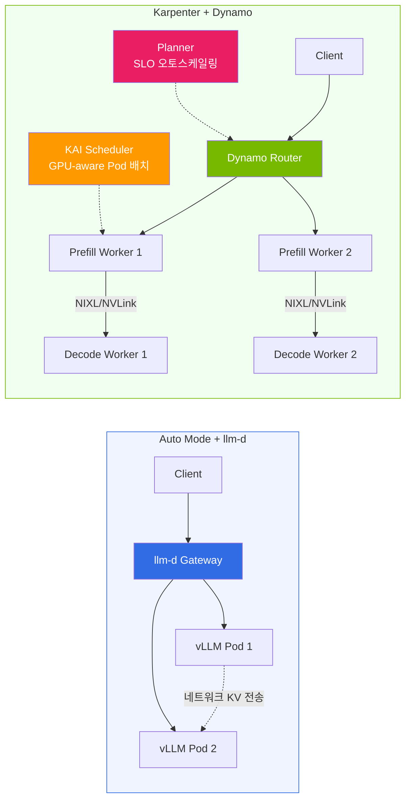

import { ComparisonTable, SpecificationTable } from '@site/src/components/tables';
import {
  WellLitPathTable,
  VllmComparisonTable,
  Qwen3SpecsTable,
  P5InstanceTable,
  P5eInstanceTable,
  GatewayCRDTable,
  DefaultDeploymentTable,
  KVCacheEffectsTable,
  MonitoringMetricsTable,
  ModelLoadingTable,
  CostOptimizationTable
} from '@site/src/components/LlmdTables';

> **현재 버전**: llm-d v0.5+ (2026.03)

## 개요

llm-d는 Red Hat이 주도하는 Apache 2.0 라이선스의 Kubernetes 네이티브 분산 추론 스택입니다. vLLM 추론 엔진, Envoy 기반 Inference Gateway, 그리고 Kubernetes Gateway API를 결합하여 대규모 언어 모델의 지능적인 추론 라우팅을 제공합니다.

기존 vLLM 배포가 단순한 Round-Robin 로드 밸런싱에 의존하는 반면, llm-d는 KV Cache 상태를 인식하는 지능적 라우팅을 통해 동일한 prefix를 가진 요청을 이미 해당 KV Cache를 보유한 Pod로 전달합니다. 이를 통해 Time To First Token(TTFT)을 크게 단축하고 GPU 연산을 절약할 수 있습니다.

:::tip 실전 배포 가이드
llm-d의 EKS 배포 YAML, helmfile 명령어, 클러스터 생성 등 실전 배포는 [커스텀 모델 배포 가이드](../../reference-architecture/model-lifecycle/custom-model-deployment.md)를 참조하세요.
:::

:::warning llm-d Inference Gateway =/= 범용 Gateway API 구현체
llm-d의 Envoy 기반 Inference Gateway는 **LLM 추론 요청 전용**으로 설계된 특수 목적 게이트웨이입니다.

- **llm-d Gateway**: InferenceModel/InferencePool CRD 기반, KV Cache-aware 라우팅, 추론 트래픽 전용
- **범용 Gateway API**: HTTPRoute/GRPCRoute 기반, TLS/인증/Rate Limiting, 클러스터 전체 트래픽 관리

프로덕션 환경에서는 범용 Gateway API 구현체가 클러스터 진입점을 담당하고, llm-d는 그 하위에서 AI 추론 트래픽을 최적화하는 구조를 권장합니다.
:::

### llm-d의 3가지 Well-Lit Path

llm-d는 세 가지 검증된 배포 경로를 제공합니다.

<WellLitPathTable />

---

## 아키텍처

llm-d의 Intelligent Inference Scheduling 아키텍처는 다음과 같이 구성됩니다.



### llm-d vs 기존 vLLM 배포 비교

<VllmComparisonTable />

### Gateway API CRD

llm-d는 Kubernetes Gateway API와 Inference Extension CRD를 사용합니다.

<GatewayCRDTable />

### 기본 배포 구성

<DefaultDeploymentTable />

### Qwen3-32B 모델 선정 이유

<Qwen3SpecsTable />

:::info Qwen3-32B 선정 배경
Qwen3-32B는 llm-d의 공식 기본 모델이며, Apache 2.0 라이선스로 상업적 사용이 자유롭습니다. BF16 기준 약 65GB VRAM이 필요하여 TP=2 (2x GPU)로 H100 80GB에서 안정적으로 서빙할 수 있습니다.
:::

---

## KV Cache-aware 라우팅

llm-d의 핵심 차별점은 KV Cache 상태를 인식하는 지능적 라우팅입니다.



### 라우팅 동작 원리

1. **요청 수신**: 클라이언트가 Inference Gateway로 추론 요청 전송
2. **Prefix 분석**: Gateway가 요청의 prompt prefix를 해시하여 식별
3. **Cache 조회**: 각 vLLM Pod의 KV Cache 상태를 확인하여 해당 prefix를 보유한 Pod 탐색
4. **지능적 라우팅**: Cache hit 시 해당 Pod로 라우팅, miss 시 부하 기반 로드 밸런싱
5. **응답 반환**: vLLM이 추론 결과를 Gateway를 통해 클라이언트에 반환

### KV Cache-aware 라우팅의 효과

<KVCacheEffectsTable />

:::tip Cache Hit Rate 극대화
동일한 시스템 프롬프트를 사용하는 애플리케이션에서 KV Cache-aware 라우팅의 효과가 극대화됩니다. 예를 들어 RAG 파이프라인에서 동일한 컨텍스트 문서를 반복 참조하는 경우, 해당 prefix의 KV Cache를 재사용하여 TTFT를 크게 단축할 수 있습니다.
:::

---

## EKS Auto Mode 통합

### Auto Mode의 장점과 제한사항

**장점:**

- **GPU 드라이버 자동 관리**: NVIDIA GPU 드라이버를 AWS가 자동으로 설치하고 업데이트
- **NodeClass 자동 선택**: `default` NodeClass를 사용하면 Auto Mode가 최적의 AMI와 드라이버 버전을 자동 선택
- **운영 단순화**: 드라이버 설치, CUDA 버전 관리, 드라이버 호환성 검증 등의 운영 부담 제거
- **GPU Operator 설치 가능**: Device Plugin만 레이블로 비활성화, DCGM/NFD/GFD 정상 동작

**제한사항:**

- **MIG/Time-Slicing 불가**: Auto Mode의 NodeClass는 AWS 관리형(read-only)이므로 GPU 분할 설정 불가
- **커스텀 AMI 불가**: 특정 CUDA 버전이나 드라이버 핀 필요 시 대응 불가

### Auto Mode vs Karpenter + GPU Operator 비교

Auto Mode는 GPU 드라이버 관리 부담 없이 대형 모델 서빙에 적합하며, Karpenter는 MIG/Time-Slicing 등 고급 GPU 기능이 필요한 워크로드에 유리합니다.

**상세 비교표 및 비용 분석**: [EKS GPU 노드 전략 — 노드 타입별 특성 비교](../gpu-infrastructure/eks-gpu-node-strategy.md#2-노드-타입별-특성-비교) 참조

### GPU 인스턴스 사양

<P5InstanceTable />

<P5eInstanceTable />

:::tip 인스턴스 선택 가이드
- **p5e.48xlarge (H200)**: 100B+ 파라미터 모델, 최대 메모리 활용
- **p5.48xlarge (H100)**: 70B+ 파라미터 모델, 최고 성능
- **g6e family (L40S)**: 13B-70B 모델, 비용 효율적 추론
:::

:::danger llm-d + DRA 사용 시 Karpenter/Auto Mode 제약
llm-d ModelService가 DRA (ResourceClaim) 방식으로 GPU를 요청하는 경우, Karpenter와 EKS Auto Mode에서는 노드 프로비저닝이 동작하지 않습니다. DRA 워크로드는 **Managed Node Group + Cluster Autoscaler** 구성이 필요합니다.

상세: [EKS GPU 노드 전략 — DRA 워크로드를 위한 MNG 하이브리드](../gpu-infrastructure/eks-gpu-node-strategy.md#53-dra-워크로드를-위한-mng-하이브리드)
:::

---

## llm-d v0.5+ 주요 기능

| 기능 | 설명 | 상태 |
|------|------|:----:|
| **Prefill/Decode Disaggregation** | Prefill과 Decode를 별도 Pod 그룹으로 분리, 대규모 배치와 긴 컨텍스트 처리량 극대화 | GA |
| **Expert Parallelism** | MoE 모델(Mixtral, DeepSeek)의 Expert를 여러 노드에 분산 서빙 | GA |
| **LoRA 어댑터 핫스왑** | 단일 기본 모델에 여러 LoRA 어댑터를 동적 로드/언로드 | GA |
| **멀티 모델 서빙** | 하나의 클러스터에서 여러 모델을 InferenceModel CRD로 동시 서빙 | GA |
| **Gateway API Inference Extension** | InferencePool/InferenceModel CRD 기반 K8s 네이티브 라우팅 | GA |

### Disaggregated Serving 개념

Disaggregated Serving은 LLM 추론의 두 단계를 분리하여 각각 독립적으로 최적화합니다:



| 단계 | 특성 | 최적화 방향 |
|------|------|-----------|
| **Prefill** | 프롬프트 전체를 한 번에 처리 (compute-bound) | GPU 컴퓨팅 집중, 높은 TP |
| **Decode** | 토큰을 하나씩 자동회귀 생성 (memory-bound) | GPU 메모리 집중, 낮은 TP |

**NIXL (NVIDIA Inference Xfer Library)**: Dynamo, llm-d, production-stack, aibrix 등 대부분의 프로젝트가 사용하는 공통 KV 전송 엔진. GPU 간 직접 통신(NVLink/RDMA)으로 KV Cache를 초고속 전송합니다.

### EKS Auto Mode에서의 Disaggregated Serving

Auto Mode에서는 MIG 파티셔닝이 불가능하므로, **인스턴스(노드) 단위로 Prefill/Decode 역할을 분리**합니다.

```
Prefill NodePool (compute-heavy):
  p5.48xlarge x N대 -> Prefill Pod (각 TP=4, GPU 4개)

Decode NodePool (memory-heavy):
  p5.48xlarge x N대 -> Decode Pod (각 TP=2, GPU 2개 x 4 Pod/노드)
```

| 항목 | Auto Mode (노드 분리) | Karpenter + GPU Operator (MIG 분리) |
|------|----------------------|-------------------------------------|
| **분리 단위** | 인스턴스(노드) | GPU 단위 (MIG 파티션) |
| **GPU 활용률** | Decode Pod TP=2 x 4개/노드로 최적화 가능 | MIG로 한 GPU 내 분할, 높은 활용률 |
| **운영 복잡도** | 낮음 | 중간 (GPU Operator + MIG 설정) |
| **스케일링** | Prefill/Decode 독립 스케일링 용이 | 노드 내 MIG 재설정 시 중단 발생 |

:::tip GPU 유휴 최소화
**권장 전략**: Auto Mode로 먼저 검증한 후, 비용 최적화가 필요하면 Karpenter + GPU Operator + MIG로 전환하세요.
:::

---

## llm-d vs NVIDIA Dynamo

llm-d와 NVIDIA Dynamo는 모두 LLM 추론 라우팅/스케줄링을 제공하지만 접근 방식이 다릅니다. 상세 비교는 [NVIDIA GPU 스택 — llm-d vs Dynamo](../gpu-infrastructure/nvidia-gpu-stack.md#llm-d와의-선택-가이드)를 참조하세요.

| 항목 | llm-d | NVIDIA Dynamo |
|------|-------|---------------|
| **주도** | Red Hat (Apache 2.0) | NVIDIA (Apache 2.0) |
| **아키텍처** | Aggregated + Disaggregated | Aggregated + Disaggregated (동등 지원) |
| **KV Cache 전송** | NIXL (네트워크도 지원) | NIXL (NVLink/RDMA 초고속) |
| **KV Cache 인덱싱** | Prefix-aware 라우팅 | Flash Indexer (radix tree 기반) |
| **라우팅** | Gateway API + Envoy EPP | Dynamo Router + 자체 EPP (Gateway API 통합) |
| **Pod 스케줄링** | K8s 기본 스케줄러 | KAI Scheduler (GPU-aware Pod 배치) |
| **오토스케일링** | HPA/KEDA 연동 | Planner (SLO 기반: profiling -> autoscale) + KEDA/HPA |
| **GPU Operator 필요** | 선택사항 (Auto Mode 호환) | 필요 (KAI Scheduler의 ClusterPolicy 의존) |
| **복잡도** | 낮음 | 높음 |
| **강점** | K8s 네이티브, 경량, 빠른 도입 | Flash Indexer, KAI Scheduler, Planner SLO 오토스케일링 |

:::tip 선택 가이드
- **EKS Auto Mode + 빠른 시작**: llm-d (GPU Operator 선택사항)
- **소규모~중규모 (GPU 16개 이하)**: llm-d
- **대규모 (GPU 16개+), 최대 처리량**: Dynamo (Flash Indexer + Planner)
- **긴 컨텍스트 (128K+)**: Dynamo (3-tier KV Cache: GPU->CPU->SSD)
- **K8s Gateway API 표준 준수**: llm-d

llm-d로 시작하여 규모가 커지면 Dynamo로 전환하는 것이 현실적입니다. Dynamo 1.0은 llm-d를 내부 컴포넌트로 통합할 수 있어, 완전한 대안 관계라기보다 Dynamo가 llm-d를 포함하는 상위 집합으로 볼 수 있습니다.
:::

### 마이그레이션 경로



**단계별 전환 경로:**

| Phase | 구성 | 적합 대상 |
|-------|------|----------|
| **Phase 1** | Auto Mode + llm-d | PoC, 개발 환경, GPU 16개 이하 |
| **Phase 1.5** | Auto Mode + GPU Operator + llm-d | 모니터링/스케줄링 강화 |
| **Phase 2a** | Karpenter + llm-d Disaggregated | 중규모 프로덕션, MIG 활용 |
| **Phase 2b** | MNG + DRA + llm-d | P6e-GB200, DRA 필수 환경 |
| **Phase 3** | Karpenter + Dynamo | 대규모 (GPU 16개+), 최대 성능 |

:::caution 전환 시 주의사항
Auto Mode와 Karpenter 자체 관리는 동일 클러스터에서 혼용이 가능합니다. Phase 1.5에서는 Auto Mode NodePool에 `nvidia.com/gpu.deploy.device-plugin: "false"` 레이블을 추가하여 Device Plugin 충돌을 방지합니다.
:::

---

## 모니터링

### 주요 모니터링 메트릭

<MonitoringMetricsTable />

### 모델 로딩 시간

<ModelLoadingTable />

### 비용 최적화

<CostOptimizationTable />

:::warning 비용 주의
p5.48xlarge는 시간당 약 $98.32 (us-west-2 On-Demand 기준)입니다. 2대 운영 시 **월 약 $141,580**입니다. 테스트 완료 후 반드시 리소스를 정리하세요.
:::

---

## EKS Auto Mode GPU 인스턴스 지원 현황 (2026.04 검증)

### 인스턴스 지원 매트릭스

| 인스턴스 타입 | GPU | VRAM (총합) | Auto Mode 지원 | 검증 상태 |
|-------------|-----|-----------|---------------|----------|
| g5.xlarge~48xlarge | A10G | 24~192GB | 정상 | 프로비저닝 확인 |
| g6.xlarge~48xlarge | L4 | 24~192GB | 정상 | 프로비저닝 확인 |
| g6e.xlarge~48xlarge | L40S | 48~384GB | 정상 | 프로비저닝 확인 |
| p4d.24xlarge | A100 40GB x 8 | 320GB | 정상 | dry-run 확인 |
| p5.48xlarge | H100 80GB x 8 | 640GB | 정상 | **Spot 프로비저닝 확인** (us-east-2) |
| p5en.48xlarge | H200 141GB x 8 | 1,128GB | 제한적 | dry-run 통과, offering 매칭 실패 가능 |
| **p6-b200.48xlarge** | **B200 192GB x 8** | **1,536GB** | **미지원** | **`NoCompatibleInstanceTypes` 발생** |

:::warning p6 인스턴스 미지원
2026년 4월 기준, EKS Auto Mode의 managed Karpenter는 **p6-b200.48xlarge를 프로비저닝할 수 없습니다.** p6 인스턴스가 필요한 경우 EKS Standard Mode + Karpenter를 사용하세요.
:::

### 리전별 GPU 용량 가용성

| 리전 | p5.48xlarge On-Demand | p5.48xlarge Spot | Spot 가격 |
|------|---------------------|-----------------|----------|
| ap-northeast-2 (서울) | InsufficientCapacity | 미확인 | -- |
| **us-east-2 (Ohio)** | 가용성 변동 | **확보 성공** | **$13~15/hr** |

**Spot 가격 비교 (us-east-2, 2026.04 기준)**: p5 인스턴스는 Spot으로 85-90% 비용 절감이 가능합니다. 상세 가격표는 [EKS GPU 노드 전략 — Spot 가격 비교](../gpu-infrastructure/eks-gpu-node-strategy.md#47-spot-가격-비교-us-east-2-202604)를 참조하세요.

### GPU 쿼타 주의사항

| 쿼타 이름 | 적용 인스턴스 | 기본값 |
|-----------|-------------|--------|
| Running On-Demand P instances | p4d, p4de, p5, p5en | 384 |
| Running On-Demand G and VT instances | g5, g6, g6e | **64** |

:::caution G 인스턴스 쿼타 함정
GPU NodePool에 `instance-category: [g, p]`를 함께 설정한 경우, Karpenter가 G 타입 인스턴스를 먼저 시도할 수 있습니다. P 타입만 사용하려면 `instance-category: [p]`로 명시적으로 지정하세요.
:::

---

## 다음 단계

- [EKS GPU 노드 전략](../gpu-infrastructure/eks-gpu-node-strategy.md) -- Auto Mode vs Karpenter vs Hybrid Node, 모델 크기별 비용 분석
- [vLLM 기반 FM 배포 및 성능 최적화](./vllm-model-serving.md) -- vLLM 기본 개념 및 배포
- [MoE 모델 서빙 가이드](./moe-model-serving.md) -- Mixture of Experts 모델 서빙
- [GPU 리소스 관리](../gpu-infrastructure/gpu-resource-management.md) -- GPU 클러스터 리소스 관리

---

## 참고 자료

- [llm-d GitHub](https://github.com/llm-d/llm-d)
- [llm-d Deployer (Helm Charts)](https://github.com/llm-d/llm-d-deployer)
- [EKS Auto Mode 문서](https://docs.aws.amazon.com/eks/latest/userguide/automode.html)
- [Gateway API Inference Extension](https://gateway-api.sigs.k8s.io/geps/gep-3567/)
- [vLLM 공식 문서](https://docs.vllm.ai/)
- [Qwen3-32B HuggingFace](https://huggingface.co/Qwen/Qwen3-32B)
