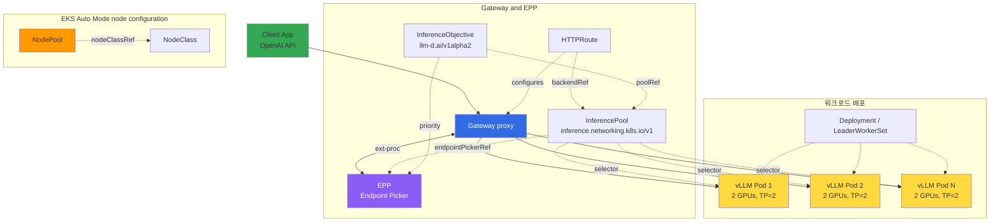
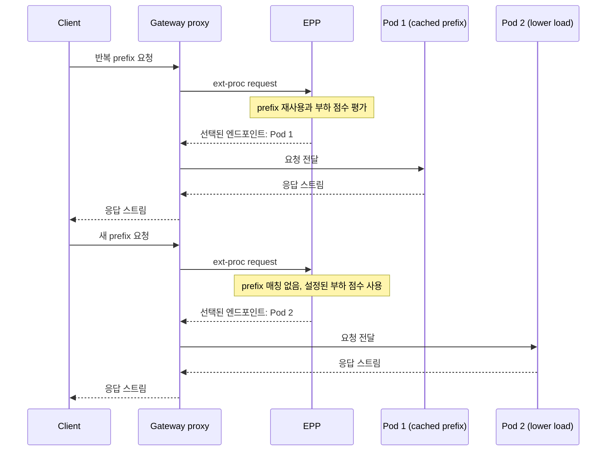
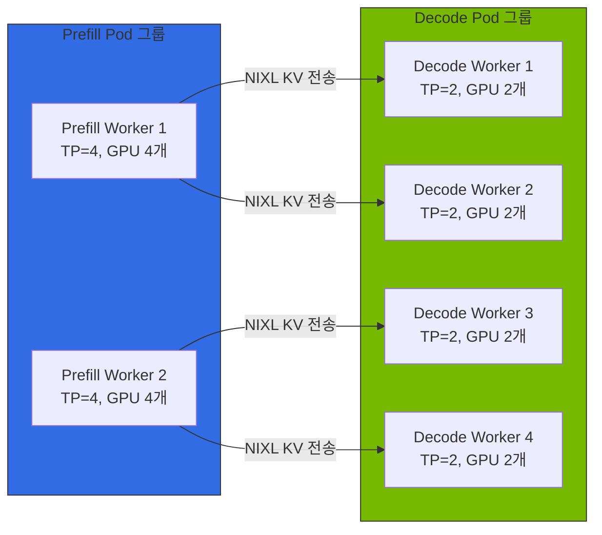
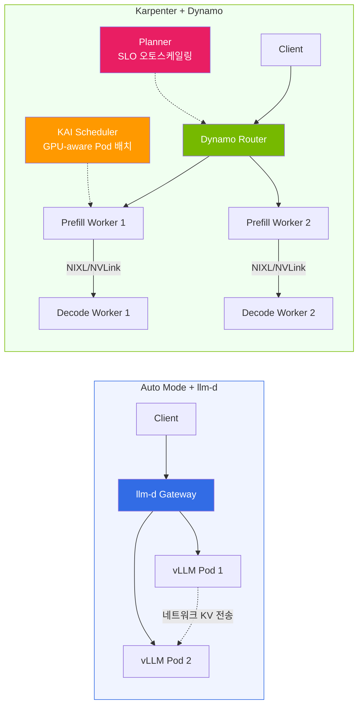

import { ComparisonTable, SpecificationTable } from '@site/src/components/tables';
import {
  WellLitPathTable,
  VllmComparisonTable,
  Qwen3SpecsTable,
  P5InstanceTable,
  P5eInstanceTable,
  GatewayCRDTable,
  KVCacheEffectsTable,
  MonitoringMetricsTable,
  ModelLoadingTable,
  CostOptimizationTable
} from '@site/src/components/LlmdTables';

> **검토 기준**: [llm-d v0.8.1](https://github.com/llm-d/llm-d/releases/tag/v0.8.1) (2026-06-26 릴리스, 문서 검토 2026-09-18). 구성 버전: llm-d Router v0.9.0, GIE v1.5.0, Gateway API v1.5.1. CNCF Sandbox 합류(2026-03)는 릴리스 날짜와 별개입니다.

## 개요

llm-d는 Red Hat이 주도하는 Apache 2.0 라이선스의 Kubernetes 네이티브 분산 추론 스택입니다. vLLM 추론 엔진, 호환 프록시와 EPP를 연결하는 Inference Gateway, 그리고 Kubernetes Gateway API를 결합하여 대규모 언어 모델의 지능적인 추론 라우팅을 제공합니다.

기존 vLLM 배포가 단순한 Round-Robin 로드 밸런싱에 의존하는 반면, llm-d는 KV Cache 상태를 인식하는 지능적 라우팅을 통해 동일한 prefix를 가진 요청을 이미 해당 KV Cache를 보유한 Pod로 전달합니다. 이를 통해 Time To First Token(TTFT)을 크게 단축하고 GPU 연산을 절약할 수 있습니다.

:::tip 실전 배포 가이드
llm-d의 EKS 배포 설계와 클러스터 준비는 [커스텀 모델 배포 가이드](../../reference-architecture/model-lifecycle/custom-model-deployment.md)를 참조하세요.
:::

:::info Gateway 토폴로지 선택
llm-d v0.8.1의 [Gateway Mode](https://github.com/llm-d/llm-d/blob/v0.8.1/docs/architecture/core/router/proxy.md)는 기존 Gateway API 구현체를 EPP(Endpoint Picker)와 연동합니다. **호환 Gateway 하나가 일반 Service와 InferencePool을 모두 라우팅할 수 있습니다.** EPP는 엔드포인트를 선택하는 서비스이며, 두 번째 트래픽 프록시가 아닙니다.

- **단일 Gateway**: 선택한 구현체·버전이 `HTTPRoute → InferencePool`과 EPP external processing 연동을 지원해야 합니다. TLS·인증·rate limiting 지원은 해당 구현체의 정책과 설정을 확인합니다.
- **별도 edge Gateway + inference Gateway**: 기존 ingress를 유지하거나 보안 경계·운영 소유권·스케일링을 분리해야 할 때 선택합니다. 추가 프록시 홉, 지연, 비용, timeout·retry·스트리밍·인증 헤더·관측성의 일관성을 함께 검토해야 합니다.

두 게이트웨이를 모든 llm-d 배포의 필수 조건으로 가정하지 않습니다. 아래 다이어그램은 단일 Gateway 구성을 보여줍니다.
:::

### llm-d의 3가지 Well-Lit Path

아래 표는 대표적인 세 가지 패턴을 요약합니다. v0.8.1의 전체 [Well-Lit Paths](https://github.com/llm-d/llm-d/blob/v0.8.1/docs/well-lit-paths/README.md)는 Foundations와 Workloads로 구성되며, Intelligent Inference Scheduling의 현재 시작점은 [Optimized Baseline](https://github.com/llm-d/llm-d/blob/v0.8.1/guides/optimized-baseline/README.md)입니다.

<WellLitPathTable />

---

## 아키텍처

llm-d의 Intelligent Inference Scheduling 아키텍처는 다음과 같이 구성됩니다.

실선은 요청·응답 및 ext-proc 호출, 점선은 설정 참조·Pod 관리 관계입니다. GPU 수와 TP는 설명용 워크로드 값입니다. InferencePool은 기존 Pod를 선택하고 EPP를 참조하며, 이미지·GPU 요청·replica 수는 Deployment/LeaderWorkerSet 등의 워크로드에 정의합니다.


```mermaid
flowchart TB
    CLIENT[Client App<br/>OpenAI API]
    subgraph Routing["Gateway and EPP"]
        GW[Gateway proxy]
        EPP[EPP<br/>Endpoint Picker]
        HR[HTTPRoute]
        IP[InferencePool<br/>inference.networking.k8s.io/v1]
        IO[InferenceObjective<br/>llm-d.ai/v1alpha2]
    end
    subgraph Workload["워크로드 배포"]
        DEP[Deployment / LeaderWorkerSet]
        V1[vLLM Pod 1<br/>2 GPUs, TP=2]
        V2[vLLM Pod 2<br/>2 GPUs, TP=2]
        VN[vLLM Pod N<br/>2 GPUs, TP=2]
    end
    subgraph Nodes["EKS Auto Mode node configuration"]
        NP[NodePool]
        NC[NodeClass]
    end
    CLIENT --> GW
    GW <-->|ext-proc| EPP
    GW --> V1
    GW --> V2
    GW --> VN
    HR -.->|configures| GW
    HR -.->|backendRef| IP
    IP -.->|endpointPickerRef| EPP
    IP -.->|selector| V1
    IP -.->|selector| V2
    IP -.->|selector| VN
    IO -.->|poolRef| IP
    IO -.->|priority| EPP
    DEP -.-> V1
    DEP -.-> V2
    DEP -.-> VN
    NP -.->|nodeClassRef| NC
    style CLIENT fill:#34a853
    style GW fill:#326ce5,color:#fff
    style EPP fill:#8b5cf6,color:#fff
    style V1 fill:#ffd93d
    style V2 fill:#ffd93d
    style VN fill:#ffd93d
    style NP fill:#ff9900
```

### llm-d vs 기존 vLLM 배포 비교

<VllmComparisonTable />

### Gateway API CRD

이 가이드의 Gateway Mode는 아래 리소스를 사용합니다. Gateway API/GIE CRD와 llm-d의 선택적 InferenceObjective CRD는 소속과 설치 패키지가 다릅니다. 기준 스키마: [llm-d v0.8.1](https://github.com/llm-d/llm-d/releases/tag/v0.8.1), [InferencePool v1](https://github.com/kubernetes-sigs/gateway-api-inference-extension/blob/v1.5.0/config/crd/bases/inference.networking.k8s.io_inferencepools.yaml), [InferenceObjective v1alpha2](https://github.com/llm-d/llm-d-router/blob/v0.9.0/config/crd/bases/llm-d.ai_inferenceobjectives.yaml), [HTTPRoute v1](https://github.com/kubernetes-sigs/gateway-api/blob/v1.5.1/config/crd/standard/gateway.networking.k8s.io_httproutes.yaml).

<GatewayCRDTable />

### 기본 배포 구성

[Optimized Baseline v0.8.1](https://github.com/llm-d/llm-d/blob/v0.8.1/guides/optimized-baseline/README.md)의 NVIDIA GPU 예제를 기준으로 한 구성입니다. EKS에서 실행 검증한 기본값이나 모든 배포 경로의 공통값은 아닙니다. 이 릴리스는 router Helm chart와 모델 서버 Kustomize 매니페스트를 사용합니다.

| 설정 | 예제 값 | 정의 위치 |
|------|---------|-----------|
| 모델 | `Qwen/Qwen3-32B` | 모델 서버 인수 |
| vLLM 이미지 | `vllm/vllm-openai:v0.23.0` | 워크로드 container image, 릴리스 구성표 기준 |
| Replicas | 8 | 워크로드 replica 설정 |
| Tensor Parallelism / GPU | TP=2 / replica당 2 GPU | 모델 서버 인수와 Pod GPU 요청 |
| 총 GPU | 16 | 8 replicas × 2 GPU, 노드 배치는 별도 결정 |

InferencePool은 이 워크로드의 Pod 레이블을 선택합니다. InferenceObjective는 요청 정책이며 위 배포 설정을 대체하지 않습니다.

### Qwen3-32B 모델 선정 이유

<Qwen3SpecsTable />

:::info Qwen3-32B 선정 배경
Qwen3-32B는 위 Optimized Baseline 예제의 기본 모델이며, Apache 2.0 라이선스로 상업적 사용이 자유롭습니다. BF16 기준 약 65GB VRAM이 필요하여 TP=2 (2x GPU)로 H100 80GB에서 안정적으로 서빙할 수 있습니다.
:::

---

## KV Cache-aware 라우팅

llm-d의 핵심 차별점은 KV Cache 상태를 인식하는 지능적 라우팅입니다.

다음 흐름은 설정된 EPP 플러그인의 동작을 단순화한 예시입니다. 캐시가 있는 Pod도 부하에 따라 선택되지 않을 수 있습니다.


```mermaid
sequenceDiagram
    participant C as Client
    participant GW as Gateway proxy
    participant E as EPP
    participant P1 as Pod 1 (cached prefix)
    participant P2 as Pod 2 (lower load)
    C->>GW: 반복 prefix 요청
    GW->>E: ext-proc request
    Note over E: prefix 재사용과 부하 점수 평가
    E-->>GW: 선택된 엔드포인트: Pod 1
    GW->>P1: 요청 전달
    P1-->>GW: 응답 스트림
    GW-->>C: 응답 스트림
    C->>GW: 새 prefix 요청
    GW->>E: ext-proc request
    Note over E: prefix 매칭 없음, 설정된 부하 점수 사용
    E-->>GW: 선택된 엔드포인트: Pod 2
    GW->>P2: 요청 전달
    P2-->>GW: 응답 스트림
    GW-->>C: 응답 스트림
```

### 라우팅 동작 원리

1. **요청 수신**: 클라이언트가 Inference Gateway로 추론 요청 전송
2. **Prefix 분석**: Gateway가 EPP에 ext-proc 호출을 전달하고, 설정된 EPP 플러그인이 prefix를 분석
3. **Cache 조회**: EPP가 설정된 캐시 인덱스·메트릭으로 후보 Pod의 캐시 재사용 가능성을 평가
4. **지능적 라우팅**: EPP가 캐시와 부하 점수를 종합해 엔드포인트를 선택하고 Gateway가 해당 Pod로 프록시
5. **응답 반환**: vLLM이 추론 결과를 Gateway를 통해 클라이언트에 반환

### KV Cache-aware 라우팅의 효과

<KVCacheEffectsTable />

:::tip Cache Hit Rate 극대화
동일한 시스템 프롬프트를 사용하는 애플리케이션에서 KV Cache-aware 라우팅의 효과가 극대화됩니다. 예를 들어 RAG 파이프라인에서 동일한 컨텍스트 문서를 반복 참조하는 경우, 해당 prefix의 KV Cache를 재사용하여 TTFT를 크게 단축할 수 있습니다.
:::

---

## EKS Auto Mode 통합

### Auto Mode의 장점과 제한사항

**장점:**

- **GPU 드라이버 자동 관리**: NVIDIA GPU 드라이버를 AWS가 자동으로 설치하고 업데이트
- **NodeClass 자동 선택**: `default` NodeClass를 사용하면 Auto Mode가 최적의 AMI와 드라이버 버전을 자동 선택
- **운영 단순화**: 드라이버 설치, CUDA 버전 관리, 드라이버 호환성 검증 등의 운영 부담 제거
- **GPU Operator 설치 가능**: Device Plugin만 레이블로 비활성화, DCGM/NFD/GFD 정상 동작

**제한사항:**

- **MIG/Time-Slicing 제한**: Auto Mode가 관리하는 NVIDIA device plugin 설정은 사용자가 변경할 수 없습니다. NodeClass 자체가 read-only라는 의미는 아닙니다.
- **커스텀 AMI 불가**: 특정 CUDA 버전이나 드라이버 핀 필요 시 대응 불가

### Auto Mode vs Karpenter + GPU Operator 비교

Auto Mode는 GPU 드라이버 관리 부담 없이 대형 모델 서빙에 적합하며, Karpenter는 MIG/Time-Slicing 등 고급 GPU 기능이 필요한 워크로드에 유리합니다.

**상세 비교표 및 비용 분석**: [EKS GPU 노드 전략 — 노드 타입별 특성 비교](../gpu-infrastructure/eks-gpu-node-strategy.md#노드-타입별-특성-비교) 참조

### GPU 인스턴스 사양

<P5InstanceTable />

<P5eInstanceTable />

:::tip 인스턴스 선택 가이드
- **p5e.48xlarge (H200)**: 100B+ 파라미터 모델, 최대 메모리 활용
- **p5.48xlarge (H100)**: 70B+ 파라미터 모델, 최고 성능
- **g6e family (L40S)**: 13B-70B 모델, 비용 효율적 추론
:::

:::danger llm-d + DRA 사용 시 Karpenter 버전 제약
llm-d ModelService가 DRA (ResourceClaim) 방식으로 GPU를 요청하는 경우, Karpenter 버전과 배포 방식에 따라 지원 여부가 갈립니다.
- **Self-managed Karpenter v1.14.0+**: DRA를 지원합니다 (AWS Provider v1.14.0이 코어 v1.14.0의 DRA allocator 포함, consumable capacity·partitionable devices 지원). v1.13 이하는 `spec.resourceClaims` Pod를 skip합니다.
- **EKS Auto Mode**: 현재 DRA 미지원 — AWS 관리형 내부 Karpenter라 사용자가 v1.14+로 올릴 수 없습니다. Auto Mode 사용 시 **Managed Node Group + Cluster Autoscaler**가 권장 방식입니다.

상세: [EKS GPU 노드 전략 — DRA 워크로드를 위한 MNG 하이브리드](../gpu-infrastructure/eks-gpu-node-strategy.md#dra-워크로드를-위한-mng-하이브리드)
:::

---

## llm-d v0.8.1 주요 기능 {#llm-d-v05-주요-기능}

상태는 [v0.8.1 릴리스](https://github.com/llm-d/llm-d/releases/tag/v0.8.1)와 해당 태그의 문서 기준입니다. 배포 패턴·구현 기능·API 안정성은 서로 다른 상태를 나타냅니다.

| 기능 | 설명 | 검토 기준의 상태 |
|------|------|------------------|
| **Prefill/Decode Disaggregation** | Prefill과 Decode를 별도 Pod 그룹으로 배포하고 KV를 전송 | [Well-lit path](https://github.com/llm-d/llm-d/blob/v0.8.1/docs/well-lit-paths/foundations/pd-disaggregation.md) |
| **Expert Parallelism (Wide EP)** | 지원되는 MoE 모델과 하드웨어 조합에서 Expert 분산 | [Well-lit path](https://github.com/llm-d/llm-d/blob/v0.8.1/docs/well-lit-paths/foundations/wide-expert-parallelism.md) |
| **LoRA-aware 스케줄링** | 이미 로드된 어댑터와 로딩 여유를 고려하는 `lora-affinity-scorer`; 동적 로딩은 모델 서버 설정에 의존 | [구현된 플러그인](https://github.com/llm-d/llm-d-router/blob/v0.9.0/pkg/epp/framework/plugins/scheduling/scorer/loraaffinity/README.md), 일괄 GA hot-swap 보장 아님 |
| **멀티 모델 라우팅** | HTTPRoute의 경로·헤더·가중치로 모델별 InferencePool 선택; JSON `model` 본문 기반 라우팅은 별도 구현·설정 필요 | [Gateway Mode 패턴](https://github.com/llm-d/llm-d/blob/v0.8.1/docs/architecture/core/router/proxy.md); IPP 제안과 기본 동작을 구분 |
| **Gateway API Inference Extension** | InferencePool `inference.networking.k8s.io/v1`; 선택적 요청 정책은 llm-d InferenceObjective `llm-d.ai/v1alpha2` | GIE v1 API / llm-d alpha API |
| **Flow control** | InferenceObjective의 정수 `priority`로 요청 큐 우선순위 지정 | 릴리스에서 production 승격; [설정 문서](https://github.com/llm-d/llm-d/blob/v0.8.1/docs/architecture/core/router/epp/flow-control.md)는 `flowControl` feature gate의 명시적 활성화 요구 |

`InferenceModel`은 이전 정책 API의 역사적 이름입니다. 위 스키마에는 모델 이미지·GPU 할당·replica 수가 없으며, `priority`가 GPU를 예약하지 않습니다.
### Disaggregated Serving 개념

Disaggregated Serving은 LLM 추론의 두 단계를 분리하여 각각 독립적으로 최적화합니다:


```mermaid
flowchart LR
    subgraph Prefill["Prefill Pod 그룹"]
        P1[Prefill Worker 1<br/>TP=4, GPU 4개]
        P2[Prefill Worker 2<br/>TP=4, GPU 4개]
    end

    subgraph Decode["Decode Pod 그룹"]
        D1[Decode Worker 1<br/>TP=2, GPU 2개]
        D2[Decode Worker 2<br/>TP=2, GPU 2개]
        D3[Decode Worker 3<br/>TP=2, GPU 2개]
        D4[Decode Worker 4<br/>TP=2, GPU 2개]
    end

    P1 -->|NIXL KV 전송| D1
    P1 -->|NIXL KV 전송| D2
    P2 -->|NIXL KV 전송| D3
    P2 -->|NIXL KV 전송| D4

    style Prefill fill:#326ce5,stroke:#333
    style Decode fill:#76b900,stroke:#333
```

| 단계 | 특성 | 최적화 방향 |
|------|------|-----------|
| **Prefill** | 프롬프트 전체를 한 번에 처리 (compute-bound) | GPU 컴퓨팅 집중, 높은 TP |
| **Decode** | 토큰을 하나씩 자동회귀 생성 (memory-bound) | GPU 메모리 집중, 낮은 TP |

**NIXL (NVIDIA Inference Xfer Library)**: Dynamo, llm-d, production-stack, aibrix 등 대부분의 프로젝트가 사용하는 공통 KV 전송 엔진. GPU 간 직접 통신(NVLink/RDMA)으로 KV Cache를 초고속 전송합니다.

### EKS Auto Mode에서의 Disaggregated Serving

[AWS의 GPU 워크로드 예제](https://docs.aws.amazon.com/eks/latest/userguide/auto-accelerated.html)처럼 GPU는 Pod의 `nvidia.com/gpu` 요청으로 할당합니다. Auto Mode에서 [MIG는 지원되지 않지만](https://docs.aws.amazon.com/eks/latest/userguide/device-management-nvidia-mig.html), 이것이 Prefill/Decode를 반드시 다른 노드에 배치해야 한다는 뜻은 아닙니다. 같은 다중 GPU 노드의 서로 다른 전체 GPU를 각 Pod가 요청할 수 있으며, 실제 배치는 가용 GPU·메모리와 Pod 배치 제약에 달려 있습니다.

별도 NodePool은 하드웨어·확장 정책을 분리하려는 경우의 설계 선택입니다. 다음 수량은 예시이며 성능 측정 결과가 아닙니다.

```text
Prefill NodePool: Pod당 TP=4, nvidia.com/gpu: 4
Decode NodePool: Pod당 TP=2, nvidia.com/gpu: 2
```

모델 서버 워크로드에서 replica 수·GPU 요청·nodeSelector/affinity를 설정하고, InferencePool에서는 해당 Pod를 선택합니다. InferenceObjective의 요청 우선순위는 노드 배치나 GPU 격리를 대신하지 않습니다.
---

## llm-d vs NVIDIA Dynamo

llm-d와 NVIDIA Dynamo는 모두 LLM 추론 라우팅/스케줄링을 제공하지만 접근 방식이 다릅니다. 상세 비교는 [NVIDIA GPU 스택 — llm-d vs Dynamo](../gpu-infrastructure/nvidia-gpu-stack.md#llm-d와의-선택-가이드)를 참조하세요.

| 항목 | llm-d | NVIDIA Dynamo |
|------|-------|---------------|
| **주도** | Red Hat (Apache 2.0) | NVIDIA (Apache 2.0) |
| **아키텍처** | Aggregated + Disaggregated | Aggregated + Disaggregated (동등 지원) |
| **KV Cache 전송** | NIXL (네트워크도 지원) | NIXL (NVLink/RDMA 초고속) |
| **KV Cache 인덱싱** | Prefix-aware 라우팅 | Flash Indexer (radix tree 기반) |
| **라우팅** | Gateway API + Envoy EPP | Dynamo Router + 자체 EPP (Gateway API 통합) |
| **Pod 스케줄링** | K8s 기본 스케줄러 | KAI Scheduler (GPU-aware Pod 배치) |
| **오토스케일링** | HPA/KEDA 연동 | Planner (SLO 기반: profiling -> autoscale) + KEDA/HPA |
| **GPU Operator 필요** | 선택사항 (Auto Mode 호환) | 필요 (Dynamo Platform 설치 전제조건; KAI Scheduler는 멀티노드용 선택 컴포넌트) |
| **복잡도** | 낮음 | 높음 |
| **강점** | K8s 네이티브, 경량, 빠른 도입 | Flash Indexer, KAI Scheduler, Planner SLO 오토스케일링 |

:::tip 선택 가이드
- **EKS Auto Mode + 빠른 시작**: llm-d (GPU Operator 선택사항)
- **소규모~중규모 (GPU 16개 이하)**: llm-d
- **대규모 (GPU 16개+), 최대 처리량**: Dynamo (Flash Indexer + Planner)
- **긴 컨텍스트 (128K+)**: Dynamo (3-tier KV Cache: GPU->CPU->SSD)
- **K8s Gateway API 표준 준수**: llm-d

llm-d와 Dynamo는 상호보완적 관계입니다. 두 프로젝트는 NIXL(KV 전송 라이브러리)과 Gateway API를 공유하는 독립 병렬 스택이며, llm-d는 NIXL을 KV Cache 전송에 활용합니다. llm-d로 시작하여 규모가 커지면 Dynamo로 전환하는 것이 현실적입니다.
:::

### 마이그레이션 경로


```mermaid
flowchart LR
    subgraph AutoMode["Auto Mode + llm-d"]
        direction TB
        C1[Client] --> GW1[llm-d Gateway]
        GW1 --> VP1[vLLM Pod 1]
        GW1 --> VP2[vLLM Pod 2]
        VP1 -.->|네트워크 KV 전송| VP2
    end

    subgraph KarpenterDynamo["Karpenter + Dynamo"]
        direction TB
        C2[Client] --> DR[Dynamo Router]
        DR --> PW1[Prefill Worker 1]
        DR --> PW2[Prefill Worker 2]
        PW1 -->|NIXL/NVLink| DW1[Decode Worker 1]
        PW2 -->|NIXL/NVLink| DW2[Decode Worker 2]
        KAI[KAI Scheduler<br/>GPU-aware Pod 배치] -.-> PW1
        PLAN[Planner<br/>SLO 오토스케일링] -.-> DR
    end

    style AutoMode fill:#f0f4ff,stroke:#326ce5
    style KarpenterDynamo fill:#f0fff0,stroke:#76b900
    style GW1 fill:#326ce5,color:#fff
    style DR fill:#76b900,color:#fff
    style KAI fill:#ff9900,color:#fff
    style PLAN fill:#e91e63,color:#fff
```

**단계별 전환 경로:**

| Phase | 구성 | 적합 대상 |
|-------|------|----------|
| **Phase 1** | Auto Mode + llm-d | PoC, 개발 환경, GPU 16개 이하 |
| **Phase 1.5** | Auto Mode + GPU Operator + llm-d | 모니터링/스케줄링 강화 |
| **Phase 2a** | Karpenter + llm-d Disaggregated | 중규모 프로덕션, MIG 활용 |
| **Phase 2b** | MNG + DRA + llm-d | P6e-GB200, DRA 필수 환경 |
| **Phase 3** | Karpenter + Dynamo | 대규모 (GPU 16개+), 최대 성능 |

:::caution 전환 시 주의사항
Auto Mode와 Karpenter 자체 관리는 동일 클러스터에서 혼용이 가능합니다. Phase 1.5에서 GPU Operator Device Plugin 충돌을 방지하려면 Helm 설치 시 `devicePlugin.enabled=false`로 설정하거나, ClusterPolicy에서 `daemonsets.nodeSelector`/`affinity`로 Auto Mode 노드(`eks.amazonaws.com/compute-type: auto`)를 제외합니다. NodePool 레이블 방식(`nvidia.com/gpu.deploy.device-plugin: "false"`)은 GPU Operator가 레이블을 `true`로 덮어쓰므로 동작하지 않습니다.
:::

---

## 모니터링

### 주요 모니터링 메트릭

<MonitoringMetricsTable />

### 모델 로딩 시간

<ModelLoadingTable />

### 비용 최적화

<CostOptimizationTable />

:::warning 비용 주의
p5.48xlarge는 시간당 $55.04 (us-west-2 On-Demand 기준, 2025-06 AWS 가격 인하 반영)입니다. 2대 운영 시 **월 약 $79,258** (720h 기준) ~ **$80,360** (730h 기준)입니다. 테스트 완료 후 반드시 리소스를 정리하세요.
:::

---

## EKS Auto Mode GPU 인스턴스 지원 현황 (2026.04 검증)

### 인스턴스 지원 매트릭스

| 인스턴스 타입 | GPU | VRAM (총합) | Auto Mode 지원 | 검증 상태 |
|-------------|-----|-----------|---------------|----------|
| g5.xlarge~48xlarge | A10G | 24~192GB | 정상 | 프로비저닝 확인 |
| g6.xlarge~48xlarge | L4 | 24~192GB | 정상 | 프로비저닝 확인 |
| g6e.xlarge~48xlarge | L40S | 48~384GB | 정상 | 프로비저닝 확인 |
| p4d.24xlarge | A100 40GB x 8 | 320GB | 정상 | dry-run 확인 |
| p5.48xlarge | H100 80GB x 8 | 640GB | 정상 | **Spot 프로비저닝 확인** (us-east-2) |
| p5en.48xlarge | H200 141GB x 8 | 1,128GB | 제한적 | dry-run 통과, offering 매칭 실패 가능 |
| **p6-b200.48xlarge** | **B200 180GB x 8** | **1,440GB** | **정상 (2026-04-10부터 공식 지원)** | **NodePool `instance-family: p6-b200` 명시 필요** |

:::info p6-b200 인스턴스 지원 (2026-04-10+)
EKS Auto Mode는 2026-04-10부터 **p6-b200.48xlarge를 공식 지원**합니다. NodePool requirements에서 `eks.amazonaws.com/instance-family: p6-b200`으로 명시해야 하며, 리전별 B200 용량 및 Capacity Block 가용성에 따라 실제 프로비저닝이 제한될 수 있습니다.
:::

### 리전별 GPU 용량 가용성

| 리전 | p5.48xlarge On-Demand | p5.48xlarge Spot | Spot 가격 |
|------|---------------------|-----------------|----------|
| ap-northeast-2 (서울) | InsufficientCapacity | 미확인 | -- |
| **us-east-2 (Ohio)** | 가용성 변동 | **확보 성공** | **$13~15/hr** |

**Spot 가격 비교 (us-east-2, 2026.04 기준)**: p5 인스턴스는 Spot으로 약 73~76% 비용 절감이 가능합니다 (On-Demand $55.04/hr 대비 Spot $13~15/hr 관측치 기준). 상세 가격표는 [GPU 리소스 관리 — 비용 최적화 전략](../gpu-infrastructure/gpu-resource-management.md#비용-최적화-전략)를 참조하세요.

### GPU 쿼타 주의사항

| 쿼타 이름 | 적용 인스턴스 | AWS 기본값 | 계정별 적용값 예시 |
|-----------|-------------|------------|------------------|
| Running On-Demand P instances | p4d, p4de, p5, p5en | **0 vCPU** | 384 (사용량에 따라 자동 증가) |
| Running On-Demand G and VT instances | g5, g6, g6e | **0 vCPU** | 64 (사용량에 따라 자동 증가) |

:::caution G 인스턴스 쿼타 함정
GPU NodePool에 `instance-category: [g, p]`를 함께 설정한 경우, Karpenter가 G 타입 인스턴스를 먼저 시도할 수 있습니다. P 타입만 사용하려면 `instance-category: [p]`로 명시적으로 지정하세요.
:::

---

## 다음 단계

- [EKS GPU 노드 전략](../gpu-infrastructure/eks-gpu-node-strategy.md) -- Auto Mode vs Karpenter vs Hybrid Node, 모델 크기별 비용 분석
- [vLLM 기반 FM 배포 및 성능 최적화](./vllm-model-serving.md) -- vLLM 기본 개념 및 배포
- [MoE 모델 서빙 가이드](./moe-model-serving.md) -- Mixture of Experts 모델 서빙
- [GPU 리소스 관리](../gpu-infrastructure/gpu-resource-management.md) -- GPU 클러스터 리소스 관리

---

## 참고 자료

- [llm-d GitHub](https://github.com/llm-d/llm-d)
- [llm-d Deployer (Helm Charts)](https://github.com/llm-d/llm-d-deployer)
- [EKS Auto Mode 문서](https://docs.aws.amazon.com/eks/latest/userguide/automode.html)
- [Gateway API Inference Extension](https://gateway-api-inference-extension.sigs.k8s.io/)
- [vLLM 공식 문서](https://docs.vllm.ai/)
- [Qwen3-32B HuggingFace](https://huggingface.co/Qwen/Qwen3-32B)
