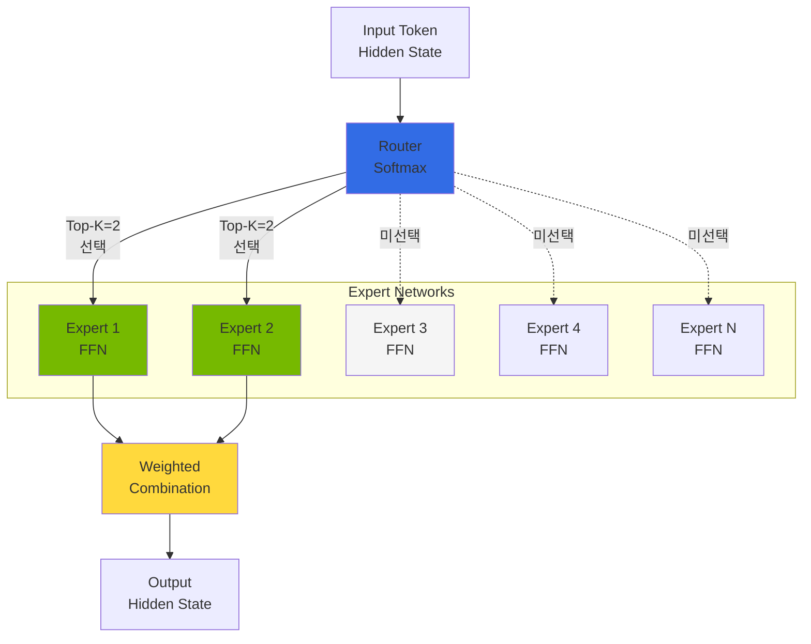
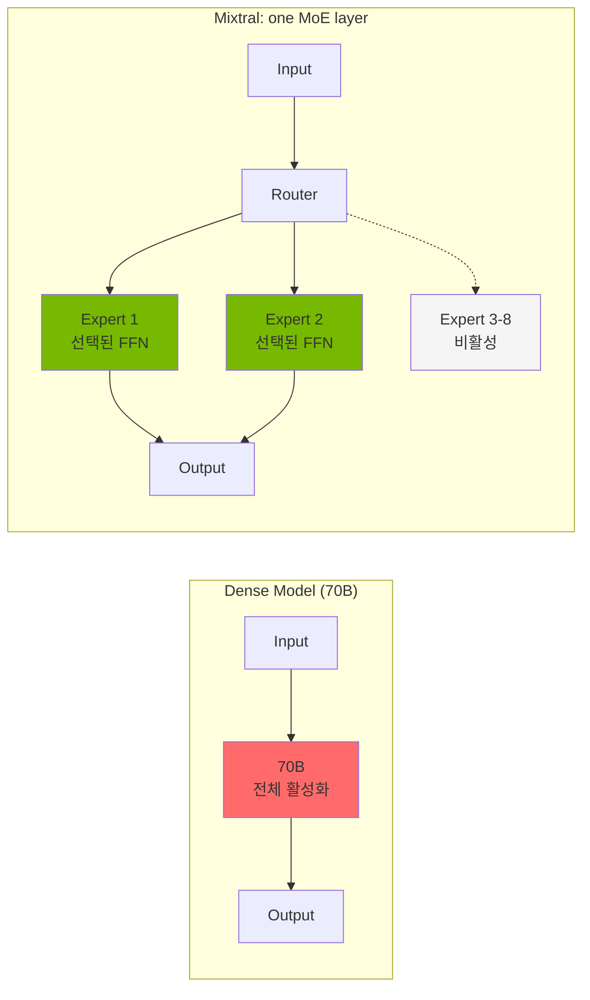
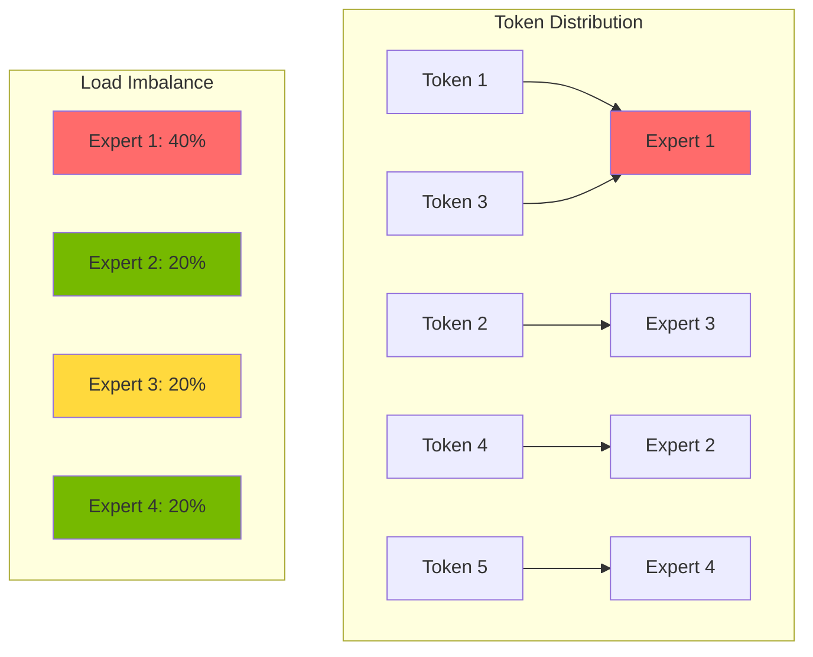
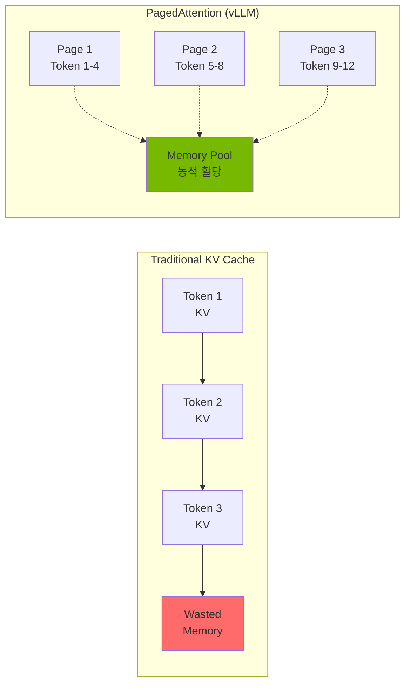
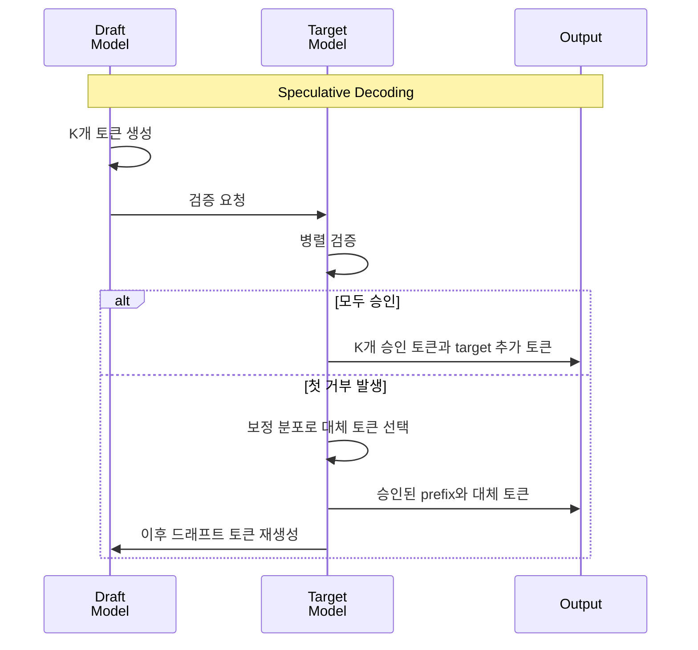

import { GpuMemoryRequirements, ParallelizationStrategies } from '@site/src/components/MoeModelTables';

> **기준 버전**: vLLM v0.25.0 (2026-07-11 릴리스). 아래 vLLM 기능·옵션·메트릭 설명은 이 버전을 기준으로 합니다.

## 개요

Mixture of Experts(MoE) 모델은 여러 Expert 네트워크 가운데 일부를 Router가 골라 토큰을 처리하는 구조입니다. 전체 Expert를 매번 계산하지 않으므로 토큰당 연산량을 줄일 수 있습니다. 다만 적은 연산으로 어느 정도의 품질을 얻는지는 모델과 과제에 따라 평가해야 합니다. 활성 Expert 수가 적어도 전체 가중치를 저장할 메모리는 별도로 계산해야 합니다.

이 문서에서는 MoE 아키텍처의 핵심 개념, 모델별 리소스 요구사항, 분산 배포 전략을 다룹니다.

:::tip 실전 배포 가이드
MoE 모델의 EKS 배포 YAML, helm 명령어, 멀티노드 구성 등 실전 배포는 [커스텀 모델 배포 가이드](../../reference-architecture/model-lifecycle/custom-model-deployment.md)를 참조하세요.
:::

---

## MoE 아키텍처 이해

### Expert 네트워크 구조

MoE 모델은 여러 개의 "Expert" 네트워크와 이를 선택하는 "Router(Gate)" 네트워크로 구성됩니다.



### 라우팅 메커니즘

MoE 모델의 핵심은 입력 토큰에 따라 적절한 Expert를 선택하는 라우팅 메커니즘입니다.

| 방식 | 선택 단위와 동작 | 예시·근거 |
|------|------------------|-----------|
| Token-choice Top-K | 각 토큰이 Router 점수가 높은 K개 Expert를 선택 | [Mixtral은 K=2](https://arxiv.org/html/2401.04088v1), [Switch Transformer는 K=1](https://arxiv.org/html/2101.03961v3) |
| Expert Choice | 각 Expert가 정해진 수용량 안에서 점수가 높은 토큰을 선택. 토큰마다 선택되는 Expert 수가 달라질 수 있음 | [Expert Choice Routing 논문](https://arxiv.org/abs/2202.09368) |
| Soft MoE | 입력 토큰들의 가중 조합을 slot으로 만들어 Expert에 전달하고, Expert 출력을 다시 결합 | [Soft MoE 논문](https://arxiv.org/abs/2308.00951)의 구조이며 Top-K 토큰 선택과 다름 |
| Hash Routing | 학습된 Router 대신 토큰 등의 입력 특성을 해시하여 가중치 집합에 배정 | [Hash Layers 논문](https://arxiv.org/abs/2106.04426) |

:::info 라우팅 동작 원리

다음 단계는 위 그림의 **token-choice Top-K** 방식에 해당합니다.

1. **Gate 계산**: 입력 토큰의 hidden state로 Expert별 점수를 계산
2. **Expert 선택**: 점수가 높은 K개 Expert를 선택
3. **Expert 계산**: 선택된 FFN이 입력을 처리. 실제 병렬 실행 방식은 엔진과 장치 배치에 따라 결정
4. **가중 합산**: 선택된 Expert의 출력을 라우팅 가중치로 결합

:::

### MoE vs Dense 모델 비교

| 비교 항목 | Dense | MoE |
|-----------|-------|-----|
| 파라미터 활성화 | Dense 레이어의 가중치를 토큰마다 사용 | 공유 레이어와 선택된 Expert의 가중치를 사용. 활성 비율은 모델마다 다름 |
| 토큰당 연산량 | 레이어 크기·구조·시퀀스 길이에 따라 결정 | 전체 Expert를 매번 계산하지 않지만 Router·통신 비용이 추가됨 |
| 가중치 메모리 | 전체 가중치 크기와 저장 정밀도로 계산 | 비활성 Expert도 보관해야 하므로 전체 가중치로 계산. Offload는 별도 전송 비용을 수반 |
| 학습 | 데이터·연산 예산에 맞춰 모델 크기를 선택 | Expert 수뿐 아니라 라우팅과 부하 균형을 함께 학습해야 함 |
| 확장 | 레이어 폭·깊이 등을 늘려 용량을 확장 | Expert 수를 늘리면 용량을 확장할 수 있지만 학습·메모리·통신 설계도 바뀜 |

예를 들어 [Mixtral 8x7B](https://arxiv.org/html/2401.04088v1)의 활성 비율은 12.9B / 46.7B ≈ **27.6%**입니다. 아래 모델 카드 기준 GLM-5는 40B / 744B ≈ **5.4%**, Kimi K2.5는 32B / 1,000B = **3.2%**입니다. 이 비율은 가중치 메모리 절감률이나 실측 처리량을 뜻하지 않습니다.

Mixtral의 약 47B 전체 / 13B 활성 파라미터는 **모델 전체**의 값입니다. 아래 오른쪽은 한 MoE 레이어에서 8개 FFN 중 2개를 선택하는 개념도이며, 각 Expert가 독립적인 7B 모델이라는 뜻이 아닙니다. 공유 attention 등 나머지 레이어는 생략했습니다.



:::tip MoE 모델의 장점

- **연산 효율성**: 일부 Expert만 계산하므로 같은 전체 파라미터 수의 Dense 구조보다 토큰당 연산량을 줄일 수 있습니다. 실제 속도에는 메모리 접근과 통신도 영향을 줍니다.
- **확장성**: Expert 수를 늘려 용량을 확장할 수 있지만, 그에 맞는 학습과 라우팅 설계가 필요합니다.
- **전문화**: 라우팅은 학습되지만 Expert가 특정 도메인 담당으로 분리된다고 보장할 수 없습니다. [Mixtral 분석](https://arxiv.org/html/2401.04088v1)에서는 뚜렷한 주제별 Expert 배정 패턴을 찾지 못했습니다.

:::

---

## GPU 메모리 요구사항

MoE는 토큰마다 일부 Expert만 계산해도 전체 가중치를 보관할 공간이 필요합니다. 가중치를 모두 GPU에 둘지, 일부를 다른 메모리로 offload할지에 따라 GPU 메모리와 전송 비용이 달라집니다.

<GpuMemoryRequirements />

:::info 가중치 크기와 서빙 메모리를 구분하세요

표는 전체 파라미터 수에 2, 1, 0.5 byte를 곱한 **가중치만의 산술 추정**입니다. B는 10억 파라미터, GB는 10⁹ byte이며 GiB와 다릅니다. 8-bit는 INT8/FP8의 저장 폭을, 4-bit는 이상적인 패킹 크기를 나타냅니다. 해당 정밀도의 체크포인트나 서빙 엔진 지원을 보장하지 않습니다.

- **DeepSeek-V3**: 본체 671B를 16-bit로 저장하면 약 1,342GB, 8-bit로 저장하면 약 671GB입니다. [공식 모델 설명](https://github.com/deepseek-ai/DeepSeek-V3#2-model-summary)의 전체 체크포인트는 MTP 모듈 14B를 포함한 685B입니다. MLA는 KV 캐시를 줄이며, 같은 정밀도의 가중치 크기를 줄이지 않습니다.
- **GLM-5**: [모델 카드](https://huggingface.co/zai-org/GLM-5)는 총 744B / 활성 40B를 명시합니다. 744GB는 이상적인 8-bit 가중치 크기로, 전체 VRAM 요구량이 아닙니다.
- **Kimi K2.5**: [모델 카드](https://huggingface.co/moonshotai/Kimi-K2.5)는 총 1T / 활성 32B와 native INT4를 명시합니다. 약 500GB는 이상적인 4-bit 크기이며, 8-bit 추정치는 약 1,000GB입니다. 실제 체크포인트에는 양자화 메타데이터와 다른 정밀도의 텐서가 포함될 수 있습니다.

:::

:::warning GPU 수는 가중치 표만으로 결정할 수 없습니다

체크포인트 revision, 가중치·KV 캐시 정밀도, 엔진 버전, 병렬화 방식을 고정한 뒤 최대 컨텍스트와 동시 요청 수로 측정하세요. KV 캐시, 활성화 값, CUDA graph·통신 버퍼, 런타임 메모리, 복제되는 텐서를 포함해야 합니다. 총 HBM뿐 아니라 **가장 메모리를 많이 쓰는 rank**의 여유를 확인하세요. 여기서는 특정 GPU 수나 단일 노드 수용 가능성을 검증된 구성으로 제시하지 않습니다.

:::

---

## 분산 배포 전략

선택한 정밀도의 가중치와 KV 캐시·런타임 메모리가 한 GPU의 가용 메모리를 넘으면 병렬 분할이나 offload 같은 메모리 전략이 필요합니다. 분산 배포 여부는 활성 파라미터 수가 아니라 이 전체 예산과 목표 부하로 결정합니다.


<ParallelizationStrategies />

병렬화는 가중치와 연산을 나누는 방법입니다. 같은 요청 분포에서 rank별 메모리, 연산·통신 시간, TTFT·ITL·처리량을 측정해 후보 구성을 비교합니다.

### Tensor Parallelism 구성

텐서 병렬화(Tensor Parallelism)는 모델의 각 레이어를 여러 GPU에 분할합니다.

다음은 BF16 가중치를 N개 rank에 **균등하게 나눈다고 가정한 산술 예시**입니다. N은 권장 GPU 수나 지원되는 TP 설정을 뜻하지 않습니다. 실제 TP에서는 복제되는 텐서, 분할 제약, rank별 편차와 가중치 외 메모리를 더 확인해야 합니다.

| 모델 | 전체 파라미터 | BF16 가중치만 (GB) | 가정한 rank 수 N | 가중치/N (GB/rank) |
|------|---------------|-------------------|-----------------|--------------------|
| Mixtral 8x7B | 46.7B | 93.4 | 2 | 46.7 |
| Mixtral 8x22B | 141B | 282 | 4 | 70.5 |
| DeepSeek-MoE 16B | 16.4B | 32.8 | 1 | 32.8 |
| DBRX | 132B | 264 | 4 / 8 | 66 / 33 |

예를 들어 70.5GB/rank라는 값만으로 80GB GPU에 서빙 구성이 들어간다고 결론 내릴 수 없습니다. 실제 최대 부하에서 가장 메모리를 많이 쓰는 rank를 확인하세요.

:::tip 텐서 병렬화 최적화

- **NVLink 활용**: 선택한 GPU 사이에 실제 NVLink 연결이 있는지 확인하고, TP 통신 경로를 점검합니다.
- **TP 크기 선택**: 모델의 분할 제약과 rank별 메모리를 만족하는 후보를 비교합니다.
- **통신 오버헤드**: TP를 늘리면 rank당 가중치는 줄어들 수 있지만 집단 통신 비용이 달라집니다. 토폴로지와 부하를 고정해 TTFT·처리량을 비교합니다.

:::

### Expert Parallelism

Expert 병렬화(Expert Parallelism)는 Expert 가중치를 GPU rank별로 나누는 방식입니다. [vLLM v0.25.0의 EP 문서](https://github.com/vllm-project/vllm/blob/v0.25.0/docs/serving/expert_parallel_deployment.md)는 **`--enable-expert-parallel`을 명시적으로 설정**하도록 합니다. TP 크기만 지정하면 EP가 자동으로 켜지지 않습니다.

EP를 켜면 MoE 레이어의 EP 크기는 `TP × DP`입니다. 예를 들어 `--tensor-parallel-size 2`, `--data-parallel-size 4`, `--enable-expert-parallel`은 MoE 레이어에 8개 EP rank를 구성하고 attention은 4개 DP 그룹 안에서 각각 TP=2로 분할합니다. TP=1이면 attention 가중치는 DP rank마다 복제됩니다. 이는 옵션의 의미를 설명하는 예이며 특정 체크포인트의 8-GPU 수용 가능성을 입증하지 않습니다. 해당 버전은 EP를 experimental로 표시하므로 모델·커널·통신 backend 제약도 함께 확인하세요.

### Expert 활성화 패턴

아래는 토큰 5개가 Expert 하나씩을 선택하는 **Top-1 산술 예시**입니다. Expert별 토큰 수는 2·1·1·1개이므로 비율은 40%·20%·20%·20%입니다. Mixtral의 Top-2 라우팅이나 실측 부하 분포를 나타내지 않습니다.



:::info Expert 로드 밸런싱

- **Auxiliary Loss**: 일부 모델은 학습 시 보조 손실을 사용해 Expert 간 부하를 분산합니다.
- **Capacity Factor**: 용량 제한을 쓰는 라우팅에서는 배치 크기와 Expert 수를 기준으로 Expert당 수용할 토큰 수를 정합니다.
- **Token Dropping**: 용량을 넘은 토큰이 해당 Expert 계산을 건너뛰는 학습 방식이 있습니다. 클라이언트 요청의 토큰을 삭제한다는 뜻은 아닙니다. 모델과 엔진의 overflow 처리 방식을 확인해야 하며, 모든 추론 엔진에 공통인 비활성화 옵션이 있다고 가정하지 않습니다. [Switch Transformer](https://arxiv.org/html/2101.03961v3)와 [Expert Choice](https://arxiv.org/abs/2202.09368)의 용량·선택 방식도 다릅니다.

:::

### 700B+ MoE 모델 멀티노드 배포 개념

멀티노드 필요 여부는 파라미터 수만으로 결정되지 않습니다. 체크포인트의 정밀도, 노드당 가용 HBM, KV 캐시 예산, 목표 동시성을 함께 확인해야 합니다. Kimi K2.5의 이상적인 INT4 가중치 크기만으로 단일 노드 수용 가능성이나 멀티노드 필수 여부를 단정할 수 없습니다.

1. 실제 체크포인트 파일과 엔진의 로드 후 메모리를 확인합니다. 가중치 산술 추정은 위 표를 사용합니다.
2. 엔진과 모델이 지원하는 TP·PP·EP 조합을 선택하고, 레이어 또는 Expert 분할의 제약을 확인합니다.
3. 노드 사이 통신 경로와 대역폭을 점검합니다. 총 GPU 메모리가 충분해도 통신이 병목이 될 수 있습니다.
4. 최대 컨텍스트·동시 요청 부하에서 rank별 peak 메모리, TTFT, 처리량을 측정하고 구성과 결과를 함께 기록합니다.

LeaderWorkerSet 같은 배포 도구는 분산 워커의 배치를 관리합니다. 도구를 사용한다는 사실 자체가 특정 모델의 메모리 수용 가능성이나 성능을 보장하지는 않습니다.

:::warning 멀티노드 배포 주의사항

- **네트워크 대역폭**: TP의 집단 통신과 EP의 토큰 dispatch/combine 경로를 구분하고, EFA 등을 사용하는 backend의 인스턴스·드라이버 요구사항을 확인합니다.
- **로딩 시간**: 체크포인트 크기, 저장소 처리량, 병렬 로더와 컴파일 여부를 고정해 초기 로딩 시간을 측정합니다.
- **메모리 여유**: 최대 컨텍스트·동시성과 재계산 상황에서 rank별 peak 메모리를 측정해 여유를 정합니다.
- **LeaderWorkerSet CRD**: LWS 방식으로 배포할 때 해당 Operator와 CRD가 필요합니다. 모든 멀티노드 서빙의 필수 조건은 아닙니다.

:::

---

## vLLM 기반 MoE 서빙 기능

아래 기능은 vLLM v0.25.0의 설명입니다. 실제 적용 조합은 모델 아키텍처, 체크포인트, 가속기와 backend에 따라 달라집니다.

- **Expert Parallelism**: 명시적으로 활성화하면 Expert 가중치를 여러 rank로 분산
- **Tensor Parallelism**: 지원되는 레이어 텐서를 rank별로 분할
- **PagedAttention**: KV 캐시를 블록 단위로 관리
- **Continuous Batching**: 완료된 요청을 빼고 대기 요청을 처리 배치에 추가
- **FP8 KV Cache**: FP16/BF16 KV 원소를 8-bit로 저장하면 해당 데이터의 저장 폭은 절반이 됩니다. 전체 가중치나 전체 VRAM이 절반이 되는 것은 아니며, scale과 정확도·attention backend를 확인해야 합니다. [KV 양자화 문서](https://github.com/vllm-project/vllm/blob/v0.25.0/docs/features/quantization/quantized_kvcache.md)
- **Automatic Prefix Caching**: 재사용 가능한 prefix의 KV 블록이 cache에 남아 있을 때 중복 prefill 계산을 줄입니다. Decode를 생략하거나 고정된 처리량 향상을 보장하지 않습니다. [APC 문서](https://github.com/vllm-project/vllm/blob/v0.25.0/docs/features/automatic_prefix_caching.md)
- **Multi-LoRA Serving**: 지원되는 기본 모델과 target module에서 여러 어댑터를 서빙합니다. 해당 MoE 아키텍처의 LoRA 지원과 병렬화·양자화 조합을 확인해야 합니다. [LoRA 문서](https://github.com/vllm-project/vllm/blob/v0.25.0/docs/features/lora.md)
- **GGUF Quantization**: 해당 버전에서 experimental·under-optimized로 설명되며 다른 기능과의 호환성 제약이 있습니다. 모든 MoE 모델이 GGUF로 서빙된다는 의미가 아닙니다. [GGUF 문서](https://github.com/vllm-project/vllm/blob/v0.25.0/docs/features/quantization/gguf.md)

:::warning TGI 유지보수 모드
[TGI 공식 저장소](https://github.com/huggingface/text-generation-inference/blob/main/README.md)는 2026-09-19 확인 시 유지보수 모드이며, 작은 버그 수정·문서·가벼운 유지보수를 받는다고 설명합니다. 새 배포에서는 유지보수 범위와 모델 지원을 고려해 엔진을 선택하세요. OpenAI 호환 endpoint가 있어도 요청 옵션, chat template, streaming, 오류 응답이 완전히 같지는 않을 수 있으므로 마이그레이션 전에 클라이언트 계약을 검증해야 합니다.
:::

### vLLM vs TGI 성능 비교

성능 순위는 같은 모델 revision·정밀도·입출력 길이·동시성·하드웨어를 고정한 측정으로 판단합니다. 아래는 vLLM v0.25.0과 검토 대상 TGI 릴리스를 비교할 때 기록할 항목입니다.

| 비교 항목 | 확인할 근거와 측정 |
|-----------|-------------------|
| 처리량 | 품질·지연 SLO를 만족한 출력 토큰 수와 측정 시간을 기록 |
| TTFT | 동일 요청 분포에서 첫 토큰 지연의 백분위수와 오류율을 기록 |
| 메모리 | 같은 context·동시성에서 peak HBM을 측정. TGI도 PagedAttention을 사용하므로 기능 이름만으로 우열을 정하지 않음 |
| MoE·병렬화 | 모델 아키텍처와 checkpoint를 두 엔진이 지원하는지, TP·EP 조합과 kernel 제약을 확인 |
| 양자화 | 포맷 이름뿐 아니라 모델·장치·kernel과 해당 릴리스의 호환성을 확인 |
| API | 사용 중인 endpoint, sampling 옵션, chat template, streaming, 오류 처리를 계약 테스트로 비교 |
| 유지보수 | vLLM은 위에 고정한 릴리스를 기준으로 검토. TGI는 공식 저장소에 명시된 유지보수 범위를 반영 |

근거: [vLLM v0.25.0 양자화 문서](https://github.com/vllm-project/vllm/blob/v0.25.0/docs/features/quantization/README.md), [TGI의 기능 및 유지보수 설명](https://github.com/huggingface/text-generation-inference/blob/main/README.md). 이 표에는 두 엔진의 비교 실행 결과가 없습니다.

---

## AWS Trainium2 기반 MoE 추론

AWS Trainium2와 Inferentia2는 Neuron 소프트웨어 스택을 사용하는 가속기입니다. GPU 대신 검토할 때는 목표 모델의 Neuron 구현, 체크포인트 형식, 컴파일·병렬화 제약을 먼저 확인해야 합니다. NxD Inference나 vLLM Neuron backend를 사용한다는 사실만으로 모든 MoE 모델 지원이나 더 낮은 토큰당 비용이 보장되지는 않습니다.

### 요약

| 항목 | 개요 |
|------|------|
| 하드웨어 | trn2.48xlarge는 Trainium2 16칩. 칩당 물리 NeuronCore-v3 8개로 인스턴스당 128개이며, 기본 LNC=2에서는 논리 NeuronCore 64개로 노출 |
| LNC 설정 | LNC=1이면 인스턴스당 논리 core 128개. 컴파일과 runtime의 LNC 설정이 일치해야 함 |
| SDK·프레임워크 | Neuron SDK, compiler, runtime, NxD Inference 또는 vLLM Neuron backend 버전을 함께 고정 |
| 정밀도·양자화 | 칩의 dtype 연산 지원과 특정 checkpoint 포맷의 엔진 지원은 별개. 사용할 모델·backend·장치의 지원 조합을 확인 |
| 모델 | DBRX, Mixtral, Llama 4 같은 이름만으로 배포 가능성을 판단하지 않고 정확한 아키텍처·revision과 해당 프레임워크의 모델 지원 문서를 대조 |

물리·논리 core 구분과 설정 조건은 [Neuron LNC 문서](https://awsdocs-neuron.readthedocs-hosted.com/en/latest/about-neuron/arch/neuron-features/logical-neuroncore-config.html) 기준입니다. Inferentia2에는 이 Trainium2 core 수나 LNC 설정을 그대로 적용하지 않습니다.

### GPU vs Trainium2 비용 비교

먼저 비용을 비교하는 하드웨어 단위를 구분합니다. HBM 수치는 [Neuron 아키텍처 문서](https://awsdocs-neuron.readthedocs-hosted.com/en/latest/about-neuron/arch/neuron-hardware/trn2-arch.html)의 **GiB** 표기를 사용하며, UltraServer는 단일 인스턴스의 별칭이 아닙니다.

| 비교 단위 | 가속기 구성 | Neuron 문서의 device memory | EFA 네트워크 사양 |
|-----------|-------------|----------------------------|------------------|
| trn2.48xlarge 1대 | Trainium2 16칩 | 1,536GiB | 3,200Gbps/인스턴스 |
| Trn2 UltraServer 1대 | trn2u.48xlarge 4대, 총 64칩 | 6,144GiB/UltraServer | [EC2 제품 문서](https://aws.amazon.com/ec2/instance-types/trn2/)의 UltraServer 합계 12,800Gbps |

표의 대역폭은 제품 사양이며 애플리케이션에서 측정한 전송량이 아닙니다. HBM도 모든 프로세스가 제약 없이 사용할 수 있는 단일 GPU 메모리를 뜻하지 않습니다.

:::info 사양 확인이 남아 있는 항목
2026년 9월 19일 확인한 [EC2 인스턴스 사양 표](https://docs.aws.amazon.com/ec2/latest/instancetypes/ac.html)는 trn2.48xlarge의 가속기 메모리를 8,192GiB로, trn2u.48xlarge는 가속기 없음으로 표시하여 위 Neuron 문서와 다릅니다. Neuron의 UltraServer 네트워크 표에는 3,200Gbps가 표시되지만 EC2 제품 페이지는 4대 합계 12.8Tbps를 제시합니다. 위 표는 출처별 값을 구분해 적은 것이며, 이 차이가 해소된 사양으로 간주하지 않습니다. 용량이나 비용 산정에 사용하기 전에 대상 구성의 사양을 확인해야 합니다.
:::

| 비용 비교 후보 | 비교 시 고정·기록할 조건 |
|----------------|-------------------------|
| p5.48xlarge (H100 8개) | 모델 revision, 정밀도, context·동시성, GPU 엔진·kernel, 병렬화 |
| p4d.24xlarge (A100 8개) | 같은 조건에서의 수용 가능성, 품질, 지연 SLO와 성공 출력 토큰 수 |
| trn2.48xlarge 또는 Trn2 UltraServer | 위 조건과 Neuron 버전·컴파일 설정·LNC, 실제 청구된 인스턴스 수 |

측정 구간 비용에는 region·구매 옵션·측정 날짜별 요율과 사용 시간, 포함한 저장소·네트워크 등의 범위를 기록합니다. **백만 출력 토큰당 비용 = 측정 구간 비용 × 1,000,000 / 품질·지연 조건을 만족한 출력 토큰 수**로 비교합니다. 분모가 0이면 비용/토큰을 산출할 수 없습니다. 시간당 가격 차이만으로 78% 또는 34%의 추론 비용 절감률을 도출할 수 없으며, 여기에는 그 절감률을 검증한 실행 결과가 없습니다.

:::info 상세 가이드는 별도 문서 참조
Neuron SDK 아키텍처, 인스턴스 라인업, Device Plugin 배포, Karpenter NodePool, 추론 프레임워크(NxD / vLLM Neuron / TGI Neuron) 비교, 지원 모델 매트릭스, 관측성, 한계 및 주의사항은 아래 전용 문서에서 다룹니다.

→ **[AWS Neuron Stack — Trainium2/Inferentia2 on EKS](../gpu-infrastructure/aws-neuron-stack.md)**

노드 선택 단계의 NVIDIA vs Neuron 의사결정은 [EKS GPU 노드 전략](../gpu-infrastructure/eks-gpu-node-strategy.md#aws-가속기-선택-가이드--nvidia-vs-neuron) 을 참조하세요.
:::

---

## 성능 최적화 개념

### KV Cache 최적화

KV Cache는 추론 성능에 큰 영향을 미치는 핵심 요소입니다.



| vLLM v0.25.0 옵션 | 의미와 조정 기준 |
|------------------|------------------|
| `--gpu-memory-utilization` | 현재 vLLM 인스턴스의 model executor에 할당할 GPU 메모리 비율. 전체 GPU 사용률 측정값이나 여러 프로세스 사이의 예약 기능이 아님 |
| `--kv-cache-memory-bytes` | GPU당 KV cache byte 예산을 직접 지정. 설정하면 KV 예산 계산에서 `gpu-memory-utilization`을 대신함 |
| `--max-model-len` | 입력과 출력을 합한 요청의 최대 길이. 모델의 context 한계와 KV 예산 안에서 결정 |
| `--max-num-batched-tokens` | 한 scheduling iteration에서 처리할 토큰 예산. 긴 prefill과 decode 사이의 TTFT·ITL 절충에 영향 |
| `--enable-chunked-prefill` | 긴 prefill을 나누어 decode와 함께 배치. V1은 가능한 경우 기본 활성화하므로 실제 모델에서의 설정을 확인 |

고정된 메모리 비율을 모든 MoE 배포의 권장값으로 쓰지 않습니다. [cache 설정 정의](https://github.com/vllm-project/vllm/blob/v0.25.0/vllm/config/cache.py)와 [V1 tuning 문서](https://github.com/vllm-project/vllm/blob/v0.25.0/docs/configuration/optimization.md)를 기준으로 peak 메모리·재계산 횟수·TTFT·ITL을 함께 확인하세요.

### Speculative Decoding

아래는 작은 드래프트 모델이 제안한 토큰을 target 모델이 검증하는 Speculative Decoding 개념도입니다. 승인된 prefix 뒤에 검증 결과에 맞는 토큰을 출력하며, 첫 거부 이후의 드래프트 토큰은 다시 생성합니다. 처리량 이득은 드래프트 계산 비용과 승인율, 배치·부하에 따라 달라집니다.



:::info Speculative Decoding 효과

- **속도 향상**: 고정 배수를 전제하지 않고 같은 부하에서 TTFT·ITL·처리량과 승인율을 측정합니다. 드래프트 비용이 절약한 target 계산보다 크면 이득이 없을 수 있습니다.
- **출력 분포**: 올바른 speculative sampling은 target 분포를 보존하도록 설계됩니다. [vLLM의 losslessness 설명](https://github.com/vllm-project/vllm/blob/v0.25.0/docs/features/speculative_decoding/README.md)은 부동소수점·배치 변화와 logprob 불안정성에 따른 차이를 구분합니다. 실행마다 동일 문자열·logprob를 보장한다는 뜻은 아닙니다.
- **추가 메모리**: 별도 드래프트 모델을 쓰면 해당 가중치뿐 아니라 KV 캐시·runtime 메모리도 예산에 포함합니다. 선택한 speculation 방식과 모델 지원을 확인합니다.

:::

### 배치 처리 최적화

| 기법 | 동작 | 비교할 지표·범위 |
|------|------|------------------|
| Continuous Batching | 완료된 요청을 빼고 대기 요청을 다음 처리 배치에 추가 | 같은 부하에서 처리량·대기 시간·오류율을 비교. 보편적인 2–3배 향상률은 없음 |
| Chunked Prefill | 긴 prefill을 token budget 안에서 나누어 decode와 함께 배치 | TTFT와 ITL의 절충을 측정. vLLM v0.25.0의 `max-num-batched-tokens` 설정과 함께 조정 |
| Dynamic SplitFuse | Prompt와 generation 작업을 나누고 합치는 [DeepSpeed-FastGen의 방식](https://arxiv.org/abs/2401.08671) | vLLM의 별도 옵션으로 제시하지 않음. 엔진 간 측정 결과를 그대로 전용할 수 없음 |

vLLM의 실제 scheduling 동작은 [해당 버전의 tuning 문서](https://github.com/vllm-project/vllm/blob/v0.25.0/docs/configuration/optimization.md)를 참조하세요.

---

## 모니터링 메트릭

### 주요 모니터링 메트릭

아래 vLLM 이름은 [v0.25.0 V1 exporter 정의](https://github.com/vllm-project/vllm/blob/v0.25.0/vllm/v1/metrics/loggers.py)를 기준으로 합니다. 배포한 `/metrics`의 실제 series·label을 확인하고, `model_name`·`engine` 구분을 보존한 뒤 집계 범위를 정하세요.

| 메트릭·PromQL | 단위·해석 |
|----------------|-----------|
| `vllm:num_requests_running` | 현재 실행 중인 요청 수 (gauge) |
| `vllm:num_requests_waiting` | 대기 요청 수 (gauge) |
| `vllm:kv_cache_usage_perc` | KV cache 사용 비율 0–1. `0.95`가 95%이며, vLLM executor의 cache 기준 |
| `rate(vllm:prompt_tokens_total[5m])` | Exporter가 센 prompt token의 초당 증가율. Cache·여러 engine 집계 의미를 확인 |
| `rate(vllm:generation_tokens_total[5m])` | Exporter가 센 generation token의 초당 증가율 |
| `DCGM_FI_DEV_GPU_UTIL` | GPU utilization 백분율. 단독으로 지연 SLO 위반을 뜻하지 않음 |
| `DCGM_FI_DEV_FB_USED`, `DCGM_FI_DEV_FB_FREE` | 각각 사용·여유 framebuffer 메모리 **MiB**. `FB_USED` 자체는 백분율이 아님 |

[DCGM exporter의 단위 정의](https://github.com/NVIDIA/dcgm-exporter/blob/main/etc/default-counters.csv)에 따라, 같은 GPU/MIG 식별자와 scrape label을 가진 유효한 used/free series로 비율을 계산합니다. 다음 PromQL은 **used/(used+free)가 0.95를 넘는지** 보는 예입니다. Reserved 메모리는 이 분모에 포함되지 않으며 총 물리 HBM 대비 비율과 구분해야 합니다.

```promql
(
  DCGM_FI_DEV_FB_USED
  / (DCGM_FI_DEV_FB_USED + DCGM_FI_DEV_FB_FREE)
) > 0.95
and
(DCGM_FI_DEV_FB_USED + DCGM_FI_DEV_FB_FREE) > 0
```

이 식은 두 series의 label 집합이 일치한다고 가정합니다. 누락·비정상 collector 값은 먼저 점검하고, 여러 GPU의 used와 free를 서로 다른 범위로 합산하지 마세요. 위 5분 rate 구간과 0.95 기준은 운영 환경에 맞게 평가할 예시입니다.

알림은 부하 시험에서 정한 SLO·지속 시간과 함께 구성합니다. 아래는 조사 방향이며 자동 장애 판정이나 scale-out 규칙이 아닙니다.

| 관측 | 확인할 내용 |
|------|-------------|
| P95 응답 지연 증가 | TTFT와 decode 시간을 나누고 입출력 길이·오류율·대기 시간을 함께 확인 |
| KV cache 비율이 높음 | [V1의 preemption·재계산](https://github.com/vllm-project/vllm/blob/v0.25.0/docs/configuration/optimization.md)과 지연 영향을 확인. 특정 비율만으로 새 요청 거부를 단정하지 않음 |
| 대기 요청 증가 | 유입률, 요청 길이, 처리율, 동시성 제한과 장치 여유를 확인한 뒤 용량·scheduling 변경을 선택 |

---

## 요약

### 핵심 포인트

1. 활성 파라미터 수로 GPU 용량을 계산하지 않습니다. 전체 가중치, KV 캐시, 런타임 할당과 offload 구성을 함께 봅니다.
2. TP 크기만 설정하면 EP가 켜지지 않습니다. 선택한 모델과 엔진 버전에서 지원하는 병렬화 조합을 확인합니다.
3. GPU 수는 전체 HBM의 합계가 아니라 가장 메모리를 많이 쓰는 rank의 최대 부하를 기준으로 정합니다.
4. 추론 엔진은 모델·정밀도·장치 지원과 API 동작을 확인한 뒤, 같은 요청 분포와 품질·지연 목표로 비교합니다.
5. 캐시, 배치 처리, speculative decoding은 각각 측정해 적용합니다. 처리량이 늘어도 지연이나 오류율이 목표를 벗어나면 개선으로 판단하지 않습니다.

### 다음 단계

- [GPU 리소스 관리](../gpu-infrastructure/gpu-resource-management.md) - GPU 클러스터 동적 리소스 할당
- [Inference Gateway 라우팅](../../model-serving/inference-routing/routing-strategy.md) - 다중 모델 라우팅 전략
- [Agentic AI 플랫폼 아키텍처](../../design-architecture/foundations/agentic-platform-architecture.md) - 전체 플랫폼 구성

---

## 참고 자료

- [vLLM 공식 문서](https://docs.vllm.ai/)
- [Mixtral 모델 카드](https://huggingface.co/mistralai/Mixtral-8x7B-Instruct-v0.1)
- [MoE 아키텍처 논문](https://arxiv.org/abs/2101.03961)
- [PagedAttention 논문](https://arxiv.org/abs/2309.06180)
