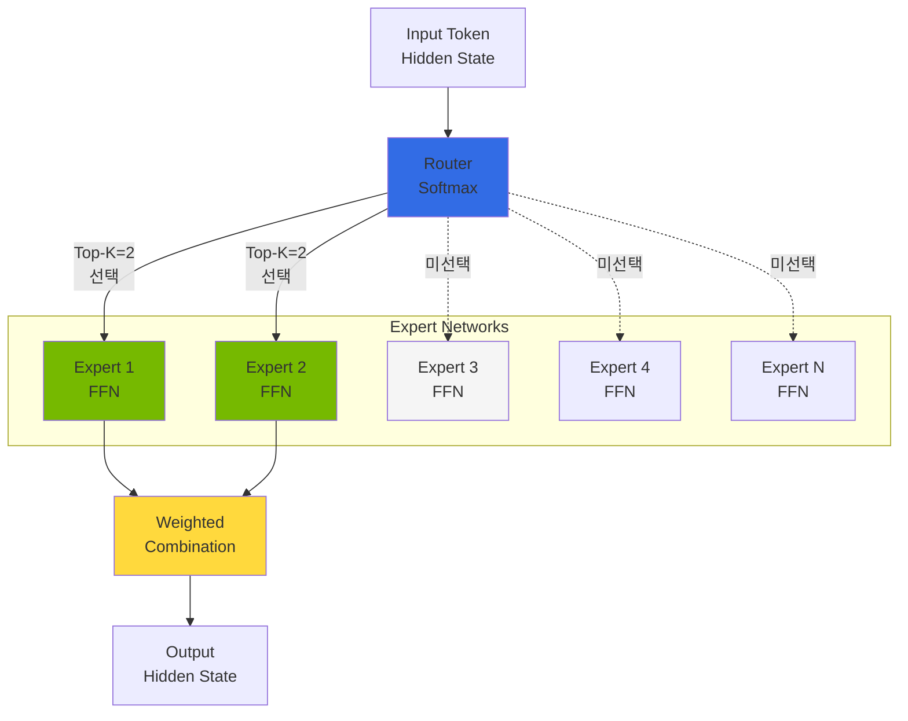
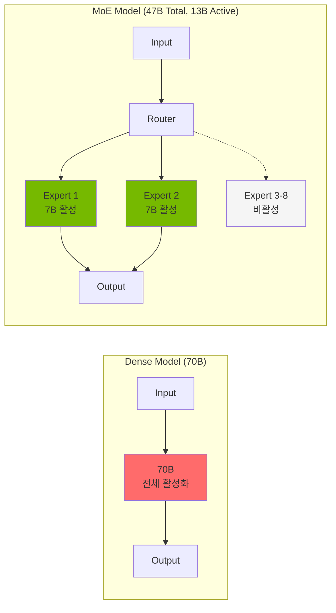
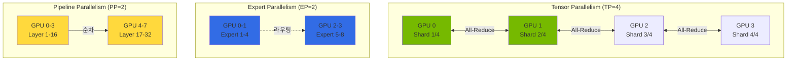
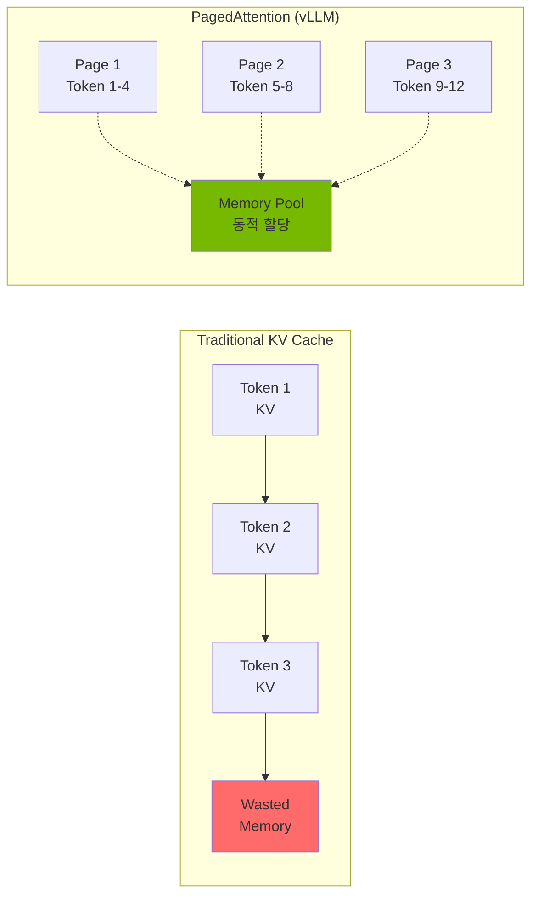
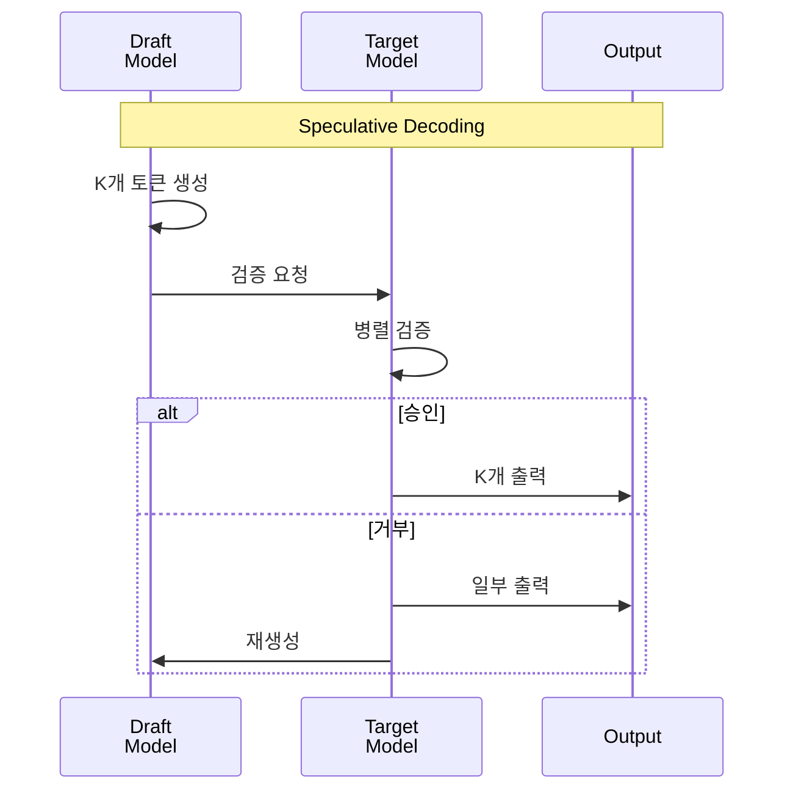

import { RoutingMechanisms, MoeVsDense, GpuMemoryRequirements, ParallelizationStrategies, TensorParallelismConfig, VllmVsTgi, KvCacheConfig, BatchOptimization, MonitoringMetrics, GpuVsTrainium2 } from '@site/src/components/MoeModelTables';

> **현재 버전**: vLLM v0.24+ / v0.25.x (2026-07 기준)

## 개요

Mixture of Experts(MoE) 모델은 여러 Expert 네트워크 가운데 일부를 Router가 골라 토큰을 처리하는 구조입니다. 전체 Expert를 매번 계산하지 않으므로 토큰당 연산량을 줄일 수 있습니다. 다만 적은 연산으로 어느 정도의 품질을 얻는지는 모델과 과제에 따라 평가해야 합니다. 활성 Expert 수가 적어도 전체 가중치를 저장할 메모리는 별도로 계산해야 합니다.

이 문서에서는 MoE 아키텍처의 핵심 개념, 모델별 리소스 요구사항, 분산 배포 전략을 다룹니다.

:::tip 실전 배포 가이드
MoE 모델의 EKS 배포 YAML, helm 명령어, 멀티노드 구성 등 실전 배포는 [커스텀 모델 배포 가이드](../../reference-architecture/model-lifecycle/custom-model-deployment.md)를 참조하세요.
:::

---

## MoE 아키텍처 이해

### Expert 네트워크 구조

MoE 모델은 여러 개의 "Expert" 네트워크와 이를 선택하는 "Router(Gate)" 네트워크로 구성됩니다.

### 라우팅 메커니즘

MoE 모델의 핵심은 입력 토큰에 따라 적절한 Expert를 선택하는 라우팅 메커니즘입니다.

<RoutingMechanisms />

:::info 라우팅 동작 원리

1. **Gate 계산**: 입력 토큰의 hidden state를 Gate 네트워크에 통과
2. **Expert 선택**: Softmax 출력에서 Top-K Expert 선택
3. **병렬 처리**: 선택된 Expert들이 병렬로 입력 처리
4. **가중 합산**: Expert 출력을 Gate 가중치로 결합

:::

### MoE vs Dense 모델 비교

<MoeVsDense />

:::tip MoE 모델의 장점

- **연산 효율성**: 전체 파라미터의 일부만 활성화하여 추론 속도 향상
- **확장성**: Expert 추가로 모델 용량 확장 가능
- **전문화**: 각 Expert가 특정 도메인/태스크에 특화

:::

---

## GPU 메모리 요구사항

MoE 모델은 활성화되는 파라미터는 적지만, 전체 Expert를 메모리에 로드해야 합니다.

<GpuMemoryRequirements />

:::info 가중치 크기와 서빙 메모리를 구분하세요

표는 전체 파라미터 수에 2, 1, 0.5 byte를 곱한 **가중치만의 산술 추정**입니다. B는 10억 파라미터, GB는 10⁹ byte이며 GiB와 다릅니다. 8-bit는 INT8/FP8의 저장 폭을, 4-bit는 이상적인 패킹 크기를 나타냅니다. 해당 정밀도의 체크포인트나 서빙 엔진 지원을 보장하지 않습니다.

- **DeepSeek-V3**: 본체 671B를 16-bit로 저장하면 약 1,342GB, 8-bit로 저장하면 약 671GB입니다. [공식 모델 설명](https://github.com/deepseek-ai/DeepSeek-V3#2-model-summary)의 전체 체크포인트는 MTP 모듈 14B를 포함한 685B입니다. MLA는 KV 캐시를 줄이며, 같은 정밀도의 가중치 크기를 줄이지 않습니다.
- **GLM-5**: [모델 카드](https://huggingface.co/zai-org/GLM-5)는 총 744B / 활성 40B를 명시합니다. 744GB는 이상적인 8-bit 가중치 크기로, 전체 VRAM 요구량이 아닙니다.
- **Kimi K2.5**: [모델 카드](https://huggingface.co/moonshotai/Kimi-K2.5)는 총 1T / 활성 32B와 native INT4를 명시합니다. 약 500GB는 이상적인 4-bit 크기이며, 8-bit 추정치는 약 1,000GB입니다. 실제 체크포인트에는 양자화 메타데이터와 다른 정밀도의 텐서가 포함될 수 있습니다.

:::

:::warning GPU 수는 가중치 표만으로 결정할 수 없습니다

체크포인트 revision, 가중치·KV 캐시 정밀도, 엔진 버전, 병렬화 방식을 고정한 뒤 최대 컨텍스트와 동시 요청 수로 측정하세요. KV 캐시, 활성화 값, CUDA graph·통신 버퍼, 런타임 메모리, 복제되는 텐서를 포함해야 합니다. 총 HBM뿐 아니라 **가장 메모리를 많이 쓰는 rank**의 여유를 확인하세요. 여기서는 특정 GPU 수나 단일 노드 수용 가능성을 검증된 구성으로 제시하지 않습니다.

:::

---

## 분산 배포 전략

대규모 MoE 모델은 단일 GPU에 로드할 수 없어 분산 배포가 필수입니다.

<ParallelizationStrategies />

### Tensor Parallelism 구성

텐서 병렬화(Tensor Parallelism)는 모델의 각 레이어를 여러 GPU에 분할합니다.

<TensorParallelismConfig />

:::tip 텐서 병렬화 최적화

- **NVLink 활용**: GPU 간 고속 통신을 위해 NVLink 지원 인스턴스 사용
- **TP 크기 선택**: 모델 크기와 GPU 메모리에 따라 최소 TP 크기 선택
- **통신 오버헤드**: TP 크기가 클수록 All-Reduce 통신 증가

:::

### Expert Parallelism

Expert 병렬화(Expert Parallelism)는 MoE 모델의 Expert를 여러 GPU에 분산합니다. vLLM v0.22+/v0.23.x에서는 TP 내에서 Expert가 자동으로 분산 배치됩니다.

### Expert 활성화 패턴

MoE 모델의 성능 최적화를 위해 Expert 활성화 패턴을 이해해야 합니다.

:::info Expert 로드 밸런싱

- **Auxiliary Loss**: 학습 시 Expert 간 균등 분배를 유도하는 보조 손실
- **Capacity Factor**: Expert당 처리 가능한 최대 토큰 수 제한
- **Token Dropping**: 용량 초과 시 토큰 드롭 (추론 시 비활성화 권장)

:::

### 700B+ MoE 모델 멀티노드 배포 개념

멀티노드 필요 여부는 파라미터 수만으로 결정되지 않습니다. 체크포인트의 정밀도, 노드당 가용 HBM, KV 캐시 예산, 목표 동시성을 함께 확인해야 합니다. Kimi K2.5의 이상적인 INT4 가중치 크기만으로 단일 노드 수용 가능성이나 멀티노드 필수 여부를 단정할 수 없습니다.

1. 실제 체크포인트 파일과 엔진의 로드 후 메모리를 확인합니다. 가중치 산술 추정은 위 표를 사용합니다.
2. 엔진과 모델이 지원하는 TP·PP·EP 조합을 선택하고, 레이어 또는 Expert 분할의 제약을 확인합니다.
3. 노드 사이 통신 경로와 대역폭을 점검합니다. 총 GPU 메모리가 충분해도 통신이 병목이 될 수 있습니다.
4. 최대 컨텍스트·동시 요청 부하에서 rank별 peak 메모리, TTFT, 처리량을 측정하고 구성과 결과를 함께 기록합니다.

LeaderWorkerSet 같은 배포 도구는 분산 워커의 배치를 관리합니다. 도구를 사용한다는 사실 자체가 특정 모델의 메모리 수용 가능성이나 성능을 보장하지는 않습니다.

:::warning 멀티노드 배포 주의사항

- **네트워크 대역폭**: 노드 간 All-Reduce 통신으로 인한 오버헤드 (EFA 권장)
- **로딩 시간**: 700B+ 모델은 초기 로딩에 20-30분 소요 가능
- **메모리 여유**: Safety margin 10-15% 확보 필요
- **LeaderWorkerSet CRD**: 클러스터에 LWS Operator 설치 필요

:::

---

## vLLM 기반 MoE 서빙 기능

vLLM v0.22+ 버전은 MoE 모델에 대해 다음과 같은 최적화를 제공합니다:

- **Expert Parallelism**: 다중 GPU에 Expert 분산
- **Tensor Parallelism**: 레이어 내 텐서 분할
- **PagedAttention**: 효율적인 KV Cache 관리
- **Continuous Batching**: 동적 배치 처리
- **FP8 KV Cache**: 2배 메모리 절감
- **Improved Prefix Caching**: 400%+ 처리량 향상
- **Multi-LoRA Serving**: 단일 기본 모델에서 여러 LoRA 어댑터 동시 서빙
- **GGUF Quantization**: GGUF 형식 양자화 모델 지원

:::warning TGI 유지보수 모드
Text Generation Inference(TGI)는 2025년부터 유지보수 모드에 진입했습니다. **신규 배포에는 vLLM을 사용하세요.** 기존 TGI에서 마이그레이션 시 vLLM은 OpenAI 호환 API를 제공하므로 클라이언트 코드 변경이 최소화됩니다.
:::

### vLLM vs TGI 성능 비교

<VllmVsTgi />

---

## AWS Trainium2 기반 MoE 추론

AWS Trainium2 / Inferentia2 는 대규모 MoE 모델(DBRX, Mixtral 8x22B, Llama 4 MoE 등)에 대해 GPU 대비 토큰당 비용이 낮은 대안을 제공합니다. Neuron 스택은 Expert Parallelism 과 Tensor Parallelism 을 NeuronCore 단위로 매핑하며, **NxD Inference** 또는 **vLLM Neuron backend** 를 통해 서빙합니다.

### 요약

| 항목 | 개요 |
|------|------|
| 하드웨어 | trn2.48xlarge (Trainium2 16칩 / NeuronCore 128 / HBM 1.5TB), inf2 시리즈 |
| SDK | AWS Neuron SDK 2.x, torch-neuronx, neuronx-cc |
| 추론 프레임워크 | NxD Inference (AWS 공식), vLLM Neuron backend, TGI Neuron fork |
| 양자화 | BF16/FP16/FP8(E4M3/E5M2). AWQ/GPTQ 일부, GGUF 미지원 |
| 적합 MoE | DBRX 132B, Mixtral 8x7B/8x22B, Llama 4 MoE (NxD 지원 범위 내) |

### GPU vs Trainium2 비용 비교

<GpuVsTrainium2 />

:::info 상세 가이드는 별도 문서 참조
Neuron SDK 아키텍처, 인스턴스 라인업, Device Plugin 배포, Karpenter NodePool, 추론 프레임워크(NxD / vLLM Neuron / TGI Neuron) 비교, 지원 모델 매트릭스, 관측성, 한계 및 주의사항은 아래 전용 문서에서 다룹니다.

→ **[AWS Neuron Stack — Trainium2/Inferentia2 on EKS](../gpu-infrastructure/aws-neuron-stack.md)**

노드 선택 단계의 NVIDIA vs Neuron 의사결정은 [EKS GPU 노드 전략](../gpu-infrastructure/eks-gpu-node-strategy.md#aws-가속기-선택-가이드--nvidia-vs-neuron) 을 참조하세요.
:::

---

## 성능 최적화 개념

### KV Cache 최적화

KV Cache는 추론 성능에 큰 영향을 미치는 핵심 요소입니다.

<KvCacheConfig />

### Speculative Decoding

Speculative Decoding은 작은 드래프트 모델을 사용하여 추론 속도를 향상시킵니다.

:::info Speculative Decoding 효과

- **속도 향상**: 1.5x - 2.5x 처리량 증가 (워크로드에 따라 다름)
- **품질 유지**: 출력 품질은 동일 (검증 과정으로 보장)
- **추가 메모리**: 드래프트 모델을 위한 추가 GPU 메모리 필요

:::

### 배치 처리 최적화

<BatchOptimization />

---

## 모니터링 메트릭

### 주요 모니터링 메트릭

<MonitoringMetrics />

핵심 알림 기준:

| 메트릭 | 임계값 | 심각도 | 설명 |
|--------|--------|--------|------|
| P95 응답 지연 | > 30초 | Warning | MoE 모델 응답 지연 |
| KV Cache 사용률 | > 95% | Critical | 새 요청 거부 가능 |
| 대기 요청 수 | > 100 | Warning | 스케일 아웃 필요 |

---

## 요약

### 핵심 포인트

1. **아키텍처 이해**: Expert 네트워크와 라우팅 메커니즘의 동작 원리 파악
2. **메모리 계획**: 전체 Expert를 로드해야 하므로 충분한 GPU 메모리 확보
3. **분산 배포**: 텐서 병렬화와 Expert 병렬화를 적절히 조합
4. **추론 엔진 선택**: vLLM 권장 (최신 최적화 기법 및 활발한 업데이트)
5. **성능 최적화**: KV Cache, Speculative Decoding, 배치 처리 최적화 적용

### 다음 단계

- [GPU 리소스 관리](../gpu-infrastructure/gpu-resource-management.md) - GPU 클러스터 동적 리소스 할당
- [Inference Gateway 라우팅](../../model-serving/inference-routing/routing-strategy.md) - 다중 모델 라우팅 전략
- [Agentic AI 플랫폼 아키텍처](../../design-architecture/foundations/agentic-platform-architecture.md) - 전체 플랫폼 구성

---

## 참고 자료

- [vLLM 공식 문서](https://docs.vllm.ai/)
- [Mixtral 모델 카드](https://huggingface.co/mistralai/Mixtral-8x7B-Instruct-v0.1)
- [MoE 아키텍처 논문](https://arxiv.org/abs/2101.03961)
- [PagedAttention 논문](https://arxiv.org/abs/2309.06180)
