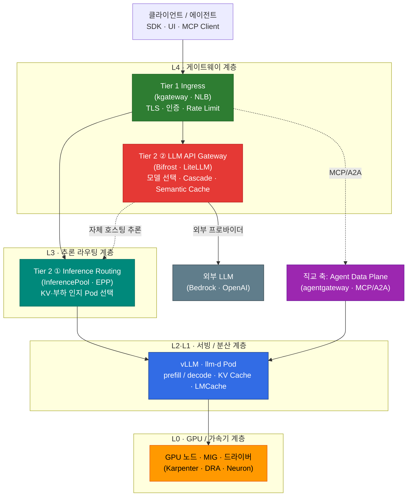

import { DocCard, DocCardGrid } from '@site/src/components/DocCards';
import { TieredGatewayDiagram } from '@site/src/components/GatewayApiTables';

## 개요

이 문서는 **LLM 추론(Inference)이 인프라 레벨에서 어떻게 동작하는지**를 요청 경로 전체에 걸쳐 설명하고, 각 계층에서 무엇을 튜닝할 수 있는지를 한 장의 지도로 정리합니다. 대상 독자는 EKS 위에 추론 플랫폼을 설계·운영하는 플랫폼 엔지니어입니다.

추론 최적화는 단일 기술이 아니라 **여러 계층의 조합**으로 달성됩니다. GPU 노드 배치부터 서빙 엔진의 메모리 관리, 분산 토폴로지, 클러스터 내 라우팅, 게이트웨이 정책, 캐시 계층까지 각 단계마다 고유한 튜닝 레버가 존재합니다. 이 문서는 그 레버를 **계층별로 나열하고 연결**하는 지도 역할을 하며, 각 주제의 상세 내용은 전용 심화 문서로 연결됩니다. 본문은 개념과 연결 관계에 집중하고, 구현·배포 절차는 링크된 문서에서 다룹니다.

## 추론 요청의 전체 경로

LLM 추론 요청은 클라이언트에서 GPU 연산까지 여러 계층을 통과합니다. 각 계층은 서로 다른 책임을 가지며, 어느 계층에서 어떤 결정을 내리느냐에 따라 지연 시간(Latency)과 처리량(Throughput), 비용이 달라집니다.

각 계층의 역할은 다음과 같습니다.

- **L4 게이트웨이**: 외부 트래픽 진입(Tier 1)과 모델 추상화·Cascade·캐싱(Tier 2 ②)을 담당합니다.
- **L3 추론 라우팅**: 자체 호스팅 모델에서 어느 Pod로 보낼지를 KV 캐시·부하를 고려해 결정합니다.
- **L2·L1 서빙/분산**: 실제 토큰을 생성하는 계층으로, prefill/decode 처리와 KV 캐시 관리가 일어납니다.
- **L0 GPU/가속기**: 연산이 실행되는 물리 계층으로, 노드 선택·파티셔닝·드라이버 스택을 다룹니다.

### 두 종류의 라우팅 — 라우팅 ≠ 추론

추론 인프라에는 **성격이 다른 두 개의 라우팅 결정**이 존재하며, 이 둘을 혼동하면 게이트웨이 선택이 어긋납니다.

- **across-model 라우팅 (Tier 2 ②)**: "어느 **모델**로 보낼 것인가"를 결정합니다. 복잡도 기반 Cascade, 비용 추적, 외부 프로바이더 폴백이 여기에 속합니다. Bifrost·LiteLLM 같은 LLM API Gateway가 담당합니다.
- **within-model 라우팅 (Tier 2 ①)**: "같은 모델의 여러 Pod 중 어느 **Pod**로 보낼 것인가"를 결정합니다. KV 캐시 위치와 부하를 실시간 메트릭으로 보고 고릅니다. Gateway API Inference Extension(InferencePool·EPP)이 담당합니다.

두 레이어의 정의와 대응 관계는 [티어드 게이트웨이 아키텍처](./inference-routing/tiered-gateway-architecture.md)와 [라우팅 전략 — 두 개의 라우팅 레이어](./inference-routing/routing-strategy.md#두-개의-라우팅-레이어--반드시-구분)에서 상세히 다룹니다.

## 레이어드 튜닝 모델

추론 성능을 좌우하는 튜닝 레버를 계층별로 정리하면 다음과 같습니다. 각 레버의 상세 동작과 설정은 우측 심화 문서를 참조하세요.

| 계층 | 주요 튜닝 레버 | 영향 지표 | 심화 문서 |
|------|--------------|----------|----------|
| **L0** GPU/가속기 | 인스턴스 선택 · MIG · Time-Slicing · DRA · Neuron | GPU 활용률 · 비용 | [GPU 리소스 관리](./gpu-infrastructure/gpu-resource-management.md) |
| **L1** 서빙 엔진 | PagedAttention · Continuous Batching · FP8 KV · Prefix Caching · Chunked Prefill · Speculative Decoding · 양자화 · TP/PP/EP | TTFT · TPS · 메모리 | [vLLM 모델 서빙](./inference-frameworks/vllm-model-serving.md) · [KV Cache 최적화](./inference-optimization/kv-cache-optimization.md) |
| **L2** 분산 토폴로지 | Prefill/Decode 분리 · NIXL · LWS 멀티노드 | 대형 모델 처리량 | [Disaggregated Serving](./inference-optimization/disaggregated-serving.md) |
| **L3** 추론 라우팅 | KV cache-aware · context-aware · prefix-cache scorer | 캐시 적중률 · P99 | [KV Cache-Aware Routing](./inference-optimization/kv-cache-optimization.md#kv-cache-aware-routing) |
| **L4** 게이트웨이 | 모델 Cascade · 비용 추적 · Rate Limit · L7 한계 보완 | 비용 · 가용성 | [티어드 게이트웨이](./inference-routing/tiered-gateway-architecture.md) · [라우팅 전략](./inference-routing/routing-strategy.md) |
| **L5** 캐시 계층 | KV/Prefix 캐시 · Prompt 캐시 · Semantic 캐시 · LMCache | 캐시 적중률 · 비용 | [LMCache](./inference-optimization/lmcache.md) · [캐시 히트 전략](./inference-optimization/cache-hit-strategy.md) |

:::tip 읽는 순서
하위 계층(L0 GPU)부터 상위 계층(L4 게이트웨이)으로 읽으면 인프라 관점에서, 요청 경로 순서(L4 → L0)로 읽으면 트래픽 관점에서 이해하기 쉽습니다. 성능 지표(TTFT·TPS·캐시 적중률)와 3-Tier 권장 구성은 [추론 최적화 개요](./inference-optimization/index.md)를 참조하세요.
:::

## 인퍼런스 게이트웨이의 역할과 기능

"추론 게이트웨이(Inference Gateway)"는 단일 컴포넌트가 아니라 서로 다른 책임을 가진 여러 계층의 묶음입니다. 플랫폼 전역에서는 클러스터 내 추론 Pod 라우팅과 외부 LLM 프로바이더 프록시를 명시적으로 구분합니다.

<TieredGatewayDiagram />

| 계층 | 역할 | 대표 구현체 |
|------|------|------------|
| **Tier 1** Ingress | 외부 트래픽 수신, TLS 종료, 인증, Rate Limiting | kgateway · AWS LBC · Envoy Gateway |
| **Tier 2 ①** Inference Routing | 클러스터 내 추론 Pod 선택(KV·부하 인지) | Gateway API Inference Extension |
| **Tier 2 ②** LLM API Gateway | 모델 추상화, Cascade, 비용 추적, Semantic Caching | Bifrost · LiteLLM · OpenRouter |

각 계층의 역할 정의와 솔루션 선정 기준은 [티어드 게이트웨이 아키텍처](./inference-routing/tiered-gateway-architecture.md)에, 솔루션 비교와 Cascade·Semantic 전략은 [라우팅 전략](./inference-routing/routing-strategy.md)에 정리되어 있습니다.

## 기존 L7 게이트웨이의 한계

범용 L7 게이트웨이(NGINX·기본 Envoy 등)는 HTTP 요청을 stateless로 분배하도록 설계되어, LLM 추론 트래픽의 특성을 인지하지 못합니다. 이로 인해 다음과 같은 한계가 발생합니다.

- **Round-Robin이 Prefix Cache를 무력화**: 동일 시스템 프롬프트를 공유하는 요청이 매번 다른 Pod로 분배되면, 각 Pod가 같은 prefill 연산을 반복합니다. 결과적으로 KV 캐시 재사용률이 떨어지고 TTFT가 증가합니다.
- **토큰 단위 과금·스트리밍 미인지**: L7 게이트웨이는 요청 수 기준으로만 부하를 판단해, 토큰 길이에 비례하는 실제 연산 비용을 반영하지 못합니다.
- **모델 서버 메트릭 부재**: KV 캐시 사용량, 대기 큐 깊이(queue depth) 같은 추론 엔진 내부 상태를 알지 못해, 부하가 몰린 Pod로도 요청을 보냅니다.

이 한계를 해결하기 위해 KV·부하를 인지하는 별도의 추론 라우팅 계층(Tier 2 ①)이 필요합니다. 상세 근거는 [KV Cache 최적화 — 기존 문제: Round-Robin의 한계](./inference-optimization/kv-cache-optimization.md#기존-문제-round-robin의-한계)와 [라우팅 전략 — 두 개의 라우팅 레이어](./inference-routing/routing-strategy.md#두-개의-라우팅-레이어--반드시-구분)를 참조하세요.

## prefill / decode / Disaggregated Serving

LLM 추론은 입력 프롬프트를 한 번에 처리하는 **prefill 단계**와, 토큰을 하나씩 생성하는 **decode 단계**로 나뉩니다. 두 단계는 연산 특성이 달라(prefill은 연산 집약적, decode는 메모리 대역폭 집약적), 같은 GPU에 함께 두면 서로의 효율을 떨어뜨립니다.

**Disaggregated Serving**은 prefill과 decode를 별도의 GPU 그룹으로 분리하고, 그 사이의 KV 캐시를 NIXL 같은 전송 엔진으로 옮기는 아키텍처입니다. 700B+ 대형 MoE 모델은 LWS(LeaderWorkerSet) 기반 멀티노드 배포와 결합합니다. 상세 아키텍처와 GLM-5 배포 예제는 [Disaggregated Serving](./inference-optimization/disaggregated-serving.md)에, AWS 관리형 구현은 [HyperPod Inference Operator — Disaggregated Prefill/Decode](./inference-frameworks/hyperpod-inference-operator.md#disaggregated-prefilldecode-dpd)에 정리되어 있습니다.

## Context-aware routing

context-aware 라우팅은 요청의 **내용·복잡도**를 보고 적절한 모델·경로를 고르는 전략입니다. 단순 질의는 경량 모델로, 복잡한 추론은 대형 모델로 보내 비용과 품질을 균형 잡습니다.

- **LLM Classifier**: 요청을 복잡도 티어로 분류해 라우팅
- **RouteLLM**: MF(Matrix Factorization) 분류기로 모델 선택
- **vLLM Semantic Router**: 의미 기반 라우팅

상세 구현과 평가 결과는 [라우팅 전략 — Request Cascading: 지능형 모델 라우팅](./inference-routing/request-cascading.md)을 참조하세요. 의미 기반 캐시와의 관계는 [Semantic Caching 전략](./inference-optimization/semantic-caching-strategy.md)에서 다룹니다.

## KV cache-aware routing

KV cache-aware 라우팅은 같은 모델의 여러 Pod 중에서 **요청의 prefix와 일치하는 KV 캐시를 이미 보유한 Pod**로 보내는 전략입니다. prefill 재연산을 피해 TTFT를 줄이고 처리량을 높입니다.

- **prefix-cache scorer**: 각 Pod의 prefix 캐시 보유 상태를 점수화
- **EPP(Endpoint Picker)**: ext-proc로 위임받아 최적 Pod 선택
- **llm-d vs NVIDIA Dynamo**: 구현 방식과 KV 오프로딩 계층이 다름

상세 비교는 [KV Cache 최적화 — KV Cache-Aware Routing](./inference-optimization/kv-cache-optimization.md#kv-cache-aware-routing)과 [라우팅 전략 — EPP 정확한 정의](./inference-routing/routing-strategy.md#eppendpoint-picker-정확한-정의)를 참조하세요.

## LMCache

**LMCache**는 KV 캐시를 GPU 메모리 너머 CPU·디스크 계층으로 오프로딩하고, 여러 추론 인스턴스 간에 공유하는 KV 캐시 계층입니다. vLLM의 in-GPU prefix cache가 한 Pod 안에서만 유효한 것과 달리, LMCache는 Pod·노드를 넘어 KV 캐시를 재사용할 수 있게 해 `kvaware` 라우팅의 효과를 확장합니다.

개념·계층 구조·vLLM/NIXL과의 관계는 [LMCache](./inference-optimization/lmcache.md) 문서에서 다룹니다.

## 캐시 히트 전략

추론 캐시는 단일 계층이 아니라 **세 계층**으로 나뉘며, 각각 적중 조건과 효과가 다릅니다.

| 캐시 계층 | 적중 조건 | 효과 |
|----------|----------|------|
| **KV / Prefix 캐시** | 동일 prefix(시스템 프롬프트 등) | prefill 재연산 회피, TTFT 감소 |
| **Prompt 캐시** | 완전 동일 요청 | 전체 추론 회피 |
| **Semantic 캐시** | 의미적으로 유사한 요청(임베딩 유사도) | 유사 질의 추론 회피 |

각 계층의 히트율을 어떻게 높이고 어디서 측정하는지를 통합한 의사결정 프레임은 [캐시 히트 전략](./inference-optimization/cache-hit-strategy.md)에서 다룹니다. Semantic 캐시의 임계값 설계는 [Semantic Caching 전략](./inference-optimization/semantic-caching-strategy.md)을, Prefix 캐시 효과는 [KV Cache 최적화](./inference-optimization/kv-cache-optimization.md)를 참조하세요.

## 다음 문서

<DocCardGrid columns={3}>
  <DocCard
    to="/docs/agentic-ai-platform/model-serving/inference-optimization"
    icon="⚡"
    title="추론 최적화 & 라우팅"
    description="KV Cache·Disaggregated Serving·LMCache·캐시 히트 전략과 게이트웨이 라우팅 심화."
    color="#00897b"
  />
  <DocCard
    to="/docs/agentic-ai-platform/model-serving/inference-frameworks"
    icon="🚀"
    title="추론 프레임워크"
    description="vLLM PagedAttention·Multi-LoRA, llm-d 분산 추론, MoE·NeMo."
    color="#ff6b6b"
  />
  <DocCard
    to="/docs/agentic-ai-platform/model-serving/gpu-infrastructure"
    icon="🖥️"
    title="GPU 인프라"
    description="EKS GPU 노드 전략, Karpenter·KEDA·DRA, NVIDIA·Neuron 스택."
    color="#326ce5"
  />
</DocCardGrid>

## 참고 자료

### 공식 문서
- [Gateway API Inference Extension](https://gateway-api-inference-extension.sigs.k8s.io/) — 클러스터 내 추론 라우팅(InferencePool·EPP) 표준
- [vLLM Documentation](https://docs.vllm.ai/) — vLLM 서빙 엔진 공식 가이드

### 논문 / 기술 블로그
- [PagedAttention (SOSP 2023)](https://arxiv.org/abs/2309.06180) — vLLM KV 캐시 관리 논문
- [DistServe (OSDI 2024)](https://arxiv.org/abs/2401.09670) — Prefill/Decode 분리(Disaggregated Serving) 연구

### 관련 문서 (내부)
- [추론 최적화 개요](./inference-optimization/index.md) — TTFT·TPS 등 핵심 지표와 3-Tier 권장 구성
- [티어드 게이트웨이 아키텍처](./inference-routing/tiered-gateway-architecture.md) — 게이트웨이 계층 단일 정의
- [KV Cache 최적화](./inference-optimization/kv-cache-optimization.md) — vLLM 심화와 KV Cache-Aware Routing
